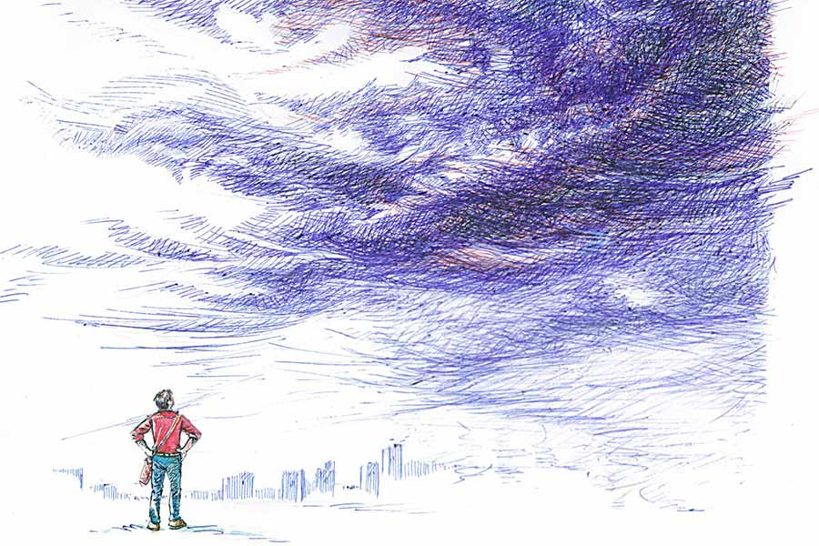

 
 <h1 align=center>বৃষ্টির কাছে</h1>
<h2 align=center>আর্যভট্ট খান</h2> 

অফিসের আটতলার করিডরে জানালা দিয়ে উঁকি দিতে রাহুল দেখল, ও পারে গাছ, রাস্তা, দোকানপাট, মানুষজন, গাড়ি স্নান করেছে।

বৃষ্টি নেমেছিল!

রাহুলের মন খারাপ হয়ে গেল। অফিসের বদ্ধ ঘরে বসে এসির মধ্যে কিছুই টের পায়নি সে। আটতলার সাউন্ডপ্রুফ অফিসের মধ্যে বসে কাজ করলে বাইরে বৃষ্টি পড়ুক বা বোমা, কিছু টের পাওয়া যায় না। রাহুল তাই মাঝেমধ্যেই তার সহকর্মীদের বলে, “বোঝা যায় না কোথায় কাজ করছি। কলকাতার ক্যামাক স্ট্রিট, না মুম্বইয়ের জুহু, নাকি আমেরিকার শিকাগোয়।”

সহকর্মী রাজু বলে, “তোমার মন যাতে বিক্ষিপ্ত না হয়ে যায়, তাই তো এই ব্যবস্থা করেছে কোম্পানি। বাইরে কী হচ্ছে কিছুই টের পাবে না।”

একটি বেসরকারি ব্যাঙ্কের মিউচুয়াল ফান্ড বিভাগে কাজ করে রাহুল। বাইরের লোক আসে কম। ব্যাঙ্কের জানালা সব এসির জন্য বন্ধ। জানালায় ঝোলে ভারী পর্দা। রাহুলের মনে হয়, প্রতিদিন আট ঘণ্টার এসি কারাগারে বসে কাজ করতে হচ্ছে তাকে। একটা টিভি পর্যন্ত চলে না।

লিফ্টের অপেক্ষা না করে আটতলা থেকে তরতর করে সিঁড়ি দিয়েই নীচে নেমে এল রাহুল। সিঁড়ি দিয়ে নেমে বাইরে বেরোতেই ভেজা প্রকৃতি যেন ঝাপটা মারল চোখে-মুখে। বদ্ধ ঘরের এসি থেকে সোজাসুজি একদম বাইরের বৃষ্টিভেজা খোলা হাওয়া! যেন একেবারে সমুদ্রের ধারে এসে দাঁড়িয়েছে রাহুল! শুধু সামনে সমুদ্রের বদলে ক্যামাক স্ট্রিটের ব্যস্ত রাস্তা।

কয়েক দিন টানা চল্লিশ-বিয়াল্লিশ ডিগ্রি তাপপ্রবাহের পর কখন যেন মেঘ এসে শহরকে ভিজিয়ে দিয়ে গেছে। বহু প্রতীক্ষার এই বৃষ্টি দেখতে না পেয়ে, বৃষ্টিতে একটু ভিজতে না পেরে রাহুলের মন খারাপ হয়ে গেল। অফিসের সামনে খিটখিটে চা-ওয়ালা বাবুদারও মুখটা প্রসন্ন দেখাচ্ছে বৃষ্টিতে ভিজে। রাহুলের মনে হল, তারই শুধু ভেজা হল না।

বৃষ্টি থেমে গেলেও রাস্তার উপর সোনালি গয়নার নকশার মতো জল গড়িয়ে পড়ছে। রাহুলের পাশ দিয়ে চলে গেল বৃষ্টিতে ঝুপ্পুস ভেজা তাদের অফিসের বেয়ারা দীনেশ।

বৃষ্টিতে ভেজার আর উপায় নেই। বৃষ্টি পালিয়েছে। রাহুলও ঠিক করল, এ বার সে-ও অফিস থেকে পালাবে। অফিসের সময়ও প্রায় শেষ হয়ে এসেছে। আর মিনিট পনেরো... আজ নয় পনেরো মিনিট আগেই বেরোবে।

কোথায় যাওয়া যায়, ভাবল রাহুল। প্রতিদিন অফিসের পরে সে বেকার। বন্ধুবান্ধব কমে আসছে। স্টেডি গার্লফ্রেন্ডও নেই। কাটা ঘুড়ির মতো ঘুরতে ঘুরতে অফিস ছুটির পর বাড়ি ফিরতেও ইচ্ছে করে না।

সে ফোন করল পুরনো বন্ধু অনিমেষকে। শ্যামবাজারে থাকে সে। ফোনের ও পারে অনিমেষের গলায় উচ্ছ্বাস, “চলে আয়, চলে আয়! এখানে খুব বৃষ্টি। একেবারে আবগারি ওয়েদার। হীরক, শ্যামলকেও ডেকে নিচ্ছি। আমার ফ্ল্যাট ফাঁকা আছে।”

রাহুল জিজ্ঞেস করল, “এখনও বৃষ্টি হচ্ছে?”

অনিমেষ বলল, “মুষলধারে বৃষ্টি হচ্ছে। এত দিন পরে বৃষ্টি নামল। আমি ছাদে গিয়ে একটু ভিজলামও। তুইও তাড়াতাড়ি চলে আয়। ভিজতে পারবি। বাড়ি ফেরার সময় আমার শুকনো জামা পরে চলে যাবি।”

রাহুল দ্রুতপায়ে লিফ্ট ধরে উপরে উঠে ওদের ম্যানেজারকে বলল, “ব্যানার্জিদা, আজ পনেরো মিনিট আগে বেরিয়ে যাচ্ছি।”

ব্যানার্জিদা হ্যাঁ বা না কিছু বললেন না। শুধু এক বার উপরের দিকে চাইলেন। রাহুল উত্তরের অপেক্ষা করল না। ব্যানার্জিদাকে ইনফর্ম করা হয়ে গেছে, এ বার সে বেরিয়ে যাবে।

রাস্তায় বেরিয়ে মনটা ভাল হয়ে গেল রাহুলের। বন্ধুদের সঙ্গে বোতল খোলার প্ল্যানের জন্য নয়, ক্যামাক স্ট্রিটে ভিজতে পারেনি, কিন্তু শ্যামবাজারে পারবে, এটা চিন্তা করে।

রাহুল ময়দান মেট্রো স্টেশনে নামতেই শোঁ করে একটা দমদমগামী মেট্রো চলে এল। মনে হল মেট্রোটাও যেন তাকে বৃষ্টিতে ভেজার জন্যই নিতে এসেছে!

শ্যামবাজারে নেমে দুটো সিঁড়ি টপকে টপকে মাটির উপরে উঠে ফের হতাশ রাহুল।

বৃষ্টি থেমে গেছে শ্যামবাজারেও। সামনে বৃষ্টিভেজা রাস্তা। বৃষ্টিতে স্নান করেছেন পাঁচমাথার মোড়ের নেতাজি আর তাঁর ঘোড়াও। রাস্তার লাইটগুলো সবে জ্বলে উঠে হিরের কুচির মতো আলো ছড়াচ্ছে।

“কী মিস করলি তুই! জাস্ট পাঁচ মিনিট আগে বৃষ্টি থামল...” অনিমেষ বোতল খুলতে খুলতে বলল, “হীরক, শ্যামলরাও চলে এসেছে।”

রাহুল বলল, “আমি বৃষ্টির কিছু টেরই পেলাম না। আমাদের অফিসের লোকগুলো যেন সব গাধা। কেউ কিছু জানতেও পারল না।”

অনিমেষ বলল, “চিন্তা নেই। আমরা তো আর মরুভূমিতে থাকি না। বর্ষাকাল তো এসে গেল প্রায়। পরের বৃষ্টিতে ভিজবি।”

রাহুল বলল, “সে তো ঠিক আছে। কিন্তু এত দিন প্রতীক্ষার পর প্রথম বৃষ্টিটাই তো দেখা হল না।”

অনিমেষ বলল, “এসি অফিসে কাজ করো বস। এত এত টাকা মাইনে পাও, কিছু তো মিস হবেই।”

কিছুটা গুম মেরে পেগে চুমুক দিচ্ছিল রাহুল। তার পর বলল, “আমার ভাগ্যটাই খারাপ।”

অনিমেষ পেগে একটা চুমুক দিয়ে একটু মুচকি হেসে হেঁয়ালি করে বলল, “সত্যিই তোর ভাগ্য খারাপ। কোনও বৃষ্টিই তোর কাছে ধরা দিতে চায় না। সে মেঘ থেকে ঝরে পড়া বৃষ্টিই হোক বা রক্তমাংসের বৃষ্টি।”

পাশ থেকে হীরক বলল, “কেন রাহুলের কাটা ঘায়ে নুনের ছিটে দিচ্ছিস! কলেজে তো বৃষ্টিকে ভাল লাগার কথা রাহুল মুখ ফুটে বলতেই পারল না। তার আগেই ও সৌভিকের সঙ্গে ঝুলে পড়ল।”

অনিমেষের নেশা হয়ে গেছিল। একটু জোরে জোরে বলল, “পুরো দোষ রাহুলের। এত ইগো নিয়ে থাকলে কী করে হবে। আরে নিজের কথাটা তো বলতে হবে। বৃষ্টি কি জ্যোতিষী, যে বুঝে যাবে? যদি বুঝেও থাকে তা হলেও রাহুলকে আগে এগোতে হবে। তবে এখন আর সম্ভব নয়। বৃষ্টির সঙ্গে সৌভিকের স্টেডি রিলেশন হয়ে গেছে।”

রাহুল বলল, “এখন আর দোষ-গুণ বিচার করে কী হবে।”

হীরক জিজ্ঞেস করল, “তোর সঙ্গে আর যোগাযোগ নেই?”

রাহুল বলল, “না। তবে কমন বন্ধুদের সঙ্গে দেখা হলে বৃষ্টির সঙ্গে দেখা হয়ে যায় কখনও সখনও।”

মোবাইল ফোন বেজে উঠেছে। রাহুল দেখল, মা ফোন করেছে।

ও প্রান্ত থেকে মা উদ্বিগ্ন ভাবে বললেন, “ছাতা নিয়ে যাসনি, ফিরবি কী করে। এখানে তো বৃষ্টি হয়েই চলেছে। একটু জলও জমে গেল।”

অনিমেষ বললো, “কী হল? তোদের বাড়ি, মানে নাকতলার দিকে বৃষ্টি হচ্ছে?”

রাহুল বেজার মুখে বলল, “হুঁ। তবে আমি গিয়ে পৌঁছতে পৌঁছতে থেমে যাবে শিয়োর।”

অনিমেষ, হীরক, শ্যামল হো হো করে হেসে উঠল।

অনিমেষ হাসতে হাসতে বলল, “তবু তুই এক বার ট্রাই নিয়ে দেখতে পারিস। আজ বৃষ্টিতে শহরের সবাই ভিজল। একমাত্র তুই বাদ। চেষ্টা কর বৃষ্টিকে ধরতে।”

রাহুল উঠে বলল, “দু’পেগ খেয়ে নিয়েছি। আর নয়। আমি চললাম। নাকতলায় গিয়ে যদি বৃষ্টি পাই, তা হলেই বা মন্দ কী।”

অনিমেষ গ্লাসটা চিয়ার্সের ভঙ্গি করে বলল, “তুই এত প্রকৃতিপ্রেমী হয়ে উঠলি কবে থেকে ভাই?”

মেট্রোর দৌলতে শ্যামবাজার থেকে নাকতলা যেতে আধঘণ্টা মতো লাগল রাহুলের। নাকতলা পৌঁছে রাহুল ফের হতাশ। এখানেও বৃষ্টি থেমে গেছে। বৃষ্টি শুধু থেমেই যায়নি, আকাশে তারাও দেখা যাচ্ছে। একটা দীর্ঘনিঃশ্বাস ফেলে রাহুল ঘরে ঢুকল।

খেতে বসে রাহুলের মা বলল, “কাল অফিসে ছাতা নিয়ে যাস। টিভির খবরে বলছিল কালকেও নাকি খুব বৃষ্টি হবে।”

*****

খবরে বৃষ্টির সম্ভাবনার কথা বললেও সকাল থেকে ঠা ঠা রোদ্দুর উঠেছে। ছাতা নেওয়ার প্রশ্নই নেই। আর বৃষ্টি হলে তো এ বারের বর্ষার প্রথম বৃষ্টিতে ভিজবে, এটা রাহুল আগে থেকেই ঠিকই করে নিয়েছিল।

অফিসে পৌঁছে, বেয়ারা সুখেনকে বলে দিল, “এই শোন, আমরা তো ভিতর থেকে বুঝতে পারি না। তুই তো প্রায়ই বাইরে যাস। বাইরে বৃষ্টি হলে আমাকে বলিস তো।”

সুখেন গম্ভীর হয়ে বলল, “এখন আর বৃষ্টি কোথায়! রোদ্দুরে বাইরে বেরোনো যাচ্ছে না।”

রাহুল বললো, “আজও নামতে পারে। চোরাগোপ্তা বৃষ্টি নামলেও আমাকে জানাস।”

রাহুলের পাশ থেকে সহকর্মী ধ্রুব বলে উঠল, “চোরাগোপ্তা বৃষ্টি কখন, কী ভাবে নামে একটু বুঝিয়ে দেবেন সেন সাহেব?”

রাহুল শুধু একটু মুচকি হেসে বলল, “সে আপনি বুঝবেন না।”

দুপুর পর্যন্ত সব খটখটে। দুপুরে বাইরে লাঞ্চ খেতে এসে রাহুল বুঝল, এই কাঠপোড়া রোদ্দুরে দাঁড়ানো যাচ্ছে না। কিছু খেয়েই অফিসে এসির মধ্যে চলে যেতে হবে।

তখনই এল বৃষ্টির ফোনটা।

ফোনের ও পারে বৃষ্টি! রাহুলের মনে হল, কেন বৃষ্টি এত দিন পরে ফোন করছে ওকে?

রাহুল ফোনটা একটু বাজতে দিয়ে ধরল।

বৃষ্টি বলল, “কী করছ তুমি আজ বিকেলে? আজ সন্ধেয় এক বার একটু আসতে পারবে?”

রাহুল বলল, “কোথায় আসব? কেন আসব?”

বৃষ্টি বলল, “পার্ক স্ট্রিটের মোকাম্বোতে এসো। এলে আমার খুব ভাল লাগবে। আমাদের বেশ কিছু বন্ধু থাকবে। একটা পার্টি দিচ্ছি।”

রাহুল বলল, “কিসের পার্টি?”

বৃষ্টি বলল, “রাহুল, আমার বিয়ে। সৌভিকের সঙ্গে, আগামী মাসে। সৌভিক জবলপুরে একটা চাকরি পেয়েছি। আমরা কলকাতা ছেড়ে চলে যাচ্ছি জবলপুর। তার আগে আমার বন্ধুদের সঙ্গে একটা দেখা করে পার্টি দিচ্ছি। চলে এসো অফিসের পরে সাতটা নাগাদ।”

রাহুল বলল, “ঠিক আছে, যাব।”

ও পার থেকে বৃষ্টি বলল, “আমরা সবাই সাতটার সময় মোকাম্বোতে চলে আসছি। তোমার জন্য সবাই অপেক্ষা করব।”

ফোন কেটে গেল।

বৃষ্টির শহর থেকে চলে যাওয়ার খবর শুনে রাহুলের মনে হল, শহরটা যেন আরও বেশি শুকিয়ে গেল। উপরের দিকে তাকিয়ে দেখল গাঢ় নীল আকাশ থেকে তীব্র রোদ্দুর শহরের বুকে নামছে, বৃষ্টিতে ভিজতে চাওয়া এক মানুষের কাছে নিষ্ঠুর বিদ্রুপের মতো।

*****

অফিসের পরে বৃষ্টির সঙ্গে দেখা সেরে গীতাঞ্জলি স্টেশনে যখন রাহুল নামল, তখন রাত সাড়ে দশটা বেজে গেছে। আজ পেটে তিন পেগ হুইস্কি। স্টেশন থেকে ধীর পায়ে রাস্তায় উঠল। আজকে আর রিকশা নিল না।

মোকাম্বোতে বৃষ্টিকে সৌভিকের সঙ্গে কত খুশি দেখাচ্ছিল। বৃষ্টির জন্য বুকের ভিতর পাথর চাপার মতো কষ্ট চেপে ওই পার্টিতেও রাহুল অভিনয় করে গেল। বৃষ্টি সেটা বুঝল কি বুঝল না, কে জানে। পার্টির শেষে বৃষ্টি রাহুলকে বলল, “নেমন্তন্ন করব, বিয়েতে কিন্তু আসতেই হবে।”

মোকাম্বোতে বৃষ্টি আর সৌভিক-সহ সাত জন বন্ধুর ভিড়ে মিশে ছিল রাহুল। এখন বাড়ি ফেরার পথে সে একা। নিজের মুখোমুখি। আজ রাস্তাটা খুব নির্জন।

রাহুলের মনে হল, বৃষ্টির সঙ্গে নিয়মিত দেখা হত না। কথাও হত না। শুধু মনের মধ্যে বৃষ্টির জন্য একটা ভাল-লাগা ছিল। মনে হত এই শহরেই তো বৃষ্টি আছে। হঠাৎ দেখা হয়ে যাবে হয়তো কোনও দিন। হয়তো সে দিন ও বুঝতে পারবে, রাহুল ওকে এখনও কতটা... বৃষ্টির সঙ্গে দেখা হলেই মন ভাল হয়ে যেত রাহুলের।

এখন আর সেটা সম্ভব নয়। বৃষ্টি শহর থেকে দূরে চলে যাচ্ছে।

দেরি হয়ে গেছে। তাড়াতাড়ি পা চালাচ্ছিল রাহুল। বুকের ভিতরটা খাঁ খাঁ করছিল।

হঠাৎ তার হাতের উপর একটা জলের ফোঁটা পড়ল। খেয়াল করেনি রাহুল, আকাশে ফের ঘন কালো মেঘ জমেছে। বড় বড় বৃষ্টির ফোঁটা পড়তে শুরু করেছে।

কয়েক সেকেন্ডের মধ্যে বেশ জোরে বৃষ্টি পড়তে শুরু করে দিল। রাহুল বৃষ্টিতে বাড়ির দিকে তার গতি না বাড়িয়ে আস্তে করে দিল।

ফোন করল রাহুলের মা, “কোথায় তুই? বৃষ্টি শুরু হল যে।”

রাস্তার ধারে সরে এসে জল বাঁচিয়ে ফোন ধরে রাহুল বলল, “আমার একটু দেরি হবে মা। কাছেই আছি। বৃষ্টিতে ভিজছি।”

মাঝরাস্তায় নেমে এসে তুমুল বৃষ্টিতে ভিজতে ভিজতে রাহুলের মনে হল, বৃষ্টি কোথাও যায়নি। তার কাছেই আছে। তাকে ঘিরে আছে। তার সব ক্লান্তি, অবসাদ আর দুঃখ ধুয়ে-মুছে দিয়ে ঝরে চলেছে নিরন্তর।

