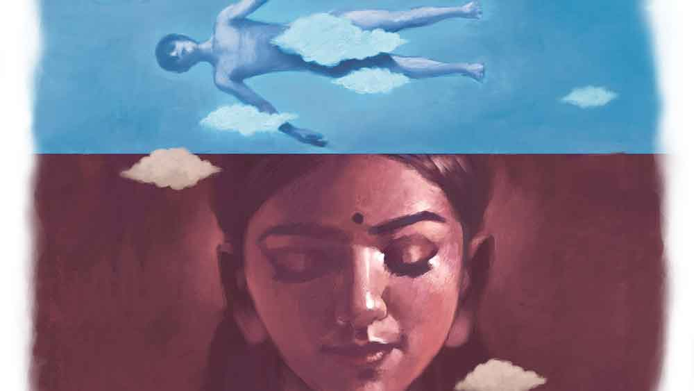

 
 <h1 align=center>বেঁচে থাকা</h1>
<h2 align=center>শতরূপা ভট্টাচার্য</h2> খবরটা পেয়ে জ্ঞান হারায় পারমিতা। মানুষটা তো সাত জন্ম পাশে থাকার প্রতিশ্রুতি দিয়েছিল! তা হলে কি এখন মাত্র তিন বছরের সান্নিধ্যটুকুই পুঁজি করেই বাঁচতে হবে পারমিতাকে! এই বাড়িতে এখন ওকে কে সান্ত্বনা দেবে, যাঁরা তাঁদের একমাত্র সন্তানকে হারিয়েছেন? না কি সেই অভাগা সন্তান, যার বাবা জানতেই পারল না যে, তার সন্তান পারমিতার গর্ভে?

এই তো সে দিন সকালে ১৫ অগস্ট উপলক্ষে, পারমিতা যখন সমুদ্রকে বলল, “এই সমু, আমার নাচের ভিডিয়োটা করে দে তো।”

উত্তরে সমুদ্র বলল, “তোর এই ধেই-ধেই করে নাচার ভিডিয়ো করতে করতেই আমি মরে যাব দেখিস।”

তখনও পারমিতা বোঝেনি যে, এটাই তাদের শেষ খুনসুটি। এটাই পারমিতার শেষ নাচের ভিডিয়ো হতে চলেছে, যেটা ফেসবুকে দেওয়ার সময় কার্টেসিতে সমুদ্রের নামটা জ্বলজ্বল করবে।

নাচের ভিডিয়ো শেষ হতেই সমুদ্র তার বাইক নিয়ে বেরিয়ে পড়েছিল অফিসের উদ্দেশে। করোনার জন্য লকডাউন, তাতে কী! স্বাধীনতা দিবসেও তার অফিসে ঢের কাজ, পতাকা উত্তোলন তো ম্যান্ডেটরি, সঙ্গে আরও নানা ঝামেলা-ঝঞ্ঝাট… হাতে গোনা যাবে না কি!

পারমিতা নাচ শেষ করে খুব ক্লান্ত হয়ে পড়ল। সমুদ্রর ‘আমি আসছি রে’-টাও ঠিকমতো শুনতে পায়নি। ওর শরীরটা তখন খুব খারাপ করছে, মাথাটা কেমন ঘুরছে, খুব হাঁপও ধরছে। কোনও দিন এ রকম হয় না তো? প্রফেশন্যাল ডান্সিং কয়েক বছর হল সে ছেড়ে দিয়েছে, কিন্তু তা বলে এতটা আনফিট হয়ে গেল না কি?

খটকা লাগে পারমিতার। করোনা টেস্ট তো করা যাবে না এই মুহূর্তে, কিন্তু অন্য টেস্টটা সহজেই করা যাবে। আগেও এক বার করেছিল, সে বার নেগেটিভ ছিল। এ মাসেও পিরিয়ড মিস হয়েছে। চটপট নাচের ড্রেস ছেড়ে বাথরুমে ঢোকে পারমিতা। ক্লান্তিটা পলকে উবে যায় কিটের দুটো লাল দাগ দেখে। তার পর এক ছুটে বেরিয়ে আসে উচ্ছ্বসিত হয়ে, সে মা হতে চলেছে!

ফোন লাগায় সমুদ্রকে। তার বহু আকাঙ্ক্ষিত কন্যাসন্তান শীর্ষা কি আসতে চলেছে? পারমিতার সঙ্গে প্রায়ই ঝগড়া করত সমুদ্র। বিরক্ত হয়ে পারমিতা বলত, “মেয়েই যে হবে তুমি কী করে জানলে? ছেলে হয় যদি?”

সমুদ্র দৃঢ় কণ্ঠে বলত, “মেয়েই হবে, আর আমি দুই মহীয়সী রমণীকে দু’পাশে নিয়ে বসে থাকব।”

ফোনটা সুইচড অফ বলছে কেন? খারাপ চিন্তারা মাথায় ভিড় করতে শুরু করে পারমিতার। সমুদ্র তো ফোন বন্ধ করে না। খানিক ক্ষণ পর সমুর মা কাঁদতে কাঁদতে এসে অনেক কিছু বলে গেলেন। কিছুই মাথায় ঢুকল না পারমিতার। কী সব বলছেন কি তিনি?

সমুদ্রর বাবা, ওর এক বন্ধু আর নিজের বাবার সঙ্গে একটি বেসরকারি নার্সিংহোমে গিয়ে পারমিতা যখন পৌঁছল, তখন ওর জগৎ তোলপাড় হয়ে গেছে। অফিসে যাওয়ার সময় তাড়াহুড়োয় হেলমেট নিতে ভুলে গেছিল সমুদ্র। ভেজা রাস্তায় গাড়ি স্কিড করে মাথায় ভীষণ চোট পেয়েছে, ইনটার্নাল হেমারেজ। এক্ষুনি অপারেশন করে ডাক্তাররা শেষ চেষ্টা করে দেখবেন। শেষ চেষ্টা!

মানুষটা তাকে ছেড়ে চলে যাবে না তো? না... না... কিছুতেই না। তাকে এই পৃথিবীতে বাঁচিয়ে রাখতেই হবে, নিজের জন্য না হোক, তাদের আগত সন্তানের জন্য… তাদের শীর্ষার জন্য। নিজেই নিজের হাতটা চেপে ধরে পারমিতা। তার পাশে এখন তাকেই তো দাঁড়াতে হবে।

দীর্ঘ আট ঘণ্টা অপারেশনের পরও সমুদ্রের জীবনের ঢেউ স্তিমিত হল। ব্রেন ডেথ। বাড়ির বড়দের অবস্থা তখন চোখে দেখা যায় না। সেই মুহূর্তে পারমিতা ডাক্তারদের ঘরে প্রবেশ করল।

এই কয়েক ঘণ্টায় পরিচিত হয়ে যাওয়া এক ডাক্তারকে বলল, “ডাক্তারবাবু, আমার হাজ়ব্যান্ডের অরগ্যান ডোনেট করা যাবে?”

ডাক্তার রায় বলেন, “হ্যাঁ। অবশ্যই করা যাবে। ইন ফ্যাক্ট আমরা ব্যাপারটা বলতেই চাইছিলাম। কিন্তু আপনাদের কাকে যে অ্যাপ্রোচ করব, ভেবে পাচ্ছিলাম না আমরা।”

চোয়াল শক্ত করে নিজের ফোনটার দিকে তাকায় পারমিতা। মোবাইলের ওয়ালপেপারে থাকা সমুদ্রের হাসিমুখটা দেখে চোখে জলের বাঁধ ভাঙে। নিজেকে সংযত করে পারমিতা বলল, “সেই ব্যবস্থাই করুন ডাক্তারবাবু। আমি কনসেন্ট দিলাম, সমুদ্রর স্ত্রী হিসেবে।”

শোকে মুহ্যমান সমুদ্রর মা-বাবা পারমিতার সিদ্ধান্তে সম্মতি জানানো বা আপত্তি করার মতো অবস্থায় ছিলেন না সে দিন।

তার পরের ঘটনাটা অনেকেরই জানা। দু’-তিন দিন ধরে সমস্ত গণমাধ্যমের শিরোনামে ছিল সমুদ্র। তবুও এখন অনেক ঘটনার ভিড়ে চাপা পড়ে গেছে হয়তো। করোনা অতিমারি ও লকডাউনের মধ্যে গ্রিন করিডরের মাধ্যমে সমুদ্রর দু’টি চোখ, দু’টি কিডনি, যকৃৎ, হৃৎপিণ্ড এমনকি ত্বকও সফল ভাবে রাজ্যের ও পার্শ্ববর্তী রাজ্যের বিভিন্ন গ্রহীতাকে দান করার ব্যবস্থা করা হয়। স্ত্রী হিসেবে পারমিতাকেই সমস্ত ফর্মালিটি পূরণ করতে হয়। নাওয়া-খাওয়া ভুলে শুধুই ছুটে চলা, দিনের চব্বিশটা ঘণ্টা সে দিন যেন কাটতেই চাইছিল না।

পারমিতার বাবা দু’চোখের জল চোখে নিয়েই দেখছিলেন তার মা-মরা মেয়েটার মনের জোর। সমুদ্রর মাকে সামলাতেও কার্পণ্য করেনি তার মেয়ে। সমুদ্র তার জীবনকে ভাসিয়ে চলে গেছে ঠিকই, কিন্তু পারমিতা তার ভালবাসার মানুষটার পরিবারকে না ভাসতে দেওয়ার প্রতিজ্ঞা করল।

বাড়ির মানসিক অবস্থার উন্নতি করতেই পারমিতা তার আসন্ন মাতৃত্বের খবর দিল সবাইকে। বাড়ির এবং পাড়া-প্রতিবেশীর মধ্যে মিশ্র প্রতিক্রিয়া লক্ষ করল সে। কেউ বলে, “যাক বাবা। মেয়েটা তাও সমুর সন্তানকে বুকে নিয়েই বেঁচে থাকতে পারবে। ভগবান আছেন।” আবার কেউ বলে, “মেয়েটার কপাল কী খারাপ! এখনই বাচ্চাটা আসতে হল? মেয়েটা যে আবার বিয়ে করে নতুন করে জীবন শুরু করবে, তাও পারবে না। কতই বা বয়স ওর। ওই বাচ্চার জন্য আর কি বিয়ে হবে?”

কেউ কেউ তো আবার এখনও না-জন্মানো বাচ্চাটাকে রাক্ষসের সঙ্গেও তুলনা করে ফেলল।

পারমিতা সব শুনত আর নিজেকে তৈরি করত। তাকে আরও শক্ত হতে হবে। এই সংসার এখন তার। এর মধ্যেই বাঁচিয়ে রাখতে হবে তার ভালবাসাকে।

*****

বছরটা গভীর অর্থসঙ্কটে কেটেছে পারমিতার। সমুদ্রকে বাঁচাতে তাদের সমস্ত সঞ্চয় শেষ। অঙ্গদান করার সময় অনেকেই তাদের আত্মীয়ের আরোগ্যপ্রাপ্তির আনন্দে অর্থ দিতে চেয়েছিল। পারমিতা নিতে পারেনি। সে কি তার সমুদ্রকে বিক্রি করতে পারে? এই টাকা নিলে সে তার সন্তানকেই বা কী শিক্ষা দেবে?

সমুদ্রের বাবা-মার বার্ধক্য আর তার সন্তানের কথা ভেবে পারমিতা বিয়েও করতে চায়নি। যদিও অনেকে তার মতো দৃঢ়চেতা মেয়েকে বিয়ে করতে চেয়ে এগিয়ে এসেছিল।

এর পর অনেক সামাজিক সচেতনতামূলক অনুষ্ঠানে আমন্ত্রণ পেতে শুরু করে পারমিতা, হাতে কিছু টাকা আসে সাম্মানিক হিসাবে। মরণোত্তর অঙ্গদান সম্পর্কে অনেক প্রচারেও ডাক পায় সে। মানুষকে সচেতন করার জন্য এই অনুষ্ঠানে গিয়ে প্রচার করে কিছু টাকা আয় হতে থাকে। পারমিতা কিন্তু এই সভার নাম দিয়েছিল ‘বাঁচিয়ে রাখা’। নিজের কাছের মানুষগুলো মৃত্যুর পরও কেমন করে বেঁচে থাকতে পারে, তা জানাতে থাকে সে। সদ্য প্রিয়জন হারানো মানুষজন পারমিতার মতো এক অন্তঃসত্ত্বা, সদ্য স্বামীহারা নারীকে দেখে অবাক হয়ে যায়।

ভেঙে যাওয়া সংসার সামলে এগিয়ে চলে পারমিতা। তাকে বেঁচে থাকতে হবে, বাঁচিয়ে রাখতেও হবে।

সমুদ্র ঠিকই বলত। তার কথা অমোঘ সত্য প্রমাণ করে মেয়েই হল পারমিতার। বাবার দিয়ে যাওয়া নামই পেল শীর্ষা। মেয়ে জন্মানোর মাস আটেক পর এক বেসরকারি স্কুলের ডান্স টিচারের কাজ পায় পারমিতা। আর তার বছরখানেকের মধ্যেইমারা যান সমুদ্রর বাবা। সন্তানশোকে তাঁর শক্তপোক্ত শরীর হঠাৎই অনেকটা ভেঙে গিয়েছিল।

স্কুলের চাকরিটা পাওয়ার পর আর আর্থিক সমস্যা হয়নি, কিন্তু মেয়েকে তার বাবার সত্যিটা কেমন করে জানাবে, তা নিয়েই মাঝে মাঝে চিন্তিত হয়ে পড়ে পারমিতা।

সমুদ্র ঠিক যেমন বলত শীর্ষা কেমন হবে, সে তেমনই। সে মহীয়সীই বটে, তার বাবাকে নিয়ে তার অসীম কৌতূহল। তার বাবা কে, বাবা কোথায়, বাবার ছবি, বাবার জিনিস সবেতেই ওর গভীর টান। পারমিতা কৌশলে এড়িয়ে যায় মেয়েকে। মেয়ের উপযুক্ত বয়স না হলে পারমিতা তাকে বোঝাতে পারবে না তার বাবার অস্তিত্ব।

*****

২০৩০ সাল। আজ শীর্ষার ন’ বছরের জন্মদিন। আজ পারমিতা বলবে তার মেয়েকে তার বাবা কোথায়।

পারমিতা একটা ফাইল বার করে আলমারি থেকে। তার পর সেই ফাইল থেকে সেই সব মানুষের ডিটেল খুঁজে নেয়, যাদের শরীরে সমুদ্রের অঙ্গপ্রত্যঙ্গ আজও কাজ করে চলেছে। এদের মধ্যেই শীর্ষার বাবা এখনও বেঁচে আছে। তাকে কাছে ডেকে পারমিতা বলল, “মাম্মাম, এই আন্টি-আঙ্কেলদের দেখছ?”

“মা, এরা কারা? আমাদের রিলেটিভ? আজ কি এরা আসবে গো আমার বার্থডে তে?”

“না সোনামা, এঁরা আমাদের আত্মীয় নন, এঁরা আজ আসবেনও না। কিন্তু এঁদের মধ্যেই তোমার বাবা বেঁচে আছেন।”

অবাক চোখে শীর্ষা বলল, “কিন্তু মা, ঠাম্মি যে বলে বাবা স্টার হয়ে গেছে দাদানের মতো?”

পারমিতা মেয়েকে বুকের কাছে টেনে দৃঢ় স্বরে বলল, “তোমার দাদান স্টার হয়েছে সোনা, কিন্তু তোমার বাবা নয়।”

ফাইলটার মধ্য থেকে একটা বছর বাইশের মেয়ের ছবি বার করে পারমিতা। ছবিটা পুরনো। এখন এই মেয়ে ত্রিশোর্ধ্ব। পারমিতা তার কোলে বসা মেয়ের হাতে ছবিটা দিয়ে বলল, “এই দেখো, এই শ্যামলী আন্টি, তোমার বাবার লেফট আই দিয়ে দেখতে পান।”

তার পর বার করে আর এক জন মানুষের ছবি। তার পর আরএক জনের…

অবাক হয়ে প্রশ্ন করতে থাকে শীর্ষা। তার বাবার কিডনি কার কাছে, লিভার কার কাছে, হৃৎপিণ্ড কোথায়— সব তাকে আজই জেনে নিতে হবে। এই এত বছর পর তার মা প্রথম বার তার বাবার গল্প করছে তার কাছে, এ সুযোগ ছাড়া যায় না।

শীর্ষা সব প্রশ্ন শেষে মানুষগুলোর সব ছবি নাড়াচাড়া করতে করতে অবাক চোখে মাকে দেখে। মায়ের চোখে জল! এই প্রথম সে তার মাকে কাঁদতে দেখছে।

“মা, তুমি কাঁদছ কেন?”

মেয়ের এই প্রশ্নে কান্নায় ভেঙে পড়ে পারমিতা। দীর্ঘ দশ বছর পর সমুদ্রর জন্য কাঁদে সে। তার পর মেয়েকে বুকে টেনে বলল, “আমি তোমার বাবাকে স্টার হতে দিইনি মাম্মাম। তোমার বাবা এই সবার মধ্যে বেঁচে আছে। তুমি চাইলেই তোমার বাবার হৃৎস্পন্দন শুনতে পাবে, তোমার বাবার চোখে চোখ রেখে কথা বলতে পারবে। ঠিক যেমন তোমার বন্ধুরা পারে তেমন।”

আড়াল থেকে সমুদ্রের মা শীর্ষা আর পারমিতার কথা শুনছিলেন। মেয়েটা এখন মায়ের কাছ থেকে কার শরীরে তার বাবা কী ভাবে আছে, তা হাঁ করে শুনছে আর বিজ্ঞের মতো ঘাড় নাড়ছে।

দরজার পাশে ঠাম্মিকে দেখে শীর্ষা একছুট্টে তার কাছে চলে আসে। ঠাম্মিকে জড়িয়ে ধরে বলল, “ঠাম্মি, ঠাম্মি, বাবা স্টার হয়ে যায়নি গো! তুমি কিচ্ছু জানো না। মা আমায় বলেছে। এই দেখো।”

টেবিলের ওপর ছড়ানো ছবিগুলোর দিকে আঙুল দেখিয়ে শীর্ষা তার ঠাম্মিকে আবার বলল, “এই আঙ্কেল-আন্টিদের দেখো। এদের মধ্যেই বাবা বেঁচে আছে। মা যেমন আমায় আদর করে, তুমি এই আন্টি-আঙ্কেলদের আদর করবে কেমন? কাঁদবে না আর।”

নাতনিকে সম্মতিসূচক ঘাড় নেড়ে বৌমার পাশে বসে তার মাথায় হাত বুলিয়ে উনি বললেন, “সত্যিই তোর সিদ্ধান্ত সার্থক পারমিতা। মেয়েকে দেওয়া তোর এই শিক্ষাও সার্থক। সমু ঠিকই বলত, তোরা সত্যিই মহীয়সী। তোরা আমার ছেলেকে এই পৃথিবীতে বেঁচে থাকতে দিয়েছিস।”

সবচেয়ে আগে সব খবর, ঠিক খবর, প্রতি মুহূর্তে। ফলো করুন আমাদের Google News, Twitter এবং Instagram পেজ।