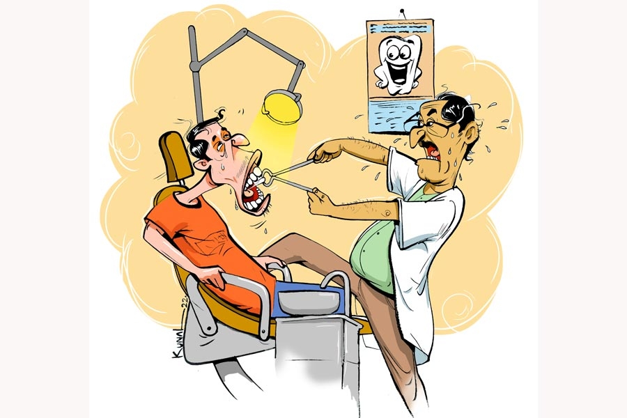

 
 <h1 align=center>বেআক্কেলে</h1>
<h2 align=center>সুমন মহান্তি</h2> সিদ্ধার্থর একখানা আক্কেল দাঁত বেঁকেচুরে উঠেছে। ডক্টর রায় দেখেশুনে বললেন, “বেয়াড়া ভাবে বেরিয়েছে।”

“কী করতে হবে তা হলে?”

“তুলতে হবে। অ্যান্টিবায়োটিক লিখে দিচ্ছি। ব্যথা কমলে আমার অ্যাসিস্ট্যান্টকে দেখিয়ে দাঁত তোলার ডেট নিয়ে যাবেন।”

প্রেসক্রিপশন হাতে নিয়ে ইতস্তত করে সিদ্ধার্থ বলেই ফেলল, “এই বয়সে আক্কেল দাঁত বেরোয়?”

“ও সবের কোনও নিয়ম নেই,” ডক্টর রায় মুচকি হেসে বললেন, “এই বয়সে উদয় হল কেন ভেবে লাভ নেই। তাড়াতাড়ি তুলে ফেলাই মঙ্গল। খুব ভোগায়।”

শান্তা বাইরে এসে ফোড়ন কাটল, “তাই তো বলি! এত বয়স হল, তবু তোমার আক্কেলের এত অভাব কেন? আজ বোঝা গেল। চুয়াল্লিশ বছর বয়সে তোমার আক্কেল জন্ম নিয়েছে। তা-ও ভুলভাল ভাবে।”

চেম্বারের বাইরে পাতা বেঞ্চে রোগীরা বসে আছে। সে দিকে তাকিয়ে সিদ্ধার্থ চুপ করে গেল। তা ছাড়া জোরে কথা বলার উপায় নেই, ব্যথাটা মোচড় দিয়ে উঠবে। ফর্মে থাকলে সিদ্ধার্থ ঝাঁঝিয়ে উঠত। আক্কেল দাঁতটার ডাক্তারি পরিভাষায় একটা নাম লিখেছেন ডক্টর। টি-এইট, ডান দিকে এবং উপরে।

অ্যান্টিবায়োটিকের কোর্স শেষ করে ডক্টরের চেম্বারে সকাল থেকে হত্যে দিল সিদ্ধার্থ। ভোর পাঁচটা থেকে লাইনে দাঁড়িয়ে পা ধরে গেল। ন’টায় অ্যাটেন্ডেন্ট এল। হাবভাবে সে ডক্টরের ওপরে, ডেট দিয়ে যেন ধন্য করছে। এক সপ্তাহ পরে সোমবার ডেট পেল সিদ্ধার্থ।

“তার আগে হবে না?”

“না। একটাও ডেট খালি নেই। কোত্থেকে দেব?”

“তত দিনে যদি আবার ব্যথা শুরু হয়ে যায়?”

মাছি তাড়ানোর ভঙ্গিতে অ্যাটেন্ডেন্ট বলল, “হলে হবে। কথা না বাড়িয়ে চলে যান। তা-ও যথেষ্ট তাড়াতাড়ি ডেট পেয়েছেন। নেক্সট।”

সহকর্মী সন্দীপ শুনে বলল, “আক্কেল দাঁত তোলায় বেশ ঝামেলা আছে। অনেক সময় চামড়া কেটে তুলতে হয়। আমার বেলা তেমনই হয়েছিল।”

শুনে একটু ভয় পেল সিদ্ধার্থ। নিজের মনকে অবশ্য বোঝাল, সামান্য দাঁত তোলায় ভয় পেলে চলবে না। এর আগে তার কিডনি স্টোন এবং অ্যাপেনডিক্স অপারেশন হয়েছে। দু’বারই সে অপারেশনের আগে নির্বিকার ছিল, বিন্দুমাত্র ভয় পায়নি। এখন এই সামান্য টি-এইট নিয়ে সে এত ভাববে কেন?

নির্ধারিত দিনে সে ডক্টর রায়ের চেম্বারে হাজির হল। তেমন কিছু মনেই হল না। মাড়িতে ইঞ্জেকশন দেওয়ার সময় বেশ লেগেছিল, দাঁত তোলার সময় তেমন লাগেনি। দূর! এই তুচ্ছ দাঁত তোলা নিয়ে সে অকারণে উদ্বিগ্ন হচ্ছিল। সন্ধে অবধি যন্ত্রণা থাকল, লিকুইড ছাড়া কিছুই খেতে পারল না। রাতে স্বস্তির নিঃশ্বাস ফেলল সিদ্ধার্থ।

আপদ বিদেয় হয়েছে।

 

মাস তিনেক পরে নীচের মাড়ির ডান দিকে আবার অসহ্য যন্ত্রণা টের পেল সিদ্ধার্থ। আগের যন্ত্রণার সঙ্গে মিল রয়েছে, ব্যথার চোটে সে কাহিল হয়ে পড়ছে। আবার ডক্টর রায়ের কাছে ছুটল সিদ্ধার্থ।

ডক্টর রায় নেড়েচেড়ে বললেন, “এ বার নীচের টি-এইট ঝামেলা পাকিয়েছে। এটাও বেঁকেচুরে উঠেছে, গতিপথ মাড়ির দিকে। মাড়ি ফুঁড়ে বেরনোর মতলবে আছে বোধহয়।”

“তার মানে! আবার এটাও আক্কেল দাঁত?”

“অবশ্যই। এটিকেও বিদায় জানাতে হবে। আক্কেল কাম টি-এইটের রুট ক্যানাল করে লাভ নেই। ঝামেলা উপড়ে ফেলাই ভাল। প্রসেস তো আপনার জানাই আছে। মেডিসিনের কোর্স শেষ হলেই ডেট করিয়ে নিয়ে যাবেন। আমি আর্জেন্ট লিখে দিচ্ছি প্রেসক্রিপশনে।”

“ক’টা টি-এইট হয় ডাক্তারবাবু?”

“দু’দিকের গাম এন্ডে, উপরে নীচে, মোট চারটে পজ়িশনে টি-এইট বেরোতে পারে।”

রাস্তায় শান্তা বলল, “তোমার আক্কেলরা ভদ্র ভাবে স্ট্রেট লাইনে উঠতে পারে না? শুধু ঝামেলা পাকায়? বুড়ো বয়সে আক্কেল উঠলে তা তো গোল বাধাবেই।”

বাইকের গতি কমিয়ে ঘাড় ঘোরাল সিদ্ধার্থ। গরগর করে উঠল, “কষ্টে আমি মরে যাচ্ছি আর তুমি ফুট কাটছ? আক্কেলদের সঙ্গেই বরং কথা বলে দেখো। ওরাই উত্তরটা দিয়ে দেবে।”

ডেট তাড়াতাড়িই পেয়ে গেল সিদ্ধার্থ। মাড়িতে ইঞ্জেকশন নিয়ে বসে থাকল। মুখ ক্রমশ অসাড় হয়ে আসছে। আর কিছু ক্ষণ অপেক্ষা, তার পরই ঝামেলা বিদায়।

মুখ হাঁ করেছে সিদ্ধার্থ। সাঁড়াশি দিয়ে টান মারলেন ডক্টর। কাজ হল না। আবার টান দিলেন, এ বারও লাভ হল না। নীচের টি-এইট যেন অবিচল, কিছুতেই সে জন্মস্থান মাড়িলোকের মায়া ত্যাগ করে সাঁড়াশির মুখে আসবে না। বারকয়েক টান মেরে ডক্টর হাঁপাতে লাগলেন, বসে পড়লেন টুলে। ও দিকে লাগাতার টানের চোটে ব্যথায় ককিয়ে উঠল সিদ্ধার্থ, মাথা ঘুরে গেল তার। অ্যাটেন্ডেন্ট চোখেমুখে জলের ছিটে মেরে তাকে ধাতস্থ করল।

ডক্টর রায় উঠে দাঁড়ালেন, “সরি মিস্টার ভৌমিক। লোকাল অ্যানেস্থেশিয়ার রেশ ফুরনোর আগে তুলে ফেলতেই হবে। সার্জারি ছাড়া উপায় নেই, চামড়া খানিকটা কাটতে হবে। একটু সহ্য করে নিন।”

সহ্যই করে নিল সিদ্ধার্থ। চামড়া কাটার পরে শরীরের সমস্ত শক্তি দিয়ে টান মারলেন ডক্টর রায়।

অবশেষে ডান হাতের দস্তানায় দাঁতটি রেখে ডক্টর রায় বিজয়গর্বে হাসলেন, “এই দেখুন আপনার টি-এইট। খুব মরিয়া ব্যাটার, ক্রিজ় কামড়ে পড়ে থাকতে চাইছিল। ওকে আউট করতে কালঘাম ছুটে গেল আমার। বাধ্য হয়ে বাউন্সার দিতে হল। তবে খুব ধকল গেল আপনার, এখনই বেরোবেন না, বাইরের বেঞ্চে বসে আধ ঘণ্টা রেস্ট নিয়ে যাবেন।”

এমনিতেই মাথা ভোঁ-ভোঁ করছিল। চেম্বারের বাইরে এসে বেঞ্চে বসতেই জ্ঞান হারাল সিদ্ধার্থ।

মিনিট দুয়েক পর হুঁশ ফিরে এল তার। শান্তা উদ্বিগ্নমুখে জিজ্ঞেস করল, “এখন ঠিক আছ তো?’’

ভাগ্যিস বাইক নিয়ে আসেনি সিদ্ধার্থ, এই অবস্থায় চালাতেই পারত না। টোটোতে চেপেই বিধ্বস্ত, কাহিল সিদ্ধার্থ বাড়ি ফিরল।

মাসচারেক পর আবার মাড়ির ব্যথা নিয়ে ডেন্টিস্টের দ্বারস্থ হল সিদ্ধার্থ এবং ব্যথার কারণ শুনে আঁতকে উঠে বলল, “অ্যাঁ, আবার আক্কেল দাঁত?”

ডক্টর রায় বললেন, “হ্যাঁ। স্ট্রেঞ্জ কেস। বহু কেস দেখেছি, কিন্তু আপনার কেসটা দেখছি খুবই অদ্ভুত। টি-এইটেরা সব বেঁকেচুরে বেরোচ্ছে, যেন লাইন দিয়ে একের পর এক আসছে, ঝামেলা পাকাচ্ছে। আপনার বাঁ দিকের ওপরের টি-এইট নড়বড়ে, আগেরগুলোর থেকে কিছুটা স্ট্রেট। এটা আশা করি তেমন ঝামেলা পাকাবে না।”

“এটাও তুলতে হবে?”

“না তুলে উপায় নেই।”

মেডিসিনের কোর্স শেষ করলেও ডক্টর রায়ের চেম্বারে ডেট নিতে গেল না সিদ্ধার্থ। সাহসে কুলোল না। দু’-তিন জন শুভানুধ্যায়ী শুনে বলেছে, “অত লাগার তো কথা নয়। নিশ্চয়ই পুরনো আমলের বয়স্ক ডাক্তার। লোকাল অ্যানেস্থেশিয়ার ডোজ় কম করে দেন। তাই এ রকম প্রবলেম হয়।”

“খুব নামী ডেন্টিস্ট যে! লোকজন চেম্বারে ভোররাত থেকে নাম লেখানোর জন্য লাইন দেয়।”

“মানছি উনি নামী। দাঁতের প্রবলেম, রুট-ক্যানাল এ সবের জন্য হয়তো বেস্ট। গোলমেলে দাঁত তোলার ব্যাপারে অত এক্সপার্ট না হতেও পারেন। বয়স হয়েছে। আবার অনেকে নামী না হলেও দাঁত উপড়ে ফেলতে ওস্তাদ হন।”

প্রবীণ ছেড়ে নবীন ডেন্টিস্টের খোঁজে বেরোল সিদ্ধার্থ। মুশকিল হল যে, কোন ডেন্টিস্ট দাঁত তোলায় এক্সপার্ট, তা সে কী ভাবে বুঝবে? এ ক্ষেত্রে ট্রায়াল অ্যান্ড এরর মেথড চলবে না। চেনাজানার মধ্যে সহকর্মী সন্দীপ ছাড়া কারওই আক্কেল দাঁতের সমস্যায় ঘায়েল হওয়ার অভিজ্ঞতা নেই। সাইনবোর্ড দেখে এক নতুন ডেন্টিস্টের চেম্বারে ঢুকে পড়ল সিদ্ধার্থ। সুকান্ত মিদ্যা, বি ডি এস।

কমবয়সি ছেলে, তবে চেহারা দেখে ভরসা হল না। রোগাপাতলা চেহারা, তার বেয়াড়া আক্কেলকে সামলে উঠতে পারবে কি না যথেষ্ট সন্দেহ আছে।

অনেক ক্ষণ দেখার পরে মিদ্যা বলল, “হুম। আক্কেল দাঁত উঠেছে। বাজে অবস্থা। ইমিডিয়েট তুলে ফেলতে হবে।”

“কবে তুলবেন?”

“তিন দিন দুটো করে অ্যান্টিবায়োটিক খাবেন। ব্যথা কমে যাবে। তার পর শনিবার ভরাপেটে সকাল দশটায় চলে আসবেন।”

“ইয়ে মানে, লাগবে না তো?” সিদ্ধার্থ জানতে চাইল।

মিদ্যা একগাল হেসে বলল, “দাঁত তোলা তো আর রসগোল্লা খাওয়া নয়। একটু তো লাগবেই। আপনি পাঁচশো টাকা অ্যাডভান্স করে যান।”

“অ্যাডভান্স কিসের জন্য?”

“ওটা আমার রুল,” মিদ্যা গম্ভীর ভাবে বলল।

সিদ্ধার্থ মিথ্যেই বলল, “অত টাকা তো আনিনি। আপাতত আপনার ফি-টা রাখুন। কাল এসে দিয়ে যাব।”

“ঠিক আছে। দেরি করবেন না। টি-এইট তুলতে দেরি করা খুব ডেঞ্জারাস হতে পারে।”

বাইরে এসে সিদ্ধার্থ সিদ্ধান্ত নিল, এখানে নয়, অন্য কোথাও যেতে হবে। মিদ্যা রোগী ফস্কে যাওয়ার ব্যাপারে উদ্বিগ্ন, আর সে নিজে ‘একটু তো লাগবেই’ শুনে আরও বেশি উদ্বিগ্ন হয়ে পড়েছে। সে কোনও ঝুঁকি নেবে না। কাজ নেই আর ডেন্টিস্ট খুঁজে, পেনকিলারে কাজ চালিয়ে নেবে।

তিন মাস ধরে ব্যথা চাগিয়ে উঠলেই সিদ্ধার্থ পেনকিলার খায়, ঝিমোয়, শুয়ে থাকে।

শান্তা ধৈর্য হারিয়ে বলল, “হচ্ছেটা কী? মুঠো মুঠো পেনকিলার খেয়ে শরীরের বারোটা বাজাচ্ছ। ওটা কোনও সমাধান হল? কত কাল এ ভাবে ঠেকিয়ে রাখবে?”

সিদ্ধার্থ অসহায় চোখে তাকায়। কিছুতেই যে কোনও ডেন্টিস্টের চেম্বারে যেতে সাহসে কুলোয় না। আক্কেল তোলার কথা ভাবলেই পেট গুড়গুড় করে, হার্টবিট বেড়ে যায়, হাত-পা ঠান্ডা হয়ে আসে। কী ভাবে তা সে বোঝায়?

শান্তাই এক দিন তাকে জোর করে টেনে নিয়ে গেল ডক্টর বসুর কাছে। শান্তার কথা অনুযায়ী বসু ভাল ডেন্টিস্ট, সে খোঁজ নিয়েছে। সেখানে এক বার দেখাতেই হবে।

বসু নতুন কিছু বললেন না। বসুর বয়স চল্লিশের কোঠায়, শক্তপোক্ত চেহারা, মুখে হাসি লেগেই আছে।

শান্তা তার স্বামীর দাঁত তোলার ভীতি বলেই ফেলল। মনে মনে বেজায় বিরক্ত হল সিদ্ধার্থ।

বসু হাসলেন, “কথা দিচ্ছি আপনার লাগবে না। একটু চিনচিনে ভাব ফিল হবে।”

শান্তা মাথা নাড়ে, “হ্যাঁ, ওর শুধু টালবাহানা। আপনি তাড়াতাড়ি ব্যাপারটা মিটিয়ে দিন। ঘরটায় হরেক রকম পেনকিলার শুধু, খায় আর কাতরে পড়ে থাকে।”

“ও কে। সামনের রোববার সকাল দশটায় আসুন। ডোন্ট ওরি...” সিদ্ধার্থর দিকে তাকিয়ে হাসলেন বসু।

রোববার ডক্টর বসুর চেম্বারে হেঁটেই গেল দু’জন। শান্তা ধমকের স্বরে বলল, “মুখটা সকাল থেকে ও রকম করে আছ কেন?”

“কী রকম করে আছি?”

“দেখে মনে হচ্ছে যে, তোমাকে হাঁড়িকাঠে বলি দিতে নিয়ে যাওয়া হচ্ছে। মুখ ফ্যাকাশে, রক্তশূন্য। খুব তো মুখে রাজা-উজির বধ করা হয়, এখন সামান্য আক্কেল দাঁত তোলার ভয়ে কাবু?”

দীর্ঘশ্বাস ফেলে বিড়বিড় করল সিদ্ধার্থ, “যার হয় শুধু সে-ই বোঝে। তুমি তো আর ভুক্তভোগী নও, মুখে বীরত্ব সবাই ফলাতে পারে।”

মাড়িতে ইঞ্জেকশন নেওয়ার পরেই সিদ্ধার্থর ভয় বাড়তে লাগল। এগিয়ে আসছে সেই আতঙ্কের মুহূর্ত।

ডক্টর বসু চেয়ার ছেড়ে এগিয়ে এলেন। মুখের দিকে এগিয়ে আসছে উদ্যত সাঁড়াশি। নির্ভীক হওয়ার সমস্ত সঙ্কল্প ভুলে আতঙ্কে চোখ বন্ধ করে ফেলল সিদ্ধার্থ।

কিছু ক্ষণ পরে ডক্টর বসু ডাকলেন, “ও মিস্টার ভৌমিক, চোখ খুলুন। কাজ হয়ে গেছে।”

সিদ্ধার্থ চোখ খুলে ক্ষীণ গলায় অবিশ্বাসের ভঙ্গিতে জিজ্ঞেস করল, “হয়ে গেছে?”

“হ্যাঁ।”

“বাঁচলাম।”

“কেমন মনে হল? লাগল খুব?”

“না। মশা কামড়ানোর মতো একটু ফিল হল।”

বসু হাসলেন, “বলেছিলাম তো ঘাবড়ানোর কিচ্ছুটি নেই। মাঝে মাঝে দু’-একটা দাঁত খুব বিশ্রী শেপ নেয়। সে ক্ষেত্রে খানিকটা ট্রাবল দেয়। আজ মনের সুখে যত ইচ্ছে আইসক্রিম সাবাড় করুন, রিলিফ পাবেন।”

চার মাস নির্বিঘ্নে কাটার পর এক দিন সকালে বাঁ গালে অসহ্য যন্ত্রণা টের পেল সিদ্ধার্থ। আয়নায় দেখল, বাঁ গালটা ফুলে গিয়েছে খানিক, টনটন করছে। অভিজ্ঞতায় সে বুঝে নিল। বাঁ দিকের নীচের টি-এইট তার গোলমেলে অস্তিত্ব জানান দিচ্ছে। 

শান্তাকে বলল, “আজ অফিস যাব না। ছুটি নেব।”

“কেন?”

“ডক্টর বসুর কাছে যেতে হবে। অবশিষ্ট আক্কেলটি জেগে উঠেছে মনে হচ্ছে। ব্যাটাকে পত্রপাঠ উপড়ে ফেলতে হবে।”

“আবার?” শান্তার মুখেচোখে অপার বিস্ময়।

“টি-এইট টুনার্মেন্ট চলছে দু’-বছর ধরে। লাস্ট অ্যান্ড ফাইনাল ম্যাচটা তো হতেই হবে,” সিদ্ধার্থ হালকা গলায় বলল, “ফাইনাল ম্যাচের ডেট নিয়ে আসি আজ।”

“তোমার ভয় করছে না?” 

“কিসের ভয়?”

“আবার যে আক্কেল দাঁততুলতে হবে!”

সিদ্ধার্থ হাসে, “না। তবে দুঃখ হচ্ছে। চুয়াল্লিশ পর্যন্ত বেআক্কেল ছিলাম, বেশ ছিলাম। তার পর আক্কেলরা একে একে এলেও এমনই কপাল, তাদের কোনও ভাবেই ধরে রাখা গেল না। আবার আমি তোমার কথামতো বেআক্কেল হতে চলেছি।”

শান্তা আঁচল গুটিয়ে রান্নাঘরের দিকে যেতে যেতে মুচকি হাসল, তার পর বলল, “আমার অমন বেআক্কেলে বরই ভাল। বেশি চালাক-চতুর নিয়ে কাজ নেই।”