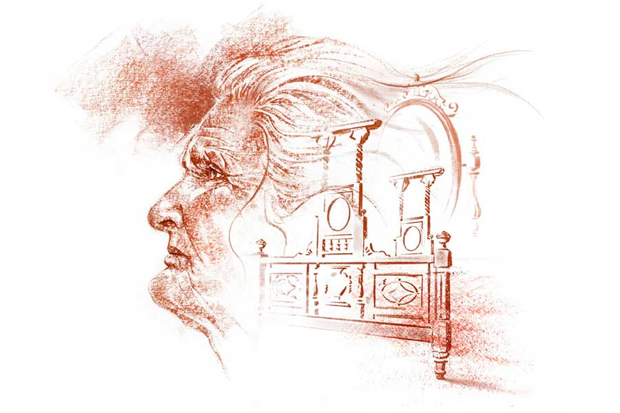

 
 <h1 align=center>বেমানান</h1>
<h2 align=center>গৌতম বন্দ্যোপাধ্যায়</h2> ঠাকুমা বাবার দিকে তাকিয়ে স্পষ্ট গলায় বললেন, “ওই সব মেলেচ্চদের ব্যাভার করা জিনিস কিছুতেই ওপরে তোলা যাবে না। যদি ওপরে ওঠে, তা হলে আমি এই বাড়ি থেকে দূর হয়ে যাব। এই বয়সে বাড়িতে এই সব অনাচার আমি দেখতে পারব না, এই বলে দিলুম।”

বাবা কাঁচুমাচু মুখে দাঁড়িয়ে। এ বাড়িতে ঠাকুমার কথাই শেষ কথা। সকলেই ঠাকুমার ভয়ে জড়োসড়ো। বাড়ির বৌ, মানে আমার মা-ও সব সময় ঠাকুমাকে তুষ্ট করে চলেন। তাও মাঝেমধ্যে পান থেকে চুন খসলেই শুরু হয়ে যায় ঠাকুমার বাক্যবাণ। ঠাকুমার সামনে দাঁড়ায় কার সাহস।

বাবারও এমন সাহস ছিল না যে, ঠাকুমা রেগে গেলে তাঁর সামনে দাঁড়িয়ে থাকবেন। তবু ঠেকায় পড়ে এ দিন দাঁড়িয়ে ছিলেন এবং শেষ চেষ্টা করলেন, “মা, তুমি নিজে এক বার নীচে নেমে দেখবে চলো। তার পর নয় বাতিল করে দেবে। এমন কারুকাজ করা কাঠের ড্রেসিংটেবিল আর খাট এ চত্বরে পাওয়া যাবে না।”

ঠাকুমা বাজখাঁই গলায় চিৎকার করে ওঠেন, “যা দেখার আমি বারান্দা থেকে দেখে নিয়েচি। আমাদের চারু মিস্তিরি ওর থেকে ঢের ভাল কাঠের কাজ করতে পারে।”

বাবা মিনমিনে গলায় বলার চেষ্টা করেন, “এ তল্লাটে চারুর মতো কাঠের মিস্তিরি পাওয়া দুষ্কর। কিন্তু চারুও এমন জিনিস তৈরি করতে পারবে না, মা। সাহেব অনেক কম টাকায় ছেড়ে দিয়েছে। নেহাত দেশ ছেড়ে চলে যাচ্ছে, তাই।”

ঠাকুমা একটা অবজ্ঞাসূচক শব্দ করে বলেন, “দেশ ছেড়ে চলে যাচ্চে! উদ্ধার করেচে! এমনি এমনি যেন যাচ্চে! তাড়িয়ে দেওয়া হয়েচে, তাই যাচ্চে। এই দেশ এখন আমাদের। অনেক বছর জ্বালিয়েচে। আর নয়।”

বাবা পাংশু মুখে শুধু বলেন, “তা হলে কী করব?”

“কী করবে, তার আমি কী জানি? ওই সব মেলেচ্চদের ব্যাভার করা জিনিস আমার ওপরে উঠবে না। এই আমি বলে দিলুম।”

ঠাকুমা মুখে দোক্তা ঠুসে নেন।

বাবা ধীরে ধীরে সরে আসেন ঠাকুমার কাছ থেকে। ঘরে এসে বসেন। মা চা দিতে এসে পরামর্শ দেয়, “এক বার দেওঘরের জামাইবাবুকে খবর দিলে হয় না?”

বাবা চায়ে চুমুক দিতে দিতে মা’র দিকে তাকান। পরামর্শটা তাঁর পছন্দ হয়েছে, বোঝা যায়। বলেন, “কথাটা তুমি মন্দ বলোনি। চিঠি দিয়ে জামাইবাবুকে এক বার জানানো যায়। জামাইবাবু বললে, মা আর না করতে পারবে না। কিন্তু সে তো পনেরো-কুড়ি দিনের ব্যাপার। এত দিন কি ওই খোলা উঠোনে পড়ে থাকবে?”

মা বললেন, “আচ্ছা, নীচে চণ্ডীমণ্ডপের মতো তেরপলের ছাউনি টাঙিয়ে দিলে হয় না?”

আরামকেদারায় শুয়েছিলেন বাবা। উঠে বসলেন। বললেন, “ভাল বলেছ তো! মনে হচ্ছে, জামাইবাবুর কথা ফেলতে পারবে না মা। কিন্তু, তত দিন অবধি তো ঠিকঠাক রাখতে হবে জিনিসগুলোকে।”

পরদিন উঠোনে বাঁশ এল। চার কোণে চারটে বাঁশ পুঁতে ত্রিপল টাঙিয়ে দেওয়া হ’ল। শরৎকাল। মাঝেমধ্যে বৃষ্টি লেগে আছে।

বাবা নিশ্চিন্ত হয়ে বললেন, “যাক, অন্তত রোদবৃষ্টি থেকে রক্ষা করা গেল জিনিসগুলোকে।”

বারান্দা থেকে দেখে ঠাকুমা মুচকি হাসলেন। মনে মনে বললেন, ‘যতই তেরপল টাঙিয়ে আগলে রাখার চেষ্টা করো না কেন, ওই মেলেচ্চদের ব্যাভার করা জিনিস আমি কিছুতেই ওপরে তুলব না। এক বার যখন না বলেচি, তো না-ই।’ বাবাকে ডেকে সে-কথা শুনিয়েও দিলেন ঠাকুমা। বাবা কোনও উত্তর দেননি। বাবার তখন একমাত্র এবং শেষ ভরসা পিসেমশাই।

*****

দেওঘর থেকে পিসেমশাই এলেন পনেরো দিন পর। তার পর সেই মুহূর্ত। বাবা দরজা আগলে দাঁড়িয়ে। ঠাকুমা তারস্বরে চিৎকার করে চলেছেন, “পথ ছাড় দাশু! আমাকে যেতে দে! যে বাড়িতে আমার কথার কোনও মর্যাদা নেই, সেখানে আমার থাকা চলে না। এখন বিমানকে নিয়ে এসে মেলেচ্চদের ব্যাভার করা জিনিসগুলো সেই ওপরে তোলার মতলব করচে।”

লম্বা দালানের তক্তপোশে বসেছিলেন পিসেমশাই। বললেন, “কোথায় যাবেন মা? সেই তো কালীঘাটে ভাইদের কাছে। তারা আপনার কত খাতির-যত্ন করে জানা আছে। তা ছাড়া, দু’দিন বাদেই তো এ বাড়ির টানে ফিরে আসবেন। তা হলে আর যাওয়া কেন?”

সিঁড়ির মুখে দাঁড়িয়ে ঠাকুমা চিৎকার করে ওঠেন, “না, আমি আর ফিরব না। ভাজরা গায়ে হাত তুললেও, এ বাড়িতে আর নয়। যে বাড়িতে এত অনাচার, মেলেচ্চদের ব্যাভার করা জিনিস নিয়ে এত আদিখ্যেতা, সেখানে আর নয়। আজ যদি উনি থাকতেন, দূর করে ফেলে দিতেন ওই সব। উঠোনেই আনতে দিতেন না। যে লালমুখো বাঁদরগুলোর বিরুদ্ধে লড়াই করে উনি জেলে গিয়েচিলেন, তাদের ব্যাভার করা জিনিস এ বাড়িতে ঢুকবে! ছি ছি। কী ঘেন্না! কী ঘেন্না! দাশু পথ ছাড়, আমাকে যেতে দে।”

হঠাৎ পিসেমশাই উঠে দাঁড়ালেন। তক্তপোশে রাখা তাঁর কালো চামড়ার ব্যাগটা তুলে নিলেন। তার পর, ধীরে ধীরে এগিয়ে গেলেন দরজার দিকে। গম্ভীর গলায় বললেন, “দাশরথি, পথ ছাড়, দেওঘরে ফিরে যাই।”

বাবা অবাক। যাঁকে নিয়ে এলেন যুদ্ধ জয়ের আশায়, তিনিই রণে ভঙ্গ দিচ্ছেন। পিসেমশায়ের ভাবগতিক দেখে ঠাকুমাও একটু ঘাবড়ে গেছেন, মনে হল। তার কণ্ঠস্বর খানিকটা নরম হয়ে এল। বললেন, “তুমি যাবে কেন, বাবা? তুমি এ বাড়ির জামাই। সবে এয়েচ। এখনও পর্যন্ত মুখে কিছু দাওনি। বাড়ির বৌ তো রাজরানি হয়ে ঘুরে বেড়াচ্চে। তার এ সব দেখার সময় কোথায়? ও বৌমা...”

“থাক মা। অনেক হয়েছে। আমি ভেবেছিলাম, কেউ না হোক অন্তত আপনি আমার কথা শুনবেন। শুনলেন? উল্টে রাগ দেখিয়ে লাথি-ঝাঁটা খেতে ভাইদের কাছে চলেছেন...” পিসেমশাই গম্ভীর।

“বজ্জাতের ধাড়ি ওই দাশু। কে বলেছিল মেলেচ্চদের বাড়ি থেকে ওই সব আপদ বয়ে আনতে?”

বাবা এত ক্ষণ কিছু বলেননি। এই বার বললেন, “আমি বুঝতে পারিনি, এমনটা হবে। বুঝলে, কিনতাম না। তবে, কিনেছি যখন ওগুলো কাউকে দেব না। এমনিতেই বড় ভায়রা হত্যে দিয়ে পড়ে আছে, আধাকড়িতে নেবে বলে। কিছুতেই দেব না। বরং বাড়ির জ্বালানি কাঠ হিসেবে ওগুলো ব্যবহার করব।”

এ বার বোধ হয় ঠাকুমার মনে হল জেদ আর আপত্তিটা একটু বাড়াবাড়ি ধরনের হয়ে যাচ্ছে। জামাই-মানুষের সম্মানটাও তো দেখতে হবে। কিছু একটা ভেবে তিনি বাবাকে একটা ধমক দিয়ে বলে ওঠেন, “কিছুই করতে হবে না তোমাকে। অনেক করেচ। এই বার বাকি কাজটা আমি করব। তুমি গণেশ পুরুতকে খবর দাও।”

বাবা অবাক হয়ে বললেন, “গণেশ ঠাকুরমশাই?... কেন?”

ঠাকুমা তার কণ্ঠস্বর সপ্তমে চড়িয়ে বললেন, “আমার ছেরাদ্দ হবে, তাই।”

পিসেমশাইও অবাক। বললেন, “কেন মা, পুরোহিতের কী প্রয়োজন?”

ঠাকুমার মুখ তখনও গম্ভীর। বললেন, “পেরাশ্চিত্তি করতে হবে। মেলেচ্চদের ব্যাভার করা জিনিস থেকে দোষ কাটাতে হবে না? দোষ না কাটিয়ে ও সব আমি ওপরে তুলচি না, সে বিমান, তুমি যতই বলো না কেন!”

পিসেমশাই আবার তক্তপোশে এসে বসেছেন। বললেন, “সে তো ঠিক কথাই। আমি তো আগেই দাশরথিকে সে-কথা বলেছি। হিন্দুবাড়ি। বাড়ির সকলের একটা মঙ্গল-অমঙ্গল আছে না! দোষ কাটাতেই হবে। পুরুতঠাকুর এসে যা বলবেন, সেটা করতে হবে।”

ঘটনার গতি পরিবর্তনে বাবা কেমন হতবুদ্ধি হয়ে গিয়েছিলেন। এক বার ঠাকুমা, আর এক বার পিসেমশাইয়ের দিকে তাকিয়ে, ছুটলেন গণেশ পুরুতের বাড়ির উদ্দেশে এবং খানিক ক্ষণের মধ্যেই ঠাকুরমশাইকে বগলদাবা করে বাড়িতে ঢুকলেন।

গণেশ পুরোহিত দালানে পা রেখেই বললেন, “ব্যাপার কী জ্যাঠাইমা? দুগ্গাপুজো নাকি? উঠোনে দেখলুম, ম্যারাপ বাঁধা হয়েছে।”

‘‘না বাবা, পুজো নয়, পেরাশ্চিত্তি...” ঠাকুমা বললেন।

গণেশ পুরোহিত যেখানে ছিলেন, সেখানেই দাঁড়িয়ে পড়লেন। বললেন, “প্রায়শ্চিত্ত! কার? কিসের?”

“সব বলচি, আগে থিতু হয়ে বোসো,” ঠাকুমা বললেন। তার পরই স্বভাবসুলভ বাজখাঁই গলায় মাকে বললেন, “বৌমা, চোখের মাথা খেয়ে বসে আচো না কি? দেকচো না পুরুত ঠাকুর এয়েচেন? ঘটিতে জল এনে পা ধুইয়ে দাও।”

ঘরে পুরোহিতের জন্য আসন পাতা হয়েছে। গণেশ পুরোহিত পদ্মাসনে সেখানে বসে। লম্বা সাদা দাড়ি-গোঁফের ফাঁকে তার মৃদু হাসির রেখাটি অদৃশ্য নয়। ঠাকুমা সবিস্তারে তাকে প্রায়শ্চিত্তের কারণ বর্ণনা করছেন, আর বাবাকে দোষী সাব্যস্ত করে, মৃদু বকাবকি করে চলেছেন। বাবা অপরাধীর মতো দাঁড়িয়ে।

একমাথা ঘোমটা টেনে মা মাঝে মাঝে ঘরে উঁকি দিয়ে যাচ্ছেন গণেশ পুরোহিত কী বিধান দেন, তা শুনতে।

সবটা শুনে গণেশ পুরোহিত বললেন, “হোম-যজ্ঞ করতে হবে, জ্যাঠাইমা। পাঁচ জন বামুন খাওয়াতে হবে। তবে প্রায়শ্চিত্ত হবে। আমি ও-বেলা ফর্দ পাঠিয়ে দেব।”

“দিনটা তো বললে না গণেশ?” ঠাকুমা বললেন।

“বলিনি, না?” উঠতে উঠতে বললেন গণেশ পুরোহিত।

বাবা এত ক্ষণ কিছু বলেননি। এই বার বললেন, “কই, বলেননি তো এখনও।”

“আগামী বেস্পতিবার করে দাও। ভাল দিন আছে। সব কিছু জোগাড় করার তিন দিন সময় পাবে,” বলে গণেশ পুরোহিত উঠলেন।

বিকেলের মধ্যেই গণেশ পুরোহিতের পাঠানো ফর্দ চলে এল বাড়িতে। ফর্দ হাতে নিয়ে বাবা দালানে দু’-তিন বার পায়চারি করে, বেজার মুখে পিসেমশাইকে বললেন, “এ তো দেখছি ঢাকের দায়ে মনসা বিকিয়ে গেল।”

পিসেমশাই এক টিপ নস্যি নাকে দিয়ে, রুমালে নাক মুছে বললেন, “কী করবে বলো, এ ছাড়া তো কোনও উপায় নেই। তা ছাড়া, অনেক দিন বাড়িতে কোনও অনুষ্ঠান নেই। এই উপলক্ষে না হয় একটু খরচ করলে!”

বাবা কোনও উত্তর না দিয়ে রাগে গজগজ করতে করতে ফর্দ নিয়ে বেরিয়ে গেলেন।

পুজো হল। হোম-যজ্ঞ হল। প্রায়শ্চিত্ত হল। গণেশ পুরোহিত শান্তির জল ছেটালেন। ঠাকুমা ছেটালেন গোবরজল। এর পর একে একে ড্রেসিং-টেবিল ও খাট উঠল দোতলায়। তবে ঠাকুমা ও গণেশ পুরোহিতের যৌথ নির্দেশে খাটের তোশক ও গদি ফেলে দেওয়া হল। বাবা একটু আপত্তি করেছিলেন। কিন্তু ধোপে টেকেনি। বাবা বলেছিলেন, “হোম-যজ্ঞ হল, শান্তি-স্বস্ত্যয়ন হল। আবার তোশক, গদি ফেলা কেন মা?”

ঠাকুমা উত্তর দেওয়ার আগেই গণেশ পুরোহিত বলে উঠলেন, “এ কথা তুমি কী বলছ, দাশরথি? ওই তোশক, গদিতে ম্লেচ্ছরা শয়ন করত। ওদের স্পর্শ লেগে আছে ওখানে। আর তুমি কি না...”

কোনও উত্তর দিতে পারেননি বাবা। মৌন সম্মতি জানিয়েছিলেন গদি, তোশকহীন খাট উপরে তোলার। নিজে দাঁড়িয়ে থেকে তদারকি করেছিলেন, “আর একটু ডান দিকে হেলিয়ে দে... আর একটু সোজা করে ধর... গায়ে কি জোর নেই তোদের... আর একটু ঘুরিয়ে নে... আহ্! আহ্! সেই চোট লাগালি... সামান্য একটু বুদ্ধি নেই কি তোদের, বাঁদরের দল...”

*****

এই সেই খাট। আর এই এই সেই ড্রেসিং-টেবিল। মাঝখানে পেরিয়ে গেছে ছ’টা দশক। আমি ড্রেসিংটেবিলের লাগোয়া বেলজিয়াম কাচের আয়নায় নিজেকে খুঁজে চলেছি... হঠাৎ পুত্র অরিত্রর কণ্ঠস্বরে চমকে পিছনে ফিরে তাকালাম।

“তোমার কোনও চিন্তা নেই, বাবা। ভালই দাম পাওয়া গেছে। ওরা অ্যান্টিকের দামেই কিনবে বলেছে।”

আস্তে আস্তে বললাম, “বিক্রি করে দেবে এ সব?”

অরিত্র অবলীলায় বলল, “হ্যাঁ, তোমাকে তো আগেই বলে রেখেছিলাম বাবা।”

“বলেছিলে, কিন্তু...”

“কোনও কিন্তু নয় বাবা। ইট হ্যাজ় বিন সেটলড। আমার নতুন ফ্ল্যাটে এ সব ওল্ড ব্যাকডেটেড ফার্নিচার মানাবে না।”

আমি কোনও উত্তর না দিয়ে বাবার ছবির দিকে তাকালাম। ধুলো পড়ে পড়ে অস্পষ্ট হয়ে গেছে ছবিটা। ভাল করে মুখটাই দেখা যাচ্ছে না। পাশেই মা, আর ঠাকুমার ছবি। মা বরাবরের মতো নির্বিকার। যেন বলতে চাইছেন, ‘এ তোমাদের বাপ-ছেলের ব্যাপার। তোমরাই ঠিক করে নাও।’ ঠাকুমা মুখ টিপে হেসে চলেছেন। তৃপ্তির হাসি। যেন বলছেন, ‘আমি যা করতে পারিনি, পুতিটা করে দেখাল। শেষমেশ মেলেচ্চদের জিনিসগুলো বিদেয় করেই ছাড়ল।’

আমি বিড়বিড় করলাম, “এগুলোর সঙ্গে আমিও যে বিদেয় হচ্ছি, ঠাকুমা, এই বাড়ি থেকে।”

ঠাকুমার মুখটা কেমন ম্লান হয়ে গেল। বলল, ‘পুতিটার নতুন বাড়িতে আমরাও বোধহয় বেমানান হয়ে যাব, না রে? এই আমি, তোর বাবা, মা...’

আমি কোনও উত্তর দিতে পারলাম না। ফিরে এলাম যেখানে দাঁড়িয়ে ছিলাম এত ক্ষণ, সেখানেই। বেলজিয়াম কাচের আয়নায় নিজের মুখটা এত ক্ষণ দেখতে পাচ্ছিলাম। এ বার আর দেখতে পেলাম না। ক্রমশ অস্পষ্ট হয়ে যাচ্ছে মুখটা... ক্রমশ অস্পষ্ট... বাবা, ঠাকুমাদের মতোই।