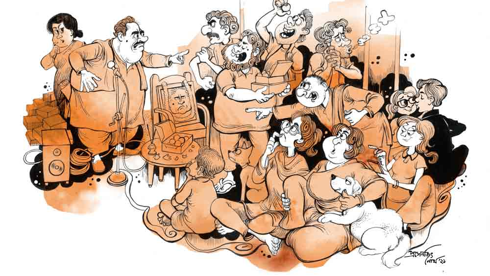

 

<h1 align=center>ভক্তরামের স্মরণসভা</h1>
<h2 align=center>উল্লাস মল্লিক</h2>
চুপ! আমার স্মরণসভা চলছে!  আমি ভক্তরাম হালদার। কিছু দিন আগেই নশ্বর দেহ ত্যাগ করেছি। তাই আমার স্মরণসভার আয়োজন। বাড়ির ছাদেই।   সন্ধে হব হব। মৃদুমন্দ বাতাস বইছে। বাতাসে ফুলের গন্ধ। প্রেম আর স্মরণসভা, দুটোর পক্ষেই এমন পরিবেশ উপযুক্ত। কারণ এই দুটো জায়গাতেই মানুষের মন উন্মুক্ত ও উদাস থাকে।   ছাদের এক দিকে একটা কাঠের চেয়ারে ফ্রেমে বাঁধানো আমার আবক্ষ ছবি। মোটা একটা রজনীগন্ধার মালা ঝুলছে। একটু আগে গিন্নি পারুলবালা পরিয়ে দিল মালাটা। খুবই ভক্তিভরে দিল।  মন একটু দুলে উঠল আমার। আমি আমাদের বিয়ের দিনে মালা বদলের সময় ফিরে গিয়েছিলাম।  আলোর রোশনাই, সানাইয়ের সুর, সুখাদ্যের সুবাস। মনে হচ্ছিল ফ্রেম থেকে বেরিয়ে আমিও মালাটা পাল্টা পরিয়ে দিই পারুলের গলায়।   আমার সামনে কাঠের চেয়ারে কিছু কুচো ফুল। মালা কিনলে এগুলো ফ্রি পাওয়া যায়। সেই ফুলই ছড়িয়ে দিয়েছে সামনে। দু’পাশে দুটো ধূপদানিতে গোঁজা ধূপের গোছা গুলগুল করে ধোঁয়া ছাড়ছে।  কোন কোম্পানির ধূপ কে জানে, কেমন একটা গন্ধিপোকা-গন্ধিপোকা গন্ধ। অবশ্য এটুকু সহ্য করে নিতে পারলে ধূপটা উপকারেই লাগছে।   ছাদে একটাও মশা নেই। অন্য দিন এমন সময় মশার উৎপাতে টেকা যায় না। ব্যাপারটা অনেকেই লক্ষ করেছে। তারা ধূপটা কোন দোকান থেকে কেনা জিজ্ঞেস করছে পারুলকে। আমার সামনে আর একটা জিনিস আছে। মিষ্টির বাক্স। ভেতরে চারটে পান্তুয়া। পান্তুয়া আমার প্রিয় মিষ্টি। শুধু আমার নয়, পারুলেরও। স্মরণসভার শেষে এই রকম বাক্স একটা করে ধরিয়ে দেওয়া হবে সবার হাতে।  আর আমার সামনের বাক্সটা জলে দেওয়া হবে। এমনটাই নিয়ম।   মিষ্টিটা স্পনসর করেছেন পাড়ার গৌরাঙ্গবাবু। শুধু মিষ্টি নয়, ছাদে পেতে বসার শতরঞ্চি, সাউন্ড সিস্টেম, সব কিছুই ওঁর বদান্যতায়। তার পর ওঁর বৌমা উদ্বোধনী সঙ্গীত গাইবেন, ওঁর নাতনি আবৃত্তি করবে, সব শেষে উনি নিজে বক্তৃতা দেবেন। গোটা ব্যাপারটাতেই এত গৌরাঙ্গবাবু গৌরাঙ্গবাবু গন্ধ যে, স্মরণসভাটা কার সেটাই গুলিয়ে যাচ্ছে আমার।   সত্যি বলতে কী, আমার মতো এলিতেলি মানুষের স্মরণসভা হয় না। স্মরণসভা হয় সমাজের কেষ্টবিষ্টু ধরনের মানুষের। ছোট একটা বেসরকারি সংস্থায় সামান্য একটা চাকরি করতাম আমি।  সন্তানাদি নেই, স্বামী-স্ত্রীর ছোট সংসার। নুন আনতে পান্তা ফুরোয় বললে হয়তো একটু বাড়াবাড়ি হয়ে যাবে। কিন্তু এটাও ঠিক, বাজারে আটশো টাকার ইলিশ কিংবা ছ’শো টাকার চিংড়ি দেখলে স্মার্টলি শ্যামাসঙ্গীত গাইতে গাইতে চারাপোনার সন্ধানে যেতাম। খাসির মাংস একমাত্র কাজের বাড়িতে। মুখে বলতাম, রেড মিট বেশি না খাওয়াই ভাল। পারুলের অবশ্য এ সব নিয়ে কোন তাপ-উত্তাপ ছিল না। শুধু দোকানের শো-কেসে দামি শাড়ি কিংবা খবরের কাগজে সোনার গয়নার বিজ্ঞাপন দেখলে হুমড়ি খেয়ে পড়ত। এতে অবশ্য দোষের কিছু দেখি না। আমরাও যৌবনে এমনটা করতাম। শ্রীদেবীর সঙ্গে বিয়ে অসম্ভব জেনেও তার ছবির ওপর হুমড়ি খেয়ে পড়তাম। সত্যি বলতে কী, এখন এই বয়সেও উঠতি কোনও নায়িকার ছবি থেকে দৃষ্টি ফিরিয়ে নিতে কষ্ট হয়। যদিও জানি, বেল পাকলে কাকের কী!      ঘটিবাটির মতো আমাদেরও ঠোকাঠুকি লেগে যেত— তখন শুনতে হত— নেহাত আমি তাই, অন্য মেয়ের পাল্লায় পড়লে হাড়ে দুব্বো ঘাস গজিয়ে দিত। আমিও পাল্টা দিতাম, হ্যাঁ, মাথার ঘাম পায়ে ফেলে যা রোজগার করি, তা তো শুধু নিজের জন্যই বটে! যাব এক দিন বাড়িঘরদোর সব ছেড়ে... চলে যাব যে দিকে দু’চোখ যায়।      কোথাও আর যাওয়া হয়ে ওঠেনি আমার। আসলে জায়গা থাকলে তো যাব! একটাই বোধহয় ছিল। তাই রিটায়ারমেন্টের মাত্র দু’বছর পর সেখানেই চলে গেলাম। পারুল কেঁদেছিল খুব।  কপাল চাপড়ে কাঁদছিল। এক বার ওর একটা সোনার দুল হারিয়ে যায়। সেই সময়ও এমনই কপাল চাপড়ে কেঁদেছিল। পাশে দাঁড়িয়ে আমি বোঝার চেষ্টা করছিলাম কোন চাপড়ের শব্দ বেশি।  অনেক ক্ষণ দাঁড়িয়েও বুঝতে পারলাম না। মাঝখান থেকে, চাপড় খেয়ে ক’টা মশার বেঘোরে প্রাণ গেল।      তখনকার মতো চলে গেলেও মাঝে মাঝে এখানে ঢুঁ মেরে যেতাম। এক দিন শুনলাম গৌরাঙ্গবাবু পারুলকে বলছেন, “বৌমা, শ্রাদ্ধশান্তি সবই তো হল, কিন্তু একটা স্মরণসভা না করলে বড্ড ন্যাড়া ন্যাড়া লাগছে যেন।”   পারুল বলল, “কিন্তু দাদা, স্মরণসভার তো অনেক খরচ! আমাদের পক্ষে কি সম্ভব?” গৌরাঙ্গবাবু বললেন, “সে সব ভেবো না। ও দিকটা আমি দেখছি।”   হ্যাঁ, দেখলেন বটে গৌরাঙ্গবাবু। দেখালেনও। সব ব্যবস্থা করে ফেললেন। গান, আবৃত্তি হয়ে গেছে, এখন বক্তৃতা দিচ্ছেন গৌরাঙ্গবাবু। পাড়ার ক্লাবের সেক্রেটারি হওয়ার জন্যে গৌরাঙ্গবাবু মাঝে মাঝেই বিভিন্ন অনুষ্ঠানে বক্তৃতা দেন। বক্তৃতা করার সময় উনি সময়ের তোয়াক্কা করেন না। যে কোনও বিষয়েই সৃষ্টির আদিম যুগে চলে যান। সেখান থেকে ব্যাক করেন বর্তমানে।  ধরা যাক, কোনও দৌড় প্রতিযোগিতার পুরস্কার বিতরণী অনুষ্ঠানে বক্তৃতা দিচ্ছেন, প্রথমেই চলে যান সৃষ্টির আদিম যুগে।  তখন কি দৌড় প্রতিযোগিতা ছিল? কবে থেকে চালু হল দৌড় প্রতিযোগিতা? পুরস্কার জিনিসটাই বা কী? কবে থেকে চালু হল পুরস্কার দেওয়ার প্রথা ইত্যাদি। আমি এক বার এমন একটা বক্তৃতা শুনেছিলাম। সেটা নাচগানের পুরস্কার বিতরণী অনুষ্ঠান। উনি নাচগানের উৎস সন্ধানে চলে গেলেন সৃষ্টির আদিম যুগে। গান আগে, না নাচ আগে। অনেকটা ডিম আগে না মুরগি আগের মতো। মাঠ ফাঁকা। প্রতিযোগী আর তাদের মায়েরা বক্তৃতা শুরু হওয়ার সঙ্গে সঙ্গে বাড়িতে সিরিয়াল দেখতে চলে গেলেন। তাঁদের নাকি আন্দাজ আছে কখন আদি যুগ থেকে উনি বর্তমানে ফিরবেন। হঠাৎ দেখলাম, কয়েকটা আধ-ন্যাংটো ছেলে এসে হ্যালোজেনের আলোয় ফুটবল খেলতে শুরু করে দিল। উনি বিরক্ত হচ্ছিলেন। বক্তৃতা থামিয়ে মাঝে মাঝে ধমকে উঠছিলেন, “অ্যাই! তোমরা খেলা থামাও, আমি যা বলছি, মন দিয়ে শোনো।”   ছেলেরা সাময়িক খেলা বন্ধ রাখলেও আবার শুরু করে দিচ্ছিল। হঠাৎ বলটা গিয়ে পড়ল স্টেজে।  গৌরাঙ্গবাবু সঙ্গে সঙ্গে ধরে নিলেন বলটা। ফেরত না দিয়েই বল বগলেই শুরু করলেন বক্তৃতা।   তা সেই গৌরাঙ্গবাবু যে আমার স্মরণসভায় ভাষণ দেবেন, সেটা সে দিন স্বপ্নেও ভাবিনি। শ্রোতা মন্দ হয়নি। ক্লাবের বেশ কিছু ছেলে এসেছে। গৌরাঙ্গবাবু ক্লাবে ভাল ডোনেশন দেন, গৌরাঙ্গবাবুই ডেকে এনেছেন তাদের ভিড় বাড়ানোর জন্যে। আছে বেশ কিছু পাড়াপ্রতিবেশী। এখানেও গৌরাঙ্গবাবু শুরু করেছেন সৃষ্টির আদিযুগ থেকে, মানে আমার জন্ম থেকে। ভাগ্য ভাল, আরও পিছিয়ে গিয়ে আমার বাবা-মা-র ফুলশয্যার রাত থেকে শুরু করেননি। শুরুতে বললেন, “আমার স্মরণসভায় ভক্তরামের বলার কথা, সেখানে ভক্তরামের স্মরণসভায় আমাকে বলতে হচ্ছে, এর থেকে বেদনার আর কী হতে পারে! ভক্তরামকে আমি জন্মাতে দেখেছি। ওর যখন মাত্র ছ’মাস বয়স তখন এক বার ওকে কোলে নিয়েছিলাম। সেই সময় ও আমার কোলে হিসু করে দেয়।  মানবশিশুর হিসু যে এত গরম হয় সে দিন প্রথম টের পেয়েছিলাম। ওর যখন মাত্র দু’বছর বয়স, তখন পাড়ার মেয়ে রুমকির নাক কামড়ে দেয়। রুমকির তখন বছর দশেক বয়েস। ও ভয়ে কিছুতেই নাক বিঁধোতে চাইছিল না। ভক্তরাম তার দুটো দাঁত দিয়ে এমন নিখুঁত জায়গায় কুট করে কামড়ায় যে নাকছাবি পরার চমৎকার একটা ফুটো হয়ে যায়। রুমকির বিয়ে হয়েছে রানাঘাটে। এখন প্রায় বৃদ্ধা। এখনও সেই ফুটোতেই নাকছাবি পরে। আমার সঙ্গে যোগাযোগ আছে। ভক্তরামের মৃত্যুসংবাদে খুবই দুঃখ পেয়েছে। কাঁদতে কাঁদতে বলল, ‘ভক্তরামের জন্যেই আমার নাকছাবি পরা।’ তার পর তিন বছর বয়সে ও এমন একটা ছবি আঁকে, প্রথম দেখে বাড়ির সবাই আঁতকে ওঠে। পরে সেই ছবি প্রভূত উপকারেও আসে পরিবারের। ওর ঠাকুমা যখন ছাদে বড়ি শুকোতে দিত ছবিটা মেলে রাখত পাশে। কাক-পক্ষী তো দূরের কথা, বীর হনুমানও ঘেঁষত না আশপাশে। চার বছর বয়সে...”   এই ভাবে বছর ধরে ধরে এগোচ্ছিলেন উনি। সামনে বসা ক্লাবের ছেলেগুলো একটু উসখুস করছিল। গৌরাঙ্গবাবু যখন আমার এগারো বছর বয়সে এসেছেন, তখন সেক্রেটারি বলে উঠল, “বাবা রে, এখনও একান্ন বছর বাকি।  চল একটু দম মেরে আসি।”   দম মারা মানে গাঁজায় টান। এটা গাঁজায় টান দেবার সময় ওদের। গাঁজাখোররা ঠিক সময়ে গাঁজায় টান দিতে না পারলে ব্রিডিং সিজ়নের গরুর মতো চঞ্চল হয়ে ওঠে।  যাই হোক, ওরা দল বেঁধে চলে গেল। গৌরাঙ্গবাবু রুখে দেওয়ার চেষ্টা করেও ব্যর্থ হলেন। কিন্তু তাতে দমে না গিয়ে পা-পা করে এগোতে লাগলেন। কিছু ক্ষণ পরে দেখলাম পারুল ঢুলছে। বিমলবাবু আর রাখালবাবু রাজনীতি নিয়ে আলোচনা করছেন। বিমলবাবু বোঝাচ্ছেন, কেন দেশে সামরিক শাসনের আশু প্রয়োজন। অর্ণব সান্যাল ফোনে শেয়ার মার্কেটের খবর দেখছেন। পাড়ার দুটো বৌ ছেলের ইস্কুলের টিফিন নিয়ে আলোচনা করছে। ছাদের একটা কোণ একটু অন্ধকার মতো, সেখানে পাড়ার দুটো ছেলেমেয়ে গা ঘেঁষাঘেষি করে বসে।   ছেলেটা বলল, “আচ্ছা, আমি যদি হঠাৎ মরে যাই, স্মরণসভা হবে?”   মেয়েটা বলল, “হলে তো দারুণ হয়, আমি বক্তৃতা দেব।”   ছেলেটা বলল, “কী বলবি?”   মেয়েটা বলল, “ওই লোকটার মতো স্টেপ বাই স্টেপ বলব, কত বার আমাকে এটা ওটা দেওয়ার মিথ্যে প্রতিশ্রুতি দিয়ে চুমু খেয়েছিস, কত বার ছলে ছুতোয় বুকে হাত দিয়েছিস, কোথায় কোথায় আমি সঙ্গে থাকলেও অন্য মেয়ের দিকে আড়চোখে তাকিয়েছিস, ‘জ্বর হয়েছে, বাড়িতে আছি’ বলে জিনিয়াকে নিয়ে সিনেমা দেখতে গেছিস, সব একটা একটা করে বলে দেব। কবে মরবি বল!”  ছেলেটা আঁতকে উঠে বলল, “দরকার নেই বাবা মরে, যেমন চলছে চলুক।”   একটু পরেই আবার হইহই করে ঢুকল গেঁজেলের দল। কিছু ক্ষণ গোঁজ হয়ে বসে থাকল তারা।  গৌরাঙ্গবাবু তখন সবে তিরিশ বছরে ঢুকছেন। আর এক বছর পরেই আমার বিয়ে। বিয়েতে উনি এগারোটা ফিশ ফ্রাই আর বিয়াল্লিশটা রাজভোগ খেয়েছিলেন। সেটা নিশ্চয়ই উল্লেখ করবেন। হঠাৎ আমার ফুলশয্যার রাতের কথা মনে পড়ে গেল। পারুল লজ্জা পাচ্ছিল। আমি অবশ্য ওর চেয়েও বেশি লজ্জা পাচ্ছিলাম। কড়িকাঠের দিকে তাকিয়েছিলাম। লজ্জা ভেঙে পারুলই বলল, “কাকে বিয়ে করেছ, আমাকে না কড়িকাঠকে!” আমি তাড়াতাড়ি বললাম, “কী যে বলো!”   হঠাৎ গেঁজেল দলের একটা ছেলে বলে উঠল, “অ্যাই, হেব্বি খিদে লেগেছে মাইরি।” শুনে পাশের ছেলেটা বলে উঠল, “আমারও মাইরি।” সঙ্গে সঙ্গে পাশের ছেলেটা বলে উঠল, “মাইরি মাইরি, আমারও। আচ্ছা গৌরাঙ্গদা যে বলেছিল, মিষ্টির বাস্কো থাকবে, সেগুলো কোথায়?”   মিষ্টির বাক্সগুলো ছাদের এক কোণে সাজানো ছিল। ওপরে চাদর চাপা। একটা ছেলে টলোমলো পায়ে গিয়ে একটা বাক্স বের করে আনল। দেখে আর একটা ছেলে দুটো বাক্স বের করে আনল।  দু’জনেই টপাটপ পান্তুয়া খাচ্ছে। গৌরাঙ্গবাবু তখন ফিশ ফ্রাই আর রাজভোগের গল্প বলছেন।  বক্তৃতা থামিয়ে দিয়ে বললেন, “তুমি ভাই দুটো বাক্স নিলে কেন!” ছেলেটা বলল, “আপনি বিয়েতে অতগুলো ফ্রাই আর রাজভোগ সাঁটাতে পারেন আর আমি শোকসভায় দুটো বাস্কো নিলেই দোষ!” গৌরাঙ্গবাবু বাক্যহারা। ফ্যালফ্যাল করে তাকিয়ে আছেন ছেলেটার মুখের দিকে।   ক্ষণিক নীরবতা নেমে এল স্মরণসভায়। সেই ফাঁকে আর একটা ছেলে উঠে গিয়ে দুটো বাক্স হাতিয়ে নিল। ব্যস, এর পরেই শোকসভা যেন যুদ্ধক্ষেত্র হয়ে উঠল। ঠেলাঠেলি, ধাক্কাধাক্কি, ডিগবাজি। কারও মোবাইল ছিটকে পড়ছে, চামচিকের মতো ডানা মেলে উড়ে যাচ্ছে চশমা। মিষ্টি তো নয়, যেন বাক্সের মধ্যে এক একটা কোহিনুর মণি আছে।   প্রবল হইহল্লায় চটকা ভেঙে গেছে পারুলের। সে গোল গোল চোখে তাকাচ্ছে, ব্যাপারটা বুঝি বোঝার চেষ্টা করছে। গৌরাঙ্গবাবু মাইকে ঘোষণা করছেন, “আপনারা অযথা তাড়াহুড়ো করবেন না। অনুষ্ঠান শেষ হোক, বাক্স সবাই পাবেন।”   তখনই একটা ছেলে দৌড়ে যেতে গিয়ে মাইক্রোফোনের স্ট্যান্ডটা ফেলে দিল। তার জড়িয়ে মাটিতে আছাড় খেল আর এক জন। ঝপ করে আলো নিভে গেল। লোডশেডিং। ঘুটঘুটে অন্ধকারে আমি দেখলাম, গৌরাঙ্গবাবুও মিষ্টির প্যাকেটের জন্যে ঝাঁপিয়ে পড়ছেন, পাড়ার সেই ছেলেমেয়ে দুটো পরস্পরকে জড়িয়ে ধরে চুমু খাচ্ছে, আর পারুল ধাক্কাটাক্কা সামলে কোনও রকমে এগিয়ে যাচ্ছে চেয়ারে রাখা আমার ছবিটার দিকে। বুঝলাম, এই দক্ষযজ্ঞের মাঝে ও আমার ছবিটা বাঁচাতে চাইছে।  চাইবেই তো! স্বামীর ছবি বলে কথা, কত স্মৃতি! জন্মদিন মৃত্যুদিনে এই ছবিতেই মালা দেবে, রাতে হয় তো বুকে জড়িয়ে শোবে। দেখে বুক ভরে গেল আমার।   কিন্তু... কিন্তু, আমাকে অবাক করে ছবি নয়, ছবির সামনে রাখা মিষ্টির বাক্সটা তুলে নিল পারুল। তার পর সিঁড়ি দিয়ে নেমে গেল নীচে।   কারেন্ট এসে গেছে। ছাদ শুনশান। মুখ থুবড়ে পড়া মাইক্রোফোনের স্ট্যান্ড আর যত্রতত্র ছড়িয়ে থাকা মিষ্টির খালি বাক্স। আমার ছবিটাও মুখ থুবড়ে পড়ে আছে। আমাদের শোবার ঘরের খাটে বসে পারুল পান্তুয়া খাচ্ছে। আমার প্রিয় মিষ্টি। খেতে খেতে নিশ্চয়ই মনে পড়ছে আমার কথা। অর্থাৎ স্মরণ করছে আমাকে।   বুঝতে পারলাম, এটাই আসল স্মরণসভা।
