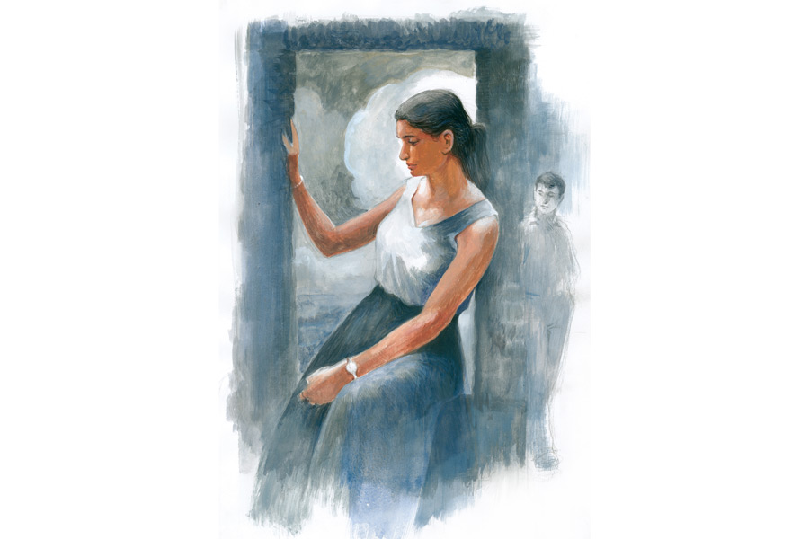

 
 <h1 align=center>ভাঙন</h1>
<h2 align=center>সব্যসাচী ধর</h2> ঘোলা জলের ঘূর্ণির দিকে তাকিয়ে চুপ করে বসে থাকতে থাকতে হঠাৎ বাবার ডান হাতটা চেপে ধরে রামকাকা বলেছিল, “দেখতেই তো পাচ্ছ জগদীশ, চোখের সামনেই সব এক এক করে চলে গেল। কোন দিন হঠাৎ শুনবে এই বসতবাড়ির সামনের বসার জায়গাটুকুও খেয়ে ফেলেছে। আর এই রাধামাধব মন্দির, এই শালগ্রাম শিলা...” তার পর কিছু ক্ষণ চুপ করে থেকে বড় অনুনয়ের গলায় বলেছিল, “ভাই জগু, আমাদের কিছু জিনিস এ বার বরং তোমরাই নিয়ে যাও। এই ধরো বাপ ঠাকুদ্দার রেখে যাওয়া কাঁসা পেতলের কিছু খাগড়াই হান্ডা গামলা, আর ধরো নিভার মায়ের সীতাহার, আর এক জোড়া মকরমুখী বাউটি, তা ছাড়া আমার ঠাকুমার আমলের চম্পাকলি, মদনকৌড়ি, লবঙ্গ— এ ধরনের সাবেকি গয়না কিছু এখনও আছে। আর  রাধামাধব মন্দিরের শালগ্রামটাও পাঠিয়ে দেব আমাদের  রতন আচায্যিকে দিয়ে। না না, শালগ্রামের নিত্যপুজোর জন্য তোমাকে ভাবতে হবে না। সে আমার মেয়ে নিভাননী সামলে দেবে। ওকেও নিয়ে যেতে পারো না, তোমার বৌমা করে? সবচেয়ে বড় দুশ্চিন্তা কী জানো জগদীশ, রাধামাধব আর শালগ্রাম আমাদের কুলীন দেবতা। বংশে আর তো কেউ নেই যে সেবা করতে পারে! আর বিধাতাও বিরূপ। ও সব তোমার ঘরে গেলে আমার আর চিন্তা থাকে না ভাই।”

আচমকা এমন প্রস্তাবে বাবা হতভম্ব হয়ে গিয়েছিল। বিষয়ী লোক বাবা কিছু ক্ষণ চুপ থাকার পর বলেছিল, “তোমার প্রস্তাব তো জলে ফেলার মতো নয় ভাই। ধরে নাও সমর্থন দিয়েই গেলাম। তবুও  ছেলের মাকে আর ছেলেকে এক বার  জিজ্ঞেস না করে পাকা কথা দিই কী করে বলো তো?”

জমিজমা আর পুকুর থেকে যে আয় হত, তা আনতে বছরে বারদুয়েক গ্রামের বাড়ি যেত বাবা। রামকাকার মতো সৎ লোকের কাছেই আমাদের গ্রামীণ সম্পত্তির হিসাব-নিকাশ থাকত।

ওখানে বাবার হাত ধরেছিল রামকাকা। অফিস থেকে ফেরার পর রাতে খাবার টেবিলে দু’-একটা কথার পর  আমার পিঠে বাঁ হাতটা রেখেছিল বাবা। নেহাত আমাদের দু’জনের ডান হাতে খাবার লেগে ছিল, নইলে হাত ধরেই বলত। রামকাকার অনুনয়ের ফিরিস্তি দিয়ে মাকে রাজি করিয়ে রেখেছিল বাবা। মায়ের মনে শালগ্রাম শিলার ব্যাপারটা খুব প্রভাব ফেলেছিল। ঠাকুর নিজে থেকে আসতে চান আমাদের বাড়ি। শিলারূপী গোবিন্দর আগমনকে মা খুব সিরিয়াসলি নিয়েছিল।

আমি অবাক হয়ে শুধু বলেছিলাম, “এ ভাবে বিয়ে? এ সব তো আদ্যিকালের সিনেমায় দেখা যায়। তুমি এ ভাবে কথা দিয়ে এসে ঠিক করলে? পরে এ নিয়ে কথা বলব তোমাদের সঙ্গে।”

উঠে এসেছিলাম খাবার টেবিল থেকে। ঘুম আসছিল না। বহু দিন পর নিভাকে মনে পড়ছিল। এক বার নিভার হাত ধরেছিলাম একা পেয়ে। নিভা কি ও-সব কথা ওর বাবা-মাকে বলে দিয়েছে না কি? তবে সে তো বহু কাল আগের কথা। আর  নিভা তো তখন খুব বেশি হলে মাধ্যমিক পেরিয়েছে। আর আমার বি টেক শেষ হয়েছে। মনে হচ্ছে নিভার সে দিনের কথা আবার মনে পড়েছে। এই এত দিন পর ভাঙনের কিনারায় দাঁড়িয়ে সামান্য একটা ঘটনার জন্য ব্ল্যাকমেল করছে না কি নিভা! উফ! কী সাংঘাতিক মেয়ে!

বিছানার চাদরটা পাল্টে দিতে এসেছিল নিভা। বাবার সঙ্গে গ্রামের বাড়িতে গিয়েছিলাম। কী কারণে যেন বাবা সে দিন ফিরে আসেনি। হ্যাঁ, মনে পড়েছে, একে পৌষ মাস, তার উপর বৃহস্পতিবারের পূর্ণিমা। কাকিমা সে দিন ধান বিক্রি করতে দেয়নি। আমাদের জমির ধানের গোলা ছিল নিভাদের বাড়িতেই। রাধামাধব মন্দিরে সে দিন পূর্ণিমার পুজো হয়েছিল। সারা দিন নিভাদের বাড়িতে কাটানোর পর সন্ধেয় গায়ত্রী কাকিমা ওকে পাঠিয়েছিল বিছানার চাদর পাল্টে দিতে। পাশেই ছিল আমাদের বাড়ি।

“চাদরের একটা খুঁট ধরো তো অভিদাদা...” চাদর পাতা হলে লাফ দিয়ে শুয়ে পড়েছিলাম বিছানায়।

“উফ! কী শক্ত বিছানা রে! শুয়ে দেখ নিভা।”

“আমি শুতে যাব কেন? তুমি শোও অভিদাদা।”

“নিভা, তোর গায়ে এত সুন্দর গন্ধ কেন রে? কী মাখিস রে তুই? তোর চুল থেকেও একটা অদ্ভুতগন্ধ পাচ্ছি।”

কেমন একটা অদ্ভুত ঘোর লেগেছিল ওই পৌষালি আলো-আঁধারির  নির্জন গ্রাম্য পরিবেশে। তখনই উঠে এসে একটু জোর খাটিয়েছিলাম ওর উপরে। হাত ধরে কী যেন বোঝাতে চেয়েছিলাম।

“দাঁড়াও, মাকে বলছি।”

খুব ভয় পেয়ে গিয়েছিলাম সে দিন। গত রাতের অভব্যতার সঙ্কোচ আর জড়তা নিয়ে পরদিন সকালবেলায় ওদের বাড়ি গিয়ে  বুঝতে পেরেছিলাম, সে সব কিছুই নেই। হাসি-হাসি মুখ করেই কাকিমা দুধ-চিঁড়ে খেতে দিয়েছিল। নিভা অবশ্য এক ফাঁকে বলেছিল, “বাড়ি যাও না, তার পর সব বলে দেব বাবা-মাকে। তার পর তোমাদের বাড়িতে চিঠি যাবে।”

না, আমাদের বাড়িতে কোনও চিঠি আসেনি। বাবা বছরের পর বছর ওদের বাড়িতে গেছে। বাৎসরিক আয়ের টাকা পয়সা নিয়ে এসেছে। নিভা কি এত দিন পর আমার ওই একটু দুষ্টুমিকে রংচঙে করে প্রকাশ করে দিয়েছে? ওদের পরিবারে কি আলোচনা হয়েছে, নিভাকে আমাদের বাড়িতে পাঠিয়ে দেওয়া যায়?

এর পর এক দিন এক বিশেষ মুহূর্তে সুযোগ বুঝে আমার হাত ধরেছিল রোহিণী। রোহিণী আমার কোলিগ। আমরা দু’জনে সাইটের ভিজ়িটে গেছিলাম। মফস্সলের দিকে আমাদের কনস্ট্রাকশন কোম্পানির একটা বড় প্রজেক্ট তখন প্রায় শেষের দিকে। হাইরাইজ়গুলোর একটার টপ ফ্লোরের জানলার ধারে দাঁড়িয়েছিল রোহিণী। অস্পষ্ট গ্রামগুলোর দিকে তাকিয়ে থাকতে থাকতে, আমাকে কাছে ডেকে হঠাৎ আমার  হাত ধরে বলেছিল, “এখানে আমাদের একটা ফ্ল্যাট নিয়ে রাখলে হয় না অভি?”

ওর অবশ্য দোষ নেই। সম্পর্কটা যেখানে পৌঁছেছিল তাতে বাসা বাঁধার খড়কুটো জোগাড় করার কথা ভাবতে পারাই যায়। তবুও বলেছিলাম, “এত তাড়া কিসের, আর আমাদের তো শহরে একটা বাড়ি আছে।”

“সে তো জানি। কিন্তু এখান থেকে যে ভাবে আকাশ দেখা যায়, দূরের গ্রামের সবুজ দেখা যায়, সে তো তোমার শহরের ভিতরে পাবে না। ভবিষ্যতের জন্য কিছু ইনভেস্ট করে রাখাও তো দরকার। আচ্ছা, এখান থেকে তোমাদের গ্রামের বাড়ি কত দূর যেন?”

“এই রাস্তা ধরেই তো। ধরো আরও পঁয়তাল্লিশ পঞ্চাশ কিলোমিটার! আর তুমি যে ভাবে গাড়ি ছোটাও, তাতে খুব বেশি হলে ওই মিনিট চল্লিশ।”

হ্যাঁ, আমরা বাইরে গেলে রোহিণীই আমার গাড়ির স্টিয়ারিং ধরত। ভীষণ জোরে গাড়ি ছোটাতে ওর ভাল লাগত। চালানোর হাতও পাকা। সাইট ভিজ়িটের পর রোহিণীর হঠাৎ এক দিন মনে হয়েছিল, আমার গ্রামের বাড়ি যাবে। আমাকে বলেছিল, “চলো, এক বার তোমাদের গ্রামের জমিদারি আর ফুলহারের ভাঙনটা নিজের চোখে দেখে আসি।”

আমার কেমন একটা বাধো-বাধো লাগছিল। ওখানে গেলে তো রামকাকাদের বাড়িতে উঠতে হবে। ভাবছিলাম, ওই সোসাইটিতে আমরা অবিবাহিত দু’জন ছেলেমেয়ে গেলে সবাই কেমন ভাবে নেবে! কিন্তু রোহিণীকে আটকানো যায়নি। আমার অনিচ্ছে দেখে রোহিণী বলেছিল, “তোমাদের গ্রামে যদি আমাদের কোম্পানির প্রজেক্ট শুরু হয়?   আমাদের তো রিভার ক্রেভাসেসের উপর কাজ করতে হয়। ধরো যদি কালকেই আমাদের এমডি স্যর দু’জনকে ওখানে পাঠান, তুমি যাবে না? চলো ঘুরে আসি।”

খুব অবাক হয়েছিল নিভা। অনেক বড় হয়ে গিয়েছে মেয়েটা। ফুলহারের ভাঙন পরিণত করেছে ওকে, আর দীর্ণ করেছে ওদের সংসার। এ দিকে হঠাৎ আসার প্রসঙ্গে আমি খুব গুছিয়ে মিথ্যে বলেছিলাম কাকা-কাকিমাকে। গায়ত্রীকাকিমা খুব অবাক হয়েছিল রোহিণীকে ড্রাইভারের সিট থেকে নামতে দেখে। ওরা আমার আর রোহিণীর সম্পর্ক নিয়ে কিছু বুঝতে পারেনি, কিন্তু নিভা কিছুটা আঁচ করেছিল। ফেরার সময় আমার সিটের পাশে মুখ এনে শুধু নিভা বলেছিল, “অভিদাদা তুমি যেন গাড়ি চালিয়ো না, তুমি যা ভিতু!” তার পর মুচকি হেসে রোহিণীকে বলেছিল, “তুমি এনেছ বলে বেচারা এল, নইলে ভয়ে আর এ দিকে আসেই না। যা ভিতুর ডিম অভিদাদা!”

নিভার কথাগুলো রোহিণীকে বেশ অবাক করেছিল। আমি কোনও দিন নিভার কথা বলিনি ওকে। অথচ নিভার কথাগুলোয় যেন অদ্ভুত একটা ভিতরের অর্থ খুঁজে পেয়েছিল রোহিণী। বারকয়েক জিজ্ঞেস করেছিল রাস্তায়, কিন্তু আমার উত্তর না পেয়েও বুঝেছিল, কোথাও যেন একটা চাপা ইতিহাস আছে।

 

বাবার সঙ্গে ডিনার টেবিলের কথাগুলোর পর বার বার মনে হচ্ছিল রোহিণীকে কী করে বলা যায়, গ্রামে গিয়ে এমন একটা ঘটনা বাবা ঘটিয়ে এসেছে। আমার অমত সত্ত্বেও রোহিণী সেই ফ্ল্যাটটা কিনে ফেলেছিল। এত সুন্দর ফ্ল্যাটটা কিনতে আমার অনিচ্ছায় বেশ অবাক হয়েছিল রোহিণী। শেষমেশ আমি কিছু টাকাও দিয়েছিলাম পরিস্থিতি সামাল দিতে। আমরা অফিস শেষে মাঝে মাঝে ওখানে যেতাম গল্প করতে করতে সূর্যাস্ত দেখার জন্য।

অফিসে আমাকে সবাই সে দিন খুব চিন্তিত দেখেছিল। রোহিণী বুঝতে পেরেছিল, কিছু একটা ঘটেছে। আমাকে ফ্ল্যাটে নিয়ে গিয়েছিল জোর করে। সূর্য ডুবতে আর কিছুটা দেরি আছে। বার বার জিজ্ঞেস করার পর আদ্যোপান্ত বলে হালকা হয়েছিলাম। এমনকি সেই কবে পূর্ণিমার রাতের জ্যোৎস্নায় ভরা গ্রামের একটা আধো অন্ধকার ঘরে নিভার হাত ধরেছিলাম, তাও বলেছিলাম।

সব শুনে রোহিণী বেশ কিছু ক্ষণ চুপ করে বসেছিল। কোনও অশান্তি, কোনও বিতর্ক তৈরি করেনি। শুধু এক বার যেন চমকে উঠেছিল ওই নিভার হাত ধরার কথাটা বলার সময়। অদ্ভুত ভাবে তাকিয়ে ছিল আমার দিকে। তার পর বলেছিল, “সূর্য ডুবে যেতে আর দেরি নেই। চলো আমরা বেরোই।”

“কোথায় যাবে?” অবাক হয়েছিলাম আমি।

“একটা এ পার-ও পার করে আসি সম্পর্কটার।”

কেমন অচেনা লাগছিল রোহিণীকে। প্রবল জোরে গাড়ি চালিয়েছিল রোহিণী। এক বার একটা গাড়িকে মারাত্মক ভাবে ওভারটেক করার সময় আঁতকে উঠে বলেছিলাম, “করছ কী! আস্তে চালাও! প্লিজ়!”

আমি বুঝতে পারছিলাম, রোহিণী রামকাকার বাড়িতে গিয়ে বলে আসবে আমাদের সম্পর্কের কথা। আমাদের সম্পর্কের মধ্যে নিভার কোনও অস্তিত্ব থাকতে পারে না, সোনাদানা আর শালগ্রাম শিলার যতই হাতছানি থাক না কেন!

আমার আতঙ্ক দেখে রোহিণী আশ্বাস দিয়েছিল, “ভয় করছে? এত তাড়াতাড়ি কিছু হবে না। আরও স্পিড আছে অভি আমার চালানোয়। আর আমার তো চেনা রাস্তা অভি।”

আমাদের গ্রামে যেতে নদীর পাড় বরাবর রাস্তা। এখানে নদী পাড় ভাঙতে ভাঙতে প্রায় রাস্তায় উঠে এসেছে। সূর্য ডুবে গিয়েছে। আলো কমে আসছে।

“আমার বাঁ হাতটা এক বার তোমার দু’হাত দিয়ে ধরো তো অভি।”

“এ ভাবে? এই গাড়ি চালানো অবস্থায়?” অবাক হয়েছিলাম আমি।

“তাতে কী! স্টিয়ারিং তো আমার ডান হাতে।”

বুঝতে পারছিলাম, রোহিণীর রাগ-অভিমান কমে এসেছে। ওর হাতের উপর হাত রেখেছিলাম।

“আর ছেড়ো না কিন্তু অভি। ধরেই থেকো, যত ক্ষণ না নিভাদের বাড়ি আসে। আর তো সামান্য রাস্তা। আমাদের আর একটু পথ।”

তার পর আচমকা প্রবল স্পিড তুলেছিল রোহিণী।

“রোহিণী, সামনে লরি, লরি! রোহিণী... রোহিণী!” আমার আতঙ্কিত আর্তনাদেও আশ্চর্যজনক ভাবে যেন নির্বিকার ও। সারা দিনের এত টেনশন, তার পর এত নীরব অস্থিরতা! লরিটা থেকে বাঁচতে গাড়িটা আচমকা নদীর দিকে কাটিয়ে দিয়েছিল রোহিণী...

নদীর পলি থেকে আমাদের গাড়িটা তোলা হয়েছে। শুধু রামকাকার নয়, ভাঙন এই ক’বছরে আমাদের সেই বাড়ি আর আমাদের অনেক জমিও খেয়ে ফেলেছে। কত মানুষ আমাদের দেখছে। রোহিণী আর আমি পাশাপাশি শুয়ে আছি। রোহিণীর আর আমার বাবা-মা, রামকাকা গায়ত্রীকাকিমাদের এই অন্ধকারেও স্পষ্ট দেখতে পাচ্ছি। অসংখ্য ঝাপসা চোখের মধ্যে নিভার চোখ দুটো বেশি ঝাপসা দেখতে পাচ্ছি। আমার আর রোহিণীর চোখগুলোই শুধুমাত্র স্থির এবং শুকনো। ফুলহারের পলি আমাদের উপরে একটা সাদা স্তরের আবরণ তৈরি করেছে। বুঝতে পারছি, নিভা আর রোহিণী দু’জনেই আর আমার হাতের প্রত্যাশা করে না।

চার হাত দূরেই পড়ে থাকল চারটি হাত।