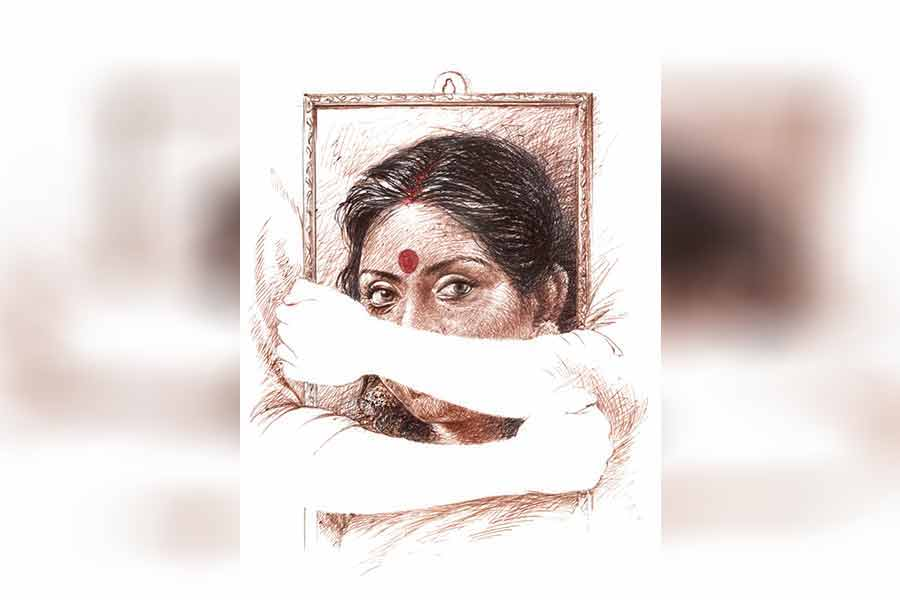

 
 <h1 align=center>ভাবমূর্তি</h1>
<h2 align=center>চিত্রালী ভট্টাচার্য</h2> 

কিছু বলতে গিয়ে থেমে গেল প্রণবেশ, সামলে নিল নিজেকে। ঢোক গিলল, চশমা খুলে রুমাল দিয়ে ধীরে ধীরে কাচদুটো মুছল, তার পর চোখ তুলে আবার যখন বলতে শুরু করল, তখনও স্বর কাঁপছিল। থেমে থেমে একটু একটু করে বলছিল, বাকিটা দীর্ঘশ্বাস হয়ে বেরিয়ে আসছিল ভিতর থেকে। বড় ছেলে সেই দেখে হাত রাখল বাবার পিঠে, হয়তো বলতে চাইল, কষ্ট হচ্ছে যখন তখন থাক না। সত্যিই তো বয়স হয়েছে। গত বৈশাখে পঁয়ষট্টি পেরোল। তবু প্রণবেশ বলে গেল ওই ভাবে। একটা বাক্যের পর বেশ খানিকটা বিরতি দিয়ে আর একটা বাক্য, যেন দুঃখ দিয়ে গাঁথা কোনও শ্লোক। সত্যি, আর কী ভাবেই বা বলবে প্রণবেশ! দীর্ঘ চল্লিশ বছর এক সঙ্গে কাটানোর পর যে চলে গেল, তার স্মরণসভায় বেদনা ছাড়া আর কী-ই বা উচ্চারিত হতে পারে!

এত ক্ষণ আমি অপলক তাকিয়ে ছিলাম ওর দিকে। আমাকে দেখতে পায়নি প্রণবেশ, পাওয়ার কথাও নয়। আমি তো এখন সকলের ইন্দ্রিয়গোচর ক্ষমতার ও পারে, জীবনমরণের সীমানা ছাড়ায়ে...

কথা বলতে বলতে প্রণবেশ পাঁচ বার চোখ মুছেছে, ঢোক গিলেছে বার বার। নিশ্চয়ই বুকও কেঁপেছে বেশ কয়েক বার। দেখা না গেলেও এ আমি হলফ করে বলতে পারি। স্বাভাবিক। এত বছর এক সঙ্গে থাকতে থাকতে দু’জনের দু’জনকে এত বেশি করে জানা হয়ে গেছে যে, মাঝে মাঝে মনে হত ও আর ও নেই, আমি হয়ে গেছে। তবে ও যে আমাকে তেমন ভাবে চেনেনি, তা আজ ওর কথা থেকে স্পষ্ট হয়ে গেল। এই যে এত ক্ষণ ধরে ও ধরা গলায় যা যা বলে গেল, আমি কি সত্যিই ততটা বলার মতো! শিক্ষা-দীক্ষায়, স্বভাবে, চারিত্রিক বৈশিষ্ট্যে অধ্যাপক প্রণবেশ বসু যে মাপের মানুষ, আমি কি তার ধারেকাছে দাঁড়াতে পারি! ভালবাসা নেহাত তুচ্ছকেও রাজমহলে প্রবেশের অধিকার দিয়ে ফেলে, তাই আমিও এক দিন ওর হাত ধরে এ বাড়িতে ঢুকতে পেরেছিলাম।

ও বলছিল, আমি চলে যাওয়ায় এই পরিবারের নাকি অপূরণীয় ক্ষতি হয়ে গেছে। শুনে আমি হেসেছি। প্রণবেশ জানেই না, এ বাড়িতে আমার আসনটি ঠিক কেমন ছিল। আমিও ওর সামনে সে আবরণ উন্মোচন করিনি কোনও দিন। আজ বলতে বাধা নেই, এ বাড়িতে আমার অস্তিত্ব ছিল নগণ্য। আমি যে নিতান্তই সাধারণ মানের, সে কথা বার বার মনে করিয়ে দিত ওরা। না, গলা ফাটিয়ে, সারা পাড়া জড়ো করে নয়— ঠান্ডা মাথায়, ভেবেচিন্তে। মিছরির ছুরি আর বাক্যবাণই ছিল তাদের আক্রমণের প্রধান অস্ত্র। এ এক আশ্চর্য স্নায়বিক হত্যাপ্রক্রিয়া। প্রণবেশ জানত না এত সব।

প্রণবেশের কথা বলা শেষ হতে পরিবেশটা হঠাৎ ভারী হয়ে উঠল। একটা বিষণ্ণ হাওয়া গুম মেরে থাকল ঘরের মধ্যে। সেই গুমোট কাটানোর জন্য মেয়ে গান ধরল, তুমি কি কেবলই ছবি...

বৈঠকখানার মাঝখানে বড় টেবিলের উপর আমার একটা বড়, বাঁধানো ছবি। লালপেড়ে সাদা কাতান মাথার উপর দিয়ে ঘোমটার মতো হয়ে ঘুরে নেমেছে। কপালে বড় সিঁদুরের টিপ, তার দু’পাশে চন্দনের আলপনা। রজনীগন্ধার মালা ছবি ঘিরে। আমাকে যে এত সুন্দর দেখতে, তা আগে কোনও দিন বুঝতেই পারিনি। বিশেষ বিশেষ মুহূর্তে প্রণবেশ বলত অবশ্য, আমি তেমন বিশ্বাস করতাম না। যাক সে সব, কবে যেন তোলা হয়েছিল ছবিটা? মনে পড়েছে, দুর্গাপুজোর সময়। আজকাল তো মোবাইলে তোলা ছবি কী সব করে অসাধারণ করে তোলা যায়। এটা কিন্তু তা নয়। এটা একেবারে সত্যি সত্যি কারিকুরিবিহীন ছবি। তবে সাজানোর গুণে আরও উজ্জ্বল হয়ে উঠেছে। ওই মুখে সিঁদুরের টিপ আর সোনালি ফ্রেমের চশমাই যে মানায়, এটুকু বুঝতে আমি যে কত দুপুর নষ্ট করেছি, তা শুধু আমিই জানি, আর জানে আমার ছায়াসঙ্গী নমিতা।

কী জ্বালাতন করেছি ওকে! কত বার ওকে দিয়ে গোপনে চশমার ফ্রেম পাল্টেছি। নানা মাপের টিপ পরে এক বার আয়নার সামনে দাঁড়িয়েছি, এক বার ওর সামনে। ও প্রতি বারই তারিফ করায় বিরক্ত হয়ে ধমক দিয়ে বলেছি, “যা বলবি সত্যি বলবি। অযথা স্তুতি করবি না বলে দিলাম।”

ধমক খেয়ে ও গোমড়া মুখে বলেছিল, “জানোই তো সোনামা, ওই বড় চাঁদের মতো লাল টিপটাই তোমাকে সুন্দর মানায়, শুধু শুধু আমাকে জিজ্ঞেস করো কেন?”

ও কী করে জানবে যে, আমি এক অসম যুদ্ধে নেমেছি। এ বাড়িতে যারা আমাকে পরাস্ত করতে চাইছে, তারা অনেক বেশি শক্তিশালী। আমি আসলে ওদের সমকক্ষ হওয়ার জন্য আমার একটা অন্য ভাবমূর্তি গড়তে চাইছি। বেশি কিছু নয়, আমার রূপটাকে খুব করে কাজে লাগিয়ে ওদের সামান্য বিপদে ফেলতে
চাইছি মাত্র। নমিতার এ সব বোঝার কথা নয়।

সেই নমিতা এখন বসে আছে আমার পাশেই। আমার গায়ে ওর গা ঠেকছে, অথচ আমাকে দেখতে পাচ্ছে না। এই অদৃশ্য ভাবটা আমাকে খুব মজা দিচ্ছে। এখন সবার প্রকৃত ইমোশন স্পষ্ট করে অনুভব করতে পারব হয়তো।

বড় জা, মানে শতরূপা বসু এ বার চেয়ার ছেড়ে উঠল আমাকে নিয়ে কিছু বলার জন্য। এই প্রথম বোধহয় ও আমার সমালোচনায় মুখর হয়ে উঠতে পারবে না, কারণ স্মরণসভায় মন্দ বলা অশোভন। আমার খুব পুলক হচ্ছিল। উদ্‌গ্রীব হয়ে ছিলাম ও কী বলে শোনার জন্য, আর মনে পড়ে যাচ্ছিল অনেক পুরনো কথা। বিয়ের পর আমি ওকে ‘দিদিভাই’ বলে ডাকতাম, কিন্তু সে ডাক ওর পছন্দ হয়নি। এক দিন আমায় ডেকে বেশ মিষ্টি করে বলেছিল, “শোনো, তুমি আমাকে রূপাদি বলে ডেকো। তোমার ও সব ডাক আমার প্রোফাইলে ঠিক যায় না। আর একটা কথা, এ বাড়ির মেয়ে-বৌরা সকলেই খুব স্মার্ট, তাদের প্রত্যেকেরই সোসাইটিতে একটা ইমেজ আছে, তুমিও সেটা গড়ে তোলার চেষ্টা করো। প্রয়োজনে আমি প্রণবেশকে বলে দেব, ও যেন তোমায় মরাল সাপোর্টটা দেয়, কেমন?”

আমি চুপ করে তখন ভেবেছিলাম, শিক্ষা কি খুব কঠিন করে দেয় মানুষকে? না তো! তা হলে তো প্রণবেশও ও রকম হত। যাকগে, প্রণবেশ এ সব শুনে কী করবে জানি না, কিন্তু আমি কি পারব কোনও দিন নিজেকে গড়ে তুলতে? আমার থাকার মধ্যে আছে একটা নরম মন। ও দিয়ে কিচ্ছু হয় না! মা গান শিখিয়েছিল, গাইতামও মন্দ নয়। তবে তার দৌড়ও ওই বাড়ির অনুষ্ঠান পর্যন্ত। ও দিয়ে শতরূপার মতো বড় প্রতিষ্ঠানের সমান হওয়া অসম্ভব।

দেখতে দেখতে এক দিন ছোট জাও এল বাড়িতে। সেও আর এক বিদ্যেধরী। ও-পক্ষ আরও জোরদার হল। আর আমি তখনও যে কে সেই। পর পর হয়ে যাওয়া তিন ছেলেমেয়ে নিয়ে জেরবার। ও-পক্ষ এত মোলায়েম করে মিছরির ছুরি চালাত যে, আমার রক্তাক্ত হয়ে চলা কেউ টেরও পেত না। এ বিষয়ে কী যে পারদর্শিতা ছিল ওদের! প্রতি বার ঘায়েল করে ফেলত ঠিক। সারাটা দিন সঙ্কোচ তাড়া করে বেড়াত আমাকে। মাঝে মাঝে প্রণবেশের সঙ্গে এক বিছানায় শুতে পর্যন্ত লজ্জা করত। বার বার ঠাকুরকে বলতাম, ‘কবে পারব আমি? কবে?’

যা-ই করতাম, সেটাই খুব তুচ্ছ মনে হত। ও-পক্ষও আড়ালে হাসাহাসি করত আমাকে নিয়ে। আর আমি দিনরাত এটা-ওটা গুচ্ছের কাজ করে বেড়াতাম। সেলাই করতাম, আঁকতাম, খাবার বানাতাম, ওর ঘরটা গিয়ে গুছিয়ে দিয়ে আসতাম, প্রণবেশ না চাইতেই বার বার ওর স্টাডিতে গিয়ে চা দিয়ে আসতাম। এ সব করতে করতে ধীরে ধীরে অদম্য একটা ইচ্ছে শক্তিরূপিণী হয়ে উঠতে শুরু করেছে, বুঝতে পারতাম।

প্রণবেশ মাঝে মাঝে অবাক হয়ে তাকাত আমার দিকে। এক দিন বলেই ফেলল, “কী হয়েছে তোমার?”

“কিছু না তো!” আমি প্রশ্নটা এড়িয়ে গেলাম।

“এত কাজ তোমার সহ্য হবে? নমিতা তো আছে, বললে আরও এক জন লোককে না-হয়...”

“তা হলে আমি কী করে কাটাব সারাটা দিন?”

“ভাল কিছু করবে।”

“এটা কি ভাল কিছুর মধ্যে পড়ে না?” নিজের অক্ষমতা ঢাকতে পাল্টা প্রশ্ন করলাম।

“তা নয়...” বলে ও চুপ করে গেল। আর আমি আরও বেশি বেশি কাজের জটে জড়িয়ে ফেললাম নিজেকে। ভোর থেকে দুপুর, দুপুর থেকে সন্ধে, সন্ধে থেকে রাত। কাজ করতাম আর নিজেকে সাজিয়ে তুলতাম। কাজের ফাঁকে ফাঁকে বার বার আয়নার সামনে গিয়ে দাঁড়াতাম। আর একটা কাজ খুব গোপনে অভ্যেস করতে শুরু করেছিলাম, তা হল, নিজেকে বঞ্চনা। কী করে যেন মনে হয়েছিল, ও-পক্ষ এটা পারবে না। তাই খুব যত্ন নিয়ে নিজেকে বঞ্চিত করতে শুরু করলাম। একটু একটু করে ছাড়তে লাগলাম সব কিছু। পছন্দের খাওয়াদাওয়া, শাড়ি, গয়না... সব। ও-পক্ষ ধার দিত বুদ্ধিতে, আর আমি ত্যাগে। বুঝতে পারছিলাম না ঠিক পথে এগোচ্ছি কি না, কিন্তু এ ছাড়া আর কোনও পথ যে জানা ছিল না। সেই ঘৃণার সাবমেরিন থেকে ঘন ঘন বোমা বর্ষণ চলছিল, আর আমি একটা একটা করে শখ বিসর্জন দিচ্ছিলাম জলে। শরীর দুর্বল হয়ে পড়ছিল, চলতে ফিরতে হাঁপ ধরছিল, বুকের বাঁ দিকে একটা চাপ ধরা ভাব। গ্রাহ্য করছিলাম না। এ ভাবেই ঘুরছিল বছর।

তার পর হঠাৎই এক দিন বদলে গেল চাল। সব দান কেমন করে যেন আমার পক্ষে পড়তে শুরু করল। রাতে খাবার টেবিলে বড় ছেলে আচমকাই বলে উঠল, “মা, তোমাকে একেবারে অন্য রকম লাগছে!”

বড় জা, থুড়ি রূপাদি চমকে তাকাল আমার দিকে। ছোট জা চোখ বড় বড় করে জিজ্ঞেস করল, “কী রকম? কী রকম?”

সকলে ঘুরে তাকাল আমার দিকে, এমনকি প্রণবেশও! সে যে কী বিড়ম্বনা! হাত ফস্কে হাতাটা পড়ে গেল মাটিতে। আমি জড়সড় হয়ে দাঁড়িয়ে সবার মাঝখানে। কী হল বুঝতে পারছি না! কী পরিবর্তন ঘটল আমার মধ্যে যে সকলে একেবারে...

বড় ভাশুর অনিমেষ হাসি-হাসি মুখে বলে উঠল, “একদম ঠিক বলেছিস রাণা, মেজবৌ দিন দিন মা অন্নপূর্ণা হয়ে উঠছে। সারা দিন আমাদের জন্য যা করে।”

“না না, শুধু কাজ নয়, মা’র মুখের দিকে এক বার তাকাও, কী সুন্দর দেখাচ্ছে দেখো!”

“রাণা!” আমি ধমকে উঠি, “কী সব বলে যাচ্ছিস পাগলের মতো!”

আমাকে থামিয়ে দিয়ে অনিমেষ বলে উঠল, “ওকে থামিয়ে দিয়ো না মেজবৌ, বলতে দাও। আমরা যা দেখতে পাইনি, বলতে পারিনি এত দিন, ওই ছেলে কী সুন্দর করে তা সবাইকে দেখিয়ে দিল বলো তো!”

সব থেকে আশ্চর্যের বিষয় হল, আমার দুই জাও এই প্রথম ওদের ঠান্ডা যুদ্ধের সব নিয়মকানুন এলোমেলো করে অবাক হয়ে তাকিয়ে থাকল।

প্রণবেশ খাওয়া শেষ করে উঠে চলে যাওয়ার সময় আমার দিকে কেমন করে যেন তাকাল। আমি চোখ নামিয়ে নিলাম। তাড়াতাড়ি কাজ সারতে লাগলাম। যেমন করেই হোক, আজ প্রণবেশ ঘুমোনোর
আগে আমায় যেতেই হবে ওর কাছে। ওর চোখ কী বলতে চাইছিল
জানতেই হবে।

কিন্তু কাজ সারতে সারতে সেই রাত হয়ে গেল। ঘরে ঢুকে দেখি, ও মা! ও জেগে!

“ঘুমোওনি!” জিজ্ঞেস করলাম।

“না। অপেক্ষা করছিলাম।”

“কিছু বলবে?”

“হ্যাঁ। বলব বলেই তো জেগে বসে আছি।”

“কী বলবে?”

নিজের খুব কাছে আমাকে টেনে নিয়ে ও বলল, “সত্যি, দিন দিন তুমি এত অন্য রকম হয়ে উঠছ যে
কী বলব!”

“কী রকম?”

“আমি ঠিক বলে বোঝাতে পারব কি না জানি না। তবু এত দিন দর্শনের চর্চা করেছি, সেই অনুভব থেকেই বলি, খুব গভীর চেতনার স্তরে আমূল পরিবর্তন হলেই বোধহয় এমনটা সম্ভব। সবার থেকে আলাদা লাগছে তোমাকে, তুমি জানো?”

শুনতে শুনতে আমি সিঁড়ি বেয়ে উঠে যাচ্ছিলাম স্বর্গে। কারা যেন জয়মাল্য পরিয়ে দিচ্ছিল আমার গলায়। কী ভাল যে লাগছিল! শেষ অবধি... শেষ অবধি... আমি কি পারলাম লক্ষ্যে পৌঁছতে!

কিন্তু সময় বড় নিষ্ঠুর! ফুরিয়ে এলে আর এক মুহূর্তেরও জন্যও বুঝি দাঁড়াতে রাজি নয়! কারও জন্যই নয়, কখনও নয়।

ঠিক তখনই হঠাৎ বুকের বাঁ দিকে গোপনে বেড়ে ওঠা, সেই পিন ফোটার মতো ব্যথাটা চিনচিন করে উঠল। আমি এড়িয়ে যেতে চাইলাম, পারলাম না। বাড়তে বাড়তে ব্যথাটা এক সময় অসহ্য হয়ে উঠল। আমি বাঁচার জন্য প্রণবেশকে আঁকড়ে ধরতে গেলাম, কিন্তু শিথিল হয়ে এল শরীর। মাথাটা আপনিই নেমে এল প্রণবেশের বুকের উপর। দুর্বল হৃদ্‌যন্ত্র সেই অসহনীয় আনন্দের ভারও বইতে পারল না।

শুনতে পেলাম ও চিৎকার করে ডাকছে, “তনুজা...তনুজা...”

স্মরণসভা শেষ। উপস্থিত সকলেই ধীরে ধীরে বেরিয়ে যাচ্ছে হলঘর থেকে। একদম শেষে প্রণবেশ। বুকের উপর ও দু’হাত দিয়ে জড়িয়ে ধরে আছে আমার ছবিটা। কিংবা আমার সেই ভাবমূর্তি। নিজেকে তিলে তিলে ক্ষয় করে যা ওর জন্যই গড়ে তুলেছিলাম আমি।

