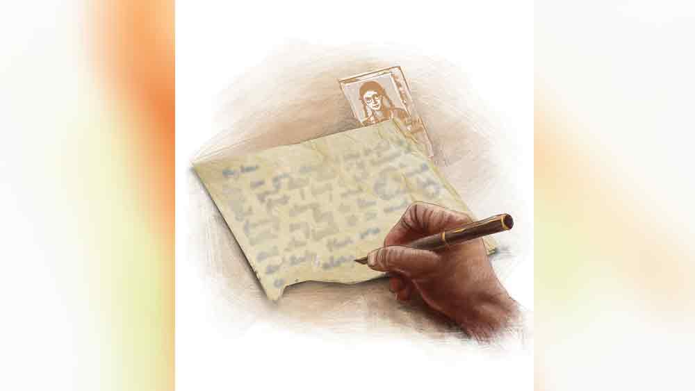

 

<h1 align=center> ভালবাসার টুকরো</h1>
<h2 align=center>অধীর সিংহ</h2>
অক্ষরগুলো ঝাপসা হয়ে এসেছে। শুভ চশমা অ্যাডজাস্ট করে লেখার চেষ্টা করলেন। মাঝে মাঝেই লেখার ওপর কলম চালাতে হয়, না হলে ডট পেনের কালি মিলিয়ে যায়। কিন্তু আর বোধহয় লেখা যাবে না। কাগজে কালি ছেপে ছেপে উঠছে। পিছনে অন্য কাগজ ব্যাক-আপ দিতে হবে।   “জেব্বা, কী করছ? ছেঁড়া কাগজে ওভাররাইটিং করছ কেন?”   অকৃতদার শুভর ছোট ভাইয়ের মেয়ে জুলি, দিল্লি থেকে কলকাতায় জেঠুর কাছে এসে করোনা-পরিস্থিতির জন্য আটকে গেছে।   শুভ খুব মৃদু গলায়, “ও কিছু নয়,” বলে তাড়াতাড়ি কাগজটা জায়গায় রেখে দিলেন। তার পর বললেন, “লকডাউন তো খুলে যাচ্ছে, এ বার বল কবে ব্যাক করতে চাস?”   “জেব্বা, নেক্সট উইক স্কুল খুলে যাবে। এর মধ্যে আমায় এক বার কার্শিয়াং ঘুরিয়ে আনবে?”   “ওখানে তোর বন্ধু থাকে?”   “ইয়েস, আগে আমাদের সঙ্গে আমাদের স্কুলেই পড়ত। মা নেই, বাবা আর্মিতে, গত বছর লাদাখে পোস্টিং হয়েছে। তাই ওকে কার্শিয়াং ডাওহিল স্কুলে দিয়েছে। ওর বাবার এক কাজ়িনের কাছে থাকে, তিনি ডাওহিল স্কুলের টিচার।”   “ঠিক আছে, কার্শিয়াং যাওয়ার ব্যবস্থা করছি। আমরা গুরুং হোমস্টেতে থাকব।”      পরের সপ্তাহে শুভ ভাইঝিকে নিয়ে এসে পৌঁছলেন কার্শিয়াং।   “জেব্বা, এখান থেকে কাঞ্চনজঙ্ঘা দেখা যাবে?”   “মেঘ না থাকলে দেখা যাবে। কাল সকালে লাক ট্রাই করে দেখব।”   পর দিন ভোর-ভোর জুলি ছাতে গেল পাহাড় দেখতে। বেশ কিছু ক্ষণ পরে হাঁপাতে হাঁপাতে নেমে এল, “জেব্বা, দেখা যাচ্ছে, পুরো রেঞ্জ! চলো দেখবে।”   জুলির ডাক শুভর কানে গেল না। শুভ তখন চিঠিতে মগ্ন। আরও এক বার পড়ে ফেললেন। ‘ডিয়ার’ কথাটা একদম পড়া যাচ্ছে না। শুভ তার উপর কালি বুলিয়ে দিলেন। জুলি পিছনে উত্তরের অপেক্ষায় দাঁড়িয়ে।   “জেব্বা, তুমি ভিন্টেজ ফাউন্টেন পেন দিয়ে লেখো? হাউ থ্রিলিং! হোয়াই ডোন্ট ইউ ইউজ় জেল পেন? অ্যান্ড হোয়াট আর ইউ রাইটিং? আমি তোমার পিছনে দাঁড়িয়ে দেখছিলাম। সেই এক ছেঁড়া কাগজে বার বার পেন বোলাও কেন? ইফ আয়্যাম নট রং, কলকাতাতেও তুমি ওই সেম কাগজে ওভাররাইটিং করছিলে।”   এ বার আর চুপ করে থাকতে পারেন না শুভ। হাল ছেড়ে দেওয়ার মতো করে বলেন, “অনেক প্রশ্ন করে ফেলেছিস। ওরিজিনাল লেখা সে সময়ের ডটপেনে ছিল। কয়েক বছর পরেই ফেড হতে শুরু করে। তাই কালি বুলিয়ে অক্ষরগুলো তাজা রাখতে চেষ্টা করছি। অক্ষর তাজা থাকলে এই কাগজের সঙ্গে যে স্মৃতি জড়িয়ে আছে, সেও তাজা থাকবে। সে যাক, বল আজ কী প্রোগ্রাম?” শুভ অন্য কথায় চলে যেতে চাইলেন।   “প্রোগ্রাম আছে, আমার বন্ধু এখনই আসবে দেখা করতে। কিন্তু জেব্বা, স্মৃতি মানে কী?”   “স্মৃতি মানে মেমরি।”   “তা হলে বলো পুরনো কোন মেমরি তুমি ফ্রেশ রাখতে চাইছ?” জুলি একেবারে নাছোড়।   “কী করবি শুনে, সে এক লস্ট ভিন্টেজ কেস, ভাল লাগবে না।”   “ঠিক ভাল লাগবে। আমি শুনব, তুমি বলো। আমি এখানে চুপটি করে বসছি।”   নিরুপায় শুভ বলতে শুরু করেন চল্লিশ বছর আগে ফেলে আসা এক ঘটনার কথা...      শুভর স্মৃতি   তখন আমি স্কুল পাশ করে কলেজে ঢুকেছি। কিন্তু আমার আকর্ষণ আমি যে বাসে কলেজে যাই, সেই বাসের এক সহযাত্রিণী। সে পড়ে বীণাপাণি গার্লস স্কুলে। গোল ফ্রেমের চশমা-পরা ওই মেয়েটির সঙ্গে আমার রোজ দেখা হয় যাওয়ার সময়। তাই ওই বাস আমি মিস করতে চাইতাম না। কলেজে বেরনোর সময় তাড়াহুড়ো করতাম আমি।   “মা, আমার কলেজের দেরি হয়ে যাচ্ছে, শিগ্গিরি খাবার দাও। দেরি থাকলে আমি চললাম, এসে খাব।”   “সে কী রে! কাল বললি আজ দুটোর পর যাবি! ভাত হয়ে গেছে, মাছ হয়নি।”   “তুমি রেখে দিয়ো, এসে খাব।”   বলত বলতে এক ছুটে বাস স্টপে। একটু পরেই এইটবি বাস এল। আমি গুঁতিয়ে ভিতরে যাওয়ার চেষ্টা করতে গিয়ে ধমক খেলাম।   “ভাই, কেন ধাক্কা দিচ্ছেন! ভেতরে মাছি গলতে পারবে না। বীণাপাণি স্কুল এলে বাস খালি 
হয়ে যাবে।”   আমি তখন আর কন্ডাক্টরকে বলতে পারলাম না, ‘তখন ভিতরে গিয়ে কী করব! যার জন্য ভিতরে যেতে চেষ্টা করছি সে বীণাপাণি স্টপেজে নেমে যাবে।’   ঠিক তাই হল।   দুষ্টু হাসিমাখা চাউনি দিয়ে সে নেমে গেল। যার জন্য না খেয়ে ভিড় বাসে উঠলাম সেই ষোড়শী এই স্কুলেই পড়ে। চলন্ত বাসে আমার আর সেই ষোড়শীর চক্ষুর মিলন বেশ কিছু দিন ধরে চলছে। এইটবি বাসে লেডিজ় সিটে ষোড়শী তার এক সহপাঠিনীর সঙ্গে বসে আসে।   আমরা কেউ কারও পরিচয় জানি না। কোন কথাও হয় না আমাদের। শুধু আমি এক দিন ম্যানিব্যাগ আনতে ভুলে গিয়েছিলাম বলে ইশারায় মেয়েটিকে অনুরোধ করেছিলাম। মেয়েটি আমার টিকিট কেটে দিয়েছিল। নামার আগে ষোড়শী সেই টিকিট আমার হাতে গুঁজে দিয়েছিল।      “জেব্বা সরি ফর ইন্টারাপশন, হোয়াট ইজ় ষোড়শী?”   শুভ হেসে জবাব দিলেন, “সুইট সিক্সটিন!”   “সো কিউট অ্যান্ড থ্রিলিং! হোয়াট’স হার নেম?”   শুভ চুপ করে থাকলেন, একটু পরে বললেন, “নাম জানি না, সারনেম জানি, আচার্য।”   “মাই গড! তুমি তোমার ক্রাশের নামটাও জানো না? দেন হাউ ডিড ইউ কমিউনিকেট উইথ হার?”   শুভ লেখাটা দেখিয়ে বললেন, “কখনও কথা হয়নি তো।  আমি যখন এই চিঠিটার উপর দিয়ে পেন বোলাই, আই ক্যান ফিল হার প্রেজ়েন্স। আই নেভার অ্যালাও ইট টু ফেড।”   জুলি অনেক ক্ষণ চুপ করে থাকল, “জেব্বা ইউ আর আ গ্রেট সোল অ্যান্ড লাভার, বাট দ্য পেপার মাস্ট বি প্রিটি ওল্ড?”   “চল্লিশ বছর হয়ে গেল।”   “ফর্টি ইয়ারস! ইউ কুড হ্যাভ পোস্ট দ্য লেটার?”   “কুড নট, বিকজ় আই ডোন্ট হ্যাভ অ্যাড্রেস।”   “হোপলেস কেস! ছবি আছে? আমি তোমার ওই ষোড়শীকে স্যোশাল মিডিয়ায় সার্চ করে 
খুঁজে বার করব। তার পর তোমাদের বিয়ে দেব,” মুখচোখ কঠিন করে ফেলে জুলি।   “হ্যাভ পেশেন্স মাই ডিয়ার! চুপ করে শোন, বলছি...”      শুভর স্মৃতির পরবর্তী অংশ   ওই চিঠি পকেটে নিয়ে ঘুরলাম বেশ কয়েক দিন। কিন্তু সাহস হয়নি দেওয়ার। যে দিন দেব ভাবি, সে দিনই ওর সঙ্গে দেখা হয় না। এমন লুকোচুরি চলল কয়েক দিন।   তার পর সাহস করে এক দিন সেই চিঠি হাতে নিয়ে বাসে উঠলাম। বাস কম থাকায় সে দিন ভিড় এত বেশি হয়েছিল যে, আমি ফুটবোর্ডে চিঠি নিয়ে কোনও রকমে ঝুলছি। বীণাপাণি স্কুল স্টপেজ আসতে সে বেরিয়ে এল। কিন্তু বাসে এমনই ভিড়, স্কুলের মেয়েরা দরজার মুখে আসতেই লাগল এক ভীষণ ধাক্কা। আমার চিঠি-ধরা হাত ধরে সে নিজে পড়তে পড়তে সামলে নিল এবং আমরা দু’জনেই নামতে বাধ্য হলাম। মুচকি হেসে বইখাতা সামলে সে চলে গেল। চিঠির এক টুকরো দুমড়ে মুচড়ে আমার হাতেই থেকে গেল, একটা টুকরো খুব সম্ভবত তার হাতে চলে গিয়েছিল। আর আমি পেয়ে গেলাম ফুটপাতে পড়ে থাকা তার স্কুলের আই কার্ডের এক ছিঁড়ে যাওয়া টুকরো। তাতে তার নাম ছিল না, সারনেম লেখা ছিল। আর ছিল সেই মেয়েটির ছবি।      চঞ্চল হয়ে ওঠে জুলি, “ও জেব্বা, প্লিজ় এ বার কলকাতা রিটার্ন করলে দেখাবে কিন্তু।”   “কী করবি দেখে? সোশ্যাল মিডিয়ায় সার্চ করবি? ছেঁড়া আই কার্ডের টুকরো, চিঠি আর সেই মেয়েটির কেটে দেওয়া এক দিনের বাসের টিকিট— ওগুলো সব সময় আমার সঙ্গেই থাকে।”   “প্লিজ় দেখাও, প্লিজ়।”   শুভ সুটকেস খুলে নিয়ে এলেন। বিবর্ণ হয়ে যাওয়া এক টুকরো সাদা প্লাস্টিকের আই কার্ড। উপরে স্কুলের নাম, বীণাপাণি উচ্চ মাধ্যমিক 
স্কুল। বিনুনি বাঁধা, চশমা পরা এক বালিকার স্মিতমুখ।   জুলির ফোন বেজে উঠল, কথা বলতে বলতে জুলি জানলার কাছে গিয়ে আলোয় ভাল করে দেখতে চেষ্টা করল আই কার্ডের টুকরোটা।   ফোন রেখে জুলি বলল, “জেব্বা আমার যে ফ্রেন্ড কার্শিয়াং-এ থাকে, সে এসেছে রিসেপশনে। আমি গিয়ে ওকে উপরে নিয়ে আসব?”   “অফ কোর্স নিয়ে এসো।”   কিছু ক্ষণ পরে জুলি একটি কিশোরীকে নিয়ে ওপরে এল।   “জেব্বা, এই আমার বেস্ট ফ্রেন্ড সোহিনী। চলো আমরা সবাই মিলে বাইরে ঘুরে আসি...”   সঙ্গ দিতে রাজি হলেন না শুভ। দুই বান্ধবী বহু দিন পরে একে অপরকে পেয়েছে, ওদের কত কথা আছে। তার মধ্যে না থাকাই ভাল। মুখে বললেন, “আজ থাক। তোরা বরং ঘুরে আয়, বেশি দেরি করবি না। ঠান্ডা লাগবে।”   “অ্যাজ় ইউ উইশ,” জুলি বেরিয়ে গেল তার বন্ধুকে নিয়ে। তার পর শুভ্রর খেয়াল হল, তার ষোড়শীর আই কার্ডের টুকরো জুলির কাছেই রয়ে গেছে!   শুভ জানালা দিয়ে বাইরে তাকিয়ে থাকলেন। ভাইঝিকে গল্প করতে গিয়ে অতীতের সেই সব দিন তিনি আবার চোখের সামনে দেখতে পাচ্ছেন। সেই যে সে স্কুলের গেট পেরিয়ে ভেতরে গেল, তার পর তাকে আর কোন দিন দেখা যায়নি। কত বার শুভ আগে-পরের এইটবি বাসে গেছেন, কিন্তু সে নেই। অনেক দিন স্কুলের গেটে ছুটির সময় দাঁড়িয়ে থেকেছেন শুভ, কিন্তু তার দেখা মেলেনি। শুভর অনুমান, সম্ভবত মেয়েটি যাদবপুরে থাকত। এইটবি স্ট্যান্ডে গিয়ে বিফল দাঁড়িয়ে থেকেছেন। যেন ম্যাজিকের মতো সে হাওয়ায় মিলিয়ে গেছে। থাকার মধ্যে তাকে লেখা সেই চিঠি, যার অক্ষরগুলো ঝাপসা হয়ে যাচ্ছে বলে শুভ প্রায়ই ওভাররাইটিং করেন।      কিছু ক্ষণ পরেই জুলি আর সোহিনী ফিরে এল। তারা দৃশ্যতই বেশ উত্তেজিত।   এর মধ্যে ওদের বেড়ানো হয়ে গেল! অবাক হয়ে গেল শুভ, “কী রে কী হয়েছে, হাঁপাচ্ছিস কেন? সেই আই কার্ডটা তোর কাছে রয়ে গেছে।”   “আ মির‌্যাকল ইজ় গোয়িং টু হ্যাপেন। বোধহয় তোমার ষোড়শীর খোঁজ পাওয়া গেছে।”   শুভ অবাক, “সে কী! কী করে...”   নিজে যথেষ্ট উত্তেজিত, তবু শুভকে শান্ত করতে চাইল জুলি, “কুল জেব্বা, কুল। তোমাকে বলেছিলাম না আমার বন্ধু সোহিনী তার বাবার কাজ়িনের কাছে থাকে হু ইজ় আ টিচার অব ডাওহিল স্কুল। ইন অল প্রব্যাবলিটি, ইয়োর লস্ট লাভ  ইজ দ্য আন্ট অব মাই বেস্ট ফ্রেন্ড। ওঁর নাম কল্পনা আচারিয়া, শি ইজ় ফ্রম যাদবপুর, কলকাতা। সোহিনী ওর আন্টের ছোটবেলার ফোটো দেখেছে, আর এই আই কার্ডটা দেখে ও নাইন্টি পারসেন্ট শিয়োর। আজই ফিরে গিয়ে ও আন্টের সঙ্গে কথা বলবে। ওর আন্ট এক বার বলেছিল, স্কুলে পড়ার সময় এক দিন ক্লাসে ওর চোখে খুব ব্যথা আরম্ভ হয়। গ্র্যাজুয়ালি শি বিকেম অলমোস্ট ব্লাইন্ড অ্যান্ড হ্যাড টু লিভ স্কুল। কয়েক বছর পর তিনি কিছুটা ভিশন ফিরে পান। শি ইজ় স্টিল আনম্যারেড। শি টিচেস মিউজ়িক। আই অ্যাম ডেফিনিট দ্যাট শি ইজ় দ্য গার্ল। কাল তোমাকে নিয়ে আমি যাব ওঁর সঙ্গে দেখা করাতে। সোহিনী এসে নিয়ে যাবে আমাদের। ওরা ডাওহিল স্কুলের স্টাফ কোয়ার্টারে থাকে।”   সারা রাত শুভ দু’চোখের পাতা এক করতে পারলেন না। চোখের সামনে চল্লিশ বছর আগে হারিয়ে যাওয়া দৃশ্য বার বার জীবন্ত 
হয়ে উঠছে। তাঁর মানসীর নাম 
কল্পনা আচার্য! তাঁর সঙ্গে দেখা হবে এই শৈলশহরে?      পরদিন জুলি জেব্বাকে নিয়ে সোহিনীর পাঠানো গাড়িতে রওনা দিল ডাওহিল স্কুলের দিকে। বেশ কয়েকটা পাহাড়ি প্যাঁচ বেয়ে উপরে ওঠার পর স্কুল। ব্রিটিশ আমলের চার্চের আদলে তৈরি স্কুল। ক্যাম্পাসের মধ্যেই হস্টেল, ছোট আউটডোর স্টেডিয়াম। শেষে একটি স্টাফ কোয়ার্টারের সামনে থামল গাড়ি। সোহিনী বাইরে ছিল, সবাইকে ভেতরে নিয়ে গিয়ে বসাল। একটু পরে সে ধীর পায়ে এল শুভর ষোড়শীকে নিয়ে। রিমলেস ফ্রেমের ফোটোক্রোম্যাটিক লেন্সের চশমা চোখে আর সরু রুপোলি পাড়ের সাদা শাড়ি পরনে। সেই ষোড়শীর আজ ষাটের কাছে বয়স। মুখে বলিরেখার আগমন ঘটেছে। সোহিনী তাকে হাত ধরে গাইড করে নিয়ে আসছিল। শুভ এগিয়ে গেলেন।   সোহিনী তার আন্টের হাত শুভর হাতে দিয়ে বলল, “এ বার তোমরা কথা বলে নাও।”   “তুমি সেই ছেলে?” কল্পনা প্রথম কথা বললেন।   শুভ নীরবে সেই বাসের টিকিট বার করে তার হাতে দিলেন।   “তোমার লেখা সেই চিঠির এক টুকরো কাগজ আমার হাতে এসেছিল। আমি রেখে দিয়েছিলাম...”   সোহিনীর হাতে ওর আন্টের কাগজের টুকরো ছিল। জুলি জেব্বার চিঠির টুকরো বের করে সোহিনীর হাতে দিল। টেবিলে পাশাপাশি রাখতেই দুটো টুকরো একে অপরের সঙ্গে মিলে গেল।   জুলি আর সোহিনী হাততালি দিয়ে উঠল। কল্পনার গালে তখন রক্তাভা, শুভর দু’চোখ ঝাপসা।            