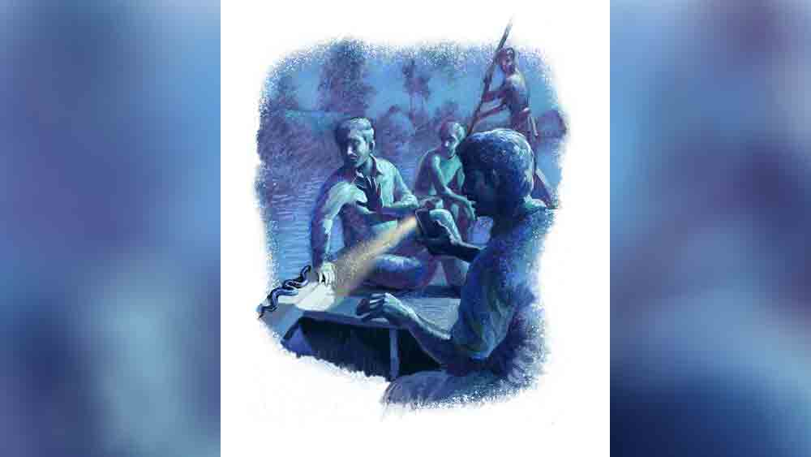

 
 <h1 align=center>ভিজ়িট</h1>
<h2 align=center>Unknown</h2> সকালে এই রাস্তায় গোড়ালিডোবা জল ছিল। ভিজ়িটে যাওয়ার সময় দেখি বেশ বেড়ে গেছে। বড়বাবু বার বার বলেছিল, “রাত যত বাড়ে, ততই জল বাড়ে। এ বড় নিচু এলাকা। নদীর তলভূমি উঁচুতে। সামান্য বৃষ্টিতেই এখানে জল ঢোকে। ফি বছরের কিসসা। আপনি নতুন এসেছেন, প্রথম প্রথম একটু অসুবিধে হবে। তার পর দেখবেন ঠিক মানিয়ে নিয়েছেন।”

আমার সরকারি চাকরি। জমি দফতরের ইনস্পেক্টর। বদলিই নিয়ম। মালভূমে খরা দেখেছি। দেখেছি কী ভাবে মাঠের পর মাঠ শস্য পুড়ে যাচ্ছে। জলের অভাবে। গ্রামের পর গ্রাম জলহীন। কত মাইল হেঁটে একটা হয়তো কুয়ো। সেখানে দীর্ঘ লাইন। অপেক্ষার শেষে হয়তো বা একটু জল পাওয়া গেল, তাতে অর্ধেক বালি। কাপড় দিয়ে ছেঁকে সেটাই মানুষ পান করছে। মাসের পর মাস মানুষ স্নান করে না। চালের অভাবে ঘাসের বীজ ফুটিয়ে খায়। রুখাশুখা মানুষগুলোর জন্য কিছুই করা যায় না। প্রকৃতির কাছে মানুষ বড় অসহায়।

আর এখানে জলই শত্রু মানুষের। দুপুর থেকেই ড্রাইভার ছেলেটিও তাড়া দিচ্ছিল খুব, “স্যর, বেশি দেরি করলে আপনাকে ফেরানো যাবে না। দুপুরেই নদী ছাপিয়ে গেছে শুনেছি।”

বস্তুত অফিসের সবাই তা-ই বলছে। কিন্তু ফাইলটা না পড়ে সই করি কী করে। কাল সকালের ডাকে যাবে। লেখা আছে ‘ভেরি আর্জেন্ট’। অথচ এসেছে আজই। সরকারি ব্যাপার। অনেক সময় যে তারিখে উত্তর দিতে বলা হয়েছে, হয়তো চিঠি এল তারও পরে। আর ঠিক তার পিছু-পিছু একটা শোকজ়। সময়ে কেন উত্তর দেওয়া হয়নি!

বেরোতে বেরোতে প্রায় সন্ধে। বাঁক নিয়ে গাড়ি বড় রাস্তায় উঠল। থমথমে আকাশ। ক’দিন যা বৃষ্টি হয়েছে!  গাড়ির আলো যতদূর পড়েছে জল থইথই। জলে ডোবা দু’দিকের গ্রামগুলিও নিঝুম। হারু জানাল, জল বাড়লেই ওদের আগেভাগে উঁচু জায়গায় সরিয়ে নিয়ে যাওয়া হয়। তাতে ক্ষয়ক্ষতি কম হয়। অনেক সময় দেওয়াল ভেঙে পড়ে। বা জলে ডুবে থাকা খুঁটিতে কারেন্টে শক খায়। তবে সবচেয়ে বেশি মরে সাপের কামড়ে। উঁচু ডাঙার খোঁজে তেনারা বাড়ির চালে আশ্রয় নেন। সব বিষধর সাপ।

হারু আমার ছায়াসঙ্গী। আমার পিয়ন। পুরো নাম হারাধন খাটুই। অফিসে সবাই হারু বলে ডাকে। শুরুর দিকে এক বার তাকে হারাধনবাবু বলেছিলাম। শুনে কী তার অভিমান! মুখ কালো করে বলেছিল, “আপনি স্যর আমাকে নিজের লোক ভাবছেন না।” আর ভুল করিনি।

একটা গঞ্জ পেরিয়ে গেল। কয়েকটা টালির চালার দোকান। সব বন্ধ। জলে আধোডোবা।

হারু বলল, “এই গ্রামটার নাম স্যর নীলডাঙা। এর পরের গ্রাম চুপিচুপি। তার পর সোহাগীর চর। সেইখানে আমাদের কাজ।”

“নীলডাঙা, চুপিচুপি, সোহাগীর চর! নামগুলো খুব সুন্দর তো।”

“হ্যাঁ স্যর, খালি নামগুলোই যা সুন্দর। সারা বছর বেঁচে থাকাটা যে কী কষ্টের! নদী ছাড়া আমাদের চলে না। আবার আমাদের ছাড়া নদীরও চলে না। প্রত্যেক বছর তার এক বার ভিজ়িটে আসা চাই। সে আসে বলে মাটি উর্বর হয়, ভাল ফসল হয়। কিন্তু সে-ই আবার সময়ে অসময়ে এসে সব ভাসিয়ে নিয়ে যায়। তখন দুর্দশার শেষ থাকে না।”

“কিন্তু এ রকম অদ্ভুত নাম কেন?”

“তা স্যর বলতে পারব না। ডাঙা দ্বীপ চর দিয়েই তো এখানে সব গাঁয়ের নাম। তবে চুপিচুপি কেন
নাম তা জানা নেই। হয়তো করালগাঙ নদী চুপি চুপি এসে সব ভাসিয়ে নিয়ে যায় বলে।”

যুক্তি শুনে হাসি পেলেও মনে মনে কষ্ট হল।

ড্রাইভার ছেলেটি চুপ করে আছে অনেক ক্ষণ। সামনে রাস্তায় কত জল হবে, হয়তো সেই চিন্তাই মাথায় ঘুরপাক খাচ্ছে।

যে মহিলার বাড়িতে ভিজ়িটে যাওয়ার কথা, তাঁর বাড়িতে জল উঠেছে। খুবই অসুস্থ, তাই স্কুলবাড়িতে নিয়ে যাওয়া যায়নি। তা হলে আমরা কী করে যাব?

হারু বলল, “চিন্তা করবেন না স্যর। সব ব্যবস্থা আছে।”

একটা জায়গার পর থামতে হল। ড্রাইভার বলল, “স্যর, আর গাড়ি যাবে না। এখান থেকে বাঁয়ে কিছুটা গেলে  সোহাগীর চর।” 

হেডলাইটের আলোয় দেখলাম সামনের চাকা প্রায় ডুবে গেছে। গাড়ি দেখে দু’জন লুঙ্গি পরা লোক খালি গায়ে ছপছপ করতে করতে দৌড়ে এল। হাতে টর্চ। লুঙ্গিটা গুটিয়ে হাঁটুর ওপরে তোলা।

“নমস্কার স্যর!... আর একটুকু পিছনে। ঠেকা ঠেকা... ঠিক আছে
ঠিক আছে।”

একটা ডিঙি নৌকো গাড়ির পাশে এসে ঠেকল। বুঝলাম, এ বার ওটায় উঠতে হবে। জলের ঢেউ গাড়ির ভেতরে এসে ধাক্কা মারছে। দরজা খুলে পাটাতনে পা দিলাম। ডিঙিটা একটু দুলে উঠল। এক জন আমার হাত ধরতে এগিয়ে এল। আমি নিজেই ব্যালান্স করে পাটাতনে গিয়ে বসলাম। পিছন পিছন হারুও এসে বসল।

“কই লগেন, ব্যাগটা দাও।” এক জন তার ব্যাগটা এগিয়ে দিল। 

“নাও ছাড়ো মাঝিসাহেব।”

ডিঙির লোকটা একটা বাঁশের লগি দিয়ে ঠেলতে শুরু করল। লুঙ্গি পরা লোকগুলো ডিঙিটাকে একটু হাত দিয়ে ঠেলে লাফিয়ে পাটাতনে উঠে বসল। ফের দুলে উঠল ডিঙি।

একটা গ্রাম। পুরো ডুবে আছে। জলে আর অন্ধকারে। একটা পাকাবাড়িও চোখে পড়ছে না। খাঁ-খাঁ করছে চার দিক। মনে হয় বুক সমান জল। গাছগুলি ডুবে আছে। ওদের ডালপালাগুলি ঝুঁকে ঝুঁকে আমাদের দেখছে। বিকট শব্দে ব্যাঙ ডাকছে। আর কানে তালা ফেলে দেওয়া ঝিঁঝি। যেন পৃথিবীতে কী একটা মোচ্ছব চলেছে। একটা জলপিপি না কী যেন একটু থেমে থেমে ডেকে চলেছে কোক... কোক...। অন্ধকারে একটা পাখি ঝুপ করে জলে পড়ছে আর উঠে গিয়ে বসছে ডালে।

“ও কিছু না স্যর। মাছরাঙা। পুকুরের মাছ সব উঠে এসেছে কিনা!”

“কী মাছ এগুলো?”

“বেশির ভাগই স্যর বাচ্চা তেলাপিয়া। ফি বছর জলে ভাসে তো, দামি মাছ হয় না।”

“জল নামলে এরা আবার পুকুরে ফিরে যাবে?”

“না স্যর। পাঁচ রকম জলে মিশলে ওরা মরে যায়। এই চলছে ফি বছর। জানে ডুবে যাবে, তবু গাঁয়ের লোক পুকুরে চারা ছাড়ে। আশাতেই মানুষ বাঁচে স্যর। কত ঘর পচে যাবে। কত শস্য নষ্ট হবে। তবু মানুষ আবার চাল বাঁধবে, আবার বীজ বুনবে, যদি ও বছর একটু জল কম হয়। যদি একটু সুখের দেখা মেলে।”

সরসর করে ডিঙি ভেসে চলেছে। শুধু লগি ঠেলার শব্দ। মোবাইলের আলো ঝিকিমিকি জলে আন্দোলিত হচ্ছে। জলজ পোকাগুলি মানুষের উপস্থিতির শব্দ পেয়ে পড়িমরি করে রাস্তা ছেড়ে পালাচ্ছে। ঝপাঝপ ঝাঁপিয়ে পড়ছে দু’পাশে। এ চাকরি না করলে পৃথিবীর এই আশ্চর্য দৃশ্যগুলি দেখা হত না। দেখা হত না মানুষ ও প্রকৃতির এ অসম লড়াই। পৃথিবী নামক গ্রহটিকে কব্জা করার জন্য দু’পক্ষেরই কী মরিয়া প্রয়াস!

এখানে ওখানে ছোট ছোট ঘূর্ণি। এই সামান্য জলে ঘূর্ণি! নীচে কি ইঁদুরের গর্ত? বলতে না বলতেই হাতের ওপর একটা ঠান্ডা অনুভূতি! যেন কেউ বরফ ছ্যাঁকা দিচ্ছে। এই গর্তগুলি কি তবে... এক অন্য আশঙ্কায় আমার শিরদাঁড়া বেয়ে হিমস্রোত নেমে গেল। আমি কাঠ হয়ে বসে রইলাম। ফিসফিস করে বললাম, “হারু! সাপ!” মোবাইলটা ঈষৎ ঘুরিয়ে হারু দেখল জন্তুটিকে। আমার ডান হাত ঘেঁষে পাটাতনে শুয়ে আছে। কুচকুচে কালো! তার ইঙ্গিতে ডিঙি থেমে গেছে। এ যেন অনন্ত বসে থাকা। ঘামে আমার পিঠ জামা সব ভিজে যাচ্ছে। কপাল বেয়ে দরদর করে ঘাম নামছে নাকে। তবু নড়ছি না। ঠোঁট শুকিয়ে আসছে। ঢোঁক গিলতেও ভয়।

হঠাৎই ডিঙি দুলে ওঠে। স্রোতের ধাক্কায় না আমাদের নড়াচড়ায়, বোঝা যায় না। ঘুমন্ত জন্তুটি সচকিত হয়ে সরসর করে জলে নেমে গেল। হারু আলো ঘুরিয়ে ওর যাত্রাপথের দিকে ফেলল। তার পর বলল, “খুব বাঁচা বেঁচে গেলেন স্যর। তবে সন্ধের পর ওদের নাম করবেন না। বলবেন লতা। নাম করলেই বিপদ।”

আমি অবাক হয়ে বিড়বিড় করে বললাম, “লতা... লতা...”

আবার সব চুপচাপ। আরও কত দূর যেতে হবে কে জানে। আরও কত বিপদ অপেক্ষা করে আছে তাও জানি না। কী কুক্ষণেই যে এখানে আসতে রাজি হয়েছিলাম! না এসেও উপায় ছিল না। বড়সাহেব খুব কড়া মানুষ। বলেন, এই দফতরে কাজ করলে এত ভয় পেলে চলবে না। যত গন্ডগোল তো জমিকে ঘিরেই। সরকারি রেভিনিউ শুধু নয়,
সামাজিক দায়বদ্ধতার কথাটাও ভাবতে হবে। এখন ভালয় ভালয় কাজ মিটলে বাঁচি।

হারু বলে উঠল, “মায়ের অবস্থা কেমন লগেন?”

“ভালা না হারুদা।”

“কথা-টথা বলছে তো?”

“তা কয়টে।”

“নাম বলতে পারবে?”

“খুব ধীরে। কান পাতিকি শুনতে হয়।”

“নাম না বলতে পারলে কিন্তু কাজ হবে না।”

“জানি, সউজন্যই ত অত তাড়া। চল দেখব চল কউটুকু ঘর। মা সই না দিলে ভাইভন সব ভাগ লি লিবে। অত দুর্যোগের মধ্যে না হিলে সাহেবকে আনি? অত কষ্ট করিকি সাহেব আসচে এ আমার সাত গুষ্টির ভাগ্য। কী বিপদটা না গেলা! আজ রাইতটা বড় অন্ধকার, কুনোরকমে কাটলে হয়!” বলে সে কপালে হাত ঠেকায়।

লগেনবাবুর বাড়ি পৌঁছে দেখি, টালির ছাওয়া দেওয়া একটি দু’কুঠুরির ঘর। একটি গ্রিলের জানলার বাইরে আমাদের ডিঙিটি এসে থেমেছে। ভেতরে ইট দিয়ে উঁচু করে রাখা একটি খাট। মশারি টাঙানো। সামনের দুটো খুঁট খোলা। খাটে ময়লা বিছানা। বিছানা বলতে কয়েকটা কাঁথা, রংচটা চাদর। তেলচিটে বালিশ ঠিক জানালার পাশে। খাটের এক পাশে পুরনো কোল্ড ড্রিংক্সের বোতলে জল, স্টিলের গ্লাস, ওষুধের শিশি। একটা প্লাস্টিকের পাখা। একটা হ্যারিকেন, তার কাচ ঘন কালো। টিমটিমে আলো ঘরময় ছড়িয়ে বাইরে এসে পড়েছে। মেঝেয় জল থইথই করছে। সেখানে ছায়া পড়ে ভৌতিক পরিবেশ সৃষ্টি করেছে। জল আন্দোলিত হচ্ছে। আর সেই ছায়া কেঁপে কেঁপে উঠছে সারা ঘরে। দেওয়ালে টাঙানো একটা ক্যালেন্ডার, হাওয়ায় অল্প  দুলছে। তাতে মা কালীর ছবি। এই আলো-আঁধারিতে তাঁর ভয়াল চোখ দুটো যেন ঠিকরে পড়ছে। কী সেই দৃষ্টি! এক বার দেখলেই অন্তরাত্মা কেঁপে ওঠে।

বিছানায় ছেঁড়া কাঁথা জড়িয়ে এক বৃদ্ধা শুয়ে। তার পাশে মাঝবয়সি এক মহিলা। জল পরিবৃত এই খণ্ডহরে তার মুখ আশ্চর্য শুকনো। আমাদের দেখেই মাথায় ঘোমটা টেনে সরে বসল। জানালার বাইরে থেকে এই ছবিটি দেখছি আর মনে হচ্ছে, এ কোনও মরমি শিল্পীর আঁকা একটা পেন্টিং। সমস্তই স্থবির, সমস্তই নিখুঁত বিন্দুতে বসানো।

ডিঙিটি জানলায় ঠেকতেই লগেন নামের সেই লোকটি নেমে জল ঠেলতে ঠেলতে অন্ধকারে মিশে গেল। দ্বিতীয় লোকটিও পিছনে পিছনে গেল। কিছু পরে টর্চ হাতে তাদের দেখা গেল ঘরের ভেতরে। 

“সরি বুস দেখি। এ পাশটা টুকু উঁচু কর বালিশ দিকি। ওই পরিমল, চাগি ধর।”

দ্বিতীয় লোকটি বুড়িটিকে দু’হাত ধরে উঠিয়ে বসাল। শরীর যেন ভাঙতেই চায় না। ঘোমটা দেওয়া বৌটি এক পাশে সরে গিয়ে দেওয়ালের দিকে বালিশ-বিছানা দিয়ে উঁচু মতো করল। পরিমল টেনে ঠেস দিয়ে বসিয়ে দিল তাকে। কিন্তু বুড়িটি যেন চলচ্ছক্তিহীন, বার বার ঢলে পড়তে চায়। বৌটি পিছন থেকে জড়িয়ে দু’হাতে ধরে রাখল তাকে। বুড়িটি পা ছড়িয়ে যেন তার গায়ে হেলান দিয়ে বসে রইল। তার ঘাড় নিচু। একেবারে জবুথবু অবস্থা। এক মাথা সাদা চুল ছোট করে কাটা। তোবড়ানো গাল। চোখ দুটো অবশ্য অত স্পষ্ট দেখা যাচ্ছে না। নাইটির মতো কিছু একটা পরানো গায়ে। উপরে কাঁথা। ফাঁকে ফাঁকে একটুআধটু পায়ের অংশ কাঁথা গুটিয়ে বেরিয়ে পড়ছে। আর বৌটি টেনেটুনে ঢেকে দিচ্ছে সে সব।
হাত দু’টি অবশ্য দু’দিকে ছড়ানো ডানার মতো।

হারু চেঁচিয়ে উঠল, “মাসিমা, আপনার নাম কী?”

কোনও শব্দ নেই। লগেন বুড়িকে ধাক্কা দিয়ে জাগানোর চেষ্টা করল, “ও মা নাম কও। অফিসের লোক আসচে, নামটা কও।”

পরিমল নামের লোকটিও বলে, “পিসি, এক বার নাম কও তো। কী নাম তুমার?”

ঘোমটা দেওয়া বৌটি কিছু বলে না। সে বুড়ির নুয়ে পড়া ঘাড়খানি বার বার সোজা করে ধরার চেষ্টা করে।

এত শব্দে বুড়ি কি একটু নড়েচড়ে ওঠে? মুখে কোনও শব্দ নেই। সে যেমনকে তেমনই বসে রইল।

“সার বয়স হিচে ত। তার উপর ঘরের ওউ অবস্থা। খুব জব্দ হি যাইচে। হারুদা তুমি নাম ধরি ডাক ত, ঠিক
মাথা লাড়বে।”

হারু আমার দিকে তাকাল। আমি ইশারা করতেই কাগজ দেখে হারু বলল, “মাসিমা, আপনার নাম মৃণালিনী ভীম?”

ন্যুব্জ ঘাড় যেন ঈষৎ দুলে সম্মতি জানাল। হারু আমার দিকে তাকাল। আমি মাথা নাড়লাম। অর্থাৎ নাম ঠিক আছে, এ বার সইসাবুদের কাজকর্ম করা যেতে পারে।

“মা ত সই দিতি পারবেনি হারুদা। অই পরিমল তুই বকলম কর। মা
টিপ দিবে।”

হারু জানলার ফাঁক দিয়ে কাগজ উল্টে দেখিয়ে দিচ্ছে, কোথায় কোথায় সই হবে। পরিমল লোকটি চটপটে। দ্রুত সই করে যাচ্ছে। লগেন টর্চ বাগিয়ে আছে কাগজের ওপর।

এক সময় সই শেষ হল। এ বার টিপ নেওয়ার পালা।

হারু কালির ডাব্বাটা নিয়ে বাঁ দিক ঘেঁষে বসল, “মাসিমা হাতটা বাড়ান দেখি। একটা টিপ নেব।”

মাসিমা চুপ।

“বৌদি মাসির হাতটা চাগিয়ে ধরো দেখি। হ্যাঁ আর একটু এগিয়ে আনো। বাঁ হাতের বুড়ো আঙুলটা। এই তো। হ্যাঁ নাগাল পেয়েছি।”

হারু বুড়ির আঙুল চেপে ধরে। আর তার পরই ফ্যালফ্যাল করে আমার দিকে তাকায়।

“কী হল হারু?”

হারু চুপ।

আমি একটু ঝুঁকে গ্রিলের ভিতর দিয়ে হাত বাড়িয়ে বুড়ির হাত ছুঁই। সাপের চেয়েও ঠান্ডা তার গা!

এত আয়োজন, এত ব্যস্ততা... সই করার আগেই ভিজ়িটের মেয়াদ শেষ! ঠান্ডা জোলো হাওয়ায় মাথা ঝিমঝিম করে উঠল আমার।