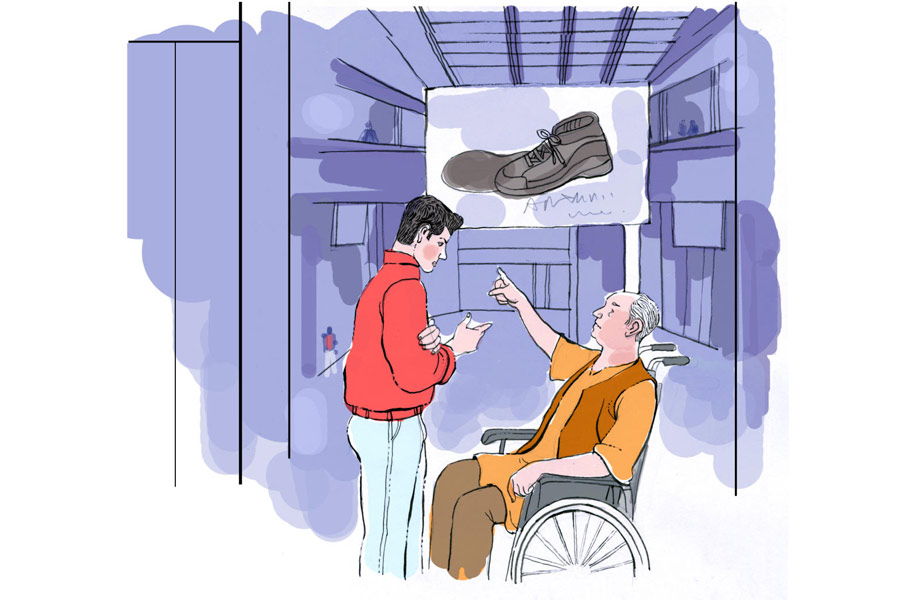

 
 <h1 align=center>ভুবনজিতের জুতো</h1>
<h2 align=center>অন্বেষা রায়</h2> 

ভুবনজিতের একটাই স্বপ্ন, পৃথিবী ঘোরা। কিন্তু বেকার মানুষের পক্ষে কত দূরই বা যাওয়া সম্ভব? তাই সে কাঁধে ঝোলা, পায়ে চটি গলিয়ে হেঁটে চলে যায় ছায়ানদী গ্রামে। সেই গ্রামে নদীর দু’পাড়ে হাজার হাজার গাছ। নদীতে পা ডুবিয়ে ভুবনজিৎ ভাবে, একটা ভাল জুতো কিনে গোটা পৃথিবী চষে বেড়াবে। বেড়াতে ভালবাসে যে মানুষ, পা-জোড়াই তার ডানা। ডানার যত্ন না নিলে, উড়বে কেমন করে?

সে ঠিক করল, সব থেকে দামি জুতোটিই কিনবে।

প্রতিদিন সকাল-সকাল সে হাজির হয় শহরের কেতাদুরস্ত শপিং মলে। জুতো পছন্দ করে, নোটবুকে সেই জুতোর বিবরণ আর দাম লেখে। টাকা জমলেই কিনে নেবে, এমনই তার ইচ্ছে।

আজ মলে ঢুকতেই চমকে গেল ভুবনজিৎ। বিরাট স্ক্রিনে দারুণ এক জোড়া জুতোর ছবি দেখানো হচ্ছে। চার দিকে থিকথিকে ভিড়। ঘোষণা চলছে, ছবিতে দেখানো জুতো যার পায়ে ঠিকঠাক বসবে, সে-ই হবে জুতোর মালিক।

স্ক্রিনের নীচে একটা পর্দা-ঢাকা ঘরের সামনে লম্বা লাইন। ভুবনজিৎ বুঝল, ওখানেই রাখা আছে জুতোটা। সে সবে ভাবছে লাইনে দাঁড়াবে, এমন সময়, হুইলচেয়ারে বসা সম্ভ্রান্ত চেহারার এক বৃদ্ধ ভুবনজিৎকে হাতছানি দিয়ে ডেকে বললেন, “এই জুতোটা তোমার পায়েই হবে। ডান পায়ে লম্বা কড়ে আঙুল তোমার ছাড়া আর কারও নেই। অনেক দিন ধরে দেখছি তোমাকে।”

ভুবনজিৎ একেবারে হতবাক হয়ে গেল। বৃদ্ধ বললেন, “আমার কোম্পানিই এই অত্যাধুনিক জুতোর আবিষ্কারক। গোটা পৃথিবীর ম্যাপিং করা আছে এতে। আবহাওয়া, ভৌগোলিক গঠন, ইতিহাস ইত্যাদি তথ্য সমেত। নোট নেওয়া, ফোটো তোলা, ভিডিয়ো করা, এমনকি ফোনও করা যাবে এই জুতো থেকে। তোমার বিশ্রাম, খাওয়া, ঘোরার সময় অ্যালার্ম বাজিয়ে মনে করিয়ে দেবে এই জুতো।

“ট্রেনে পা কাটা যাওয়ার আগে এই জুতো পরে সারা পৃথিবী ঘুরে বেড়িয়েছি। আর এখন…” দীর্ঘশ্বাস ফেললেন বৃদ্ধ।

ভুবনজিৎ দেখল, বৃদ্ধের কথাই ঠিক। স্ক্রিন বসানো, চকচকে জুতোটা ঠিক ভুবনজিতেরই পায়ের নম্বরের। ভুবনজিৎ খুব আড়ষ্ট গলায় বলল, “এটার দাম কত?”

মৃদু হেসে বৃদ্ধ বললেন, “সময়। কোম্পানির টাকায়, তাদের নির্দেশে দেশ-বিদেশ ঘুরবে, এটাই হবে তোমার কাজ। রাজি থাকলে, বিনামূল্যে জুতো নিয়ে যাও।”

*****

জুতোটা সত্যিই ভুবনজিতের পা-দুটোকে ডানায় বদলে দিল। জীবনটা ঘুরে গেল একশো আশি ডিগ্রি। আজ জ়ুরিখ, তো কাল স্তাদ। এই বোরা বোরা, তো পরের দিনই কোস্টারিকা। ঘন ঘন তাপমাত্রা, টাইম জ়োন পরিবর্তন ভুবনজিতের শরীরে প্রভাব ফেলতে লাগল।

জুতোর সিস্টেম আপডেট করলেন বৃদ্ধ। এখন ভুবনজিতের খাওয়া, ওষুধ, ঘুম সব কিছু রুটিন-বাঁধা। সময়ে সময়ে তীব্রস্বরে অ্যালার্ম বাজিয়ে জুতো ভুবনজিৎকে মনে করিয়ে দেয় কখন খাবে, কখন ঘুমোবে। এ দিক-ও দিক হওয়ার জো নেই। এই কারণে আজকাল জুতোটা পা থেকে খোলা যায় না। অবশ্য শেষ আপডেটের পর সেটা কোনও সমস্যা নয়। বিশ্রামের সময় জুতোটা মোজার মতো হালকা ও আরামদায়ক হয়ে যায়। ঘরে থাকার সময় তুলোরমতো হালকা।

এক দিন ভুবনজিৎ বৃদ্ধকে বলল, “স্যর, এই জুতোর সবই ভাল, কিন্তু এটা পরে ছায়ানদী গ্রামে যেতে গেলেই অ্যালার্ম বাজে। কত বার চেষ্টা করলাম। গাছে ঘেরা ওই নদীতে অনেক দিন পা ডোবাই না।”

বৃদ্ধ বললেন, “জায়গাটা জুতোর মানচিত্রে নেই। পরে আপডেট করা যাবে। এখন তুমি সমুদ্র ঘুরে এসো।”

সমুদ্র, পাহাড়, নদী, শহর মিলিয়ে এক মাসে সত্তরটিরও বেশি জায়গা ঘুরে ফেলল ভুবনজিৎ।

প্রথম প্রথম দারুণ লাগলেও ধীরে ধীরে ক্লান্তি বোধ করতে লাগল সে। সব সময় ঘুম-ঘুম ভাব। অথচ জুতোর অনুমতি ছাড়া এক মিনিটও বেশি বিছানায় থাকার উপায় নেই। কর্কশ স্বরে অ্যালার্ম বেজে উঠবে।

তার মনে হল, কয়েক দিন জুতোটা খুলে রাখলে ভাল হয়।

কথাটা বৃদ্ধকে বলতে, তিনি বললেন, “জুতোটা এখনও পরীক্ষাধীন। ওটা কী ভাবে পা থেকে খোলা যায়, সেটা আবিষ্কৃত হয়নি। তবে তুমি চাইলে ওর সঙ্গে ছায়ানদীর গল্প করতে পারো।”

*****

বছর খানেকের মাথায় জুতোটা কথা বলতে শিখে গেল।

বৃদ্ধ ভুবনজিৎকে বললেন, “তুমি ভাগ্যবান। জানো, কত মানুষ জুতোটা কিনতে চান? আমিও কি পরতে পারছি নিজের আবিষ্কার? ট্রেনের একটা ধাক্কায় দুটো পা…”

বৃদ্ধের গলা কাঁপে। সামলে নিয়ে বলেন, “সিস্টেম আপডেটের পর, জুতো তোমাকে পায়ে জলের স্পর্শ দিতে পারবে। ছায়ানদীর একটা ডেসক্রিপশন সেট করে নিলে ওই গ্রামে যাওয়ার দরকারই পড়বে না।”

কথাটা শুনে ভুবনজিৎ শিউরে উঠল। ছায়ানদীকে পায়ে এনে ফেলবে এই জুতো? তাকে নিয়ে যাবে না ছায়ানদীর কাছে?

সারা রাত গুম হয়ে বসে রইল ভুবনজিত। জুতোর দিকে তাকিয়ে বলল, “কোটিপতি বৃদ্ধ গাড়ি, বিমান ছেড়ে রেলপথে কোথায় যাচ্ছিলেন, তুমি জানো? তাঁরও কি কোনও ছায়ানদী আছে?”

জুতো জবাব দিল না। স্ক্রিনে গোল গোল ঘুরতে লাগল প্রশ্নটা। ভুবনজিৎ আপন মনে হাসল। কাছেই রেলপথ। ওই তো ট্রেন আসছে।

মাসখানেক পর

ফের সেই শপিং মলের উজ্জ্বল স্ক্রিনে ভেসে উঠল জুতোর ছবি। চার দিকে থিকথিকে ভিড়। তীক্ষ্ণ চোখে নতুন সেই জুতোর জন্য একজোড়া পা খুঁজতে লাগলেন বৃদ্ধ।

তিনি জানেন, এত ক্ষণে ক্রাচে ভর দিয়ে ছায়ানদীতে পৌঁছে গেছে ভুবনজিৎ। বেচারার হুইলচেয়ার কেনার ক্ষমতা নেই।

