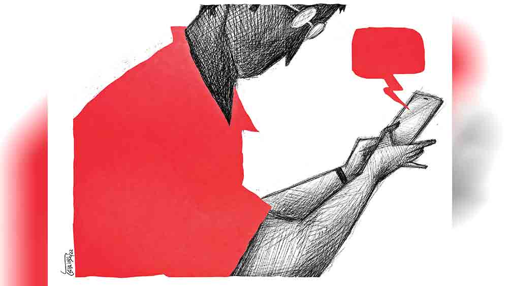

 
 <h1 align=center>ভুল</h1>
<h2 align=center>সন্দীপ চক্রবর্তী</h2> রবিবার সকাল ছ’টার সময় বুক কাঁপিয়ে ডোরবেলটা বেজে উঠতেই, চরম বিরক্তি নিয়ে মৈনাক ও গার্গী দু’জনেই তড়াক করে বিছানায় উঠে বসল। প্রতিমা মাসিকে তো বলাই আছে আজকের দিনটা মানে, সপ্তাহের এই মধুমাখা রবিবারটা দেরি করে আসার জন্য। অন্য দিনগুলোয় তো ছ’টা বাজতেই যুদ্ধের প্রস্তুতি শুরু হয়ে যায় বাড়িতে। প্রায় একশো পরিবারের এই হাউজ়িং কমপ্লেক্সে, ওদের কয়েক জনের অনেক চেষ্টা চরিত্রে, কমিউনিটি হল ছাড়াও, কমপ্লেক্সের অন্য প্রান্তে একটা সুন্দর ক্লাবঘর গড়ে উঠেছে। সেই ক্লাবঘরে বার চালাবার স্পেশ্যাল পারমিশনও জোগাড় করা হয়েছে। প্রথম প্রথম যাঁরা খুব আপত্তি জানিয়েছিলেন, তাঁদেরও এখন প্রায় সব শনিবারই সন্ধেয় ক্লাবঘরে আড্ডা মারতে দেখা যায়। ক্লাবঘরের  মাঝখানে অনেকটা খোলামেলা জায়গা। কেউ কেউ মন চাইলে, গানের সঙ্গে একটু নেচেও নেয়, সারা সপ্তাহের যুদ্ধক্লান্ত ব্যাটারি রিচার্জ করার জন্য।

গতকাল শনিবার সন্ধ্যাতেও আড্ডা জমে উঠেছিল। এই ক্লাবঘরের কেয়ারটেকার দেবু তখন একের পর এক, বুকের মধ্যে তোলপাড় করা সোনালি দিনের সব গান চালাতে শুরু করে দিয়েছে। দ্রব্যগুণে কেউ তখন কিশোরকুমার, কেউ বা হেমন্ত, রফি। শেষের দিকে অবশ্য লতাকণ্ঠী, আশাকণ্ঠীরও প্রবেশ ঘটে। সব মিলিয়ে পরিবারগুলির সপ্তাহান্তে এক সুন্দর গেট-টুগেদার। তার পর যে যার দেশলাই খোপে গিয়ে আবার  ঢোকো। গল্প শেষ হতে হতে ঘড়ির কাঁটায় তারিখ বদলে যায়। কালকেও তা-ই হয়েছে। আজ রবিবার হ্যাংওভারের সকালে ছ’টার সময় ডোরবেল ঘন ঘন বেজে উঠলে মস্তিষ্ক পুরো বেসামাল হয়ে যায়। এলোমেলো মস্তিষ্কে আই-হোলে চোখ রাখতেই মৈনাকের মনে জন্ম নিল একগাদা প্রশ্ন।

এরা? এই সময়ে? কেন?

রিফ্লেক্সে দরজা খুলে দিতেই তোপদার বর-বৌ দু’জনেই চোখ কটমট করে ঢুকে পড়ল ড্রয়িং রুমের ভিতরে আর জাঁকিয়ে বসল সোফায়। মৈনাক তখন “বসুন, বসুন...” বলে বাথরুমে ছুটেছে চোখেমুখে জল দিতে। প্রথম ধাক্কা সামলে উঠে ও বাথরুমে দাঁড়িয়ে দাঁড়িয়ে কিছু ক্ষণ ভাবল, সকাল সকাল এই খিটকেল দম্পতি ওর ফ্ল্যাটে কেন? হাউজ়িং কমপ্লেক্সের মোটামুটি সবাই এই দুই বিরল রত্নকে এড়িয়ে চলে। ফ্ল্যাট কমিটির যে কোনও  মিটিং-এ নানা রকম বিদঘুটে প্রশ্ন তুলে সব কিছু ঘেঁটে দেওয়ার জন্য এই জুটির নাম আছে। হতভম্ব এগজ়িকিউটিভ অফিসার মৈনাক সোফায় বসতেই, মিস্টার তোপদার ওর গিন্নির মোবাইল মৈনাকের দিকে এগিয়ে দিয়ে বলল, “এই ধরনের হোয়াটসঅ্যাপ মেসেজের পরে আপনাকে সাইবার ক্রাইমে পুলিশের হাতে তুলে দেওয়া উচিত কি না, আপনিই বলুন!”

হতভম্ব মৈনাক মেসেজটা যখন  পড়ছে, তখন টের পেল ভেতরের ঘর থেকে বেরিয়ে এসে গার্গী নিঃশব্দে ওর পাশে দাঁড়িয়েছে। স্তম্ভিত মৈনাক, বন্যায় ভেসে যাওয়া মানুষের খড়কুটো ধরে বাঁচার মতো করে বলে উঠল, “অসম্ভব। এ হতেই পারে না। আমি করিনি এ সব।”

মিসেস তোপদারের মোবাইলে জ্বলজ্বল করছে মৈনাকের মোবাইল নম্বর, যেখান থেকে এই দুষ্টু ভাষার ইশারা মাখা হোয়াটসঅ্যাপ মেসেজটা পাঠানো হয়েছে। অস্বীকার করা যাচ্ছে না। অসহায় মৈনাক পনেরো বছরের চেনা বৌ-এর দিকে তাকিয়ে দেখল, মুখ জুড়ে মেঘ নেমে এসেছে। যখন তখন সাইক্লোন-সহ বৃষ্টি নামবে না কি? তোপদারবাবুর দুটো হাত ধরে ভেঙে পড়া মৈনাক, লজ্জা অপমানে কুঁকড়ে যাওয়া মৈনাক বলল, “বিশ্বাস করুন প্লিজ়, এ কাজ আমি করিনি।”

গোলগাল তোপদার গিন্নির চোখদুটো যেন মৈনাককে ভস্ম করে দিতে চাইছে। গার্গী অপ্রস্তুত, নির্বাক। তোপদারবাবু মুখ খুললেন, “দেখুন, কাল যখন মেসেজটা আমার চোখের সামনে এল, রাত তখন দেড়টা। মেসেজটা পাঠানো হয়েছে রাত এগারোটার দিকে। আর সবচেয়ে লজ্জার ব্যাপার হচ্ছে, ছেলে আবির প্রথমে মেসেজটা দেখেছে। ও তো আমাদের দু’জনের মোবাইল নাড়াঘাঁটা করে। বুঝতেই পারছেন, এ যুগের ক্লাস নাইনের ছাত্র। সে-ই প্রথম মা-কে জিজ্ঞেস করে যে এ সব উল্টোপাল্টা মেসেজ কে পাঠাচ্ছে। আমরা তো রাতেই আপনার বাড়ি হানা দিতাম। নেহাত আপনার মোবাইল নম্বর দেখে থেমে গেলাম, আপনার মোবাইল নম্বর বলেই সোজা থানায় যাইনি। কারণ যত দূর আপনাকে দেখেছি এই দশ বছরে, আপনি মশাই এই কাজ করতে পারেন, মন মানতে চাইছিল না। কিন্তু উত্তরোত্তর চাপ বেড়ে চলল সংসারে। এর একটা শেষ দেখতেই হবে, এমন একটা সিদ্ধান্ত হল।”

হতভম্ব মৈনাক নিজের মোবাইল খুলে চেক করল, ওর মোবাইল থেকে ও রকম কোনও মেসেজ তো যায়নি। তোপদারবাবুকে সেটা দেখাতেই উনি মাথা নেড়ে বললেন, “দেখুন, কেউ যদি এ রকম একটা গোলমেলে কাজ করে, সে কি তার নিজের মোবাইলে প্রমাণ রেখে দেবে! আগেই তো ডিলিট করে দেবে।”

অকাট্য যুক্তি। মৈনাক কোনও রকমে বলল, “প্লিজ় আমাকে দু’-চার দিন টাইম দিন। আমি এর একটা বিহিত করবই।”

রবিবারটা একদম তেতো করে দিয়ে চলে গেল তোপদার জুটি। কত সাধ ছিল, আজ ‘চিকেন কালি মির্চ’ হবে। সব পরিকল্পনা ছারখার হয়ে গেল। যাদের সঙ্গে আড্ডা মেরেছিল, সেই গ্রুপের ছ’জনকেই ফ্ল্যাটে ডাকল। চা খেতে খেতে, সব শুনে তো ওরা হতবাক। সৈকত হঠাৎ বলে উঠল, “মৈনাকদা, আমি যখন গানের সঙ্গে হাত-পা ছুড়ে আমার বিখ্যাত নাচটা নাচছিলাম, তখন দেখেছিলাম, তুমি মোবাইলটা টেবিলের উপর রেখে টয়লেটের দিকে যাচ্ছ। আমি আর পাত্তা দিইনি। নিজের খেয়ালেই ব্যস্ত ছিলাম।”

মৈনাকের মনে পড়ে গেল সেই ঘটনা। কাল ক্লাব ঘরে ওদের গ্রুপের পাশে আরও দু’-তিনটে গ্রুপ এসে আসর জমিয়ে বসেছিল। এখন এত জনের মধ্যে কাকে সে ধরবে? কী ভাবেই বা ধরবে?

অফিসে ধসে যাওয়া মানুষের এক ছবি মুখে ফুটিয়ে, মৈনাক মন দিয়ে কাজ করার চেষ্টা করছিল। কিন্তু মন বসছে না। আজ পনেরো দিন হতে চলল, কিছুই কিনারা করতে পারেনি। মাঝে রবীন্দ্রজয়ন্তীর নানা অনুষ্ঠান নিয়ে কমপ্লেক্সের সবাই বেশ মেতে উঠেছিল। নাটক, নাচ, গান... যেমন হয়ে থাকে। মৈনাক, গার্গী কেউ যায়নি অনুষ্ঠানে। এত দিনের মধ্যে এই প্রথম এমন ঘটল। বেশ কয়েক জন ডাকাডাকি করেছে। কেউ কেউ আবার এড়িয়ে চলেছে। তোপদার দম্পতিকে বিশ্বাস নেই। দু’-এক দিনের মধ্যেই আবার খোঁজ নিতে আসবে বলেছে। জল কোন দিকে গড়াবে, এই চিন্তায় মৈনাকের খাওয়া ঘুম লাটে উঠেছে। ল্যাপটপের পাশে রাখা মোবাইল সেই সময়েই বেজে উঠল। মৈনাক দেখল, ফ্ল্যাট কমিটির সেক্রেটারির নাম ভেসে উঠেছে ফোনের স্ক্রিনে। বুকটা হঠাৎ ধড়াস ধড়াস করে যেন লাফাতে শুরু করল। তোপদাররা কি পুলিশ-টুলিশ নিয়ে চলে এল নাকি? চট করে অফিসঘর থেকে বেরিয়ে লিফটের সামনে বড় খোলা স্পেসটায় চলে এল। তার পর ফোন ধরল, “হ্যাঁ, সৌরভ বলো...”

সৌরভের গলায় উদ্বেগ, “দাদা, আপনার অফিস কি সেক্টর ফাইভে?”

মৈনাকের বুকের মধ্যে যেন রাজধানী এক্সপ্রেস ছুটে যাচ্ছে। প্রায় ভয়ার্ত গলায় মৈনাক “হ্যাঁ” বলতেই সেক্রেটারি সৌরভ প্রায় আর্তনাদ করে ওঠে, “দাদা, এক বার আসুন প্লিজ়। বাচ্চাটাকে বাঁচান।”

চমকে উঠে মৈনাক বলে, “মানে? কী ব্যাপার?”

উত্তরে সৌরভ বলে, “আরে আমাদের বিভাসবাবুর ছোট ছেলে সকালে স্কুলে যাচ্ছিল। স্কুলবাস থেকে নামতেই একটা অল্পবয়সি ছোকরা বাইক দিয়ে ওকে জোরে আঘাত করেছে। ধরাধরি করে অ্যাম্বুল্যান্সে নিয়ে এসে হাসপাতালে ভর্তি করা হয়। অবস্থা খুব সিরিয়াস। স্প্লেনিক রাপচার আর কোমরের হাড় ভেঙে গেছে। ডাক্তারবাবুরা বললেন, আর্জেন্ট অপারেশন করতে হবে। না হলে এই ইন্টারনাল হেমারেজ বন্ধ হবে না। সেই শুনে তো আমরা ব্লাড ব্যাঙ্কে ছুটলাম। সেখানকার ডাক্তারবাবুদের কাছে যা শুনলাম, তাতে তো আমাদের মাথায় হাত। বিভাসবাবুর ছেলের ব্লাড গ্রুপ অত্যন্ত বিরল। ওরাই বললেন, আমাদের রক্ত দিয়ে কোনও লাভ নেই। ওই গ্রুপের রক্ত ছাড়া ওকে হবে না। কী একটা রেয়ার গ্রুপের নাম, বম্বে গ্রুপ না কী বলল। সেখানকার ডাক্তারবাবু সেন্ট্রাল ব্লাড ব্যাঙ্কে ফোন করে জানতে পারলেন, সারা দেশে সেই ব্লাড গ্রুপের যে তিনশো ব্যক্তি আছেন, তার মধ্যে আপনি এক জন। আমরা তো অবাক! হাতে চাঁদ পাওয়ার অবস্থা! এখন আপনি যদি দয়া করে এসে এক বোতল রক্ত ডোনেট করেন, তা হলে ওর অপারেশনটা শুরু করা যায়। আপাতত এক বোতল রক্ত হলেই হবে। আমরা পরের দু’বোতল রক্তের জন্য মুম্বইয়ে এক জন আর
রাঁচিতে এক জনের সঙ্গে যোগাযোগ করেছি। ওঁরা নেক্সট ফ্লাইটেই এসে পৌঁছবেন কলকাতায়।”

মৈনাকের মনে পড়ল, সত্যিই তো ওর ব্লাড গ্রুপ খুব বিরল। একটা ছোট বাচ্চার ব্যাপার, তাই সমস্ত মন খারাপ ঝেড়ে ফেলে মৈনাক বলল, “ঠিক আছে, আমি আসছি।”

ভালয় ভালয় অপারেশনটা হয়ে গেল। সার্জেনরা জানালেন, “বড় বিপদ কেটে গেছে। কিন্তু দিনসাতেক হাসপাতালে থাকতেই হবে।”

এতটুকু ছেলের এ রকম এক দুর্ঘটনায় পুরো কমপ্লেক্সই কেঁপে গেছে। কে জানে হয়তো সে কারণেই, মৈনাকের ব্যাপারটা নিয়ে তোপদার দম্পতি একটু চুপচাপ হয়ে গেছেন। মৈনাকের মনে তবু টেনশন। বাড়িতেও গার্গীর সামনে নিজেকে অত্যন্ত ছোট লাগছে। মৈনাক বুঝতে পেরেছে, এই ধরনের বিষয়ে পুরুষদের নারীরা খুব একটা বিশ্বাস করে না। দেখতে দেখতে সাত দিন কেটে গেল। বিভাসবাবু ছেলেকে হাসপাতাল থেকে বাড়ি নিয়ে এসেছেন। কমপ্লেক্সের সবাই খুব খুশি। বিভাসবাবু আর তাঁর স্ত্রী বার বার করে কৃতজ্ঞতা জানিয়ে গেছেন মৈনাককে। বিভাসবাবুর দিকে তাকাতে খারাপ লাগে। মানুষটার উপর দিয়ে যেন সুনামি বয়ে গেছে।

তার দু’-চার দিন পরে এক শুক্রবার বিভাসবাবুর সঙ্গে মৈনাকের হাউজ়িং-এর পথে দেখা হতেই, বিভাসবাবু ওর দু’হাত ধরে বললেন, “কাল তো ন্যাশনাল হলিডে, ভাই। চলুন না একটু ক্লাবে ঘুরে আসি।”

মৈনাক স্মিত হেসে এড়িয়ে যাওয়ার চেষ্টা করছিল। ওর আজকাল আড্ডা মারতে, গল্প করতে... কিছুই ভাল লাগে না। বিভাসবাবু বললেন, “প্লিজ় চলুন। গত দশ দিনে একদম বিধ্বস্ত হয়ে গিয়েছি। মনের ওপর চেপে বসা পাথরটাও সরবে।”

শুক্রবার ক্লাব প্রায় ফাঁকা। কোণের কেবিনে বসে মৈনাক বিয়ারে চুমুক দিতে দিতে বিভাসবাবুর কথা শুনছিল। বিভাসবাবু  নানা রকমের খাবারের অর্ডারও করেছেন। আর আকণ্ঠ তেষ্টায় পেগের পর পেগ উড়িয়ে যাচ্ছেন। খানিক পরেই বিভাসবাবু চুপচাপ। নীরবে পান চলছে। তার পর হঠাৎ ফুঁপিয়ে ফুঁপিয়ে কেঁদে উঠলেন।

মৈনাক বুঝল নেশা হয়ে গেছে। কাঁদতে কাঁদতেই মৈনাকের দু’হাত ধরে বিভাসবাবু বলে উঠলেন, “ভাইটি, তুমি আমার নিজের ছোট ভাইয়ের মতো। এই অধম দাদাকে এ বারের মতো ক্ষমা করে দাও ভাই। খুব বড় ভুল করে ফেলেছি।”

নেশার চোটে বিভাসবাবু ‘আপনি’ থেকে ‘তুমি’তে নেমে এসেছেন। কিংকর্তব্যবিমূঢ় মৈনাক, বলল, “আরে হাত ছাড়ুন! বলবেন তো কী কেস?”

কাতর গলায় বিভাসবাবু বললেন, “ভাইটি, সেই শনিবার মোবাইলের ব্যাপারটা আমিই করেছিলাম। তখন খুব নেশা হয়ে গেছিল। তুমি টেবিলে ফোনটা ফেলে উঠে গেলে। ফোনটা তুলে দেখি, স্ক্রিন লক হয়নি তখনও। ভেবেছিলাম দজ্জাল তোপদারগিন্নির সঙ্গে একটু মশকরা করব। কিন্তু সেটা যে এত বড় ব্যাপার হয়ে যাবে, আমি ভাবতে পারিনি। পরে যখন নেশা কেটে গেল, সব কথা কানে এল, খুব লজ্জা করল, কিন্তু নিজে গিয়ে দোষ স্বীকার করার সাহস হয়নি। তার পর ছেলেটার অ্যাক্সিডেন্ট হল, তুমি সাক্ষাৎ ভগবান হয়ে ওকে বাঁচালে। আমার লজ্জার আর শেষ রইল না। তুমি আমার এত বড় উপকার করলে, আর আমি কি না... ছি ছি ছি! আমাকে ক্ষমা করো ভাই...”

অবাক হয়ে মৈনাক কিছু ক্ষণ বিভাসবাবুর দিকে তাকিয়ে রইল, “তা হলে ঋণ শোধ করার চেষ্টা করুন। আমি বাকি লোকদের ডাকছি। আমার মিসেসকেও ডাকছি। আমাদের গোটা পরিবার এই ঘটনায় বিধ্বস্ত। আপনিই পারেন এখন এটা ঠিক করতে।”

মৈনাকের ফোন পেয়ে সেক্রেটারি সৌরভ হাজির হল। সঙ্গে আরও কয়েক জন প্রতিবেশী। ডাকা হল তোপদার দম্পতিকেও। মৈনাকের অনেক অনুরোধে গার্গীও এল ক্লাবে। সবার সামনে বিভাসবাবু স্বীকার করলেন যে, নেহাত মজার ছলে, মৈনাকের মোবাইলটা আনলক অবস্থায় হাতের সামনে পেয়ে, ওই কাজটা উনি করেছিলেন। তাঁকে ক্ষমা করে দেওয়া হোক। উনি নিজে অত্যন্ত মর্মাহত। মৈনাক ওঁর ছেলের প্রাণরক্ষা করেছে। মৈনাকের নামে, বিনা দোষে, বদনাম উনি আর সহ্য করতে পারছেন না।

তোপদার কত্তা সব শুনে ভুরু কুঁচকে বললেন, “ছি ছি... আপনার এই বদামির জন্য মৈনাকবাবুকে কতটা হ্যারাস্ড হতে হল...”

তবু ব্যাপারটা ওখানেই মিটে গেল, বেশি দূর গড়াল না।

মৈনাকের মনে হল, এ ক’দিন ও ভাল করে নিঃশ্বাসই নিতে পারেনি। আজ পারল। গার্গীকে সঙ্গে নিয়ে বাড়ির দিকে ফিরতে ফিরতে ভাবল টুক করে এক বার বাজারটা ঘুরে আসবে। চিকেন কালি মির্চ ছাড়া আজকের ডিনার অসম্ভব।