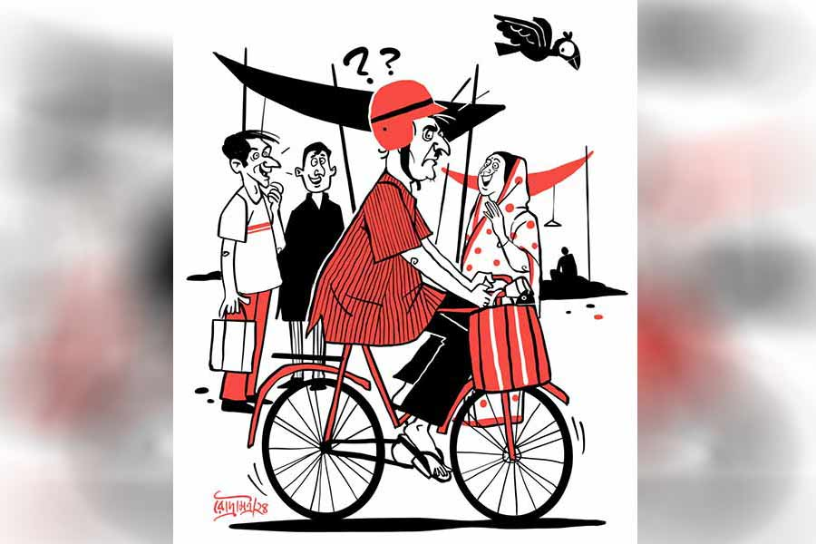

 
 <h1 align=center>ভুলের রামধনু</h1>
<h2 align=center>সর্বাণী বন্দ্যোপাধ্যায়</h2> 

সকাল দশটা। রোদ বেশ ভালই উঠেছে। অসীমবাবু সাইকেল নিয়ে বাড়ি ঢুকছিলেন। স্ত্রী নন্দিতা তাঁর দিকে অবাক হয়ে তাকিয়ে। বাজারের ব্যাগ স্ত্রীর দিকে এগিয়ে দিয়ে অসীমবাবু বললেন, “কী হল? অমন করে চেয়ে আছ কেন? মাছের ব্যাগটা ধরো। এত কিছু এক সঙ্গে সামলানো যায়?”

নন্দিতা তখনও হাঁ করে তাকিয়ে আছেন দেখে কেমন ঘাবড়ে গেলেন।

নন্দিতা কাজের মেয়ে শীলাকে ডাকছিলেন, “ও শীলা, দেখে যা তোর কাকুর কাণ্ডটা!” ছেলেমেয়ে চাকরি ও বিবাহসূত্রে বাইরে থাকায় এখন ওই শীলাই সম্বল।

শীলা হুড়মুড়িয়ে নেমে এল দোতলা থেকে। বেচারি ঝাঁট দিচ্ছিল, নীচে এসে ঝাঁটা ছুড়ে ফেলে হাসতে হাসতে পেট চেপে সিঁড়ির নীচের ধাপেই বসে পড়ল। বার বার বলছিল, “ও কাকু, এটা তুমি কী করেছ?”

নন্দিতাও হাসছেন। বাজারের ব্যাগ হাতে হতভম্ব অসীমবাবু। বার বার বলছেন, “কী করেছি বলবে তো?” তার পরে তেড়েমেড়ে উঠে ব্যাগটা ধপাস করে মেঝেতে ফেলে বেসিনে হাত ধুতে গিয়েই আঁতকে উঠেছেন, “এ কী গো, আমি হেলমেট পরে সাইকেলে চেপে বাজারে গেছি? তুমি এক বার বললে না? ছিঃ ছিঃ! এত ক্ষণ আমি হাতে সাইকেল ধরে আর মাথায় হেলমেট পরে বাজারে ঘুরেছি? তাই লোকে আমার দিকে তাকিয়ে মুচকি মুচকি হাসছিল?”

নন্দিতা বললেন, “হাসবে না? সাইকেলের সঙ্গে হেলমেট দেখলে সব্বাই হাসবে! আমি কি যাওয়ার সময় তোমাকে দেখেছি, যে বলব?”

অসীমবাবুর এ বার মনে পড়ল, “জানো, একটা বাচ্চা ছেলে আমাকে ‘ও জেঠু, ও জেঠু’ বলে ডাকছিল। ছেলেটার মা ওকে কথাটা বলতে দিল না। মহিলা হাড় বজ্জাত তো দেখছি!”

নন্দিতা হাসি চেপে বলেন, “তুমি ভুল করলে, আর বাকি সবার দোষ হয়ে গেল?”

“হবে না? ওদের ভাল বলতে হবে? এক বার বলতে পারত তো, ‘দাদা আপনি ভুল করে…’” অসীমবাবু হেলমেট খুলে মুখে চোখে জলের ঝাপটা দিতে দিতে বলেন, “আমি আর এ বাজারে যাব না। শয়তানের বাজার এটা! সব্বাই মজা দেখে গেল! কেউ এক বার বলল না।”

নন্দিতা বললেন, “ওরা তোমাকে কী ভাবল বলো তো?”

নন্দিতার কথাটা বলতেই অসীমবাবু ভয়ঙ্কর ক্ষেপে যান, “আমি বুঝেছি! ওরা আমাকে পাগল ভেবেছে, তা-ই বলছ তো?”

“ও মা! সে কথা কখন বললাম?”

“বলেছ, ইনডাইরেক্টলি! খাব না, কিচ্ছু খাব না। জলস্পর্শ করব না...” অসীমবাবু দুমদাম করে দরজা খুলে বেরিয়ে যান।

শীলা ঘাবড়ে দরজার দিকে ছোটে, “কী হবে? ও কাকিমা, কাকু তো বেরিয়ে গেল।”

“তোর কাকুর দৌড় জলযোগ পর্যন্ত। আসার সময় কচুরি ভাজতে দেখেছে হয়তো।” নন্দিতা নিরুত্তাপ ভাবে বাজারের ব্যাগ তুলে নেন।

মাছ ধুতে ধুতে স্বামীর কথা ভাবছিলেন নন্দিতা। লোকটা কেমন পাল্টে গেল। বিয়ের পর কম রোম্যান্টিক ছিল! রাহুল হওয়ার আগে অফিস থেকে ফেরার সময় ব্যাগে করে কত কিছু আনত নন্দিতার জন্য। কাজু, সন্দেশ, ঝাল-মিষ্টি ডালমুট, হরির দোকানের কাটলেট। জয়েন্ট ফ্যামিলিতে ইচ্ছেমতো খাওয়ার সুযোগ ছিল না। অথচ তখন এটা ওটা খেতে খুবই ইচ্ছে করত। অসীমবাবু মনের কথা জেনে নিয়ে সব ব্যবস্থাই করে দিতেন, সকলের অগোচরে।

আর এখন খালি রাগারাগি, ছুতোনাতায় ঝগড়া চলছেই! এই তো সে দিন দোষের মধ্যে বলেছিলেন, “অত বড় কুমড়ো কার জন্য এনেছ? কে খাবে? শীলা তো কুমড়ো খেতেই চায় না। হাটখোলা বাড়ির বাজারের অভ্যেস তোমার আর গেল না।”

‘হাটখোলা বাড়ি’ কথাটার একটা বিশেষ অর্থ আছে। অসীমবাবুর বাড়ি হাটখোলায়। অসীমবাবুদের বাড়িতে কাকু, জেঠু সবার পরিবার মিলিয়ে পনেরো জন লোকের বাস ছিল। সকাল-বিকেল হইচই চলত। ছোট পরিবার থেকে আসা নন্দিতা প্রথম দিকে ঘাবড়ে যেতেন। পরে অভ্যেস হয়ে যায়। কিন্তু সেই খোঁটা এখনও মাঝে মাঝে দেন।

এই সব আবোল তাবোল চিন্তার মাঝেই এক বার ভাবলেন, লোকটা গেল কোথায়! মাথা গরম করে বেরিয়ে গেল, জলখাবারের পর তো প্রেশারের ট্যাবলেট খাওয়ার কথা। নির্ঘাত ভুলে মেরে দিয়েছে।

আসল কথা হল এই ভুল। সর্ব ক্ষণ এই জ্বালায় জ্বলতে হচ্ছে! তার নিজের অবস্থাও তথৈবচ। এই তো সে দিন, মেয়ের মাসতুতো ননদ বাড়িতে বেড়াতে এল, কিছুতেই নামটা মনে করতে পারছিলেন না। বার বার খালি ‘তুমি দীপ্তর বোন, তুমি দীপ্তর বোন’ করছিলেন। শেষে সে যখন রসগোল্লা, শিঙাড়া শেষ করে তাঁর দিকে তাকিয়ে বলেই ফেলল, “মাসিমা মনে হয় আমার নাম ভুলে গিয়েছেন!”

মুখে রা সরেনি তার। কেননা অনেক চেষ্টা করেও মেয়েটির নাম তিনি মনে করতে পারেননি।

পরে মেয়ের কাছে এই নিয়ে কথা শুনতে হয়েছে। ফোন করে বলেছে, “ছিঃ মা, তুমি আমার মাসতুতো ননদের নামটাই ভুলে গেলে? এর পর তুমি না আমার নামটাই ভুলে যাও।”

ক’দিন আগে তো দুপুরবেলা ভাত রাঁধতেই ভুলে গেছিলেন। সে কথা আবার সে দিন অসীমবাবু রীতিমতো ব্যাখ্যা করে ফোনে ওর বন্ধুকে বলছিলেন, “আরে, খেতে দেরি হবে না কেন, এই ভরদুপুরে, বাইরে থেকে এসে শুনলাম, গিন্নি ভাত করতে ভুলে গিয়েছেন। নির্ঘাৎ ফোনে আড্ডা চলছিল! কী বলব বল, এত দিন ভাত বসিয়ে ভুলে গিয়ে পুড়িয়ে ফেলত, এ বারে ভাত বসাতেই ভুলে গিয়েছে।”

সে দিন খুব রাগ হয়েছিল তাঁর। সারা জীবন ভাত রেঁধে খাওয়ালেন, আর এক দিনের ভুলের গল্প বিশ্বসংসারে করে বেড়াচ্ছে! ছি! ছি! সে দিন ভেবেছিলেন, ওই রকম বিশ্বাসঘাতক লোকের সঙ্গে আর কথাই বলবেন না। সে প্রতিজ্ঞা অবশ্য রাখা যায়নি। তা ছাড়া ভুল তো তাঁরই।

নন্দিতা কড়াইয়ে তেল গরম করতে দিয়ে দাঁড়িয়েছিলেন গ্যাসের সামনে। শীলা এসে চেঁচাল, “কী গো, তেল পুড়ে যাচ্ছে তো!”

নন্দিতা গ্যাসটা চট করে অফ করে দিলেন। কড়াটা বসিয়েছেন কেন, কিছুতেই মনে করতে পারছিলেন না।

অসীমবাবু পার্কে গাছের ছায়া খুঁজছিলেন। হাতে একটা ঠোঙা। গরম গরম কচুরি ভাজা দেখে খাবার খুবই ইচ্ছে হয়েছিল। নন্দিতার বাক্যবাণের ভয়ে বাড়িতে ও সব ঢোকে না। কোলেস্টেরলের পাঁচালি শুরু হয়ে যায়। অসীমবাবু বোঝেন না, খাওয়াটাই যদি ইচ্ছেমতো না করা গেল, তা হলে এত সাধের বেঁচে থাকা কিসের জন্য?

কত দিন ভেবেছেন জলযোগের কচুরি খাবেন। আহা! কড়াইয়ে ছাড়ে যখন, সারা পাড়া সুবাসিত হয়। বাজার থেকে ফেরার পথেই গন্ধ পেয়েছিলেন। পরে রাগ দেখিয়ে সোজা গিয়েছিলেন জলযোগে। ওখানে বসে খেলেই কেউ বলতে পারে, ‘দেখেছ, বুড়োটা কেমন হ্যাংলা! লুকিয়ে কচুরি সাঁটাচ্ছে।’ তাই খানকতক কিনে পার্কে বসে সদ্ব্যবহার করার কথা ভেবেছেন।

ঠিক তখনই সামনের বাড়ির অনিলবাবুকে পার্কে আসতে হল! একেই বলে গেরো! সবে একটা মনের মতো জায়গা খুঁজে গুছিয়ে বসেছেন। অসীমবাবু ভাবছিলেন, ঠোঙাটা লুকোবেন, না লুকোবেন না?

নন্দিতাকে রাগ দেখিয়ে শেষে ভালই হল। পার্কে বসে গরম গরম কচুরি খাওয়াটা জমে গেল! অনিলবাবুকে অবশ্য একটা কচুরি দিয়েছেন। যে ভাবে তাকাচ্ছিলেন ঠোঙার দিকে, না দিয়ে পারেননি। কচুরি খেয়ে অনিলবাবু মনের দুঃখ খোলসা করে বলেই ফেললেন। উনি নাকি দীর্ঘ দিন বাদে এই একটা কচুরি খেলেন, বললেন, “জানেন ব্লাড প্রেশার আর শুগার দুটোই খুব হাই, তাই গিন্নি আমার মানিব্যাগ নিজের জিম্মায় রেখে দিয়েছেন।”

“মানে? আপনার মানিব্যাগ!”

“কী বলব মশাই, আপনার মতো জলযোগের কচুরি আর মিষ্টি কিনে দু’-এক দিন পার্কে বসে খেয়েছি, ব্যস, রিপোর্ট পেয়েই…”

“কে? কে দিল রিপোর্ট?”

“হবে কোনও ওয়েল উইশার।”

“আপনি কিন্তু আবার...”

“না না, বলব না। আপনার মানিব্যাগ বাজেয়াপ্ত হলে আমারও লস। দু’-এক দিন যাও বা… না, না, কোনও মতেই বলব না।”

অনিলবাবু চলে যাওয়ার পরও অসীমবাবু বসে বসে ভাবছিলেন। না, নন্দিতাকে সমঝে চলতে হবে। পলিসিটা ভুলভাল হয়ে যাচ্ছে।

নন্দিতা এক দিন বলছিলেন, “আজকাল তোমার বিদঘুটে স্বভাব হয়েছে। সব ক’টা খারাপ জিনিস এক সঙ্গে বাড়ছে?”

উত্তর না দিয়ে অসীমবাবু রাগত দৃষ্টিতে তাকিয়েছিলেন শুধু।

“রাগ, লোভ, ভুল সব একই সঙ্গে পাল্লা দিয়ে বেড়েই চলেছে...” বলে নন্দিতা ঘসঘস করে কুটনো কুটতে শুরু করেছিলেন।

অসীমবাবু বলেছিলেন, “আর তোমার একটি জিনিসই ক্রমাগত বাড়ছে, সেটি হল স্পর্ধা!” বলেই হাওয়া হয়েছিলেন।

না, অতটা ঠিক হয়নি। কথাটা তো কিছু ভুল বলেনি ও। মাথা তুলে এ দিক-ও দিক তাকান অসীমবাবু। আর তখনই নজরে পড়ে ব্যাপারটা। পার্কের বেঞ্চগুলো একটাও খালি নেই। তাঁর নিজের মতো বেশ কিছু মানুষ এ দিকে-ও দিকে ছড়িয়ে-ছিটিয়ে বসে ঠোঙা খুলে খুলে কী যেন খাচ্ছে। ওরাও কী তা হলে জলযোগের খদ্দের? মনে খুব দ্বিধা নিয়ে বাড়ির দিকে ফিরছিলেন তিনি।

মানুষটা না খেয়ে রেগেমেগে বেরিয়ে গেল, নন্দিতা কী বলে গুছিয়ে খান! খিদে পেলেও খাওয়া যায় কি? শীলাই বা কী ভাববে? শেষ অবধি নন্দিতা জলে ছাতু গুলে খেয়ে নিয়েছিলেন। এ সময়টায় তাঁর একটু ঝিমুনি আসে। ঝিমোতে গিয়ে কখন যে ঘুমিয়ে পড়েছেন! ঘুমিয়ে ঘুমিয়ে দেখছিলেন, অনেক দূরে কোথাও দু’জনে গিয়েছেন। বরফ পুরু হয়ে জমে আছে চার দিকে। তার মাঝে দু’জনে হাত ধরে হাঁটছেন। হঠাৎ অসীমবাবু বরফে তলিয়ে যেতে শুরু করলেন। তিনি চেষ্টা করেও হাতটা ধরে রাখতে পারছেন না। আতঙ্কে ঘুমটা ভেঙে গেল তাঁর। ঘুম থেকে উঠে খুব ঘাবড়ে গেলেন।

ভাবছিলেন সময়টা কী? সকাল না বিকেল? প্রথমেই হাঁক পাড়লেন শীলার নাম করে, “শীলা, এই শীলা, কোথায় গেলি রে?”

শীলা ঘরে ঢুকে বলল, “কাকু ফিরে, স্নান সেরে কাগজ পড়ছেন। তুমি ঘুমোচ্ছিলে বলে ডাকিনি।”

নন্দিতা রান্নাঘরের দিকে এগোন। বাইরের ঘরে উঁকি মেরে দেখেন অসীমবাবু দিব্যি কাগজ পড়ছেন। তার মানে অনুমান ঠিকই ছিল। উনি নিশ্চিত কোথাও খেয়েছেন সকালে। মুখের ওই স্নিগ্ধ প্রশান্তি খালিপেটে থাকলে থাকত না। তখন মুখ দেখলে বাংলার পাঁচও লজ্জা পেত।

আজ রথযাত্রা। মনে মনে এই দিনটাকেই ভেবে রেখেছিলেন অসীমবাবু। এ রকম ভাল দিনেই সিদ্ধান্ত নিতে হয়। সে দিন বাড়ি থেকে না খেয়ে বেরিয়ে যাওয়ার পর থেকেই নন্দিতার সঙ্গে বাক্যালাপ বন্ধ চলছে।

দোষ তাঁরই। কিছু না খেয়ে বেরিয়ে গিয়ে পার্কে বসে কচুরি খেয়েছেন। আর বেচারি নন্দিতা কিছু না খেয়ে ঘুমিয়েই পড়েছিল। কী ভাবে যেন জেনে ফেলেছে, তিনি ওই রকম একটা জোচ্চুরি করেছেন। তাই তাঁর সঙ্গে কথাই বলছেন না।

কত বার চেষ্টা করেছেন কথা বলানোর, এখন আর সে চেষ্টা করেন না। একেবারেই হাল ছেড়ে দিয়েছেন। ভবি ভোলার নয়। সে দিন ওই জলযোগের কচুরি এনে দিলেন। একটাও খেল না। শেষে সবটাই শীলা আর তিনি মিলে শেষ করলেন। অমন নরম খাস্তা কচুরি, পয়সা দিয়ে কেনা। ফেলেন কী করে?

সপ্তাহ দুয়েক কেটেছে মুখবন্ধ করে। কম সাংঘাতিক নয়! খেতে দিচ্ছে, জামাকাপড় গুছিয়ে রাখছে। কিন্তু একটা কথাও বলছে না। ও দিকে শীলার সঙ্গে দিনরাত বকরবকর চলছে। তিনিই শুধু বোবা হয়ে আছেন। নিজের বাড়িতেই নিজেকে কেমন ভিখিরি ভিখিরি মনে হচ্ছে। তাই শেষ পর্যন্ত ঠিক করেছেন তিনি বৃদ্ধাবাসেই যাবেন।

বেশি দূরে নয়, কাছেই ‘শান্তিনিবাস’ নামে গড়ে ওঠা বৃদ্ধাবাসটা মনে ধরেছে তার। ওখানেই যাবেন ঠিক করে ফর্ম ফিল-আপ করে এসেছেন। আজই সেই শুভ দিন। টাকাপয়সাও তৈরি রেখেছেন। গিয়ে জমা করে দিয়ে একেবারে থাকতে শুরু করে দেবেন। শুভ কাজে আর দেরি করার কিছু নেই।

সংসার শীলাকে নিয়ে নন্দিতাই চালান। টাকাপয়সাও থাকে ওঁর কাছে। মাসে মাসে টাকা যা দেওয়ার দিয়ে যাবেন। সবটাই ভেবে ফেলেছেন, শুধু বাড়ি থেকে বেরোনোর অপেক্ষা। গতকাল রাতে দরজা বন্ধ করে সুটকেস গুছিয়েছেন, খাটের তলা থেকে বার করে বাইরের ঘরে নিয়ে রাখলেন শেষ অবধি। এ বার এক বার বাথরুমে যাবেন, তার পরেই বেরোবেন। এই এক বদরোগ তার, বাড়ি থেকে বেরোনোর আগে বাথরুম যেতেই হবে।

বাথরুম থেকে ফিরেই হতবাক। বাইরের ঘরে আর একটা সুটকেস। নন্দিতা রেডি হয়ে বসে আছেন।

গায়ে পড়ে কথা বলে ফেলেন, “তুমি কোথায় যাচ্ছ?”

নন্দিতা চুপ। উত্তর দেয় শীলা, “শান্তিনিবাসে।”

“শান্তিনিবাস! মানে?”

“মা বাড়িতে আর থাকবেন না। ওখানেই চলে যাচ্ছেন।”

“আমিও তো ওখানেই যাচ্ছি!”

শীলা হেসে ফেলে, “সে কী? দু’জনেই? এক জায়গায়?”

“দুত্তোর! নিকুচি করেছে! কোথাও শান্তি নেই!” বলে নন্দিতা উঠে পড়েন। শীলা ওঁর সুটকেস টানতে টানতে ভিতরে ঢুকে যায়।

অসীমবাবু হতভম্ব হয়ে সোফায় বসে পড়েন। শীলার উদ্দেশে হাঁক পাড়েন, “শীলা, চা কর।”

চা খেতে খেতে উঠে পড়েন অসীমবাবু। ভুল, সবটাই তাঁর ভুল। বৃদ্ধাবাসের ফর্ম ফিল-আপ করে তোশকের তলায় লুকিয়ে রেখেছিলেন। মনেই ছিল না নন্দিতা রোজ বিছানা ঝাড়ে, চাদর পাল্টায়...

চায়ের জন্য অপেক্ষা করতে করতে আনমনেই মুচকি হাসি ফোটে অসীমবাবুর মুখে। সব ভুল কি আর খারাপ না কি!

