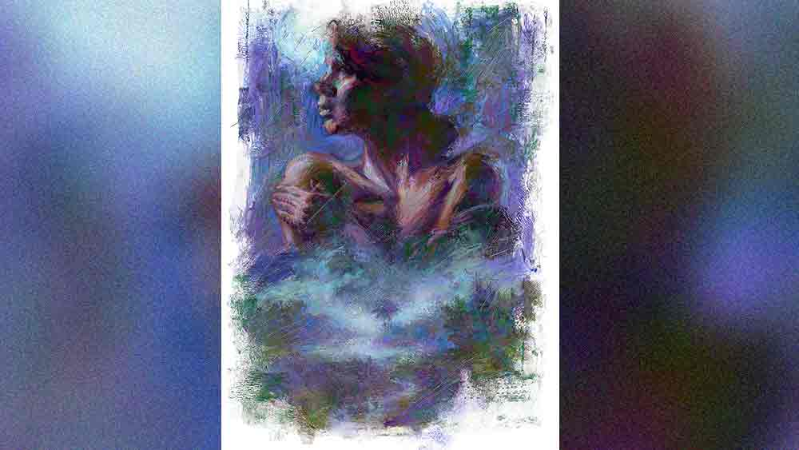

 

<h1 align=center>ভূতগ্রস্ত</h1>
<h2 align=center>জয়দীপ চক্রবর্তী</h2>
শহরের চেয়ে এমনিতেই এ দিকে শীত বেশি। চার দিকে ফাঁকা মাঠ বলে শীতের কামড় গায়ে আরও বেশি করে বসে যায়। তা যাক। মঙ্গলা ভাবে, হ্যাংলা ব্যাটাছেলেগুলোর কামড়ের চেয়ে শীতের কামড় অনেক আরামের।   খেতের মধ্যে বাঁশ, খড় আর তক্তা দিয়ে বাঁধা ছোট্ট কুঁজিটায় বসে গায়ের চাদর দিয়ে কান-মাথা মুড়ে নেয় মঙ্গলা। বাইরে চাঁদের আলোর সঙ্গে কুয়াশার মাখামাখি। টিভি-তে দেখা বাংলা বইয়ের স্বর্গের সিনের মতো। ফুটে থাকা ফুলকপিগুলোর ওপর সাদা ধোঁয়ার কুণ্ডলী। সে দিকে তাকিয়ে থাকলে মনে হয় এই বুঝি কুয়াশার চাদর সরিয়ে সারা গায়ে জ্যোৎস্না মেখে কোনও দেবী এসে দাঁড়িয়ে পড়বেন মাঠের মাঝখানে।   দূরে ক্যানিং রোডে একটু আগেও দু’-একটা গাড়ি ছুটছিল। এখন আর গাড়ির আওয়াজ নেই। কুঁজি থেকে একটু দূরে এক দল শেয়াল। আবছা কুয়াশায় তাদের চোখ জ্বলছে। বাইরে মুখ বাড়িয়ে চাঁদের অবস্থান দেখল মঙ্গলা। রাত গভীর। বারোটা বাজতে দেরি নেই। সামচুর, ফরিদা, জাহাঙ্গির, সুদাম সবাই এ বার বাড়ি ফিরে যাবে।   গত বছরের তুলনায় এ বারে ফুলকপির ফলন ভাল। টমেটোও হয়েছে অনেক। বাঁধাকপি, ওলকপি কোনওটাই কম হয়নি। সকলেরই আশা, খোরোচাষে এ বছর দু’পয়সা আসবে। কিন্তু ফলন ভাল হলে রাতবিরেতে ফসল চুরির ভয় থেকেই যায়। তাই কুঁজি বেঁধে রাতপাহারার বন্দোবস্ত। আগে সকলে সারা রাত মাঠেই থাকত। আজকাল অনেকে বারোটা-সাড়ে বারোটা বাজলে ঘরে ফিরে যায়। শীতে, অন্ধকারে, ফাঁকা মাঠে কুঁজির মধ্যে রাত কাটানোর মতো সাহস মেয়েদের নেই। দিনকাল ভাল নয়। বিপদের ভয় দিন দিন বাড়ছে। ব্যতিক্রম শুধু মঙ্গলা। সে আর পাঁচ জনের চেয়ে বরাবরই আলাদা।   মঙ্গলার খেতটা যেখানে, তার খানিক তফাতেই জোড়া খেজুরতলার হাত চ্যাটালো ঢিবিটা। জায়গাটা গোলমেলে। দিনের আলো থাকতেই ও দিকে কেউ তাকাতে চায় না, রাতে তো কথাই নেই। এ গ্রামে স্বাধীনতার এত বছর পরেও দারিদ্র, অশিক্ষা, অপুষ্টি কিছুই কমেনি। এ গ্রামে জন্মের হার বেশি, শিশুমৃত্যুর হারও। সেই সব মৃত শিশুদের সৎকার হয় না। গ্রামের লোকেরা তাদের স্থির, ঠান্ডা শরীরগুলো পুঁতে দিয়ে যায় জোড়া খেজুরতলায়। শেয়াল, কুকুরের দল মাঝে মাঝে সেই সব কচি শরীরের ছোট ছোট হাত, পা খুঁড়ে বার করে মাটির নীচ থেকে। যারা রাতপাহারার জন্যে মাঠে থাকে, প্রায়ই শোনে নিশুত রাতে জোড়া খেজুরতলা থেকে শিশু-কান্নার রোল উঠেছে। সব জেনেশুনে কে তাকাবে সে দিকে, রাতের আঁধার নামার পরে?   অথচ মঙ্গলার কুঁজির মুখ ওই দিকেই। রোজ বাড়ি ফিরে আসার সময় সামচুর, ফরিদারা দেখে, ওই জোড়া খেজুরতলার দিকে মুখ করেই কেমন অদ্ভুত দৃষ্টি নিয়ে স্থির হয়ে বসে থাকে মঙ্গলা। ওই ভূতুড়ে ঢিবির দিকে তাকিয়ে কী যে দেখে মেয়েটা কে জানে! সবাই বলে, মঙ্গলা ভূতগ্রস্ত, নইলে সারা রাত একলা একটা মেয়ের পক্ষে ও ভাবে কুঁজির মধ্যে মাঠে শুয়ে থাকা কিছুতেই সম্ভব নয়।   আজও ওই ঢিবিটার দিকে মুখ করেই চুপ করে বসে ছিল মঙ্গলা। বাইরে কুয়াশামাখা জ্যোৎস্না। ঢিবির ওপরে ঝোপেঝাড়ে জোনাকিদের মিটিমিটি আলোর জ্বলা-নেভা চোখে পড়ছিল। সামচুর তার কুঁজির বাইরে এসে গলা তুলে জিজ্ঞেস করল, “ও মঙ্গলা বুন, আজও ঘরে যাবিনি?”   “না,” মঙ্গলা মাথা নেড়ে হাসে।   “তোর কলজেটা কী দিয়ে গড়া রে বুন?” ফরিদা বিস্ময় জড়ানো গলায় বলে, “সঙ্গে পুরুষ মানুষ নি, একলা মেয়েছেলে মাঠে রাত কাটাস এমন করে, তোর ইজ্জতির ভয় নি?”   “কে কাড়তি আসবে আমার ইজ্জত?” আবছা অন্ধকারে মঙ্গলার দু’চোখ ধকধক করে জ্বলে ওঠে দূরে দাঁড়ানো শেয়ালগুলোর মতোই, “হাতের এই হেঁসোটা আচে কী কত্তি? ধড় থিকে মুন্ডুটা আলাদা কোদ্দুবুনি?”   কুঁজির তক্তার ওপর পাতা খড়ের বিছানা থেকে শান দেওয়া কাটারিটা বার করে তুলে দেখায় মঙ্গলা।   সামচুর নিচু গলায় বলে, “মানষের হাত থিকে না হয় বাঁচলি, কিন্তু তেনাদেরকে ভয় পাস না তুই?”   মঙ্গলার চোখ হঠাৎই নরম হয়ে আসে। সামচুরের কথায় উত্তর দেয় না সে। জাহাঙ্গির তাড়া লাগায় ওদের, “ও ফরিদা, চল রে। সামচুর, আর দাঁড়াসনি মণি। রাত অনেক হল। মধ্যরাত্তিরির পর মাঠের ইদিকটা জিনেদের দখলে চলি যায়। আর দাঁড়াসনি ইদিকে, এ বারে ঘর চল...”   “ঘর চল, ঘর চল...”— জাহাঙ্গিরের বলা শেষ কথাটা মাথার ভেতর পাক খাচ্ছিল মঙ্গলার। শব্দ দুটোকে কিছুতেই সরাতে পারছিল না সে তার মন থেকে। সুবলটা অত বড় শয়তান ঠাওর করতেই পারেনি সে। নইলে তার মতো ডাকাবুকো মেয়েকেও ভাল কথায় ভুলিয়ে সে ঘরে তুলতে পারে! সুবল এই গাঁয়ে এসেছিল শ্যালো মেশিন বসাতে। পেটানো চেহারা। এক মাথা কোঁকড়ানো চুল। মঙ্গলার হিতাহিত জ্ঞান ছিল না ওর ইশারা পাওয়ার পর।   তাকে বিয়ে করে সুবল যখন খালপাড়ের বস্তিতে নিয়ে গিয়ে তুলেছিল, তখনও যমুনার কথা জানতে পারেনি মঙ্গলা। জানতে পারল মাস দুই ঘর করার পর। যমুনাকে সুবল রেখেছিল হালদার পাড়ার এক কামরার ভাড়া ঘরে। দু’বছরের ছেলেকে কোলে নিয়ে যমুনা যে দিন এসে তার সামনে দাঁড়াল, পায়ের নীচ থেকে মাটি সরে গিয়েছিল মঙ্গলার। দুঃখ নয়, রাগই হয়েছিল বেশি। নিজের ওপর। এত সহজে সুবলকে সে বিশ্বাস করেছিল কী করে! অনেকেই তো তখন সাবধান করেছিল। মা-ও বলেছিল বার বার, “এত তাড়াহুড়ো করিসনি মঙ্গা, সময় নে। খোঁজ নে আরও...”   সে দিনও সুবল বাড়িতে ছিল না। ভিন্‌ গাঁয়ে গিয়েছিল কাজ করতে। যমুনা আলুথালু পোশাকে এসে তার দরজায় দাঁড়িয়ে হাউহাউ করে কেঁদে ফেলল। ছেলেকে দেখিয়ে বলল, “তুই যদি আমার সুবলরে কেড়ে নিস, এরে আর বাঁচাতি পারবুনি রে বুন”... তার পর ফিসফিস করে বলল, “আরও একখানারে সুবল পুরে দেচে আমার পেটের মদ্যি...”   মঙ্গলা সেই দুপুরেই বাড়ি চলে এসেছিল এক কাপড়ে। আসার সময় যমুনার দু’হাত ধরে বলে এসেছিল, “আমি জানতুমনি গো দিদি। বিশ্বেস করো, জানলি তোমার এ সব্বোনাশ আমি কত্তুমনি।”   সুবল তাকে ফিরিয়ে নিতে এসেছিল ক’দিন পরেই। মঙ্গলার সামনে অপরাধীর মতো মুখ করে বলেছিল, “তোরে বড্ড ভালবেসে ফেলেছিলুম মঙ্গলা। পাছে আমায় ফিরিয়ে দিস, তাই যমুনার কথা বলতি পারিনি তোকে। চল, আমার সঙ্গে ঘর চল মঙ্গলা, নিজের ঘরে চল...”   “না,” জোর গলায় সেদিন বলেছিল মঙ্গলা।   মা-ও বলেছিল, “ভেবে দেখ মঙ্গা। সমাজ বলে একটা কতা আচে। এই সোয়ামি থাকতি সমাজ টপকে তোর আবার বে দিতি আমি পারবুনি।”   “একাই থাকব আমি নিজির মতো,” ফোঁস করে উঠেছিল মঙ্গলা, “আমার কতা তোমাদের কাউরে ভাবতি হবেনি।”   ফিরে গিয়েছিল সুবল। ফিরে যাওয়ার সময় মঙ্গলা তাকে শাসিয়েছিল, “এ গেরামের মাটিতে ফের যদি দেকি তোকে, ধড় মুন্ডু পেথক করে দোব বলে দিলুম...”   সুবল আর আসেনি। গেরস্থালি আর মাঠের চাষের কাজ নিয়েই সময় কাটিয়েছে মঙ্গলা। লোভী চোখগুলোর হাত থেকে নিজেকে রক্ষা করতে সব সময় কোমরে গুঁজে রেখেছে শান দেওয়া চকচকে কাটারি।   বাড়ি ফেরার মাস দুই পরে মাত্র এক বারই দিনদুয়েকের জন্যে গাঁয়ের বাইরে ছিল মঙ্গলা। মা-কে বলেছিল, “আমার না থাকাটুকু গোপন রেখো।”   মা একবার জিজ্ঞেস করেছিল, “কোথায় যাবি?”   সে বলেছিল, “কাজ আছে।” আর কিছুই কখনও মা-কে বলেনি মঙ্গলা। আজও নয়।   শেয়ালের ডাকে চটকা ভাঙল। হ্যাঁ, সময় হয়েছে। ওই তো জোড়া খেজুরতলায় কান্না জুড়েছে ওরা। ধড়মড় করে কুঁজির বাইরে বেরিয়ে এল মঙ্গলা। কাটারিটা কোমরে গুঁজল। আশপাশের ক্ষেতে কুঁজি বেঁধে রয়েছে শওকত, বাসু আর নবীন। একটুখানি অপেক্ষা করল মঙ্গলা। কান খাড়া করল মানুষের জেগে থাকার শব্দ শোনা যায় কি না তা দেখার জন্য। না, জোড়া খেজুরতলার শিশুরা ছাড়া আর কেউ জেগে নেই।  নিশ্চিত হয়ে গায়ের চাদর কান, মাথার ওপরে টেনে নিয়ে সে কুয়াশায় মিশে গিয়ে হাঁটা লাগাল জোড়া খেজুরতলার দিকে।   ওই তো ঢিবিটা। দু’হাতে হাঁটুর ওপরে শাড়ি তুলে ধরে লাফিয়ে ঢিবির ওপরে উঠে দাঁড়াল মঙ্গলা। ঢিবির ওপরে পরস্পরকে জড়িয়ে দাঁড়িয়ে থাকা খেজুর গাছ দুটোর মাথায় ঝটাপটি করে উঠল ধপধপে সাদা ডানার এক পাল বক। ঠান্ডা, সিরসিরে হাওয়া বইছে মঙ্গলাকে ঘিরে। এক সঙ্গে অনেকগুলো বাচ্চার চাপা কান্নার আওয়াজ উড়ছে সেই বাতাসে। ডুকরে কেঁদে উঠল মঙ্গলা।   একলা গ্রাম থেকে বেরিয়ে, মণ্ডলডাক্তারের নার্সিং হোমে নিজের পেটের মধ্যে বাড়তে থাকা যে বাচ্চাটাকে সে খসিয়ে এসেছিল, কুয়াশায় মাখামাখি হয়ে অন্য বন্ধুদের সঙ্গে সে-ও এখানে অপেক্ষা করছে তারই জন্যে। খেজুর গাছের ওপরে বকগুলো আবার ডানা ঝটপট করে উঠল। জোড়া খেজুরতলার ঢিবিতে শিশু-কান্নার শব্দও তীব্রতর হল।   মঙ্গলা অস্থির হয়ে উঠল, “বড্ড খিদে পেয়েছে, না রে সোনা? দাঁড়া দিচ্ছি। একটুখানি সবুর কর বাপ...”   ঢিবির ওপরে কুয়াশা আরও জমাট বাঁধছে। চাঁদের আলো সে আড়াল ভেদ করতে পারছে না আর। মঙ্গলা নিজের গা থেকে চাদর খুলে ছুড়ে ফেলল মাটিতে। কাঁধের ওপর থেকে শাড়ির আঁচলও খসিয়ে দিল। তার পর ব্লাউজ়ের হুকগুলো খুলে ফেলল একটা একটা করে।   মাটির ওপরে কোল পেতে বসে নিজের দু’হাতে দুই স্তন মেলে ধরে গভীর স্নেহে ডাকতে লাগল মঙ্গলা, “আয়, খাবি আয়। খেয়ে যা মণি, আয় রে সোনা, এসে খেয়ে যা...”   নবীন ধীর পায়ে বাইরে বেরিয়ে এল। শওকত আর বাসুর কুঁজিতে উঁকি মেরে দেখে নিল এক বার। ওরা ঘুমিয়ে পড়েছে। মঙ্গলাও কি ঘুমিয়ে পড়েছে? জিভ দিয়ে নিজের ঠোঁটদুটোকে এক বার চেটে নিল নবীন। অনেক দিন অপেক্ষা করেছে সে। ঠারেঠোরে মনের ভাব জানাতেও কসুর করেনি। কিন্তু মঙ্গলার মন বলে কিছু নেই। পাথর সে।   “অনেক হয়েছে। আর নয়,” দাঁতে দাঁত পিষে অনুচ্চ স্বরে বলে নবীন, “আজ আমি তোকে নেবই মঙ্গলা।”   মাঠে কাজ করার ধারালো কাস্তেটাকে কোমরের কষির কাছে গুঁজে নিল নবীন। মঙ্গলাকে বিশ্বাস নেই। যদি বেশি ত্যান্ডাই ম্যান্ডাই করতে যায় তো...   মঙ্গলার খেত মাঠের অন্য দিকে। বেড়ালের মতো, নিঃশব্দে মাঠের আনাজপাতি বাঁচিয়ে মঙ্গলার কুঁজির দিকে এগিয়ে গেল নবীন। ওই তো মঙ্গলার কুঁজি। ঢোকার রাস্তাটা জোড়া খেজুরতলার দিকে। পায়ে পায়ে আরও এগিয়ে এল নবীন। আর তখনই দৃশ্যটা চোখে পড়ে গেল তার। আদিগন্ত সবুজ ফসলের ওপরে লুটিয়ে পড়েছে জ্যোৎস্না। ভেসে যাচ্ছে চরাচর। তারই মাঝে, জোড়া খেজুরতলার ঢিবিটার ওপরে ধোঁয়া-ধোঁয়া কুয়াশায় মাখামাখি হয়ে মন্দিরের মূর্তিরই মতো স্থির বসে আছে এক অলৌকিক মাতৃমূর্তি। সুধাভাণ্ড ধরে আছে দু’হাতে। সারা পৃথিবীকেই যেন ডাকছে চাপা স্বরে, “আয় মণি, খেয়ে যা রে সোনা—”   সেই অপার্থিব দৃশ্য দেখে নবীনের সারা শরীর ঝিমঝিম করে উঠল। মনে হচ্ছে, কী সব যেন উল্টেপাল্টে যাচ্ছে মনের মধ্যে। বুকের গভীর থেকে এক উথালিপাথালি কান্না জাগছে তার। নিজের কুঁজি ছেড়ে কেন যে সে বেরিয়ে এসেছিল এই হিমভেজা রাতে, চুপিচুপি, কিছুই মনে পড়ল না আর নবীনের।   ভিজে আলো আর অস্বচ্ছ কুয়াশায় মাখামাখি হয়ে দু’হাঁটু মুড়ে মাটির ওপর বসে পড়ল নবীন। মাথা নিচু। দু’হাত বুকের কাছে জড়ো করা।   শীতে জবুথবু রাত গড়িয়ে চলল। তবু নবীন বসেই রইল। উঠল না।
