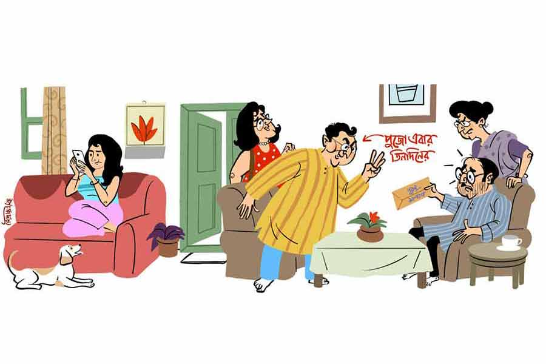

 
 <h1 align=center>ভোগের বালাই</h1>
<h2 align=center>কৃষ্ণেন্দু মুখোপাধ্যায়</h2> 

কী  আস্পর্ধা! ছোট ভাই বড় দাদাকে ট্যারা ট্যারা করে কথা বলে এ ভাবে হেনস্থা করবে? ছোটর সঙ্গে এত ক্ষণ মুখে মুখে লড়ে যাচ্ছিল বিজয় ঘোষাল। তবে এ বার ছোটকে মোক্ষমটা না দিলেই নয়। উত্তেজিত হয়ে দাঁড়িয়ে চোখমুখ লাল করে বিজয় বলতে আরম্ভ করল, “আজ মেরা পাস বিল্ডিং হ্যায়, প্রপার্টি হ্যায়, ব্যাঙ্ক ব্যালান্স হ্যায়, বাঙ্গলা হ্যায়, গাড়ি হ্যায়... কেয়া হ্যায় তুমহারে পাস?”

চ্যাংড়া এত ক্ষণ এক কোণে কুমিরছানার মতো শুয়েছিল। বিজয়কে মারমুখী হয়ে উঠতে দেখে তড়াক করে উঠে দাঁড়িয়ে লেজ খাড়া করে গরর গরর আওয়াজ করতে শুরু করে দিল।

বিনয় ঘোষালও উঠে দাঁড়িয়ে দাদার প্রশ্নের উত্তরটা দিতে যাবে, এমন সময় নাকে ভেসে এল ধুনোর গন্ধ মাখানো মায়ের হাতের রান্না করা ভোগের খিচুড়ির সেই স্বর্গীয় সুবাস। বিজয় ঘোষালের তেল-চকচকে উত্তেজিত মুখটা বদলে গিয়ে কেমন কোমল হয়ে চোখ ছলছলে হতে থাকল। শেষে ডুকরে বলে উঠল, “মা!”

বিনয় ঘোষালও দাদার গলার সঙ্গে আবেগপূর্ণ গলা মেলাল, “মা!”

তিন দিন আগের বুধবার, মহালয়ার দিন

ঘোষালবাড়ির পারিবারিক মিটিং বসেছে। এক কালের যৌথ পরিবারটা ভাঙলেও দুর্গাপুজোটা বদলায়নি। ঐতিহ্য, বনেদিয়ানা ইত্যাদি ক্ষয়িষ্ণু ব্যাপারগুলোর স্বাক্ষর ধরে রাখার জন্য মা দুর্গার চেয়ে ভাল আর কী হতে পারে? দোতলা বাড়িটা আড়াআড়ি ভাগ হয়ে গেছে অনেক দিন। ব্যবসাপাতি করে বিজয় বর্ধিষ্ণু, আর চাকরিবাকরি করে ইএমআই মেটাতে মেটাতে বিনয় আর্থিক ভাবে ঈষৎ দুর্বল। বাড়ির সঙ্গে আছে একটা গ্যারাজ, আর একখানা চিলেকোঠা। এই দুটো ভাগ করা সম্ভব হয়নি। গ্যারাজেই হয় ঘোষালবাড়ির দুর্গাপুজো। কৈলাস থেকে ছেলেমেয়েদের নিয়ে এসে মা দুর্গা ওখানেই ক’টা দিনের জন্য স্থান পান। বছরের বাকি সময়টা অবশ্য বিজয়ের গাড়িটা থাকে। পুজোটা এখন ভাগের পুজো। পালা করে এক বছর এক ভাই মুখ্য খরচটা দেয়, অন্য ভাই নগদে কিছু পূরণ। পরের বছর উল্টো।

এ বছর বিনয় ঘোষালের পালা। মিটিংটা বিনয়ের বাড়িতেই বসেছে। বিজয় গিন্নি লাবণীকে নিয়ে ভাইয়ের বাড়িতে এসেছে পুজোর আয়োজনে কোনও ত্রুটি হচ্ছে কি না সরেজমিনে দেখতে। পৃথিবীর আর কেউ খুঁজে পাক বা না পাক, এক ভাই অন্য ভাইয়ের হাজারটা খুঁত খুঁজে পায়। সেই নিয়েই যথারীতি কথার ঠেস দেওয়া-নেওয়া চলছিল, তার মধ্যে বিজয় ঘোষাল পাঞ্জাবির পকেট থেকে একটা খয়েরি খাম বার করে টেবিলের উপর সশব্দে রেখে একটা তুড়ি মারল। খামের উপর লেখা আছে ‘পূরণ’। তার তলায় ‘১৮,৭৫০ টাকা’ লিখে গোল করা আছে। বিনয় দেখল। টাকার অঙ্কটা দেখে মাথা ঝনঝন করে উঠল ওর। পাশে বসা স্ত্রী পারমিতার দিকে এক বার তাকিয়ে বিজয়কে বলল, “দাদা, পঁচিশ কথা ছিল।”

বিজয় কাঁধ ঝাঁকাল, “কথা ছিল। কিন্তু ক্যালেন্ডারে দেখলাম পুজো এ বার তিন দিনের। সেই অনুপাতে এটাই হয়।”

“কী বলছ দাদা! পুজো তিন দিনের হলেও খরচটা কী কম? ডেকরেটর, লাইট, পুরুত কেউই তো কম নিচ্ছে না। চার দিনের রেটই নিচ্ছে। প্রতিমা কি এ বার ইএমআই-তে আনব?”

পারমিতার হঠাৎ চোখে পড়ল, মেয়ে টিকলি বারান্দায় বেরিয়ে এল। বাড়ির পুজোর ব্যাপারে টিকলির কোনও আগ্রহ নেই। পারমিতা ছোটবেলায় মেয়েকে বলত, বড়দের কথার মধ্যে না থাকতে। এখন বড় হয়েছে। কলেজে সেকেন্ড ইয়ারে পড়ে। পারমিতা এখন শেখায়, বড়দের কথার মধ্যেই থাকতে। টিকলি থাকলে দুই ভাইয়ের লড়াইয়ে ভাশুরের মুখে একটু আগল থাকে। বিনয় একটু কম কোণঠাসা হয়।

পারমিতা গলা চড়াল, “অ্যাই টিকলি, বাড়িতে পুজোর মিটিং হচ্ছে, কী মোবাইলে সারা ক্ষণ মুখ গুঁজে বসে আছিস? এ দিকে আয়।”

সকালে উঠে থেকেই টিকলির মাথাটা গরম। মায়ের ডাকে চিউয়িং গাম মুখে মোবাইল দেখতে দেখতেই মুখ গোঁজ করে এসে ধপাস করে সোফায় বসল। চ্যাংড়া উঠে এসে টিকলির পায়ের কাছে বসে কুঁইকুঁই করে লেজ নাড়তে থাকল।

বিনয় বলল, “কী দাদা, কিছু বলছ না যে?”

“আহ! হিসেবে তুই সেই কাঁচাই রয়ে গেলি। ইলেকট্রিসিটি বিলের খরচ কম, খাওয়া-দাওয়ার খরচ কম, তার পরে...”

“নাহ, এ ভাবে নন-কোঅপারেশন হলে পুজোটাই আর টানা যাবে না।”

চিউয়িং গাম চিবোতে চিবোতে টিকলি ফস করে জিজ্ঞেস করল, “আমাদের বাড়ির পুজোটা কত বছরের পুরনো?”

বিনয় বলল, “তিয়াত্তর।”

বিজয় বলল, “না, চুয়াত্তর। হিসেবে তুই সেই কাঁচাই রয়ে গেলি ছোট। দাদু বত্রিশ বছর বয়সে পুজোটা শুরু করেছিল। দাদুর জন্মসাল ধরে হিসেব করে দেখ।”

টিকলি বলল, “আসলে বুলেটদা একটা প্রোপোজ়াল দিয়েছে।”

“ওই লোফার, উঠতি প্রোমোটারটা? ওর সঙ্গে মিশছিস?” বিনয় চোখ পাকিয়ে উঠল।

“মিশতে যাব কেন? রাস্তায় আমাকে দেখে নিজে থেকে এগিয়ে এসে বলল, ‘অ্যাই টিকলি, তোদের পুজোটা এ বার পঁচাত্তর না? তোর বাবা-জেঠুর সঙ্গে একটু কথা বলে দেখ না। নতুন একটা ক্লাব খুলেছি। তোদের বাড়ির পুজোটা যদি আমাদের ফ্র্যাঞ্চাইজ়ি দিয়ে দেয়! তোদের বাড়ির পুজো তোদের বাড়ির মতোই থাকবে, শুধু আমাদের ক্লাবের নামে হবে। পঁচাত্তর বছরের পুরনো ঐতিহ্যশালী পুজো। একেবারে ডায়মন্ড জুবিলি দিয়ে শুরু করব।’ বুলেটদা কী সব সরকারি অনুদান পেয়ে যাবে বলছিল তা হলে। টাকাকড়ির সমস্যা থাকবে না।”

বিজয় বলে উঠল, “তাই নাকি?”

বিনয় টিকলিকে ধমকে উঠল, “খবরদার! বুলেটের সঙ্গে একদম কথা বলবি না। বাড়িটার উপর লোভ। গুঁড়িয়ে দিয়ে ফ্ল্যাটবাড়ি করার জন্য পুজোটা হাইজ্যাক করে ছুঁচ হয়ে ঢুকতে চায়! ঘোষালবাড়ির ঐতিহ্য ‘বিল্ডিং হ্যায়, বাঙ্গলা হ্যায়, গাড়ি হ্যায়’ ডায়ালগ দিয়ে নয়, সংস্কৃতি, মূল্যবোধ চর্চা করে করে হয়েছে। ঘোষালবাড়ির পুজোর প্রতিটি আচার, আয়োজনের একটা ঐতিহ্য আছে, পরম্পরা আছে।”

“বাঙ্গলা হ্যায়! এই বাংলা বাড়িটা নিয়ে যত আদিখ্যেতা!” লাবণী মুখ ফস্কে বিড়বিড় করে বলে ফেলেই বুঝল স্বামীকে বেকায়দায় ফেলে দিচ্ছে। লাইনে ফেরাতে হবে। কাঁধ ঝাঁকিয়ে বলল, “ঐতিহ্য, পরম্পরা সবই তো বুঝলাম, কিন্তু সেটা রক্ষা হবে কী ভাবে? এই ধরো মা দুর্গার কাছে নিবেদন করা হবে যে ভোগ, সেই খিচুড়িটা রাঁধবে কে এ বার? মায়ের পক্ষে তো আর সম্ভব নয়। আমি করে দিতে পারতাম, কিন্তু বাতের ব্যথায় তো আঙুল নাড়তে পারছি না। পারু, তুই পারবি?”

পারমিতা মনে মনে এক হাত নিল। মাথায় জিলিপির প্যাঁচ নিয়ে এক নম্বরের কুচুটে কুচুক্কুরে জা, ঠিক যেন পায়ের ঘা! ভাল করেই জানে যে পারমিতার রান্নাবান্না আসে না, রান্নাঘরের দিক মাড়ায় না। মিষ্টি হেসে বলল, “ওটা কোনও সমস্যাই নয় দিদিভাই। সে দিনই হোয়্যাটসঅ্যাপে কে যেন পাঠাল, একটা ক্লাউড কিচেন খুলেছে। ওরা একবারে শুদ্ধাচারে মায়ের ভোগের খিচুড়ি রান্না করবে। অনলাইনে অর্ডার করলেই বাড়িতে পাঠিয়ে দেবে। দাঁড়াও দেখছি।”

লাবণী নিচু গলায় বিড়বিড় করে ফুট কাটল, “ছোট বৌ সবই মায়ের ভোগে পাঠাবে।”

পারমিতা মুখ তুলে বলল, “আমায় কিছুবললে দিদিভাই?”

“না রে! তবে ওটা হবে না বুঝলি। তোর ক্লাউড কিচেন শুদ্ধাচারে খিচুড়ি রান্না করলেও যে ডেলিভারি বয় নিয়ে আসবে, সে যদি অন্য ডেলিভারির মাছ-মাংসের সঙ্গে নিয়ে আসে? বাড়ির বড় বৌ বলে আমার একটা দায়িত্ব আছে। আমি তাই একটা ব্যবস্থার কথা ভাবছি।”

“কী ব্যবস্থা?” বিজয় আর বিনয় এক সঙ্গে জিজ্ঞেস করে উঠল।

“শকুন্তলাকে বলছি, এ বাড়ির ঐতিহ্য রক্ষা করতে ভোগের খিচুড়িটা ও যদি এসে রান্না করে দিয়ে যায়। ওকে শুধু একটা ভাল সিল্ক গাদোয়াল কিনে দিস পারু।”

“শকুন্তলা!” নামটা শুনে বিনয়ের মুখচোখই পাল্টে গেল। নড়েচড়ে উঠে গদগদ গলায় জিজ্ঞেস করল, “শকুন্তলা সত্যি খিচুড়ি রান্না করতে এ বাড়িতে আসবে বৌদি?”

পারমিতা কটমটে চোখে স্বামীর দিকে তাকাল। শকুন্তলা হচ্ছে বড় জায়ের মামাতো ভাইয়ের বৌ। নাম শুনলেই বুড়ো ভামটার চোখ রসকদম্ব হয়ে যায়। এক গাল ভাত বেশি খায়। ঠিক খেয়াল রাখে, কখন শকুন্তলা দাদার বাড়িতে আসছে। তখনই দাদার সঙ্গে জরুরি পরামর্শ করতে যেতে হয়। তার পর আর ফেরার নাম থাকে না। শকুন্তলাকে দু’চোখে দেখতে পারে না পারমিতা। কটা-কটা চোখ, শোঁটা-শোঁটা চুল। চোখেমুখে সব সময় কী রকম পুরুষমানুষ গিলে খাব ধরনের চাহনি। টিকলিও শকুন্তলার নাম শুনে মোবাইল থেকে মুখ তুলে বাবার বিহ্বল মুখের দিকে তাকাল।

ডগমগ গলায় বিনয় বলল, “যাক, প্রবলেম সলভ্ড! অ্যাই শুনছ, সিল্কের গাদোয়ালটা তা হলে আজই কিনে ফেললে হয় না?”

“না, হয় না,” চিউয়িং গাম চিবোনো বন্ধ রেখে ঝাঁঝালো গলায় বলে উঠল টিকলি, “ঘোষালবাড়ির পুজোর যে ভোগ এত দিন ঠাম্মা রান্না করে এসেছে, কোনও ফ্র্যাঞ্চাইজ়ি এসে সেই রান্না করবে না।”

বিনয় রেগে উঠল, “করবে না মানে? ফ্র্যাঞ্চাইজ়ি? শকুন্তলা আর বুলেট এক হল? আরে শকুন্তলা হচ্ছে আমাদের নিকটাত্মীয়, আপনজন।”

“যা বলার বললাম তো তোমাকে।”

“শকুন্তলা না রাঁধলে আর কে রাঁধবে, তুই?”

“হ্যাঁ, আমিই রেঁধে দেব ভোগের খিচুড়ি।”

“তুই রাঁধবি ভোগ!” কথাটাকে কেউ পাত্তাই দিল না মোটে।

টিকলি কিন্তু অনড়, “ঠাম্মার কাছে আমি ভোগ রান্না শিখেছি। দরকার হলে তোমরা তার পরীক্ষা নিতে পারো।”

“কিন্তু কোনও দিন তো তোকে ফটাফট নুডলস ছাড়া কিছু করতে দেখিনি। আর মা কবে তোকে ভোগ রান্না করা শিখিয়েছে! কখনও শুনিনি তো!”

“ঠাম্মা বলেনি, কারণ তোমরা শুনতে চাওনি। সেটা তোমাদের সমস্যা। ভোগ রান্না করলে আমিই করব। বললাম তো, পরীক্ষা করে দেখার হলে দেখে নাও তোমরা।”

অনেক বকে-ধমকে, বুঝিয়ে-সুজিয়েও টিকলিকে নিরস্ত করা গেল না। এই বাড়িতে ভাইঝির উপর বিজয়ের একটু দুর্বলতা আছে। বলল, “আহা! বলছে যখন মায়ের কাছে শিখেছে, আর পরীক্ষা দিতে চাইছে, পরীক্ষাটা নিয়ে দেখাই যাক না। আমরা সবাই টেস্ট করে দেখি। তার পর দরকার হলে শকুন্তলাকে বলা যাবে। কী বলো লাবণী?”

লাবণী চোয়াল শক্ত করে বসেছিল। এই একরত্তি মেয়ে, সাহস পায় কী করে শকুন্তলাকে অপমান করার? মেয়েটা যত বড় হচ্ছে, অসভ্যের ধাড়ি হচ্ছে একটা। আর হবেই না বা কেন, ওর মা ওকে কী শিক্ষাটা দেয়? এই মেয়ে রাঁধবে ভোগ, সেটা আবার করতে হবে টেস্ট! চ্যাংড়ার দিকে তাকিয়ে বিড়বিড় করে বলল, “যার রান্না তার ভাল, ঠাকুরের ভাল, কুকুরের ভাল।”

“অ্যাঁ, কী বললে গো?”

গলাটা পরিষ্কার করে নিয়ে লাবণী বলল, “তোমাদের বাড়ির পুজো, তোমরা বুঝে নাও। আমি আর এর মধ্যে নেই। তবে শকুন্তলা কিন্তু ফেকলু নয় যে, তোমরা ষষ্ঠীর দিন বলবে আর সপ্তমীর দিন থেকে ও চলে আসবে। ওর যথেষ্ট ডিমান্ড আছে।”

পারমিতা এক ঝলক বিনয়ের শুকনো মুখটা দেখে চিন্তিত মুখ করে বলল, “সে কি আর জানিনা দিদিভাই।”

বিজয় বলল, “ঠিক! অত দেরি করা যাবে না। সামনের রবিবার টিকলি এক বার দেখুক চেষ্টা করে। তার পরে একটা সিদ্ধান্ত নিয়ে শকুন্তলাকে জানিয়ে দেওয়া যাবে।”

ঠিক হল পুজোর আগের রবিবার টিকলি ভোগ রান্নার পরীক্ষা দেবে।

আজ, রবিবার

চিলেকোঠার দরজাটা ঠেলে ভিতরে ঢুকল টিকলি। টিকলির দিকে তাকিয়ে আশাবরী বললেন, “তুই সত্যিই তা হলে ভোগ রাঁধবি দিদি?”

বড় ভাল দেখতে লাগছে আজ টিকলিকে। চান সেরে পরিপাটি করে যে শাড়িটা পরেছে, সেটা দেখে আশাবরীর মন যেমন জুড়িয়ে যাচ্ছে, সে রকম মনটা উতলাও হয়ে যাচ্ছে। বহু বছর আগে মনোরঞ্জন পুজোর আগে এই শাড়িটা কিনে দিয়েছিলেন। ঘিয়ে রঙের উপর লাল চওড়া পাড়ের জামদানি, আঁচল জুড়ে কল্কার কাজ। এই শাড়ি পরে এক বার সন্ধিপুজোর সময়ে ঢাকের তালে ধুনুচিও নেচেছিলেন আশাবরী। তবে মনোরঞ্জন মারা যাওয়ার পর এই শাড়িটা আর পরেননি।

“আমিই রাঁধব মানে? তিন দিন ধরে তোমার কাছে থিয়োরেটিক্যাল কি এমনি করছি? আজ প্র্যাক্টিক্যাল।”

টিকলির দু’হাতে দুটো বড় থলি। একটা থলির ভিতর থেকে বেরোল পিতলের হাঁড়ি, কড়াই, হাতা, খুন্তি ইত্যাদি। বেশ চকচক করছে। আশাবরী খুশি হলেন। নিজের ঠাকুরের বাসন। জিজ্ঞেস করলেন, “তুই মেজেছিস?”

“হ্যাঁ, বলেইছি তো, এ টু জ়েড আমি করব। বাবা পুজোর অফারে জ়িরো ইন্টারেস্টের ইএমআইতে নতুন ডিশওয়াশার কিনেছে। তোমার পুজোর বাসন ধুয়ে উদ্বোধন করলাম। হাই টেম্পারেচারে এক্সট্রা স্পার্কল ওয়াশ করে স্যানিটাইজ় করে নিয়েছি। দেখো, কেমন ঝকমক করছে।”

“ওরে দিদি, প্রথমেই তো তোর নম্বর কাটা গেল! ঠাকুরের বাসন নতুন তেঁতুল দিয়ে মাজতে হয়। তার পর গঙ্গাজল ছেটাতে হয়। কেন যে তোর বাবা ছাইপাঁশ হাবিজাবি যন্তরগুলো কিস্তিতে কেনে! মনে রাখিস, তোর প্রথম পরীক্ষা কিন্তু আমার কাছে। মনে আছে ঘোষালবাড়ির ভোগ রান্নার সব নিয়মকানুন?”

“একেবারে উপোস করে আছি, বুঝলে! চিউয়িং গাম পর্যন্ত খাইনি।”

“বেশ, তার পর?”

“চান করে নতুন কিংবা কাচা শাড়ি পরতে হবে। দেখো কোনও নম্বর কাটতে পারবে না। তোমার কেচে রাখা শাড়িই পরেছি। পরের নিয়ম হল, মুখ ঢাকা রাখতে হবে। মাস্ক নিয়ে এসেছি। ভোগ রান্না করার সময় নুন-মিষ্টি ঠিক হয়েছে কি না টেস্ট করে দেখা যাবে না... সব মনে আছে।”

“আরও বলেছিলাম। ভোগ রান্নার সময় কথা বলা যাবে না। পরনিন্দা-পরচর্চা তো নয়ই। মন শুদ্ধ রাখতে হবে। তুলসীপাতা এনেছিস? লিস্ট মিলিয়ে জিনিসপত্তর সব আনিয়েছিস?”

“সব নিজে কিনে এনেছি,” টিকলি অন্য থলির ভিতরের বাজার দেখাল, “এই দেখো, সুগন্ধী গোবিন্দভোগ চাল, সোনামুগ ডাল, ঘি, আনাজ, মশলাপাতি যা যা বলেছিলে, তুলসীপাতা পর্যন্ত সব নিজে কিনে নিয়ে এসেছি। উফ! কী বড় লিস্ট!”

“ঘোষালবাড়ির ভোগের খিচুড়ি এ রকমই হয়। যা, টেবিলের উপরটা ভাল করে মুছে, কলাপাতা পেতে গঙ্গাজল ছিটিয়ে সব উপকরণ সাজিয়ে ফেল। তার পর একটু ধুনো জ্বালা। ভোগ রান্নার সময় পবিত্র গন্ধ থাকবে। হ্যাঁ রে, আজ শুম্ভ-নিশুম্ভর লড়াই হচ্ছে না?”

টিকলি ধুনো জ্বালিয়ে জোগাড় সাজাতে সাজাতে বলতে থাকল, “উফ, হবে না আবার? আর কী যে তুমি শিখিয়েছ তোমার ছেলেদের! ঝগড়ার কোনও মাথামুন্ডু নেই।

জেঠু রেগে কাঁই হয়ে ওই মান্ধাতা আমলের সিনেমার ডায়লগ ঝাড়বে, ‘মেরে পাস ইয়ে হ্যায়, উয়ো হ্যায়...’”

“আর তোর বাবা বলবে মেরে পাস ‘মা’ হ্যায়। মা-কে রাখার কী ছিরি। চিলেকোঠায় ফেলে রেখেছে। তুই আবার সেটা ভোগ রান্নার ঘর করে ফেললি। ভাগের মা আর গঙ্গা পেল না। অ্যাই! বললাম না, ভাল করে গঙ্গাজল ছেটা চার দিকে!”

আশাবরী দেওয়ালে টাঙানো মনোরঞ্জনের কালো মোটা ফ্রেমের সানগ্লাস-পরা ছবিটার দিকে তাকালেন। যৌবনের ছবি। মাথায় ঢেউ-খেলানো কান-ঢাকা চুল। মাঝ-বরাবর সিঁথি। কানের লতি পর্যন্ত লম্বা জুলপি। ছবিটার দিকে তাকিয়ে বলতে থাকলেন, “সব ওই লোকটার দোষ। সে বার সবাই মিলে পুজোর বাজার করতে নিউ মার্কেট যাচ্ছিলাম। রক্সিতে ‘দিওয়ার’ চলছিল। তোর দাদু পোস্টার দেখে পায়ে ব্রেক লাগিয়ে ব্ল্যাকে তিনটে টিকিট কেটে ফেলল। ছোটটা কোলের। টিকিট লাগেনি। কিন্তু তিনটে ব্ল্যাকে টিকিট কাটতেই টাকা গেল কমে। ছেলে দুটোর আর জুতো কেনা হল না। বড়টার কোনও দুঃখ নেই। বইটায় অমিতাভ বচ্চনের নাম আবার ছিল বিজয়। মাথায় পুঁতে নিয়ে এল যত্তসব ডায়ালগ। ছোটটাই জুতো কিনলে বেলুন-মুখোশ ফ্রি পেল না বলে বাড়ি ফিরে ‘মা…মা…’ বলে কী কান্না!”

“ব্ল্যাক আবার হয় নাকি? সিনেমা হলগুলো এখন সব মাছি তাড়ায়। যত সব তোমার বাজে কথা। দাঁড়াও, মুখে মাস্ক আর মাথায় শাওয়ার ক্যাপটা পরে নিই... এ বার বলো কী করব?”

“প্রথমে চাল ধুয়ে কিছু ক্ষণ ভিজিয়ে রাখ। আর ডালটা শুকনো ভেজে... আরে উনুন কোথায়?”

“এই তো ইন্ডাকশন হিটার। একেবারে নতুন। তুমি তো বলেছিলে মাছ-মাংস রান্না হয় যে উনুনে, সেই উনুন চলবে না। আর অত ভারী গ্যাসের সিলিন্ডার ছাদে তুলতে পারিনি। কী, আবার নম্বর কাটবে নাকি?”

দীর্ঘশ্বাস ছেড়ে আশাবরী বললেন, “এটায় আর কী করে নম্বর কাটি বল! আমার শাশুড়ি কয়লার তোলা উনুনে ভোগ রান্না করতেন। উনি বেঁচে থাকতে লড়াই করে আমিই গ্যাসের প্রচলন করেছিলাম। উনুনটা জ্বালিয়ে প্রণাম করে মা দুর্গাকে স্মরণ করে ডালটা শুকনো ভাজতে ভাজতে সত্যি কথাটা বল দেখি। তুই কেন এই ভোগ রান্না করার চ্যালেঞ্জটা নিলি?”

টিকলি ভুরু কুঁচকে আশাবরীর দিকে তাকিয়ে জিজ্ঞেস করল, “তুমি তিন দিন ধরে এই একটাই কথা জিজ্ঞেস করে যাচ্ছ। বললাম তো, আমার ইচ্ছে করে না, ঘোষালবাড়ির ভোগ রান্নাটা বাড়ির মেয়ে করুক?”

“তা ভাল। তোর মা-জেঠি তো কিছুই শিখল না। তোর অন্তত মতি হয়েছে। তুই কিন্তু আসল কারণটা এখনও বললি না।”

“আবার মা-জেঠিকে নিয়ে পড়লে?”

“তুই কিন্তু আবার এড়িয়ে যাচ্ছিস। কী নিয়ম বলেছি তোকে? ভোগ রান্না করার সময় মিথ্যে কথা বলা যাবে না। বল, না হলে ডাহা ফেল করবি। ডালটা ভাজা হয়ে গেছে, ভিজতে দে।”

“আনডিউ অ্যাডভান্টেজ নিচ্ছ তুমি ঠাম্মা। আচ্ছা বলছি, আরে মহালয়ার দিন সকালে রাহিল মেসেজ করে সপ্তমীর দিন ম্যাডক্স স্কোয়ারের আড্ডায় কে কে যাবে লিস্ট পাঠাল। দেখেই তো মটকা গরম হয়ে গেল। বৈশালী, শ্বেতা ওদের গ্রুপটাকে ডেকেছে। চিন্তা করতে পারো, আমাকে এক বার জিজ্ঞেস পর্যন্ত না করে ওই ঢলানিগুলোকে ডেকেছে! ফাটিয়ে ঝগড়া করে, দিলাম রাহিলের সঙ্গে ব্রেকআপ করে।”

“এটা তোর কত নম্বর ব্রেকআপ হল তা হলে?”

“তুমি কী শুনতে চাও?”

“না, আজকাল তোদের যত দেখি, আশ্চর্য হয়ে যাই। পাড়াতেও তো দেখছি। মেয়েগুলো বিয়ে করে বৌ হচ্ছে, দু’দিন পরেই ডিভোর্স। মিত্তিরদের ছোট ছেলের বৌটা? ছ’মাসও টিকল না। মায়ের আসতে যত ক্ষণ, মায়ের যেতে তত ক্ষণ।”

“আচ্ছা, এ দিকে এ বার কী করব?”

“তিন দিন ধরে কী মুখস্থ করলি? মটরশুঁটিগুলো ছাড়া, আলু, ফুলকপি কাট। বল, তার পর কী হল?”

মটরশুঁটি ছাড়াতে ছাড়াতে টিকলি বলতে থাকল, “কী আর হবে? ওই তোমার ছেলেরা ঝগড়া করছিল। ওর মধ্যে মা যথারীতি ডাকল। আমি ফেসবুকে রিলেশনশিপ স্টেটাসটা আপডেট করছিলাম, এমন সময় জেঠি বলল, শকুন্তলা আন্টিকে নাকি নিয়ে আসবে আমাদের বাড়ির ভোগ রান্না করতে।”

ছবি: রৌদ্র মিত্র।

“বলিস কী! শেষে ওই শাঁকচুন্নি!”

“ওকে শাঁকচুন্নি বলে কী হবে? তোমার ছোট ছেলের তো শকুন্তলার নাম শুনেই চোখ দুটো লাট্টু হয়ে গেল।”

“আহ, দিদু! পুরুষমানুষদের অমন একটু-আধটু হয়। বড়দের দোষ দেখতে নেই।”

“ব্যস, নিজের ছেলেদের কোনও দোষই তো তুমি দেখতে পাও না। এ বার যদি শকুন্তলা আন্টি ভোগ রাঁধতে আসে, তোমার সাধের ঘোষালবাড়ির প্রথম ডিভোর্সটা স্বয়ং মা দুর্গাও আটকাতে পারবেন না। ইন ফ্যাক্ট ছেলেদের ব্যাপারে তোমারও বেশ দুর্বলতা আছে দেখেছি। কই, রাহিল যে এত বড় বেইমানিটা করল, শুনে তো কিছু বললে না! যদি বলি আজই সকালে আমি একটা ক্রাশ খেয়েছি, শুনেই তো বলবে...”

আশাবরী আঁতকে উঠে টিকলিকে থামিয়ে বললেন, “এই যে বললি তুই উপোস করে আছিস? কী আবার খেয়ে ফেলেছিস? দ্যাখ দিদু, তুই যখন ছোট ছিলি, আমি ভোগ রান্না করার সময় তুই একেবারে আমার সঙ্গে সেঁটে থাকতিস, এক বার তো ভরা ভাদ্রতে আমাকে দিয়ে রাঁধিয়ে রাঁধিয়ে মোবাইলে কী সব ভিডিয়োও তৈরি করেছিলি। তোকে কিন্তু আবার বলছি, ঘোষালবাড়ির ভোগ রান্না হয় নিষ্ঠার সঙ্গে নিয়মকানুন মেনে। মিথ্যে কথা বললি কেন আমাকে যে উপোস করে আছিস?”

“উফ ঠাম্মা! তুমিও না… বলছি তো দাঁতে ঠোঁটে কিছু কাটিনি। এ বার বলো, নেক্সট।”

“আলু, ফুলকপি, মটরশুঁটিগুলো ভেজে আলাদা করে রাখ। তার পর কড়াইতে ঘি দিয়ে ফোড়ন দে। কী ফোড়ন মনে আছে?”

“উফ, এত হড়বড় করে বোলো না তো। ওই তো তেজপাতা, শুকনো লঙ্কা, গোটা গরমমশলা… নারকেলও বলেছিলে তো। সব ভাজতে হবে।”

“আদাবাটাটা নিশ্চয়ই প্যাকেটের এনেছিস? আমি এক বার মিক্সিতে বেটেছিলাম বলে আমার শাশুড়ি লঙ্কাকাণ্ড বাধিয়ে দিয়েছিলেন। উনি থাকলে তোকে আজ দেখিয়ে দিতেন, আমি বলে তুই বেঁচে গেলি। রাঁধুনিটা এনেছিস তো?”

“সব এনেছি। এই তো...”

“হ্যাঁ রে দিদু, তোর মা এ বার পুজোয় কী কী শাড়ি কিনল?”

টিকলি মন দিয়ে চাল-ডাল ভাজতে ভাজতে কাঁধ ঝাঁকিয়ে বলল, সে জানে না।

আশাবরী বললেন, “তোর মা সে দিন দর্জির সঙ্গে মোবাইলে কথা বলছিল, শুনতে পেলাম। বড্ড পিঠ-কাটা ব্লাউজ় পরে। এয়ারহোস্টেস ব্লাউজ় পরতে পারে না? জানিস, আমি যে বার পুজোয় প্রথম এয়ারহোস্টেস ব্লাউজ় পরেছিলাম, তোর দাদু আমাকে বলেছিল, ‘তোমাকে ঠিক এয়ারহোস্টেসের মতো দেখতে লাগছে।’”

“আর তুমি উড়ছিলে!”

“উড়ছে তো তোর মা আর জেঠি। বাড়ির পুজোয় কোনও মন নেই। সব সময় দেখছি ফুড়ুত ফুড়ুত করে বেরোচ্ছে আর ডাঁই ডাঁই প্যাকেট নিয়ে ফিরছে। সে দিন একটা কী ক্যাটকেটে রঙের শাড়ি তোর জেঠি পরেছিল। এ দিকে দুটো বৌ-ই পাল্লা দিয়ে মুটিয়ে ঢেপসি হচ্ছে।”

টিকলি কড়াইয়ে চাল-ডাল মিশিয়ে ভাজছিল। তবে আর চুপ করে থাকতে পারল না। আশাবরীর সামনে এসে বলল, “পয়েন্ট কাটলে কাটো। আমি কথা না বলে থাকতে পারলাম না। মা-জেঠির বডিশেমিং করছ? তুমি নিজেই বললে ভোগ রান্না করার সময় কথা বলতে নেই, মন শুদ্ধ রাখতে হয়, পিএনপিসি করতে নেই আর তুমি নিজেই বকবক করে পিএনপিসি করছ?”

“ও মা, বৌমাদের নিয়ে পিএনপিসি করায় আমার বাধা কোথায়? ভোগ তো রান্না করছিস তুই। তুই না করলেই হল। যা, যা, আঁচটা কমিয়ে আর একটু ভেজে, আদাবাটা, হলুদ, নুন দে। তার পর যেমন মাপ তোকে শিখিয়েছি, জল দিয়ে অল্প আঁচে ঢেকে রাখ। এক জনের নাকি বাতের ব্যথা। পূর্ণিমা অমাবস্যা নয়, সপ্তমী, অষ্টমী, নবমী। তাতে নাকি বাতের ব্যথা। আর কত বড় বড় বাত দেবে মা জননী? বাত না থাকলে রাঁধত তো ওই প্যাতপ্যাতে গঙ্গা-যমুনা খিচুড়ি। মটরশুঁটিগুলো সাঁতার কাটত। আর এক জন নাকি রান্নাই জানে না, ভাতের সগড়ি আর মুখের এঁটো কী তাই বোঝে না। তুই-ই পারবি দিদু ঘোষালবাড়ির দুর্গাপুজোর মান রাখতে।”

হাঁড়িতে চাল-ডালের সঙ্গে ভাজা আলু, ফুলকপি, নারকেল, মটরশুঁটি, মশলা দেওয়ার পর মাপমতো জল দিয়ে ঢাকনি লাগিয়ে টিকলির ভিতরটা উত্তেজনায় ছটফট করতে থাকল। কিছু ক্ষণ পর হাঁড়ির ঢাকনাটা খুলতেই মনটা ভীষণ ভাল হয়ে উঠল। একেবারে ঠাম্মার ভোগের মতো খিচুড়ির রং। আর ঢাকনা খুলতেই একটা অপূর্ব সুগন্ধ চিলেকোঠা ছাড়িয়ে ছড়িয়ে পড়ল ঘোষালবাড়ি জুড়ে।

টিকলি শর্ত দিয়েছিল— চিলেকোঠায় ও যখন ভোগ রান্না করবে, কেউ যেতে পারবে না। কিন্তু মায়ের হাতের ভোগের ম-ম গন্ধ পেয়ে বিজয় আর বিনয় নিজেদের আটকে রাখতে পারল না। হাতে বাটি নিয়ে “মা, মা...” করতে করতে সিঁড়ি দিয়ে চিলেকোঠার দিকে উঠতে থাকল। পিছনে পিছনে কৌতূহলী লাবণী আর পারমিতা। যত উপরের দিকে উঠছে সবাই, ভোগের গন্ধ আরও তীব্র হচ্ছে। শেষে চিলেকোঠার দরজার মুখে এসে চমকে একেবারে স্থাণু হয়ে গেল সবাই। চৌকাঠ জুড়ে কুমিরের মতো শুয়ে আছে চ্যাংড়া। আর ভিতরে, জানলার দিকে মুখ করে ঘিয়ে রঙের লাল চওড়া পাড়ের জামদানি পরে ভোগ রান্না করছে ঠিক যেন মা। মায়ের গলাটা ভেসে আসছে...

একটা চেয়ারের উপর একটা ট্রাইপডে মোবাইল আটকানো। সেখানে একটা ভিডিয়ো চলছে, মা টিকলিকে ভোগ রান্না করা শেখাচ্ছে, “এই তো হয়ে গেছে। এ বার উপর থেকে একটু ভাজা মশলা আর ঘি ছড়া, তা হলেই দশে দশ পেয়ে যাবি। ঘোষালবাড়ির পুজোর ভোগ রাঁধার দায়িত্বটা এ বার থেকে আমার বদলে তোর হয়ে গেল দিদু। তুই তো আমার মা দুর্গা। তুই আগে টেস্ট কর।”

“মা, মা...” গলার আওয়াজ শুনে টিকলি ঘুরে তাকাল। চোখ দুটো ছলছল করছে। ধরা গলায় বলল, “লাস্ট টু লাস্ট ইয়ার কয়েক দিন ঠাম্মার কাছে বায়না করেছিলাম, ভোগ রান্না করার ভিডিয়ো তুলে রিল করব বলে। একটা ফুড ভ্লগ খুলব ভেবেছিলাম। কিন্তু ঠাম্মা রান্না করতে করতে জেঠি আর মায়ের প্রশংসা করে এত ভাল ভাল কথা বলেছে, ওগুলো পাবলিক হলে তোমরা চাপে পড়ে যেতে। ভিডিয়োগুলো ফোনেই থেকে গিয়েছিল। তখন কী আর জানতাম, ঠাম্মা এক দিন আর থাকবে না? আর তোমরা ঠাম্মার রেসিপির পরীক্ষা নেবে? নাও, টেস্ট করো।”

হাতা করে ভোগ তুলে বাবা আর জেঠুর বাটিতে দিল টিকলি। দেওয়ালে আশাবরীর হাসি-হাসি মুখের ছবিটা ঝুলছে। চেটেপুটে ভোগ খেয়ে বিজয় বলল, “আর কোনও প্রশ্নই ওঠে না। ঘোষালবাড়ির ভোগ রাঁধবি তুই।”

টিকলি ঝরঝর করে কেঁদে ফেলে বলল, “ঠাম্মা কোথাও যায়নি। এই ঘোষালবাড়িতেই আছে। ঠাম্মার সঙ্গে সব সময় আমার অনেক কথা হয়। তোমরা কেউ তা শুনতে পাও না। আজও ভোগ রান্নার সময় হয়েছে। শুনতে পেয়েছ কী? শুনবে কী করে? তোমরা তো ঠাম্মার ছবিটা এই চিলেকোঠায় তালাবন্ধ করে রেখে দিয়েছ।”

বিজয় দেওয়ালে টাঙানো ছবিটার দিকে এগিয়ে যেতে যেতে বলল, “আমি মায়ের ছবিটা নিয়ে গিয়ে আজই আমার ঘরে টাঙাব। কবেই নিয়ে যেতাম। ছোট চিলেকোঠায় তালা দিয়ে রেখেছিল।”

লাফিয়ে দাদার সামনে এসে দু’হাত ছড়িয়ে প্রতিবাদ করে উঠল বিনয়, “কভি নেহি! তোমার কাছে বিল্ডিং, প্রপার্টি, ব্যাঙ্ক ব্যালান্স, গাড়ির মতো ছাদের তালার ডুপ্লিকেট চাবিটাও ছিল। মা আমার একার। আমার শোওয়ার ঘরে মায়ের ছবি থাকবে।”

তার পর উল্টো দিকের দেওয়ালে টাঙানো মনোরঞ্জন ঘোষালের ছবিটা দেখিয়ে বলল, “নিতে হলে বাবার ছবিটা নিয়ে যাও। তুমি বাবার ফেভারিট ছিলে। তোমাকে ‘দিওয়ার’ দেখাতে ব্ল্যাকে টিকিট কিনেছিল বলে আমার পুজোর জুতো কেনা হয়নি। বেলুন, মুখোশ হয়নি। সেই শোক আজও বুকে বয়ে বেড়াচ্ছি।”

লাবণী ফুট কাটল, “মা মারা যাওয়ায় গত বছর কালাশৌচ ছিল বলে পুজো হয়নি। আর এক বছরেই তোমরা সব ভুলে গেলে? মায়ের ভোগে তো শুধু খিচুড়ি নয়, আরও অনেক কিছু লাগবে। যেমন ফুলকপির...”

টিকলি চোখের কোল মুছে বলল, “ঠাম্মার রেসিপির সব ভিডিয়ো আছে আমার কাছে, ফুলকপির তরকারি, লাবড়া, খেজুর-আমসত্ত্বর চাটনি, পায়েস, পাটিসাপটা…”

“লাবড়া!” চোখটা চকচক করে উঠল বিনয়ের, “না, না। তোকে একা অত চাপ নিতে হবে না টিকলি। তুমি বরং শকুন্তলাকে বলো না বৌদি। লাবড়াটা যদি রেঁধে দিয়ে যায় ক’দিন। এ বার তো পুজো মাত্র তিন দিন...”

