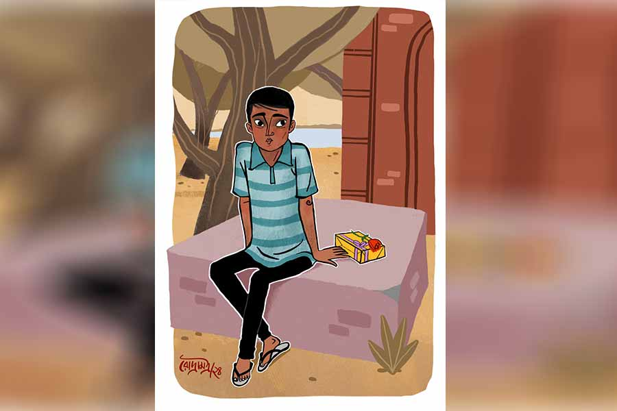

 
 <h1 align=center>ভ্যালেন্টাইন’স গিফ্ট</h1>
<h2 align=center>সুজিত বসাক</h2> রতু উনিশ বছরের গাঁট্টাগোঁট্টা যুবক। হায়ার সেকেন্ডারি পাশ করার পর আর পড়া হয়নি। কারণটা অতি পরিচিত— সাংসারিক দারিদ্র। ছাত্র হিসাবে মেধাবী। কিন্তু লেখাপড়ার খরচ কে জোগাবে? বাড়িতে বিধবা মা, ছোট ছোট দুই ভাই-বোন। বাবা ছিলেন ভূমিহীন কৃষক। তবুও মনের জোরে ছেলের পড়াশোনা চালিয়ে যাচ্ছিলেন লড়াই করে। গোপনে ধারদেনাও করেছিলেন প্রচুর। সব হিসাব গোলমাল হয়ে গেল তাঁর অকালমৃত্যুতে। বাবার ঋণের বোঝা এসে পড়ল ওদের উপর। বাড়ির বড় ছেলে, কাজ না ধরে উপায় ছিল না। শশধর পণ্ডিতের তেলের মিলে ঢুকে পড়েছিল অ্যাসিস্ট্যান্ট ম্যানেজার হিসেবে। হায়ার সেকেন্ডারি পাশ বলে এই সম্মানের পোস্ট। মাইনে পাঁচ হাজার। পড়াশোনা লাটে উঠল।

সেই রতু এখন প্রেমে পড়েছে। জীবনে প্রথম বলেই বোধহয় একেবারে ভাসাভাসি প্রেম। ওর মনের আকাশে এখন একটাই মুখ, চিন্তার মূল কেন্দ্রে একটিই নারী। পৃথিবীতে যেন আর কেউ নেই, কিছু নেই। রতুর শুধু একটা কথাই মনে হয়, লতুকে ছাড়া সে বাঁচবে না, লতুকে ছাড়া জীবন বৃথা। কিন্তু একতরফা প্রেমটাকে কী করে দু’তরফা করা যায়, সেটাই সে এখনও ভেবে উঠতে পারেনি। লতু কি মানবে তার প্রেম প্রস্তাব? নাইন্টি নাইন পার্সেন্ট নেগেটিভ চান্স। নিজের মনকে দোষ দিতেও ছাড়ছে না রতু, ‘শেষ পর্যন্ত ওই শশধর পণ্ডিতের মেয়েটাকেই তোর মনে ধরল? লতু মানলেও ওর বাপ মানবে না। শালা মনিব বলে কথা!’ কাজে সামান্য ভুল হলেই মেজাজ দেখায়, এ সব কথা জানলে কোন রূপ দেখাবে, তা আর বলার অপেক্ষা রাখে না।

রতু বুঝে যায়, তার প্রেমের কুঁড়ি কোনও দিনই ফুল হয়ে ফুটবে না। অকালেই ঝরে পড়ে যাবে। পৃথিবীটাকে খুব নির্মম জায়গা বলে মনে হতে থাকে রতুর। এখানে ভালবাসার কোনও মূল্য নেই। বেঁচে থাকার ইচ্ছেটাই ধীরে ধীরে কমে আসছে, বেশ বুঝতে পারে রতু। কিন্তু মা আর ভাইবোনের কথা ভেবে মরার কথাও ভাবতে পারে না। মাঝে মাঝে মন বেপরোয়া হয়ে বলে, ‘মরতেই যদি হয়, তবে এক বার চেষ্টা করে মর গাধা। কাপুরুষের মতো লটকে সটকে গেলে মা আর ভাই-বোন কাঁদবে, বাকি পৃথিবীর কিছুই আসবে-যাবে না।’ কিন্তু সাহসে কুলোয় না। লতু যদি ভুল বুঝে ওর বাপকে বলে দেয়? শশধর পণ্ডিতের পয়সার সঙ্গে সঙ্গে হাতটাও লম্বা। ভুলুদার মারকুটে বাহিনী ওর কথায় ওঠে বসে। মালটা এক বার ইশারা করলে ভুলুবাহিনীর হস্তক্ষেপে রতুর সঙ্গে তোবড়ানো টিনের কোনও তফাত থাকবে না।

আগে সিনেমা-টিনেমা বিশেষ দেখত না রতু। এখন দেখে। রোম্যান্টিক সিনেমাগুলো দেখে মোহিত হয়ে যায়। রতুর আর এক মুশকিল হল, সে রকম কোনও চালাক-চতুর বন্ধু নেই। রতু সিনেমায় দেখেছে, এমন পরিস্থিতিতে বন্ধুরা বিশেষ ভূমিকা পালন করে। নানা ভাবে সাহায্য করে। কখনও বুদ্ধি দিয়ে, কখনও টাকা দিয়ে, আবার কখনও আরও অনেক কিছু দিয়ে। সে কপাল কি রতুর আছে!

এক বার কথাটা কায়দা করে কাছের বন্ধু টোকনের কাছে পেড়েছিল রতু, “ধর, তুই একটা মেয়ের প্রেমে পড়লি, যাকে বলে একেবারে হুলোট প্রেম, তখন তুই কী করবি?”

টোকন নির্বিকার উত্তর দিয়েছিল, “বিয়ে করে নেব।”

“কিন্তু ধর মেয়ের বাপ তোর সঙ্গে বিয়ে দিল না, তখন কী করবি?”

“আর প্রেম করব না। প্রেম করা ছেড়ে দেব।” টোকনের সহজ উত্তর।

আর টোকনকে ঘাঁটায়নি রতু। মনে মনে বলেছিল, ‘ওরে পাগলা, এ প্রেম সে প্রেম নয় রে! এ প্রেম বোঝার সাধ্য তোর নেই!’

এক সময় রতু ধরেই নিল, তার প্রেম আর এই পৃথিবীর আলো দেখতে পাবে না। যে মনে উঠেছে, সেই মনের মধ্যেই মরবে। এই রকম যখন পরিস্থিতি, ঠিক তখনই রতুর গল্পে প্রথম টুইস্ট এল। অভাবিত, অকল্পনীয় ভাবে।

লতুর প্রেমে পড়ার পর থেকে রতুর মন ভাল থাকে না। অসহায় প্রেম রতুকে ভিতরে ভিতরে ফোঁপরা করে দিয়েছে। আনন্দ-উচ্ছ্বাস কেড়ে নিয়েছে। কাজকর্ম সবই যন্ত্রের মতো করে যায়, কোনও কিছুতেই মন বসে না। ব্যাপারটা কিছু দিন ধরেই লক্ষ করেছিল সতুদা। লতুর দাদা, শশধর পণ্ডিতের ছেলে। দিলখোলা ছেলে, হইচই করে জীবন কাটাতে ভালবাসে। বাপের মতো উদ্ভট আর হাড়কেপ্পন নয়।

পিঠে আচমকা একটা থাবড়া মেরে সতুদা এক দিন বলল, “বাপধনের মুখচোখ দেখে তো লক্ষণ সুবিধের ঠেকছে না, তা কার প্রেমে পড়েছ নটবর?”

রতু প্রমাদ গুনল, “না না, আমি কেন প্রেমে পড়তে যাব? ও সব কি আমাদের মানায়!”

সতুদা নাছোড়বান্দা, “তোমার অভিমানী কথাবার্তায় কিন্তু অন্য কিছুর ইঙ্গিত গুরু। বেশ কয়েক দিন তোমার ভাবচক্কর ফলো করছি বস। কিছু কেলো তো অবশ্যই আছে। আমাদের শরীরের যেখানেই আঘাত লাগুক, ফুটে ওঠে এই থোবড়াতেই। তোমার বিগড়ানো থোবড়ায় ব্যথা-বেদনা জ্বলজ্বল করছে বস!”

রতু রীতিমতো ঘামতে শুরু করেছে। সতুদা কি মনের কথা পড়তে পারে? মনে জোর আনার চেষ্টা করল রতু। সতুদা যতই চাপাচাপি করুক, লতুর নাম কিছুতেই বলবে না। রতু জানে, এ ব্যাপারে বাপ-বেটা একই ভূমিকা পালন করবে। নিজের বোনের নাম শুনলেই এই চেহারা নিমেষে পাল্টে যাবে।

রতু গম্ভীর মুখে বলল, “ও সব ছাড়ো তো সতুদা। আমার ভাল লাগছে না। অনেক কাজ বাকি আছে। ঠিক সময়ে না হলে কাকু আবার বকাবকি করবে।”

সতুদা হেসে বলল, “শশা পণ্ডিতের সব কথা মেনে চললে তোর লাইফ হেল হয়ে যাবে। ছোট থেকে দেখছি তো, মিনিমাম রোম্যান্টিক ব্যাপার নেই। নিজের বাপ বলে বলছি না, লোকটা টাকাপয়সা ছাড়া আর কিছুই বোঝে না। ওর কথা মতো চললে জীবন আলুনি আলুভাতে। আমাকে শুধু হ্যাঁ কি না বল, বাকি বন্দোবস্ত আমি করে দেব। প্রেম হচ্ছে উপরওয়ালার একটা সিগন্যাল বুঝলি, অবজ্ঞা করতে নেই। হাই ভোল্টেজ টাওয়ার ছাড়া ও জিনিস কব্জা করা মুশকিল।”

ধীরে ধীরে কাবু হয়ে যাচ্ছে রতু। সতুদা যেমনটা বলছে, ঠিক তেমনটাই তো রতুর প্রেম। কিন্তু এই সতুদাই লতুর নাম শোনার পর কি আর এই সতুদা থাকবে? এক্ষুনি হয়তো লাঠি নিয়ে তেড়ে আসবে। বাবা পণ্ডিতের কানে কথা ওঠার আগে ছেলে পণ্ডিতই যদি বিষ ঝেড়ে দেয়!

অস্থির হয় সতু, “কী অত ভাবছিস বল তো? তোর প্রেমিকা নিয়ে আমার কোনও মাথাব্যথা নেই। তার নাম আমি শুনতেও চাই না। ও সব নয় গোপনই থাক। কিন্তু তুই ব্যাটা লজ্জাবতী লতা, তাকে প্রোপোজ়-টোপোজ় কিছু করেছিস?”

এমন নাছোড়বান্দাও মানুষ হয়! কত আর ঠেকিয়ে রাখা যায়? নাম জানতে চাইছে না জেনে এখন কিছুটা স্বস্তি পেলেও এই স্বস্তি তো ক্ষণস্থায়ী, এক দিন তো ঠিক জেনে যাবে। তখন? তবুও একটু সাহস সঞ্চয় করে বলল, “না। করার সাহস হয়নি।”

দীর্ঘশ্বাস ফেলে সতু, “সে আর আশ্চর্য কী! যে সত্যিটা স্বীকার করতেই এত সময় লাগায়, সে করবে প্রোপোজ়? যাকগে, প্রোপোজ় কেমন করে করতে হয় জানিস?”

“সিনেমায় দেখেছি। হাঁটু গেড়ে বসে, ডাঁটিসমেত একটা গোলাপ দিয়ে বলতে হয়, ‘আই লাভ ইউ’।”

চোখমুখ উজ্জ্বল হয়ে ওঠে সতুর, বলে, “জিয়ো কাকা! ‘সিনেমা দেখার উপকার’ রচনা লিখতে দিলে, তোমার এই পয়েন্টটা এক নম্বরে থাকবে। কেউ আটকাতে পারবে না। কিন্তু এর সঙ্গে আরও একটা জিনিস দরকার। একটা গিফ্ট। তা হলে ক্ষীর তাড়াতাড়ি জমবে। যদিও এ সব ফর শো, আসল হচ্ছে মনের টান। তবুও যখন যেটা পাবলিক খায়!”

“গিফ্ট… কী গিফ্ট দিতে হবে?” রতু ধীরে ধীরে আউলে যাচ্ছে। সতুদা তাকে নিয়ে মজা করছে না তো?

সতু অভয় দেয়, “সে আমি ম্যানেজ করে দেব। তুমি শুধু মিটিং ডেটটা ফিক্সড করে ফেলো। আমি বলি কি, ক’দিন পরেই ভ্যালেন্টাইন’স ডে। ওই দিনই ফিক্সড করে ফেল, প্রোপোজ় করার পারফেক্ট দিন। আমি পরশু শহরে যাচ্ছি, ভাল দেখে একটা গিফ্ট নিয়ে আসব। ফিল্ডে নেমে পড়, আমি একটু বিভুকাকুর বাড়ি থেকে ঘুরে আসছি।”

বাইক নিয়ে ভটভট করতে করতে বেরিয়ে গেল সতুদা। ও চলে যাওয়ার পরেও অনেক ক্ষণ সে দিকে তাকিয়ে রইল রতু। মনে হল সতুদা কাল্পনিক একটি চরিত্র, যার বাস্তব কোনও অস্তিত্বই নেই। এই পৃথিবী, এই পৃথিবীর লোকজনকে তো রতু এক রকম নির্দয়-নির্মম বলে দেগেই দিয়েছিল। তবে কি এ রকম মানুষ এখনও দু’একটা আছে?

তবে খুশি হলেও রতু খুব বেশি খুশি হতে পারল না। লতুকে বলার সাহস কি ওর আছে? রতু বুঝতে পারছে এটাই শেষ সুযোগ। সতুদার সঙ্গে একটা দৈবযোগ অবশ্যই আছে। নইলে এমন হয়! এক দিকে ভয়, অন্য দিকে সতুদার সাপোর্ট, মনের মধ্যে আঠারো দিনের একটা মহাভারত যুদ্ধ কমপ্লিট করে রতু তেড়েফুঁড়ে উঠে দাঁড়াল। পরে কী হয় পরে দেখা যাবে, আপাতত লতুর সঙ্গে দেখা করে ওদের সাক্ষাতের কথাটা পাকা করেই ছাড়বে।

লতু যাচ্ছিল নীপাদের বাড়ি। রতু ডেকে বলল, “একটা কথা ছিল। এক মিনিট দাঁড়াবে?”

লতু দাঁড়িয়ে বলল, “কী কথা? আমার তাড়া আছে…”

রতু বলল, “না না, বেশি সময় নেব না। এক মিনিট। বুধবার বিকেলবেলা নদীর পাড়ে কালীমন্দিরের সামনে একটু আসবে? একটা জরুরি কথা বলার ছিল।”

“দেখি…” লতু চলে গেল নীপাদের বাড়ি।

রতু হতাশ হল। এ কেমন জবাব! তবুও সান্ত্বনা খুঁজে নিল, মুখের উপর না তো বলেনি।

ফেব্রুয়ারি মাসের চোদ্দো তারিখ। নদীর পাড়ে কালীমন্দিরের সামনে একটা বাঁধানো বেদিতে বসে আছে রতু। ডান পাশে একটা প্যাকেট আর তার উপর রাখা একটি গোলাপ। টকটকে লাল। রতু ধরেই নিয়েছে লতু আসবে না, বৃথাই এই আয়োজন! কত ক্ষণ চিন্তামগ্ন ছিল জানা নেই, হঠাৎ করে পিছনে তাকিয়ে দেখল পিছনে দাঁড়িয়ে লতু। মুখে হাসি। বলল, “কী বলবে বলো, আমার তাড়া আছে…”

রতু গম্ভীর মুখে বলল, “আমি একটা অন্যায় করে ফেলেছি, তার জন্য তোমার কাছে ক্ষমা চাইব। সে জন্যই ডাকা। তুমি এসেছ, তাই ধন্যবাদ।”

লতু অবাক হয়ে জিজ্ঞেস করল, “কিসের ক্ষমা?”

“আমি তোমাকে ভালবেসে ফেলেছি লতু। কিন্তু মুশকিল হল আমি গরিব, তোমরা বড়লোক। আমি চাকর, তোমরা মালিক। আমার সঙ্গে তোমার কোনও ভাবেই মেলে না। সমস্যা হল, সতুদা জানে না যে, আমি আসলে তোমাকেই ভালবাসি। ও জানে আমি কাউকে ভালবাসি, আর তাকে যাতে প্রোপোজ় করতে পারি, তার জন্য নিজে একটা গিফ্ট নিয়ে এসেছে শহর থেকে। একটা গোলাপও এনে তোমাকে দিতে বলেছে। ওর আনা গিফ্ট, আমার আনা গোলাপ... সব এখানে। ঝোঁকের মাথায় এ সব করলেও এখানে এসে আমার মনে হয়েছে, এটা ঠিক হচ্ছে না, সব জানিয়ে তোমার কাছে ক্ষমা চাওয়া উচিত। আমি গরিব, কিন্তু অসৎ নই। সতুদাকে প্লিজ় কিছু বোলো না।”

লতু গম্ভীর থাকার চেষ্টা করেও এক সময় খিলখিল করে হেসে উঠল, “দাদা তো আমাকে বলেছে, ‘লস্ট কেস লতু, ওর দ্বারা কিসসু হবে না। যা করার তোকেই করতে হবে।’ ঝটপট গোলাপটা দাও। গিফ্টের টাকা দাদাকে দিয়ে দিয়ো, অন্যের টাকায় গিফ্ট নিতে আমার মোটেও ভাল লাগবে না। আমি চললুম, আমার তাড়া আছে…”

হতবাক রতু ডাকবে না ডাকবে না করেও পিছু ডাকল, “ইয়ে... সব সময় এত তাড়া থাকে কেন তোমার...!”

লতু পিছু ফিরে বলে, “তাড়া না দিলে তুমি কি সারা জীবনেও কিছু করে উঠতে পারতে, হাঁদারাম! বাড়ি গিয়ে দাদাকে শেল্টার দিতে হবে। দাদা যে মেয়েটাকে ভালবাসে, তার বাড়িও কি শশা পণ্ডিতের স্টেটাসে ম্যাচ করে ভেবেছ! দাদা আমার ব্যবস্থা করেছে, আমি দাদার ব্যবস্থা করব। আর তোমার কী মনে হয়, দাদা নিজে থেকে এসেছিল তোমার কাছে! আমাকে দেখলে যে তোমার চোখের পলক পড়ত না, সে কথা দাদা জানল কী করে! কে দাদাকে গিয়ে বলেছিল, তোমাকে একটু সাহায্য করতে? আমার তাড়া না থাকলে তো তুমি তাকিয়ে তাকিয়েই আরও বিশ বছর বয়স বাড়িয়ে ফেলতে!”

রতু অবাক হয়ে বলে, “মানে... মানে... সতুদাকে কি তুমিই...”

লতু ঠোঁট টিপে হাসে, বলে, “থাক থাক! এক দিনে আর অত বুদ্ধি খাটাতে হবে না... পাগল একটা!”

বসন্তের অদ্ভুত এক হাওয়া রতুর চুল এলোমেলো করে দেয়।