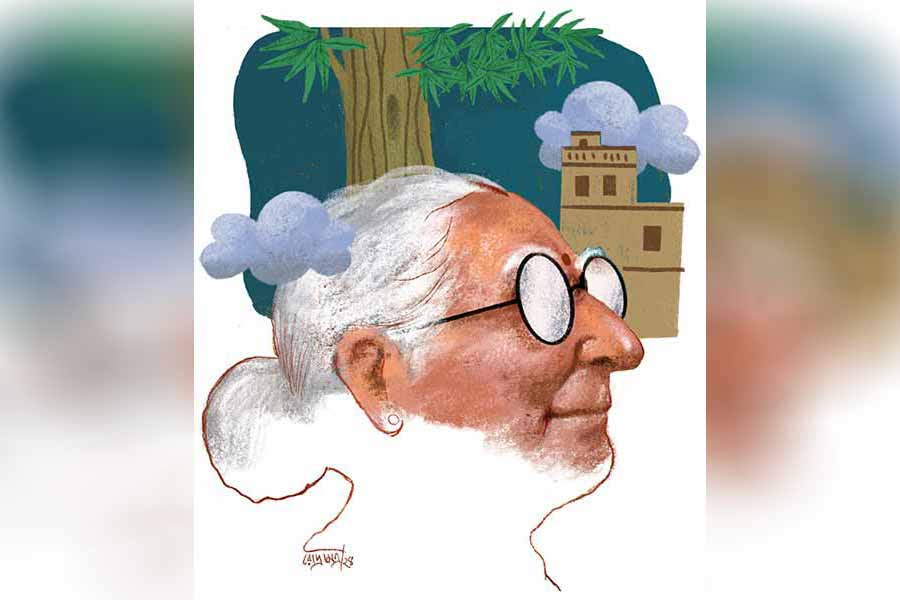

 
 <h1 align=center>মধুগুলগুলি</h1>
<h2 align=center>অভিনন্দন সরকার</h2> 

পেটো পঞ্চু সামান্য ভারী গলায় বলল, “কথাগুলো কি আমি খুব অন্যায় বললাম, মেসোমশাই?”

সুখময় ফতুয়ার পকেটে হাত ঢোকালেন। দরদর করে ঘাম হচ্ছে। একটা রুমাল পাওয়া গেলে ভাল হয়।

রুমাল পাওয়া গেল না। ফতুয়ার হাতা দিয়ে ঘাম মুছে সুখময় বললেন, “হ্যাঁ, মানে... ঠিকই তো...আসলে এ ভাবে তো ভেবে দেখা হয়নি...”

গত আধ ঘণ্টা ধরে পঞ্চু এই বৃদ্ধ দম্পতির সঙ্গে কথা বলছে। সুখময় নির্বিরোধী মানুষ, মাথা নিচু করে রাস্তা দিয়ে হাঁটেন। বন্দনা বরং বেশ ব্যক্তিত্বময়ী। তিনি কথা বলছেন পঞ্চুর চোখে চোখ রেখে। যে কথাগুলোর সঙ্গে তিনি একমত নন, খোলাখুলি সেটা জানিয়ে দিয়েছেন। সবচেয়ে বড় কথা, পঞ্চুর প্রচ্ছন্ন হুমকি তিনি গায়ে মাখেননি, এই তো একটু আগে কথা চলাকালীন কেমন উদাসীন ভাবে উঠে ভিতরের ঘরে সেঁধিয়ে গেলেন।

পেটো পঞ্চু আজ ভাল করে কাচা, ইস্ত্রি-করা, কলারওয়ালা জামা পরে ফিটফাট হয়ে এসেছে। এসেছে হুমকি দিতে। হুমকি দিতে ফিটফাট হয়ে আসতে হবে কেন? অবাক হয়ে পেটো পঞ্চু এই প্রশ্নটাই করেছিল তার বস রাজীব হালদারকে।

রাজীব হালদার ঘাগু প্রোমোটার। প্রশ্নটা শুনে তিনি পেটো পঞ্চুর দিকে কিছু ক্ষণ ঠান্ডা এবং স্থির চোখে তাকিয়ে রইলেন।

দেড় কাঠা জমির উপরে দাঁড়িয়ে থাকা সুখময় মল্লিকের বাড়িটা বেশ কিছু দিন হল তাঁর মাথাব্যথার কারণ হয়ে উঠেছে। জমি ছোট হলেও মাথাব্যথার কারণ বড়সড়।

বছর পাঁচেক আগে প্রায় কাঠা-পনেরো জমি কিনে ফেলে রেখে দিয়েছিলেন রাজীব হালদার। গত বছর সেখানে প্ল্যান বানাতে গিয়ে মাথায় বাজ পড়েছিল তাঁর। এমন চমৎকার জমি, কিন্তু সেই জমি আর বড় রাস্তার ঠিক মধ্যিখানে সুখময় মল্লিকের বাড়িটা দাঁড়িয়ে। সে দিনই ভেবে নিয়েছিলেন, ওই পুঁচকে জমিটা তাঁর চাই। না হলে এই প্রোজেক্টটাই হবে না, হলেও একটা ফ্ল্যাটও বিক্রি হবে না। ঢোকা-বেরোনোর চওড়া, ঝামেলাবিহীন রাস্তা না থাকলে সেই আবাসনের ফ্ল্যাট বিক্রি হয়?

প্রথম অবস্থায় প্রোমোটার রাজীব হালদার যথেষ্ট ভদ্র ভাবে আলোচনায় বসেছিলেন, কিন্তু ততোধিক ভদ্র ভাবে তাঁর এই প্রস্তাব প্রত্যাখ্যান করেছিলেন সুখময়-বন্দনা।

এর পর আঙুল সামান্য বাঁকালেন রাজীব হালদার। সুখময়ের বাড়ির চার পাশে, কখনও গ্রিল দেওয়া বারান্দায় বর্জ্য বস্তু, আবর্জনা ফেলা হতে লাগল, গেটের সামনে জমা হল স্টোন চিপস, বালির স্তূপ। এতে কাজের কাজ কিছু হল না। ছোটখাটো এমন ঘটনা পাত্তাই দিলেন না বৃদ্ধ দম্পতি। পেটো পঞ্চুকে ও বাড়িতে পাঠানোর সিদ্ধান্ত সে দিনই নিয়ে ফেলেছিলেন রাজীব হালদার।

এখন পঞ্চুর প্রশ্নের উত্তরে তিনি সামান্য বিরক্তির স্বরে বললেন, “ভদ্রলোকের বাড়ি থ্রেট দিতে যাচ্ছিস পঞ্চু। বুড়ো সেন্ট্রাল গরমেন্ট, বুড়ি স্কুলের হেডমিস্ট্রেস। এখন অবশ্য রিটায়ার্ড। থ্রেট দিবি এমন করে, যেন বোঝা না যায় থ্রেট দিচ্ছিস। অথচ মনের ভিতরে ভয়ের ভাবটা যেন তৈরি হয়, বুঝতে পেরেছিস?”

গোড়ার দিকে পঞ্চু ধরতে পারেনি। পরিচালক যে ভাবে কখনও নিজে অভিনয় করে পার্ট বুঝিয়ে দেন অভিনেতাকে, প্রায় তেমন করে রাজীব হালদার দেখিয়ে দিয়েছিলেন ঠিক কেমনটি তিনি চাইছেন।

এ পর্যন্ত উতরে গেছে পঞ্চু। হালকা চালে বাড়ি বিক্রির প্রসঙ্গ তুলেছে। শেষ বয়সে বাড়ি মেনটেন করা যে কত বড় ঝক্কির কাজ, ফ্ল্যাটে উঠলে এই বৃদ্ধ দম্পতি যে কতটা ঝাড়া হাত-পা থাকবেন, সেটা বুঝিয়েছে পঞ্চু। বাড়ি বিক্রির অতগুলো টাকা তো বলতে গেলে উপরি পাওনা। আর তা ছাড়া এটা তো একটা সামাজিক কর্তব্যও। শহরে এত লোক হন্যে হয়ে মাথা গোঁজার ঠাঁই খুঁজছে, আর দু’জন বুড়ো-বুড়ি একতলা বাড়ি আগলে চেপে বসে থাকবে— এ কেমন কথা?

কথোপকথন চলাকালীন এক বার তার পকেট থেকে প্রকাণ্ড একটা ছোরা পড়ে গেল মেঝেতে। ইচ্ছে করেই ফেলা। কিন্তু পঞ্চু লজ্জিত ভাব দেখিয়ে বলেছে, “ইস! দেখুন তো, কাজের জিনিস কী ভাবে আছাড় খেয়ে পড়ল। এটা এইখানে রাখা থাক, কেমন?”

অস্ত্রটা সেন্টার টেবিলে রেখে দিয়েছিল পঞ্চু। সুখময় বিপন্ন ভাবে তাকিয়েছিলেন স্ত্রীর দিকে, বন্দনার কঠিন দৃষ্টি ঘরের দেওয়ালে স্থির হয়ে ছিল। এর পর পরই ঘর ছেড়ে উঠে চলে গেছেন বন্দনা।

পেটো পঞ্চু বলল, “তা হলে ওই কথাই রইল মেসোমশাই। আমি রাজীববাবুকে বলে এক দিন মিটিং ফিক্স করছি। কেমন?”

ছোরা পকেটে ভরে উঠে দাঁড়াল পঞ্চু, আর তখনই ঘরে ফিরে এলেন বন্দনা। তাঁর হাতে ধরা কাচের গেলাস। গেলাসে শরবত। গেলাসের গায়ে জলবিন্দু। টেবিলে গেলাস রেখে বন্দনা পঞ্চুর দিকে তাকালেন, “নাও, শরবতটা খেয়ে নাও।”

পঞ্চু গেলাস তুলে চুমুক দিল। অপূর্ব স্বাদ! তার মুখ থেকে বেরিয়ে গেল, “এক ঘর শরবত মাসিমা! পুরো অন্য টেস্ট... কী আম?”

সোফায় বসে বন্দনা বেশ সহজ ভাবে বললেন, “আমাদের গাছের আম। তোমার মেসোমশাই জীবনে ওই একটাই গাছ লাগিয়েছিলেন। নামটা আনকমন। সম্ভবত মধুর মতো মিষ্টি বলেই এই নাম। আমাদের একমাত্র ছেলে জন্মানোর দিনে গাছটা লাগানো হয়েছিল। গাছটা আছে, কিন্তু ছেলে রইল না।”

বন্দনা যেন কিছুটা গুছিয়ে নিলেন নিজেকে, “সেই যে দু’শো সতেরো নম্বর বাস কেষ্টপুর খালে ডুবে গেল, আমার ছেলে সে দিন উদ্ধারকাজে নেমে গেছিল। তিন চার জনকে বাঁচালেও নিজে বাঁচতে পারেনি। বাজে রকম হেড ইনজুরি... তার পর থেকে ওই গাছটার মধ্যেই সন্তানকে দেখি আমরা। সন্ধেবেলায় গাছের দিকে তাকিয়ে পরিচিত মানুষদের মঙ্গলকামনা করি। কাল থেকে তোমার জন্যও করব।”

পঞ্চু শুনছিল, তবে আনমনে। শরবতের স্বাদ অদ্ভুত, কেমন একটা ঘোর মতো লেগে যাচ্ছে। শরবত শেষ করে বেরিয়ে যাওয়ার মুখে বন্দনা অচঞ্চল কণ্ঠে তাকে বললেন, “তোমার স্যরকে বোলো, বাড়ি আমরা বিক্রি করছি না পঞ্চু।”

ঘোলাটে চোখে পঞ্চু তাকাল বন্দনার দিকে। শরবতের মতোই হিমশীতল স্বরে বলল, “তাড়াহুড়ো করবেন না মাসিমা, ভেবেচিন্তে ডিসিশন নিন। তবে আবার দেখা হবে। সে আপনারা বাড়ি বেচলেও হবে, না বেচলেও।”

*****

পঞ্চুর সঙ্গে বন্দনার অবশ্য আর দেখা হল না। পঞ্চু চলে যাওয়ার পরে রাতের দিকে বুকে সামান্য ব্যথা শুরু হল বন্দনার। গ্যাস-অম্বলের একটা বড়ি খেয়ে তিনি শুয়ে রইলেন। ব্যথা কমল না, বরং ব্যথার প্রকোপে গভীর রাতে আচ্ছন্ন দশা হল তাঁর। হাসপাতালে নিয়ে যাওয়ার পথেই তিনি পৃথিবীর মায়া কাটালেন।

হন্তদন্ত হয়ে সে দিনই রাজীব হালদারের অফিসে ঢুকল পেটো পঞ্চু। খবর শুনে রাজীব হালদার বললেন, “করেছিস কী রে পঞ্চু? এমন থ্রেট দিলি যে, বুড়ি একেবারে পগার পার, দুনিয়ার বার! অ্যাঁ! পেটো বানানোর কাজ ছাড়িয়ে তোকে নিজের ম্যানেজার কি আর এমনি করেছি রে!” এই কথা বলে তিনি খুব একচোট হেসে নিলেন। যেন মানুষের মৃত্যু এক দারুণ কৌতুকের বিষয়।

পঞ্চু হাসতে পারল না। তার মনটা খচখচ করছে। সে বলল, “তেমন কিছু কিন্তু বলিনি রাজীবদা, কী যে হয়ে গেল!”

“শোন, নিজের উপরে ঘেন্না আসতে দিবি না পঞ্চু। জানবি গোটা দুনিয়াটা হারামিতে ভর্তি। বড় হারামি, মেজো হারামি, ছোট হারামি... আমরা হলাম সেই ছোট হারামি। ছোটও নয়, চুনোপুঁটি হারামি। বড়, মেজো-তে মিলে দেশ বিক্রি করে দিচ্ছে, ব্যাঙ্কগুলোকে দেউলিয়া করে বিলেতে পালাচ্ছে, গরিব মানুষের পয়সা ঝেঁপে দিচ্ছে, আমরা তো সেখানে শুধু পেটের দায়ে ব্যবসা করছি, দু’-একটা লোকের হয়তো ক্ষতি-টতি হচ্ছে, সে আর কী করা যাবে...”

পঞ্চু মুগ্ধ হয়ে শুনল। তার বসের কথাবার্তার লেভেলই আলাদা। সে বলল, “তা হলে এক দিন চলুন, বুড়ো ঘুঘুটার সঙ্গে দরদাম সেরে নিন।”

“যাব। তুই আপাতত এক বার থানায় গিয়ে ওসি-র সঙ্গে দেখা কর। খোকা কাল রাতে মাল টেনে বাইক নিয়ে ফিরছিল। একটা বাচ্চাকে চাপা দিয়েছে, হেভি বাওয়াল চলছে। বাচ্চার বাবা নাকি বলেছে, খোকাকে যেখানে পাবে সেখানেই ঠুকে দেবে।”

খোকা রাজীব হালদারের একমাত্র ছেলে। পঞ্চু উদ্বেগের সুরে বলল, “সে কী কথা! খোকা নিজে ঠিক আছে তো?”

“হ্যাঁ, তার আর কী হবে? দিব্যি আছে। কার রক্ত গায়ে বইছে দেখতে হবে তো! শুয়োরটা এ সব ছোটখাটো ব্যাপারে কাত হয় নাকি?”

পঞ্চু হেসে ঘাড় নাড়ল, তার পর বেরিয়ে গেল বাইক নিয়ে। রাজীববাবুর ছেলেটাও হয়েছে তেমন। বছর কুড়ি বয়স, অথচ রোজ একটা না একটা ঝক্কি লেগেই আছে। সব সামলাতেও হয় পঞ্চুকেই। এই রেড লাইট এরিয়া থেকে মাতাল অবস্থায় তুলে নিয়ে এল, এই চরস নিয়ে ধরা পড়ল খোকা, নারকোটিক্সওয়ালাদের খপ্পর থেকে বাঁচাতে রাজীববাবুর গলদঘর্ম দশা। এক বার তো নিজের বন্ধুর পাড়ার একটা বৌকে নিয়ে বাবু গায়েব... কম কাঠখড় পুড়িয়ে তবে সে বার খোকাকে ঘরে ফেরাতে হয়েছে পঞ্চুকে!

রাজীববাবু অবশ্য আমল দেন না। তিনি বলেন, “নিজে ছেলেবেলায় পেট ভরে খেতে পর্যন্ত পেতাম না বুঝলি পঞ্চু, আর আজ কলকাতা শহরে আমার এগারোটা প্রপার্টি। আমার ছেলেকে আমি সেই সব কিছু দেব, যা আমি পাইনি। আর তা ছাড়া লাইফ এনজয় করার এই তো বয়স।”

বাইক চালাতে চালাতে পঞ্চু হাসল। রাজীববাবু রাজা লোক। তাঁর কথা ভাবলেও মন হালকা হয়ে যায়।

*****

সকালে বাড়ি থেকে বেরোচ্ছিলেন সুখময়। পঞ্চু তাঁর পাশে এসে বাইক নিয়ে দাঁড়াল, “খবরটা শুনে এত খারাপ লাগল মেসোমশাই, যে কী বলব! মানুষের লাইফের কোনও গ্যারান্টি নেই। জলজ্যান্ত মানুষটা আমার সঙ্গে হেসে হেসে কত গল্প করলেন, আর চব্বিশ ঘণ্টার মধ্যে তিনি জাস্ট ছবি হয়ে গেলেন!” আফসোসসূচক শব্দ করল পঞ্চু।

এড়িয়ে যাওয়ার ভঙ্গিতে সুখময় বললেন, “আমি আসলে একটু দরকারে বেরোচ্ছিলাম...”

“হ্যাঁ, হ্যাঁ, আমিও চলি। আচ্ছা, এখন তো মাসিমাও রইলেন না। একা মানুষ, এত বড় বাড়ি করবেনটা কী? রাজীববাবুকে তা হলে বলি এ বার এক দিন আসতে?”

সুখময় থেমে থেমে বললেন, “আগে ছিল শুধু ছেলের স্মৃতি, আর এখন তো তার মায়ের স্মৃতিও এই বাড়ির গায়ে জড়িয়ে আছে। ইট কাঠ ফার্নিচার জমিজমা না-হয় বিক্রি করা যায়, স্মৃতি কি আর বিক্রি হয়! চলি।”

পেটো পঞ্চু মোলায়েম ভাবে হাসল, “বেশ! বেশ!”

পরদিন ভোরবেলার দিকে পাড়া কাঁপিয়ে তিনটে পেটো ফাটল সুখময়ের বারান্দার সামনে। এলাকার লোকেরা পুলিশ ডাকল। বোঝাই যাচ্ছে সুখময়ের বাড়িই টার্গেট।

এস আই সুখময়কে জিজ্ঞেস করলেন, “এই ব্যাপারে কাউকে সন্দেহ হয় আপনার?”

নতমস্তকে সুখময় বললেন, “না, কাউকে নয়।”

জাবদা খাতা বন্ধ করে দীর্ঘশ্বাস ফেললেন শান্তিরক্ষক, “দিনকাল খুব খারাপ, বুঝলেন?”

পরদিনই হন্তদন্ত হয়ে ছুটে এল পঞ্চু, তার কণ্ঠে অকৃত্রিম উদ্বেগ, “এ সব কী শুনছি মেসোমশাই? তবু ভাল, আপনি কাছাকাছি ছিলেন না। থাকলে তো মুখচোখ পুরো বিলা হয়ে যেত।”

বারান্দার দেওয়ালে পোড়া, কালো ছোপ পড়েছে, তাতে বুড়ো আঙুল ঘষতে ঘষতে পঞ্চু বলল, “আজ বারান্দায় ফেলেছে, কাল ঘরে পেটো ফেলবে। এদের যে কী সাহস, আপনি ভাবতে পারবেন না মেসোমশাই।”

কুঁজো হয়ে বসে ছিলেন খর্বকায় সুখময়। শীর্ণ ঘাড় ঝুলে রয়েছে বুকের কাছে। তিনি অসহায় ভাবে, ক্ষীণস্বরে পঞ্চুকে বললেন, “তোমাদের প্রোমোটারকে একবার আসতে বোলো তো। বাড়িটা ভাবছি...”

*****

গাছ কাটা আজকাল খুবই সহজ। ইলেকট্রিক করাত প্রায় মাটির কাছাকাছি আমগাছের গুঁড়িটা এ পার-ও পার কেটে ফেলল। প্রবল শব্দে মাটিতে পড়ল প্রকাণ্ড মহীরুহ।

তখনও সেই গাছ ভরে আছে ফলে। সেই ফলগুলো ছিটকে গেল এ দিক-ও দিক। পাড়ার লোক, লেবার, মিস্ত্রি আর এলাকার বাচ্চারা হুটোপুটি করে যে যত পারল আম নিয়ে গেল। খণ্ডে খণ্ডে কাটা হল গুঁড়ি, ডালপালা সমেত লরিতে চেপে কোথায় যেন উধাও হয়ে গেল আস্ত গাছটা। অল্প সময়ের মধ্যেই সুখময়-বন্দনার আমগাছের আর চিহ্নমাত্র রইল না।

পঞ্চু বারকয়েক বলেছিল, “এ ভাবে গাছটা কাটা কি ঠিক হল?”

“মেন এন্ট্রান্সের সামনে ও রকম একটা আখাম্বা গাছ রেখে দেব? আমি কি পাগল না পাজামা!” অবাক হয়েছিলেন রাজীব হালদার।

“ওই ভদ্রমহিলা বলেছিলেন সন্ধেবেলায় গাছের দিকে চেয়ে উনি মানুষের মঙ্গলকামনা করেন। সবার সন্তান যাতে বেঁচেবর্তে থাকে, ভাল থাকে...” আনমনে বলে পঞ্চু।

রাজীব হালদার খোসা ছাড়িয়ে কামড় বসালেন পাকা আমের গায়ে। অসামান্য স্বাদের আবেশে চোখ বুজে এল তাঁর, “সত্যিই তো! সেই মঙ্গলকামনার জোরেই না তুই-আমি করে খাচ্ছি।”

বাইক স্টার্ট দিয়ে এক বার পিছন ফিরে তাকাল পঞ্চু। ধু-ধু করছে সুখময়ের বাড়ির একটা অংশ। কে বলবে, একটু আগেই সেখানে বিশাল এক আমগাছ তার শাখাপ্রশাখার বিপুল বিস্তার নিয়ে দাঁড়িয়ে ছিল। অকাতরে বিলিয়েছিল বাতাস, ছায়া, রসালো ফল, মানুষের মঙ্গল... মাথাটা হঠাৎই ঝিমঝিম করে উঠল পঞ্চুর।

পাঠানপুরের প্রোজেক্টে যাওয়ার পথে বার বার সুখময়ের বাড়ি, তার আমগাছ আর বন্দনার বলা কথাগুলো মনে আসতে লাগল পঞ্চুর। কল্যাণী এক্সপ্রেসওয়ে থেকে ইউ টার্ন নিল পঞ্চু, আর তখনই শেষ বিকেলের আলোয় সে দেখতে পেল রাস্তার অপর প্রান্তের গাছটাকে। তার ছায়াশরীর অজস্র আমে ছেয়ে আছে, এত আম যে পাতাই দেখা যাচ্ছে না। আশ্চর্য! এত দিন এই পথে চলাচল অথচ এমন গাছ তার চোখেই পড়েনি!

পঞ্চু ঘাড় ঘুরিয়ে ঘোরগ্রস্ত ভাবে গাছটাকে দেখতে লাগল।

কিন্তু এটা করা তার উচিত হয়নি। রাস্তাঘাটে এ ভাবে কেউ গাড়ি চালায়! উল্টো দিক থেকে আসা ট্রাকটার হর্ন সে শুনতেও পেল না। যখন বুঝল, তখন তীব্রগতিতে ছুটে আসা সেই ট্রাক তার বাইকের খুব কাছাকাছি এসে পড়েছে... খুব বেশি কাছাকাছি...

*****

ঠিক সেই সময় নিজের বাড়িতে ঢুকলেন রাজীব হালদার। বাড়ি আজ অদ্ভুত নিস্তব্ধ। যে কারণেই হোক বুকের ভিতরটা খালি হয়ে এল তাঁর। সব কিছু ঠিক আছে তো? খোকার কিছু হল নাকি!

অস্বাভাবিক বুক ধড়ফড় নিয়ে রাজীব হালদার সিঁড়ি বেয়ে দোতলায় এলেন। খোকার ঘরের দরজা বন্ধ। কাঁপা কাঁপা হাতে দরজা ঠেললেন রাজীব হালদার।

দমকা হাওয়ায় ভিতর থেকে ভিজে আর শুকনো নেশার মিলিত গন্ধের ঝাপটা ধাক্কা মারল তাঁকে। সঙ্গে কান ফাটানো মিউজ়িক। বেশি ক্ষণ শুনলে বুক ধড়ফড় করে।

জনাসাতেক ছেলেমেয়ে ঘিরে আছে খোকাকে। দেখে বোঝা যাচ্ছে এক তুরীয় অবস্থায় আছে তারা। এই মেয়েদের দু’-এক জন হয়তো আজ রাতে খোকার কাছে থেকে যেতেও পারে। বাজার-চলতি একটা গানের তালে তালে কোমর দোলাচ্ছে খোকা। তার ঠোঁটে ঝুলছে জয়েন্ট, মাথার উপরে ব্যালান্স করে বসানো হুইস্কির গ্লাস। ঢুলুঢুলু চোখে স্বর্গীয় সুখ।

নিঃশব্দে দরজা টেনে দিয়ে সরে এলেন রাজীব হালদার।

তিনি নিশ্চিন্ত বোধ করছেন। খোকার খারাপ কিছু হয়নি। অকারণ অনিষ্ট-চিন্তার কারণটা জলের মতো পরিষ্কার হয়ে গেল তাঁর কাছে। হাঁদা পঞ্চুটার কথাগুলো এতটা প্রভাব ফেলবে তাঁর মনে, এ তিনি ভাবতেও পারেননি। আমগাছ করবে মানুষের মঙ্গল... ফুঃ!

তার পরও রাজীব হালদার বুঝলেন, তাঁর মনটা অসম্ভব রকমের খারাপ হয়ে যাচ্ছে। হাতের চেটো দিয়ে চোখ মুছলেন তিনি। চোখ মুছতে মুছতে সামান্য অবাক হলেন। তিনি যা চেয়েছেন তা-ই পেয়েছেন, সব কিছু হচ্ছে তাঁর মনের মতো, চার পাশ অভাবনীয় সাফল্যের আলোয় ঝলমল করছে।

তবু কেন যে চোখে জল এসে যাচ্ছে বার বার!

