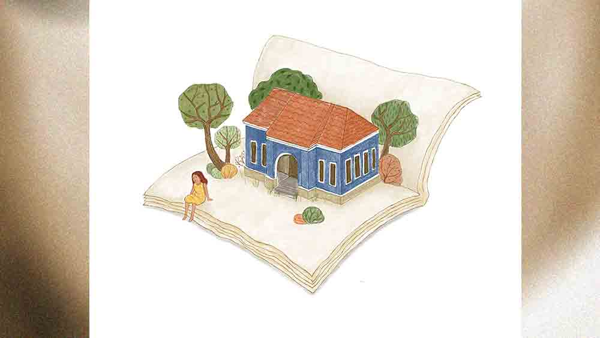

 

<h1 align=center>মধুমাঝির নৌকো</h1>
<h2 align=center>শ্রীকান্ত অধিকারী</h2>
টুনি আজ সকাল থেকেই ঘরের সব আনাচ-কানাচ হাতড়াচ্ছে। এ-কোণ সে-কোণ। কখনও কখনও ওর মা ঘরের ওপরকোণে খড়ের চালে হাতের কাছে যা পায় গুঁজে দেয়। বাজার থেকে আনা চিলমিলি, কাগজের প্যাকেট কিংবা পুরনো কানিচুনি। সেই কোণগুলোও ইদুরখোঁজা মেনির মতো আঁজুরেপাঁজুরে দেখে। কিন্তু কোথাও পায় না। বাইরে বারান্দার দেওয়ালে জলুইয়ে ঝোলানো পুরনো ঝোলার ভেতর খোঁজে, সেখানেও চিহ্নটুকু নেই। বাঁশবাতার ওপর কাদামাটি লেপে ওর বাবা একটা মাচা করেছে ক্যাঁথা-বালিশগুলো গুছিয়ে তুলে রাখার জন্য। সেখানেও আঁতিপাতি করে দেখে, কিন্তু সেই দরকারি জিনিসটা খুঁজে পায় না। অথচ কবিতাটা কিছুতেই মনে পড়ছে না। মনে মনে আবার চেষ্টা করে কবিতাটা মনে করার।   “তখন থেকে হ্যাঁচড়প্যাঁচড় করে কী খুঁজছিস বল তো?”   টুনির মা উঠোনের এক পাশে গোবর শানছিল। ক’দিন ধরে দেয়াল উদোম। ঘুঁটে লাগানো হয়নি। কাল পরশু অঝোর বৃষ্টিতে ডাঁই হয়ে থাকা গোবরের গাদ অর্ধেক গলে গেছে। বিয়েনবেলায় ওই গোবরের ব্যবস্থা না করলে আর সারা দিন অবসর পাবে না। ঘরের লোকটাকে এক বোকনো ভিজেভাত-আলুচচ্চড়ি, গোটা দুই টসটসে কাঁচালঙ্কা আর পিঁয়াজ দিয়ে গামছায় বেঁধে বাবুদের বাড়ি কাজের খোঁজে পাঠিয়েই গোবর শানতে বসে গেছে। যদিও টুনির বাবা যাওয়ার সময় বলে গেছে টুনিকে খানিক চোখে চোখে রাখিস, তবু টুনিকে তেমন দেখতে হয় না। ও এমনিতে ভীষণ চটপটে। নিজেরটা নিজে ঠিক করতে পারে। কিন্তু আজকের হরকত অন্য সব দিনের চেয়ে আলাদা। টুনির মায়ের মন বলছে, ‘কুছু তো বটে। না হলে অমন ছটফট করবে না।’   টুনির মা আবার হুলোয়, “কী খুঁজছিস বলবি তো?”   “ব-ই...” ঘরের ভেতর থেকে সরু গলায় উত্তর আসে।   আকাশ থেকে সাপের পুঁটুলি পড়লে মানুষ যেমন চমকায়, ঠিক সেই রকম চমকে টুনির মা বলে, “বই! এখুন আবার বই লিয়ে কী করবি? ইস্কুল নাই পড়া নাই। বইগুলান ধুঁইয়ে ধুঁইয়ে প্যাট ভরাবি, লয়!”   “ও তু বুঝতে লারবি। পাতাবাহারট খুব দরকার বটে...” টুনি পড়ে মহাফাঁপরে। বইগুলো যে কোথায় রেখেছিল! স্কুলের ব্যাগটাও খুঁজে পায় না।   “এখুন ফালতু কাজে টাইম লষ্ট করিস না। তাচ্চেয়ে হোই আঁজিরতলাতে বুটকলাই আর গুমকটান মিলে দেগা দিখিনি। অ্যানেক দিন রোদ খায় নাইকো, পুঁকাটুকা লেইগ্যে গেলে প্যাটে 
দিবি কী!”   টুনিদের ঘর মাটির। পেছনে বড়বাবাদের টিনের চাল আর ইটের দেয়াল হলেও এখনও ওদেরটা ইটের হয় নাই। তবে হবে বলেছে। পঞ্চায়েত-মেম্বার পাগুকাকা কথা দিয়েছে, “ভুট পেরিন গেলেই তুদেরট বানিন দুবো।” ঘরের মেঝে স্যাঁত সেঁতে জবজব করছে। মাটির হোলনাতে গম আর ছোলা ক’টা থাকলেও গুমো গুমো ঘ্যান ধরে যাবে। রোদে দিতেই হবে। টুনি আর কোনও উত্তর না করে পেয়ারাতলায় গিয়ে চটের ওপর ওই চাট্টি গম আর ছোলা রোদে মেলে দেয়। মেঘখেকো রোদে টুনির কালো মুখটা চকচক করে ওঠে। হাত দিয়ে বেশ ফাঁক ফাঁক করে ছড়াতে ছড়াতে কবিতাটা মনে করার চেষ্টা করে। দু’-একটা লাইন মনে এলেও কবিতার মুখটা কিছুতেই মনে পড়ে না। কী যেন ছিল! নৌকা...মাঝি... সে ভাবে, “অ্যাকবার পাতাবাহারট যদি পেতম!”   অবশ্য এত দিন মনে করার দরকারও ছিল না। সেই কবে স্কুল গেছে মনে পড়ে না। প্রথম প্রথম বাড়িতে তাও বইখাতা নিয়ে বসেছিল দু’-এক দিন। কিছু দিন যেতেই করোনার বাড়বাড়ন্তে পাকাপাকি ভাবে স্কুল বন্ধ। শুনেই আর পড়তে বসতে ইচ্ছে করে না। পড়তে না বসলে বাবা-মাও কিছু বলে না। শুয়ে-গড়িয়ে বেশ চলছিল। কিন্তু হঠাৎ কাল বিকেল থেকে ওর মন ছটফটিয়ে ওঠে। সেই ছবিটা। সাদা কালিতে সবুজ কাপড়ের ওপর আঁকা। দেখেই সে চিনতে পারে। তৎক্ষণাৎ কবিতাটার কথা মনে আসে, যেটা ওর কাছে বার বার ধনঞ্জয়স্যর শুনতে চাইত। কিন্তু মনে করতে গিয়ে খেয়াল হয় জিভ আটকে গিয়ে লাইনগুলো ছিঁড়ে ছিঁড়ে আসছে। বুঝতে পারে কবিতাটা ওকে ছেড়ে চলে গেছে। ভেতর ভেতর ছটফটিয়ে ওঠে টুনি।   চার দিন হল ভোট শেষ হয়েছে। কিন্তু এখনও কঞ্চিকাঠির ডগায় পতাকাগুলো এর-ওর দেয়ালে, গাছের ডালে, ইলেকট্রিক পোলে লাগানো ছিল। কেউ তোলার গরজ দেখায় নাই। টুনির অবশ্য ভালই লাগছিল। ওদের ঘরের সামনের রাস্তাটা বেশ সেজে আছে। ঘরে ঘরে পরব লেগেছে যেন। আসলে গোটা গাঁয়ের রাস্তার ধারে ধারে নানা রঙের পতাকাগুলো এমন ভাবে উড়ছিল, যেন গাছেরা সব মালা পরেছে। রাস্তায় রাস্তায় ফুল ফুটেছে। টুনির এক বার মনে হয়েছিল, বিয়ে লেগেছে গাঁয়ের। আবার সরস্বতীপুজোতেও ওদের স্কুলটা এমনি করে সেজে ওঠে। ফুল ফোটে। মালা পরে। কিন্তু কালকে বিকেলবেলা খুব জোরে ঝড় আসতেই রাস্তার ওপর কত আবজি-গাবজি কাগজকুচি, চিলমিলি, প্লাস্টিকের বোতল, খ্যাড়পাত, ময়লা ছড়িয়ে-ছিটিয়ে উড়ে আসে। ঝড় থেমে গেলে ঝিরঝিরে বৃষ্টির মধ্যেই টুনি পতাকাগুলো কুড়িয়ে আনে। মায়ের ঘর মোছা, ভাতের হাঁড়ি ধরার কাজে লাগবে। তখনই সে দেখতে পায় রবিঠাকুরের ছবিটা। রাস্তার ওপরে লাট খেয়ে পড়ে। ওদের স্কুলেও এই রকম একটা ছিল। বাঁধানো। গেল বারের আগের বার জন্মদিনে ধনঞ্জয়স্যর ওদের ফুল দুব্বোঘাস ঘষা চন্দন আনতে বলেছিল। তার পর কবিতা গান। স্যর বলেছিল আজকের দিনে ইস্কুলে তিনি আসেন।   “কেনে আসে স্যার?” ছোট্ট টুনির ছোট্ট একটা প্রশ্ন।   “বা রে! তোমরা কেমন পড়ালেখা করছ দেখতে হবে না!”   “তা’লে আমার মামারঘরের ইস্কুলেও আসবে?”   “হ্যাঁ, প্রত্যেকটা স্কুলেই তো 
তিনি আসেন।”   “তখুন আমরা সব পুজো দিই, লয় স্যার?”   “ঠিক তাই।”   সে একছুটে ওর মার কাছে আসে। জিজ্ঞেস করে, “আইজকে কী মাস চলছে রে?”   “মাথায় পুকা লড়ে উঠল, লয়! মাস লিয়ে কী করবি?”   “উঃ! বল না,” টুনির হাত-পাগুলো কেমন সুড়সুড় করে।   “আইজ তো রোদ খটখটে ছিল না, ম্যায়ানো ম্যায়ানো। আবার উদগুমোটি গরমও লাগছে।”   “ধুর! তু কিছুই জানিস না। দাঁড়া, বড়বাবাকে শুধিন আসি।”   বড়বাবার ঘর থেকে আসার পর ওর ছটফটানি আরও বেড়ে যায়। কালকেই রবিঠাকুরের জন্মদিন। স্কুলে আসবে। গেলবার জন্মদিন হয় নাই। স্কুল বন্ধ ছিল।   “হাঁ গো বড়বাবা, থাইলে ঠাকুরবাবা এসে ঘুরে গেইছে তো!”   “হঁ। তা হক কথা গেঁয়েছিস বটে!” বড়বাবা হেসে হেসে মাথা নাড়ে।   “এ বছরকেও লিশ্চয় আসবে?”   বড়বাবা মাথা নাড়ে, “লিশ্চয়।”   ধনঞ্জয় স্যর আজ ওকে ডাকতে ভুলে গেছে হয়তো। ‘তা ভুলুগগা,’ টুনির মাথায় একটা চালাকি খেলে, ‘আজকে কুনও ফাঁকে ইস্কুলে যেঁয়ে কবিতাট ভাল্ল করে বলে ধনঞ্জয় স্যারকে চমকে দুবো। কবিতাট কী যেন ছিল, পোথম লাইনট... উঁ উঁ...” চোখ ট্যারা করে ভুরু কুঁচকে মগজের ভেতর হাতড়ে বেড়ায়। মনে মনে প্রার্থনা করে, ‘হঁ গো ঠাকুর! মনে করিন দাও।’   “গ্যাল গ্যাল, সব খেঁয়ে লিলে রে! হতচ্ছাড়ি ট্যারাচোখি, চোখের মাথা খেঁয়েছে গো। অ্যাকবার ভেলে তো দ্যাখ! ঘুমিং গেলি নাকি টে? কৌওতে জি হাঁরস ব্যাতে খাবলা খাবলা ভরে নিন চলে যেল দেখতে পেলি না?” টুনির মা গোবর হাতে কাপড় তুলে এক ছুটে হুস হুস করতে করতে টুনির কাছে হাজির। টুনি খানিক থতমত খেয়ে তাকিয়ে দেখে সত্যি চটের বাইরে চার দিকে গম আর ছোলা ছড়িয়ে পড়ে আছে। তাড়াতাড়ি কুড়িয়ে জড়ো করতে গেলে ওর মা ওকে এক রকম  ঠেলে দিয়ে বলে, “যা যাঃ! সব করলি। চাট্টি জিনিসও আগুলতে লারিস। লেলি কুথাকার! লকডাউনে লুকের কাজকাম নাই, খেতে পায় না। উ এসছে লবাবি করতে। যা তুকে আগুলতে হবে না। যেঠিঁয়ে পারিস লুকের ঘরে বাসন মেজে প্যাটট ভরিন আয় গা...” টুনির মা গজগজ করে, “কত কষ্ট করে কন্টোলের বাবুকে বলে দুটো ভিখ মেগে প্যাট ভরানোর জোগাড় করি, আর উকে দ্যাখো একট কৌও-চটুইও তাড়তে লারে।”   মায়ের বকুনি খেয়ে টুনি ভয়ে চুপ করে দাঁড়িয়ে থাকে। আর ওর মা সাততাড়াতাড়ি একটা শিকুটি ভেঙে মাটিতে গুঁজে দেয়। সামনে পড়ে 
থাকা রবীন্দ্রনাথের ছবি আঁকা সেই কাপড়টা শিকুটির ডগায় এমন 
ভাবে ঝুলিয়ে বেঁধে দেয় যেন সত্যিকারের পুতুল।   “অ্যাই থুঁয়ে দিলম অ্যাকট ভয়ঙ্কর মানুষ। অ্যাইবার দেখি, তুরা কী করে এস্যে আমার প্যাটের খাবার 
খেয়ে লিস!”   টুনি হাঁ করে পাথরের মতো দাঁড়িয়ে থাকে। দেখে মায়ের অদ্ভুত কাণ্ড। হ্যাঁ, ঠিক একটা কাকতাড়ুয়া! রবিঠাকুর এখন কাকতাড়ুয়া! টুনি অবাক হয়ে দেখে ওদের ঠাকুর কেমন মায়া মায়া চোখে গোটাকতক গম-ছোলার দিকে চেয়ে আছে।   আর কিছুক্ষণ পর ধনঞ্জয়স্যর স্কুলে চলে আসবে। ওদের অনুষ্ঠানও শুরু হয়ে যাবে। কিন্তু কি মুশকিল, পুরো কবিতাটা কিছুতেই মনে করতে পারে না টুনি। শুধু মনে আসে—আমি কেবল যাব একটি বার/ সাত সমুদ্র তেরো নদীর পার।   টুনির মা ডাঁটিয়ে ওঠে, “ঠাটকবাজি করে দাঁড়িনে থাকা কেনে? যাও মোড়লপাড়ার দুয়োরগুলান তো মারিন এসো। বিয়েনবেলা থেকেই কি প্যাট পেড়ে পড়ে থাকবে। ইস্কুল ত নাই স্যাঁই দোফরে চাট্টি খেঁয়ে লিবে।”   আঁজিরগাছের ছায়া অনেক ছোট হয়ে গেছে। মাথার টিকিতে অল্প অল্প তাপ লাগছে। আর এক বার হাত দিয়ে গম আর ছোলাগুলো মেলে দেয় টুনি। এই ছোলাগুলো ওদের ইস্কুলে দিয়েছে। আবার দেবে এক দিন। তখন ওর বাবা যায়। ফিরে আসে থলে ভর্তি করে। বাবা এসে বলে, “তুর ধনঞ্জয়মাস্টার তুর কথা শুধোয়ছিল। বলছে কী করছে টুনটুনি। পড়াল্যাখা করে ত? হাঁ রে, তু পড়িস ত টুনটুনি?”   সরকারি স্কুলের তৃতীয় শ্রেণিতে এক সময় পড়া টুনি বাবার কথা শুনে ফিক করে হেসে দেয়।   একমাত্র ওদের স্কুলের ধনঞ্জয়স্যরই ওকে টুনটুনি বলে ডাকে। আসলে ভর্তির সময় ওর বাবা টুনটুনি বাগদি নামে ভর্তি করে। সেই থেকে ধনঞ্জয়স্যার ওকে টুনটুনি বলেই ডাকে। ওদের স্কুলে বুধবার-বুধবার ডিমভাত হয়। ছেলেপুলে কম থাকলে যদি ডিম বেঁচে যায়, তখন ওকেই আগে দুটো ডিম দেয় ধনঞ্জয়স্যর। বলে, “তুই খাবি, কাউকে দিবি না।”   কত দিন স্কুলে যায়নি! ধনঞ্জয় স্যরের মুখটা ভাল করে মনেই পড়ে না। ওই ছবিটার মতো কি!   এখন স্কুলের অনেক কিছুই মনে আসে না। স্কুলের বেঞ্চ, বেঞ্চে ঠেলাঠেলি করে বসা বন্ধুরা। ধনঞ্জয়স্যরের এ-ক্লাস ও-ক্লাস ঘুরে ঘুরে চিৎকার করে পড়ানো, মিড-ডে মিলের মাসিরা। তাদের চোখরাঙানি। স্কুলের প্রার্থনা। মাসে মাসে শেষ ক্লাসে সাহিত্য পাঠের অনুষ্ঠান। প্রতিটি অনুষ্ঠানে ওর কবিতা। আজও রবিঠাকুরকে শোনাতেই হবে— মিথ্যে ঘুরে বেড়াই নাকো হাটে।/ আমি কেবল যাই একটি বার/ সাত সমুদ্র তেরো নদীর পার।   টুনি আর নিজেকে আর ঘরে রাখতে পারে না। ছুটে বেরিয়ে যায় ঘর থেকে। রাস্তায়। হাঁটতে  হাঁটতে বড় রাস্তা পেরিয়ে রথবাড়ি। বড় কুয়োতলা। লোবোকাকার গুমটি। এখন বন্ধ। বড় কলতলা। আর তার পরই— ওই তো ওদের সমন্বয়পল্লী মোস্তাফির প্রাথমিক বিদ্যালয়।   বুক ঢিবঢিব করে টুনির। কত দিন পর আজ ওর স্কুলে। কিন্তু লোহার গেটের কাছে আসতেই ওর আনন্দে ভাঁটা পড়ে। কাউকে তো দেখতে পায় না। চুটকি, শ্যামলী, সাবির, সৌম্য, মালা, পলি, ঝুমা, রবিন, দিলু্‌, বুচ্চা কেউ নেই। আর ধনঞ্জয়স্যর! অনেক বড় গেটে ইয়াব্বড় তালা। ভেতরের মাঠে বড় বড় ঘাসে ভরে গেছে। যেখানে সিমেন্টের ধাবি আছে, তার চার দিকে আরও বড় বড় ঘাস গজিয়েছে। হয়েছে ঝোপ। ওদের ক্লাসের দরজায় দরজায় ছাগলের লাদি। পেচ্ছাবের কষটে দাগ। আর মাঝে মাঝে রংবেরঙের গোটা আধভাঙা নানা আকারের কাচের বোতল এ দিক-ও দিক পড়ে আছে।   তখন মরচে-ধরা গেট আঁকড়ে টুনির চিৎকার করে বলতে ইচ্ছে করছে, ‘ও স্যার! তুমি কুথায়! তুমার ইস্কুলে জি মুত্যে দিলে গো। ভাঙা বুতলে আমাদের পা কেইটে যাবে না? ধাপুস ধুপুস খেলব কী করে? তুমি এসে বকে দাও। কান মুলে দাও স্যার। প্যাটে চিমটিন দাও। দুয়োরট অ্যাকবার খুলে দাও স্যার। অ্যাকবার খুলে দাও... আইজ জি ঠাকুর আসবে! অ্যাই দ্যাখো আমি ঘর থেকে ধূপকাঠি-ফুল এনেছি। মালা গেঁথে পরাব। আর সেই কবিতাট, তুমি শিখিনছিলে–– ‘মধু মাঝির ওই যে নৌকোখানা/ বাঁধা আছে রাজগঞ্জের ঘাটে/ কারো কোনো কাজে লাগছে না তো,/ বোঝাই করা আছে কেবল পাটে।’ হঠাৎ টুনি লক্ষ করে গোটা কবিতাটাই কেমন গড়গড় করে বলে দিতে পারছে ও! কবিতা শেষ করতে পারে না টুনি। গলা ধরে আসে। ঠায় গেট ধরে দাঁড়িয়ে থাকে কত ক্ষণ! যদি ওর ঠাকুর আসে, আর ওকে দেখতে না পায়— তখন! কবিতা কে শোনাবে! বিড়বিড় করে আবার আওড়ায়, “মধু মাঝির ওই যে নৌকোখানা/ বাঁধা আছে রাজগঞ্জের ঘাটে/ কারো কোনো কাজে লাগছে না তো...”   টুনি হাঁকুরে কেঁদে ওঠে, “স্যার গো! দুয়োরট অ্যাকবার ত খুলেদাও। অ্যাকবার...”
