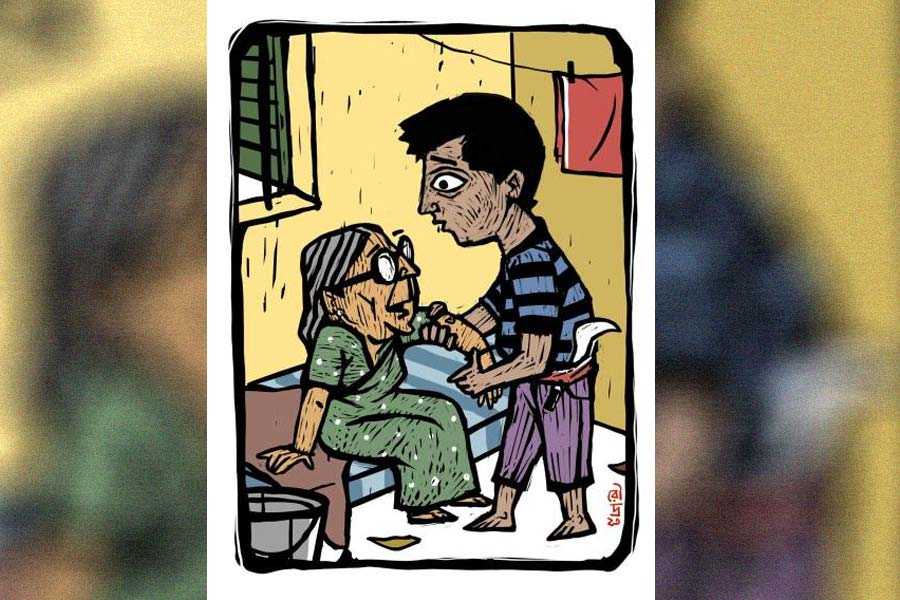

 
 <h1 align=center>মনোজ কুমার</h1>
<h2 align=center>সাবিনা ইয়াসমিন</h2> মনা রেল বাজারের দিকে যাওয়ার সময় দেখে এসেছে, দত্তদের বাগানের কলাগাছে বেশ বড়সড় একটা মোচা ঝুলছে। বিশাল বড় নয়। কাঁঠালি কলার মোচা। মাঝারি সাইজ়ের। মোচার গোড়ার দিকে দুটো পাপড়ি উপরের দিকে উঠে যাওয়ায় ভিতরের মোচা রাস্তা থেকেই স্পষ্ট দেখা যাচ্ছে। আর দুটো দিন দেরি করলে দত্তগিন্নি বড়ি অথবা চিংড়ি দিয়ে তরকারি রেঁধে ফেলবে।

রেলবাজারে থোড় মোচা সব পাওয়া যায়। মনা দর করেছে। ব্যাটা বলে, তিরিশ টাকা পিস! আঁতকে উঠেছিল মনা। গাঁয়ের লোকরা থোড় মোচা জীবনেও খায় না। কুচি কুচি করে কেটে জমিতে ফেলে রাখে। সেই জিনিস শহরে এসে তিরিশ টাকা!

মনা মোচা বিক্রেতার চোখে চোখ রেখে দৃঢ়তার সঙ্গে বলেছিল, “দশ টাকায় দিলে নিতে পারি।”

খিঁচিয়ে উঠেছিল বিক্রেতা, “গ্যাসের দাম এগারোশো হয়ে গেছে, তাতে সমস্যা নাই। মোচার দাম তিরিশ টাকা হলেই যত্ত ধানাইপানাই!”

মনা একটু নরম হয়ে বলেছিল, “পনেরো টাকা দিচ্ছি।”

বিরক্ত মোচা বিক্রেতা মনার দিকে না তাকিয়ে বলেছিল, “যাও, যাও, পঞ্চাশ টাকা দিলেও এ মোচা তোমাকে আর দেব না।”

মনাকে চেনে না তো! মনা যদি মনে করে, মোচাওয়ালার লুঙ্গির গিঁটে বাঁধা মাল বেচার টাকাগুলো ফিরতি পথে হাপিশ করে দেবে, কেউ আটকাতে পারবে না। তিলজলার চুন্নু মিয়ার কাছ থেকে স্পেশাল ট্রেনিং নিয়েছে মনা। লাউয়ের উপর সিনেমার টিকিট রেখে ‘বেলেড’ দিয়ে প্র্যাকটিস করা হাত মনার। ‘বেলেড’-এর ঘায়ে পাতলা ফিনফিনে কাগজের টিকিট চিরে যাবে, লাউতে এতটুকু আঁচড় পড়বে না। গুরু বলত, ‘লাউটাকে লাউ ভাবলে চলবে নাকো! ও হল মানুষের বডি। সবার বডি লাউয়ের মতন অমন মুলায়েম হয় নাকো। কারও গা খসখসে হয়। তা হোকগে! কিন্তু বডিতে যেন এক ফোঁটা আঁচড় না পড়ে! আঁচড় কেবল মানিব্যাগেই পড়বে। একটাই আঁচড়। তার পর সঙ্গে সঙ্গে জিনিসটা পাশে দাঁড়ানো ইয়ারের হাতে দিয়ে পাচার করো। নিজে শিকারের পিছনে দাঁড়িয়ে থাকো ভালমানুষের পো হয়ে। সবাই যখন ‘চোর! চোর!’ বলে চিল্লাবে তুমিও তাতে শামিল হবা।”

চুন্নু মিয়া তার দেখা সেরা প্রশিক্ষক। সহজ ভাবে, অভিনয়ের মাধ্যমে ব্যাপারটা বুঝিয়ে দিত! সে বুঝেও গিয়েছিল দারুণ ভাবে। সে আর পটা মিলে ভিড় বাসে এক সময় প্রচুর জিনিস হাতিয়েছে। তখন লোকের মানিব্যাগে নগদ টাকা থাকত। মানিব্যাগ ফুলে থাকত আট মাসের গর্ভবতীর পেটের মতো। তার পর হাজার রকম কার্ড এল। নগদ টাকার কাজ-কারবার কমে গেল। মানিব্যাগ করিনা কপূরের পেটের মতো পাতলা হয়ে গেল। তা ছাড়া যে দিন ধরা পড়ত, সে দিন পাবলিক পিঠের ছালচামড়া তুলে নিত। সারা দেহে কালশিটে নিয়ে বাড়ি ঢুকলে মনার মা মড়াকান্না জুড়ে দিত।

চুন্নু মিয়া খুবই স্নেহের চোখে দেখতেন মনাকে। এক দিন বললেন, “বাস-লাইনের কাজে খুব রিস্ক আছে বেটা। ছোড় দো। শাদি করে আচ্ছা আদমি হয়ে যাও।”

চুন্নু মিয়া নিজে যেচে এক জন চেনা লোককে ধরে মনাকে কাজ জুটিয়ে দিলেন। রাস্তা সাফ করার কর্মী হিসেবে কাজে জয়েন করল মনা। মাইনে কম। কাজ খুব বেশি। তার পর আবার ভোরবেলা ওঠার ফ্যাঁকড়া!

সে গভীর রাতের ছিঁচকে চোর ছিল না। সন্ধেবেলা চুন্নু মিয়াকে হিসাব বুঝিয়ে দিয়ে একটু আড্ডা দিয়ে রাত এগারোটার মধ্যেই বাড়ি ঢুকে যেত। চান সেরে ভাত খেয়ে ঘুমিয়ে পড়ত। উঠত সেই বেলা দশটা-সাড়ে দশটা। মাস্টার তাকে এমন একটা কাজ জোগাড় করে দিল যে, তার ভোরবেলার সুখের ঘুমে আগুন লাগল। নতুন বৌকে ভোরবেলা বিছানায় ছেড়ে আসতে কার মন চায়! তবু এই আবর্জনা সাফ করার কাজটা পেয়ে গিয়েছিল বলে একটা ঠিকঠাক বিয়ে হয়েছে। ঘটকগিরি করেছিল মাস্টার চুন্নু মিয়াই। নিজের বাপকে চোখে দেখেনি। ওই লোকটাকে মাঝে মাঝে বাপ মনে হত তার।

গাঁয়ের মেয়ে হলে কী হবে! শেফালির চোখেমুখে জ্ঞানগম্যির ছাপ আছে। দু’গালে টোল ফেলে যখন হাসে, তখন একদম জুহি চাওলার মতো লাগে। মনার মায়ের সঙ্গে মনার বৌয়ের বিশাল দোস্তি। ওরা জানে, মনা সাফাইয়ের কাজ করে। রাস্তায় পড়ে থাকা কুকুর-বিড়ালের মলমূত্র, অন্যান্য নোংরা ঝেঁটিয়ে সাফ করে। কেবল মনাই জানে, সে ভোরে আর কী কী সাফ করে! কারও জানলা খোলা পেলে টেবিলের উপর রাখা হাতঘড়ি, পেতলের ফুলদানি সাফ করে দেয়। মোবাইল নিতে সাহস হয় না। খুব ঝক্কি। মোবাইলে কী সব চিপ-ফিপ লাগানো থাকে আজকাল! মোবাইল চোর ধরা সহজ এখন। তার চেয়ে গ্রিলের ফাঁক দিয়ে ছোটখাটো জিনিস সাফ করায় ঝামেলা কম। তার গুরু চুন্নু মিয়া তার এই নতুন হাত-সাফাইয়ের কথা জানে না। জানলে দুটো থাপ্পড় মেরে বলতেন, “শুধরে যা। তোর উমর কম আছে। ভাল হয়ে যা। নিজের লড়কা-লড়কির কাছে কুনো ইজ্জত পাবি না।”

শেফালি এখন চার মাসের পোয়াতি। আগে বাচ্চাটা হোক, তার পর শুধরোবার কথা ভাববে। শুধু রাস্তা সাফাই করে ঝিনচ্যাক বাঁচা সম্ভব নয়। ওর কি কোনও শখ-আহ্লাদ নেই! একটা মোটরবাইকের খুব শখ। মাঝে মাঝে পটার বাইকটা নিয়ে শেফালিকে পিছনে বসিয়ে চক্কর মেরে আসে। সে-সব দিনে শেফালি মনাকে বেশি আদর করে। কলেজপাড়ার দিকে দু’কাঠা জমি কিনে বাড়ি করবে মনা। চুন্নু মিয়া পাশে থাকলে সে স্বপ্ন সত্যি হওয়া সম্ভব। বেশি দিন বস্তিতে রাখবে না শেফালিকে।

শেফালির মেজাজ এখন প্রায়ই খারাপ থাকে। ডাক্তারদিদি বলেছেন এখন মেয়েদের এমন হয়। বৌকে খুশি রাখতে হবে। খুশি রাখার সব রকম চেষ্টা চালিয়ে যাচ্ছে মনা। মাঝে মাঝে মটকা গরম হচ্ছে বটে, কিন্তু মনা নিজেকে কন্ট্রোল করে নিচ্ছে! মা বলেছে এমন লক্ষ্মীমন্ত বৌরে অবহেলা করলে মনা পরের জন্মে কুকুর হয়ে জন্মাবে। কুকুর হওয়ার ইচ্ছে তার নেই। বৌকে খুশি করার জন্য সে দিন বিকাশবাবুর বাড়ি থেকে টবসুদ্ধু একটা বেলিফুলের গাছ হাপিশ করে শেফালিকে উপহার দিয়েছিল। শেফালি খুব খুশি। চৌকির পাশে গাছটাকে রেখে দিল। রাত্তিরে সব ক’টা কুঁড়ি ফুটে ছোট্ট ঘরখানা সুবাসিত হয়ে উঠল। অনেক দিন পর শেফালি সে দিন খুব খুশি। আহ্লাদি মুখ করে মনার চুলে বিলি কাটতে কাটতে বলেছিল, “কাল একটা মোচা এনো। আর নারকেলও এনো একটা। দুষ্টুটার মোচা খাওয়ার মন হয়েছে।”

কথাটা বলে নিজের পেটের দিকে ইঙ্গিত করেছিল শেফালি।

মনার মুখে এসে গেছিল, দুষ্টুর আর খেয়েদেয়ে কাজ নেই! মোচা খাবে! নিজের ইচ্ছে করছে বললেই হয়! কথাটা মুখ ফুটে বলতে পারেনি। পরে ভেবে দেখেছে, হিরে-জহরত তো নয়! সামান্য একটা মোচা।

“আচ্ছা, এনে দেব!” বলে ঘুমিয়ে পড়েছিল সে।

সেই মোচা কিনতে গিয়েই মোচা বিক্রেতার সঙ্গে ঝামেলা। সঙ্গে সঙ্গে সিদ্ধান্ত নিয়ে নিল, কাল ভোরেই দত্তদের বাগানের মোচাটা কেটে নেবে। বাজারে নারকেলের দাম শুনে মাথাটা আবার গরম হয়ে গেল! এইটুকু একটা নারকেলের দাম পঁয়তাল্লিশ টাকা! এরা তো মনার থেকেও বড় চোর! ঠিক আছে! নারকেলও সে তার মতো করে জোগাড় করে নেবে।

আজ খুব ভোরে ঘুম থেকে উঠেছে মনা। দত্তদের পাঁচিল টপকানো সহজ নয়। শালারা পাঁচিলে গজাল আর কাচের টুকরো গেঁথে রেখেছে। মনা অত কাঁচা খেলোয়াড় নয়। সে নন্দীদের বারান্দা থেকে মোটা পাপোশখানা ঝেড়ে এনেছে। পাঁচিলের যে অংশটায় গজাল কম, সে অংশটায় ছুড়ে দিয়েছে পাপোশটা। সে যখন পাঁচিল বেয়ে ওই পাপোশের ওপর হাতের ভর দিয়ে উঠে দাঁড়িয়েছে, শুধু হালকা একটা আঁচড় খেয়েছে, আর তেমন কিছু হয়নি। তার পর ধুপ করে গাছপাকা তালের মতো দত্তদের উঠোনে পড়েছে। কোমর থেকে কাস্তেটা বার করে নিমেষের মধ্যে ঘ্যাঁচ করে মোচাটা নামিয়ে নিয়েছে। এক মুহূর্ত সময় নষ্ট করেনি। আকাশ পরিষ্কার হওয়ার আগেই তাকে কাজের জায়গায় গিয়ে ঝাড়ু ধরতে হবে। মোচাটা গামছা দিয়ে কোমরে বেঁধে নেবে, নাকি পাঁচিলের ও পারে ছুড়ে ফেলবে, সিদ্ধান্ত নিতে পারছিল না। পাঁচিলের ও পারে ফেললে মোচাটা তেবড়ে যাবে। আওয়াজও হবে। কেউ টের পেয়ে যেতে পারে।

এই সব ভাবনার মধ্যে উঠোনের পাশের একটা ঘর থেকে আওয়াজ এল, “উঠানে কেডা? বাবলু না কি?”

ঘরে আলো জ্বলে উঠল।

এই সেরেছে! বাবলু দত্তর মা না কি! কী হবে এখন?

ভয় পেয়ে গেল মনা। ভয় থেকে শেফালির উপর রাগ হল। নাও! ভাল করে মোচা খাও! সে দিন অতটা চালতার আচার এনে দিলাম, তাও হল না! বাবলু দত্ত হেবি রাগী। পাঁচিল টপকে উঠোনে নেমেছে জানলে কলাগাছের নীচেই পুঁতে ফেলবে। যা করে হোক বুড়িকে ম্যানেজ করতে হবে।

আলো-জ্বলা ঘরটার দিকে পায়ে পায়ে এগিয়ে গেল মনা। এক চিলতে বারান্দাও আছে। বারান্দায় দাঁড়িয়ে জানলা দিয়ে ঘরের দিকে মুখ বাড়িয়ে দেখল, এক জন বৃদ্ধা বিছানায় বসে আছে। মাথাটা একটু ঝুঁকে রয়েছে।

“বাবলু, ম্যাইয়াটা কবে আসবে? এক দিনের ছুটি নিয়া পর পর দু’দিন আইল না। আমারে একটু বাথরুম নে চল। বসায়ে দে। হাঁটু নাড়াইতে পারতেসি না।”

মনা গলাটা মিহি করে বলল, “ঠাকুমা, আমি বাবলু নই।”

“যে-ই হও, ভেতরে আইস্যা আমারে বাথরুমে লইয়া যাও।”

“দরজা লাগানো ঠাকুমা। কী করে ভেতরে যাব?”

“বাইরের কড়া দু’খান ভাল করে হিলাও, ভেতরের ছিটকিনি আপনাআপনি খুইলা যাইব।”

মনা রোমাঞ্চিত হল। বুড়ির ঘরে নিশ্চয়ই দামি জিনিসপত্র আছে! সেটা নিয়ে কেটে পড়বে।

মনা সন্তর্পণে দরজার কড়া দুটো নাড়াতে লাগল। ক’বার নাড়ানোর পরেই ঠুকুস করে একটা শব্দ। ছিটকিনি খুলে গিয়েছে।

“কে বাবা তুমি। এট্টু কাছে আসো দেহি!” বৃদ্ধা বালিশের পাশ থেকে চশমা নিয়ে চোখে আঁটলেন।

“তুমি তো একেবারে গুপালচন্দ্র বাবা! কী সোন্দর মুখ! ঈশ্বর তোমারে পাঠিয়েছেন। আমারে ইট্টু ধরো, বাথরুম যাই,” বৃদ্ধা ছেঁচড়ে নামতে গিয়ে ব্যথায় ককিয়ে উঠলেন।

মনা বলল, “ওই কোণের দরজাটা বাথরুমের? দাঁড়ান, আমি আপনাকে নিয়ে যাচ্ছি।”

মনা পাঁজকোলা করে তুলে বৃদ্ধাকে বাথরুমে নিয়ে গিয়ে বসিয়ে দিয়ে দরজা টেনে দিল। তার পর বালবের ঘোলাটে আলোয় পুরো ঘরটা ছানবিন করতে শুরু করল। এক দিকে অসংখ্য দেবতা। সব বাঁধানো ছবি। ছবির সামনে রাখা শুকনো ফুল। হাপিশ করার মতো কিচ্ছু নেই।

বাবলু দত্ত লোকটা পিচাশ! মা কে কী ভাবে রেখেছে! একটা আয়াও রাখতে পারেনি! অথচ টাকার গদির ওপরে বসে থাকে! মনা না থাকলে আজ বুড়িটা পেচ্ছাপ-পায়খানা আটকে মরে যেতে পারত। মনা দেখল ঘরের অন্য কোণে একটা পেতলের ঘড়া। গিয়ে দেখল ভেতরে জল। একটা পেতলের রেকাবি ঘড়ার মুখে চাপানো। ঘড়াটার ভাল দাম হবে। কিন্তু বয়ে নিয়ে যাওয়া অসম্ভব। তার চেয়ে পেতলের ঢাকনাটা নেওয়া সুবিধে। মনা পেতলের ঢাকনাটা গেঞ্জির ভেতরে ভরে নিল।

“বাবা গুপাল, এ বার আসো। আমারে লইয়া যাও।”

মনা বৃদ্ধাকে আবার পাঁজাকোলা করে নিয়ে গিয়ে বিছানায় শুইয়ে দিল। তার পর বাথরুমে গিয়ে জল ঢেলে দিয়ে বাথরুমের দরজা বন্ধ করে বৃদ্ধার কাছে গিয়ে দাঁড়াল। বলল, “ঠাকুমা আপনি নীচে থাকেন কেন? ওপরে থাকলেই পারেন! দেখাশোনা করার কোনও লোক নেই?”

“আছে তো! মালা নামের একটা মাইয়্যা। সে বাড়ি গেসে। গতকাল আসার কথা ছিল, আসে নাই।”

“আপনি দোতলায় ছেলে-বৌমার কাছে থাকলেই পারেন!”

“সিঁড়ি দিয়ে ওঠানামা করার ক্ষমতা আমার নেই বাপ।”

“আজ যদি আমি না থাকতাম!” মনা গর্ব-গর্ব মুখ করে বলল।

“আমার গুপাল তুমার রূপ ধরে আসছে। এ বারে কও দেহি কী ভাবে ঢুকলা? বাবলু সদর খোলে তো সেই সকাল সাতটায়!”

“পাঁচিল টপকে এসেছি।”

“কও কী! আমারে তুইল্যা বসাও। তুমারে একটু ভাল কইর‌্যা দেহি।”

বৃদ্ধাকে বসিয়ে পিঠে একটা বালিশের ঠেকনা দিল মনা। তার পর ঘরের লুকোনো মোচাটা এনে বৃদ্ধার সামনে রাখল, “এই মোচাটা নিতে এসেছিলাম। আমার বৌয়ের বাচ্চা হবে। সারা দিন খালি খাই-খাই। বলল মোচা খাবে। বাবলু দত্ত বড়লোক। মোচা খায় না। মাছ-মাংস খায়। মোচাটা ফালতু নষ্ট হবে ভেবেই...”

মনার মুখের কথা কেড়ে নিয়ে বৃদ্ধা বললেন, “ঠিক করসো! বাবলুর ঝগড়ুটে বৌটা খালি টিভিতে নাটক দ্যাখে। রান্নাবান্নায় মন নাই। শুনো বাবা, পোয়াতি মেয়েমানুষরে যত্ন করতে হয়। খাটের নীচে এক বার ঢোকো তো বাবা!”

“কেন ঠাকুমা?”

“দেখো নীচে, নারকেল আছে কয়টা। দুইটা নিয়া যাও। মুচায় নারকেল দিলে তেমনি সোয়াদ হয়। কত দিন মুচা খাইনি! মালা খালি পাতলা খিচুড়ি রান্না করে দেয়। কখনও সব আনাজপাতি দিয়া একটা তরকারি। আমার কিন্তু সুগার-পেসার কিচ্ছু নাই। খালি হাঁটুর ব্যথা।”

বৃদ্ধার মুখটা দেখে খুব মায়া হল মনার। বলল, “ঠাকুমা, যে দিন মোচা রান্না হবে, তার পরদিন ভোরে দিয়ে যাব এক বাটি। এখন যাই। আলো ফুটে গেছে। দেরি হলে বিপদ।”

কথা বলতে বলতে মনা গেঞ্জির ভেতর থেকে ঘড়ার মুখের ঢাকনাটা বার করে ঘড়ার মুখে বসিয়ে দিল। দু’খানা বড় বড় নারকেল দিয়েছে ঠাকুমা। প্রায় একশো টাকা দাম হবে। এর পরেও ঘড়ার ঢাকনা চুরি করলে ঠাকুর পাপ দেবে।

মোচাটা কোমরে গামছা দিয়ে বেঁধে নিল মনা। নারকেল দুটো একটা প্লাস্টিকে ভরে নিল। কী ভেবে বৃদ্ধাকে একটা প্রণাম করল। বৃদ্ধা মনার চিবুকে হাত ছুঁইয়ে অনেক আশীর্বাদ করলেন। বললেন, “তুমার নামটা বললা না বাবা!”

মনা গর্বিত মুখে উত্তর দিল, “মনোজকুমার দাস। আবার বাবা হিন্দি বইয়ের হিরো মনোজ কুমারের বিশাল ভক্ত ছিল।”

হাসল মনা। হাসলে মনাকে সত্যিই খুব ভাল দেখায়। একদম হিরোর মতো!