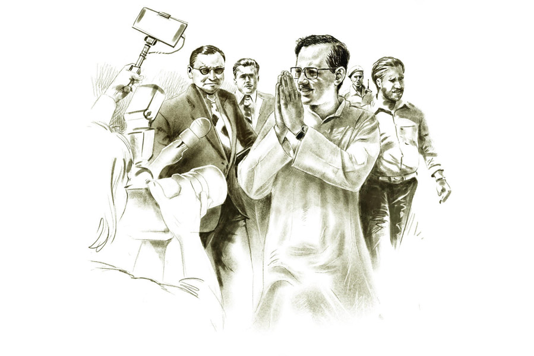

 
 <h1 align=center>মন্ত্রীর ফোন</h1>
<h2 align=center>উল্লাস মল্লিক</h2> 

গণেশই প্রথম দেখল দৃশ্যটা। বিছানার চাদরের একটা জায়গা কুঁচকে আছে। দেখার সঙ্গে সঙ্গে শরীরে শিহরন। জায়গাটা কুঁচকে কেন! তাই তো! মন্ত্রী বসেছিলেন ওখানেই! বেশ কিছু ক্ষণ বসেছিলেন!

ক’দিন ধরে খবরটা হাওয়ায় ভাসছিল। মন্ত্রী আসবেন এ দিকে। ঘুরবেন পাড়ায় পাড়ায়। সাধারণ মানুষের সুখ-দুঃখের কথা শুনবেন।

গণেশ কখনও জ্যান্ত মন্ত্রী সামনাসামনি দেখেনি। মন্ত্রী মানে কি আর যে-সে কথা! মন্ত্রী মানে অনেক লোকজন, ভক্ত-বডিগার্ড-পুলিশ... মন্ত্রী চাইলে গর্দান নিতে পারে, গর্দান ফিরিয়েও দিতে পারে। কাউকে রাজা করে দিতে পারে, ফকিরও করে দিতে পারে। এক টুসকিতে কম্মো কাবার।

বৌ, মানে ঝুমকির মাকে বলল, “ইদিকে নাকি মন্ত্রী আসবেন।”

ঝুমকির মা তখন ছেলেকে ভাত মেখে খাওয়াচ্ছিল। দুই সন্তান ওদের। প্রথম মেয়ে, ঝুমকি, তার কোলে এই ছেলে। গুল্লু। সবে সাড়ে চার। পাড়ার খিচুড়ি ইস্কুলে পড়ে। ঝুমকি দশ ক্লাস। ঝুমকির মা বলল, “সত্যি আসবেন!”

“বলছে তো সবাই।”

আজ রবিবার। মন্ত্রী আসার দিন। কাল থেকে মাইকে হাঁকছে। সকাল থেকে মাঝে মাঝে রব উঠছে, “এই এল, এল বলে, আর কিছু ক্ষণ…” হুড়মুড় করে লোকজন বেরিয়ে আসছে। এলাকার নেতারা খুব ব্যস্ত- ব্যাকুল হয়ে ঘোরাফেরা করছে। সবারই প্রায় কানে ফোন। গণেশ ভাবে, কার ফোনটা ধরছেন মন্ত্রী!

মন্ত্রী এলেন দুপুরের দিকে। তখন কেউ সবে খেতে বসেছে, কারও খাওয়া মাঝপথে, কারও আবার শেষের দিকে। কেউ বিষম খেল, কারও গলায় কাঁটা ফুটল, কেউ আবার জিভ কামড়ে ফেলল। যে যে অবস্থায় ছিল, ছুটল রাস্তার দিকে।

গণেশের অবশ্য খাওয়া শেষ হয়ে গিয়েছিল। ভাত, বিউলির ডাল, আলু-কুমড়োর ঘ্যাঁট। অন্যান্য রবিবার একটু আঁশের ছোঁয়া থাকে। ওই নাইলনটিকা কিংবা ভোলা। আজ মন্ত্রী-মন্ত্রী করে বাজার যাওয়া হয়নি। মেয়েটা মাছ ভালবাসে। একটু খুঁতখুঁত করছিল। মেয়ের মা বকুনি দিল, “দেখছিস না বাবার অবস্থা! কাজ বন্ধ দু’মাস!”

রাস্তার দু’ধারে লাইন দিয়ে দাঁড়িয়ে ছিল সবাই। তারই মধ্যে একটু জায়গা করে দাঁড়াল গণেশ। কোলে গুল্লু। ছেলেকে মন্ত্রী দেখাবে। মা-মেয়েও এসেছে। ঠেলাঠেলি করে একটু জায়গা করে নিয়েছে।

হঠাৎ একটা হইহই, তার পর সবাই চুপ। ওই তো মন্ত্রী এসেছেন!

লম্বা, ফর্সা, কালো চুল, ঝকঝকে চশমা, সাদা পাজামা-পাঞ্জাবি। কেউ শাঁখ বাজাচ্ছে, কেউ উলু দিচ্ছে। মন্ত্রীর বডিগার্ডের হাতে বন্দুক। এক দল ছেলেমেয়ে মন্ত্রীর সামনে হুটোপাটি করছে। সবার হাতে ফোন, না-হয় ক্যামেরা। ওরা সব রিপোর্টার। মন্ত্রীর জোড়-হাত, হাসি-হাসি মুখ। কী সুন্দর দেখতে মন্ত্রীকে! অপলক তাকিয়ে থাকে গণেশ।

কয়েকটা মুহূর্ত মাত্র। যেন এক ঘোর থেকে বেরিয়ে এসে গণেশ দেখল, মন্ত্রী ওর সামনে এসে দাঁড়িয়েছেন। হাত বাড়িয়ে কোলে নিতে চাইছেন গুল্লুকে!

কত ক্ষণ বসেছিলেন মন্ত্রী তার ঘরে! পাঁচ মিনিট, সাত মিনিট, নাকি দু’মিনিট! কিচ্ছু খেয়াল নেই গণেশের। গুল্লুকে কোলে নিয়ে মন্ত্রী বললেন, “আপনার বাড়ি কোথায়?”

বেশ ঘাবড়ে গিয়েছিল গণেশ। কোনও রকমে বলল, “এই তো…”

মন্ত্রী বলল, “চলুন, একটু রেস্ট নেওয়া যাবে। অনেক ক্ষণ হাঁটছি।”

পাড়ার নেতা কুশল বলল, “স্যর, আর একটু গেলেই পার্টি অফিস, ওখানেই তো রেস্ট নিতে পারতেন।”

“না না, এখানেই একটু বসি।”

মন্ত্রী সোজা চলে এলেন গণেশের বাড়ি। গণেশ পড়ল মহা ফ্যাসাদে। মন্ত্রীকে বসতে দেবে কোথায়! একটা প্লাস্টিকের চেয়ার আছে, তাও ভাঙা। অগত্যা বিছানাতেই বসলেন মন্ত্রী। সবার নাম জিজ্ঞেস করলেন। ছেলেমেয়েরা কী পড়ে, পড়াশোনায় সমস্যা আছে কি না— এমন অনেক প্রশ্ন। হাত জোড় করে উত্তর দিল গণেশ। তার ঘরে থইথই লোক। উঠোনও ভর্তি। প্রচুর ছবি উঠছে। দু’মাস গণেশের কাজ নেই শুনে মুখে চুকচুক শব্দ করলেন মন্ত্রী। তার পরই উঠে পড়লেন। সঙ্গের একটা লোককে বললেন গণেশের ফোন নম্বরটা নিয়ে নিতে। যাওয়ার আগে বলে গেলেন, “চিন্তা নেই, সব ঠিক হয়ে যাবে।” বললেন, ফোন আসবে, গণেশের ফোনে। দু’-এক দিনের মধ্যে। ব্যস, মুশকিল আসান।

মন্ত্রী চলে যাওয়ার কিছু ক্ষণ পর গণেশের নজরে পড়ল দৃশ্যটা। বিছানার চাদরের একটা জায়গা কুঁচকে আছে। সঙ্গে সঙ্গে ঝুমকির মা-কে ডেকে দেখাল, “এই দেখো, মন্ত্রী বসেছিলেন ওইখানে!”

ঝুমকির মা-ও খুব অবাক, “ও মা, তাই তো।”

রাতে তক্তপোশে গণেশ শোয় ছেলেকে নিয়ে। ঝুমকির মা ঝুমকিকে নিয়ে মেঝেয়। রাতে গণেশ ওই কোঁচকানো জায়গাটা বাঁচিয়ে খুব সাবধানে শুল। ঘেঁটে না যায়। রাতে ভাল ঘুম হল না তার। খালি মনে হচ্ছে, হাত-পা পড়ে যাচ্ছে না তো!

পুরনো রংচটা ফোনটা মাথার কাছে নিয়ে শুল। মন্ত্রীর ফোন আসার সময়-অসময় হয় নাকি! মাঝরাতেও আসতে পারে। সারা রাত কান খাড়া। এল নাকি মন্ত্রীর ফোন!

সকালে উঠেই ভাল করে দেখল গণেশ। ঠিকই আছে। কেবল ধারের দিকের দু’-একটা কোঁচ একটু যেন সমান হয়ে গেছে। বাকি সব ঠিকঠাক।

পরদিন অনেকেই গণেশের বাড়ি এল। সবার একটাই প্রশ্ন, “ফোন এসেছিল মন্ত্রীর?” আসেনি শুনে বলল, “আসবে আসবে, মন্ত্রীর কি একটা কাজ! দুটো দিন যাক।”

দু’দিন গেল, চার দিন গেল, ছ’দিন গেল। ফোন এল না মন্ত্রীর। দশ দিনের মাথায় ব্যালান্স শেষ। মন্ত্রীর ফোন আসবে বলে ফের রিচার্জ করতে হল। অনেকগুলো টাকার ব্যাপার। সে যা-ই হোক, ফোন এক বার এসে গেলেই…

মাঝে মাঝে ফোন আসে। ঝুমকির মামার বাড়ি, ছোটমাসির বাড়ি, গণেশের বোনের বাড়ি থেকে।

দেশে ভোট হল। মন্ত্রী জিতলেন। আবার মন্ত্রী হলেন। আরও বড় মন্ত্রী। তবু ফোন এল না।

এ দিকে রোজ রাতেই ওই কোঁচকানো জায়গাটা বাঁচিয়ে গণেশ শোয়। জেগে থাকে। কান থাকে টনকো। ঘুম হয় না। শরীর ভাঙে।

ঝুমকির মা বলে, “কী যে পাগলামি করো না তুমি। আমি বিছানা ঝাড়তে পারছি না ভাল করে। আমাদের কি সে ভাগ্য!”

সে দিন সকালে কাজের খোঁজে গিয়েছিল গণেশ। সঙ্গে ফোন। বেলায় ফিরল। কাজের ব্যবস্থা হয়নি। ফোনও আসেনি। মাথাটা গরম। নজরে পড়ল জায়গাটা। নিকুচি করেছে! থাবড়ে মসৃণ করে দেবে বিছানার চাদর। হাতটা বাড়াতেই ফোনটা বেজে উঠল।

হাতটা থেমে গেল গণেশের।

