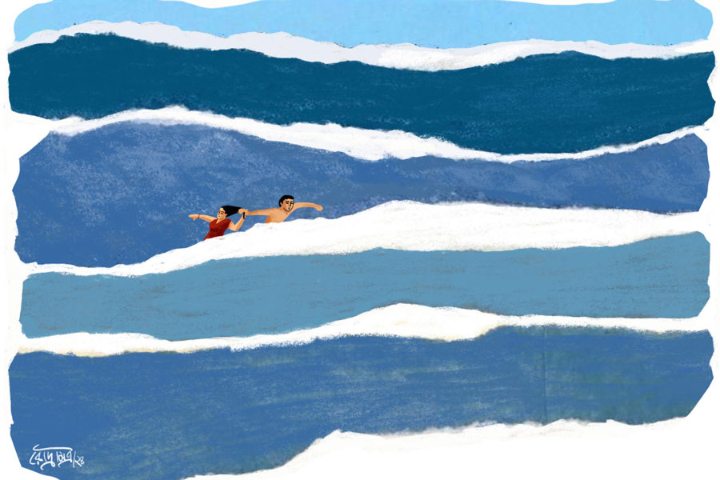

 
 <h1 align=center>মন্দারমণি উপাখ্যান</h1>
<h2 align=center>আর্যভট্ট খান</h2> 

সমুদ্রে সাঁতার কাটতে কাটতে এতটাই দূরে চলে গেছে আকাশ যে, সমুদ্রের পাড় বেশ ছোট দেখাচ্ছে। এখানে সমুদ্র আপাত শান্ত কিন্তু অনেকটা গভীর। সাঁতার কাটার সময়ই বুঝতে পারছিল আকাশ। ফ্রি-স্টাইলে সাঁতার কেটে এতটা এসে কিছুটা ক্লান্ত আকাশ ভাবল, এ বার চিৎ-সাঁতারে ভাসতে ভাসতে আর একটু দূরে চলে ‌যাবে কি না... বেশ পাসপোর্ট ভিসা ছাড়াই ভাসতে ভাসতে পৌঁছে যাবে অন্য কোনও দেশে!

গভীর সমুদ্রের দিকে তাকালে মনে হচ্ছে পৃথিবীর রং শুধুই নীল। সমুদ্রের নীল আর আকাশের নীল এখানে মিলে গেছে এক বিন্দুতে। এই নীল রঙের পৃথিবীর সে-ই একমাত্র বাসিন্দা। আকাশ ভাল করে তাকিয়ে দেখল, আশপাশে কেউ নেই বলা ভুল। তার থেকে কিছুটা দূরে একটি ছেলে আর মেয়ে এক সঙ্গে সাঁতার কাটছে। দু’জনেই সাঁতার কাটছে খুব কাছাকাছি। মাঝেমধ্যেই একে অপরের হাত ছুঁয়ে যাচ্ছে। ওই জুটিটা সাঁতার কাটতে কাটতে তার কাছাকাছিই চলে এসেছে। যদিও আকাশ সে দিকে নজর করল না। তবে আর গভীরেও গেল না। এ বার সাঁতার কেটে ফেরার প্রস্তুতি শুরু করল।

আর তখনই শুনতে পেল একটা অস্ফুট শব্দ। আকাশ দেখল, মেয়েটা ছেলেটার হাত ছেড়ে একটু দূরে চলে গেছে। মেয়েটা এখন আর জলের মধ্যে সাঁতার কাটছে না। মনে হল যেন হাবুডুবু খাচ্ছে। ছেলেটা মেয়েটার কাছে যাওয়ার চেষ্টা করছে, কিন্তু কোনও কারণে পারছে না। আকাশের মনে হল, ছেলেটার মুখটা খুব অসহায়।

আর দেরি করল না আকাশ। মেয়েটাকে বাঁচাতে হবে। মেয়েটা হাবুডুবু খেতে খেতে ক্রমেই গভীরে চলে যাচ্ছে। হয়তো আর কয়েক নিমেষে মেয়েটাকে গ্রাস করে নেবে সমুদ্র। কয়েক সেকেন্ডের মধ্যে সাঁতার কেটে মেয়েটার কাছে পৌঁছে গেল আকাশ। হাবুডুবু খাওয়া মেয়েটার চুলের মুঠি ধরে টেনে আনার চেষ্টা করল। ডুবন্ত মানুষ খড়কুটোর মতো কোনও কিছু পেলে তাকে আঁকড়ে ধরার চেষ্টা করে। মেয়েটাও তা-ই করল। আকাশের হাত জাপ্টে ধরার চেষ্টা করল। আকাশ দেখল, মেয়েটা কিছু না পেয়ে তার আঙুলগুলো শক্ত করে ধরে রেখেছে। এই অবস্থায় সাঁতার কাটা খুব কঠিন। কিন্তু আকাশ একটুও ঘাবড়াল না। ওই অবস্থায় মেয়েটাকে একটু একটু করে পাড়ের দিকে আনার চেষ্টা করতে থাকল।

তত ক্ষণে মেয়েটার সেই সঙ্গী আকাশ ও মেয়েটার কাছে চলে এসেছে। ছেলেটা মেয়েটাকে আকাশের হাত থেকে ছাড়িয়ে আলতো করে মেয়েটার হাতটা ধরে নিল। আকাশ দেখল, ছেলেটা যেই মেয়েটার হাতটা ধরল, সঙ্গে সঙ্গে মেয়েটার শরীর ফের স্বাভাবিক হয়ে এল। মেয়েটা আবার নিজে থেকে সাঁতার কাটতে শুরু করেছে।

আকাশ বুঝল, বিপদ কেটে গেছে। শুধু ওদের কাছে গিয়ে এক বার বলল, “পাড়ে চলে যান।”

ছেলেটা কিছু বলল না। তাকে একটা ধন্যবাদও না দিয়ে মেয়েটাকে বলল, “ঝিমলি, পাড়ে চলো।”

একটু অদ্ভুত লাগলেও আর কথা না বাড়িয়ে আকাশ পাড়ের দিকে সাঁতরে এগিয়ে গেল। বন্ধুদের ডুবন্ত মানুষকে উদ্ধারের গল্পটা বলতে হবে।

পাঁচ মিনিটের মধ্যে আকাশ পাড়ে চলে এল। ওকে দেখে হইহই করে উঠল সুজয়, রেহেনা, অর্পিতা, মৌসুমী, সৌম্য। সুজয় বলল, “কী রে, কত দূর চলে গেছিলি! আমাদের তো টেনশন হচ্ছিল।”

অনেক ক্ষণ সাঁতার কেটে একটু ক্লান্ত আকাশ, সঙ্গে মেয়েটাকে বাঁচানোর একটা টেনশনও ছিল। আকাশ নিজের হাতের দিকে তাকিয়ে দেখল, মেয়েটা এতটাই জোরে আঙুলগুলো চেপে ধরেছিল যে, মেয়েটার নখের দাগে তার আঙুল ছড়ে হালকা রক্তের আভাস ফুটে উঠেছে। আর একই সঙ্গে আকাশ দেখতে পেল, ওর ডান হাতের অনামিকায় যে হিরে বসানো সোনার আংটিটা ছিল, সেটা নেই!

সমুদ্রের জলে খুলে গেল আংটিটা? মেয়েটা যখন তার আঙুলগুলো চেপে ধরছিল, তখন কি আংটিটা খুলে পড়ে গেছে? নাকি মেয়েটা আকাশের আঙুল থেকে আংটিটা কায়দা করে খুলে নিয়েছে? সমুদ্রের জলে মেয়েটার ডুবে যাওয়াটা নাটক? আসলে মেয়ে আর তার বয়ফ্রেন্ডটা চোর? তার আংটি চুরি করার জন্য ডুবে যাওয়ার ছক করে সবটা করেছে?

হিরের আংটিটা আঙুলে দেখতে না দেখতে পেয়ে আকাশের মনে হল, এ বার সে সত্যিই গভীর সমুদ্রে ডুবে যাচ্ছে। বিশাল সমুদ্রের তোলপাড় করা ঢেউগুলোর দিকে তাকিয়ে আকাশের মনে হল, হিরের আংটিটা খুঁজতে আবার কি তাকে নামতে হবে সমুদ্রের গভীরে?

*****

রেহেনা সব শুনে বলল, “যাও, আবার সমুদ্রে গিয়ে নামো। যেখানে গিয়েছিলে, সেখানে গিয়ে খুঁজে এসো আংটিটা। আংটি না পাওয়া পর্যন্ত পাড়ে আসবে না। তখনই বলেছিলাম বাহাদুরি দেখিয়ে এত গভীর সমুদ্রে যাওয়ার দরকার নেই।” তার গলায় রাগ আর কান্না মাখামাখি।

সুজয় বলল, “তুই কি পাগল হয়ে গেলি রেহেনা? আংটি খুঁজতে ও আবার এই বিকেলবেলায় জলে নামবে?”

রেহেনা নিজেকে একটু সামলে বলল, “তা হলে সারা রাত বসে থাকো সমুদ্রের ধারে। শুনেছি সমুদ্রের ঢেউয়ে সব কিছু ভেসে আসে। বালির মধ্যে আংটি খোঁজো সারা রাত।”

সৌম্য হাসতে হাসতে বলল, “বরং তুই একটা কাজ কর, যেখানে সাঁতার কাটছিলি সেখানে গিয়ে আবার সাঁতার কাট। যদি তোর আংটিটা খুলে পড়ে গিয়ে থাকে, আর কোনও তিমি সেটা গিলে ফেলে, তা হলে সেই তিমিটা ধরে এনে মাছের পেট কেটে দেখ আংটিটা পাস কি না।”

আকাশ গলায় একটু বিরক্তি নিয়ে বলল, “সব সময় ইয়ার্কি ভাল লাগে না, সৌম্য।”

সৌম্য বলল, “তা হলে চল, আমরা সবাই মিলে সারা রাত সমুদ্রের বুকে হিরের আংটি খুঁজি। আজ আর কেউ হোটেলে ফিরব না।”

অর্পিতা বলল, “ফালতু কথা কম বল সৌম্য। রেহেনা আমাকে বলেছে আংটিটার দাম পঞ্চাশ হাজার টাকার উপর। সত্যি আকাশ, তোর কোনও কাণ্ডজ্ঞান নেই। তোর কি আংটিটা লুজ় হচ্ছিল? গত বছর ভ্যালেন্টাইন্স ডে-র দিনই তো রেহেনা তোকে আংটিটা দিল। এই ভাবে হারিয়ে ফেললি?”

আকাশ বলল, “আমার মনে হয় ওই মেয়েটাকে উদ্ধারের সময় টানাহেঁচড়ার মধ্যে মেয়েটা আংটিটা খুলে নিয়েছে। মেয়েটা আসলে একটা চোর।”

সবাই চুপ করে গেল। এক দিনের প্রোগ্রাম করে ওরা ছয় বন্ধু— আকাশ, রেহেনা, সৌম্য, মৌসুমী, সুজয়, অর্পিতা— বেড়াতে এসেছে মন্দারমণি। এক রাত থেকে পরের দিন কলকাতা ফিরে যাবে। সারা রাত হোটেলে গল্প করে কাটানোর প্ল্যান।

রেহেনার মুখটা এখনও থমথমে। কিন্তু এই বিশাল জলরাশির সামনে ওরা সবাই অসহায়।

রেহেনা বলল, “কত কষ্ট করে টাকা জমিয়ে আংটিটা কিনেছিলাম তোমার জন্য। এই ভাবে হারিয়ে ফেললে! আমি ভাবতে পারছি না!”

বিব্রত আকাশ বলল, “তোমরা সবাই হোটেলে ফিরে যাও। আমি আর একটু থাকি সমুদ্রের পাড়ে। যদি কোথাও চোখে পড়ে আংটিটা।”

রেহেনার রাগ এখনও কমেনি। বলল, “এখানে বসে থেকে কী করবে? তুমি কি মনে করছ আংটিটা ভেসে ফের তোমার কোলে এসে পড়বে?”

সৌম্য বলল, “আংটি হারিয়েছে বলে পুলিশে ডায়েরি করেও তো লাভ নেই। পুলিশ কি চোর-ডাকাত ধরা ছেড়ে আংটি খুঁজতে সমুদ্রে নামবে?”

সুজয় এত ক্ষণ চুপ করে ছিল। সে বলল, “যে মেয়েটাকে তুই বাঁচালি আর তার বয়ফ্রেন্ড এসে মেয়েটাকে নিয়ে গেল, তাদের খুঁজে দেখতে পারিস। ওরা যদি পেয়ে থাকে।”

আকাশ বললো, “ওই দু’জনই মনে হচ্ছে চোর। এগুলোকে বলে কেপমারি। কায়দা করে ছিনতাই। ঘটনার পরে ওরা কেমন ভ্যানিশ হয়ে গেল।”

রেহেনার রাগ একটুও কমেনি। বলল, “প্রমাণ ছাড়া শুধু শুধু অন্যকে দোষারোপ কোরো না। নিজে ক্যাবলামির জন্য আংটি হারিয়েছ।”

সন্ধ্যা নামছে। সমুদ্রের পাড়ে বেড়াতে আসা লোকজন হোটেলে ফিরছে। আকাশ বলল, “তোরা হোটেলে ফিরে যা। আমি থাকি। একটু খুঁজি। ওই ছেলে আর মেয়েটাকে খুঁজি। আমার জন্য তোদের আনন্দ মাটি হবে কেন! তোরা ফিরে যা হোটেলে।”

রেহেনা বলল, “রাতে আর হিরের আংটি কোথায় খুঁজবে। হোটেলে ফিরে চলো। কাল সকালে থানায় একটা ডায়েরি করে রাখব। যদি কেউ সমুদ্রে কুড়িয়ে পেয়ে থানায় জমা দিতে আসে!”

*****

বাকিরা সবাই ঘুমোচ্ছে। সকালে রেহেনা আর আকাশ বেরোল সমুদ্রের পাড় ধরে হাঁটতে। গতকাল রাতে ওদের গল্পের তাল কেটে গেছে। বেড়াতে এসে এত দামি আংটি হারিয়ে ফেলা কষ্টকর তো বটেই।

আকাশ বলল, “মনে হচ্ছে মেয়েটাই খুলে নিয়েছে। তুমি এত কষ্ট করে টাকা জমিয়ে আমাকে গিফ্ট করেছিলে আংটিটা... এত খারাপ লাগছে!”

রেহেনা হতাশ গলায় বলল, “বিশাল সমুদ্রে ওই ছোট্ট আংটি কোথায় ভেসে চলে গেছে কে জানে।”

সকালেও প্রচুর লোক স্নান করতে নেমেছে। সে দিকে তাকিয়ে আকাশ বলল, “চলো, যে লোকগুলো স্নান করছে, ওদের জিজ্ঞেস করি। কেউ যদি পেয়ে থাকে। থানায় ডায়েরিও করে আসতে হবে।”

একটু দূরে যেখানে স্নান করছিল অনেকে মিলে, সেখানে ভিড় হয়েছিল অনেকটা। সেই ভিড়ে কিছু লোক ব্যস্ত হয়ে কিছু বলছিল। এত দূর থেকে আর সমুদ্রের গর্জনে কথাগুলো শোনা যাচ্ছিল না। ভিড়ের মধ্যে আকাশ দেখতে পেল দুটো পুলিশ।

একটা লোক রেহেনাদের পাশ দিয়ে দৌড়ে যাচ্ছিল. মনে হল স্থানীয় লোক। লোকটাকে রেহেনা জিজ্ঞেস করল, “কী হয়েছে দাদা?”

লোকটা দৌড়তে দৌড়তে বলল, “একটা লোক ডুবে গেছিল। তার বডি উদ্ধার হয়েছে।”

রেহেনা আর আকাশ মুখ চাওয়াচাওয়ি করল। আকাশ বলল, “চলো তো, গিয়ে দেখি।”

ওরাও প্রায় ছুটতে ছুটতে গেল ভিড়ের কাছে। ভিড় ঠেলে গিয়ে আকাশ দেখল, গতকাল বিকেলের সেই গভীর সমুদ্রের তরুণ-তরুণীকে। ছেলেটা বালির মধ্যে শুয়ে। দেখেই বোঝা যাচ্ছে, মৃত। ডুবে যাওয়া মানুষ অনেকটা জল খেলে যেমন চেহারা হয়, ঠিক তেমনই চেহারা হয়ে গেছে ছেলেটার। তার পাশে বসে মেয়েটা, যার নাম ছেলেটা বলেছিল ঝিমলি, সে উথাল-পাথাল কেঁদে যাচ্ছে। ছেলেটার হাত ঝাঁকাতে ঝাঁকাতে বলছে, “সূর্য, তুই এত ভাল সাঁতার জানতিস... এ কী করে হল! কেন আমাকে একা ফেলে অত দূরে সাঁতার কাটতে গেলি সূর্য...”

পুলিশটা পাশ থেকে বলল, “এখনই অ্যাম্বুল্যান্স আসছে। হাসপতালে নিয়ে যেতে হবে। আপনারা ভিড়টা একটু ফাঁকা করুন।”

আকাশের পাশ থেকে কেউ ফিসফিস করে বলল, “দেখেই তো বোঝা যাচ্ছে মরে গেছে।”

দূর থেকে দেখা গেল একটা অ্যাম্বুল্যান্স তীব্র গতিতে পাড়ের দিকে আসছে। আকাশ আশপাশের লোককে জিজ্ঞেস করে জানতে পারল, আজ ভোরে সূর্য নামে ওই ছেলেটা আর ঝিমলি নেমেছিল জলে। তখন জোয়ার ছিল। সমুদ্র খুব অশান্ত ছিল। সূর্য সাঁতার কাটতে কাটতে অনেকটা চলে গেছিল। তার পর আর ফেরেনি। পরে স্থানীয় কয়েক জন গিয়ে উদ্ধার করে এনেছে। তত ক্ষণে সে মারা গেছে।

ধরাধরি করে সূর্যকে তোলা হল অ্যাম্বুল্যান্সে। তোলার সময় আকাশ দেখল, সূর্যর ডান হাতের তর্জনী থেকে ঝিলিক দিল একটা আংটি। আকাশ দেখেই বুঝল, আংটিটা তার।

আংটিটা দেখে আকাশ যেন চাঁদ হাতে পেয়েছে এমন গলায় রেহানাকে বলল, “রেহেনা, ছেলেটার আঙুলে রয়েছে আমার আংটিটা। চলো, হাসপাতালে যাই। আংটিটা আমাদের বলে দাবি করতে হবে।”

আংটি ফিরে পাওয়ার আশায় রেহেনার মুখটাও উজ্জ্বল হয়ে উঠেছে। অ্যাম্বুল্যান্স ওই ছেলেটা আর মেয়েটাকে নিয়ে ছুটছে হাসপাতালের দিকে। রেহেনা আর আকাশও পিছন পিছন দৌড় শুরু করল। প্রাথমিক স্বাস্থ্যকেন্দ্র সি-বিচের খুব কাছেই।

*****

হাসপাতালের চিকিৎসকরা ঘোষণা করে দিয়েছেন সূর্য মৃত। বডি পোস্টমর্টেম করতে হবে। রেহেনা আর আকাশ চুপ করে বডির পাশে দাড়িয়ে আছে। ঝিমলি এখন থম মেরে গেছে।

আকাশ রেহেনাকে বলল, “চলো গিয়ে পুলিশকে বলি আংটির কথা।”

রেহেনা বলল, “দাঁড়াও, এই ভাবে বলা যায়! পরিবেশটা আর একটু শান্ত হোক। তা ছাড়া পুলিশ বিশ্বাসই বা করবে কেন। আমাদের গতকালই উচিত ছিল থানায় গিয়ে আংটি হারানোর কমপ্লেন করা। তা হলে এখন পুলিশকে বলাটা সহজ হত।”

এক জন পুলিশ মেয়েটার কাছে গিয়ে বলল, “ম্যাডাম বডিটা পোস্টমর্টেমে দেওয়া হবে। আপনাদের বাড়ির অন্য লোকজন আছেন?”

মেয়েটার মুখ যেন রক্তশূন্য। যেন কিছু শুনেও শুনতে পেল না। বলল, “একটু অপেক্ষা করুন।”

পুলিশ বলল, “ম্যাডাম পোস্টমর্টেমে ঢোকানোর আগে হাতের আংটিটা খুলে রেখে দিন। শরীরে আর কিছু দামি জিনিস আছে কি না দেখুন।”

ঝিমলি যন্ত্রের মতো, ছেলেটার পাশে বসে পড়ল। হাতের আঙুল থেকে আংটিটা খুলে ফেলল।

পুলিশ বললো, “গোলমালের মধ্যে আংটিটা হারিয়ে যেতে পারে। আপনি আংটিটা পরে নিন।”

ঝিমলি আংটিটা একটা আঙুলে পরে নিল।

আংটিটা পরতে পরতে ঝিমলি আবার ডুকরে কেঁদে উঠে পুলিশকে বলল, “আমি আমার সব হারিয়ে ফেললাম। এই আংটিটা ছাড়া আর কিছুই থাকল না। গতকালই আমাকে এটা দিয়েছিল সূর্য।”

পুলিশ কিছু না বলে চুপ করে থাকল।

আকাশ রেহেনাকে ফিসফিস করে বলল, “রেহেনা, মেয়েটা ডাহা মিথ্যে কথা বলছে। ওটা আমার আংটি। দেখেই চিনতে পেরেছি। মেয়েটাকে জিজ্ঞেস করো, কোথা থেকে আংটিটা ও কিনেছে। তা হলেই মিথ্যে ধরা পড়ে যাবে।”

রেহেনা উত্তেজিত আকাশকে ভিড় থেকে পাশে সরিয়ে আনল। ঝিমলির কান্নাকাটি দেখে রেহেনার মুখটাও শুকনো। আকাশকে কাছে টেনে গলার স্বর একেবারে নামিয়ে বলল, “হয়তো মিথ্যে বলছে মেয়েটা। কিন্তু এটাও তো সত্যি যে, মেয়েটা আরও বড় কিছু হারিয়েছে। ওই আংটিটা না-হয় ওর কাছেই থাক। আমাদের আর দরকার নেই।”

বিস্মিত আকাশ তবু প্রতিবাদ করতে যাচ্ছিল। রেহেনা চুপ করিয়ে দিল। দু’জনে হাসপাতাল থেকে বেরিয়ে এল। একটু হাঁটতেই ফের সমুদ্রের ধার।

রেহেনা আকাশের পিঠে হাত রেখে ম্লান হেসে বলল, “দুঃখ কোরো না। আমরা না-হয় মন্দারমণিতে এসে একটা হিরের আংটি হারিয়েছি, মেয়েটা তো মন্দারমণিতে এসে ওর সব হারিয়ে ফেলল। আংটিটা মেয়েটার কাছেই থাক। তোমাকে টাকা জমিয়ে আবার একটা আমি কিনে দেব।”

আকাশ রেহেনার দিকে তাকিয়ে মৃদু হাসল। সমুদ্রের ঢেউ তখন ওদের পায়ে আছড়ে পড়ছিল।

