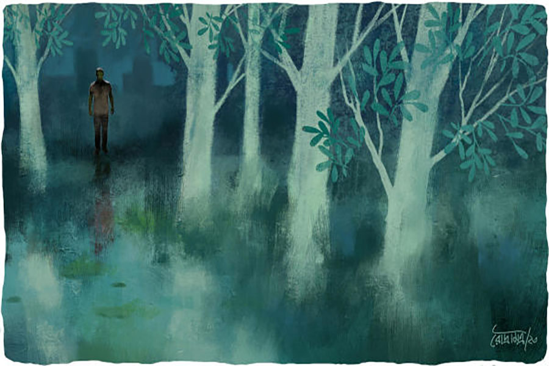

 
 <h1 align=center>মফস্‌সলের গল্প</h1>
<h2 align=center>সিজার বাগচী</h2> গুমোট গরম। সেই সঙ্গে লোডশেডিং। এমন পরিস্থিতিতে রাতে ঘুম আসবে না। তাই ছাদে উঠে এল আদিত্য। ছাদেও হাওয়া নেই। ঘুটঘুটে অন্ধকারে পাশের বাড়ির নারকেল আর সুপুরি গাছগুলো ভূতের মতো দাঁড়িয়ে। পাড়ার বাড়িগুলোও কিম্ভূত আকারের লাগছে। পাজামার পকেটে রাখা মোবাইল বার করে দেখল ও। সাড়ে বারোটা।

অনেক পরিবার রাত পর্যন্ত জেগে থাকে। কিন্তু এখন কোনও বাড়িতে আলো জ্বলতে দেখা গেল না। যেন এই নিঝুম অন্ধকারে একমাত্র ও-ই জেগে। আকাশের দিকে এক বার তাকাল। চাঁদ ওঠেনি। তারাও প্রায় নেই। পৃথিবীর অন্ধকার যেন আকাশেও ছড়িয়ে।

হাই তুলল আদিত্য। সারা দিন দৌড়োদৌড়ি গিয়েছে। ছোটমেসোর বাইপাস অপারেশন ছিল। মুকুন্দপুরের এক নার্সিংহোমে। ছোটমেসো-মাসির ছেলেমেয়ে নেই। মাসিও অথর্ব। যা ছুটোছুটি সব করেছে আদিত্য আর মেজোমাসির মেয়ে পাপড়ি।

অপারেশন যখন চলছিল, ওরা দু’জন বাইরে বসেছিল। সব ভালয়-ভালয় মিটে যাওয়ার পর ছোটমেসোকে যখন বেডে দেওয়া হল, দু’জনে তখন বিধ্বস্ত।

পাপড়ি বলল, “আমি বরং মাসির কাছে ঘুরে যাই। ওখানে রাতে থাকব। তুই বাড়ি যা। কাল সকালে চলে আসিস। আমার ঢুকতে বেলা হবে।”

তা-ই করল আদিত্য। মুকুন্দপুর থেকে উল্টোডাঙার বাস ধরল। সেখানে নেমে ট্রেন। পাড়ায় যখন ঢুকছে, তখনই দশটা বাজে। আদিত্য ভেবেছিল, বাড়ি ঢুকে স্নান করবে। তার পর ফ্যানের নীচে কিছু ক্ষণ বসে রেস্ট নেবে। পাড়ায় এসে টের পেল, লোডশেডিং। মুহূর্তে মেজাজ খিঁচড়ে গেল ওর।

সুদীপ্তর সঙ্গে দেখা।

আদিত্য জানতে চাইল, “কী হয়েছে রে?”

“ট্রান্সফর্মার পুড়ে গিয়েছে। আজ বোধহয় আর কারেন্ট আসবে না।”

“ঝড় নেই, বৃষ্টি নেই। এমনি এমনি হঠাৎ পুড়ে গেল?”

“যাবে না? ঘরে ঘরে এসি। বেশির ভাগ কানেকশনই তো ইলেকট্রিক অফিসের অনুমতি নিয়ে করা হয়নি। যেই সন্ধেবেলা সবাই এসি চালিয়েছে, অনেক বেশি লোড পড়েছে ট্রান্সফর্মারে, অমনি ফটাস।”

আদিত্য কথা বাড়াল না। পায়ে পায়ে বাড়ি ঢুকল।

ওর হাতে গামছা ধরিয়ে সুতপা বলল, “স্নানে যাও। ভাত বাড়ছি।”

চার্জেবল ব্যাটারির আলো আছে একটা। সেই আলোয় দু’জনে খেতে বসল। ভাত-ডাল আর কাঁচালঙ্কা-পেঁয়াজ দিয়ে আলুসেদ্ধ মাখা।

আদিত্য জিজ্ঞেস করল, “মাশুয়ে পড়েছে?”

ঘাড় নাড়ল সুতপা। বলল, “এ বার ইনভার্টার কেনো।”

আদিত্য সরাসরি জবাব দিতে পারল না। বিয়ের আগে-আগে বাড়ি মেরামতের জন্য ব্যাঙ্ক লোন নিতে হয়েছে। ইএমআই কাটছে মাসে-মাসে। অনেকগুলো টাকা। ইনভার্টার কেনার টাকা হাতে নেই। সুতপা এখনও কোনও চাকরি পায়নি। ও দিকে মা অসুস্থ। মাসে দু’হাজার টাকা যায় শুধু ওষুধের পিছনে। ডাক্তার দেখানোর খরচও আছে। আদিত্য চাকরি করে ডালহৌসিতে। ঝাড়খণ্ডের এক স্টিল কোম্পানির কলকাতা অফিসে। ভদ্রস্থ মাইনে। কিন্তু কোভিড-পর্বের পর থেকে কোম্পানির ব্যবসা গোঁত্তা খাচ্ছে। খবর উড়ছে, কোম্পানি কয়েক জনকে ছাঁটাই করবে। সবাই তাই খুব মন দিয়ে কাজ করছে। এমন পরিস্থিতিতে ছোটমেসোর অপারেশনের জন্য ওকে চার দিনের ছুটি নিতে হয়েছে। অনেকের শ্বশুরবাড়ির জোর থাকে। আদিত্যর তাও নেই। সুতপা বাড়ির অমতে বিয়ে করেছে।

রাতে খেয়ে ওঠার পর সুতপা ডাকছিল। আদিত্য সাড়া দিল না। সুতপা রেগে যাবে। কিন্তু ও খুব ক্লান্ত।

ছাদে বেশি ক্ষণ ঠায় দাঁড়ানোর জো নেই। মশার ঝাঁক। হাত-পা জ্বালিয়ে দেয়। আদিত্য পায়চারি করতে থাকল। তখনই চোখ পড়ল জায়গাটায়। থমকে গেল আদিত্য। ছাদ থেকে জায়গাটা দেখাচ্ছে মাঠের মতো। ঝকঝকে। মসৃণ। কিন্তু ও জানে, জায়গাটা মাঠ নয়। অন্তত মাস ছয়েক আগেও ছিল না। ওখানে একটা টলটলে পুকুর ছিল। সেই পুকুর প্রায় বুজিয়ে ফেলা হয়েছে। প্রোমোটারের লোকেরা যাতায়াত করছে। ওখানে বড় কমপ্লেক্স উঠবে।

চার পাশের অন্ধকার এ বার আদিত্যর ভিতরে ঢুকতে শুরু করল। জায়গাটার দিকে ও তাকিয়ে থাকল। ছোটবেলায় ওই পুকুরে প্রথম সাঁতার শিখেছিল। প্লাস্টিকের ড্রাম কোমরে বেঁধে বাবা ছেড়ে দিয়েছিলেন গলা জলে। সেই জলে হাত-পা ছুড়তে-ছুড়তে কখন যেন ওর শরীর ভেসে উঠেছিল। এগোতে শুরু করেছিল।

শেষে এমন হয়েছিল, রোজ স্কুলে যাওয়ার আগে আধ ঘণ্টা আদিত্য পুকুরের জলে হুটোপাটি করত। একা ও নয়, পাড়ার অন্য ছেলেরাও থাকত। সেই পুকুর কেমন নিঃশব্দে মুছে গেল পাড়ার মানচিত্র থেকে!

আদিত্যর মনে পড়ল, মাসছয়েক আগের কথা। তখনও ওর বিয়ে হয়নি। তোড়জোড় চলছে। সুতপার পরিবার বেঁকে বসেছে। সুতপা চাইছে বাড়ি থেকে বেরিয়ে আসতে। এমনই এক দিন অফিসে যাওয়ার আগে আদিত্য দেখল, পুকুরপাড়ে কয়েক জন ফিতে দিয়ে মাপামাপি করছে। তখন বিয়ের ঝামেলা। ও তাই আর ও ব্যাপারে মাথা ঘামায়নি।

সন্ধেবেলা বাড়ি ফিরতে মা বলেছিল, “জানিস, আজ সামন্তদের পুকুরপাড়ের গাছগুলো কাটা পড়ল।”

“মানে!” শুনে খুব অবাক হয়েছিল আদিত্য।

মা বললেন, “ও দিকটা বোধহয় ওরা বিক্রি করে দিয়েছে। আজ এসে দুটো আমগাছ, কাঁঠালগাছ, দুটো নারকেল গাছ কেটে নিয়ে গেল।”

কিছু ক্ষণ কোনও কথা বলতে পারেনি আদিত্য। অতগুলো গাছ কেটে ফেলল লোকগুলো!

দিনদুয়েকের মধ্যে জানা গেল, সামন্তরা শুধু ওই জমি নয়, পাশের পুকুরও বিক্রি করে দিয়েছে। অনেক দিন ধরে ওদের অবস্থা পড়তির দিকে। একে একে অনেক জায়গাজমি বিক্রি করেছে। শেষে এসে ঠেকেছিল পুকুর আর তার পাশের জমিতে। এ বার সেটাও গেল।

বাজারে গিয়ে ও আরও জানতে পারল, ওই পুকুর ভরাট করে কমপ্লেক্স উঠবে। করবে অনিন্দ্য কনস্ট্রাকশনস। খবর শুনে ওদের পাড়ার লোক যত ধাক্কা খেয়েছিল, এলাকার লোকেরা অবশ্য তত ধাক্কা খায়নি। অনিন্দ্য কনস্ট্রাকশনস আরও অনেক পুকুর ভরাট করে বড় বড় ফ্ল্যাটবাড়ি তুলেছে।

আদিত্য এই সব নিয়ে ভাবার সময় পায়নি। তখন সুতপাদের বাড়ির অশান্তি চরমে। এক দিন হঠাৎ সুতপার বাবা এবং জামাইবাবু এসে হাজির ওর অফিসে। তাঁদের বক্তব্য ছিল, আদিত্য যদি সুতপাকে ভালবাসে তা হলে যেন এই সম্পর্ক থেকে সরে দাঁড়ায়। তাঁরা আরও ভাল পাত্র জোগাড় করেছেন। পাত্র রিজ়ার্ভ ব্যাঙ্কে ভাল চাকরি করে।

সে ছিল চূড়ান্ত টানাপড়েনের পর্ব। ও দিকে পাড়াতেও পুকুর ভরাট নিয়ে শোরগোল শুরু হয়েছে। আদিত্য সেই ঝঞ্ঝাটে থাকতে পারেনি। খবর পেয়েছিল, হাবুলদা আর গুরুপদ হালদার মিলে এই পুকুর ভরাটের বিরুদ্ধে জনমত তৈরি করছে।

হাবুলদা দাঁড়িয়েছিল নীতির প্রশ্নে। গুরুপদবাবুর কিছু স্বার্থ ছিল। তাঁর বাড়ি ঠিক পুকুরের পিছনে। ওখানে কমপ্লেক্স উঠলে বাড়ির অনেকটা ঢাকা পড়ে যাবে।

তবু দু’জনের মধ্যে হাবুলদার তাগিদ বেশি ছিল। পাড়ার অনেককে জড়ো করছিল। পুরসভাকে চিঠি লিখেছিল। জনমত তৈরি করছিল। আইনজীবীর সঙ্গে কথা বলছিল। কিন্তু হাবুলদা বেশি দূর এগোতে পারেনি। এক রাতে অফিস থেকে বাড়ি ফিরছিল, আচমকা রাস্তায় কয়েক জন ঘিরে ধরেছিল। হাবুলদা কিছু বোঝার আগেই ওরা কিল-চড়-ঘুসি মারতে শুরু করেছিল। হাবুলদা গড়পড়তা চেহারার মানুষ। দু’-চার ঘা দিতে মাটিতে পড়ে যায়। তাতেও মারধর থামেনি। বরং একটা শাবল দিয়ে ওর ডান পায়ের মালাইচাকি ভেঙে দেওয়া হয়েছিল।

এক মাসের কাছাকাছি হাসপাতালে থাকতে হয়েছিল হাবুলদাকে। বাড়ি ফেরার পরও অনেক দিন অফিস যেতে পারেনি। থানা-পুলিশ হয়েছিল ঠিকই। সেটা রুটিনমাফিক। কেউ ধরা পড়েনি। কোনও সুরাহা হয়নি। হাবুলদা যখন সুস্থ হল, তখন পাড়ার লোকেরা দেখল মানুষটা সোজা ভাবে হাঁটতে পারছে না। ডান পা খুঁড়িয়ে চলতে হচ্ছে। হবেও বাকি জীবন।

গুরুপদবাবু অবশ্য হাবুলদাকে দেখেই শিক্ষা পেয়ে গিয়েছিলেন। তিনি ভেবেছিলেন মামলা করবেন। পরিবারের কথা ভেবে সেই রাস্তায় এগোননি। তবু নিয়মমতো তাঁর কাছেও এক জন গিয়েছিল। শাসিয়েছিল, বাড়াবাড়ি করলে ‘গাঁজা কেস’ দিয়ে দেবে। সেই থেকে গুরুপদবাবু প্রয়োজন না হলে বাড়ির বাইরে পা রাখেন না। ছেলেমেয়েকে সামলে রাখেন।

এর পর আর পুকুর ভরাটে কোনও বাধা আসেনি। প্রথমে কিছু দিন আবর্জনা ফেলা হল জলে। তাতে পুকুরের জল থেকে পচা গন্ধ বেরোতে শুরু করল। তার পর মাটি, বালি, ইট-বালি-সিমেন্টের ভাঙা টুকরো ফেলা হতে লাগল। চাপা পড়তে থাকল পুকুরটা। আরও মাটি পড়ল। এখন সেই পুকুর ভরাটের কাজ শেষের দিকে। বোধ হয় মাসখানেক বাদে কাজ শুরু হবে।

হাবুলদার সঙ্গে মাঝে এক দিন দেখা হয়েছিল আদিত্যর। তখন ও সদ্য বিয়ে করেছে। গ্যাংটক যাবে হনিমুনে। হাবুলদা বাজার করে ফিরছিল। ডান পা টেনে-টেনে। মুখোমুখি হলে অল্প হাসতেই হয়। আদিত্যও হেসেছিল।

হাবুলদা কিন্তু হাসেনি। একটু থমথমে গলায় বলেছিল, “ভয় পেয়ে পিছিয়ে গেলি?”

এমন কথার জবাব হয় না। আদিত্যও গুটিয়ে গিয়েছিল। হাবুলদা অবশ্য কথা বাড়ায়নি।

এখন অন্ধকারে দাঁড়িয়ে ওই ভরাট পুকুরের দিকে তাকিয়ে খুব রাগ হতে থাকল ওর। কার উপর রাগ? নিজের? পাড়ার লোকেদের আচরণে? না কি পুরো পরিস্থিতির উপর? ঠিক বুঝতে পারল না আদিত্য। তবে সারা দিনের ধকল যেন রাগ হয়ে ফেটে পড়তে চাইল। সে দিন ওরা যদি গিয়ে দাঁড়াত হাবুলদা কিংবা গুরুপদবাবুর পাশে, তা হলে কী হত? গোটা পাড়ার মালাইচাকি ভেঙে দিত? এত জন লোককে গাঁজার কেস দিত?

ঘরে থাকতে পারল না আদিত্য। মা নিজের ঘরে ঘুমিয়ে। পাশের ঘরে সুতপা। ছাদ থেকে নিঃশব্দে নেমে ও বাড়ির বাইরে এল। গেট খুলে হাঁটতে-হাঁটতে গিয়ে দাঁড়াল পুকুরের ধারে। এখন নামেই পুকুর। আসলে মাঠ। মাসখানেক বাদে কমপ্লেক্স হবে। তখন অন্ধকার আর থাকবে না। চার দিকে শুধু আলো আর আলো।

হঠাৎ একটা কথা ওর স্মরণে এল। প্রায় মাস দশেক আগে সুতপা এসেছিল ওদের বাড়িতে। প্রথম বার। তখন এই পুকুরের ধারে দাঁড়িয়ে ওর কয়েকটা ফোটো তুলেছিল। পকেট থেকে মোবাইল বার করে দেখল ও। হ্যাঁ, ফোটোগুলো এখনও ঠিকঠাক রাখা। কেমন হয় যদি সেই ফোটোর পাশাপাশি পুকুরটার এখনকার ফোটো তুলে, দুটো ফোটো ফেসবুক এবং ইনস্টাগ্রামে ছড়িয়ে দেয়? কিছু কাজ হবে? গড়ে উঠবে কোনও জনমত? এলাকার লোকেরা হয়তো অনিন্দ্য কনস্ট্রাকশনসের বিরুদ্ধে যেতে ভয় পাচ্ছে। বাকি জায়গার মানুষজনেরা? তাঁরা হাত বাড়িয়ে দেবে না? না কি সেখানেও এখন লোডশেডিং?

পকেট থেকে মোবাইল বার করে ও ক্যামেরার নাইট মোড অন করল। তুলতে লাগল ভরাট হয়ে যাওয়া পুকুরের ফোটো। এক পাশে অনিন্দ্য কনস্ট্রাকশনসের ছোট্ট বোর্ড টাঙানো। সেটার ফোটোও তুলল।

আচমকা পিছনে খসখস আওয়াজ। চমকে উঠল আদিত্য। এত রাতে কে? নাইটগার্ড রেখেছে না কি? কিংবা সেই দলবল, যারা এমনই গভীর রাতে পিটিয়েছিল হাবুলদাকে?

একটা ছায়ামূর্তিকে দেখা গেল অন্ধকারে। সজাগ হল আদিত্য। যুক্তি সাজাতে চাইল, নাইটগার্ড এলে কী বলবে। ছায়ামূর্তি আরও কাছাকাছি আসতেই ও দেখল, মানুষটা ডান পা টেনে-টেনে হাঁটছে।

অস্ফুটে আদিত্য বলল, “হাবুলদা! এখন? এখানে?”

হাবুলদা এসে দাঁড়াল। দীর্ঘশ্বাস ফেলে বলল, “প্রতি রাতেই আসি। এত বড় পুকুর। পাড়ার এত বড় সম্পদ। চোখের সামনে শেষ হয়ে গেল! কিচ্ছু করতে পারলাম না। তোরাও আর কেউ এগিয়ে এলি না।”

তার পর হাবুলদার চোখ পড়ল আদিত্যর হাতের দিকে। অবাক হয়ে বলল, “মোবাইল নিয়ে কী করছিস?”

ইতস্তত করে আদিত্য বলল, “ছবি তুললাম। ভাবছি, সোশ্যাল মিডিয়ায় পোস্ট করব। সব ঘটনার কথা যতটা সম্ভব লিখব। তার পর যা হওয়ার হবে।”

হাবুলদা চট করে কথা বলতে পারল না। খানিক বাদে বলল, “জানিস, থানায় গিয়েছিলাম তখনই। বড়বাবু সব কথা শুনে বলেছিলেন, ‘কেন ঝামেলায় যাচ্ছেন! ওদের হাত অনেক লম্বা। আপনি-আমি কিছু করতে পারব না। বরং মেনে নিন।’ মেনে নিতে পারিনি। দেখ, তার শাস্তি সারা জীবন বইতে হবে।”

“তুমি কি আমাকে বারণ করছ?” আদিত্য সরাসরি প্রশ্ন করল।

হাসল হাবুলদা। মাথা নেড়ে বলল, “না রে। বরং ভরসা পাচ্ছি। বড়বাবু শুধু ওদের লম্বা হাত দেখেছেন। আমাদের মতো সাধারণ মানুষের হাতও যে কত লম্বা, সেটা ওই চেয়ারে বসে তিনি দেখতে পাননি। চেয়ার অবশ্য অনেক কিছু দেখতে দেয় না।”

আদিত্য চুপ করে গেল।

হাবুলদা নিজের মনেই বলতে থাকল, “রোজ রাতে যখন এখানে আসার জন্য বেরোই, তোর বৌদি রাগারাগি করে। বলে, ‘এখনও শিক্ষা হল না?’ কোনও জবাব দিতে পারি না। সত্যিই তো, পাড়ায় এত বাড়ি। এত লোকজন। কারও এক বারও মনে হচ্ছে না, চোখের সামনে কত বড় অন্যায় হয়ে চলেছে? বাঁকতে বাঁকতে তো আমাদের শিরদাঁড়া এ বার কুকুর-ছাগলের মতো হয়ে যাবে।”

আদিত্যর মাথা হেঁট হয়ে গেল।

ওর কাঁধে হাত রেখে হাবুলদা বলল, “আজ তোকে দেখলাম। আর ভয় নেই। আজ তুই এসেছিস। কাল বাকিরা আসবে। এখন রাতের অন্ধকারে আসবে। পরে দিনের আলোয় আসবে।”

আদিত্য কিছু বলতে যাচ্ছিল, হঠাৎ সারা পাড়ায় আলো জ্বলে উঠল। তখন বোঝা গেল, পাড়ার অনেকেই জেগে আছে। আলো না-থাকায় সেটা ধরা যাচ্ছিল না। এক-দু’বাড়ির লোকজন বারান্দায় বেরিয়েও এল। তারা দেখতে পেল আদিত্য আর হাবুলদাকে। দু’জনে তখন আগামী কর্তব্যের পরিকল্পনা করছে।

“গুরুপদবাবুকে পেয়ে যাব। তুই বাপ্পার সঙ্গে কথা বল।”

“বাপ্পা রাজি হবে যদি অনি এগিয়ে আসে।”

“অন্তত তিরিশ জন না হলে হবে না। ওরা তো ছেড়ে কথা বলবে না। ওদের অনেক ক্ষমতা...”

আলো বিছানো রাস্তা ধরে কথা বলতে-বলতে দু’জন এগিয়ে চলল।