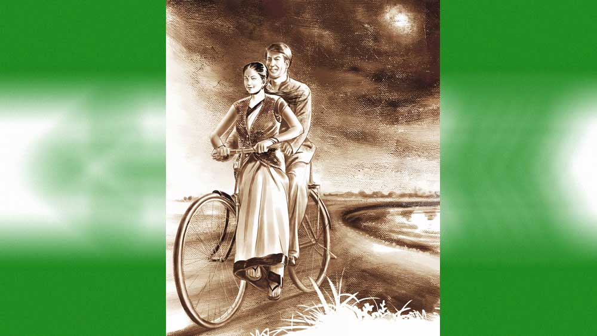

 

<h1 align=center>মরা জ্যোৎস্না</h1>
<h2 align=center>বাসুদেব মালাকর</h2>
এখনও মাঝে মাঝে কাঁধের ব্যথার জায়গাটা চিনচিন করে ওঠে। অমাবস্যা পূর্ণিমার সঙ্গে ব্যথার যোগ আছে কি না, সুগত জানে না। তবে ভারী ব্যাগ বেশি ক্ষণ কাঁধে রাখলে কষ্ট হয়। ডাক্তার বলেছিলেন, ক্ল্যাভিকল নামের হাড়ে আঘাতের জন্যই এটা হয়েছে। সুগত গুরুত্ব দেয়নি। ভাবতে বসলে তার মনে হয়, ব্যথাটা তার নিজস্ব অর্জন! এটা যত দিন থাকবে, জীবনের একটা ছোট্ট পর্ব ভুলবে না সে। দিনটা ছিল পূর্ণিমা, দোলপূর্ণিমা।   সুগত তখন কলেজের শেষ পরীক্ষা দিয়ে রেজ়াল্টের অপেক্ষায়। তাদের পাড়াটা খুব প্রাচীন। বাড়িগুলো পুরনো, শেওলাধরা। বাড়ির সামনের উঠোনগুলোও ঘাসে আগাছায় ঢাকা। সব কেমন ফ্যাকাশে, বিবর্ণ।   এই একঘেয়ে বর্ণহীনতার ভিতরে এক দিন পাড়ার শেষ দিকে, রায়বাড়িতে কয়েকটি নতুন মুখের আগমন ঘটল। বাড়িটা অনেক দিন খালিই পড়ে ছিল। বেলাঠাকুমা নামে এক বৃদ্ধা থাকতেন শুধু। তাঁর ছেলেমেয়েরা চার দিকে ছড়িয়ে ছিটিয়ে গেলেও তিনি শ্বশুরের ভিটে ছাড়েননি। সেই শূন্য বাড়িতে এক ঘর ভাড়াটে এসে উঠল। তিন জনের পরিবার। স্বামী-স্ত্রী আর সতেরো আঠারো বছরের একটি মেয়ে। তখন ফাল্গুন মাস। ক’দিন পরেই দোল। বাতাবিলেবু গাছে ফুল ফুটেছে, আমগাছেও মুকুল এসেছে।   সুগত সাইকেল নিয়ে ঘুরে বেড়ায়। তার তেমন কাজকর্ম নেই। দাদা অফিসে চলে যাওয়ার পরে বৌদি সংসারের কাজে ব্যস্ত হয়ে পড়ে। মা সাহায্য করে। বাবা খবরের কাগজ, বইপত্রে ডুবে থাকেন। সপ্তাহে দু’দিন বিকেলে জিম ছাড়া তার নিয়মিত কিছু রুটিন আপাতত নেই। সুগত তখন সাইকেল নিয়ে বেরিয়ে পড়ে। বন্ধুদের বাড়ি, স্কুলের পিছনের মাঠ, খেয়াঘাটের পাশে মন্টুর দোকানে আড্ডা দিয়ে বেলা করে বাড়ি আসে।   এক দিন রায়বাড়ির সামনে নিজে থেকেই তার সাইকেল স্লো হয়ে গেল। এক পা মাটিতে ঠেকিয়ে দেখল, অনেক দিন পর বাড়ির উঠোনের দড়িতে জামাকাপড় মেলা। চার দিক সাফসুতরো। ছোটবেলায় তারা এখানে লুকোচুরি খেলত।   হঠাৎ সুগত দেখল, ঘর থেকে একটি মেয়ে বারান্দায় বেরিয়ে তাকে দেখতে পেয়েই আবার ঘরে চলে গেল। কী কাণ্ড! কোন যুগের মেয়ে! একটা প্রায় সমবয়সি ছেলেকে দেখে লুকিয়ে পড়ল! মরুক গে। থাকো তুমি তোমার ঘ্যাম নিয়ে! ভাবতে ভাবতে সুগত এগিয়ে গেল।   ঘ্যাম নেওয়ার মতো সুন্দরী না হলেও, সুগত যতটুকু দেখেছিল, তাতে মনে হয়েছিল, তুচ্ছ করার মতোও নয়! মাথায় বেশ লম্বা, গায়ের রং ফর্সার দিকে।   দুপুরে খেতে খেতে বৌদিকে বলল, “জানো বৌদি, রায়বাড়িতে এত দিনে মানুষের সাড়া পেলাম।”   বৌদি নন্দিতা অবাক হয়ে বলল, “ওই ভূতের বাড়িতে মানুষ! ইমপসিবল! ভূত-ফুত হবে হয়তো।”   সুগত বলল, “আরে না! দুপুরবেলা ভূত আসবে কোত্থেকে! মনে হল, একটা ফ্যামিলি ভাড়াটে হিসেবে এসেছে।”   নন্দিতা বলল, “তুই ভিতরে ঢুকেছিলি না কি?”   সুগত বলল, “না, রাস্তা থেকে দেখলাম। উঠোনে অনেকগুলো জামাকাপড় মেলে দেওয়া। একটা মেয়েকে দেখলাম বারান্দায়।”   নন্দিতা চোখ সরু করে বলল, “মেয়ে! বয়স কত?”   সুগত বলল, “এক ঝলক দেখে বয়স বোঝা যায় না কি!”   নন্দিতা ঠাট্টা করে বলল, “যায় না বুঝি? কিন্তু এটা যে বড় খবর, তা বুঝতে অসুবিধে হয় না!”   সুগত রেগে বলল, “তোমাকে কিছু বলাই ঝকমারি! আর কিচ্ছু বলব না। বুড়ি এক মহিলা! হয়েছে তো?”   নন্দিতা ছদ্ম সহানুভূতির স্বরে বলল, “আহা রে! এত উঁকিঝুকি দিয়ে কিনা এক বয়স্কার সাক্ষাৎ মিলল!”   সুগতর সব কথাই নন্দিতার সঙ্গে। দু’জনে বন্ধুর মতো। নন্দিতা শক্ত ধাতের মেয়ে। কিন্তু দেবরটির উপর কোমল-কঠোর মনোভাব। মায়ের চেয়েও সে সুগতর বেশি গার্জিয়ান!   আর ক’দিন পরেই দোলপূর্ণিমা। বিদায়ী শীতের চলার গতি মন্থর। ভোররাতে চাদর গায়ে দিতে হয়। হালকা কুয়াশার সর পড়ে চরাচরে। দোলে রং মাখা এবং মাখানোয় বরাবর অনীহা সুগতর। কেউ আবির দিলে আপত্তি করে না। কিন্তু গোলা রঙের সঙ্গে তার ঘোরতর আড়ি!   দোলের দিন ওরা চার-পাঁচ বন্ধু মন্টুর দোকানেই দুপুরটা কাটিয়ে দেয়। প্রীতমদের বাড়িতে সিদ্ধি বাটা হয়। অল্প সিদ্ধি, খুব নেশা হয় না, ঝিমঝিম ভাব আসে। তেমনই ঝিমঝিমে দুপুরে সাইকেল চালিয়ে বাড়ি ফিরতে গিয়ে সুগত এক ঝামেলায় পড়ে গেল।   *****   ওদের এলাকা ছাড়িয়ে খালপাড়ের দিকে সকাল থেকেই লাগামছাড়া রং মাখামাখি শুরু হয়েছিল। বেলুন, পিচকিরি, ড্রেনের জল, গোবরজল, বাঁদুরে রং নিয়ে মহা দৌরাত্ম্য। ও দিকটা মূল শহরের বাইরে।   দোলের দিন সেই পাড়ারই কয়েকটা ছেলে চিৎকার করতে করতে পাড়ায় ঢুকে পড়ল। রং মেখে কিম্ভূত সবাই। নেশাগ্রস্ত। মুখে অশালীন ভাষা। রায়বাড়ির সামনে তাদের হইচই শুনে সেই মেয়েটি বোধহয় বাইরে এসেছিল। তাকে দেখেই ছেলেগুলো ছুটে গিয়ে চড়াও হল। মেয়েটি ঘটনার আকস্মিকতায় পালানোর অবকাশ পায়নি।   মুখ চেপে ধরে যথেচ্ছ নির্যাতন করে, মেয়েটির পোশাক ছিঁড়ে ফেলার চেষ্টা করছিল তারা। সেই সময় সুগত ফিরছিল রাস্তা দিয়ে।   “এই, এই! কী করছিস তোরা!” বলে সাইকেলটা ফেলেই সে ছুটে গিয়ে ঝাঁপিয়ে পড়ল ওদের উপরে। তার ব্যায়াম করা বলিষ্ঠ শরীর। সে কয়েকটাকে ছিটকে ফেলে দিল। ওদের এক জন কাপড় মেলার দড়ির বাঁশ তুলে সুগতর মাথায় মারতে গিয়েছিল, ঠিক সময়ে মাথা সরিয়ে নেওয়ায় আঘাত পড়ল তার কাঁধে। সুগত বসে পড়তেই ওরা দৌড়ে নিজেদের পাড়ার দিকে চলে গেল।   এই নিয়ে ঘোরতর গোলমাল শুরু হল। সুগতর খুড়তুতো দাদা দলবল নিয়ে ও-পাড়ায় গিয়ে খুঁজে দেখল। কাউকেই পাওয়া গেল না। থানা-পুলিশ হল। পুলিশ অফিসার সুগতর স্টেটমেন্ট লিখে নিয়ে গেলেন। মেয়েটির পরিবার পাড়ায় নতুন— কাউকে চেনে না। কারও নামে অভিযোগ লেখা গেল না।   নন্দিতা ডাক্তারখানায় নিয়ে গেল সুগতকে। ডাক্তারবাবু কাঁধের এক্স-রে করাতে বললেন। মুখে বললেন, “মনে হয়, কলার বোনে চিড় ধরেছে। ভাঙলে আরও অসহ্য যন্ত্রণা হত।”   কাঁধ-বুক-পিঠ জড়িয়ে মোটা করে ক্রেপ ব্যান্ডেজ দিয়ে বললেন, “দু’সপ্তাহ ফুল বেড রেস্ট।”   দু’দিন পরে এক বিকেলে মাকে সঙ্গে নিয়ে মেয়েটি খুঁজে খুঁজে সুগতদের বাড়িতে এল। নন্দিতা পরিচয় জেনে সুগতর কাছে নিয়ে গেল ওদের। মেয়েটি নাম বলল, নিমগ্না। ওর মা সুগতকে বললেন, “তোমাকে কী বলে যে ধন্যবাদ দেব, বাবা। তুমি ওর মান বাঁচিয়েছ। তোমার ঋণ শোধ হওয়ার নয়!”      *****   মন্টুর দোকানের সামনে খেয়াঘাট। ও পারে বালিয়াড়ি। সূর্যাস্তের নরম আলোয় নদীর জলে কেউ যেন আবির ঢেলে দেয়। গাঙচিলেরা গাছে ফিরে যায়। মন্টুর দোকানে আলো জ্বলে ওঠে। নিমগ্না তখনও বালিয়াড়িতে হাঁটুর উপরে মুখ রেখে বসে থাকে। সুগত তাড়া দেয়, “এই, উঠবে না? এর পর খেয়া বন্ধ হয়ে যাবে!”   নিমগ্না উত্তর দেয়, “হোক বন্ধ! তুমি তো পাশে আছ!”   মহাপাগলের পাল্লায় পড়া গেছে, ভেবে সুগত অপেক্ষা করে। সন্ধ্যা গাঢ় হয়ে আসে, আবির মুছে নদীর জলে কালি মিশে যায়।   সুগতর সাইকেলে দূরদূরান্ত পাড়ি দেয় দু’জনে। টাউন হলের নাট্যোৎসবে এক সঙ্গে নাটক দেখে।   নাটক দেখতে দেখতে কানে কানে কী একটা বলতে গিয়ে নিমগ্নার আলগা চুল সুগতর নাকে সুড়সুড়ি দেয়। হাঁচি আটকানো যায় না।      নন্দিতার প্রাণের বন্ধু পাশের বাড়ির তাপসীবৌদি। তাকে নিয়ে সে দিন ম্যাটিনি শো-এ ‘কয়ামত সে কয়ামত তক’ দেখতে গিয়েছিল নন্দিতা। বাড়ি ফিরল থমথমে মুখে। সুগতকে ডেকে বলল, “শোন, তোকে একটা কথা বলব।”   নিমগ্নাও ম্যাটিনি শো-এ সিনেমা দেখতে গিয়েছিল আজ। সঙ্গে এক যুবক। সুগতর মতো না হলেও চেহারা খারাপ নয়। ফিটফাট। ঘন হয়ে দাঁড়িয়ে দু’জনে খুব কথা বলছিল হেসে হেসে। আইসক্রিম খাচ্ছিল। এক ফোঁটা ছেলেটির জামায় পড়তে নিমগ্না মুছে দিয়েছিল নিজের রুমাল দিয়ে। মেয়েরা মেয়েদের চোখের ভাষা বোঝে। নন্দিতাও বুঝেছিল।   সুগত জিজ্ঞেস করেছিল, “তোমায় দেখতে পায়নি?”   নন্দিতা বলল, “মাথায় ঘোমটা দিয়ে সানগ্লাস পরে তাপসীর আড়ালে ছিলাম। কাছে যাইনি। তুই একটু খোঁজ নিয়ে দেখিস তো।”   খোঁজ নিয়েছিল সুগত। বৌদির ইনফর্মেশনে ভুল ছিল না। রাতুল ওদের কলকাতার টিকিট কেটে ট্রেনে উঠতে দেখেছে। কাউন্টারে ওদের পিছনেই ছিল রাতুল। আরও অনেকেই দেখেছে, অনেক বার।   দু’সপ্তাহ পরে সুগতর কাঁধে আর ব্যান্ডেজ নেই। দাড়ি বড় হয়েছে, গা ভিজিয়ে স্নান করা হয়নি— নন্দিতা মাথা ধুইয়ে দিয়েছে। সেই সময় এক দিন নিমগ্না দেখা করতে এল। সুগত তেতে ছিল। তার কথা শুনে নিমগ্না বলল, “এ মা! ও আমার খুড়তুতো বৌদির ভাই। থাইল্যান্ডে চাকরি করে। এখানে বেড়াতে এসেছিল। জাস্ট ফর্মালিটিটুকুই করেছি। তুমি এত কিছু ভেবে নিয়েছ! আমার উপর বিশ্বাস নেই তোমার?”   সুগত কেটে কেটে বলল, “শোনো, আমি খুব ব্যাকডেটেড অর্থোডক্স। যাকে ভালবাসি, তার পাশে একটা কুকুরের ছায়াও দেখতে চাই না। আমিও কারও পাশে ছায়া হতে চাই না। দু’নৌকোয় পা রাখা আমি মেনে নেব না। তোমার এক বারও মনে পড়ল না, ওই ওই জায়গায় আমরা কত বার গিয়েছি, হেঁটেছি? বেটার, তুমি থাইল্যান্ডেই সেটল করো! আর এসো না।”   নিমগ্না মাথা নিচু করে রইল।   বেরনোর সময় নন্দিতার ঘরে উঁকি দিয়ে বলল, “বৌদি, আসছি।”   নন্দিতা বলল, “দাঁড়াও, কথা আছে। ভালবাসায় অনেক শর্ত থাকে। একনিষ্ঠ হতে হয়, লোভ সামলাতে হয়, মাছি তাড়ানো শিখতে হয়। মনকে টুকরো টুকরো করে যারা বিলিয়ে দেয়, হয় তারা খেলুড়ে, নয় তো মানসিক ভাবে অসুস্থ। তোমাকে কী করে বিশ্বাস করব?”   নিমগ্না বলল, “বৌদি, আমি সত্যিই চাইনি এ সব। কিন্তু মা-বাবা ওকে হাতছাড়া করতে চায় না!”   নন্দিতা বলল, “তবে তো হয়েই গেল! তুমি আর সুগতর সঙ্গে মিশো না। তাতে ওই ছেলেটির উপরে অন্যায় করা হবে।”   নিমগ্না চলে গেলে নন্দিতা সুগতর ঘরে ঢুকে বলল, “তোর ভীষণ কষ্ট হচ্ছে, জানি। ভালবাসার জন্য কোনও কিছুই অন্যায় নয়। কিন্তু ভালবাসাটা যেন অপাত্রে না পড়ে। ভালবাসা মানে পৌরুষ বিসর্জন দেওয়াও নয়।”   এর কয়েক মাস পরেই নিমগ্নারা রায়বাড়ি ছেড়ে দিয়ে উঠে গেল।   *****   সুগতর অবসর নিতে এখনও বছর আটেক বাকি। এই সময়ই চাপটা বেশি পড়ে। প্রমোশন দিয়ে মুর্শিদাবাদের এক অজগাঁয়ে অফিস-ইনচার্জ করে ঠেলে দেওয়া হয়েছে তাকে।   বাজারের ভাতের হোটেলে খাওয়া, অফিসের এক ছোট্ট ঘরে রাত্রিযাপন। সব চেয়ে কাছের শহর ত্রিশ কিলোমিটার দূরে। সুগত কাছাকাছি একটা ভদ্রস্থ থাকার জায়গা খুঁজছিল।   অফিসের ফোর্থ ক্লাস স্টাফ একটি মেয়ে। বয়স আঠাশ-উনত্রিশ বছর। বিয়ে হয়নি। শ্যামলা, স্লিম। শান্তশিষ্ট, অনুগত। নাম সঞ্চিতা। দু’-তিন কিলোমিটার দূরে থাকে। বাবা অন ডিউটি মারা যাওয়ার পরে কম্প্যাশনেট গ্রাউন্ডে চাকরি পেয়েছে মেয়েটা। ওর বাবা কলকাতার অফিসে পিওন ছিলেন।   সেই সঞ্চিতা এক দিন বলল, “স্যর, আমাদের বাড়ির কাছে একটা খালি বাড়ি আছে। মালিক বহরমপুরে থাকেন। তিনি ভাড়াটে খুঁজছেন। চাবি রেখে গিয়েছেন আমাদের কাছে। বাড়িটা এক বার দেখতে পারেন।”      সামনেই দোল। মার্চ মাস। ইয়ার এন্ডিং-এ প্রচুর কাজ। দোলে বাড়ি যাওয়া যায় না। একশো কিলোমিটার ঠেঙিয়ে বাড়ি গিয়ে ছত্রিশ ঘণ্টা পরেই আবার অফিসে ছোটা কষ্টকর। সুগত সঞ্চিতাকে বলে দোলের দিন সেই ঘর দেখতে যাওয়া ঠিক করল।   সুন্দর পরিবেশ। আমবাগান, ধানখেত পার হয়ে শান্ত নিরিবিলি গ্রাম। পথের উপর রং খেলার চিহ্ন—আবির, ভিজে মাটিতে রঙের দাগ।   বাড়ি দেখে সুগতর পছন্দ হল। সুগত ঘুরে ঘুরে চার পাশটা দেখছিল। সঞ্চিতা চাবি আনতে গিয়েছে।   ফেরার পথে সঞ্চিতা বলল, “স্যর, আমাদের বাড়িতে আসবেন না? খুব ভাল লাগত আমাদের!”   সুগত হেসে বলল, “বলছ? চলো তা হলে। তোমাদের গ্রাম খুব সুন্দর।”   বড় একটা গাম্বুলগাছের ছায়ায় মলিন একতলা বাড়ি। বারান্দার মেঝের প্লাস্টার উঠে সুরকি বেরিয়ে পড়েছে। বারান্দায় চেয়ার পেতে সুগতকে বসতে দিল সঞ্চিতা। মাকে ডেকে এনে বলল, “আমার মা।” বাড়িটার মতোই মলিন চেহারা মহিলার। পরনের শাড়িটা পরিষ্কার, কিন্তু পুরনো। সুগত শালীনতা ভুলে পূর্ণদৃষ্টিতে দেখল মহিলাকে।   ফেরার সময় খানিকটা পথ সঞ্চিতা সুগতর সঙ্গে এল। সুগত জিজ্ঞেস করল, “তোমার বাবা কি কখনও থাইল্যান্ডে চাকরি করতেন?”   সঞ্চিতা একটু কিন্তু-কিন্তু করে বলল, “অচেনা লোকদের সে রকমই বলত। আসলে— মায়ের কাছে শুনেছি— বেশি ইনকামের লোভে ছুটি নিয়ে মালপত্র আনার কেরিয়ার হয়ে বিদেশে যেত!... মাকে ঠকিয়েছিল বাবা। মা-ও বোকা ছিল!”   সুগত প্রশ্ন করল, “মারা গেলেন কী করে?”   সঞ্চিতা বলল, “খুব ড্রিঙ্ক করত, লিভার সিরোসিস হয়েছিল।”   আঁধার ঘন হয়ে আসছে ক্রমে। আজ দোলপূর্ণিমা। পুব দিগন্তে রুপোর বলের মতো চাঁদ। কিন্তু জ্যোৎস্নার আলোটুকু যেন ম্লান। কাঁধের পুরনো ব্যথাটাও তো আজ টের পাওয়ার কথা! কিন্তু কী আশ্চর্য, সুগত টের পেল, ব্যথাটা একটুও মালুম হচ্ছে না আজ! শুধু গলার কাছটা একটু চিনচিন করছে।   সুগত সিদ্ধান্ত নিল, বাড়িটা সে ভাড়া নেবে না।
