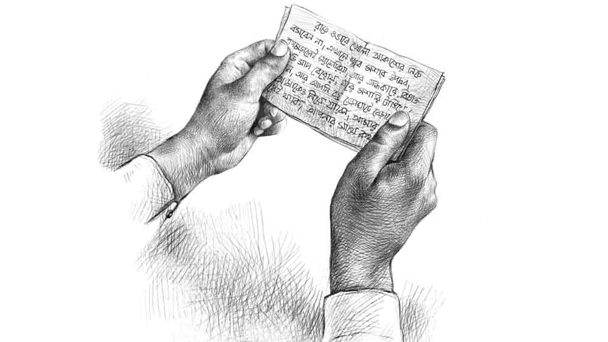

 

<h1 align=center>Short Story: মশা</h1>
<h2 align=center>দুলালেন্দু সরকার</h2>
একটা মশা কানের কাছে গুনগুন করছে। হাত দিয়ে তাড়াল ঋষি। খানিক ক্ষণ বাদে মশাটা অন্য কানে এসে গুনগুন শুরু করল। সে আবার তাড়াল। মশাটা কিন্তু গেল না। নাকের কাছে এসে ঘুরপাক খেতে লাগল। এ বার দু’হাতের তালি বাজিয়ে মশাটাকে মারার চেষ্টা করল। মশাটা মরল না, তবে উড়ে পালাল।   চাকরি থেকে অবসর নিয়েছে ঋষি। তা প্রায় বছর দশেক হতে চলল। এখনও সে চুলে কলপ করে। নিয়ম করে সকালে বিকেলে হাঁটে। পরিমিত আহার করে। দুপুরে খেয়ে একটু ঘুমোয়। রাতে অনেক ক্ষণ জেগে থাকে। ওই সময় সে ছাদে আসে। আকাশ দেখতে সে খুব ভালবাসে। শীতের আকাশ, গ্রীষ্মের আকাশ, বর্ষার আকাশ। এক-এক ঋতুতে এই আকাশের রূপ বদলে যায়। সে চেয়ারে বসে থাকে। সেই পঁচিশ বছর আগে ব্যাঙ্ক থেকে লোন নিয়ে এই দোতলা বাড়িটা করেছে। অনেক গাছ লাগিয়েছে টবে। তবে পরিচর্যার অভাবে এদের চেহারা মলিন। কিছু ফুলগাছ আছে। আজ যেমন অ্যাডেনিয়াম গাছে অজস্র ফুল ফুটেছে। চাঁদের আলোয় বেশ দেখতে লাগছে। আর তখনই মশাটা কানের কাছে এসে বিরক্ত করতে শুরু করল।   ব্যাঙ্কে চাকরি করত ঋষি। শুরুটা বেশ মজার হয়েছিল। প্রথম পোস্টিং ছিল জবলপুরে। মধ্যপ্রদেশে। ওখানেই সে বাড়ি ভাড়া করে থাকত। মাসখানেকের মধ্যে সে হিন্দি ভাষাটা রপ্ত করে নেয়। ছুটির দিনে সে চলে যেত কাছাকাছি ভেড়াঘাটে। নর্মদা এখানে তার উচ্চগতি সম্পন্ন করে ঝাঁপিয়ে পড়েছে সমতলে। সৃষ্টি হয়েছে এক অপূর্ব জলপ্রপাতের। গুঁড়ো গুঁড়ো জলকণা কুয়াশার মতো ছড়িয়ে পড়ছে চারিদিকে। সেখানে উড়ছে অসংখ্য পাখি। এই জলপ্রপাত ধুঁয়াধার নামে বিশ্বে সুপরিচিত।   বাড়ি ফিরে সে রান্না করে খেত। তার পর রাত গড়ালে গিয়ে বসত খোলা আকাশের নীচে। অনেক দূরে অদৃশ্য পাহাড় সারি। সে দিকেই তাকিয়ে থাকত। আকাশের রং বদল দেখত। অনেক রাতে ঘরে ঢুকে ঘুমিয়ে পড়ত। এক দিন ঘুম থেকে উঠে সে অনুভব করল তার সারা গায়ে ব্যথা। বেশ কাঁপুনি লাগছে। সে আবার শুয়ে পড়ল। অফিস গেল না। ডাক্তার দেখিয়ে ওষুধ খেল। তবুও জ্বর গেল না। রক্ত পরীক্ষা হল। ম্যালেরিয়া ধরা পড়ল। তার পর সাত দিন বিছানায় কাটিয়ে সুস্থ হয়ে অফিসে গেল ঋষি।   ঋষি যে বাড়িটায় ভাড়া থাকত, সেখানে আরও অনেক পরিবার ভাড়া থাকত। বাড়ির মালিক থাকতেন দোতলায়। ঋষির পাশের ঘরটায় সুরেশ দুবে নামে এক ভদ্রলোক ফ্যামিলি নিয়ে থাকতেন। তাঁদের এক ছেলে এক মেয়ে। ছেলেটি ছোট। মেয়েটি উচ্চ মাধ্যমিক দেবে। সুরেশবাবু স্থানীয় একটি কলেজে প্রফেসর। তাঁরাই এই সাত দিন ঋষিকে দেখাশুনো করেছেন। ডাক্তার দেখিয়ে ওষুধ এনে দিয়েছেন। সময় মতো খেতে দিয়েছেন। ঋষি তাই সুরেশবাবুদের কাছে কৃতজ্ঞ।   ঋষি ক্যাশে কাজ করত। এক দিন একটি মেয়ে দশ হাজার টাকা জমা দিতে এসেছে। একশো টাকার বান্ডিলটি সে গুনে দেখে একটি নোট বেশি। সে দ্বিতীয় বার গুনতে গিয়ে লক্ষ করে একশো টাকার নোটের আকারে একটা কাগজ কেটে সেখানে রাখা রয়েছে। সে কাগজটা বার করে মেয়েটিকে দিতে গেল। মেয়েটি সামান্য হেসে বলল, “ওটি আপনার। রেখে দিন।”   ছোট্ট একটা চিঠি। তাতে লেখা রয়েছে, “রাতে ও ভাবে খোলা আকাশের নীচে বসবেন না। এখানে খুব মশার উপদ্রব। কামড়ালেই ম্যালেরিয়া। আর অন্ধকারে বিষাক্ত পাহাড়ি সাপ বেরোয়। ঘরে মশারি টাঙিয়ে শোবেন। আর আপনি বড্ড ভেড়াঘাটে বেড়াতে যান। এক দিন আমাকেও নিয়ে যাবেন। আমার নাম নীতা। আপনার পাশের ঘরেই থাকি। আপনার সঙ্গে কথা বলার সাহস আমার নেই। আমাদের ফ্যামিলি খুব কনজ়ারভেটিভ। কিন্তু আমি আপনার সঙ্গে কথা বলতে চাই— নীতা।”   এই চিঠির গোপনীয়তা খুব তাড়াতাড়ি ফাঁস হয়ে যায়। উচ্চ মাধ্যমিক পরীক্ষার শেষ দিন নীতাকে তার মা মামার বাড়িতে রেখে আসেন। এবং তার এক মাসের মধ্যে নীতার বিয়ে হয়ে যায়। অন্য ভাড়াটিয়াদের কাছ থেকে ঋষি জানতে পারে, নীতার বিয়ে হয়েছে এক জন রেলকর্মীর সঙ্গে। নীতা এখন তার স্বামীর সঙ্গে কানপুরে থাকে।   চাকরি থেকে অবসর নিয়ে ঋষি এক জন বন্ধুর সাহায্যে ফেসবুকে একটা অ্যাকাউন্ট খোলে। কিছু দিন লাগে সড়গড় হতে। এক দিন সে দেখে নীতা শর্মা নামে কেউ এক জন তাকে ফ্রেন্ড রিকোয়েস্ট পাঠিয়েছে। ঋষি নীতার প্রোফাইলে ঢুকে দেখতে পায় প্রোফাইল কভারে ভেড়াঘাটের ছবি।   নীতার আরও কিছু ছবি খুঁজে পেল ঋষি। কিন্তু প্রায় চল্লিশ বছর আগে দেখা সেই নীতার মুখের সঙ্গে এই ছবিগুলোকে একদম মেলাতে পারল না। তবুও সে রিকোয়েস্ট অ্যাকসেপ্ট করে নিল। এবং তার পর দিন মেসেঞ্জারে ঢুকে নীতা জানায়, “আমিই সেই নীতা, যে আজও তোমার সঙ্গে এক বার ভেড়াঘাটে যেতে চায়।”   নীতা সপ্তাহে এক দিন মেসেঞ্জারে আসত। ঋষি সাড়া দিত। এক-এক দিন তাদের কথোপকথন দীর্ঘায়িত হত। তারা ফিরে যেত অতীতে। কুড়িয়ে পেত আনন্দ অথবা বিষাদ!   “তুমি কেমন আছ?” নীতা জিজ্ঞেস করে, “বিয়ে করেছিলে? ছেলেমেয়ে?”   ঋষি উত্তর দেয়, “হ্যাঁ, করেছিলাম। জবলপুর থেকে ফিরে এসে। একটা ছেলে। সে ডাক্তার। বেঙ্গালুরুতে থাকে। গত বছর হঠাৎ স্ত্রী মারা গেছে। সেরিব্রাল, ব্রেন স্ট্রোকে।”   “আমার একটা মেয়ে। প্রফেসর। বিয়ে হয়ে গেছে। দশ বছর আগে কার অ্যাক্সিডেন্টে আমার স্বামী মারা গেছে। কানপুরে ফ্ল্যাট নিয়েছি। দূর সম্পর্কের এক বোন সঙ্গে থাকে।”   ঋষি আর কথা বাড়ায় না। মেসেঞ্জার বন্ধ করে দেয়। তার পর বারান্দায় এসে দাঁড়ায়। পথের দিকে তাকিয়ে দাঁড়িয়ে থাকে।   মনে পড়ছে। সব মনে পড়ে যাচ্ছে। মন যেন ফুলের কুঁড়ি, তাতে প্রজাপতি এসে বসলেই সে এক এক করে খুলে দেয় তার সব পাপড়ি।   সে সব দিনে অফিস থেকে বাড়ি ফিরে ঋষি বিছানায় উপুড় হয়ে শুয়ে পড়ত। ও ভাবেই ঘুমিয়ে পড়ত। ঘুম ভাঙলে রান্না চাপাত। একটা কুকারের মধ্যে সব। চাল, ডাল, আলুর খিচুড়ি। সঙ্গে ডিমভাজা। কোনও দিন রাঁধতে ইচ্ছেই করত না। শুকনো খাবার খেয়ে শুয়ে পড়ত। অথবা খোলা আকাশের নীচে চেয়ার পেতে বসে থাকত।   গড়পড়তা বাঙালি ছেলেরা রান্নাবান্না জানে না। শুধু রান্না করলেই তো হল না, খাবার পরে বাসন মাজার ঝামেলা আছে। অগত্যা ঋষি কাজের লোক খুঁজে বেড়ায়। সে লক্ষ করেছে, এই বাড়িটায় যতগুলো ভাড়াটে আছে, কারও ঘরে কাজের লোক নেই। দুটো মাত্র ফ্যামিলি। বাকি সবাই সিঙ্গল থাকে। সকলে নিজেরাই রান্না করে খায়।   মা চিঠি লিখে বিয়ে করার তাড়া দিত। বলত, মেয়ে দেখা আছে। ঋষি এড়িয়ে যেত। নতুন চাকরি। কত আর বেতন! বাড়িতে টাকা পাঠাতে হয়। তাই সে মাকে জানাত, বদলি হয়ে কলকাতায় এসেই বিয়ে করবে।   একটা মশা অনেক ক্ষণ ধরে পায়ে বসে আছে। ঋষি পা নাড়াল। কিন্তু সে উঠল না। ঝুঁকে পড়ে মারতে গেল। তখনই সে টের পেল মাথাটা টাল খেয়ে যাচ্ছে। সে কোনও রকমে ঘরে ঢুকে বিছানায় এসে শুয়ে পড়ল। ছেলের কথা মনে পড়ল। পইপই করে বলে দিয়েছে অসুবিধে হলেই ফোন করবে। ঘরে সব রকমের ওষুধ রেখে গেছে। ছোট ছোট কৌটোয় ওষুধ রাখা। কাগজে লেখা কী হলে খেতে হবে। সেই কাগজ কৌটোর গায়ে আঠা দিয়ে লাগানো। ঋষি ভাবল, এত রাতে আর ছেলেকে বিরক্ত করে লাভ নেই। সে চোখ বন্ধ করে ঘুমোনোর চেষ্টা করল। আর শুনতে পেল, বহু দূর থেকে একটা জলের ধারা নেমে আসছে। অদ্ভুত একটা শব্দ হচ্ছে। যেন দূরে বসে কেউ আপন মনে সেতার বাজিয়ে চলেছে।   এক সপ্তাহ কেটে যায়, নীতা কোনও মেসেজ করে না। ঋষির চিন্তা হয়। এই বার্ধক্যে এসে তার আবার কিছু হল না তো! হওয়াটা তো অস্বাভাবিক কিছু নয়। তাই সে নিজেই একটা ‘হাই’ লিখে পাঠায়।   ঘণ্টাখানেক পরে নীতা লেখে, “চিন্তা হচ্ছে বুঝি? আমার তো সঙ্গে বোন আছে। তোমার তো কেউ নেই। চিন্তা যে আমারও হয়।”   “আমি ভাল আছি। তবে বড্ড মশার উপদ্রব। ছাদে গিয়ে বসতে পারি না। রাতের আকাশও তাই দেখতে পারি না। রাতের আকাশে মেঘেদের সঙ্গে ভেসে বেড়াতে খুব ইচ্ছে হয়। এক দিন দেখো ঠিক তোমার ফ্ল্যাটের ছাদে গিয়ে নেমে পড়ব।”   “আচ্ছা, তুমি এখন রাতে মশারি টাঙিয়ে শোও তো? রাতের খাবার ঠিক মতো খাও তো? জবলপুরে তো প্রায়ই না খেয়ে থাকতে। আমি কান পেতে থাকতাম। কুকারে সিটি না বাজলে বুঝতাম, 
তুমি কিছুই না খেয়ে ঘুমিয়ে পড়েছ।”   “তার পর তো তুমিই জানলায় খাবার রেখে যেতে। কী সুস্বাদু সেই সব খাবার!”   “মায়ের রান্না। মা জানত, আমি লুকিয়ে তোমাকে খেতে দিই। মায়েরা সব জানে। বাবা তো কড়া ধাতের মানুষ ছিল। পারিবারিক সংস্কার কঠোর ভাবে পালন করত।”   “আচ্ছা এমন একটা রক্ষণশীল পরিবারে থেকে তুমি অমন সাহসী হলে 
কী করে!”   “তুমি তো ভীষণ ভিতু ছিলে। এক দিন আমিই সাহস করে ঢুকলাম তোমার ঘরে। তুমি তো ভ্যাবাচ্যাকা খেয়ে যেন ভুত দেখছিলে। আমিই তো তোমার ঠোঁটে ঠোঁট রেখেছিলাম। কী আনাড়ি তুমি! চুমু খেতে গিয়ে কামড়ে দিলে ঠোঁটে।”   কলকাতায় ফিরে আসার সঙ্গে সঙ্গে মা ঋষির বিয়ের ব্যবস্থা পাকা করে ফেলে। ঋষি আপত্তি করেনি। বিয়ের পরে সে বুঝতে পারে, পরমা অনেক পরিণত মেয়ে। সব কিছু সামলে নিয়মিত সময় করে বই পড়ে। কোনও উচ্ছ্বাস নেই তার। এমন স্থির স্বভাবের মেয়ে দেখে অবাক হত সে। হানিমুনে দার্জিলিং গিয়ে পরমা তরুণ কবি জয় গোস্বামীর কবিতা পড়ে শুনিয়েছিল।   সব মানুষের জীবনে একটা দমকা হাওয়া ঢুকে পড়ে। তছনছ করে যায় জীবনের একটা অংশকে। সময় এক দিন অবশ্য প্রলেপ এঁকে দেয় ওই সব ক্ষতর ওপর।   সন্তানের জন্ম দিয়ে পরমা ঘোরতর সংসারী হয়ে ওঠে। আঁকড়ে ধরে সংসারটাকে। ঋষি আটটার মধ্যে অফিস বেরিয়ে যেত। ফিরত দেরি করে। পরমা মেনে নিত। সাবধানে রাখত অতটুকু বাচ্চাটাকে। তবুও তার এক দিন জ্বর এল। দু’দিন পরে ব্লাড টেস্ট করা হল। ম্যালেরিয়া ধরা পড়ল। ঋষি বিস্মিত হয়ে ভাবত, ম্যালেরিয়া জিন-বাহিত রোগ নয় তো। এত প্রোটেকশনের মধ্যেও বাচ্চাটাকে মশা কামড়াল কী করে।   ম্যালেরিয়া থেকে ছেলে সেরে উঠলে পরমা মিস্ত্রি ডেকে বাড়ির দরজা জানলায় নেট লাগিয়ে ঘিরে দিল। মশা যাতে আর ঘরের চৌহদ্দিতে ঢুকতে না পারে।   পরমা ছেলের নাম রেখেছিল আকাশ। দেখতে দেখতে সে উজ্জ্বল যুবক হয়ে উঠল। ডাক্তারি পড়া শেষ করে বেঙ্গালুরু গেল চাকরি করতে। আর পরমা কেমন নিঃশব্দে সকলকে অবাক করে দিয়ে এক রাতে অসুস্থ হল। ভর্তি করা হল হাসপাতালে। তিন দিনের মাথায় সব শেষ।   রাত এখন বারোটা বাজে। বিছানায় বসে ঋষি মেসেঞ্জার অন করল। দেখল সেখানে নীতার কোনও মেসেজ নেই। এই নিয়ে পর পর একুশ দিন সে একতরফা নীতাকে মেসেজ করে গেছে। কোনও উত্তর নেই। সে বালিশে মাথা রেখে শুয়ে পড়ল।   তখনই শব্দ করে একটা মেসেজ  ঢুকল মোবাইলে। সেখানে লেখা, “আঙ্কেল, আমি দিশা। আমার মায়ের নাম নীতা। আমি আপনাকে জানি। মা আমাকে আপনার সম্পর্কে সব কথা বলেছে। এক সপ্তাহ হল মা সেরিব্রাল অ্যাটাকে মারা গেছে। হাসপাতালে গিয়ে মা ঘোরের মধ্যে আমাকে বলেছিল এই অসুস্থতার খবরটা যেন আপনাকে না দিই। মা হয়তো ভেবেছিল ভাল হয়ে ফিরে এসে আপনাকে সব জানাবে। কিন্তু তা তো হল না। ভাল থাকবেন আঙ্কেল। প্রণাম জানবেন।”   মশারির মধ্যে কী করে যেন একটা মশা ঢুকে পড়েছে। কানের কাছে গুনগুন করছে। ঋষি মশাটাকে তাড়াল না। মশাটা এক বার তার ডান কান, এক বার বাঁ কানে এসে গুনগুন করতে লাগল। সে তাকে মারল না। কাত হয়ে শুয়ে পড়ল। তখনই  বুঝতে পারল, চোখের কোণ বেয়ে নেমে আসছে জলের ধারা। আর দূরে কোথাও মৃদু শব্দে বাজছে সেতারের সুর। সেখানে উড়ছে অসংখ্য পাখি...
