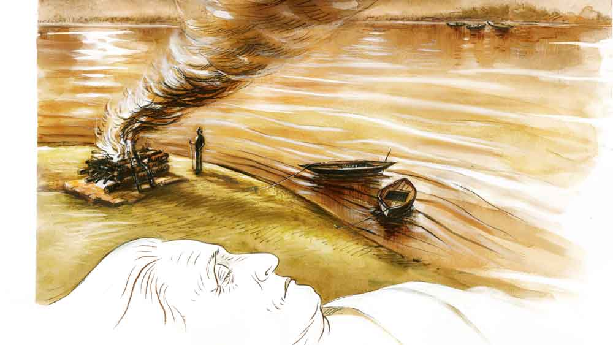

 
 <h1 align=center>মহাকালের ঘাট</h1>
<h2 align=center>সব্যসাচী ধর</h2> আনন্দীর বেঁচে থাকার বাসনা এখনও শেষ হতে চায় না। শরীর আর তেমন হাঁটাচলায় সায় দেয় না তিন কাল গিয়ে এক কালে ঠেকা বুড়ির। তবু চোখ বুজতে কিছুতেই ইচ্ছে করে না তার। চোখের সামনে জ্বলন্ত চিতার নিভু-নিভু আগুন দুর্জন ডোমের হাতের কাঁচা বাঁশের খোঁচা খেয়ে যেমন দাউদাউ জ্বলে ওঠে, আনন্দীরও তেমন হয় ভিতরে ভিতরে। একটা স্থির বিশ্বাস আছে তার।  এক দিন না এক দিন মহাকাল নিশ্চিত চোখ মেলে তাকাবেন ওদের দিকে— বেদখল হওয়া শ্মশানের দশ পুরুষের মালিকানা ঠিক ফেরত পাবে ও। কিছুটা দূরে শ্মশানকালীর মূর্তির দিকে তাকিয়ে হাতজোড় করে প্রণাম করে আনন্দী। খাটিয়ার পাশে রাখা কঞ্চিটা হাতে নিয়ে নাতি ভীমাকে চাপা স্বরে বলে, “মড়কের এই রমরমা বাজারে এখনও বসে বসে মদ খাস ভীমা?”

মদের জন্য তিরস্কার নয়। মদ খেতেই পারে ভীমা। ওটা ওদের হক, কাজের শক্তি। আনন্দী কঞ্চি নেড়ে ভীমাকে চাগাড় দেয় অন্য কারণে। ওই জোয়ান মদ্দ মদ খেয়ে খেয়ে  বাপঠাকুরদার ‘নেয্য’ অধিকার ছেড়ে দেবে— আনন্দী সেটা কিছুতেই মেনে নিতে পারে না। ভীমাকে কাছে ডেকে ভাল করে বুঝিয়ে বলে ইতিবৃত্তান্ত। স্বামী-শ্বশুরের কাছে শুনেছে, এমনকি সে নিজেও দেখেছে, মড়ক  বার বার আসে না। মহাকাল যখন ‘চোকখু’ মেলেন, ‘পিত্থিমি’তে মানুষের মড়ক লাগে তখন! আর মড়ক লাগলেই ওদের দায়িত্ব বাড়ে। শ্মশানের ছাইয়ে মহাকাল গড়াগড়ি যান, মহাকালী ‘নেত্য’ করেন। বানে-বর্ষায় শ্মশানের ছাই নদীতে ভাসতে ভাসতে ‘সমুন্দুর’-এ গিয়ে মেশে। মহাকাল তখন গা পাতবেন কোথায়? তাই এখন ওদের বড় দায়িত্ব কাজে ঢিলে না দেওয়া। ছায়েভস্মে ঢেকে যাক চার পাশ। মহাকাল গড়াগড়ি যাবেন যে!

ভীমা চুপ করে থাকে। বুড়ির কথায় কোনও উত্তর দেয় না।

আনন্দী এই দীর্ঘ জীবনে মড়ক কম দেখেনি। তবে মাঝে মড়ক তেমন আসেনি। এসেছিল এই জনমনুষ্যহীন শ্মশানঘাটে বেঁচে থাকার অন্তহীন সংগ্রাম। তখন কি ‘ভদ্দরনোকেরা’ ওদের খবর নিতে এসেছিল? কখনও কোনও ‘ভদ্দরনোক’ কি তাদের পাড়ায় এমনি এমনি আসে! না কি হেঁটে হেঁটে আসে! ‘ভদ্দরনোক’ বলো ‘ছোটনোক’ বলো ‘গরিব’ বলো ‘বড়নোক’ বলো... সবার আসা ওই শুয়ে শুয়ে, কাঁচা বাঁশের টাটে চড়ে! পঞ্চায়েতের বাবুরা কি তখন দেখেছিল গাঙের বানে ওদের ঘরের চালের বাঁশের বাতায় ক’টা খরিশ আর চিতি মুখ ‘নুকিয়ে’ বসেছিল? গোরে জল ঢুকলে শেয়ালের পাল সারা রাত ওর ঘরের পিছনে ‘পোহরে পোহরে’ ডাক দিয়েছিল? এ সব কথা খুব মনে পড়ে আনন্দীর। বিশেষত ভীমার মদ আর মুড়ি খাওয়ার পর অবশেষটুকু আনন্দীর পেটে গেলে ওর মনটা বড় হু-হু করে ওঠে।

তবে কিছু সুবিধেও আছে ওদের। কাঁচা বাঁশ বাতার অভাব নেই, খড়ের অভাব নেই। দড়ির অভাব নেই। মাটির হাঁড়ি কুড়ি সরা, রেজগি পয়সা, দু’-এক দানা সোনা রুপো ঠিক জুটে যায়। ওই বাঁশ বাতা দড়িতে ফি বছর ঘর ছাওয়ানো যায়। ‘ক্যাঁতা বালিশ বিছনা’র অভাব নেই। মহাকালের দয়ায় সবই জোটে, অভাব শুধু চাল ডালের। এই মড়কের আঁটে দু’বেলা দু’মুঠো গরম ভাতের একটা যদি পাকা বন্দোবস্ত করা যেত, খুব ভাল হত। এটার জন্যই আনন্দী ভীমাকে আবার কাজ করার সদুপদেশ দেয়।

ভীমার নেশা বেশ জমে উঠেছিল। লাল চোখে সে বুড়িকে বলে, “তু কবে মরবি বুড়ি? তোর চোখ না বুঝলে ধান-চালের পাকা ব্যবস্থা হবে না।”

ভীমার দৃঢ় বিশ্বাস ছিল, আনন্দীর কুঁড়েঘরের ভিতরে সোনা রুপো আর দামি পাথরে ভরা একটা ঘটি মাটির তলায় পোঁতা আছে। সে যদি এক বার ওটা পায়, তা হলে আর অভাব থাকে না। বর্ষার জল নেমে গেলে নদীর চরে যেটুকু চাষাবাদ হয়, তাতে বছর চলে না। ভীমার বড় ইচ্ছে, বুড়ির লুকিয়ে রাখা ঘটিটা পেলে শ্মশান-লাগোয়া বাবুদের জমির কিছুটা কিনে নেবে। কত সস্তায় এ জমি পেতে পারে ভীমা। এ সব শ্মশানঘাটে কোনও চাষার ব্যাটা চাষ করতেও আসে না। কিন্তু আনন্দী  মরেও না, এমনকি ঠিক করে ঘুমোয়ও না। ভীমা অনেক বার চেষ্টা করেছে বুড়িকে একটু বেশি মদ খাইয়ে বেহুঁশ করে যদি সোনাদানার হদিস পাওয়া যায়!

কিন্তু এক-আধ চুমুক পেটে পড়লেই আরও টনটনে হয়ে ওঠে বুড়ির জ্ঞানগম্যি। বুড়ি তখন ভীমাকেই উল্টে বুঝিয়েছে, কী করে মাথা ঠান্ডা রেখে এই দাহকাজের মতো কাজ করতে হয়। কী করে দখল রাখতে হয় বাপ-ঠাকুরদার দশ পুরুষের চিতার পিদিম আর মহাকালেরভিটে। গম্ভীর ভাবে বলেছে, “বড় পুণ্যির  কাজ রে ভীমা, এখানে পাপ করতে নাই। মহাকাল এখানে গড়াগড়ি খান, মহাকালী নেত্য করেন তেনার দেহের উপরে...”

এ সব শুনে ভীমা আর কথা বাড়ায়  না।

আনন্দীও এক সময় ওর স্বামী গোকুলের কাছে শুনেছিল, একটা ভাঁড় আছে মাটিতে পোঁতা। গোকুলের অবশ্য এ সব ধনসম্পদে বিশেষ টান ছিল না। নইলে কেউ দুর্জনের মতো লোককে নিজের কাজের ভাগ দেয়! বড়লোকের এক সধবাকে দাহ করার সময় বাবুরা এমন এক তেজি মদ খাইয়েছিল গোকুলকে যে, গোকুলের আর মাথার ঠিক ছিল না। বাঁ হাতের মদের বোতল থেকে মদ ছলকে পড়েছিল গোকুলের পায়ের গোড়ায়। চিতার আগুন এসে সেই মদে দপ করে জ্বলে উঠেছিল! বাপের বেটা ছিল গোকুল। নিজে আদ্ধেক জ্বলেপুড়ে মরলেও কাজ শেষ না করে ছাড়েনি। তবে গোকুল আর ভাল হয়ে ওঠেনি। তখনই গোকুল ওই কালসাপ দুর্জনকে দূর গ্রাম থেকে নিয়ে এসেছিল ওকে সাহায্য করার জন্য।

খুব মনে পড়ে আনন্দীর, তখনকার মড়কের কথা। তখন গরিব মরেছিল বেশি। তবে রোজকার কম হয়নি। আনন্দী বুঝতে পারত গোকুলের মতো সহজ সরল মানুষকে ঠকিয়ে পাওনাগন্ডা বেশি ঢুকছে দুর্জনের কোঁচায়। সুখ বেশি দিন সহ্য হয়নি আনন্দীর। আধপোড়া দুর্বল গোকুলকে অতিরিক্ত মদ খাইয়ে শেষ করার একটা অপচেষ্টা ছিল দুর্জনের। দুর্জনকে বেশি দিন অপেক্ষা করতে হয়নি আর। গোকুল মরেছিল।

নকুলকে খুব কষ্টে বড় করেছিল আনন্দী। পায়ের ঘা পচে গিয়ে গোকুল মারা গেল, তখন নকুল হাঁটুর সমান। গোকুলের যখন খুব বাড়াবাড়ি তখনও মড়ক। আর দুর্জনের পৌষমাস। দুর্জন বুঝতে পেরেছিল, গোকুল আর বেশি দিন নেই। সময় বুঝে দুর্জনের শাউড়ির রোগ হয়েছিল। পালিয়ে গিয়েছিল দুর্জন। আসলে দুর্জনের মনেও একটা অপরাধবোধ কাজ করেছিল। গোকুল ফ্যালফ্যাল করে তাকিয়ে দুর্জনকে বলেছিল, “নকুলটা খুব ছোট রে ভাই, আনন্দী কী করে যে চালাবে! দেখিস ভাই ওদের একটু!” বলতে বলতে চোখের জল গড়িয়েছিল গোকুলের। তখনই দুর্জনের মনে ভয় হয়েছিল— একে চিতায় তুলে পোড়ালে আরও পাপ বাড়বে। তাই দুর্জন পালিয়েছিল। জীবনে ওই এক দিনই আনন্দী দুধের ছেলে নকুলকে নিয়ে চিতা সাজিয়েছিল। ডোমের মড়ার গায়ে আর কেই-বা হাত লাগায়!

গোকুলের চোখ বোজার পর ছেলে নকুল যখন এই শ্মশানঘাটের কাজ বুঝতে শিখল, তখন আর দুর্জনকে পায় কে! সে পঞ্চায়েতের বাবুদের ধরে এখানে ভোটের কার্ড করেছে। নাম হয়েছে দুর্যোধন ডোম। শহরের বাবুদের ধরে এই ঘাটের লিজ় নিয়েছে নিজের নামে। তার কাছে আগে মড়ার কাগজ, টাকাকড়ি জমা দাও, তার পর সে শুধু আগুনটুকু ছুঁইয়ে দিয়ে আসে। নকুলকে সে এখন দয়া করে দু’-দশ টাকা দেয়। এ অপমান আনন্দীর সহ্য হয় না।

আনন্দী একটা শেষ চেষ্টা করেছিল। পঞ্চায়েতের বাবুদের বুঝিয়েছিল, এ ঘাট তাদের বহু কালের জাতব্যবসা। দুর্জন কী করে ঘাটের মালিকানা পায়? উত্তরে পঞ্চায়েতের বাবুরা বলেছিল, “পিসি, নকুলের বয়স কম, ওর নামে ঘাটের লিজ় হবে না। আর তুমি কি পারবে দুর্যোধনের চেয়ে বেশি টাকা দিতে?”

পেরে ওঠেনি আনন্দী। আনন্দীকে দেখতে হয়েছে, দুর্যোধনকে টাকা দেয় সৎকার করতে আসা লোকেরা। দুর্যোধন পটাপট বড়লোকের গিন্নিদের নাকের নথ কানের দুল পায়ের তোড়া চুটকি খুলে নেয়। অসহ্য লাগে আনন্দীর। সে ঝগড়া করেছিল দুর্জনের সঙ্গে। দুর্যোধন গম্ভীর ভাবে উত্তর দিয়েছিল, “সে কালে এ কালে অনেক পাত্থক্য পিসি। এখন কত ট্যাক্সো লাগে সে যদি তুমি জানতে...”

নকুল অবশ্য বেশি দিন এ সব হুজ্জুতিতে থাকেনি। বয়সকালে বিয়েশাদি করে ভিনগাঁয়ে বসত করেছে। বাপের ধারা পেলেও নকুল এক দিন অবশ্য মা আনন্দীকে বলেছিল, “বার কর কেনে, তোর সেই হিরামানিকের ভাঁড়!”

আনন্দীর কাছ থেকে সাড়াশব্দ না পেয়ে বৌকে নিয়ে শ্বশুরবাড়িতে গিয়ে উঠেছিল। তবে অবশ্য যাওয়ার সময় ছেলে ভীমাকে রেখে গিয়েছিল মায়ের কাছে। মনে ক্ষীণ বিশ্বাস ছিল, যদি ভীমা এক দিন সেই ভাঁড়টার মালিক হতে পারে। আর আনন্দীর বিশ্বাস ছিল, এই মহাকালের ঘাট এক দিন তারা ফিরে পাবেই।

গোকুল মারা যাওয়ার পর ভাত-কাপড়ে চরম টান পড়লে আনন্দীর মনে হয়েছিল, এ বার মাটি থেকে সেই গয়নার ভাঁড়টাকে তোলা দরকার। নকুল ঘুমিয়ে পড়লে প্রতি দিন একটু একটু করে মাটির মেঝে খুঁড়েছে, কিন্তু গয়নার ভাঁড়ের হদিস মেলেনি। খুব আশ্চর্য হয়েছিল আনন্দী। এত দিনের শোনা কথা, এত দিনের বিশ্বাস এ ভাবে মাটিতে মিশে গেছে— তা বিশ্বাস করতে আনন্দীর খুব কষ্ট হয়েছিল। এখনও বিশ্বাস করে, ধনসম্পদ সে পাবেই। সে কারণেই এখনও বেঁচে থাকতে ভাল লাগে তিন কাল গিয়ে এক কালে ঠেকা বুড়ির। আর ভীমার ভাল একটা বিয়ে দিয়ে ঘর-সংসার না বসিয়ে সে মরেই বা কী করে? ভীমাও জানে, বুড়ি চোখ বুজলেই আর তাকে পায় কে! মহাকাল ঠিক চোখ খুলবেন। ভীমা শ্মশানকালীর মন্দিরে মাথা ঠোকে, দেওয়ালে টাঙানো রাজা হরিশ্চন্দ্রের মড়া পোড়ানোর একটা বিবর্ণ কালিঝুলি-মাখা ছবিতে নিত্য প্রণাম করে। দুর্জনের নির্দেশে যখন ছাই আর কাঠকয়লা ফেলতে যায় নদীর চরে, তখন চুপি চুপি মহাকালকে ডেকে বলে, “হে মহাকাল, এক বার চক্ষু মেলো ঠাকুর, গয়নার ভাঁড়টা এক বার হাতে এনে দাও ঠাকুর।”

গয়নার হদিস না পেলেও দিন পাল্টায়। ভীমার কাজ বাড়ে। মড়ক লেগেছে দেশে। নতুন এক রোগ এসেছে। সে শুনেছে, আর সহজে নিস্তার নেই মানুষের। কাতারে কাতারে দেহ আসতে শুরু করেছে মহাকালের ঘাটে। কিন্তু দুর্জন থাকলে ওর আর লাভ হয় কী করে? এ চিন্তা ভীমাকে কুরে কুরে খায়। ভীমার দুশ্চিন্তা যত বাড়ে, দুর্জনের আনন্দ বাড়ে তত। মড়কের বাজারে দু’হাত ভরে ওঠে দুর্যোধনের, যতটা পারা যায় কামিয়ে নেয় সৎকারের কাজে আসা লোকজনের কাছ থেকে। আনন্দে আর পরিশ্রমে নেশা বাড়তে থাকে তার। দিগ্বিদিক জ্ঞানশূন্য হয়ে ওঠে দুর্যোধন। দিন নাই রাত নাই মহাকালের ঘাটে মানুষের আনাগোনা বাড়ে। কে কোন দেহ নিয়ে এসেছে তাতেও গন্ডগোল বেধে যায় সময় সময়। দুর্যোধনকে খুব সাবধানে হিসেব রাখতে হয়।

অবশেষে আনন্দী আর ভীমার দিন পাল্টায়। দু’জনে এক সঙ্গে বসে এক থালায় মুড়ি খায়, এক বোতল থেকে মদ ঢেলে খায় ঠাকুমা-নাতিতে মিলে। আনন্দীর খুব নাচতে ইচ্ছে করে আজ। ওই খোঁড়া পায়ে ভর করেই। কিন্তু বয়সের ভারে সেটা পেরে ওঠে না। নদীর ঘাটে চান করতে গেলেই হাঁপিয়ে ওঠে আজকাল। তবু আজ আনন্দীর বড় আনন্দ! 

দুর্জন মরেছে, চিতায় পুড়ছে দুর্জন। শেষ অবধি মহাকাল চোখ মেলে চেয়েছেন।

পঞ্চায়েতের বাবুরা, সরকারি লোকেরা কত করে বলেছিল, “এ যে-সে মড়ক নয় দুর্যোধন, এ বড় কঠিন মড়ক, খুব সাবধান! যা করবি দূর থেকে করবি, সব সময় মুখ ঢেকে রাখবি। বড় বড় পলিথিনের জামাপ্যান্ট পরে মড়া পোড়াবি। আর ভুল করেও ডেডবডির প্লাস্টিক খুলবি না। বার বার হাত ধুবি সাবান দিয়ে।”

বাবুদের কাছ থেকে হাত ধোওয়ার সাবান, ওষুধগোলা জল, নানা রকম বস্ত্র, মুখ ঢাকার কাপড়চোপড়, আরও কত কী পেয়ে দুর্যোধনের সে কী গরম!

কিন্তু লোভ! আর অত কথা শুনলে কি সব সময় চলে! দুর্যোধন দু’-চারটে ডেডবডি খুলে দেখেছিল, ঘরের গিন্নি, অফিসের বাবুটি সোনা-দানা, মায় পকেটের মানিব্যাগ পর্যন্ত নিয়ে শুয়ে আছে। ছোঁয়াচে রোগের ভয়ে কেউ কিচ্ছুটি নাড়েনি। এ বার সেও বড়লোক হবে। গোকুলের কাছে শুনেছিল, ওদের ঘরের মাটির তলায় ধনসম্পদ পোঁতা আছে, তার ঘরেই বা থাকবে না কেন? সেই লোভে এই ক’দিন সে প্রতিটি শবদেহ আতিপাতি করে খুঁজেছে। গয়নাগাঁটি টাকা-পয়সায় কোঁচড় ভরে এসেছিল দুর্জনের। বুঝতে পারেনি, কোথাও লুকিয়ে আছে নিজের মরণ। দু’-চার দিন জ্বরের পরেই বুঝতে পারছিল ধূপ-ধুনোর গন্ধ পাচ্ছে না, নিঃশ্বাস পাচ্ছে না, হাওয়া-বাতাস বড় কমে এসেছে। দুর্যোধন মরেছে। আজ আনন্দীকে পায় কে?

গোকুল মারা যাওয়ার পর এক সাধুবাবা এসে এই নির্জন শ্মশানে দিনকতক বাস করেছিল শ্মশানকালীর চাতালে। তখন ভয়ানক দুরবস্থা আনন্দীর। ঘরের মাটি খুঁড়ে খুঁড়ে অবসন্ন আনন্দী সেই সাধুবাবার কাছে মনের কথাটা পেড়েছিল। সিদ্ধপুরুষ সাধু আনন্দীর মাথায় হাত রেখে বলেছিল, “এ বড় বৈরাগ্যের স্থান রে মা। এখানে কেউ বড়লোক হতে আসে না, এখানে গরিব বড়লোক সব সমান। তোর ঘরের মাটিতে হিরে-মানিক ধনসম্পদের ভান্ডার নাই রে মা! এখানে চার পাশে মহাকালের শয্যা। আর তার উপরে নিরাভরণ মহামায়ার তাণ্ডবনৃত্য চলে। তবে এত যখন ধনসম্পদের লালসা, তোর জন্য এক রত্নহার আমি রেখে যাব শ্মশানকালীর ঠিক পিছনে মাটির বড় জালার মধ্যে! তবে খুব সাবধান, যে দিন জীবনে খুব আনন্দ পাবি, সেই দিনই ওই রত্নহার গলায় নিতে পারবি।”

দুর্যোধনের নিভন্ত চিতার দিকে তাকিয়ে আনন্দীর আজ মনে পড়েছে সেই সাধুবাবার কথা। নেশায় চুর আনন্দী উঠে পড়ে। ভীমাকে টানতে টানতে নিয়ে যায় শ্মশানকালীর মন্দিরে। আজ ওর মধ্যে এক আশ্চর্য শক্তি জেগে উঠেছে। ভীমাকে মায়ের সামনে গড় করিয়ে বলে, “বল ভীমা, আমাদের লোভ নাই, লালোচ নাই, আমাদের আছে মহাকালের ঘাট।”

ভীমা বিশেষ কিছু বুঝতে পারে না, তবুও গড়গড় করে বলে যায় আনন্দী যা বলে সে সব কথা। আনন্দী আরও কত কী যে বলে আজ! হঠাৎ আনন্দী মা কালীর মূর্তির পিছনের মাটির জালার মুখের সরাটা খুলে ফেলে। রত্নহারটাকে আজ নদীর জলে ফেলবেই সে। আছড়ে ভেঙে ফেলে জালাটা। ভাঙামাত্র অবাক হয়ে সে দেখে, সোনা নয় রুপো নয়, সাধুবাবা তার জন্য রেখে গেছে  আশ্চর্য এক রত্নহার— এক নরকরোটির মালা! আনন্দী থমকে যায় কিছুটা, তার পর মুণ্ডমালাটাকে নিজের গলায় পরে নিয়ে শুরু করে উদ্দাম নৃত্য। কিন্তু সে আর কত ক্ষণ, নেশার ঘোরে সে ছিটকে পড়ে মহাকালের চাতালে।

আনন্দীর জীর্ণ দেহ আজ বড় যত্ন করে চিতায় তোলে ভীমা। আগে সে কত বার মরণ চেয়েছে বুড়িমার! আনন্দীর মৃত মুখের দিকে তাকিয়ে ভীমা দেখতে পায়, এক অদ্ভুত আনন্দ ঘিরে রয়েছে আনন্দীর মুখে, এমনকি করোটিগুলোও তার দিকে বড় তৃপ্তির সঙ্গে তাকিয়ে আছে। কালের নিয়মেই যেন মহাকালের ঘাটের মালিকানা আবার তারা ফিরে পেয়েছে।

চিতায় আগুন দেয় ভীমা।

সবচেয়ে আগে সব খবর, ঠিক খবর, প্রতি মুহূর্তে। ফলো করুন আমাদের Google News, Twitter এবং Instagram পেজ।