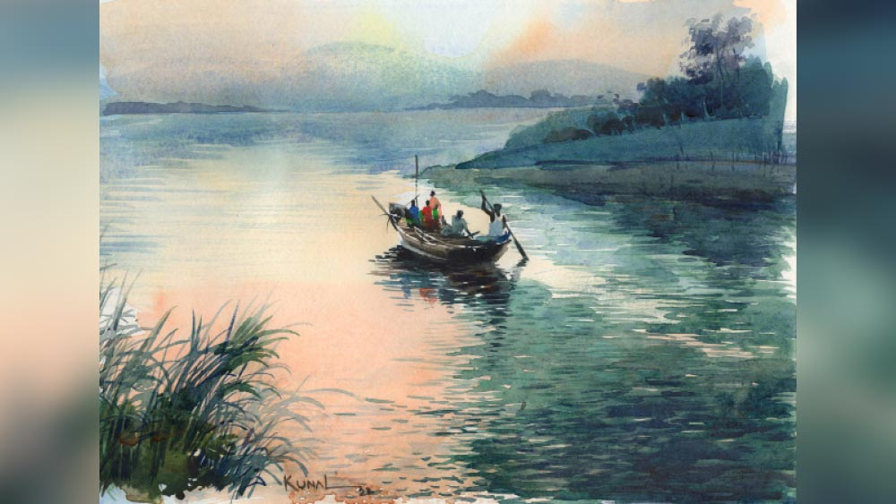

 
 <h1 align=center>মাঝি</h1>
<h2 align=center>গৌতম মুখোপাধ্যায়</h2> তালডাংরা গ্রামে রূপনারানের একেবারে পাড়ে নিতাইয়ের চায়ের দোকান। বাঁশের মাচার উপরে টিন, মাথায় কালো প্লাস্টিক। দোকানের সামনে জনা চারেকের বসার জায়গা। দোকানের আসবাবপত্র বলতে কাঠের ভাঙা শো কেস, গোটা চারেক কাচের বয়ামে বেকারির বিস্কুট, স্টিলের থালায় গোটা দশেক ছোট কাচের গ্লাস। বড় একটা মাটির উনুন, একটা মাঝারি কেটলি, হাঁড়িতে কিছুটা দুধ।
ভোরের খেয়া পাঁচটায়। তার আগেই দোকানে আঁচ পড়ে যায়। মাঝিপাড়ায় তিলু, কার্তিক, বাপি, মানা নিতাইয়ের বাঁধা খদ্দের। জলে নৌকো নামানোর আগে নিতাইয়ের দোকানে চা-বিড়ি খাওয়া ওদের একটা অভ্যেস। গেঁয়োখালি যাওয়ার প্রথম নৌকো পাঁচটায়। সাইকেল-বাইক নিয়ে জনা তিরিশ প্রথম নৌকোর যাত্রী। বেশ কিছু যাত্রী নিতাইয়ের দোকানে চা খায়। বেলা বাড়ার সঙ্গে সঙ্গে যাত্রীর আনাগোনা বাড়ে। দুপুরে কয়েক ঘণ্টা বিশ্রামের পর আবার বিকেলের তোড়জোড়। দোকানের ঝাঁপ পড়তে-পড়তে রাত ন’টা।
সপ্তাহের প্রথম দিন, যাত্রীর চাপ একটু বেশি। আজ দিনটা মেঘলা। ঝোড়ো হাওয়া দিচ্ছে। বৃষ্টি নেই, কিন্তু আসতে পারে যে কোনও সময়। ঘাটে এখনও প্রথম নৌকো নোঙর করেনি। মিনিট দশেক অতিক্রান্ত, তখনও নৌকোর দেখা নেই। উপস্থিত যাত্রীদের মধ্যে উত্তেজনা সৃষ্টি হয়। যাত্রীদের মধ্যে থেকে কেউ বলে ওঠে, “শালা আমাদের সময়ের দাম নেই? ভাড়া বাড়ানোর সময়ে মনে থাকে না যে ঠিক সময়ে সার্ভিস দিতে হবে!” কেউ বলে ওঠে, “ছোটলোকের বাচ্চা, এদের জ্ঞানগম্যি আছে?” 
পরিচিত যাত্রীরা নিজেদের মধ্যে আলোচনা করে, এখন কী করণীয়। কী ভাবে যাওয়া যাবে, সেটা ভাবা দরকার। এ দিকে আবহাওয়াও খুব সুবিধের নয়। পরের টান সাতটায়। তখন গিয়ে লাভ নেই। 
সারেংদের নিয়ম নিতাই জানে। বাবার সঙ্গে থেকে এ অভিজ্ঞতা তার হয়েছে। ছোটবেলা থেকেই লেখাপড়া ফেলে বাবার সঙ্গী হয়ে উঠেছিল। মা মাঝে মাঝে লেখাপড়ার কথা বললে, বাবা বলত, “ওর লেখাপড়া হবে না, ওর পিছনে ফালতু সময় দিয়ো না। সেই সময়টা অন্য কাজ করুক, দুটো পয়সা আসবে। ও আমার সঙ্গে নৌকোয় থাকুক।” 
সে সেই ছোট বয়স থেকেই বাবার নৌকোর সঙ্গী। সেদিনকার সেই আকস্মিক ঘটনা না ঘটলে নিতাইও আজ সারেং হয়ে যেত।

আটাত্তরের বন্যার সময়ে ঘটা সেই দুর্ঘটনাটা তার জীবনের মোড় ঘুরিয়ে দেয়। সে দিন ভোর থেকে মুষলধারে বৃষ্টি শুরু হয়েছিল। সাবিত্রী বলেছিল, “শুনছ? আজ আর নৌকো নিয়ে বেরোতে হবে না। আকাশের গতিক ভাল নয়। তিলুপাড়ার বাঁধে ফাটল ধরেছে। কোদাল চাইতে এসে বঙ্কু খবর দিল। আজ না-ই বা গেলে।” 
“না বেরোলে আমার চলবে না। আজ আমার প্রথম টান। যাত্রীরা সারেংকে দেখতে না পেলে খুব রেগে যাবে। কাজকর্ম আটকে যাবে।”
“চার দিকে বন্যা হয়েছে, ভোর থেকে মুষলধারে বৃষ্টি। এই অবস্থায় যাত্রীরা সব তোমার জন্য বসে আছে! দেখোগে যাও তারা সবাই চাদরমুড়ি দিয়ে ঘুমোচ্ছে। যত মাথাব্যথা তোমার। আগে নিজে বাঁচো, পরে অন্যদের কথা ভাববে।”
ফটিক বৌয়ের কথা কানে তোলে না, ধুতিটা মালকোঁচা করে বেঁধে বর্ষাতি গায়ে চাপিয়ে বেরিয়ে পড়ে।
বিছানায় বসে নিতাই বাবা-মায়ের কথা শুনছিল। বাবা বেরিয়ে যাচ্ছে দেখে নিতাই এক লাফে বিছানা থেকে নেমে এসে বলে, “বাবা, তোমাকে একা যেতে হবে না, আজ আমি তোমার সঙ্গে যাব।”
“যাওয়ার সময় পিছু ডাকলি বাবা?” চৌকাঠ পেরিয়ে ঘরে এসে নিতাইয়ের মাথায় হাত বুলিয়ে ফটিক বলে, “অন্য দিন হলে কিছু বলতাম না। কিন্তু আজ আমার সঙ্গে যাসনি, তুই ঘরে থাক। কত বার তো আমার সঙ্গে গেছিস, বারণ করেছি? আজ বারণ করছি, তার নিশ্চয়ই একটা কারণ আছে। আমাকে যেতে হচ্ছে, কারণ আমি ঘাটে না গেলে সবাই অসুবিধেয় পড়বে।”
নিতাই মেনে নেয়। বেরিয়ে পড়ে ফটিক। গেঁয়োখালি থেকে শেষ নৌকো আটটায়। ফটিকেরই শেষ টান। এ পারে পৌঁছতে ন’টা। নৌকো ঠিক করে বেঁধে তারামাকে ধূপ দেখিয়ে তবে বাড়ি।
সারা দিন বৃষ্টিতে ভেজায় শরীরে ঠিক জুত পাচ্ছিল না ফটিক। রাতে খেয়ে দেয়ে একটু বিশ্রাম করলে ঠিক হয়ে যাবে। অল্প কয়েক জন যাত্রী নিয়ে নৌকো ভাসিয়ে দেয় ফটিক। ডিভিসি থেকে জল ছাড়ায় জল আজ অনেক উঁচুতে। জলের স্রোতও বেশি। ফটিক এত দিন নৌকো চালাচ্ছে, কিন্তু রূপনারানের এত ভয়াল-ভয়ঙ্কর রূপ দেখেনি। তার মতো দক্ষ সারেং-এর মনেও ভয়ের সঞ্চার হয়। মন দিয়ে নৌকো চালায় ফটিক। 
পাড় থেকে ফটিকের নৌকো তখনও বেশ কিছুটা দূরে। যাত্রীরাও প্রস্তুতি নিচ্ছে নামার। ফটিক ভাবে, যাক আজকের মতো হল। আবার কাল। বাড়িতে গিয়ে একটু কড়া করে চা খেতে হবে। আসার সময় রুটির কথা বলে এলে ভাল হত। ভাত খেতে ভাল লাগছে না। ভাবতে-ভাবতে অন্যমনস্ক হয় ফটিক সারেং। হাতে ধরা হালটাও একটু ঢিলে হয়ে যায়। আর ঠিক তখনই বড় একটা ঢেউ নৌকোর গায়ে আছড়ে পড়ে। নৌকোর যাত্রীরা বেসামাল হয়ে একে অন্যের গায়ের উপর পড়ে। নৌকোর ধারে বসা যাত্রীরা সামলাতে না পেরে জলে পড়ে যায়। নৌকোর হ্যারিকেনের আলোয় ফটিক দেখে জলে পড়া দু’জন যাত্রী হাত-পা ছুড়ে নিজেদের ভাসিয়ে রাখার চেষ্টা করছে, কিন্তু স্রোতে স্থির থাকতে পারছে না। ফটিক হাল ছেড়ে জলে ঝাঁপিয়ে পড়ে। চুলের মুঠি ধরে ডুবন্ত দু’জনকে পাড়ে পৌঁছে নৌকোর কাছে যাবে বলে জলে নামবে, ঠিক তখনই বিরাট একটা মাটির চাঙড় ফটিকের মাথায় ভেঙে পড়ে। রাতের অন্ধকারে মাতাল রূপনারানের জলে তলিয়ে যায় ফটিক।

“হ্যাঁ রে খোকা, এত রাত হল তোর বাবা তো এখনও এল না? এত তো দেরি করে না? বলছিল শরীরটা ভাল লাগছে না। বেরোতে বারণ করলাম, শুনল না... যত চিন্তা আমার!” ঘরের ভেতর থেকে দালানে বসে থাকা নিতাইকে বলে সাবিত্রী।
নিতাইও সেই কথা ভাবছিল। বাবার তো এত দেরি হয় না, আজ কী হল! বাবার সঙ্গে গেলেই ভাল হত। নিতাই উত্তর দিচ্ছে না দেখে সাবিত্রী ঘর থেকে বেরিয়ে এসে নিতাইয়ের সামনে দাঁড়ায়। বলে, “অনেক তো রাত হল, বৃষ্টি থামার লক্ষণই নেই, এক বার ঘাটে গিয়ে দেখে আসব? যাবি আমার সঙ্গে?”
“এত রাতে এই বৃষ্টির মধ্যে অন্ধকারে কেউ ঘাটে যায়? আর ওখানে গিয়ে কী হবে? বাবা কি ঘাটে বসে আছে?”
“তবু ঘাটে যদি কেউ থাকে, এক বার জিজ্ঞেস করতে পারব।”
“হ্যাঁ, তোমার জন্য এত রাতে ঘাটে লোক বসে আছে!” নিতাইয়ের উদ্বেগ বিরক্তি হয়ে ফুটে বেরোয়। 
“আমার কেমন ভয় ভয় করছে রে খোকা, কিছু বিপদ হল না তো?”
“তোমার যত বাজে চিন্তা। বাবার কিছু হয়নি। দেখো হয়তো কোনও বন্ধুর বাড়ি গেছে। কাল সকালেই চলে আসবে। আগেও তো এক বার এ রকম করেছিল। চলো, ঘরে চলো, খিদে পেয়েছে, আমায় খেতে দাও...” মায়ের হাত ধরে টানতে-টানতে ঘরে নিয়ে আসে নিতাই।
নিতাইকে নীরবে খাবার বেড়ে দেয় সাবিত্রী।
“মা, তুমি খাবে না? তোমার খাবার নিলে না যে?”
“খেতে ইচ্ছে করছে না। শরীরকে মাঝে মাঝে উপোস দিতে হয়।” 
নিতাই মাকে জোর করে না। সে নিজেও আনমনে খেয়ে উঠে পড়ে। তার মনে নানা চিন্তার ঝড়। খাওয়ার পর নিতাই চুপচাপ বিছানায় গিয়ে শুয়ে পড়ে।
সাবিত্রীর চোখে ঘুম আসে না। গভীর উৎকণ্ঠায় সারা রাত কাটে তার।

অন্ধকার থাকতে থাকতে নিতাইকে ডাকে সাবিত্রী। অন্ধকারেই দু’জনে বেরিয়ে পড়ে খেয়াঘাটের উদ্দেশে। রাতেই বৃষ্টি থেমে গিয়েছিল। কিন্তু আকাশের মুখ গম্ভীর। যে কোনও মুহূর্তে আবার নামতে পারে। দ্রুত পা চালায় মা-ছেলে। 
রাস্তার জলকাদা ভেঙে খেয়াঘাটে যখন পৌঁছয়, তখন খেয়াঘাট শুনশান। সামান্য দূরে বটের শিকড়ে মোটা কাছি দিয়ে দুটো নৌকো বাঁধা। কিছু ক্ষণ পর সেখানে উপস্থিত হয় বাবলু সারেং। সাবিত্রী এগিয়ে গিয়ে জিজ্ঞেস করে, “তোমার দাদার খবর জানো? কাল রাতে বাড়ি ফেরেনি।” বাবলু কথার উত্তর না দিয়ে চুপ করে থাকে। সারা রাত জলে বহু খোঁজাখুঁজির পর ভোরের দিকে ফটিকের নিষ্প্রাণ দেহটা পাওয়া গিয়েছে। খেয়াঘাট ঘুরে বাবলু ফটিকদার বাড়িতেই যেত খবর দিতে। 
বাবলু কী উত্তর দেবে বুঝতে পারে না। তাকে নিরুত্তর থাকতে দেখে নিতাই এগিয়ে এসে জিজ্ঞেস করে, “কাকা, বাবার খবর জানো?” 
বাবলু নিতাইকে একটু দূরে সরিয়ে নিয়ে গিয়ে গতকাল রাতের ঘটনা ব্যক্ত করে। 
নিতাইয়ের মাথার ভিতরটা অন্ধকার হয়ে যায়। সে যেখানে দাঁড়িয়ে ছিল সেখানেই ধপ করে বসে পড়ে। তাকে দেখে ছুটে আসে সাবিত্রী। নিতাইকে ধরে ঝাঁকুনি দেয় পাগলের মতো, “ও রকম বসে পড়লি কেন খোকা? বাবলু কী বলল? চুপ করে আছিস কেন? বল...”
“বাবা আর নেই মা।”
“কী বললি? তোর বাবা নেই? ও নেই? তোর বাবা…” কথা শেষ করতে পারে না সাবিত্রী, মাথা ঘুরে যায় তার। সশব্দে আছড়ে পড়ে রূপনারানের পারে। নিতাইয়ের দৃষ্টি তখন রূপনারানের ঘোলাটে জলের দিকে। 

চা দিতে দিতে নিতাই ভাবে কিছু একটা গন্ডগোল হয়েছে। না হলে তো সারেংরা কামাই করে না। আবহাওয়া যতই খারাপ হোক, যার টান সে আসতে না পারলে অপর জনকে খবর দিয়ে দেবে, এটাই নিয়ম। 
এতগুলো মানুষের অসুবিধে চোখের সামনে দেখতে তার ভাল লাগল না। তার বড্ড বাবার কথা মনে পড়ছে। সে মানুষটা যাত্রীদের সুবিধের জন্য কোনও বাধা মানেনি। চায়ের কেটলিটা উনুনের পাশে রেখে দোকান থেকে বেরিয়ে আসে নিতাই।
উত্তেজিত যাত্রীদের উদ্দেশে গলা তুলে বলে, “আমি একটা কথা বলব শুনবেন?” 
“তুমি আবার কী বলবে হে? তোমার বেশ ভালই চা বিক্রি হচ্ছে!” 
নিতাই বলে, “আমি আপনাদের ও পারে পৌঁছে দিচ্ছি, হবে তো?” 
সমবেত যাত্রীর সন্দিগ্ধ দৃষ্টি নিক্ষিপ্ত হয় নিতাইয়ের উপর, “তুমি নৌকো চালাতে পারো আগে কোনও দিন বলোনি তো? তোমার নৌকো আছে না কি?” 
“কখনও প্রয়োজন হয়নি, তাই বলিনি। এখনও বেশি দেরি হয়নি। আপনারা ঘাটে যান। আমি সব ব্যবস্থা করে নিচ্ছি।”
নিতাই দোকানের উনুনের আঁচ কমিয়ে ঝাঁপটা নামিয়ে ঘাটের দিকে এগোয়। কিছুটা দূরে দু’জন ছোকরা দাঁতন করছিল। নিতাই তাদের কাছে গিয়ে বলে, “ভগা আর তিলু, তোদের একটা কাজ করে দিতে হবে।” 
ভগা বলে, “কী কাজ নিতাইদা?”
“কাছিটা খুলে নৌকোটা ঘাটে আনব, তোরা এক বার এলে খুব ভাল হয়,” বলে নিতাই।
“কার নৌকো আনবে? যার নৌকো সে যদি কিছু বলে?”
“করিমচাচার নৌকো। আগে আমার বাবার সঙ্গে কাজ করত। আমি নিয়ে গেলে চাচা কিছু বলবে না।”
নৌকোর কাছি খুলে তিন জন নৌকো ঘাটে আনে। নিতাই নৌকোর এক প্রান্তে বসে থাকে, ভগা আর তিলু নৌকোর উপরদিকটা পাড়ের মাটিতে শক্ত করে ধরে থাকে। যাত্রীরা একে একে নৌকোয় ওঠে।
“ঠেলে দিয়ে তোরা উঠে পড়,” ভগা আর তিলুকে উদ্দেশ্য করে বলে নিতাই, “দাঁড় টানতে পারিস তো?”
“জলে ভাসা জীবন, দাঁড় টানতে পারব না, কী যে বলো তুমি নিতাইদা!” নৌকোর হাল ধরে বসে থাকে নিতাই-ভগা আর তিলু দাঁড় টানে। আকাশ একই রকম। মৃদুমন্দ ঝোড়ো হাওয়া এখনও চলছে।
আজ দীর্ঘ দিন পর নৌকোর হাল ধরেছে নিতাই। বাবার কথা আজ বড্ড বেশি মনে পড়ছে নিতাইয়ের। বাবা তাকে নৌকোর হাল ধরা শিখিয়েছিল, বলত, “খোকা, এটাই আমাদের রুজি-রোজগার, এটাই আমাদের ভরসা। একে ভালবাসবি। আর যাত্রীরা আপনজন, তাদের যেন কোনও অসুবিধে না হয়। ওরাই আমাদের সব...” ভাবতে-ভাবতে নিতাইয়ের চোখে জল এসে যায়। হাত দিয়ে চোখ মুছে হালের প্রতি মনোযোগী হয় সে।
“নিতাইদা একটা গান গাও না। বহু দিন তোমার গান শোনা হয়নি।”
“কত দিন গানটান গাইনি, এখন কি আর মনে আছে?”
“যতটুকু মনে আছে ততটুকুই গাও...” ভগা আর তিলু নাছোড়।
নিতাই গলাটা একটু পরিষ্কার করে গান ধরে— ‘ও দয়াল রে/ নৌকা নিয়ে ভেসে পড়ি যাব কিনারে...’।
যাত্রীদের মধ্যে নানা বিষয়ে আলোচনা চলছিল। নিতাই গান ধরতে নৌকোর পরিবেশ বদলে যায়। যাত্রীদের সবার দৃষ্টি পড়ে নিতাইয়ের উপর। গান শেষ হলে এক জন বলেন, “তুমি এত সুন্দর গান গাও? অপূর্ব তোমার গলা! মনটা ভরিয়ে দিলে।” 
“এত প্রশংসা করবেন না দাদা। ভগা-তিলু বলল তাই।”
“তোমার এত সুন্দর গলা, তুমি গানটা চালিয়ে যাও।”
“দাদা, গান গাইলে চা বিক্রি কখন করব? আগে তো পেট। আজ ভাবলাম আপনাদের কাজে যাওয়া হবে না, অনেকে অনেক দরকারে বেরিয়েছে, তারা অসুবিধেয় পড়বে। তাই বেরোলাম। তা ছাড়া ও পারে গিয়ে ফিরতে ঘণ্টাখানেক লাগবে, সে সময়টুকু দোকান বন্ধ রাখলে তেমন অসুবিধে হবে না। নিজের কথা শুধু ভাবলে হবে দাদা? আপনাদের কথাও তো ভাবতে হবে...”
নির্দিষ্ট সময়ের আধ ঘণ্টার মধ্যেই গেঁয়োখালির ঘাটে নৌকো নোঙর করে। নিতাই ভগা আর তিলুকে দিয়ে নৌকো বাঁধায়, পাটাতন ফেলে। সাবধানে যাত্রীদের নামায়।
নৌকো থেকে নামার সময় যাত্রীরা নিতাইকে পারানি দিতে গেলে নিতাই বলে, “পারানি আমায় দিতে হবে না, ওই ভগা আর তিলুকে দিন। ওরা ছিল বলে আমি আপনাদের নিয়ে আসতে পারলাম।” 
নিতাইয়ের মনে হয়, এক প্রবল ঝড়বৃষ্টির দিনে নদীতে মিশে গিয়েছিল তার বাবা। আজ তিনি যেখানেই থাকুন, ওকে দেখে খুব খুশি হবেন। বার বার চোখ ভিজে আসে নিতাইয়ের, ঝোড়ো হাওয়া গালে মুখে লুটোপুটি খেয়ে তার চোখ মুছিয়ে দেয়। বিলি কেটে দিয়ে যায় চুলে।