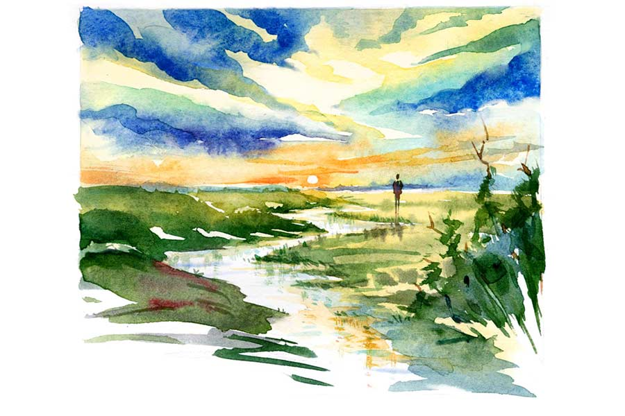

 
 <h1 align=center>মাঝে নদী বহে রে</h1>
<h2 align=center>বিক্রম অধিকারী</h2> 

দয়াল পালের প্রতিমা কারখানার সামনে আসলেই চুক্কুর ইশকুলের পথ থমকে যেত। এক দিন চুক্কু জিজ্ঞেস করেছিল, “দয়ালকাকা, দেবতা-সাধু-সন্ন্যাসীরা সব সময় ধুতি পরে, প্যান্ট পরে না ক্যান?”

দয়াল উদাস গলায় বলে, “সব ক্যানের কি জবাব হয় রে!”

নাছোড় চুক্কু ফের বলে, “কালী ক্যান সব সময় শিবের উপর দাঁড়াবে? কাকা, এক বার তো শিবকে কালীর উপর দাঁড় করান।”

দয়াল তেড়ে ওঠে, “ছ্যামড়া, স্কুল ফাঁকি দিয়ে ফাতরামি? তোর ডানা গজাইছে, না? দূর হ!”

মানুষের ডানা গজালে সে নিষ্কর্মা, ভবঘুরে হয়ে পড়ে। এক বার ভোলাভালা চুক্কু বাড়ি থেকে পালিয়ে দৌড় আর দৌড়। বেচারা কিছু ক্ষণ দৌড়েই বুঝেছিল, একমাত্র সিনেমাতেই নায়ক দৌড়তে দৌড়তে বড় হয়ে যায়। খোলা আকাশের ছাউনি। টলটলে ডুডুয়া নদীর উঠোন। দিগন্তের দেওয়াল নিয়েই চুক্কুর পৃথিবী। ডুডুয়া রেলসেতুর পিলারের নীচে কংক্রিট-বাঁধানো বেদিটাই চুক্কুর প্রিয় ঠিকানা।

*****

টনো চকচকিকে দেখলেই ছোঁকছোঁক করে। আর নির্লোভ চুক্কু নদীতে ঝুঁকে পড়া খেজুরগাছটির মতোই নির্বিকার। ডুডুয়ায় স্নানের সময় চুক্কু না থাকলে চকচকির শরীর জুড়োলেও মন জুড়োয় না। সে দিন চুক্কু কংক্রিটের বাঁধানো জায়গাটায় নদীর আঠালো মাটি দিয়ে মগ্ন হয়ে কিছু একটা বানাচ্ছিল। চকচকি চুপি চুপি গিয়ে দেখে, চুক্কু মাটি দিয়ে একটি মেয়ের মুখের আদল ফুটিয়ে তুলছে। আরে, এ তো অবিকল চকচকির মুখ! মাটির অবয়বে চুক্কুর দরদি হাতের সোহাগে বুঁদ চকচকির শরীরে অদ্ভুত-অসহ্য শিহরন। সে নীরবতা ভেঙে জিজ্ঞেস করে, “কার মুন্ডু বানাইস রে?”

চুক্কু চমকে ওঠে। চকচকি কলকলিয়ে হাসে, “ওই, সব সময় তুই এইখানে উদাস হইয়া বইয়া থাকোস ক্যান?”

চুক্কু বলে, “সব ক্যানের কি জবাব হয় রে?”

“চোখ বন্দ কইরা তুই অত্ত কী ভাবোস?”

“চোখ বন্দ কইরা দেখি সবুজ খ্যাতের বুক চিরা গ্যাছে একটা নদী। নদীর মইধ্যে একটা জলপরি।”

“তা জলপরিডা ক্যাডা?”

“ক্যারে, তুই!” চুক্কুর শখের দুটো ডানা ছিল। ইদানীং উড়তে গিয়ে বুঝতে পারে অজান্তেই ও চকচকির খাঁচায় বন্দি হয়ে গেছে।

*****

মাস শেষ হয়ে দু’সপ্তাহ পার। চকচকির ঋতুস্রাব হল না। নিজের শরীর নিজের কাছেই অচেনা ঠেকে। ও শিউরে ওঠে, রাক্ষস টনোর বিষ নির্ঘাত ওর পেটে বেড়ে চলেছে। ব্যাপারটা ঢি-ঢি হয়ে গেলেই ঘটনাটা চেটেপুটে খাবে পুরো তল্লাট। সব জানলে চুক্কুও তো আর ভালবাসবে না! ভয়ঙ্কর ব্যাপারটা গোপন রাখতেই হবে। নিষ্পাপ চকচকি বাঁচতে চায়— কলঙ্কমুক্ত হয়ে বাঁচতে চায়।

চুক্কু জলের ধারে গুনগুন করছিল, “ও পারে তুমি রাধে/ এ পারে আমি/ মাঝে নদী বহে রে...”

চকচকি তার কাছে এসে আকুল গলায় বলে, “চখা, তুই আমারে বিয়া করবি?”

আবেগে হাবুডুবু চুক্কু চকচকিকে খড়কুটোর মতো আঁকড়ে ধরে, “চখি রে, আমি তোরে ছাড়া বাঁচতাম না।”

চকচকি ভরসা পায়, বলে, “বাবা বিছনাত পইড়া রইছে। টনো সাইধ্যা বাবারে দশ হাজার টাহা ধার দিছিল। ওহন হারামিডা সময়ে-অসময়ে আইসা টাহা ফিরত চায়। আর কয়, ‘টাহাডা দে, নাইলে চল আমার বাড়িত কাম করবি।’”

চুক্কুর দৃঢ় গলা, “খবরদার! ওই খাটাস টনোর বাড়ি যাইস না কিন্তু।”

চকচকি ব্যাকুল হয়ে ওঠে, “তুই দশ হাজার টাহা দে, টনোর মুহে ঢেল মারবাম। আর এই সপ্তাহেই আমরা বিয়া করবাম।”

*****

চুক্কু নাকি এক বার জিনের খপ্পরে পড়েছিল। যায়-যায় অবস্থা। নামী গুনিন বলেছিল, “যত দিন গলায় কবজ থাকব, তত দিন পোলা বাঁইচা থাকব।”

বাবা ধার-দেনা করে চুক্কুর গলায় সোনার মাদুলি পরায়। চুক্কু সেই মাদুলি বিক্রি করে ন’হাজার টাকা পায়। বাড়ি ফিরে বৌদিকে বলে, “দাদা কই গো?”

“হাসপাতাল গ্যাছে।”

“ক্যারে?”

“বেগুনি শাড়ি পরা দিদিমণি কইছে, একটা অপারেশন করলেই সরকার টাহা দিব।”

“কী অপারেশন গো বৌদি?”

বৌদি ফিচেল হাসে, “ধূপগুড়ি হাসপাতালের ক্যাম্পে গিয়া কও, আমার তিনডা পোলাপান। তাইলেই হ্যারা কানেকশান কাইটা টাহা ধরায় দিব।”

রাতে চুক্কু দাদাকে বলে, “আমারে এক হাজার টাহা দে না?”

দাদার গলায় ঝাঁজ, “টাহা কই পায়াম? শালা, খাসি হইয়া মাত্র এগারোশো টাহা পাইছি। তুই তো মুক্ত বিহঙ্গ... টাহা লাগে ক্যারে?”

চুক্কু বলে, “আমি বিয়া করবাম।”

দাদা গর্জে ওঠে, “বাপ হওনের বয়স, দাদার ঘাড়ে বইয়া খাস। বৌরে কীতা খাওয়াইবে?

চুক্কু ফুঁসে ওঠে, “আমার চক্ষের সামনে দিয়া চকচকিরে কেউ লইয়া যাইব, এইডা হওনের দিতামই না।”

দাদার গলায় শ্লেষ, “তোর মুরাদ নাই। ছুডু সময় কাউয়া মুহের বিস্কুট লইয়া যাইত। আর ওহন কেউ বৌ লইয়া যাইব গা!”

চুক্কু তেড়ে ওঠে, “আমিও কামাই করবাম।”

সকালে দাদা চুক্কুকে দেড় হাজার টাকা দিয়ে বলে, “সোনাতলা হাট থেইক্যা ধানের বিছুন আর সার আনিস।”

চুক্কু বাস ধরে। মনের মোহনায় চিন্তার ঘূর্ণি। চুক্কু ডুডুয়ার এক পার হলে চকচকি অন্য পার। ডুডুয়ার দু’পারের মিলন কী ভাবে হবে? হায়! তা হলে কি চিমসা টনোর বাড়িতে কাজ কারতে যাবে চকচকি! উঁহু, ও এটা কিছুতেই হতে দেবে না। আচ্ছা, দাদাকে বললেই তো হয়, বাসে পকেটমার হয়ে গেছে! চুক্কুর প্রয়োজন তো মাত্র এক হাজার টাকা।

খালাসির, “হাসপাতাল, হাসপাতাল...” হাঁক শুনে চুক্কু নেমে পড়ে। নিজের ভালবাসার জন্য ও অন্যের টাকা নেবে না। নিজেকে টেনে নিয়ে গিয়ে চুক্কু হাসপাতালের লাইনে দাঁড় করায়। হাসপাতালের এক জন জিজ্ঞেস করে, “নাম-বয়স-বাড়ি?”

“চুক্কু মণ্ডল, সাঁইত্রিশ, বালাসুন্দর।”

“ছেলে-মেয়ে ক’জন?”

“এক গন্ডা।”

