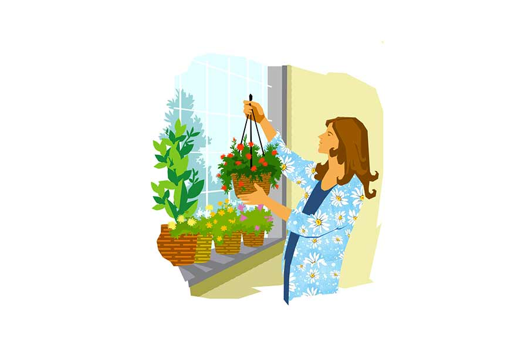

 
 <h1 align=center>মাধবীলতা</h1>
<h2 align=center>বিতস্তা ঘোষাল</h2> আজকাল গাছের নেশায় পেয়েছে সুনেত্রাকে। সকালে ঘুম থেকে ওঠার পর চায়ে চুমুক দিতে দিতে গাছগুলোর দিকে মন্ত্রমুগ্ধ হয়ে তাকিয়ে থাকে সে। তার বাগান ছাদে বা মাটিতে নয়। জানলায়। ডাইনিং রুমের বিশাল জানলা জুড়ে সে তার বাগান সাজিয়েছে। গ্রিল থেকে ঝুলছে নানা রকম বাহারি ফুল-পাতার গাছ। থরে থরে সাজানো নানা আকার, নানা রঙের পাত্রে উজ্জ্বল ফুল-পাতা।

সুনেত্রা চায়ের কাপ হাতে নিয়েই পরিচর্যা করে গাছেদের। ঝরে যাওয়া শুকনো পাতা, ফুল ফেলে দিয়ে আলতো করে হাত বোলায় তাদের গায়ে। ফিসফিস করে জিজ্ঞেস করে, “রাতে ভাল ঘুম হয়েছিল? কতটা জ্যোৎস্না খেলে শুনি? আহা রে, তোমাকে বুঝি বৃষ্টি আদর করেনি?...”

এ সব বলতে বলতে সে অল্প অল্প করে জল ঢালে মাটিতে, পাতায়। তার পর বলে, “এখন আর সময় নেই, ফিরে এসে বাকি কথা হবে।”

অফিস থেকে ফিরে স্নান সেরে পরিষ্কার ম্যাক্সি পরে বসে পড়ে গাছেদের নিয়ে। এতটা পাগলামি আগে ছিল না। অল্পবিস্তর চারা লাগালেও ফ্ল্যাটবাড়ির ছোট্ট বারান্দায় আর কতটুকুই বা জায়গা থাকে বাগান করার মতো! তার পর আবার তার উত্তরমুখো বারান্দা। রোদ প্রায় আসেই না। যতটুকু পাশের ফ্ল্যাটের ফাঁক দিয়ে এসে পৌঁছয়, সেখানেই দড়ি টাঙিয়ে জামাকাপড় মেলার ব্যবস্থা। ইচ্ছে থাকলেও খুব একটা প্রাধান্য পায়নি এই সখ্য।

এত বছর ধরে সংসারের কাজকর্ম, রান্না, ঘর পরিষ্কার, শাশুড়ির সব কিছু হাতে হাতে গুছিয়ে দিয়ে মেয়ে মানিনীকে স্কুলবাসে তুলে দিয়ে নিজে কোনও রকমে নাকে-মুখে গুঁজে অফিস। বাড়ি ফিরেও মানিনীর হোম ওয়ার্ক, সন্ধের জল খাবার, রাতের খাবার, তার ফাঁকেই সারা দিন কোন কোন কাজ সে করে যেতে পারেনি, শাশুড়িকে একা সামলাতে হয়েছে, তার ফিরিস্তি শোনা।

“তোকে দেখে মনে হয় বিশ্বসংসারে একাই তুই চাকরি করছিস। সারা দিন বাড়িতে কুটোটি নাড়তে হয় না, তার পরেও যেন ব্যস্ততার শেষ নেই। আমি না-হয় চাকরি করিনি, তা বলে কত বড় সংসার সামলেছি, ভাবতেও পারবি না। রাবণের চিতা যেমন নেবে না, তেমনি আমাদের বাড়ির উনুনও কখনও নিবত না। সেই কাক-ডাকা ভোরে শুরু, রাত বারোটায় সব গুছিয়ে তবে বিছানায়। তখন আবার অন্য উৎপাত। তোকে তার সিকি ভাগও ভোগ করতে হয় না…”

শাশুড়িমায়ের বলা এই কথাগুলো এ বাড়িতে আসা যাবৎ শুনতে শুনতে তার মুখস্থ হয়ে গেছে।

সুনেত্রা বলে, “তুমি শুনেছি পড়াশোনায় খুব ভাল ছিলে, চাকরি করলেই পারতে।”

“ভাল বলে ভাল! জেলায় প্রথম হয়েছিলাম। ছোট থেকে আমার পড়ার জন্য বাবাকে এক পয়সাও খরচ করতে হয়নি। চিরকাল ক্লাসে ফার্স্ট। স্কলারশিপ পেতাম।”

“তা হলে টেনের পর আর পড়লে না কেন?”

“আমাদের সময় টেন ছিল না। ইলেভেনে বোর্ডের পরীক্ষা হত। এটুকুও জানিস না।”

“জানি মা, আমি মূর্খ, স্কলারশিপও পাইনি। বাবা পয়সা খরচ করেই পড়িয়েছিল। কিন্তু তুমি পড়া ছাড়লে কেন?”

“যুগটাই অমন ছিল। আমার বাবা তার দুই ছেলেকে পড়ানো বেশি কাজের মনে করল। আর আমার জন্য পাত্র খোঁজা। মেয়েমানুষ, জজ-ম্যাজিস্ট্রেট তো হব না, তা হলে শুধু শুধু বাড়িতে পুষে লাভ কী? মেয়ে হল পরের ধন। যত তাড়াতাড়ি গোত্রান্তর করা যায় তত মঙ্গল।”

সুনেত্রা এ সব জানা সত্ত্বেও আবার বলে, “শুনেছি এ বাড়ির বাবা পড়াশোনা পছন্দ করত। তোমাকে কলেজে ভর্তি করে দেবে বলেছিল। হলে না কেন?”

“ওই মুখেই বলেছিল। সংসার ছেড়ে কলেজ গেলে হেঁশেল সামলাবে কে শুনি? এতগুলো দেওর, ননদ, বিধবা শাশুড়ি, আত্মীয়স্বজনের ভিড়। ‘যেটুকু শিখেছ তাতেই বাচ্চাদের প্রাইমারি অ-আ-ক-খ শেখানো যাবে বৌমা’— শাশুড়ি এমন ভাবে ঘোষণা করল, মনে হল বিচারক যাবজ্জীবন কারাদণ্ড শুনিয়ে দিল। সে সব তুই আর কী বুঝবি? আমার শাশুড়ির মতো শাশুড়ি পেলে টের পেতিস, কত ধানে কত চাল!”

“সে নয় বুঝলাম, কিন্তু তুমি তো শুনেছি চাকরিও পেয়েছিলে।”

“পেয়েছিলাম তো। গার্লস স্কুল তৈরি হচ্ছিল। মেয়েদের পড়ানোর জন্য শিক্ষিত মেয়ে-বৌ লাগবে। তোর শ্বশুরের বন্ধু এসে বলল শাশুড়িকে, ‘মাসিমা, এ অঞ্চলে মাধবীর মতো শিক্ষিত বৌ একটাও নেই। সরকার স্কুল খুলছে। আমি দায়িত্বে আছি। মাধবী যদি পড়ায়, ছাত্রীদের খুব উপকার হবে।’

“আমি ভিতরের ঘর থেকে দরজায় কান পেতে শুনছি, মনে মনে ভগবানকে ডাকছি, মা যেন হ্যাঁ বলেন! বাড়ি এসে সেধে চাকরি, তাও আবার সরকারের। কিন্তু বিড়ালের কপালে কি শিকে ছেঁড়ে! মাইনেপত্র কত দেবে, ক’টা থেকে ক’টা থাকতে হবে সব জেনে নিয়ে শাশুড়ি বললেন, ‘স্ত্রীলোক এত ক্ষণ বাড়ির বাইরে থাকলে নিজের সন্তানদের কখন দেখবে, সংসার কখন করবে? ওই তো কুড়ি টাকা মাইনে। আমার খোকা এর থেকে বেশি পায়।’

“তাপুদা বলেছিল, ‘কিন্তু মাসিমা, শিক্ষক-শিক্ষিকাদের হাত ধরেই তো শিক্ষিত প্রজন্ম তৈরি হয়!’ তাকে থামিয়ে দিয়ে শাশুড়ি বললেন, ‘থামো তো বাবা, সরকারকে বলে দিয়ো আমাদের বাড়ির বৌ নাচতে নাচতে চাকরি করতে যাবে, আর সেই টাকায় সংসার চলবে, তেমন হা-ভাতে পরিবার আমার নয়।’

“তাপুদা চলে গেছিল সে দিন। বুঝতে পেরেছিলাম, খারাপ লেগেছিল তার। তোর শ্বশুর আসার পর বললাম সব। শুনে বলল, ‘জানি। কী আর করবে? মায়ের যখন মত নেই তখন আপাতত চুপ থাকো। পরে ভেবে দেখা যাবে।’”

সুনেত্রা বলে, “তা পরে ভেবে দেখলে না কেন?”

“ওরে, ও সব তোর শ্বশুরের মিথ্যে স্তোকবাক্য। আমার থেকে কম শিক্ষিত, ক্লাস টেন ফেল মেয়েদের নিয়ে স্কুল শুরু হয়ে গেল। আর আমি! নিজের চারটে বাচ্চা, দেওর, ভাশুরের বাচ্চার দায়িত্বও ঘাড়ে এসে পড়ল। হেঁশেল তো ছিলই!” বলে দীর্ঘশ্বাস ফেলে মাধবী বললেন, “তোর মতো কি কপাল আমার? একে শহরের মেয়ে, তার উপর এমএ পাশ। আমার সাধ্য কী তোকে আটকানোর! তা ছাড়া আমার ছেলে তো স্ত্রৈণ। আমি বারণ করলে সে কি শুনত!”

“তা হলে তুমি চাও না আমি চাকরি করি?”

“আমার চাওয়ার কী দাম?” বলে যৌথ পরিবারের আজীবন অহঙ্কার নিয়ে মাধবী বলতেন, “দেওর ভাশুরের ছেলেমেয়েরা মাথায় করে রাখে আমাকে, মেয়েরা তো মা বলতে অজ্ঞান। কিন্তু জামাইয়ের বাড়িতে থাকলে নিন্দে হবে। তোর মতো অলক্ষ্মীর সঙ্গে থাকতে আমার ইচ্ছেই হয় না। নেহাত মানিনীকে ছেড়ে থাকতে পারি না...”

সুনেত্রা শোনে, ভাবে কিছু বলবে। কিন্তু চুপ করে যায়। মানুষের বয়স বাড়লে কেউ আর দায়িত্ব নিতে চায় না, যত আপনই হোক না কেন! মাধবীও বোঝেন, কিন্তু প্রকাশ করেন না। দু’জনের এই লুকোচুরি পর্বটা চলতেই থাকে।

মানিনী গ্র্যাজুয়েশন শেষ করে বিদেশ চলে গেল, সুনেত্রার বর সোহমও বেশির ভাগ সময় চাকরির প্রয়োজনে বাইরে। অফিস থেকে বাড়ি ফিরতে ইচ্ছে করে না সুনেত্রার। কিন্তু মাধবী দেবীর অনর্গল ফোন তাকে ফিরিয়ে নিয়ে আসে বাড়িতে।

“মুখপুড়ি, সারা দিন আমি একা থাকি, তোর বাড়ি ফিরতে ইচ্ছে করে না? আমার দমবন্ধ হয়ে আসে, কথা বলার একটা কেউ নেই, তোর মধ্যে মায়া দয়া সব কি লোপ পেয়েছে?”

সুনেত্রা বলে, “রাধু থাকে সব সময়, তা ছাড়া ফোনে সকলের সঙ্গে কথা বলতে পারো তো! আমার সঙ্গে তোমার আর কী এমন কথা হয়?”

মাধবী বলেন, “বয়স হোক, তখন বুঝতে পারবি একা থাকার যন্ত্রণা। তোকে তাড়াতাড়ি ফিরতে বলেছি, তুই ফিরবি। নইলে... নইলে আমার ভয় করে...”

“কিসের ভয় মা?”

“তা জানি না। তবে চার দিকে আমি পায়ের শব্দ শুনতে পাই। মনে হয় একদম মাথার কাছে এসে দাঁড়িয়ে আছে তারা।”

“কারা দাঁড়িয়ে আছে?”

মাধবী সুনেত্রার মুখের দিকে তাকিয়ে থাকেন এক দৃষ্টিতে। যেন কিছু খোঁজে। বলেন, “তেনারা...” বলে মাথায় হাত ঠেকায়। তার পর বলে, “তোকে আর অফিস করতে হবে না। অনেক দিন ছুটি নিসনি। বাড়িতে থেকে বিশ্রাম নে।”

সুনেত্রা বলে, “ক’দিন দিদিভাইদের বাড়ি ঘুরে আসবে? কিংবা অন্য কোথাও যাবে?”

তৎক্ষণাৎ উত্তর আসে, “না। তোকে বাড়ি থাকতে বলেছি, থাকবি। নইলে আমি একাই যে দিকে দু’চোখ যায় চলে যাব...”

সত্যি, মাধবী একা একাই চলে গেলেন। চিরঘুমে তলিয়ে যাওয়ার আগে বলেছিলেন, “পরের জন্মে আমার মেয়ে হোস রে মা। তোকে পেটে ধরে গর্ভশুদ্ধি করতে চাই।”

তার পর থেকে সুনেত্রা অফিস থেকে ফিরেই বসে পড়ে গাছেদের নিয়ে। সে ভাবে, তার অপেক্ষায় মাধবী বসে আছেন গাছের ডালে। সেখান থেকে বলছেন, ‘দেখ, লাল জবাটা কাল ফুটবে। ওটা কিন্তু তুই তুলবি না। বড্ড লাগবে বৃন্ত থেকে ছিঁড়ে নিলে।’

“আমি কখনও ফুল ছিঁড়ি না,” সুনেত্রা বিড়বিড় করে।

‘এই গাছটায় জল দে বেশি করে। খুব জলতেষ্টা পেয়েছে। পিতৃতর্পণের যত ধুম! মায়েদের জন্য কিচ্ছু নেই!’

সুনেত্রা তাড়াতাড়ি জল ঢালে, নিজের মনে বলে, “তুমি বড্ড কম জল খাও। এত বার ইউরিন ইনফেকশন হয় তোমার।”

মাধবী বলেন, ‘তুই এমন বেআক্কেলে হলি কী করে? তোকে কে শেখাল মানুষ হতে?’

“মানুষ জন্ম পেতে গেলে চুরাশি লক্ষ যোনি অতিক্রম করতে হয়।”

‘খুব পণ্ডিত হয়েছিস, তাই না? চুরাশি লক্ষ যোনি পেরিয়েও মানুষ হওয়া যায় না। খালি মানুষের ভেক ধরা হয়।’

“তুমি আর জন্মাতে চাও না?”

‘না বাবা!’

“শাস্ত্র বলে, এত সহজে মুক্তি মেলে না।”

‘শাস্ত্র সব ভুল বলে। আমার দাদু এত স্কুল প্রতিষ্ঠা করেছিল, সংস্কৃত বিশারদ ছিল, তার মনে কত কষ্ট মেয়েদের জন্য, অথচ আমার বেলা! পড়তে দিল? তখন মেয়েদের জন্য সংসার, সন্তান...’

“কিন্তু ভেবে দেখো...”

‘চুপ কর! মেয়েদের বেশি কথা বলতে নেই। বেশি বলে ফেলেছিল বলে খনার জিব কেটে দেওয়া হল, কি না বরাহমিহিরের প্রতিপত্তি কমে যাচ্ছে, খনা সব গণনা নির্ভুল বলছে, বেচারা মরে মুক্তি পেল।’

“সে তো পৌরাণিক যুগে...”

‘কিছু কাল আগেই বা কি আলাদা ছিল? জ্যান্ত মেয়েগুলোকে পুড়িয়ে মেরে সতীর মহিমা প্রচার করা হল।’

সুনেত্রা বলে, “মহাভারতে মাদ্রী নিজেই সতী হয়েছিল। রাজপুত রমণীরা জহরব্রত করত।”

‘তুই দেখছি ক্রমশ আরও মূর্খ হয়ে যাচ্ছিস। এ সব বানানো। কেউ নিজে থেকে ওই গনগনে আগুনে ঝলসে মরতে চায়! সামান্য ছেঁকা লাগলেই কত কষ্ট... ভাগ্যিস রামমোহন, বিদ্যাসাগর জন্মেছিলেন। প্রকৃতি যাদের সৃষ্টি করেছে, তাদের এত যন্ত্রণা সে দিতে পারে? সবাই তার সন্তান। এই দেখ ফুলগুলো কেমন বাতাসে দোল খাচ্ছে, পাতারা গান গাইছে, এদের কেউ কষ্ট দিক দেখি! সঙ্গে সঙ্গে তাণ্ডব শুরু। খরা, বন্যা, ভূমিকম্প, ঝড়, দাবানল... প্রতিশোধ নিয়ে তবে সে ক্ষান্ত হবে।’

“তুমি কী চাও?”

অনেক ক্ষণ কোনও উত্তর আসে না। তার পর কে যেন ফিসফিস করে বলে, ‘এত বছর সংসার, সন্তান সব নিয়ে কাটিয়েও মানুষ হলাম না, কাউকে করতেও পারলাম না। যদি জন্মাতেই হয়...’

সুনেত্রা তাকিয়ে থাকে জানলার দিকে। সারি সারি ছোট মাঝারি রংবেরঙের গাছ সেখানে। থোকা থোকা লাল ফুল ধরে মাধবীলতা গাছটায়। সে দিকে তাকিয়ে থাকতে থাকতে তার মনে হয়, স্কার্ট শার্ট পরে দুই বিনুনি বেঁধে ছোট্ট মাধবী চলেছে। তার পিঠে ব্যাগ-ভর্তি বই। ক্রমশ পুরো বাগানটা জুড়ে এক দল বালিকার হাসি ভেসে আসে, সে দেখে— পাতা আর ফুলগুলো হাওয়ায় দুলছে কী এক আশ্চর্য উচ্ছ্বাসে।