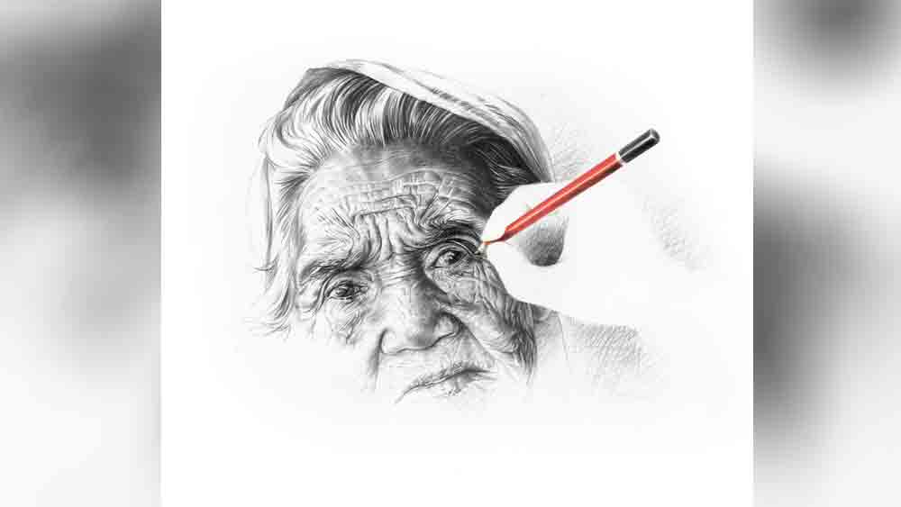

 

<h1 align=center> মাস্টারপিস</h1>
<h2 align=center>সৌম্যদীপ বন্দ্যোপাধ্যায়</h2>
সাদা কাগজের উপর ধূসর বর্ণে তৈরি হচ্ছে কোনও এক মুখের অবয়ব। মহিলার না পুরুষের, তা এখনও স্পষ্ট নয়। পেন্সিলের টান কোথাও দীর্ঘ, কোথাও ধীর, কখনও দ্রুত, কখনও অস্থির। কাগজের উপরে গ্রাফাইটের খসখস শব্দ চারদিকের হট্টগোলকে ভেদ করে ইঙ্গিত দিচ্ছে আসন্ন এক মাস্টারপিসের। আলোছায়ার আশ্চর্য বৈপরীত্য ফুটে উঠছে মলিন ও গাঢ় রেখার চাপানউতোরে। পেন্সিলে চাপ দিতে কপালের প্রতিটি ভাঁজের গাম্ভীর্য আস্তে আস্তে সামনে আসছে।   এই যাঃ… পেন্সিলের সিসটা ভেঙে গেল। এই নিয়ে বেশ কয়েক বার… কাঠের পাতলা টুকরোগুলো পাশেই পড়ে আছে। আর একটু নয় জমবে… তাতে কী! তাতে কিছু নয় বলেই তো অসীম এখনও ছবি আঁকছে, সৃষ্টি করছে, নিজের স্বপ্ন বাঁচিয়ে রাখছে অবিরাম! ঠিক এমনই ভেঙে পড়ার ঘটনা ওর জীবনে বারবারই ঘটেছে। এই তো আজই সকালে… মোটা সিসের পেন্সিলটা ছুরি দিয়ে ছুলে সবে ব্যাগে ভরতে যাবে, এমন সময়ে বাবা দুম করে ঘরে ঢুকে বললেন, “এসব কি তোকে পেটের ভাত দেবে?”   অসীম অন্যান্য দিনের মতো আজও উত্তর দেয়নি, মাথা নিচু করে বেরিয়ে এসেছে। নিজেকে আবারও সেই কথাটাই বলেছে যে কথাটা ওর ছোটবেলার প্রথম ড্রয়িং টিচার ওকে বলেছিলেন, “একটা সময়ের পরে এই রং-পেন্সিলই জীবনের স্বাদ দেবে!” কথাটা শুনতে ভাল লাগলেও অসীম জানত ‘স্বাদ’ পেট ভরায় না, মন ভরায়। পেট ভরায় টাকা, যার জন্য সে এখনও বাবার উপর নির্ভরশীল। তাই উত্তর দেওয়ার মতো যথেষ্ট শব্দ থাকলেও তাঁর সামনে শব্দ করার মতো সাহস অসীমের হয় না। তবে হ্যাঁ, স্বপ্নপূরণের রসদ, যেমন, কাগজ, পেন্সিল, পেন, ক্যানভাস, রং ইত্যাদি সরঞ্জাম সে নিজেই জোগাড় করে, কয়েকটি বাচ্চাকে পড়িয়ে এবং আঁকা শিখিয়ে। তবে, সম্পূর্ণ আত্মনির্ভর হওয়ার যে ইচ্ছে লুকিয়ে আছে অসীমের মনে, তার তাগিদেই সে খোঁজ করছিল উপায়ের। যে কোনও ভাবে আয় করতে সে চায় না। সে চায় ভাল লাগাকে অবলম্বন করে বাঁচার রসদ জোগাড় করতে, নিজের ‘প্যাশন’-কে ‘প্রফেশন’ করে তুলতে।   কপালের ভাঁজগুলো ফুটিয়ে তোলার পর ধীরে ধীরে ভুরু হয়ে চোখের ক্ষুধার্ত চাহনিটা পেন্সিলের অজস্র জালিকাকার রেখায় রূপ দিচ্ছে অসীম। চোখের নীচের ভাঁজগুলো স্পষ্ট ইঙ্গিত দিচ্ছে ছবির চরিত্রের বয়স ও অভাবের। তার দু’চোখের ব্যবধান একচোখ বুজে, ভাল করে মিলিয়ে নিল অসীম।   ঠিক আছে… এ বার চোখের মণিটা ফুটিয়ে তুলতে হবে। অজস্র ভাঁজ, একের উপরে এক রেখা, কোথাও সরল কোথাও জটিল... ছুরি দিয়ে পেন্সিলটা আবারও ধারালো করে তোলে অসীম। প্রতিকৃতির চোখ আঁকবে এ বার সে।   “হ্যাঁ, হ্যাঁ, ও ভাবেই থাকুন! এ দিক ও দিক করবেন না… হয়ে এসেছে… আর বেশি ক্ষণ লাগবে না…” মুখে বলে ওঠে অসীম।   সময়! এটাই তো কেউ দিতে চাইছে না অসীমকে। তাড়াতাড়ি নিজের পায়ে দাঁড়াবে এই স্বপ্ন দেখে খরচা করে ওর বাবা ওকে টেকনিক্যাল লাইনে ঠেলে দিয়েছেন। অসীম টেকনিক্যাল হতে ভালবাসে, তবে যন্ত্র জোড়া লাগাবার জন্যে নয়। পেন্সিল ধরা থেকে আরম্ভ করে ছবির শেষ আঁচড় পর্যন্ত যে লম্বা জার্নি, তা সফল ভাবে অতিক্রম করার যে সব টেকনিক, যে সব খুঁটিনাটি, সে সব জানতে চায় অসীম। ওর বাবার ইচ্ছে থাকলেও যন্ত্রের প্রতি ওর টান নেই, ওর ইচ্ছে মানুষ দেখা… বোঝা… উপলব্ধি করা… আর নিজের ভাবনা আর পেন্সিলের আঁচড়ে তাকে যত্ন করে রি-ক্রিয়েট করা।   ছোটবেলায় বাবা-মা ড্রয়িং টিচার রেখেছিলেন ছোট্ট ছেলেকে রঙের দুনিয়ার সঙ্গে আলাপ করাতে, তবে এই আলাপ যে বয়স বাড়ার সঙ্গে সঙ্গে গভীর প্রেমে পরিণত হবে তা তাঁরা ভাবতে পারেননি। আজ সেই প্রেমকেই সে জীবনসঙ্গী করতে চায়!   অসীমের ইচ্ছে আর্ট কলেজে ভর্তি হওয়ার, সেখানে চিত্রশিল্প নিয়ে লেখাপড়া করে ও প্রমাণ করতে চায় যে, তার স্বপ্ন তাকে ভাত দিতে পারে।   তবে, স্বপ্ন আর বাস্তব যে দুই আলাদা মেরু, সে আভাস অসীম ধীরে ধীরে পাচ্ছিল। বিগত তিন বছরে সে নানা জায়গায় একাধিক ছবির প্রদর্শনীতে অংশ নিয়েছে। তার ছবি দেখে লোকে মন্ত্রমুগ্ধের মতো বলেছে, ‘অসাধারণ!’ ‘অতুলনীয়!’ ‘মাইন্ডব্লোইং!’   কিন্তু যখন সে কাছে গিয়ে বলেছে তার ছবির ধার্য মূল্য, শখের শিল্পানুরাগীরা হালকা হেসে পাশ কাটিয়েছে। অসীম বারবার চেষ্টা করেছে নান্দনিকতা আর উপার্জনের মধ্যে একটা সরলরেখা আঁকতে, কিন্তু পারেনি। স্কুল থেকে কলেজে যেতে তার কাছে জীবনের সংজ্ঞা কিছুটা হলেও বদলেছে, তৈরি হয়েছে বাস্তবের ধারণা। আগের মতো ফুল, ফল, পাখি, বাড়ি-ঘর, গ্রাম, নদী ইত্যাদি রংবেরঙের কাল্পনিক ছবি আঁকা সে বন্ধ করেছে। ঠিক করেছে এ বার সে রাস্তায় নেমে মানুষের ছবি আঁকবে সাদাকালোর আলোছায়ায়।   গালে, নাকের পাশে এবং ঠোঁটের উপরে যে অসংখ্য ছোট-বড় ভাঁজ, সেগুলোকে কখনও পেন্সিলে, কখনও আঙুল দিয়ে ঘষে, আবার কখনও রবারের কোণ দিয়ে মুছে একটা অপূর্ব বাস্তবতা নিয়ে আসছে অসীম তার প্রতিকৃতিতে। বয়স বাড়লে কোথায় চামড়া কতটা কুঁচকোয়, কোন পেশি কতটা আলগা হয়, কতটুকু ছায়া আর কতটুকু আলো হয় সেটা সে ধীরে ধীরে দেখতে আর বুঝতে শিখছে নিজের সৃষ্টির মধ্য দিয়ে। যে মানুষটার মুখ সাদা কাগজের উপর একপা-একপা করে তৈরি হচ্ছে, তাকে অসীম কলেজে যাওয়ার সেই প্রথম দিন থেকে দেখছে ট্রেন থেকে নেমে প্ল্যাটফর্মের উপর দিয়ে হেঁটে যাওয়ার পথে, কখনও এখানে, কখনও ওখানে। তিনি ভিক্ষা করেন। প্রথম দিকে অসীমের তাকে দেখে দুঃখ হয়েছিল। সে তাকে দু’-চার টাকা করে দিয়েও ছিল দু’-এক দিন। কিন্তু, তার পর ধীরে ধীরে সে বুঝতে পেরেছে, এতে দুঃখের কিছু নেই, এটাই বাস্তব! তার মাথায় যখন বাস্তব প্রতিকৃতি আঁকার ভূতটা চাপল, তখন যে মুখটি তার চিন্তায় প্রথম ভেসে উঠেছিল, সেটি এই ভিখারিনিরই। আজ ট্রেন থেকে নেমেই সে খুঁজেছে সেই বৃদ্ধাকে। তাকে সে দেখতে পেয়েছে প্ল্যাটফর্মের একেবারে শেষ প্রান্তে চাদর মুড়ি দিয়ে বসে থাকতে।   বৃদ্ধার কাছে গিয়ে অসীম বলেছে, “আমি ছবি আঁকি। এমন অনেক জায়গা আছে যেখানে হাতে আঁকা ছবি দেখানো হয়, আবার বিক্রিও হয়… আমার ছবি সেখানে যায়…”   বৃদ্ধা নির্বিকার। কী আসে যায় এ সবে তার!   “বলছি আমি আপনার ছবি আঁকতে চাই। কিছু করতে হবে না আপনাকে, এখানেই এ ভাবে বসে থাকবেন, ঘণ্টা দু’-একের ব্যাপার…” অসীম বলল।   বৃদ্ধা শুনে অবাক। তার ছবি কেউ কেন আঁকবে? কে সে? কোনও পরিচিত মুখ তো সে নয়! তার অনুমতিই বা কে নেয়! কেউ তার ছবি আঁকুক, বা না আঁকুক তাতে তার কিছু যায় আসে না। তবে ঘণ্টা দু’-এক এক জায়গায় চুপ করে বসে থাকা তার পক্ষে সম্ভব নয়। পুরো প্ল্যাটফর্ম জুড়ে ঘুরে ঘুরে তাকে ভিক্ষে করতে হয়। তবেই দিনের শেষে যা হোক করে কিছু জোটে। সৃষ্টির খিদে যেমন অসীমের চিন্তায়, এই বৃদ্ধা স্বাভাবিক জৈব নিয়মেই পেটের খিদে নিয়ে বেশি চিন্তিত।   “এমনি বসতে হবে না। আমি আপনাকে এই কাজের জন্য টাকা দেব। আর্ট কলেজে এ রকম হয়। সেখানে এই রকম কিছু মানুষ আসেন, তাঁদের বসিয়ে সবাই ছবি আঁকে, যাঁরা বসেন তাঁদের ‘মডেল’ বলে। এ কাজের জন্য তাঁরা টাকা পান। এটাই তাঁদের রুজি-রোজগার। আমিও আপনাকে বসার জন্য টাকা দেব। এই নিন…” বলে অসীম তার হাতে দুটো একশো টাকার নোট গুঁজে দিল, “ভিক্ষে দিচ্ছি না কিন্তু, এটা আপনার নিজের রোজগার ভাবুন, আপনার কাজের জন্য…”   ভিক্ষে করে বৃদ্ধার কতই বা উপার্জন হয়! এক দিনে যা হয়, অসীম হয়তো তার দ্বিগুণেরও বেশি টাকা তাকে দিয়েছে। ‘না’ বলার তেমন কোনও কারণ কি আর আছে তার! বৃদ্ধা এলোচুলে যেমন বসে ছিলেন তেমনই রইলেন, টাকাটা নিয়ে খানিক ক্ষণের জন্য হতবাক হয়ে বিড়বিড় করলেন, “ভিক্ষে নয়! এত টাকা একসঙ্গে… আমার রোজগার!”   অসীম তাকে শুধু স্থির হয়ে বসতে বলে ব্যাগ থেকে তার সাজ-সরঞ্জাম— বড় একটা বোর্ড, সাদা কাগজ আর ছোট-বড় অনেকগুলো পেন্সিল, রবার বের করল।   “দয়া করে নড়বেন না, আমি না বললে...” গভীর মনোযোগে কাজ শুরু করে দিয়েছিল অসীম।   এই বৃদ্ধাকেই অসীম বেছে নিয়েছে, কারণ এত দিনে সে তাকে খুব মন দিয়ে পর্যবেক্ষণ করেছে। বয়সের ভারে তিনি কিছুটা কুঁজো হয়ে গেছেন। গা আর মুখের চামড়া কুঁচকে গেছে বেশ। একজন চিত্রশিল্পীর জন্য এমন কারও মুখ আঁকা যেমন চ্যালেঞ্জিং, তেমনই শান্তিরও। যে কেউ এমন মুখ আঁকতে পারবে না। এর জন্য জানা থাকা চাই কৌশল, থাকা চাই যথেষ্ট অধ্যবসায় আর সাহস— এত কঠিন একটি প্রতিকৃতি আঁকতে চেষ্টা করার সাহস আর লোকে কী বলবে তার তোয়াক্কা না করে সমাজের একেবারে নিচুতলার এক জনের সঙ্গে একই সমতলে সময় কাটানোর সাহস।   পেন্সিলটাকে হেলিয়ে ধরে দারুণ এক কৌশলে অসীম এ বার তার এলো চুল আঁকছে। কিছুটা ধূসর, কিছুটা স্পষ্ট, ছাড়ানো-জোড়ানো রেখার কোলাহলে এখন প্রায় শেষের পর্যায়ে তার প্রতিকৃতি।   অসীম ছবিটা শেষ হওয়ার পর ভাল করে দেখে কিছুটা খুঁতখুঁত করে বোর্ড আর পেন্সিলগুলো ব্যাগে ঢুকিয়ে রোল করতে যাবে এমন সময় আওয়াজ এল, “এক বার দেখাবে না বাবা… কীরম হল!’ হালকা একটা হাসি আর জড়তাময় কৌতূহলের সঙ্গে বৃদ্ধার আবেদন।   সামান্য অপ্রস্তুত হয় অসীম। দ্রুত ছবিটা হাতে নিয়ে “হ্যাঁ নিশ্চয়ই, এই দেখুন…” বলে অসীম কাছে গিয়ে তাঁকে ছবিটি দেখাল, “কী, কেমন হয়েছে? নিজেকে চেনা যাচ্ছে?”   বৃদ্ধা হাতে ছবিটি নিয়ে দু’চোখ ছোট করে দেখতে লাগলেন। হঠাৎ কী যেন ভেবে ছবিটা সঙ্গে নিয়ে মেঝের উপরে দু’হাতে চাপ দিয়ে সরীসৃপের মতো খানিকটা এগিয়ে প্লাটফর্মের ধারে পড়ে থাকা কিছুটা জলে নিজের মুখটা দেখতে চেষ্টা করলেন। এক বার সেই জলে নিজের মুখ দেখছেন আর পর ক্ষণেই দেখছেন আঁকা ছবিটির দিকে। কয়েক বার এমন করে আবার ফিরে এলেন নিজের জায়গায়।   “কী হল বুড়িমা… ঠিক হয়নি ছবিটা? চিনতে পারছেন না?”   বৃদ্ধা উত্তরে প্রশ্ন করলেন, “বাবা, তোমার নাম কী?”   “অসীম…”   মাথা নাড়ালেন বৃদ্ধা। তিনি আবার ছবিটির দিকে তাকিয়ে নিজের মনে বলতে লাগলেন, “এইটা আমি! কীরম যেন হয়ে গেছি এখন! মুখটা কেমন হয়ে গেছে… চুলগুলো সব…”   “কী বলছেন বিড়বিড় করে?”   বৃদ্ধা ঢোঁক গিলে গলা কাঁপিয়ে বললেন, “এটা তুমি কী করবে বাবা?”   “থাকবে আমার কাছে, কোথাও এগজ়িবিশন হলে নিয়ে যাব। তবে এ সব ছবি তেমন বিক্রি হয় না। সবাই পিঠ চাপড়ে চলে যায়, কিন্তু কেনে না। আসলে শিল্পীর নাম না হলে যত ভাল ছবিই হোক, কেউ কেনে না। যা-ই হোক… দিন ছবিটা, আমি এগোই, ছবিটা আপনার ভাল লাগেনি তাই না?” জিজ্ঞেস করল অসীম।   বৃদ্ধা ছবিটির দিকে তাকিয়ে বললেন, “এটা আমায় দেবে বাবা?”   “আপনাকে দেব?” অসীম অবাক হয়ে জিজ্ঞেস করে, “আপনি এটা নিয়ে কী করবেন?”   “আমার কাছে আমার নিজের কোনও ছবি নেই বাবা। আজ এইটা দেখে মনে হচ্ছে যেন, আমি আমায় দেখছি!’ বৃদ্ধার গলা কাঁপে, “ছবিটা দেবে আমায়?”   “ইয়ে মানে… মানে, এটা তো আসলে…” অসীম কী বলবে বুঝে উঠতে পারে না।   “এমনি দিতে হবে না তোমায়, আমি এটা কিনব!” বললেন বৃদ্ধা।   “কিনবেন আপনি এই ছবিটা… মানে?” অবাক হয় অসীম।   “তুমি যে বললে আঁকা ছবি নাকি বিক্কিরি হয়?”   “হ্যাঁ হয়, তবে… এটা...”   চাদরের এক কোণে, যেখানে তিনি অসীমের দেওয়া দুটো একশো টাকার নোট বেঁধে রেখেছিলেন, সেখান থেকে একটা বের করে তার দিকে বাড়িয়ে দিয়ে বললেন, “এই নাও বাবা… আমি এটাই দিতে পারব, আমায় ছবিটা দাও।”   “কিন্তু, এই টাকাটা তো...”   “এটা আমার টাকা বাবা, আমার কাজ করে পাওয়া… অন্য কারও নয়…” কিছুটা মাথা তুলে বৃদ্ধা বললেন।   অসীম অবাক হয়ে তার হাত থেকে টাকাটা নিল। সেটা মুঠোয় রেখে খানিকক্ষণ স্তব্ধ হয়ে রইল। তার পর নিঃশ্বাস ফেলে বলল, “আমি আসি বুড়িমা… ভাল থাকবেন।”   কিছুটা দূর এগিয়ে হাতের মুঠোটা খুলে অপলক দৃষ্টিতে সে চেয়ে রইল ভাল লাগার পথে করা তার প্রথম উপার্জনের দিকে। এতে লেগে আছে এক ভিখারিনির নিজের পোর্ট্রেট কিনে নেওয়ার মহার্ঘ আত্মসম্মানও।
