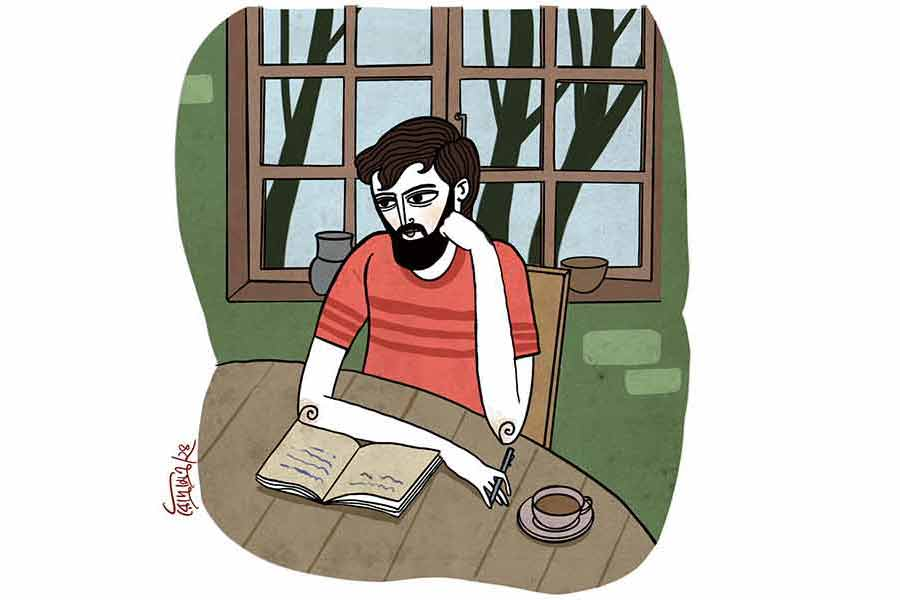

 
 <h1 align=center>মাহ ভাদর</h1>
<h2 align=center>রাজ্যশ্রী ঘোষ</h2> 

আমি শুদু তুমার রান্না কদ্দে চলে যাব গো বাবু। তোলা কাজ আমি কত্তি পারবুনি।”

“তা হলে ও সব করবে কে! ঘর ঝাঁট দেওয়া, বাসন মাজা, কাপড় কাচা?”

“আমার মেয়েরে পেইটে দেবখনি। হাজার টাকা দিতি হবে কিন্তু তারে।”

এই কথা বলে ফেলির মা হনহন করে পরবর্তী কাজের বাড়ির উদ্দেশে হাঁটা লাগায়। তার সময়ের খুব টানাটানি।

মফস্সলের এই ঝিম-মারা শহরে বাবুর সরকারি চাকরি লেগেছে। বাড়ি থেকে যাতায়াতে ট্রেনে লাগে ঝাড়া আড়াইটি ঘণ্টা। তাই পাততাড়ি গুটিয়ে কাজের জায়গার কাছাকাছি ডেরা বাঁধা। হপ্তায় পাঁচ দিন দশটা থেকে পাঁচটা সে কলম-পেষা কেরানি। বাকি সময়টা সে কবি।

আসলে সে কবিই। কিন্তু তার পোড়া দেশে ‘কবি’ হওয়ার যোগ্যতায় এমন কোনও কাজ সে জোটাতে পারেনি, যা তাকে বা তার পরিবারকে ন্যূনতম একটা অর্থনৈতিক নিশ্চিন্তি এনে দিতে পারে। তাই বাধ্য হয়ে এই কেরানির ছদ্মবেশ গায়ে চড়াতে হয়েছে। ঠিক যেমন তাদের গ্রামের মনোহর বৈরাগী শিব সেজে রেল স্টেশনে দাঁড়িয়ে থাকে।

ফেলির মা-র মেয়ে আসে বেলা করে। লিকপিকে চেহারা। অপুষ্টির কারণে বয়স ঠিক আন্দাজ করা যায় না। চোদ্দোও হতে পারে, আবার আঠারোও। বোকাসোকা হাবভাব। বড় বড় চোখে ফ্যালফ্যাল করে তাকিয়ে দেখে চার দিক। বাবুর বয়স সাতাশ। এই বয়সের একা-থাকা অবিবাহিত পুরুষ আর অল্পবয়সি কাজের মেয়ের সহাবস্থানে পাশাপাশি থাকা ঘি আর আগুনের স্বাভাবিক ধর্ম সংক্রান্ত যে ভয়ের আশঙ্কা থাকে, এই মেয়েটিকে দেখলে সে কথা কারও মনে আসবে না। কারণ সম্ভবত মেয়েটির মধ্যে ওই ধরনের আগুনের কোনও আঁচ পাওয়া যায় না, যা পুরুষকে উত্তপ্ত করে তোলে।

“ডাস্টবিনটা ফেলে আয় ফেলি।”

মেয়েটা চুপচাপ ডাস্টবিন থেকে ময়লা বোঝাই ব্যাগটা নিয়ে রাস্তায় দাঁড়ানো কর্পোরেশনের গাড়িতে ফেলে এসে বলে, “আমার নাম ফেলি নয়।”

“সে কী! তুই ফেলির মার মেয়ে নোস?”

“ফেলি আমার বড় বুনির নাম। আমার নাম তো বেস্পতি।”

এই বলে সে ফিক করে হাসে। তার মেজে রাখা বাসন, মুছে রাখা ঘর, কেচে তোলা জামাকাপড় সব ঝলমল করে। বাবুর মনটা আলো হয়ে যায়। বেস্পতি আগুন নয়, আলো ছড়ায়।

তবে আগুন ছড়ায় যে সব মেয়ে, তাদের বাবুটি বিলক্ষণ চেনে। এক জনকে তো চেনেই। লেখার সময়টুকু বাদ দিয়ে বাকি সময় সেই আগুনে সে রাতদিন ধিকিধিকি জ্বলে। কেবল লেখার সময় সে সব কিছু ভুলে যায়, জ্বালা-পোড়া পর্যন্ত। বাকি সময়গুলো কানে ভেসে আসে তার সঙ্গে হওয়া সেই সব কথা...

“আমাকে দেখতে এসেছিল। বাবার সেই পিএইচ ডির ছাত্র, তার ফ্যামিলি…”

“তুমি দিলে দেখা?”

কথা বলতে বলতে দাঁত চেপে বাবুটি একটা সিগারেট ধরায়।

“হুমম! দিলামই তো! নইলে ভবিষ্যতে কে আমাকে দেখবে বলো?”

“আমার উপর আর একটু ভরসা রাখা গেল না, না?”

“এ ছেলে অক্সফোর্ড যাচ্ছে। বিয়ের পর ইউ কে-তে সেট্ল করব আমরা। বিশ্বাস করো, কেরানির বৌ হয়ে ওই ধ্যাদ্ধেড়ে গোবিন্দপুরে একটা দিনও কাটানো আমার পক্ষে সম্ভব নয়।”

ফোন কেটে যাওয়ার শব্দ শুনতে শুনতে বাবুটি বাইরের নিকষ কালো অন্ধকারের দিকে তাকায়। তার মনে হয়, ওটা আসলে সম্পর্ক কেটে যাওয়ার শব্দ। ঝোড়ো হাওয়ায় কামিনী, কদম্বের গন্ধ ভাসে। সে টের পায় এ হাওয়া বৃষ্টির। তার দু’গাল বেয়ে বৃষ্টি নামে।

সেই রকমই এক বৃষ্টিতে ভিজতে ভিজতে বছর আটেক আগে দুই তরুণ-তরুণী ইউনিভার্সিটি ক্যাম্পাসের নিবিড় কৃষ্ণচূড়াটার নীচে প্রথম বার এসে দাঁড়িয়েছিল। সেই প্রথম দেখা।

“হাই! আমি বিয়াস।”

“নমস্কার। আমি সুশোভন।”

“আমি ইংলিশ ডিপার্টমেন্টের। তুমি?”

“আমি বাংলা।”

“আরে! তুমি বেঙ্গলি ডিপার্টমেন্টের সুশোভন! মানে সুশোভন মিত্র! তুমি কবিতা লেখো না? আমি পড়েছি তোমার কবিতা ইউনিভার্সিটি ম্যাগাজ়িনে! অ-সা-ধা-র-ণ লেখার হাত তোমার…”

সেই বৃষ্টিতে ভিজতে ভিজতেই বছর দুই আগে সুশোভন বাবাকে দাহ করে শ্মশান থেকে ফিরেছিল। বিনা নোটিসের এক হার্ট অ্যাটাকে সব শেষ। বেসরকারি সংস্থার কর্মচারী ছিলেন তিনি। জমানো টাকা কিছু ছিল না তেমন। দাদা বিয়ের পর বৌকে নিয়ে আলাদা। সংসারে মা আর এক বুড়ি পিসি। সুশোভন হাল না ধরলে সকলে মিলে না খেয়ে মরতে হয়।

“তাই বলে তুমি এ রকম একটা পাতি চাকরি করবে সুশোভন! বিশ্ববিদ্যালয়ে এত ভাল রেজ়াল্ট…”

“চাকরির বাজার খুব খারাপ। দেখছ না আমার মতো কত ভাল ভাল ছেলেমেয়ে বসে রয়েছে বছরের পর বছর একটা চাকরির আশায়। বয়স পেরিয়ে যাচ্ছে, কিছুতেই শিকে ছিঁড়ছে না। হোক কেরানিগিরি। তবু একটা সরকারি চাকরি তো! আমাদের পরিবারটা বেঁচে যাবে। আর এই চাকরি করতে করতে লেখালিখিও চালিয়ে যাওয়া যাবে দিব্যি। একটা স্বপ্ন থাকলে মানুষের আর কী লাগে?”

“আর আমার স্বপ্নের কী হবে সুশোভন? আমাকে ঘিরে আমার বাবা-মায়ের স্বপ্নেরই বা কী হবে?”

“তোমার স্বপ্নে কি আমি নেই বিয়াস?”

“কেন থাকবে না? কিন্তু আমার স্বপ্নের ‘তুমি’র সঙ্গে বাস্তবের ‘তুমি’র আজকাল মিল খুঁজে পাই না। পিএইচ ডি’টাও তো কমপ্লিট করলে না…”

“বিশ্বাস করো বিয়াস, ও সব গবেষণা-টবেষনার কচকচানি আমার জন্য নয়। আমি জানি আমি কী করতে চাই। কী করতে পারি আমি। আর সেটাই যদি না করি, তবে আমার বেঁচে থাকাটাই বৃথা, এ পৃথিবীতে এসে কেবলই সময়ের অপচয়।”

“আমার হবু বর বাংলা কবিগানের উপর দারুণ কাজ করেছে। কবিগান ইন দ্য লাইট অব পোস্টমডার্নিজ়ম! খুব ইন্টারেস্টিং, জানো তো! কত কী যে শিখি লোকটার থেকে! মারাত্মক বিশ্লেষণী ক্ষমতা ওর। আর তেমনই ধৈর্য। ও এক জন জাত গবেষক, ইউ নো!”

সুশোভন ভাবে, সকলে যদি কবিগান বা কবিতা নিয়ে গবেষণাই করে যাবে, তা হলে কবিতা নির্মাণ করবে কে? বাংলা কবিতার জিনপুলে নতুন বৈচিত্র কিছু না এলে, তার গতি তো স্তব্ধ হয়ে যাবে। ভবিষ্যতের গবেষকরাই বা নতুন নতুন বিষয় পাবে কেমন করে? বর্ষে বর্ষে দলে দলে সেই একই বিষয়ের চর্বিতচর্বণ করে যাবে সবাই? সে বলতে চায়, ‘এক দিন এমন হবে দেখো বিয়াস, ছাত্র-ছাত্রীরা আমারই কবিতা নিয়ে গবেষণা করবে…’

কিন্তু সুশোভন এ সব কথা বলতে পারেনি। কারণ সে জানে, আত্মবিশ্বাস আর আত্মম্ভরিতার মধ্যে পার্থক্য অতি সূক্ষ্ম। আত্মবিশ্বাস থাকে হৃদয়ের গভীরে। আর আত্মম্ভরিতা জিভের আগায়।

আসলে সুশোভন কোনও কথাই ঠিক মতো গুছিয়ে বলে উঠতে পারে না। তাই সে লেখে। তার নিজের কথাগুলো কেমন করে যেন এই পৃথিবীর আরও অনেকের কথা হয়ে ওঠে। কেমন করে এটা সম্ভব হয়, তা সে জানে না। এ তার কাছে এক গূঢ় রহস্য। এক অপার আনন্দ। এই আনন্দই প্রতিদিন ভোরে তার ঘুম ভাঙায়। দূর গ্রামের দিকে চলে গেছে যে পথ, সেই পথ ধরে হাঁটিয়ে হাঁটিয়ে তাকে কোনও এক দিঘির ঘন সবুজ পাড়ে এনে তোলে। সদ্য-ফোটা জবা-লাল মহাদ্যুতি সূর্যের মুখোমুখি দাঁড় করিয়ে দেয় নিয়মিত, বুড়ো শিবতলার প্রাচীন বটের নীচে রঘুদার চায়ের ঠেকে বসিয়ে বলে, ‘বুক ভরে শ্বাস নাও দিকি এ বার।’

এই আনন্দের তাগিদেই রত্নখনির শ্রমিকদের মতো মাটি, পাথর খুঁড়ে খুঁড়ে সে তুলে আনে শব্দ। অমূল্য, অমোঘ, ব্রহ্মস্বরূপ এক-একটি শব্দ। তার পর সেই সব শব্দের পরে শব্দ গেঁথে সে গড়ে তোলে অলৌকিক সব কবিতাশরীর।

এবং এই আনন্দই এক দিন ঝড় সেজে ল্যাং মেরে ধরাশায়ী করে দিয়ে যায় তাকে। যা করতে চাইছিল, তা আর শেষ পর্যন্ত করে ওঠা হয় না তার।

খাটের উপর কাঠের নড়বড়ে চেয়ারখানা বসিয়ে, তার উপর দাঁড়িয়ে উঠে লগবগ করতে করতে সে যখন এগিয়ে যাচ্ছিল সিলিং থেকে ঝোলানো দড়ির ফাঁসটার দিকে এবং ফাঁসটাকে দেখতে দেখতে ভাবছিল ঠিক যেন বাংলা বর্ণমালার ‘ঠ’, ঠিক সেই সময় ঘটনাটা ঘটে। দখিনের জানালার বাইরে মহানিমের পাতায় পাতায় হা-হা শব্দ তুলে ঘরে ঢুকে আসে সেই ঝড়! আচমকা ঝোড়ো হাওয়ার ঝাপট সামলাতে পারে না নড়বড়ে চেয়ার, চমকে উঠে টাল সামলাতে পারে না সুশোভনও। দামাল হাওয়া খাটে ড্রপ খাইয়ে একেবারে মেঝেয় এনে ফেলে কেরানি ওরফে কবি ওরফে বাবু ওরফে সুশোভনের রোদনক্লান্ত দুবলা শরীর। নিতম্বে অসহ্য যন্ত্রণা নিয়ে মেঝেতে চিৎপাত শুয়ে থাকতে থাকতে সে লক্ষ করে, রাস্তার আলো আর মহানিমের ডালপালায় মিলে, ঝড়ের তালে তালে সে কী অপূর্ব ছায়ানৃত্য বাধিয়ে তুলেছে তার অন্ধকার ঘরের দেওয়ালে!

অমনি সে বুঝে যায় অহো, রসো বৈ সঃ! সে অনুভব করে, তার যত শোক তাপ দুঃখ বেদনা, তারা সব আসলে রূপান্তরকামী। তারা বসে আছে কেবল করুণরসে রূপান্তরিত হওয়ার আশায়। সেই রসের ধারণা হৃদয়ে পেয়ে আনন্দে তার চোখ ফেটে জল আসে। হালকা লাগে মাথাটা।

সূর্যবিহীন, অন্ধকার, মেঘাচ্ছন্ন একটা দিনে তার ঘুম ভাঙে। আগের রাতে কী দুর্যোগটাই না গেছে! মাথার বালিশ পুরো ভিজে। জানালাটা খোলা ছিল কি না! ঘড়িতে দেখে বেলা এগারোটা। তাড়াতাড়ি লাফিয়ে উঠতে গিয়েও তার মনে পড়ে যায়, আজ রবিবার।

ফেলির মায়ের কাছে তার এই এক কামরার ভাড়া বাড়ির চাবি রাখা থাকে এক প্রস্ত। তাই দিয়ে দরজা খুলেই ফেলির মা ও তার মেয়ে যে যার মতো এসে কাজ সেরে দিয়ে চলে যায়। শোবার ঘর থেকে বেরোতেই আজ সে দেখল, দরজার পাশে দেওয়ালে ঠেস দিয়ে বেস্পতি বসে। এই এক মস্ত গুণ মেয়েটার। ঘরের দরজা ভিতর থেকে বন্ধ দেখলে সে ধাক্কা দেয় না। চুপচাপ বসে অপেক্ষা করে।

বেস্পতির যদিও রান্না করার কথা নয়। তবু সে আজ বাবুর মুখ দেখে, সঙ্গে আগের রাতের দুর্যোগ আঁচ করেই হয়তো বা, এক কাপ চা বানিয়ে এনে দেয়। চায়ের ধোঁয়া থেকে আদার সুগন্ধ ওঠে। কে জানে, দুর্যোগে পড়া মানুষকে হয়তো আদা-চা বানিয়ে দেওয়াটা এ দিককার মানুষের রীতি।

গরম চায়ের অপ্রত্যাশিত কাপটি হাতে নিয়ে এলোমেলো চুলে সুশোভন বারান্দার রেলিংয়ে ভর দিয়ে দাঁড়ায়। ধোঁয়া-ধোঁয়া বৃষ্টি-চাদরে দূরের দৃশ্য ঢাকা। চরাচর, যতটুকু চোখে পড়ে, জলমগ্ন। বাড়ির সামনের গলি, দূরের বড় রাস্তা, বাগান, পুকুর আলাদা করে চেনা যায় না কিছুই। এমন দিনেই তো জলে কাগজের নৌকো ভাসাতে হয়।

এক দৌড়ে ঘরে ঢুকে যায় সে। আলমারি খুলে মূল্যবান জিনিসপত্রের তাক থেকে টেনে বার করে তাড়া তাড়া চিঠি। রঙিন কাগজের সুগন্ধি খামে ভরা। অক্ষরগুলোর টান বড় চেনা, বড় মোহময়। সেই সমস্ত চিঠি একে একে পরিণত হয় রংবেরঙের এক একটা পাল-তোলা নৌকোয়। বারান্দার নীচের সরু গলিতে স্লেটবর্ণের কাদাজল ঘূর্ণি তুলে রাজ্যের ঝরাপাতা, শুকনো ফুল, ময়লা আবর্জনা নিয়ে নিরুদ্দেশযাত্রায় চলেছে। সেই যাত্রায় হেলেদুলে শামিল হয়ে যায় নৌকোগুলিও।

“হ্যাঁ রে বেস্পতি, এই বৃষ্টি মাথায় করে তুই এলি কী করে?”

বেস্পতি চুপ।

“তুই বাড়ি যাবি কী করে?”

বেস্পতির সাড়া নেই। সে জানালা দিয়ে উঁকি মেরে দেখে চলেছে, আবর্জনাময় কানা গলি কেমন নদী হয়ে ভেসে যায়!

