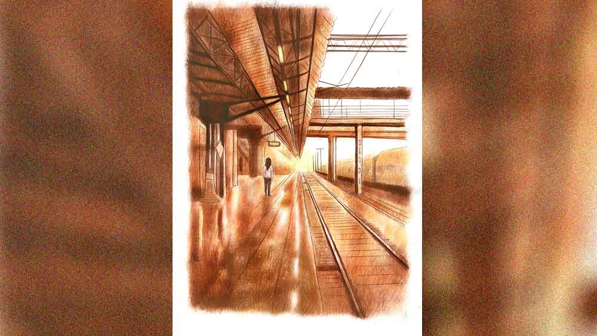

 
 <h1 align=center>মায়াডোর</h1>
<h2 align=center>অভিনন্দন সরকার</h2> পূর্বানুবৃত্তি: উত্তীয়র বাড়িওয়ালা জানায় উত্তীয় তার সমস্ত জিনিসপত্র ফ্ল্যাটেই রেখে চাবি বাড়িওয়ালার কাছে জমা রেখে নিরুদ্দেশ হয়ে গিয়েছে। তার পর মঞ্জীরা যায় অভিরাজের কাছে। জানতে পারে, সে দিনই উত্তীয়র শহর ছেড়ে যাওয়ার দিন। যদি উত্তীয়কে স্টেশনে পাওয়া যায়, এই ভেবে ট্যাক্সি নিয়ে ছুটল মঞ্জীরা। কিন্তু স্টেশনে যাওয়ার আগেই পথে পড়ল কলকাতা ময়দান। কী মনে হতে মঞ্জীরা ট্যাক্সি ছেড়ে সেখানেই নেমে পড়ল। কেন যেন তার মন বলছে, উত্তীয় সেখানেই কোথাও আছে। 

 

বেশি ক্ষণ খুঁজতে হল না মঞ্জীরাকে। বিশাল ঝুপসি গাছের নীচে, যেখানটায় ভেলপুরি আর ফুচকাওয়ালাদের ঘিরে মানুষের জটলা একটু বেশি, তারই অদূরে ঘাসের ওপর শুয়ে আছে লম্বা শরীরটা। আড়াআড়ি চোখের ওপর হাত রেখে লোকটা শুয়ে আছে। এক মুখ দাড়িগোঁফের জঙ্গল থেকে চেনা অবয়ব বুঝে নিতে একটু সময় লাগল মঞ্জীরার। তার পরই যেন শরীর অসাড় হয়ে এল তার। ধপ করে ঘাসের উপরেই বসে পড়ল মঞ্জীরা।

উত্তীয় চোখ খুলে চাইল, তার চোখ গভীর রাতের কোনও নক্ষত্রের মতো মিটমিট করছে। খুব ধীর ভাবে উঠে বসল উত্তীয়। চোখ রগড়াচ্ছে আদ্যন্ত অলস মানুষের মতো।

মঞ্জীরাকে দেখেও এতটুকু আশ্চর্য নয় সে। যেন উত্তীয় জানত এই সময়ে মঞ্জীরা এখানে এসে
হাজির হবে।

“এই মাঠে-ময়দানে পড়ে থাকা কত দিন চলছে?” মঞ্জীরার গলায় তিরস্কারের সুর।

“ওই মাঝে মাঝে আসি আর কী!” এক গাল দাড়ি নিয়ে হাসল উত্তীয়।

“মাঝে মাঝে! অফিসকাছারি সব শিকেয় তুলে দিনের পর দিন এখানে পড়ে থাকো। আমার কথা বাদ দাও, নিজের জন্যও তো একটু ভাল থাকা যায়! রোজ হাজারটা মানুষের সম্পর্ক ভাঙে, তারা সবাই এই রকম খামখেয়ালি বিহেভ করে?”

মঞ্জীরা থেমে গেল, রাগে তার গলা কেঁপে কেঁপে যাচ্ছে, “কোন সাহসে তুমি আমায় না জানিয়ে শহর ছেড়ে যাচ্ছ?”

উত্তীয় নির্লিপ্ত চোখে কিছু ক্ষণ তাকিয়ে রইল মঞ্জীরার দিকে, তার বিপুলায়তন রুকস্যাক
পিঠে তুলে নিয়ে মৃদু স্বরে বলল, “আমি জানতাম তুমি আসবে।”

তার পর খুব সাবধানে মঞ্জীরার হাত নিজের মুঠোয় নিল উত্তীয়,আঙুলের ভাঁজে সব ক’টা আঙুল জড়াজড়ি হয়ে গেলে সে বলল, “আমার ট্রেনের সময় হয়ে গেছে। চলো, ফেয়ারওয়েল দেবে চলো।”

শিয়ালদা স্টেশনে পৌঁছনো পর্যন্ত ওদের মধ্যে আর একটিও কথা হল না। উত্তীয়র ট্রেন প্ল্যাটফর্মে এসে গেছে। ওরা সে দিকে এগোতে লাগল।

গোটা পথ ট্যাক্সিতে চুপচাপ বসে ছিল উত্তীয়। জানলা দিয়ে অপলক তাকিয়ে ছিল বাইরের দিকে।

পড়ন্তবেলার সূর্য তার শেষ লালিমা বুলিয়ে দিয়ে যাচ্ছিল উত্তীয়র ঝাঁকড়া চুল আর অগোছালো দাড়ির ওপর। অদ্ভুত নিরাসক্ত দৃষ্টি তার চোখে, যেন এই শহরের ওপর থেকে সবটুকু মায়া উঠে গিয়েছে তার।

আর সম্ভবত সেই কারণেই শহরটাও আজ বেশ অন্য রকম। জমজমাট নয়, অবসন্ন এক গোধূলি নামছে শহরের বুকে। সিগন্যালের ওই সবুজ আলো, ফ্লাইওভারের রেলিংয়ে বসা একলা চড়াই আর শিয়ালদা স্টেশন বিল্ডিংয়ের মাথার ডিজিটাল ঘড়িটা জানে, আজ এক জন এই শহর ছেড়ে চলে যাচ্ছে, তাই আজ তাদের সবার মন খারাপ।

মঞ্জীরা দেখছিল এই ক’দিনে কী প্রচণ্ড শীর্ণ হয়ে গেছে উত্তীয়। তার গোটা শরীর দেখতেও পাচ্ছিল না মঞ্জীরা। দু’জনের মাঝখানে সিটের উপর তার প্রকাণ্ড রুকস্যাক রেখে দিয়েছে উত্তীয়। একটা সামান্য রুকস্যাক, তবু তা যে এত বড় হতে পারে ধারণা ছিল না মঞ্জীরার। চাইলেও সেই দূরত্ব সে কমাতে পারল না। পথটুকু ফুরিয়ে গেল।

 

উত্তীয়র আপার বার্থ। সেই বার্থে এক ধাক্কায় রুকস্যাক তুলে দিয়ে হাত ঝাড়ল উত্তীয়, অনেক ক্ষণ পর প্রথম কথা বলল সে, “থ্যাঙ্কস মঞ্জীরা। এত দিন এই শহরে রইলাম, অথচ ভেবেছিলাম অভিরাজ ছাড়া একটাও বন্ধু নেই আমার। তুমি এলে বলে খুব ভাল লাগছে। থ্যাঙ্কস ফর কামিং।”

বাহ! এর থেকে বেশি ফর্মাল কিছু বলা যেন সম্ভবই ছিল না তার পক্ষে। লোয়ার বার্থে বসা মঞ্জীরার গা জ্বলে গেল। মঞ্জীরা ঘড়ি দেখল, আর ঠিক এগারো মিনিট। তার পরেই এই ট্রেন উত্তীয়কে নিয়ে রওনা হবে অনেক দূরের এক শহরের দিকে। হয়তো চিরদিনের মতো। হয়তো আর কখনওই ফিরবে না উত্তীয়।

যন্ত্রচালিতের মতো ট্রেন থেকে প্ল্যাটফর্মে নেমে এল মঞ্জীরা। সে দেখল তার পিছু পিছু উত্তীয়
নিজেও নেমে এসেছে। উত্তীয় দু’ভাঁড় চা কিনল প্ল্যাটফর্মে নেমেই।

চায়ের ভাঁড়ে চুমুক দিয়ে বলল, “চলো, আমাদের গল্প এ পর্যন্তই। টেক ভেরি গুড কেয়ার অব ডাম্বো। নিজেও ভাল থেকো। বার বার আর জ্বালাতন করব না তোমায়।”

কথা শেষ করে বোকার মতো হাসল উত্তীয়।

তার হাসি সহ্য হল না মঞ্জীরার, সে বলল, “হ্যাঁ, অল দ্য বেস্ট টু ইউ। উইশ ইউ আ হ্যাপি
ম্যারেড লাইফ।”

উত্তীয়র ভুরু কুঁচকে গেল, “এ সব কে বলেছে তোমাকে? নিশ্চয়ই মিহিকা? উফ মঞ্জীরা! তোমার এই বোনটা একটা পাগল! আমি শহর ছেড়ে চলে যাচ্ছি শুনেই এমন শুরু করেছিল... তখনই আমি বুঝেছিলাম এ রকম কিছু করতে পারে ও। তোমায় ছেড়ে চলে গিয়ে নাকি আমি একটা বিরাট ক্রাইম করছি, এর থেকে বড় ভুল আর হয় না... আরও কত কথা। শুধু পাগল নয়, সে ভীষণ বোকা একটা মেয়ে। সে জানে না আমি দূরে চলে গেলে তুমিই ভাল থাকবে।”

মঞ্জীরা বিস্মিত হয়ে তাকিয়ে রইল উত্তীয়র দিকে। কী অবলীলায় সে দিন অত বড় কথাটা তাকে বলে গেল মিহিকা!

তবু মঞ্জীরা বুঝল, জমজমাট সন্ধ্যার গমগম করতে থাকা শিয়ালদা স্টেশনে মিহিকার ওপর তেমন রাগও হচ্ছে না তার।

উত্তীয় হেসে উঠল, “না, জীবনে অনেক পাপ করেছি, অনেক স্কিল শিখেছি... কিন্তু এক জনকে ভালবেসে অন্য কারও সঙ্গে জীবন কাটানোর স্কিলটা এখনও শিখে উঠতে পারিনি।”

 

মঞ্জীরার মনে হল তার ভিতরের কিশোরী মেয়েটি আড়মোড়া ভাঙছে, আশ্চর্য এক চাঞ্চল্য কাজ করছে তার মধ্যে। সম্ভবত সেই অস্থিরতা থেকেই মঞ্জীরা বলল, “কিন্তু নিজের কেরিয়ার ফেলে, সব ছেড়ে এ ভাবে যাওয়ার কী হল? কষ্ট তো আমি তোমায় দিয়েছি, শাস্তিটাও আমাকেই দিলে হত না?”

“না মঞ্জীরা। কেউ কাউকে কষ্ট দিতে পারে না,” উত্তীয় চায়ের ভাঁড়ে বড় করে চুমুক দিল, “আমার পাওনা এটুকুই ছিল। যেটুকু পেয়েছি তাই অনেক। কিন্তু একটা সময়ের পর নিজের কাছেই নিজে হেরে যায় মানুষ। না হলে কী আর এমন অসুবিধে ছিল বলো? দিব্যি এ ভাবেই কাটিয়ে দিতে পারতাম জীবন। তোমার পাশে পাশে থেকে, তোমায় বিব্রত না করে। হেরেছি নিজের কাছে, কষ্টও নিজেই নিজেকে দিয়েছি। কিন্তু মুশকিল হল সব জেনেও নিজেকে বোঝাতে পারছি না। এখানে থাকলে বার বার তোমায় কষ্ট দেব, তোমার দুর্বলতার জায়গায় আবার আঘাত করব। আর তা ছাড়া যেটা তুমি চাও না, সেটা নিয়ে কেনই বা জোর করব বলো! তার থেকে এই ভাল, তাই না?”

উত্তীয় বুকপকেট থেকে একটা গণেশমূর্তি মঞ্জীরার হাতে দিল, “এটা তোমার। তুমিই রাখো। ডাম্বো ভুল করে এক দিন আমায় দিয়ে দিয়েছিল। ছেলেমানুষ তো। বেহিসেবি ভালবেসে ফেলেছিল। কার কতটা পাওনা বুঝতে শেখেনি এখনও।”

মঞ্জীরা মূর্তিটা হাতে নিয়ে স্থাণুবৎ দাঁড়িয়ে রইল।

উত্তীয় চায়ের ভাঁড় ফেলে দিল আর তার পর সহজ ভাবে মঞ্জীরাকে বলল, “চলি মঞ্জীরা, ট্রেন ছাড়বে এ বার।”

আলতো হাতের বেড়ে মঞ্জীরাকে আলিঙ্গন করল উত্তীয়, মুহূর্ত খানেক মাত্র, তারই মধ্যে মঞ্জীরার মনে হল যেন কত যুগ এই সান্নিধ্যটুকুর অপেক্ষাতেই বেঁচে ছিল সে।

মঞ্জীরা বেশ বুঝতে পারল, ভিতরের কিশোরী মঞ্জীরার ছটফটানি বেড়েই চলেছে।

নিজের ঘোর কাটার আগেই মঞ্জীরা দেখল উত্তীয় লাফিয়ে ট্রেনে উঠেছে, ট্রেনের বিকট ভোঁয়ে গোটা শিয়ালদা স্টেশন কেঁপে উঠল।

মেয়েটা এল তখনই।

ভিড়ে ঠাসা শিয়ালদা স্টেশনের প্ল্যাটফর্মে এক বিচিত্র মায়াডোর পাকে পাকে ক্রমশ বেঁধে ফেলতে লাগল মঞ্জীরাকে। 

কিশোরী বলল, “ওকে থামা, ও তো চলে যাচ্ছে, মঞ্জি। আর ফিরবে না কোনও দিন!”

মঞ্জীরা নিথর দাঁড়িয়ে রইল, ট্রেনের দরজার সামনে এসে দাঁড়িয়ে তারই দিকে অপলক তাকিয়ে আছে উত্তীয়।

কিশোরী হাত ধরে টানল মঞ্জীরার, “বেশ আঁকড়ে জড়িয়ে ধরতে পারলি না! একেবারে ট্রেনটা চলে গেলে তার পরে না হয় ছাড়তিস। ওই ছেলে আর ফিরবে ভেবেছিস!”

মঞ্জীরা বিহ্বল ভাবে মেয়েটির দিকে তাকাল।

মেয়েটি অধৈর্য স্বরে বলল, “আরে, ও এক দিন সব ভুলে যাবে। অন্য কাউকে নিয়ে জীবন কাটাবে। তার ছেলেমেয়ের বাবা হবে, সংসার-সংসার খেলবে, চুলোচুলি ঝগড়া করবে অন্য নারীর সঙ্গে, এক জীবনে সহস্র বার আদর করবে তাকে, বুড়ো বয়সে এক সঙ্গে সূর্যাস্ত দেখবে... তুই কী পাবি মঞ্জি? কোনও দিন ভুলতে পারবি ওকে? কেউ কোনও দিন তোকে ভালবাসবে ওই পুরুষের মতো?”

 

মঞ্জীরা মলিন হাসল। বড় বেদনার মতো হাসি। খাঁচার দরজা ভেঙে পড়লেও সব পাখি কি ডানা মেলতে পারে? পারে, জমাটবাঁধা বিষাদের আঁধার পেরিয়ে আলোয় উড়ান দিতে? মঞ্জীরাও এ বারের মতো পারল না। হয়তো এক দিন পারবে। সেই দিন হয়তো একটা ফিরতি ট্রেন আবার উত্তীয়কে নামিয়ে দিয়ে যাবে এই প্ল্যাটফর্মে। অথবা কোনও কুয়াশামোড়া ভোরে মঞ্জীরা নিজেই চলে যাবে উত্তীয়র কাছে। তত দিন বরং এই থাক। আপাতত আর কিছু না হোক, উত্তীয়কে মুক্তিটুকু তো দিতেই পারে মঞ্জীরা।

শেষ বারের মতো একটা হর্ন দিয়ে নড়ে উঠেছে বিশাল ট্রেন, ঝাঁকুনি দিয়ে এগোতে লাগল, গতি বাড়ছে ক্রমশ। দূরে সরে যেতে লাগল ট্রেনের দরজায় দাঁড়ানো উত্তীয়র অবয়ব।

 

হঠাৎ মঞ্জীরা বুঝল, কিশোরী মেয়ে এক ঝটকায় হাত ছাড়িয়ে নিয়েছে তার।

অবিকল রানিং ট্র্যাকে ছোটার মতো ছুটতে শুরু করল মেয়েটি। ট্রেনের সঙ্গে পাল্লা দিয়ে ক্রমশ
গতি বাড়াচ্ছে সে। যেন এক উল্কাপিণ্ড ছুটছে গ্রহ থেকে গ্রহান্তরে।

পা থেকে খসে পড়ছে ব্যথার প্লাস্টার, ক্ষতমুখ থেকে নিঃশেষে রক্তক্ষরণ হচ্ছে তার, মেয়েটি ফিরেও তাকাচ্ছে না। দারুণ সুন্দর এক
দখিনা হাওয়ায় তার ঝাঁকড়া চুল এলোমেলো হয়ে যাচ্ছে, নরম পায়ের ছোঁয়ায় অজস্র ফুল ফুটছে প্ল্যাটফর্ম জুড়ে।

মেয়েটি পাল্লা টানছে যন্ত্রযানের সঙ্গে। যুগ-যুগান্তের নিষেধের, দ্বিধার বেড়াজাল ছিঁড়ে, নরম ঘাসের মতো স্বপ্নের মেঘ পেরিয়ে। জীবনের এই রেসটা অন্তত সে কিছুতেই হেরে যাবে না। উত্তীয়কে সে ঠিক ছুঁয়ে ফেলবে।

চোখ জ্বালা করে উঠল মঞ্জীরার। ট্রেন আর মেয়েটির ছায়াশরীর একই সঙ্গে ঝাপসা হয়ে এল।

শেষ