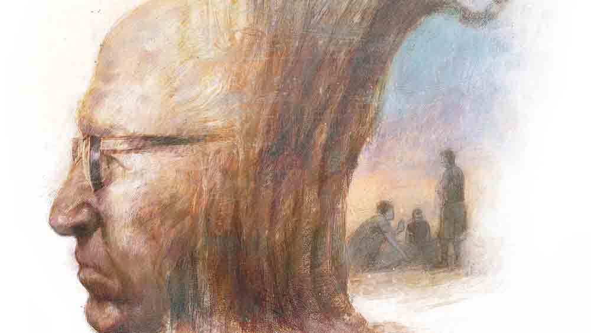

 
 <h1 align=center>মুখাগ্নি</h1>
<h2 align=center>কমলেশ কুমার</h2> সতীশমাস্টারের সারা দেহে ভাল করে ঘি মাখাতে শুরু করল জিতুরাম। আর কিছু ক্ষণ পরেই ডাক পড়বে ওদের। চার নম্বর বডিটা চুল্লিতে ঢুকে গিয়েছে। সতীশমাস্টার পাঁচ নম্বর। 

শুদরি এক বার তাকাল মাস্টারের মুখের দিকে। বহু দিনের না-কামানো দাড়ি মাস্টারের তুবড়ে যাওয়া গালদুটো ঢাকা দিতে পারেনি। মাথায় চুল প্রায় নেই বললেই চলে। কর্কট রোগে নাকি সব চুল উঠে যায়, এমনটাই শুনেছে শুদরি। শুদরি দেখল, মাস্টারের শরীরটা একেবারে ছোট্ট হয়ে গিয়েছে। শ্মশান-কর্তৃপক্ষের কাছ থেকে পাওয়া বাঁশের বাখারি দিয়ে তৈরি করা একটা প্যাতপেতে সাংয়ের উপরে এক টুকরো সাদা থানে ঢাকা দিয়ে রাখা হয়েছে সতীশমাস্টারকে। চার নম্বর বডিটা পোড়ানো শেষ হওয়ার কিছু ক্ষণ আগে শ্মশানের বিশ্রামকক্ষে একটা ইলেকট্রনিক ঘণ্টা বেজে উঠবে, তার কিছু ক্ষণ পরে মাইকে পাঁচ নম্বর বডির নাম ঘোষণা হবে। তখন জিতুরাম, শুদরি, নারান আর বাচ্চু মিলে সাংটা কাঁধে তুলে চুল্লির দরজা পর্যন্ত পৌঁছে দেবে। ডোম সুইচ টিপলেই চুল্লির দরজা খুলে যাবে ধীরে ধীরে। ভিতরের বৈদ্যুতিক কয়েলগুলো থেকে তৈরি হওয়া কমলা রঙের ধকধকে আগুনে সতীশমাস্টারের নশ্বর দেহটা ভস্মীভূত হয়ে যাবে। 

বাচ্চু এক বার তাকাল চার পাশে। হাত বোলাল শুকনো খড়খড়ে দাড়িতে। লুঙ্গির খাঁজে গুঁজে রাখা একটা আধপোড়া বিড়ি আর দেশলাই বার করে জ্বালাল, এক মুখ ধোঁয়া ছেড়ে বলল, “মাস্টারমশাইয়ের কপালটা মাইরি খুব ভাল। কেমন এলাম, আর তাড়াতাড়ি কাজ মিটে যাবে! বাড়ি গিয়ে আবার বেলেপোঁতার জমিতে জল ধরাতে যেতে পারব।”

জিতুরাম একমনে এত ক্ষণ সতীশমাস্টারের শরীরে ঘি মাখাতে ব্যস্ত ছিল। দুটো একশো গ্রাম ঘি কেনা হয়েছে। একটা শেষ করে এ বার দ্বিতীয়টার ছিপি দাঁত দিয়ে কেটে ফেলল ও। 

শুদরি বলল, “জিতুদা, মাস্টারমশাইয়ের থানকাপড়ের উপরেও একটু একটু ঘি ছিটিয়ে দিয়ো। তা হলে শান্তিতে পুড়তে পারবে মানুষটা।”

জিতুরাম শিশি থেকে আঙুল দিয়ে টেনে আনতে লাগল জমে-যাওয়া ঘিয়ের ডেলা। চুপচুপে করে মাখিয়ে দিল মাস্টারের বুকে, পেটে, পায়ের আঙুলগুলোতে। কিছুটা সাদা থানের উপরেও ছড়িয়ে-ছিটিয়ে দিল। তার পর বাচ্চুর দিকে তাকিয়ে ঝাঁঝালো গলায় বলল, “ভাল বললি মাইরি! মাস্টারের নাকি কপাল ভাল! যার একমাত্র রোজগেরে ছেলে বিদেশে বসে থাকে, বাপের শ্মশানযাত্রার সময়ও এসে পৌঁছতে পারে না, তার কপাল ভাল না হলে চলে!”

বাচ্চু কথা বাড়াল না। তিন বার বিড়িটা ফুঁকে নীচে ফেলে দিল, তার পর ডান পায়ের হাওয়াই চটি দিয়ে ওটাকে পিষে দিল মাটির সঙ্গে। 

জিতুরাম নিজের মনেই বিড়বিড় করতে করতে ওর কাজ করে চলল। কী মনে হতে সতীশমাস্টারের মুখের দিকে তাকিয়ে রইল কিছু ক্ষণ, তার পর চাপা গলায় বলে উঠল, “বাপটা না থাকলে অত শিক্ষিত হতে পারতিস! মানুষটা চার মাস হল ভুগছে, দেখাশোনা করার কেউ নেই, এক বার প্রাণটা কেঁদে উঠল না রে! এত নেমোখারাম তুই!”

নারান একটু শিক্ষিত ওদের মধ্যে। উচ্চমাধ্যমিক পাশ করে একটা পোলট্রি ফার্ম খুলেছে। সতীশমাস্টারের প্রবাসী ছেলে বিজয়কেতন ওরই ব্যাচের। জিতুরামের দিকে তাকিয়ে নারান বলল, “আসলে বিদেশ থেকে তো ইচ্ছে করলেই আসা যায় না। আমাদের নাহয় স্বাধীন ব্যবসা! কিন্তু ওরা তো আসলে কোম্পানির চাকর। কোম্পানির কথামতোই ওঠাবসা করতে হয়। নইলে চাকরি নট।”

নারানের কথা শুনে ফুঁসে উঠল জিতুরাম, “রাখ তোর কোম্পানি। অমন কোম্পানির ক্যাঁতায় আগুন। যে কোম্পানিতে চাকরি করলে বাপের ক্যানসার হলেও দেখতে আসা যায় না, বাপ মরলে শেষ কাজটুকু করতে আসা যায় না, সেই কোম্পানির মুখে শালা...”

ওদের কথাবার্তার মধ্যেই আরও একটা মড়া এসে ঢুকল শ্মশানে। তাদের গগনভেদী হরিনামসঙ্কীর্তনে চাপা পড়ে গেল জিতুরামের গলার বিক্ষুব্ধ বক্তব্য। 

নারান অবাক হয়ে দেখল, এখনকার বডিটা খুব কমবয়সি এক তরুণের। সুসজ্জিত খাটে বাড়ির লোকজন নিয়ে এসেছে ছেলেটাকে। খাটের চার ধারে মোটা মোটা রজনীগন্ধার স্টিক। ধূপের আর রজনীগন্ধার তীব্র গন্ধে গা গুলিয়ে উঠল নারানের। ও দেখল, সুসজ্জিত খাটটা ওরা দূরে শ্মশানকালীর পায়ের কাছে গিয়ে রাখল। 

একটা শিরশিরে হাওয়া নদী থেকে উঠে আসছে এখন। বর্ষার দু’কূল ছাপানো জলে গঙ্গা দেহাতি যুবতীর মতো বয়ে যাচ্ছে আনমনে। 

নারান তাকিয়ে দেখল, একটা কাঠের খাটিয়া ভেসে যাচ্ছে গঙ্গার মাঝ বরাবর। শান্তিময়ী মহাশ্মশানের মড়া পোড়ানোর ঘাট থেকে একটা অপরিষ্কার এবড়োখেবড়ো সামান্য ঢালু রাস্তা সোজা নেমে গিয়েছে গঙ্গায়। সেখানে অস্থিভস্ম ভাসিয়ে ‘বলো হরি, হরিবোল’ বলতে বলতে উঠে আসছে তিন নম্বর ডেডবডির বাড়ির লোকজন।  

শ্মশানকালীর মূর্তিটা যেখানে রয়েছে, সেই জায়গাটা একটা আকাশি রঙের প্লাস্টিক দিয়ে ছাউনি করা রয়েছে, তার পাশেই রয়েছে একটা বিশাল বটগাছ। তারও খানিকটা দূরে দুটো চিতা জ্বলছে দাউদাউ করে। তার লেলিহান শিখা উঠে যাচ্ছে বহু দূর পর্যন্ত। কালো ধোঁয়ায় ভরে আছে মেঘনীল আকাশ। 

নারান সেই আগুনের দিকে তাকিয়ে উদাসীন হয়ে গেল। ও ভাবছিল, শ্মশানের এই জ্বলন্ত চিতা, তার ভিতরে পুড়ে ছাই হতে থাকা দেহ, আত্মীয় বন্ধুদের হাহাকার— এগুলোও যেমন সত্যি, তেমনই এটাও সত্যি যে, কেউই অপরিহার্য নয় পৃথিবীতে। যে চলে গেল, তার জন্য সাময়িক মনখারাপ, কান্নাকাটি, তার উপস্থিতি, স্মৃতি... সবটাই সময়ের চাকার তলায় ধীরে ধীরে পিষে যাবে এক দিন। মানুষটাও ধীরে ধীরে বিস্মৃতির অন্তরালে
চলে যাবে। 

নারান দীর্ঘশ্বাস ফেলল একটা। ও ভাবছিল, কী অদ্ভুত জায়গা এই শ্মশান! যেখানে রাজা-উজির-ধনী-গরিব সকলে সমান। অর্থ, ক্ষমতা, রূপ, যৌবন, শিক্ষাগত যোগ্যতা সব কিছু অর্থহীন হয়ে যায় এখানে। তবুও জীবন-নাটকে কয়েক বছরের অভিনয়ের জন্য মানুষে-মানুষে কত ক্ষোভ,
হিংসা, দ্বেষ, স্নেহ, ভালবাসা, আঁকড়ে-ধরা!

নারান শুনেছে, সব মানুষই শেষবয়সে নাকি এক জনকে আঁকড়ে ধরে বেঁচে থাকতে চায়। মাস্টারমশাইয়ের স্ত্রী গত হয়েছেন বহু দিন। ছেলে বিজয়কেতন গত বারো বছর ধরে কানাডাবাসী। এক বারের জন্যও দেশে ফেরেনি সে। তবে মাস্টারমশাই শেষ জীবনে কাকে আঁকড়ে ধরে বাঁচতে চেয়েছিলেন!

বাচ্চুর গলার আওয়াজে সংবিৎ ফিরে এল নারানের। বাচ্চু বলল, “আমরা তখন টু-থ্রিতে পড়ি। মাস্টারমশাই আমাদের বলেছিলেন, সকলেই ডাক্তার-ইঞ্জিনিয়ার হবে না, কিন্তু ভাল মানুষ সকলে চাইলেই হতে পারে।” একটু থেমে বাচ্চু আবার বলল, “তখন বুঝতাম না, তবে এখন প্রায়ই কথা হত, মাস্টারমশাই ছাড়তেই চাইতেন না আমাকে!”

নারানের মনে পড়ল কয়েক বছর আগের কথা। সদ্য পোলট্রির ফার্মটা খুলেছে ও তখন। এক দিন গেল মাস্টারমশাইয়ের কাছে। বলল, “স্যর, বাড়ির যা অবস্থা, পড়াশোনা আর করতে পারব না। একটা ছোটখাটো ব্যবসা শুরু করছি।” 

মাস্টারমশাই খুব নরম ভাবে বলেছিলেন, “যে কাজটাই করো না কেন, সৎ ভাবে আর মনোযোগ দিয়ে করো। নিজের প্রতিটি পদক্ষেপে যদি আত্মবিশ্বাসের লাগাম শক্ত করে ধরা থাকে, তা হলে কোনও পদক্ষেপই বিফল হবে না।”

মাস্টারমশাইয়ের কথায় মনে জোর পেয়েছিল নারান। 

জিতুরাম এত ক্ষণ বসেই ছিল, এ বার গা ঝাড়া দিয়ে উঠল ও। ঘিয়ে-মাখা হাতটা লুঙ্গিতে মুছতে-মুছতে বলল, “আমি মুখ্যুসুখ্যু লোক। অত কিছু বুঝিনে। কিন্তু মনে আছে, গেল-বার বন্যায় যখন সব কিছু ভেসে গেল আমার, বৌ-ছেলে নিয়ে ভিক্ষে করার মতো অবস্থা, মাস্টারমশাই এক মাসের চাল-ডাল কেনার টাকা দিয়েছিলেন। বৌটার পরনের শাড়ি, ছেলেটার জামা কিনে দিয়েছিলেন!  সারাটা জীবন আমি মনে রাখব মাস্টারমশাইকে। তার নিজের ছেলে নেমোখারাম হতে পারে, আমি নই।”

নারান জানে, মাস্টারমশাই এক অদ্ভুত মানুষ ছিলেন। অন্যের জীবনের সমস্যার সমাধান করতে করতেই সারাটা জীবন কাটিয়ে দিলেন উনি। নিজের ছেলের প্রতিও দোষারোপ করতেন না কোনও
দিন। অদ্ভুত একটা কথা বলতেন, “আমার নিজের ছেলে ব্যস্ততার কারণে দেশে ফিরে আসতে পারছে না ঠিকই, কিন্তু তোমরা তো সবাই রয়েছ আমার কাছে, তোমরাও কি আমার সন্তান নও!”

মাস্টারমশাই সকলকেই সন্তানস্নেহে দেখতেন, ভালবাসতেন। এমনিতে সুস্থ-স্বাভাবিক ছিলেন, নিজেই রান্না করে খেতেন দু’বেলা। পাড়ার লোকেরা বারণ করলেও শুনতেন না। হঠাৎই মাস চারেক আগে ধরা পড়ল কোলন-ক্যানসার। তার পর চোখের নিমেষে মিলিয়ে গেলেন বিছানার সঙ্গে। শেষ কয়েকটা দিন চিনতে পারতেন না কাউকে, কথা বলতে পারতেন না, শুধু চোখ দিয়ে জল ঝরত। পাড়ার বৌ-মেয়েরা পাশে থাকত, সেবা করত। ছেলেরা গ্রামের হাতুড়ে ডাক্তার ডেকে আনত, ওষুধ আর খাবার জোর করে খাওয়ানোর চেষ্টা চালাত, বেশির ভাগটাই পড়ে যেত কষ বেয়ে। আজ ভোরের দিকে সব কিছু স্তব্ধ হয়ে গেল। 

মাস্টারমশাইয়ের জীবন নিয়ে সকলে উদ্বিগ্ন  হয়ে পড়লে অভয় দিতেন তিনি নিজেই। বলতেন, “জীবনকে যেমন স্বাভাবিক ভাবে মেনে নিই আমরা, মৃত্যুকেও তেমনই স্বাভাবিক বলে মেনে নিতে হবে। তা হলেই অযথা ভয় আর উদ্বেগ গ্রাস করতে পারবে না আমাদের।” কথাটা বলেই মৃদু হাসতেন। 

নারান ভাবল, মৃত্যুই যদি ভবিতব্য হয় মানুষের, কিসের এত অহঙ্কার সকলের! আজ মাস্টারমশাইয়ের মারা যাওয়ার খবরটা জানানোর জন্য বিজয়কেতনকে ফোন করেছিল নারান, সে দেশে সম্ভবত রাত তখন। ঘুম-জড়ানো গলায় বিজয় বলেছিল, “তোরাই সৎকার করে দে ভাই, এই মুহূর্তে তো আমার যাওয়া ইমপসিবল!” নারান ফোনটা কেটে দেওয়ার ঠিক আগের মুহূর্তে বিজয় আবার বলেছিল, “হ্যালো, নারান, শুনছিস! তোর ব্যাঙ্কের অ্যাকাউন্ট ডিটেলসটা প্লিজ় পাঠাস আমায় অ্যাজ় সুন অ্যাজ় পসিবল! আমি যা লাগে...”

কোনও উত্তর না দিয়েই নারান কথার  মাঝখানেই ঝপ করে ফোনটা কেটে দিয়েছিল। 

 

বিশ্রামকক্ষের বৈদ্যুতিন ঘণ্টাধ্বনিতে সচকিত হয়ে উঠল সকলে। বাচ্চু বলল, “চার নম্বর বডি জ্বলে গেল। এ বার আমাদের রেডি হওয়ার পালা।”

নারান এক বার তাকাল মাস্টারমশাইয়ের মুখটার দিকে। বিবর্ণ চিমসে একটা মুখ। গলার চামড়াগুলো গুটিয়ে গিয়েছে। ঘাড়টা সামান্য একটু বেঁকে রয়েছে। দুই চোখের উপর দুটো তুলসীপাতা রাখা। সকাল থেকে অনেকটা সময় অতিক্রান্ত হওয়ার ফলে সেগুলোও সজীবতা হারিয়েছে। 

জিতুরাম এক গোছা ধূপ প্যাকেট থেকে বার করে জ্বেলে দিল মাস্টারমশাইয়ের মাথার কাছে। তার পর বিড়বিড় করে বলল, “মানুষের উপকারই করে গেল সারা জীবন ধরে লোকটা, নিজে কিছুই পেল না...”

জিতুরাম আরও কিছু বলতে যাচ্ছিল। হঠাৎ বিশ্রামকক্ষের মাইকে ঘোষণা হল, সতীশভূষণ মিত্রের বডি চুল্লির কাছে নিয়ে যাওয়ার জন্য। 

জিতুরাম বলল, “তোরা হুড়োতাড়া করে মুখে আগুন দিতেই ভুলে গেলি মাস্টারমশাইয়ের! শ্মশানপুরুতকে ডেকে আনছি, কে মুখাগ্নি করবি ঠিক কর। তাড়াতাড়ি।”

জিতুরাম চলে যেতেই ওরা এ-ওর মুখ চাওয়া-চাওয়ি করতে লাগল। 

বাচ্চু বলল, “জীবনের শেষ দিন পর্যন্ত আমাকে উনি নিজের ছেলের মতোই ভালবেসেছেন... আমিই বরং করি মুখাগ্নি!”

শুদরি বলল, “মাথাখারাপ! আমাকে উনি বাবা-বাছা ছাড়া কথা বলতেন না, তা ছাড়া নাওয়ানো-খাওয়ানো তো আমিই করাতাম!”

নারান ভাবছিল কী ভাবে ওর মুখাগ্নি করার অদম্য ইচ্ছেটা মুখ ফুটে বলবে, ঠিক সেই সময় কালো পাথরের মতো শরীর নিয়ে আদুল গায়ে বেরিয়ে এল চুল্লির দায়িত্বে থাকা ডোমটা। 

এসেই তড়পাতে লাগল, “তুমাদের কান্ডিজ্ঞান নেই কুনো! হেতাহোতা কতক বডি লাইনে রইছে, আর তুমরা খেউড়ে মজেছ! দেখতে পাও নেকো...”

আরও কিছু বলতে যাচ্ছিল সে, মাস্টারমশাইয়ের মুখটার দিকে ওর চোখ পড়তেই চুপ করে গেল এক মুহূর্তে। একটু ঝুঁকে পড়ল নীচের দিকে। ভাল করে নিরীক্ষণ করল বডিটা, তার পর বিড়বিড় করে বলল, “সতীশমাস্টর! মইরে গেল!”

নারান খানিক অবাক হয়ে বলল, “তুমি চিনতে না কি!”

“কেলাস ফোর বিদ্যে আমার বাবু। পড়েছিনু ছোটপেলিয়া পেরাইমারি ইস্কুলে। ওখানেই তো মাস্টর পড়াত আমাদের!” একটু চুপ থেকে লোকটা আবার বলল, “খ্যামানন্দ ডোম সব ভুলে যেতে পারে, সতীশমাস্টরকে জীবন থাকতে ভুলবে না!” একটু থেমে কী যেন ভাবল খ্যামানন্দ, তার পর মুখে খই ফোটানোর মতো বলতে লাগল, “ছোটখোকা বলে অ আ/ শেখেনি সে কথা কওয়া! আমি তখন এতটুকুন, আমারে কাঁখে নিয়ে মাস্টর লাইনগুলো পড়িয়েছিল!” চোখের কোণটা একটু মুছে নিয়ে খ্যামানন্দ আবার সতীশমাস্টারের দিকে তাকিয়ে বলল, “আমাদের নেকাপড়া হয়নি ঠিকই, কিন্তু অসৎ পথে যাইনিকো কুনো দিন! তোমার কথা রেখেছি মাস্টর!”

হঠাৎ যেন কিছু মনে পড়ে যাওয়াতে স্মৃতির অতল থেকে উঠে এল খ্যামানন্দ, তার পর বলল, “মাস্টরের ছেলে কুতা? মুখে আগুন দেও তাড়াতাড়ি!”

নারান সংক্ষেপে সবটুকু বুঝিয়ে বলল খ্যামানন্দকে। খ্যামার চোখে হঠাৎ আলোর ঝিলিক দিয়ে উঠল। জমাটবদ্ধ পাথরের মতো দাঁড়িয়ে পড়ল সে। জিতুরাম ফিরে এসেছে শ্মশানপুরুতকে নিয়ে। খ্যামানন্দ মাস্টারমশাইয়ের পা ছুঁয়ে প্রণাম করল এক বার। তার পর সম্মোহিতের মতো বলল, “আমি যদি মুখাগ্নি করি, তুমাদের আপুত্তি নাই তো কুনো!”

শ্মশানপুরুত মন্ত্র বলতে শুরু করল। মাটির পাত্রে আতপচাল আর কলা মেখে তৈরি করল পিণ্ড, খ্যামানন্দ কারও অনুমতির তোয়াক্কা না করেই সতীশমাস্টারের শরীর ঘিরে পাক দিতে লাগল এক বার-দু’বার করে, তার পর পাটকাঠির গোছায় আগুন দিয়ে মাস্টারের ঠোঁট বরাবর ছুঁইয়ে দিল সেটা। শিক্ষাগুরু তো পিতার তুল্য। সেই হিসেবে সতীশমাস্টারের সন্তানই তো সকলে। খ্যামানন্দ ডোম ওদের চেয়ে বয়সে বড়। কারও আপত্তি করার কথা মনে হল না। সকলের অলক্ষ্যে কেউ এক জন আছেন ঠিক, যিনি একটা দরজা বন্ধ হলে অনেকগুলো দরজা খুলে দেন। মানুষ নানা কারণে অন্ধ, দেখতে পায় না।   

হরিবোল ধ্বনিতে মুখরিত হয়ে উঠল চার দিক। হতভম্ব হয়ে দাঁড়িয়ে থাকা জিতু, শুদরি, বাচ্চু, নারান চার জনে মিলে মাস্টারমশাইয়ের পলকা দেহটা তুলে নিল কাঁধে। খ্যামানন্দ সামনে-সামনে চলল। 

চুল্লির দরজার সামনে পৌঁছে গেল ওরা। মৃতদেহ নিয়ে ঘটাং করে দরজা বন্ধ হতে ছিটকে উঠল আগুনের ফুল।

নারান বিস্ময়াবিষ্ট হয়ে দেখল, জীবনের মুক্তির কাছে আলপনা এঁকে দিয়ে ধীরে ধীরে অমরত্বপুরের দিকে চলে গেলেন সতীশভূষণ— তাদের সকলের মাস্টারমশাই।