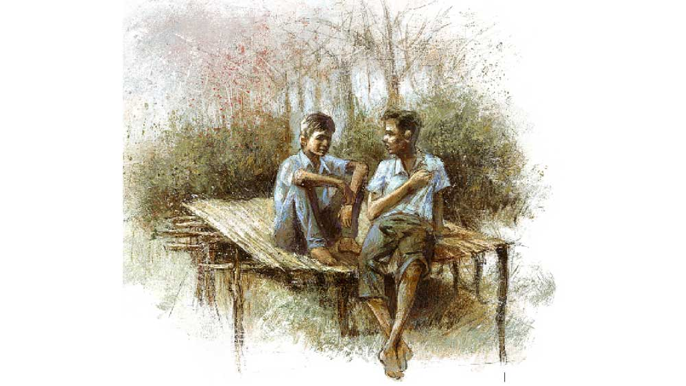

 

<h1 align=center>মুবাইল</h1>
<h2 align=center>অরিন্দম শীল</h2>
ইস্কুলের পাঁচিলের একপাশে পেচ্ছাপখানা। সেই পাঁচিল টপকাল সে, লাফিয়ে নামল আলুর জমিতে। পেস্টিসাইডের গন্ধ, বিষ দেওয়া বোঝাতে একফালি লাল শালু টাঙানো। আল ধরে আরও কিছুটা এগিয়ে ঢালাই রাস্তা। রাস্তাটা দিয়ে সহজে পার্টি অফিস যাওয়া যায়, সেজন্যই সবার আগে এই রাস্তাটা ঢালাই হয়েছে। রাস্তার শেষে পুকুর। উঁচু পাড়। কেস চলছে তাই, নইলে কোনকালে কেটে সাফ হয়ে যেত।    
‘পেচ্ছাপখানা’ বলায় প্রাইমারি স্কুলে একবার মার খেয়েছিল সে। দিদিমণি বলেছিল, “ভদ্রলোকের মতো বলতে হয় ‘টয়লেট’। হাইস্কুলে নিত্যমাস্টার আবার বলল ‘ইউরিন্যাল’। কথাটা থেকেই ইউরিয়া কথাটা এসেছে নাকি। পেচ্ছাপ ভাল সার। ইউরিয়ার কাজ করে। তা হলে বাবা কেন বলছিল, “এ বারে সারের দাম বাড়লে সুসাইট করতে হবে?”    
তাদের ঘরের পাশেই জমি। মাত্র তিনকাঠা। বাকিগুলোয় তার বাবা ভাগচাষি। সে আর বাবা মিলে ওই জমিতে পেচ্ছাপ, ইয়ে টয়লেট করলেই তো হয়! কিন্তু নিত্যমাস্টার বলে, “খোলা স্থানে মল-মূত্র ত্যাগ করবি না”—কেন? ওতে রোগ হয়।    
সব ফালতু কথা। লকাই বলেছে আসল কারণ। নিত্যর ভাইয়ের সারের দোকান। ইউরিয়া বিক্রি না হলে গরিব হয়ে যাবে। কিন্তু বিডিও, পঞ্চায়েতের প্রধান সাধন ভৌমিক... সবার সারের দোকান? এরা সব এক দিন এসে মিছিল করেছিল ইস্কুলের ছাত্রছাত্রীদের নিয়ে। সে ও সে দিন চিল্লেছিল খুব, “মাঠে ঘাটে পাইখানা, মিত্যুর পরোয়ানা!”    
গরিব হওয়ার সবচেয়ে বড় অসুবিধে হল, গরিবরা ‘কিনটাচ মুবাইল’ কিনতে পারে না। গেদে দাম দশ হাজার। পিঠে গাবদা ব্যাগ নিয়ে দিতে আসে। সে এক দিন দেখেছে পালবাবুদের ছেলেকে কিনতে। তাদের মোবাইল নেই। 
তারা যদি কিনতে না পারে, ওরা কেন পারবে? সে আলুর জমিতে পেচ্ছাপ করে রোজ। হোক গরিব সবাই, হোক শালারা...   ***** 
আমবাগানে মালির মাচা আপাতত ফাঁকা। তারই গায়ে ঠেস দিয়ে রাখা লকাইয়ের সাইকেল। সরকারি সাইকেল ক্লাস নাইনে দেয়। সাইকেল বাগিয়েই লকাই স্কুল থেকে ভোঁ-ভাঁ। শুধুমুধু পড়া, আর খেতে দেয় না। সে লকাইয়ের পাশে বসে, বলে, “একটা বিড়ি দে তো…” 
লকাই বিড়ি এগিয়ে দেয়। সে বলে, “কিচু ব্যবস্তা হল?” 
“নাঃ… আমাকেই ক’দিন রাকবে তার ঠিক নেই… বাবু বলছেল, লোটবাতিলে বাজার খারাপ খুউব!” 
এর পরে দীর্ঘশ্বাস। দু’জনেরই। লকাই আপাতত লেদ কারখানায় হেল্পার। তিন বছর কাজ শিখলে মিস্তিরি হবে, হলেই শো-কেস কিনবে একটা। আর একটা খাট। ঘরটা পার্টি থেকে বাগাবে। তার পর কাকলিকে নিয়ে পালাবে। এমনিতে মানবে না কাকলির বাড়ির লোক। পাশাপাশি ঘর হলেও তারা মাহিষ্য। উঁচু জাত। 
***** 
দুটোয় মাত্র শূন্য পেয়েছিল সে। অঙ্কে আর ইংরেজিতে। পরিবেশ ও বিজ্ঞান-এ সাত, বাংলায় কুড়ি, ওটাই ‘হায়েস’। লকাই পেয়েছিল মোট পাঁচটায় শূন্য। তবুও তারা এইট থেকে নাইনে উঠেছিল। 
নিত্যমাস্টার হেব্বি দুখী তাতে। সব্বাই পাশ করে যাচ্ছে, কেউ ফেল নেই বাপু এইট অব্দি! তারা পাশ করলে নিত্য শালার কী ‘ক্ষেতি’ কে জানে! তবে দুঃখ করছিল খুব। সরকারের জন্যেই নাকি লেখাপড়া গোল্লায় যাচ্ছে।  
লকাই ততক্ষণে চিঠিটা মেরে এনেছে প্রায়—  জোষ্ঠিমাসের পাকা আম, আহারে কি মিস্টি/ তুমি কোয়েল আমি জিত, ভগমানের সিস্টি পিথিবিতে চাঁদ-সুয্যি আছে  যত কাল/ তোমার আমার ভালবাসা থাকবে তত কাল।   কাকলিকে ‘নাইন’ মারে লকাই। এজন্যই কি ওই কেলাসটাকে  ‘নাইন’ বলে?    
যেই কাকলি ‘হ্যাঁ’ বলল, ব্যস! অমনি লকাই লেখাপড়া ছেড়ে মিস্ত্রি হতে চলল। কাকলিকে নিয়ে পালাতে হবেই তাকে। সে-ও লকাইকে তেলিয়ে-তুতিয়ে রাখছে। লেদ কারখানায় ছেলে নেবে বললেই ঢুকে যাবে সে। আড়াইশো রোজ। না না, তার কোন ‘গালফেরেন’ নেই।  
তবে তার ধান্দা অন্য। একটা মোবাইল চাই।   ***** 
ডেলি আড়াইশো করে জমালে কত দিনে দশহাজার হবে? বিন্তিকে সে শুধিয়েছিল এক দিন। বিন্তি সেভেনে পড়ে, হিসেবে খুউব পাকা। অঙ্কে নব্বুই পেয়েছে এ বার। তাও তো ‘পেরাইভেট’ নেই। প্রাইভেট না নিলে পড়াশোনায় দম হয় না। বাবা বলেছিল আর তো পাঁচকেলাস। আঠারো পেরোলেই বিয়ে। পড়েফড়ে কী হবে? 
বিন্তি বলেছিল, “চল্লিশ মাসে।” 
“আহা! কত বচরে বল না…” 
“ওই তো, তিনবারোং ছত্রিশ, হাতে থাকল চার, মানে তিন বছর চার মাসে রে দাদা…” 
ধ্যাত! তিন বছর চার মাস! এখনও? আহা! যদি কালই পাওয়া যায় একটা মোবাইল।   ***** 
“আনন্দ সংবাদ! আনন্দ সংবাদ! আনন্দ সংবাদ!”  
দিদি চেঁচাতে চেঁচাতে বাড়ি ঢুকছিল। তারা দুই বোন, এক ভাই। দিদি বুল্টি, সে আর ছোটবোন বিন্তি। দিদির সরকারি স্কলারশিপের টাকা ঢুকে গেছে। এই জন্যই এত আনন্দ।  
কিন্তু মা রেগে গেল কেন? ঠাস করে একটা থাপ্পড় কষিয়ে বলল, “চুপ! একদম চুপ হারামজাদি!”  
দিদি যেন নিভে গেল। মা গজগজ করছে, “চেঁচিয়ে পাড়ার সব লোক জানাও আর ছিমন্তর বাপ টাকাটা চেয়ে বসুক!” 
শ্রীমন্তদা লরি চালায়। দিদির সঙ্গে অঘ্রানে বিয়ে। ছেলের বাড়ি অবশ্য বৈশাখেই কাজটা তুলে ফেলতে চেয়েছিল। মা আটকে দিয়েছিল। হিসেবমতো ভাদ্র মাসের শেষে দিদির স্কলারশিপটা ঢোকার কথা। একলপ্তে পঁচিশহাজার। ভাদ্র-আশ্বিন-কার্তিকে বিয়ে হয় না। তাই অঘ্রানে বিয়ে। 
একটা বিয়ে মানে কি কম খরচা? নমো নমো করে হলেও লাখখানেক। পাড়াপড়শি, বরযাত্রী, কুটুমজন সব মিলিয়ে শদেড়েক তো বটেই। টাকাটা পেয়ে সুরাহা হল একটু। 
শ্রীমন্তদার বাবা খুঁতখুঁত করছিল, “শুধু আলমারি আর খাটবিছানা ব্যস! ক্যাশ ছাড়া বিয়ে হয় একালে?”  
বাবা হাতজোড় করেছিল, “আর পারব না, বেইমশাই!”   ***** 
‘আর্কিমিডিস’-এর নামটা মনে নেই তার। সূত্রটা তো মনে নেই-ই। তবে গল্পটা মনে আছে ভাসাভাসা, সেই রাজার মুকুটে স্যাকরা খাদ মিশিয়েছে কি না ধরেছিল লোকটা। 
ক্লাসটা নিচ্ছিল নিত্যমাস্টার। সূত্রফুত্রের দিকে অতটা মনোযোগ তারও ছিল না। নিত্য শুধু বলছিল, “আর্কিমিডিস একেবারে ল্যাংটো… বুইলি অনুপমা... এক্কেবারে ল্যাংটো...হে হে হে…” 
অনুপমার বাড়ন্ত গড়ন। নাইনে পড়লেও মনে হয় টুয়েল্ভ। অনুপমা মাথা নিচু করে বসেছিল। নিত্যমাস্টার অনুপমাকে পড়া ধরে না, মারেও না। পরীক্ষায় সব শর্টকোশ্চেন বলে দেয় পিঠে হাত বোলাতে বোলাতে। অনুপমা রেগে যায়। এক ঝটকায় হাত সরিয়ে দিয়েছে কত বার। নিত্যকুত্তাটার অনুপমার উপর কুনজর আছে, গোটা ক্লাস জানে।  
‘ইউরেকা’ কথাটা মনে ছিল তার। ঘুম ভেঙে সে চেঁচিয়ে ওঠে, “ইউরেকা, ইউরেকা…”   ***** 
হয়েছে উপায়। এই বারে ‘মুবাইল’-টা হয়েই গেল তার, আহা! 
কী সুন্দর মোবাইলের ভিতর দিয়ে দেখায়, ঝকঝকে বাস, চকচকে  রাস্তা, তাতে  
সুন্দর সুন্দর ‘ডেরেস’ পরা সব ছেলেমেয়ে। তাদের এই গড়সুন্দরগঞ্জ দুলেপাড়ার মতো নোংরা বাড়ি, কাদাজলে ভরা রাস্তা নয়। 
যত খুশি গান শোনা যায়, যা ইচ্ছে ‘বই’ দেখা যায় গোবিন্দা, অজয়, অক্ষয়। মিঠুন হেব্বি মারে। মিঠুনের মতো কেউ উড়তে পারে না, ভিলেনগুলোকে উড়ে উড়ে কেলিয়ে একদম লাট করে দেয়।  
মোবাইলে ভদ্রলোকদের মেয়েদের সঙ্গে কথাও বলা যায়। একে নাকি ‘চ্যাট’ করা বলে। এমনিতে এই সব মেয়েরা তাদের সঙ্গে কথা বলে না বিশেষ, মিডডে মিলও খায় না। ওরা রঙিন টিফিনবাক্সে পরোটা আনে। এ দিকে তাদেরকে নিত্যমাস্টার খালি বলে, “খেতে আসিস তোরা”... ক্লাস ঝাঁট দেওয়ার সময় তাদেরকেই ঝাঁট দিতে বলে। কই ওদের তো বলে না!  
আচ্ছা, সে যদি গেলবারের পুজোর জিনসপ্যান্টটার সঙ্গে ওই হলুদ গেঞ্জিটা পরে, চুলটা ‘কোয়েলি’-র মতো ছেঁটে যদি একটা ছবি দেয় তা হলে ওই ফর্সা ফর্সা মেয়েগুলো তার সঙ্গে কথা বলবে? ওই সৌমিতা, যাজ্ঞসেনী, দিয়া, বিহু, অরিন্দিতারা? কেন বলবে না? মোবাইলের দুনিয়ায় কে আর জানে তাদের কাঁচাবাড়ি, উঠোনে ছাগলের নাদি পড়ে থাকে! 
আর আছে গেম। ফাইটিং গেম। যত ইচ্ছে মানুষ মারা যায়! যত্ত খুশি গুলি ছোড়ো, মারো... ট্যাট্যাট্যাট্যা… মানুষকে মারতে পারলেই ফচাৎ করে রক্ত ছিটকে আসবে তোমার ‘ইস্কিন’-এ। সে কল্পনায় নিত্যমাস্টারকে মিঠুনের মতো উড়ে উড়ে কেলায় প্রথমে, তার পরে গুলিতে ঝাঁঝরা করে দেয়।   ***** 
কিন্তু কি সেই উপায়? 
উপায় দিদির ‘স্কলাশি’-র টাকাটায়। লুকিয়ে দশ হাজার চাইতে হবে, বাবা-মা জানলে কেটে ফেলবে।  
কিন্তু দিদি দেবে তো? 
কেন দেবে না! দিদি কি তাকে কম ভালবাসে নাকি!  
ছোটবেলায় রথের মেলায় দিদি তাকে বন্দুক কিনে দেয়নি? এই তো চৈত্তিমাসে যখন তার ধুম জ্বর এল, দিদি রাত জাগেনি তার জন্যে? বুধনের পিসিটা খুব ঝগড়াটে, বড্ড মুখ। বুধন যখন তাকে মারল, এমনিতে শান্ত, লক্ষ্মী স্বভাবের দিদি ওর পিসির সঙ্গে ঝগড়া করতে কি পিছু হটেছিল? বিশ্বাসবাবুদের নাতির ‘ভুজনো’য় কী সুন্দর দরবেশ করেছিল চন্দননগরের কেটারিং। সে আর একটা চেয়েছিল। ওরা দেয়নি, বলেছিল, “এগুলো একটা করে।” তার পর বাড়ি এল যখন, দিদি রুমাল জড়ানো দরবেশটা তার হাতে দিয়েছিল। নিজেরটা না খেয়ে, লুকিয়ে তার জন্য জিনিসটা নিয়ে আসেনি দিদি?   ***** 
কিন্তু এতে যদি আবার দিদির বিয়েটা ভেঙে যায়? 
ধুর! ভেঙে যাবে কেন? টাকাটা তো আর ছেলের বাড়িকে দিতে হচ্ছে না। লোক চাড্ডি কম বলা হবে এই যা। তা খাওয়ানোই বা কাদের বাপু? 
ওই তো মেজোজেঠি। লরির ড্রাইভারের সঙ্গে বিয়ে শুনে সাত বার মুখ ভ্যাংচাচ্ছে, “মরণ, লরির ডাইভারের আবার চরিত্তি, নাইনের ধারে হোটেলগুলোয় মদ-মেয়েছেলে নিয়ে কারবার। ছ্যাঃ ছ্যাঃ…”  
শ্রীমন্তদার সেজকা বিয়েটার ঘটক। সে বলল কে নাকি বেনামে গোটাদশেক ভাংচি চিঠি দিয়েছে শ্রীমন্তদাদের। তাতে দিদির নামে কীসব অসভ্য অসভ্য কথা।  
দিদি নাকি এই সে দিনও বুবাইদার সঙ্গে বাঁশবাগানে… মা বলল, “সে কী! বুবাই তো বাপু সেই নাগপুর না কোতায় কাজে গেছে  
আজ তিনবচ্ছর…” 
মা অবশ্য ঢপ দিয়েছে। বুবাইদা গেছে মাত্র তিনমাস। আর এক 
কালে দিদির সঙ্গে ছিলও। কিন্তু কে দিল ভাংচি? 
কে আবার? অপুর মা। বেনামে দিয়েছে বলে কি ধরা যাবে না নাকি? যখন সবাই টাইমকলে জল নিচ্ছিল, তখন মা গাল দিচ্ছিল, “আঁটকুড়ির বেটি, ঢ্যামনা মাগি নির্বংশ হবি। ভাংচি মারাতে এসছিস…”  
কারও নাম করেনি মা। সবাইকে সামনে রেখে খিস্তিগুলো হাওয়ায় ভাসিয়ে দিচ্ছিল। তবুও অপুর মা তেড়েফুঁড়ে উঠে বলল, “পাড়ার মধ্যি ঝগড়া কোরোনি ছোটবউ। আজ নক্ষীবার…” আর বুঝতে বাকি থাকে কে চিঠি ছেড়েছে? পড়ল কথা সবার মাঝে, যার কথা তার গায়ে বাজে। 
এদের খাওয়ানো? ছোঃ! শুধুমুধু পয়সা নষ্ট। এর চেয়ে মোবাইল কেনা ঢের ভাল।  
কিন্তু বিয়ে হবে আর মুরগির ছালচচ্চড়ি দিয়ে জামাইরা মদ খাবে না, মারুতিভ্যানে করে সবাই কনেযাত্রী যাবে না, এ হয় নাকি! টাকাটা নিয়ে নিলে যদি এ সব না হয়? 
থাক বরং। দিদি কাঁদবে। সামনে না কাঁদলেও মনে মনে কাঁদবে বড্ড। 
কিন্তু মোবাইলের জন্য খুব খুব লোভ হয়। সব্বার আছে, তার নেই। কিন্তু দিদি? দিদির কী হবে? 
সে বিছানায় ছটফট করতে শুরু করে। তার পর ঘুম এসে সমস্যা মিটিয়ে দেয় তখনকার মতো।   ***** 
এই সমস্যা জিনিসটা খুব সমস্যার। কারও সমস্যা আগামী কেমোর ডেটটা নিয়ে, কারণ ওই দিন তার ছেলের জন্মদিন। আবার কারও চাকরি গেছে সদ্য সদ্য, এখন একটা জয় গোস্বামীর বই কেনা কি অপব্যয় হবে? সিদ্ধান্ত নেওয়াটা সমস্যা। কত কাল তুমি দেশের বাড়িতে পুকুরের পাড়ে পূর্ণিমার চাঁদ দেখোনি সিইও সাহেব— ধ্যাত! চাঁদ দেখাটা আবার সমস্যা নাকি? কত লোকের কাছে তো চাঁদটা আবার ঝলসানো রুটি, সেটার জোগাড় করাই সমস্যা। 
শিমুলগাছের উপর হাজারে হাজারে জোনাকির মতো সমস্যারা জ্বলছে আর নিভছে। কেঁদুলির মেলাতলায় জড়ো হওয়া অজস্র মাথাগুলোর মতো সমস্যারা চিৎকার করে মরছে।  
পাশের ঘরে আলো জ্বলে ওঠে। হুকিং করা একশো ওয়াটের বালব। দিদি বুল্টি অকাতরে ঘুমোচ্ছিল। তাকে ঠেলা দেয় আধবুড়ো ক্ষয়াটে লোকটা, ঠোঁটে আঙুল দিয়ে চুপ করতে বলে, “শশশ...”  
তার পর ইশারায় বাইরে যেতে বলে। 
বুল্টি ঘুমচোখে দাওয়ায় এসে বসে। লোকটা তার সামনে হাতজোড় করে। ফিসফিসিয়ে কথা হয়, লোকটার চোখ দিয়ে জল গড়িয়ে ভাঙা গাল বেয়ে নামে। সদ্য ভাঙা ঘুম ছেড়ে অবস্থাটা অনুভব করতে একটু সময় লাগে বুল্টির। তার পর ঘরে এসে পাশবইটা আঁকড়ে ধরে কাঁদে। সদ্যমৃত প্রিয়জনকে জড়িয়ে ধরে যেমন কাঁদে মানুষ। 
পরদিন সূর্য উঠবে। সকালের সূর্যের বিপ্লব আনাটা নেহাতই ব্যতিক্রম। সে কালেভদ্রে ঘটে। ক্ষয়াটে চেহারার লোকটা তাদের বাবা। বাবার সঙ্গে বুল্টিকে যেতে  
হবে ব্যাঙ্কে। উইথড্রল ফর্মে সই করে পুরো টাকাটাই তুলে নিতে হবে, কারণ বীজ-পেস্টিসাইড-সারের অনেক দাম। টাকার চিন্তায় ঘুম আসে না বাবার। 
সেই পেস্টিসাইড কিছুটা যত্ন করে বাঁচিয়ে রাখবে বাবা। তার পরে যদি আরও একটা ঝড়ে, বন্যায় কিংবা কালোবাজারিতে এ বারেও ফসল নষ্ট হয়, সেই বেঁচে থাকা তরলে বাবার বেঁচে থাকা শেষ হবে। 
ঘুমোলেই সবার সমস্যা মেটে না। আবার মেটেও। ঘুমের সময়কালের উপর নির্ভর করে পুরোটাই।   <strong>(এই প্রতিবেদনটি প্রকাশিত হওয়ার সময় পরিচালক অরিন্দম শীলের ছবি দেওয়া হয়েছিল। অনিচ্ছাকৃত এই ত্রুটির জন্য ক্ষমাপ্রার্থী।)</strong>
