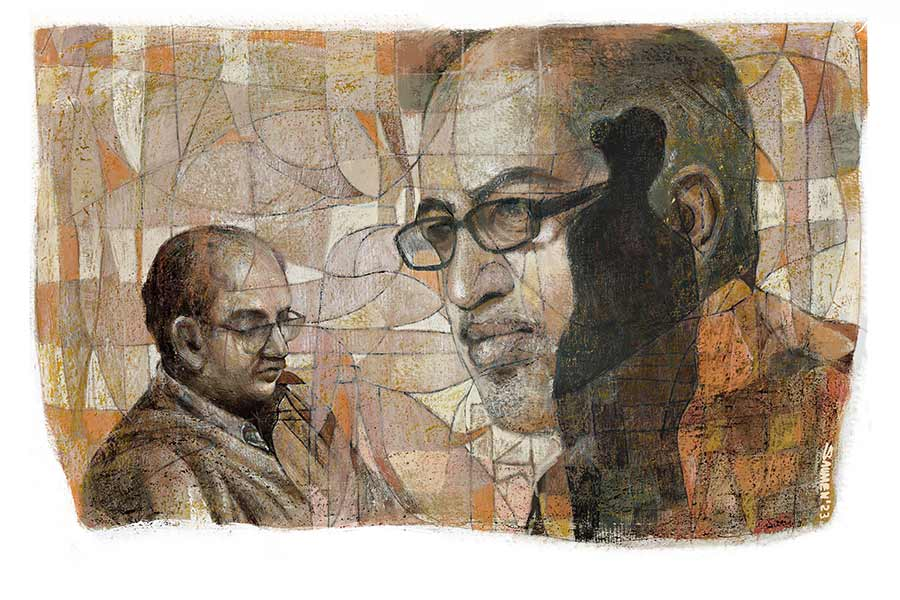

 
 <h1 align=center>মৃত্যুর সঙ্গে যাত্রা</h1>
<h2 align=center>বাণীব্রত গোস্বামী</h2> ঝাপসা কাচের ও পারে দাঁড়িয়ে অপর্ণা হাত নাড়ছে। তবে আন্দাজে। সেটা ওর চোখ বলছে। আসলে আমি ওকে একদম স্পষ্ট দেখতে পাচ্ছি। ও আমাকে স্পষ্ট দেখতে পাচ্ছে না। কারণ বাইরে আলো বেশি, ভেতরে আলো কম। তা ছাড়া এসিটাও বেশ কমানো। তাই কাচের গায়ে ঝাপসা কুয়াশা। ট্রেন গড়াতে শুরু করেছে। অপর্ণা হাঁটছে। আমি বারণ করছি হাত নেড়ে। বলছি ফিরে যেতে। পাশে আমার গাড়ির ড্রাইভার দাঁড়িয়ে আছে। কেউই বুঝতে পারছে না আমার ইশারা। আরে বাবা! ওর তো হাঁটুতে ব্যথা! জোরে হাঁটতে গিয়ে কখন পড়ে যাবে! আমি আবার ক’দিন থাকব না। কিছু একটা ঘটলে তখন চিন্তা হবে। আসলে বিবাহিত জীবনে প্রথম পর্বটা আর শেষ পর্বটাই খুব টানের। প্রথমটা হয়তো শারীরিক। তার পর মাঝখানে ছেলেমেয়ে, সংসারের বাকি সকলের জন্য ভাবতে ভাবতেই কোন ফাঁকে ফুড়ুত করে পেরিয়ে যায়। শেষটায় আসে একটা অটুট বন্ধন। পারস্পরিক নির্ভরশীলতার।

নাহ! আর দেখা যাচ্ছে না অপর্ণাকে। কিন্তু আমার সহযাত্রী তো এখনও এল না। সে কি ট্রেন মিস করল? নাকি পরে কোনও স্টেশন থেকে উঠবে? আপাতত আমি একা। আমি নিজে হলে এসি থ্রি টায়ারে টিকিট কাটতাম। কিন্তু ছেলে কেটে দিয়েছে একেবারে রাজধানী এক্সপ্রেসের এসি ফার্স্ট ক্লাস। মানে দু’মানুষের আলাদা ক্যুপ। ভাড়া বিমানের থেকেও বেশি। প্রথমে প্লেনের কথাই বলেছিল। কিন্তু আমি প্লেনে যাব না। একা প্লেনে গেলে আমার বুক ধড়ফড় করে। ও আমাদের দু’জনকেই আসতে বলেছিল।

কিন্তু সবে পুজোর সময়েই ঘুরে এসেছে বলে অপর্ণা আর যেতে চাইল না। তাই অগত্যা আমাকেই একা যেতে হচ্ছে।

আসলে ছেলে একটি ভাল চাকরি পেয়েছে দিল্লিতে ক’মাস আগে। দুর্গাপুজোয় ওদের মাত্র এক দিন ছুটি। শুধু দশেরায়। তাই তখন আমরা গিয়েছিলাম। কালীপুজোয় এক সপ্তাহ ছুটি নিয়ে ছেলের আসার কথা ছিল। ছুটি পেল না। আসতেও পারল না। ও দিকে তখন যাওয়ার সময় শীতের পোশাকআসাক কিছুই নিয়ে যায়নি। ওর শীতের জামাকাপড় এখানে আলমারি ঠাসা। কালীপুজোয় আসতে না পেরে বলল, ওখানে সব নতুন করে কিনে নেবে। ওর মা নাছোড়বান্দা, বলল, “না, তা হবে না। তোর বাবা গিয়ে দিয়ে আসবে।”

অগত্যা নিরুপায়! রিটায়ার্ড মানুষ। ছাই ফেলতে ভাঙা কুলো। চললাম সব পোঁটলা বেঁধে। তবে যেতে আসতে যা খরচ হবে, তার থেকে শীতের জামাকাপড় ওখানে দু’সেট কিনে নিলে কিছুটা কমেই হয়ে যেত। তবুও সংসারের কর্ত্রীর হিসাবশাস্ত্রের সূত্র আলাদা।

এই সব সাত-পাঁচ ভাবনার মধ্যেই আমার ক্যুপের দরজাটা ফাঁক হল। এক ভদ্রলোক ঢুকলেন। সারা মুখে পাকা দাড়ি। মাথায় চুল প্রায় নেই। তবে চেহারাটা বেশ সুঠাম। বয়স আমার মতোই ষাটের ওপরে হবে। কাঁধে একটা ছোট ব্যাগ। আর কোমরে একটা চামড়ার ওয়েস্ট ব্যাগ। ঢুকেই সিটে বসে শ্বাস ফেলে বললেন, “আর একটু হলেই ট্রেনটা মিস হয়ে যেত। স্টেশনে যখন ঢুকলাম, তখন ট্রেন ছেড়ে দিয়েছে। যা হোক করে দৌড়ে শেষ বগিতে উঠে, ট্রেনের ভেতর দিয়ে এলাম। আসলে আমার একটা পায়ে একটু সমস্যা আছে। জোরে হাঁটা বা দৌড়নো বেশ কষ্টের।”

দেখলাম, একটা পা একটু খুঁড়িয়েই চলেন। ভদ্রতার খাতিরে বললাম, “ঠিক আছে। আগে একটু শান্ত হয়ে বসুন, জল খান।”

বলে, জলের বোতলটা বাড়িয়ে দিলাম। উনি ইশারায় বোঝালেন, যে ওঁর কাছে জল আছে। তখনও ট্রেনের পাওনা জল দিয়ে যায়নি। একটু পরেই ট্রেনের যাত্রাবন্ধু খাবার জলের বোতল ও তার পরেই সান্ধ্য স্ন্যাক্স দিয়ে গেল। দু’জনে সমবয়সি হওয়ায় টুকটাক গল্প শুরু হল। এই বয়সের গল্প যেমন হওয়া উচিত তেমন ভাবেই।

আমিই প্রথম প্রশ্ন করলাম, “আমি অনিমেষ। অনিমেষ চৌধুরী। আপনিও কি রিটায়ার্ড?”

“কোনও দিন চাকরিই করলাম না, রিটায়ার্ড হওয়ার আর সুযোগ পেলাম কোথায়? আমি সুবিমল সান্যাল। ‌আপনি?”

ওঁর উত্তরটা আমার অদ্ভুত লাগল। কোনও দিন চাকরি করলেন না, তা  হলে কী করলেন? ব্যবসা? তা হলে সে কথা সোজাসুজি বললেন না কেন? এটাই হয়তো আমার পেশাগত মানসিকতার দোষ। মনে সন্দেহ হল বলেই পুলিশের গোয়েন্দাভবনে চাকরির বিষয়টা চেপে গেলাম। সাবলীল ভাবে মিথ্যে বললাম, “হ্যাঁ, আমি রিটায়ার্ড। ব্যাঙ্কে ছিলাম।”

উনিও আর কর্মজীবন নিয়ে বেশি ঘাঁটালেন না। এ বার আলোচনার মোড় অন্য দিকে ঘুরে গেল। উনি প্রশ্ন করলেন, “কত দূর যাবেন? দিল্লি?”

“হ্যাঁ। আপনি?”

“আমি কানপুর।”

আমি ছেলের পুরো গল্পটি বলে জিজ্ঞেস করলাম, “আপনি?“কোনও কাজে? না ঘুরতে?”

“আমিও কিছু ব্যক্তিগত কাজে।”

এই বার আমার ভেতরের পুরনো স্বভাব আমাকে খোঁচা দিল। কেমন ব্যক্তিগত কাজ? যা রেখেঢেকেও বলা যায় না? ব্যক্তিগত মানেই তো গোপনীয় নয়। ব্যক্তিগত কাজে তো আমিও যাচ্ছি, তা হলে! চাকরি না থাক, রহস্য ঘাঁটা স্বভাব কি সহজে যায়! বলেই ফেললাম, “আপনি তো চাকরিবাকরি করেননি, তা হলে কানপুরে কি পারিবারিক কিছু? মানে ওখানে কি আপনার কোনও আত্মীয়স্বজন আছেন?”

এ বার উনি বোধহয় একটু বিব্রতই হলেন। তবে স্বাভাবিক থাকার চেষ্টা করলেন। তবু চোখেমুখে যেটা ফুটে উঠল, আমার চোখ এড়াল না। সত্য জানার জন্য আমরা নানা ভাবে জেরা করে অভ্যস্ত। ওঁর আস্বস্তি বা আপত্তি আমার গায়ে লাগল না। সামলে নিয়ে শুরু করলেন, “আসলে আমি একটা স্বেচ্ছাসেবী সংগঠনের সঙ্গে যুক্ত। সেই কাজেই কানপুর যাচ্ছি।”

সারাজীবন চাকরির অভিজ্ঞতায় বুঝতে পারলাম, মিথ্যে বলছেন। আর একটু ঘাঁটতে চাইলাম, “তা কী ধরনের সেবা করেন আপনারা?”

“মূলত আদিবাসী অঞ্চলের গরিব মানুষদের নিয়ে কাজ করি। তাদের শিক্ষাদীক্ষা, অসুখবিসুখ, খাওয়া-পরা সব নিয়েই আমাদের কাজকর্ম।”

“বাঃ বেশ।”

আমার স্ত্রী, সংসার, ছেলের পড়াশোনা, ছেলের চাকরির গল্প হল। ওঁর কথাও জিজ্ঞেস করলাম। উনি সবটাই বললেন। তবে বুদ্ধির ছাঁকনিতে কতটা সত্যি হয়ে আটকাবে, আর কতটা ফাঁক গলে ফেলে দিতে হবে, তা ঈশ্বর জানেন। তবে উনি গল্পটা মোটামুটি এ রকম সাজালেন...

“তখন আমি কলেজে পড়ি। প্রেসিডেন্সিতে। হিন্দু স্কুল থেকে ভাল নম্বর নিয়েই পাশ করেছিলাম। জিওলজি নিয়ে ভর্তি হলাম। সেই বয়সে যা হয় আর কী! ছাত্র রাজনীতিতে জড়িয়ে পড়লাম। সত্তরের দশক। সময়টা ভাল ছিল না। একটা মিথ্যে মামলায় ফেঁসে গেলাম। জেল হয়ে গেল। তার পর রাজ্যের রং পাল্টাল। আমরাও সব ছাড়া পেলাম। জেলে বসেই পরীক্ষা দিয়েছি। পাশও করলাম। তবে কলেজে পড়াকালীন একটি মেয়েকে ভাল লাগত। এক দিন আলাপও হল। তার পর যা হয়, ধীরে ধীরে বয়সের ধর্মে ঘনিষ্ঠতা। স্বপ্ন দেখতাম ঘর বাঁধবার। তবে মানুষ তো দুটো মন নিয়ে বাঁচে। একটা সচেতন আর একটা অবচেতন। সেই অবচেতন মনে আমার সব সময়ই একটা নতুন সমাজ, দেশ, রাষ্ট্রযন্ত্র, এই রাজনৈতিক পরিকাঠামো, অর্থনৈতিক বৈষম্য পাল্টে দেওয়ার, উল্টে ফেলার জাল বোনা চলত। অনর্গল স্বপ্নের সুতো দিয়ে সেই জাল সেলাই করতাম। তখন সুখ, আনন্দ, প্রেম সব তুচ্ছ মনে হত। এমনকি মৃত্যুরও পরোয়া করতাম না। কিন্তু মনের মানুষ তো আর জেলফেরত আসামির জন্য দশ বছর পথ চেয়ে বসে থাকবে না। তাই স্বভাবতই তার বিয়ে হয়ে গেল। আমি অন্য কোনও ঘাটে আর নৌকো বাঁধিনি। মন সায় দেয়নি। চাকরি ইচ্ছে করলে করতে পারতাম। করলাম না। কী হবে করে! বাঁধা মাইনে, সময়ের হাতকড়ি। সংসারই যখন করলাম না, তখন সমাজের ভাল কাজেই জীবনটা কাটিয়ে দিই। এই হল মোটামুটি আমার গল্প, বলার মতো কিছুই নয়। আপনি শুনতে চাইলেন, আমিও বকবক করে গেলাম...”

“না না, বেশ লাগছে। আপনি চালিয়ে যান।”

তবুও মনে মনে বুঝলাম, সবটা মিথ্যে বলেননি। একটু আবেগপ্রবণ হয়ে পড়েছেন মনে হয়। আর একটু খোঁচা দিলাম।

“আমার স্ত্রীর মুখে শোনা, সে সময় নাকি প্রেসিডেন্সিতে অনেকেই নকশাল করত!”

“সে কথা আপনার স্ত্রী কী করে জানলেন?”

“ও ওই কলেজে বাংলা অনার্স পড়ত, সেই কারণেই।”

“ও আচ্ছা। তা হলে হয়তো আমাকে চিনবে, আমিও হয়তো চিনতে পারি।”

কিন্তু নকশালের ব্যাপারটা বুদ্ধি করে এড়িয়ে গেলেন। তার ওপর রেলবন্ধুও রাতের খাবার নিয়ে ঢুকল। বাব্বা! এর মধ্যে ধানবাদ এসে গেল! এই ধরনের বগিতে বোঝাই যায় না, ট্রেন কত জোরে ছুটছে। তবে মনে মনে ছটফট করছি দরজার পাশে চার্টে ওঁর নামটা দেখার জন্য। বাথরুম যাওয়ার অছিলায় দরজা ঠেলে বেরলাম। ট্রেন দাঁড়িয়ে ধানবাদে। নামলাম। আঙুল বোলাতে লাগলাম। চার্টের গায়ে। কপাল খারাপ! লেখা ‘এস সান্যাল'। তদন্ত ভেস্তে গেল। যাকগে আমার তো আর চাকরির দায় নেই, শুধুই মনের খিদে। ভেতরে চলে এলাম। জমিয়ে খাওয়া শুরু হল। খাবারটা রাজধানীতে সত্যিই দারুণ দেয়। অপর্ণার ছবি ভেসে উঠল মোবাইলে। ফোন করেছে। ছেলেমানুষের মতো সব উপদেশ দেয় এখন। পুঙ্খানুপুঙ্খ খবর নেয়। যতটা বলা যায় লোকের সামনে সব বললাম। খাওয়ার পর, টুকটাক কথাবার্তা সেরে শুয়ে পড়লাম।

ওঁর সঙ্গে এত ক্ষণ গল্প করে, আর কাছ থেকে যত দেখছি, আমার মনের ফুটো দিয়ে উঁকি মারছে একটা বহু পুরনো স্মৃতি। সবটাই বার্ধক্যজনিত কারণে কুয়াশামাখা। চল্লিশ বছর আগে দেখা এক তরতাজা যুবকের মুখ যেন ভেসে উঠছে মস্তিষ্কের ভেতর। পরক্ষণেই আজ চোখের সামনে দেখা চেহারাটার ভেতর সেই মুখটা হারিয়ে যাচ্ছে সাদা গোঁফ দাড়ির জঙ্গলে।

চমকে উঠলাম পরের দিন। ঘুম থেকে উঠছি না দেখে ঠেলে তুলল রেলবন্ধু। তখন প্রায় বেলা ন’টা। ওর কাছেই শুনলাম, আমার যাত্রাসঙ্গী নাকি ভোর পাঁচটায় কানপুরে নেমে গেছে। সেই কথাই ছিল। কিন্তু ঘুমটা ভাঙল না কেন? এত ঘুমোলাম, তা-ও এখনও যেন চোখ জড়িয়ে আছে। উঠতে যাব, হঠাৎ দেখি বালিশের নীচে একটা সাদা কাগজ। ভাঁজ করা চিঠি। তাতে লেখা…

প্রিয় বন্ধু,

আপনার জলে মাত্র দু’টি ঘুমের ওষুধ মিশিয়েছি, তার জন্য মাপ করবেন। শুধু এই কারণেই মেশালাম, আপনাকে বোঝানোর জন্য, যে ইচ্ছে করলে আমি সায়ানাইড গুঁড়ো-ও মেশাতে পারতাম। কারণ আমরা যে মতাদর্শে বিশ্বাস করে, যে দল করি, তাতে ওটা আমাদের সঙ্গেই থাকে। শুধু মেশাতে গিয়েও মেশালাম না, অপর্ণার মুখটা মনে পড়ল। মনে হল মাথায় সিঁদুর ছাড়া বড্ড ফ্যাকাশে লাগবে ওই গোধূলির আকাশের মতো মুখটা। ওর চোখের জলের কারণ হতে মন চাইল না। তা সে আপনি যতই এনকাউন্টার স্পেশালিস্ট গোয়েন্দা সহকারী প্রধান অমিতাভ চৌধুরী হোন না কেন, যে এক রাতে আমার ডান পায়ে গুলি করেছিল। তা না হলে পুলিশের বাবার ক্ষমতাও ছিল না আমাকে ধরে। তবুও ক্ষমা করে দিলাম, শুধু ভালবাসার জন্য। বহুকাল পরে স্টেশনে অপর্ণাকে দেখলাম। তাই ওর চলে যাওয়া অবধি একটু দূরে দাঁড়িয়ে রইলাম। শেষে ও চলে যাওয়ার পর দৌড়ে ট্রেনটা ধরলাম। ওকে ভাল রাখবেন। ভাল থাকবেন।

ইতি

আপনার যাত্রাসঙ্গী

সুশোভন

আমি বিছানা থেকে নামতে পারছি না। হাত-পা কাঁপছে। যে ছেলেটি চা-ব্রেকফাস্ট দিয়ে গেল, তাকে একটু হাতটা ধরতে বললাম। বাথরুম থেকে এসে চা নিয়ে জানলার ধারে বসলাম। ছবির মতো ভেসে উঠতে লাগল সেই রাতের ঘটনাটা। সবটা মনে পড়ে গেল।

তখন আমি সবে পুলিশে ঢুকেছি। প্রথম পোস্টিং লালবাজার গোয়েন্দা বিভাগে। এক সন্ধেবেলা হঠাৎ খবর এল নকশালদের একটা গ্যাং টালা ট্যাঙ্কের পিছনে জড়ো হয়েছে। ইন্দিরা হাসপাতালের পিছনের মাঠে। আমরা ঘিরে ফেললাম। পাঁচ জন ছিল। চারটে ধরা পড়ল। এই সুশোভন মাঠের কাঁটাতার টপকে পালাল। আমার তখন অল্প বয়স। রক্ত গরম। প্রাণের মায়া ত্যাগ করে ধাওয়া করলাম। সুশোভন দুটো ফায়ার করল। আমিও গুলি চালালাম অন্ধকারে ওর পা আন্দাজ করে। তখন সুশোভন একদম ঝিলপুকুরের ধারে। দৌড়ে গেলাম কিন্তু কোথাও ওকে দেখতে পাচ্ছি না। আমার বাকি সতীর্থরা ছুটে এল। চারিদিকে টর্চ ফেলল। কোথাও নেই। হঠাৎ দেখি পুকুরের এক জায়গার জল লাল হয়ে উঠছে। জলের মধ্য থেকে তোলা হল সুশোভনকে। পায়ে গুলি লেগেছে। সেই অবস্থায় দম বন্ধ করে জলে ডুবে ছিল। তার পর কোর্টে পেশ করা হল সুশোভনকে। রাষ্ট্রদ্রোহিতার জন্য ওর জেল হয়ে গেল। তার পর প্রায় চল্লিশ বছর পর এই রেলগাড়ির কামরায় হঠাৎ দেখা। বাকিটা রূপকথা।

ট্রেন দিল্লি ঢুকছে। মালপত্র গুছিয়ে নিতে হবে। কিন্তু মন শুধু একটা প্রশ্নেরই উত্তর খুঁজছে। এই যে আমরা সমাজ-সংসার-চাকরির মধ্যে সারাক্ষণ নিজেদের সুখটুকু খুঁজে চলেছি, এই পৃথিবীকে আমরা কী দিলাম! আর এরা সারাজীবন কষ্ট করে, লড়াই করে, পালিয়ে বেড়িয়ে, অত্যাচারিত হয়ে কী শান্তি পায়! হয়তো ঈশ্বর জানেন। কিংবা হয়তো সেই দরিদ্র আদিবাসী মানুষগুলো জানে। যাদের ভেতরই হয়তো আসলে ভগবান আছেন।