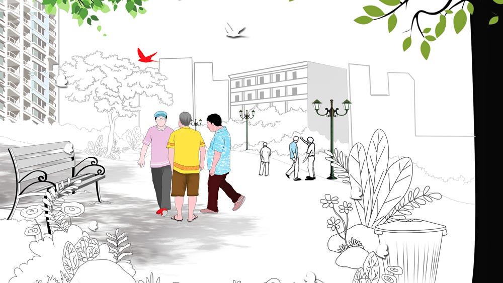

 
 <h1 align=center>মেঘমল্লার</h1>
<h2 align=center>সমীরণ বন্দ্যোপাধ্যায়</h2> শিমুলগাছের বাঁকটা পেরিয়েই আমার কনুইয়ে তর্জনীর খোঁচা দিয়ে দুলালবাবু বললেন, “দেখুন, দেখুন, অবস্থা দেখুন এক বার! সাতসকালেই হাজির দু’টিতে! এ বার বেলা ন’টা অব্দি কেত্তন, তাপ্পর বাবু-বিবি বেরোবেন ঠেলা হাতে। সেই তো সারা দিন পাড়ায় পাড়ায় ঘুরে ময়লা ঘেঁটে বেড়াবি বাপু, তা সক্কালবেলা এই সব নোংরামি বাদ দিয়ে এট্টু ঠাকুর-দেবতার নাম করতেও ইচ্ছে করে না রে তোদের!”

তাকিয়ে ছিলাম পুব দিকের আকাশপানে। এই কিছু দিন আগেও, যখন উঁচু কোয়ার্টারগুলো তৈরি হয়নি, সূর্য ওঠার সঙ্গে সঙ্গে মাঠ জুড়ে ছড়িয়ে পড়ত ভোরের নরম আলো। কোনও কোনও দিন চটিজোড়া খুলে নেমে পড়তাম মাঠে। হাঁটতে। ইচ্ছেমতো, এলোমেলো ঘুরে বেড়ানো। গায়ে নরম রোদের প্রলেপ আর পায়ের তলায় শিশিরধোয়া কোমল দূর্বা। দিনের শুরুতেই চাঙ্গা হয়ে যেত শরীর-মন। ইদানীং সেই সুখের দিন অতীত। মাস তিনেক হল ফাঁকা জায়গায় মাথা তুলেছে কয়েকটা বহুতল। কংক্রিটের সেই জঙ্গল টপকে সুয্যিমামার উঁকি দিতে আর কত ক্ষণ দেরি, সেটাই আন্দাজ করার চেষ্টা করছিলাম। 

জীবনের সিংহভাগ ব্যয় করেছি পরিবারের আর্থিক নিরাপত্তা সুনিশ্চিত করতে। ঘাটতি ছিল না পরিশ্রমে, আন্তরিকতায়। তাই এখন কাটাতে পারি আয়েসি জীবন। সাতসকালে দুধের ক্যান হাতে ধরিয়ে আমাকে খাটালে পাঠানোর হিম্মত নেই কারও। বাজার করার কাজটাও বিনোদনমূলক। যে দিন ইচ্ছে হয় ব্যাগ নিয়ে বেরিয়ে পড়ি। যত ক্ষণ ব্যাঙ্কে মোটা টাকা আছে, দুই ছেলের কারও কাছেই বোঝা হয়ে যাব না জানি, কিন্তু এই তিয়াত্তরের শেষ প্রান্তে দাঁড়িয়ে পরিবারের পুষ্টি জোগানোর দায়িত্ব ইচ্ছে করেই কাঁধে নিয়েছি। এতে প্রতি দিন সকালে খোলা হাওয়ায় নিয়মিত হাঁটাহাঁটির সুযোগ মেলে উপরি পাওনা সমবয়সি বন্ধুমহল। জীবনে সাফল্য, ব্যর্থতার খতিয়ানে বিস্তর অমিল থাকলেও মানুষগুলোর মধ্যে একটা কমন ফ্যাক্টর আছে। সেটাই কাছে টানে পরস্পরকে, গড়ে ওঠে একাত্মতা।

দুলালবাবু আমার অনিয়মিত খাটাল-সঙ্গী। বাতের ব্যথায় বাড়াবাড়ি রকমের কাবু না হলে, সকালবেলা দুধ আনার কাজটা ওঁর গিন্নিই সামলে থাকেন। দু’-তিন দিন হল ভদ্রমহিলা কোমরের ব্যাথায় শয্যাশায়ী। তাই তাঁর সদালাপী কর্তামশাইটি এখন আমার সঙ্গী।

জানা-অজানা যে কোনও বিষয়ে অনর্গল কথা বলতে পারেন দুলালবাবু। আবার কথার মাঝে সামনের শ্রোতা অমনোযোগী হয়ে পড়লে, তর্জনীর খোঁচায় তাঁর মনঃসংযোগ ফিরিয়ে আনার কাজও করে থাকেন বিরামহীন ভাবে।

খোঁচা খেয়ে তাকালাম সামনে। বায়ুসেনার ছাউনির ভিতর থেকে রসদবাহী ট্রেনলাইন বেরিয়ে চলে গিয়েছে ব্যারাকপুর স্টেশনের দিকে। এই লাইন দিয়ে কালেভদ্রে ট্রেন চলতে দেখেছি। যখন ট্রেন আসে, খাটালের বাছুরগুলোর অবস্থা হয় সঙ্গিন। একটু বয়স্ক, অভিজ্ঞ গাভীরা ট্রেন এলে জাবর কাটা থামিয়ে কিছু ক্ষণ নিস্পৃহ চোখে তাকিয়ে থাকে যন্ত্র-শকটের দিকে। তার পর আবার চোখ বুজে মন দেয় নিজের কাজে। কিন্তু হুইসলের আকাশ-বাতাস কাঁপানো বিকট শব্দে ঘাবড়ে গিয়ে লেজ উঁচিয়ে খাটালগুলোর আনাচকানাচে ছোটাছুটি শুরু করে দেয় বকনা-এঁড়ের দল। নাতিদীর্ঘ জীবনে হয়তো সেই প্রথম তাদের রেলগাড়ি দর্শন!

রেললাইনের পাশেই ছাউনির গা ঘেঁষে পুরনো বটগাছের গোড়ায় ছোট শিবমন্দির। গতবারের আমফানে আশপাশের বেশ কিছু বৃক্ষ ধরাশায়ী হলেও, টিকে গিয়েছিল এই গাছ। মন্দিরে একটি শিবলিঙ্গ ছাড়া অন্য কোনও বিগ্রহ নেই। কয়েক ফুট দূরে পাশের ফাঁকা জায়গায় ছড়িয়ে ছিটিয়ে রাখা কয়েকটা মাটির মূর্তি। অনেক দিন ধরেই মূর্তিগুলো পড়ে আছে ওখানে। কোনওটা বৃষ্টির জলে প্রায় ধুয়ে গিয়েছে, কোনওটার কাঠামোটুকু অবশিষ্ট রয়েছে মাত্র। তাতে লতপত করছে ঝলমলে কাপড়ের টুকরো। ওগুলো ছিল দেবী বীণাপাণির মূর্তি। পুজোআচ্চা সম্পূর্ণ হওয়ার পর, সম্ভবত বিসর্জনের পাথেয় জোগাড় করতে না-পেরে ভক্তবৃন্দ আরাধ্যা দেবীকে বানপ্রস্থে পাঠিয়েছে এই মন্দির প্রাঙ্গণে!

মন্দিরের পুরোহিত মশাই মগ্ন প্রভাতী পুজোর প্রস্তুতিতে। মন্দির থেকে খানিকটা তফাতে রেললাইনের উপরে বসে আছে দুটো ছেলেমেয়ে। গায়ে পুরসভার নাম লেখা কমলা জ্যাকেট। লাইনের এ পাশে বেশ খানিকটা দূরে সরু পিচরাস্তার উপরে রয়েছে আবর্জনা বহন করার এক জোড়া ঠেলাগাড়ি।

রোজ ভোরবেলা খাটালে আসার সময় প্রতি দিন এ ভাবেই পাশাপাশি বসে থাকতে দেখি ওদের। নোংরামির লেশমাত্র চোখে পড়েনি কোনও দিন। আজও পড়ল না।

একটা বয়স পর্যন্ত মতামত প্রতিষ্ঠার জন্য যথেষ্ট গলা ফাটাতাম। ঝাঁঝালো কথা আর অকাট্য যুক্তির দাপটে ধুয়ে দিতাম প্রতিপক্ষকে। কিন্তু এখন মানসিকতা অন্য রকম। বাগ্‌বিতণ্ডার ছায়াও মাড়াতে ইচ্ছে করে না, বরং অর্বাচীন মানুষ আর তাদের মতামতকে করুণার দৃষ্টিতে দেখতেই স্বস্তিবোধ করি।  

নিজের এতটা পরিবর্তনে অবাক হই নিজেই। মাঝে মাঝে প্রশ্ন জাগে, জাগতিক কাজকর্মের মেয়াদ ফুরিয়ে এলে কি পরম করুণাময়ের ইচ্ছায় এ ভাবেই ক্ষমাসুন্দর হয়ে ওঠে প্রতিটি মানুষের মন? সময় কি তবে আসন্ন!

তিরিশ বছর আগের আমি হলে দুলালবাবুকে বলতাম, “চোখের মাথা খেয়েছেন না কি? দেখছেন না, পাশাপাশি বসলেও দু’জনের শরীরী ভাষা কতটা শালীন। যান না এক বার সন্ধের পর গঙ্গার ধারে ধোবিঘাটে! খোকা-খুকু থেকে শুরু করে আধবুড়োদের কীর্তিকলাপ দেখলে বুঝবেন নোংরামি কাকে বলে!” 

প্রাক্‌-চুয়াত্তরের আমি বললাম, “ওহ তাই তো! তা এখানে চার দিকে সব ভদ্রজনের বাস, কেউ কিছু বলে না? মানে চোখের সামনে দিনের পর দিন এমন অনাচার...”

হাঁটতে-হাঁটতে মন্দির চত্বরে চলে এসেছিলাম। দুলালবাবু গলা নামিয়ে বললেন, “ওটাই তো হয়েছে মুশকিল দাদা, সারা দিন ভ্যাটের আবর্জনা ঠেলে-ঠেলে ব্যাটাদের মুখটাও নর্দমা হয়ে গেছে। খুললেই গলগল করে পাঁক। কোন ভদ্রসভ্য মানুষ ওদের সঙ্গে তক্কো করতে যাবে বলুন তো, গালাগাল দিয়ে চোদ্দোপুরুষ উদ্ধার করে ছাড়বে না!”

বুড়ো বটের আনাচকানাচে পাখির কিচিরমিচির। স্পিকারে মৃদু স্বরে ধনঞ্জয় ভট্টাচার্য। খাটাল থেকে ফেরার পথে রোজ এখানে কিছু ক্ষণ দাঁড়াই। বেশ খানিকটা হাঁটার পর, দু’দণ্ড জিরিয়ে নেওয়ার পক্ষে জায়গাটা চমৎকার। মন্দিরের স্নিগ্ধ-শান্ত পরিবেশ, বৃক্ষরাজের শীতল ছায়া জুড়িয়ে দেয় শরীর। মনও।

আমায় থামতে দেখে দুলালবাবুও দাঁড়ালেন। বুঝতে পারছি, কথার স্রোতে হঠাৎ বাধা পড়ায় ভিতরে-ভিতরে অস্বস্তি হচ্ছে ভদ্রলোকের। মন্দির চত্বর পেরিয়ে ‘পাঁক’ পর্ব সম্পূর্ণ করতে পারলে, তবে ওঁর শান্তি। কিন্তু এত তাড়াতাড়ি এই জায়গা ছেড়ে নড়ছি না আমি। বাড়িতে চায়ের সময় সেই সাতটা। এখনও বেশ কিছুটা সময় আছে হাতে। 

আমাকে অনড় দেখে একটু উসখুস করে দুলালবাবু বলে উঠলেন, “আমি এগোই তা হলে কেমন, ও দিকে আবার বাড়ি ফিরে গিন্নিকে ত্রিফলার জল দিতে হবে!” 

মাথা নেড়ে সম্মতি জানালাম। এমন স্নিগ্ধ পরিবেশে চুপচাপ সময় কাটাতে ভাল লাগে। বড় রাস্তা থেকে বেশ কিছুটা দূরে হওয়ায় গাড়িঘোড়ার শব্দ পৌঁছয় না এখানে, তবে সকালের দিকে কান পাতলে পলতা স্টেশনের অ্যানাউন্সমেন্ট শোনা যায় স্পষ্ট। আর আছে খাটাল-পাড়ার বাচ্চাদের কলকলানি। খাটাল-পাড়া থেকে একটু এগিয়ে ও দিকে একখানা প্রাইমারি স্কুল আছে বটে, কিন্তু প্রায় বছর দুয়েক হয়ে গেল তালা ঝুলছে স্কুলে। দেশ থেকে করোনা বিদায় না নেওয়া পর্যন্ত খোলার সম্ভাবনাও নেই। ও দিকে বাবা মায়েরা ভোরবেলা উঠেই ব্যস্ত হয়ে পড়ে গোয়াল পরিষ্কার করে খোল-বিচুলি-ম্যাস মাখতে। একটু পরেই বাবু-মাইজিরা হাজির হবে দুধ নিতে। কান ধরে বাচ্চাদের পড়তে বসানোর ফুরসত তাদের কই! অগত্যা বাচ্চারা আর কী করে, ঘুম থেকে উঠে, মন্দিরের উল্টো দিকের খোলা জায়গায় সবাই জড়ো হয়ে মেতে ওঠে খেলায়।

বেশ কিছু ক্ষণ দাঁড়িয়ে থাকার পর মানিব্যাগ থেকে একটা দশ টাকার নোট বার করে প্রণামী-বাক্সে দিলাম। সপ্তাহে দু’এক বার দিই। এ ভাবে পুণ্য সঞ্চয় হয় কি না জানি না, তবে প্রতি দিনের যাতায়াতের পথে, এমন এক টুকরো পবিত্র জায়গা পেলে মন ভাল হয়ে যায়। তার জন্যে কিছু খরচপাতি তো আছে!

*****

কোলাহলটা কানে এল পাড়ার মোড় পেরোতেই। আজ সঙ্গে ছাতা নিয়েছি। আকাশে মেঘের যা ঘনঘটা, বৃষ্টি নামতে পারে। গিন্নি, বৌমারা বারণ করেছিল বেরোতে। খাটালে ফোন করলে ওরা এক-আধ দিন বাড়িতে দুধ পৌঁছে দেয়। কিন্তু আমার মন সায় দেয়নি। মৌসুমি বাতাস প্রথম ঢুকছে বঙ্গে, আমি প্রাণ ভরে তার ঘ্রাণ নেব না! এলোমেলো বৃষ্টিতে না-হয় ভিজবে শরীর। হয়তো ঠান্ডা লাগবে, হয়তো সর্দি বসবে বুকে। কিন্তু আর ক’দিনই বা মেয়াদ এই শরীরের। গত দু’বছরে আমার চেয়ে বয়সে ছোট অনেককেই তো দেখলাম এক ভাইরাসের কবলে পড়ে চিরতরে হারিয়ে যেতে। তালিকার পরের দিকে আমার নাম নেই তার নিশ্চয়তা কোথায়! তাই ঘরে বসে সময় নষ্ট না করে, প্রকৃতিকে মন-প্রাণ ভরে গায়ে মেখে নেওয়ার এই তো সময়!

কান খাড়া করে কোলাহলের চরিত্র বুঝতে চেষ্টা করছিলাম। আর পাঁচ কিসিমের হইহল্লা থেকে এটা আলাদা। বাজারি কোলাহলে একটা ব্যস্ততা, এক ধরনের অস্থিরতা থাকে। এমন কলকল উচ্ছ্বাস সেখানে খুঁজে পাওয়া যায় না! 

যত দূর মনে হচ্ছে কোলাহলের উৎস মন্দির চত্বর। পাড়ার মোড় থেকে ২০-২৫ গজ এগিয়ে, এফ সি আইয়ের গোডাউনের উল্টো দিকে শিব মন্দির। মেঘ ঘনিয়ে উঠছে আকাশে। ঠান্ডা হাওয়ায় কাছাকাছি কোথাও বৃষ্টি হওয়ার বার্তা। কিন্তু কৌতূহলে টগবগ করে ফুটছি আমি। পার্থিব বাধা গায়ে না মেখে ছাতাটা লাঠির ঢঙে বাগিয়ে, বাড়িয়ে দিলাম হাঁটার গতি!

আমাকে দেখে পুরোহিত মশাই হেসে বললেন, “আজ বিশ্বপিতাকে কোনও মতে তুষ্ট করে মন দিতে হল নারায়ণ সেবায়। বৃষ্টি এলে সব আয়োজন ভেস্তে যাবে যে!”

ছোট্ট ছেলেমেয়েরা পুরোহিত মশাইয়ের কাছ থেকে মাস্ক, ছবির বই, পেনসিলবক্স আর লজেন্স পেয়ে হইচই করতে করতে ছুটছে যে যার বাড়ির দিকে। লাইনে এখনও অনেকে। তবে তিন-তিনটে ঢাউস ব্যাগে যা স্টক, তাতে কারও নিরাশ হওয়ারআশঙ্কা নেই। 

হাল্কা চালে বললাম, “সেবায় দেবতারা তুষ্ট, সে তো দেখতেই পাচ্ছি, কিন্তু এমন আয়োজনের উপলক্ষ কী? উপচার সামগ্রীর খরচই বা বহন করছে কে?”

“উফফ! দুষ্টুমী করিস না বাবা-মায়েরা, একটু শান্তশিষ্ট হয়ে লাইনে দাঁড়া সব! বৃষ্টি এলে তোরা ভিজবি, সঙ্গে আমাকেও ভেজাবি! এই বুড়ো বয়সে বৃষ্টিতে ভিজলে নিমোনিয়া বেঁধে যাবে যে!” এলোমেলো লাইন সামলাতে-সামলাতে ভট্টাচার্য মশাই বললেন, “সব দুই পাগলের কাণ্ড আর কী! রোজ সকালে ওই ছেলেমেয়ে দুটোকে এখানে বসে থাকতে দেখেছেন নিশ্চয়ই?”

আমার ইতিবাচক প্রতিক্রিয়ায় নিশ্চিত হয়ে পুরোহিত মশাই বলে চললেন, “ক’দিন আগে দুটিতে এসে ধরে বসল, ওরা বিয়ে করবে। সেই উপলক্ষে খাটাল-পাড়ার ছোট বাচ্চাদের কিছু গিফট দিতে চায়। আমাকেই সে সব বিতরণ করতে হবে। আমি অবশ্য বারণ করেছিলাম, মিউনিসিপ্যালিটির সুইপার... ক’টা টাকাই বা মাইনে পায়! কিন্তু ওরা নাছোড়। বলল দু’জনেই অনাথ, আত্মীয়-পরিজন কেউ নেই, বিয়ে উপলক্ষে এ ভাবেই খুশি বিলোতে চায় বাচ্চাদের মধ্যে। কিন্তু আমার শত অনুরোধেও নিজেরা বাচ্চাদের হাতে উপহার তুলে দিতে রাজি হল না। কাছে না এসে বসে থাকল ওই দূরে। কে আবার কী বলে বসে। অগত্যা আমাকেই কোমর বেঁধে নামতে হল। এই বুড়ো বয়সে এত ধকল সয়? যা বিচ্ছু সব!” 

ধীর পায়ে এগিয়ে গেলাম ছেলেমেয়ে দুটোর দিকে। সংশয়ের মেঘ যুগলের চোখমুখে। ভট্টাচার্য মশাইয়ের সঙ্গে আমাকে কথা বলতে দেখে ঘাবড়ে গিয়েছে বোধ হয়। ভেবেছে, এমন গর্হিত অপরাধ করার জন্যে বকাঝকা করব।

সামনে দাঁড়াতে আড়ষ্ট ভাবে হাতজোড় করল ছেলেটা। দেখাদেখি মেয়েটাও। সাদার উপর সোনালি কারুকাজ করা বিশেষ পোশাক আজ দু’জনের পরনে। 

ছাতার ওপর ভর দিয়ে একটুখানি সামনে ঝুঁকে হাসিমুখে বললাম, “ভট্টাচার্যের কাছে সব শুনলাম। খুব ভাল করেছ। ঈশ্বর সুখে রাখবেন তোমাদের।” 

সংশয়ের মেঘ কেটে খুশির ঝিলিক যুগলের চোখমুখে। মেয়েটা বিগলিত হয়ে আমাকে বলল, “হম দোনোঁ কো আসিরবাদ দে সাহাব, আসিরবাদ দে!”

মানিব্যাগে একশো-দুশো-পাঁচশোর কয়েকটা নোট থাকলেও বার করলাম না। এমন আন্তরিক উদ্যোগ টাকা দিয়ে লঘু করা অনুচিত। তবে উপহার ওদের প্রাপ্য। আমরা যখন পাঁক ঘাঁটতে ব্যস্ত, ওরা তখন মগ্ন ছিল পদ্ম হয়ে ফোটার প্রতীক্ষায়! আকাশ কালো মেঘে ঘিরে এলে দুর্যোগের আশঙ্কায় ভয় পায় সবাই। ক’জন তখন মেঘমল্লার গেয়ে বৃষ্টি নামাতে জানে! বৃষ্টি না পড়লে যে জীবন থেমে যায়।  

বাড়ি ফিরে গিন্নিকে বলব ভাল কিছু কিনে আনতে। নতুন সংসার পাতছে দু’টিতে, এই সময় কত কিছুই তো প্রয়োজন হয়। সে সব গিন্নিই ভাল বুঝবে।

মুখে বললাম, “কাল এ সময় এখানেই থেকো। দেখা হবে।”

ফিরতে ফিরতে দুলালবাবুর কথা মনে পড়ছিল। মানুষটা কাল বিরক্তি প্রকাশ করেছিলেন। আজ থাকলে কী বলতেন, কে জানে!