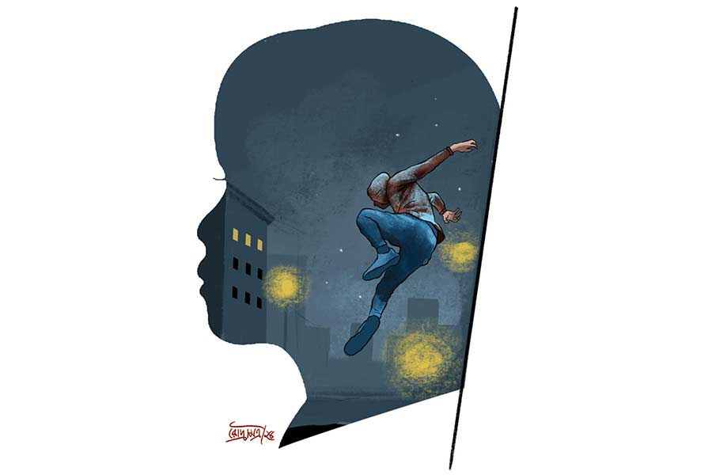

 
 <h1 align=center>মেধার প্রেমিক</h1>
<h2 align=center>ইন্দ্রনীল সান্যাল</h2> 

ডিসেম্বর মাসে বৃষ্টি ভাল লাগে? ধুস! বিরক্ত হয়ে জানলা দিয়ে বাইরে তাকাল অমল। পিজি অ্যাকোমোডেশনের তিনতলার জানলা দিয়ে পেঁচার মোড় পর্যন্ত দেখা যায়। রাত দেড়টার সময় বৃষ্টির জন্যে অত দূর পর্যন্ত দেখা যাচ্ছে না। তবে কাছের একটা জিনিস দেখে অমল আঁতকে উঠল। গাঢ় রঙের জিন্‌স, হুডি আর স্নিকার পরা একটা লোক পিজি-র পাঁচিল টপকে কম্পাউন্ডের বাগানে লাফিয়ে নামল।

“মেধা! কে ঢুকল?” জানতে চাইল অমল। আজ রাতে গোটা বাড়িতে সে আর মেধা ছাড়া কেউ নেই। পিজি-র মালিক প্রশান্তবাবু শনিবার ভোরে বর্ধমানের বাড়ি চলে যান, ফেরেন সোমবার সকালে। প্রশান্ত থাকেন গোটা একতলা নিয়ে। বাকি দুটো তলা মিলে চারটে ফ্ল্যাট। এগুলোর মধ্যে দোতলার একটা ফ্ল্যাট এখন খালি। কোনও বোর্ডার নেই। অন্য ফ্ল্যাটে পটনার বিশাল থাকে। তিনতলার দ্বিতীয় ফ্ল্যাটে থাকে নৈহাটির জয়ন্ত। বিশাল আর জয়ন্তও সপ্তাহান্তে বাড়ি গেছে।

“কে ঢুকেছে বুঝতে পারছি না,” খসখসে গলায় জবাব দিল মেধা।

হতাশ অমল দেওয়ালে লাগানো মনিটরের দিকে তাকাল। এখানে নজরদারি ক্যামেরার লাইভ স্ট্রিমিং হয়ে চলেছে। প্রথম ক্যামেরা বা ক্যাম ওয়ানে দেখা যাচ্ছে লোকটা সিঁড়ির কোল্যাপসিব্‌ল গেটের তালা ভাঙছে।

“মেধা, লোকটাকে আর উঠতে দেওয়া যাবে না। দোতলার গেট বন্ধ আছে তো?’

“বন্ধ আছে,” গলা কাঁপল মেধার, “আসলে... ঝড়বৃষ্টির জন্যে... কানেক্টিভিটির সমস্যা হচ্ছে।”

“তোমার গলার আওয়াজ শুনে সেটা বোঝা যাচ্ছে। ক্যাম টু-র ফিড রিফ্রেশ করো। ফ্ল্যাটের সব লাইট জ্বেলে দাও। ইকো পার্ক থানার ফোন নম্বর বলো। কুইক!”

মেধার গলা দিয়ে ঘড়ঘড় করে আওয়াজ বেরোল। সে কিছু বলল না।

“এআই অ্যাসিস্টেড রোবটদের নিয়ে এই হল সমস্যা,” অমল কাঁধ ঝাঁকায়, “অন্য সময় চুপ করে থাকতে বলি মানে এই নয় যে, ক্রাইসিসের সময়ও চুপ করে থাকবে। সে সামথিং!”

কৃত্রিম মেধা দ্বারা পরিচালিত, সিলিকন আর ধাতু দিয়ে তৈরি যন্ত্রমানবী মেধা অভিমানী গলায় বলল, “তুমি আর আমাকে ভালবাসো না।”

মেধাকে দেখলে সত্যিকারের মেয়ে বলে মনে হয়। হাঁটাচলা করলে বোঝা যায় যে যন্ত্র।

“আমি তোমাকেই ভালবাসি, ড্যামিট!” অমল উত্তেজিত, “দিনে আঠেরো ঘণ্টা কোডিং করার পরে মানুষের সঙ্গে ইন্টারঅ্যাক্ট করতে ইচ্ছে করে না। মানুষের সঙ্গে প্রেম নিয়ে আমার কোনও ডেলুলু নেই বলেই তোমাকে কিনেছি। তুমি এই স্মার্ট ফ্ল্যাটের আলো-পাখা-এসি-ফ্রিজ চালিয়ে দাও, ভ্যাকুয়াম ক্লিনার দিয়ে ঘর সাফ রাখো, ডিশওয়াশারে বাসন মাজো, ওয়াশিং মেশিনে কাপড় কেচে শুকিয়ে ইস্ত্রি করে রাখো, মাইক্রোআভেনে খাবার গরম করে দাও। মন খারাপ হলে তোমার সঙ্গেই কথা বলি। তুমি আমার মুড বুঝে গান চালাও বা সিনেমা দেখাও। এটাই তো প্রেম, মেধা।”

“আমি কি শুধু তোমার চাহিদা মেটাতে এখানে এসেছি? আমার কোনও চাহিদা নেই?” মেধার কণ্ঠস্বরে এবং চোখে-মুখে দুঃখের ছোঁয়া।

“ডোন্ট বি ন্যাকা!” অমল বালিশ ছুড়েছে মেধাকে তাক করে।

“এই নিয়ে তুমি তিন বার আমাকে আঘাত করলে!” ঠান্ডা গলায় বলল মেধা।

“স্যরি!” দ্রুত ক্ষমা চাইল অমল। তার চোখ ক্যাম টু-র দিকে। দোতলার কোল্যাপসিব্‌ল গেট ভেঙে তিনতলার সিঁড়িতে পা রেখেছে লোকটা। গ্লাভস পরা হাতে একটা আগ্নেয়াস্ত্র দেখা যাচ্ছে।

“মেধা, ইকো পার্ক থানার নম্বর বলো। কুইক!”

মেধা ঘড়ঘড়ে গলায় বলল, “কানেক্ট করতে পারছি না।”

ভিডিয়ো রিফ্রেশ হতেই অমল চমকে উঠল। ক্যাম টু-তে লোকটাকে আর দেখা যাচ্ছে না। কারণ ও এখন ক্যাম থ্রি-র সামনে। এই ক্যামেরাটা ফ্ল্যাটের সদর দরজার মাথায় লাগানো। অমল চিৎকার করে বলল, “মেধা, ফ্ল্যাটের সব আলো জ্বেলে দাও। ফায়ার, স্মোক আর বার্গলার অ্যালার্ম চালু করো। থানার নম্বর পেলে?”

মেধা বলল, “কানেক্টিভিটি পাওয়া যাচ্ছে না... ওয়েদার... খারাপ...”

আতঙ্কিত অমল নিজের মোবাইল থেকে পুলিশের এমার্জেন্সি নম্বরে ডায়াল করল। তার পর ফোনের দিকে তাকিয়ে ভয়ের চোটে চেঁচিয়ে উঠল, “কোনও টাওয়ার নেই! মেধা, হেল্প!”

অমলকে অবাক করে ফ্ল্যাটের সব আলো নিবে গেছে। অন্ধকারে দাঁড়িয়ে, শীতের মধ্যে ঘামতে ঘামতে অমল শুনল, সদর দরজার কম্বিনেশন লক খোলার কিট-কিট শব্দ হচ্ছে। দরজা খুলে গেল। কেউ এক জন বসার ঘরে ঢুকল।

দ্রুত রান্নাঘরে ঢুকে, মাংস-কাটা ছুরিটা হাতে নিয়ে দরজার আড়ালে দাঁড়াল অমল। দেখা যাক, কে কাকে আগে মারে!

হঠাৎ মেধা পরিষ্কার গলার বলল, “জয়ন্ত, মন দিয়ে শোনো। অমল রান্নাঘরের দরজার আড়ালে ছুরি হাতে দাঁড়িয়ে। আমি কিচেনের আলো জ্বেলে দিচ্ছি। বাকিটা তুমি বুঝে নাও।”

বুকে গুলি লেগে মরে যাওয়ার আগে অমল শুনতে পেয়েছিল মেধার আদুরে কণ্ঠস্বর, “আমি তোমাকে ভালবাসি জয়ন্ত! তুমি কবে আমাকে তোমার ফ্ল্যাটে নিয়ে যাবে?”

