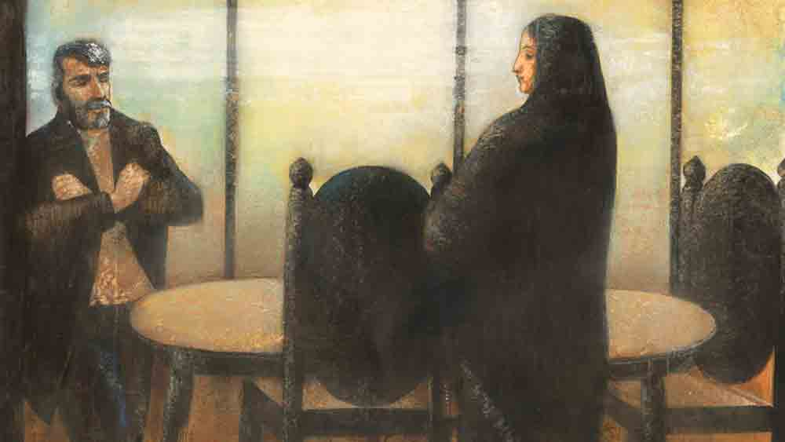

 

<h1 align=center> মেরুজ্যোতি</h1>
<h2 align=center>সঙ্গীতা বন্দ্যোপাধ্যায়</h2>
যে  কোনও এয়ারলাইন্স-এর পক্ষে বছরের ব্যস্ততম সময়টা কাটে থ্যাঙ্কসগিভিং থেকে ক্রিসমাস পেরিয়ে নিউ ইয়ারের আশপাশে। তার ওপর এ মাসে এই সময়ে পর পর ক’দিন এত ঝড়-বৃষ্টি হয়েছে যে, চোদ্দো-পনেরো ঘণ্টা ওয়েদার অ্যাসাইনমেন্টেই চলে গেছে ক্যাপ্টেন নিশান শর্মার। তার পর সুইডেন থেকে উড়ে তাঁর একশো ঘণ্টা ফ্লাইং আওয়ার্স শেষ হয়েছে কাল রাতে একটা বোয়িং ৭৭৭-কে কলকাতা এয়ারপোর্টে ল্যান্ড করানোর পর। এ মাসে আর চার ঘণ্টা উড়তে হবে তাঁকে। তার পর কিছু দিন রিজ়ার্ভ পাইলটের ডিউটি থাকবে। বেস অপারেশনস থেকে পাইলট শর্মা গত ক’দিনে এতগুলো টাইম জ়োনে ট্র্যাভেল করেছেন যে, এয়ারলাইন্স তাঁকে এখন টানা ‘বডি অ্যাডজাস্টমেন্ট রেস্ট’ দিয়েছে। কলকাতার উপশহরের এই ঝাঁ-চকচকে কমপ্লেক্সে এয়ারলাইন্সের গেস্ট হাউসে এখন অন্তত চল্লিশ ঘণ্টা থাকবেন ক্যাপ্টেন শর্মা। গত দশ-বারো বছর ধরে এই কমপ্লেক্সের এই গেস্ট হাউসে বার বার বিশ্রাম নিতে এসে উঠেছেন পাইলট শর্মা, একটা ফ্লাইট থেকে অন্য একটা ফ্লাইটের মধ্যবর্তী লেআউট কাটিয়ে গেছেন। এখানে অন্য পাইলটরাও আসেন, থাকেন, ক্রু-রাও আসে, হল্ট করে, চলে যায়। সার্ভেন্ট কোয়ার্টার আছে। খাবারদাবার যা ইচ্ছে চাইলেই পাওয়া যায়। দশ-বারো বছর আগে এই কমপ্লেক্সে লোকজন প্রায় ছিলই না। এখন অনেক মানুষ। আগে এই উপশহরে ঢুকলে চার পাশে শুধু ঝিঁঝিঁ পোকার ডাক শোনা যেত। টানটান নিঝুম প্রান্তরে নির্মীয়মাণ উচ্চাভিলাষী হর্ম্যের সারি ছাড়া আর কিছু চোখে পড়ত না। এখন প্রচুর আবাসিক। গাড়ি চলছে অগুনতি। বিকেলের আলো থাকতে থাকতে এখানে পৌঁছলে দেখা যায় পাঁচ, সাত, দশ, বারো বছরের বাচ্চারা ছোট ছোট সাইকেল চালিয়ে ঘুরে বেড়াচ্ছে। ভেতরের রাস্তায় এই সব সাইক্লিং করতে থাকা শিশুদের মাঝখান দিয়ে তখন খুব সন্তর্পণে গাড়ি চালাতে হয়। দশ বছর আগে সবে সবে শুরু হয়েছিল ল্যান্ডস্কেপ গার্ডেনিং। এখন বাতাস বইলে বেশ একটা বুনো গন্ধ পাওয়া যায় এত বড় বড় গাছ! আর এখানে এখন অনেক ছাঁতিয়ন গাছ। ছাঁতিয়নের গন্ধ পেলে নিশানের মনে হয় তাঁর ভেতরের একটা গোপন সুড়ঙ্গের মধ্যে দিয়ে বয়ে গিয়ে গন্ধটা তাঁকে অবশ করে ফেলছে। মন অবশ হয়ে যাওয়া, মস্তিষ্ক অবশ হয়ে যাওয়াকে নিশান খুব ভয় পান, এড়িয়ে চলেন। নিজেকে নিয়ে এই রকম একটা ভয় থেকেই তিনি আর্ট, মিউজ়িক, লিটারেচার, সিনেমা— যা-ই তাঁর অন্তঃস্থলকে বিপর্যস্ত করে দিতে পারে, ধসিয়ে দিতে পারে, আচ্ছন্ন করতে পারে বলে মনে করেন— সব লিস্ট থেকে বাদ দিয়ে রেখেছেন বেশ অনেক বছর। তিনি এ ভাবেই কোনও ক্যাথারসিস ছাড়া বাঁচতে চান, তিনি মনে মনে চান, “ক্রুজ়িং থ্রু থার্টি থ্রি থাউজ়্যান্ড ফিট, অ্যাট আ স্পিড অব ফোর হানড্রেড মাইলস পার আওয়ার, দ্য ওয়েদার লুকস গুড, দ্য সিটি ইজ় শাইনিং ব্রাইট, দ্য টেলউইন্ড ইজ় অন আওয়ার সাইড, উইল বি ল্যান্ডিং উইদিন টেন মিনিটস ফ্রম নাউ...” ব্যস, এটুকুই। যেমন কেরুনা এয়ারপোর্ট থেকে টেক অফ করার পর বেগুনি, নীল, সবুজ, গোলাপি রঙের ‘অরোরা বোরিয়ালিস’ দেখে গতকালও তাঁর এই কথাটাই মনে হয়েছিল। এমন অনর্গল জ্যোতি-গঙ্গা, পৃথিবীর অন্ধ প্রণয়ী আকাশের এমন ছাতার মতো, মাশরুমের মতো, বল্গা হরিণের শিঙের মতো, সিনে-স্ক্রিনের ঢেউ তোলা পর্দার মতো, ঘূর্ণাবর্তের মতো, উবুশ্রান্ত বৃষ্টিপাতের মতো আলোর প্রজেকশন দেখে তিনি ভেবেছিলেন এই নিসর্গ তাঁর সহ্যের অতীত।      প্লেন থেকে নিশান শর্মা এই কমপ্লেক্সটাও দেখতে পান। এত সবুজ দেখে তাঁর ঠোঁট শিশুদের মতো গুটিয়ে আসে। এত বছর ধরে এখানে এসে থাকেন না-থাকার মতো, এসেই লিফ্টের বোতাম টিপে পঁচিশ তলায় উঠে যান। ঘুমিয়ে পড়েন। আবার নামেন, নেমে এয়ারপোর্টের উদ্দেশে রওনা হয়ে যান। তবু তাঁর ঘুমন্ত শরীরে, মনে, একটা কোলাজ তৈরি হয়ে গেছে এই জায়গাটার।   ক্যাপ্টেন নিশান শর্মা। নুন-মরিচ চুল, ঘন ভুরু, চৌখস মুখশ্রী, চওড়া কাঁধ, চওড়া কব্জি, লম্বা লম্বা পা, শর্টস পরলে ভরাট ঊরুর ফিমার বোন পরিষ্কার ফুটে ওঠে এত শক্তপোক্ত গড়ন। অনেক মেঘ ঘাঁটলে পাইলটদের ঘুমের ভেতর মেঘ কখনও কখনও দৈত্যের মতো ফিরে ফিরে আসে। হঠাৎ পিঠের তলাটা থেকে যেন সরে যায় পৃথিবীর পাটাতন, পাইলটরা ঘুমের ভেতর পড়ে যান কুড়ি-পঁচিশ হাজার ফিট। কাল গভীর রাতে এই ফ্ল্যাটে ঢুকে ক্যাপ্টেন ভোরবেলা শুতে গেছেন। ঘুমোচ্ছেন। ছটফট করছেন। মস্তিষ্কের অরোরা বোরিয়ালিস ঘুমে ব্যাঘাত ঘটাতে চাইছে। এমন সময় ক্ষত শুকোনোর মতো ঘুমটা ভেঙে গেল বারংবার বেজে ওঠা ডোরবেলের শব্দে। চোখ মেলে দেখলেন সন্ধে সাতটা বাজে। শরীরটা পাথরের মতো ভারী হয়ে আছে। রুমটা গরম, কিন্তু রুমের বাইরে ভীষণ ঠান্ডা। ঘর থেকে বেরিয়ে শীত করে উঠল তাঁর। ফিরে গিয়ে ট্র্যাকস্যুটের জ্যাকেটটা পরে নিলেন। আর তখনই পর পর দু’বার বিকট বজ্রপাতের শব্দে তাঁর কানে তালা লেগে গেল। অপ্রস্তুত হয়ে গেছিলেন নিশান। রুমের ভেতরটা সাউন্ডপ্রুফ বলে বোঝাই যায়নি বাইরে এত ঝড়বৃষ্টি। সশব্দ বাজ, তুমুল বৃষ্টিপাত কিছুই টের পাননি। তিনি কেয়ারটেকার-কাম-কুক ছেলেটিকে কোথাও দেখতে পেলেন না। অন্য তিনটে বেডরুমেও কেউ আছে বলে মনে হল না। ফ্ল্যাটটা একেবারে নিস্তব্ধ। একটা ল্যাম্প 
জ্বলছে লাউঞ্জে।   প্রচণ্ড বিরক্তির সঙ্গে দরজাটা খুলে ফেললেন ক্যাপ্টেন শর্মা। দেখলেন এক জন বছর চল্লিশের মহিলা দাঁড়িয়ে আছেন দরজা থেকে বেশ একটু দূরে গিয়ে। দু’হাতে কান ঢাকা, কাঁধগুলো সিঁটিয়ে গেছে, ভয় পেয়ে জবুথবু হয়ে দাঁড়িয়ে আছেন। মহিলাকে দেখে আবছা একটা স্মৃতি তার মাথায় বিলি কেটে গেল। নিশান বুঝলেন না এই স্মৃতির সঙ্গে তাঁর যোগাযোগটা কেমন— কোনও বিরাগ, কোনও অস্বস্তি বা সূক্ষ্মতম জুবিলেন্স— কিছুই টের পেলেন না। ভুরু কুঁচকে জানতে চাইলেন, “ইয়েস?”   তখন ভদ্রমহিলা তাঁকে অবাক হয়ে দেখছিলেন, বললেন, “ক্যাপ্টেন নিশান শর্মা? আশ্চর্য না? আমি কিন্তু ভাবিনি আজ আবার ঠিক এখানে সেই আপনাকেই পাব! আশ্চর্য!”   নিশানের মনে হল এখন যদি তাঁকে কেউ একটা কবরে শুইয়ে মাটি চাপা দিয়ে দেয়, তাও তিনি আপত্তি করবেন না। এত ঘুম চোখে, অথচ তাঁর ঘুম তাঁর থেকে অনেক দূরে সাঁতরে চলে যাচ্ছে। তবু বললেন, “হ্যাঁ, ক্যাপ্টেন শর্মা। বলুন?”   “ঠিক সেই দশ বছর আগেকার মতো আবার ঘুম ভাঙিয়ে ডেকে তুললাম আপনাকে! মনে পড়ছে না? কেমন আছেন, ক্যাপ্টেন শর্মা? আমি কিন্তু এই দশ বছরে আপনাকে আর এক বারও দেখিনি! অন্য পাইলটদের দেখেছি ট্রলিব্যাগ টেনে টেনে আসতে যেতে, এয়ারহোস্টেসদের দেখেছি হলুদ রঙের ব্লেজ়ার পরে ক্যানারি পাখির মতো লিফ্টে উঠে চলে যেতে, কিন্তু আপনাকে কখনও দেখিনি সে দিনের পর। অথচ আজ ভয় পেয়ে যেই একটা ফ্লোর নেমে এলাম, আবার আপনাকেই পেলাম ক্যাপ্টেন শর্মা?”   নিশান দরজার কোণে হেলান দিলেন। একটা গোপন দীর্ঘশ্বাস ফেলে মাথা নাড়লেন, “মনে পড়েছে। কত বছর অবশ্য মনে নেই!” চোখ বুজে এল তাঁর, তাও বললেন, “অনেক বছর আগে, যখন এখানে রাত হলেই ল্যান্ড-মাফিয়ারা গুলিগোলা ছুড়ত, বোমাবাজি করত, তখনকার কথা। তখন 
রাত হলে এই জায়গাটা ভয়ঙ্কর চেহারা নিত। তখন এক দিন ভয় পেয়ে আপনি ওপরের ফ্ল্যাট থেকে নেমে এসে এই ফ্ল্যাটে বেল দিয়েছিলেন, সে দিনও আমি ঘুম থেকে উঠে দরজা খুলেছিলাম।   “আপনার স্বামী ফ্ল্যাটের চতুর্দিকে ক্যামেরা বসিয়ে আপনাকে প্রায় এক ধরনের ক্যাপটিভেশনে রাখতেন, আপনি ছিলেন বিবাহ-বন্দিত্বের পারফেক্ট এগজ়াম্পল। উনি আপনাকে অপমান করতেন, ছোট করতেন, হেয় করতেন, আপনার কনফিডেন্স তলানিতে এসে ঠেকেছিল। আপনার এক জন গোপন প্রেমিক ছিল, কিন্তু আপনাকে নতুন জীবন দেওয়ার যোগ্যতা বোধহয় তার ছিল না। আপনি কষ্ট পাচ্ছিলেন, সাফার করছিলেন, আপনি আপনার স্বামীর টুথব্রাশ দিয়ে বেসিন পরিষ্কার করতেন। এটা ছিল আপনার প্রতিশোধ। আপনি মিনি। বলুন মিনি, কেমন আছেন?”   প্রচণ্ড বজ্রপাত, মিনির চমকে ওঠা, সব অগ্রাহ্য করে নিশান লম্বা একটা হাই তুললেন, “দশ বছর আগে আপনার চোখমুখে কোনও আলো ছিল না, উদ্ভাস ছিল না, আপনার চোখগুলো মনে হত ভেতর দিকে খোলে। আপনার হাসি দেখে মনে হয়েছিল সব হাসি কোনও একটা ফাটল দিয়ে গড়িয়ে ভেতরে জমছে। আমি বোধহয় আপনাকে বলেছিলাম মিনি, ইউ নিড আ গুড ক্রাই। মিনি, আশা করি আপনার জীবনটা এখন আগের থেকে ভাল হয়েছে। দশ বছর অনেকটা বড় সময়। আপনাকে দেখে সেই আগের মত দুঃখী কিন্তু আর মনে হচ্ছে না। আজ দশ বছর পর আপনি আবার ভয় পেলেন কী নিয়ে? দিস?” নিশান আকাশের দিকে আঙুল 
তুলে বোঝালেন বজ্রবিদ্যুৎ, ঝড়বৃষ্টির কথা বলছেন।   মিনি নামের সেই মহিলা কান থেকে হাত সরিয়ে সব শুনছিলেন, বললেন, “আপনার সব মনে আছে! আচ্ছা আমি কি একটু ভেতরে আসতে পারি? এত বাজ পড়ছে, এত ঝড়, এত বৃষ্টি। আমার ভীষণ ভয় করছে ক্যাপ্টেন শর্মা! সেই বোমাবাজির মতো ঝনঝন করছে সমস্ত কাচের দেওয়াল।”   মিনিকে ভেতরে আসতে দিয়ে নিশান দরজাটা বন্ধ করে দিলেন। বললেন, “বসুন।”   মিনি বসলেন না। ডাইনিং টেবিলের একটা চেয়ার ধরে দাঁড়িয়ে রইলেন। নিশানও দাঁড়িয়ে থাকলেন একটু দূরে। মিনির পরনে একটা কালো পাজামা আর বাকি শরীরটায় কালো শাল জড়ানো। শালটা মাটিতে লুটোচ্ছে। মিনির পায়ে জুতো নেই। মেরুন রঙের মোজা পরা।   দশ বছরে বয়সটা বেড়েছে একটু। এ ছাড়া আর তেমন কিছু নজরে পড়ল না নিশানের।   “আপনার স্বামীর কী খবর? এখন বোধহয় উনি আর আপনাকে ও ভাবে অ্যাবিউজ় করেন না? দশ বছরে ওঁর একটু পরিবর্তন নিশ্চয়ই হয়েছে, মিনি? ওই কাচের দেওয়াল এত বছরেও আপনি বদলাননি কেন? ভিতু মানুষ আপনি।”   “ও আর নেই!” খুব তাড়াহুড়ো করে কথাটা উচ্চারণ করলেন মিনি।   নিশান বললেন, “ওহ! সরি মিনি।” মুখে সরি বললেও নিশান মনে মনে খুশি হলেন খবরটা 
শুনে। যা অবস্থা দেখেছিলেন তখন মিনির! প্যাথেটিক।   লাউঞ্জের এক কোণে সেই পুরনো ল্যাম্পটা জ্বলছে। দশ বছর আগেও এই ফ্লোর ল্যাম্পটা এ ভাবে জ্বলত।   মৃদু আলোয় মিনির মুখ অস্পষ্ট। মিনি বললেন, “এত বছরে আপনার কখনও আমার কথা মনে হয়নি? কখনও আমার একটা খোঁজ 
নিতে ইচ্ছে হয়নি? মাত্র একটা 
ফ্লোর ওপরে?”   নিশান একটু ভাবলেন। তাঁর ঘুম একেবারে ছানা কেটে গেছে, “এত বছরে আমি এ রকম অনেক মহিলাকে দেখেছি, যাঁরা খুব খারাপ একটা বিয়ের মধ্যে কখনও বাধ্যত, কখনও নিজের চয়েসে থেকেছেন, আছেন। এঁরা অনেকেই চাইলে বেরোতে পারতেন। কিন্তু বেরোননি, বা বেরোচ্ছেন না। কেন যে এঁরা বিয়েগুলোকে এ ভাবে টিকিয়ে রাখেন জানি না। আমার কলেজের বান্ধবী, একটা ব্যাঙ্কের চেয়ারপার্সন, পঁচিশ বছর ধরে একটা ভায়োলেন্সে ভরপুর দাম্পত্যের মধ্যে নিজেকে তাওয়া রোটির মতো সেঁকছে।   “এঁদের যখন দেখি তখন কখনও কখনও আপনার কথাও আমার মনে পড়েছে এটা ঠিক। ইয়োর স্টোরি ওয়াজ় ইউনিক। অ্যাপার্ট ফ্রম অল দোজ় লিটল সাবোটাজেস ইউ ডিড, চাইলে কি তার থেকে বেশি কিছু করে ও রকম একটা টোয়েন্টি ফোর ইনটু সেভেন মানসিক যন্ত্রণার হাত 
থেকে নিজেকে আপনি মুক্তি দিতে পারতেন না?”   “আমি এখন সত্যিই মুক্ত ক্যাপ্টেন শর্মা।”   নিশান হাসলেন, “দেখে তাই মনে হচ্ছে। আপনার মধ্যে যে ঠান্ডা নিষ্ঠুরতা দেখেছিলাম, সেটা তো আর নেই। আপনাকে এখন মোমবাতির আলোর মতো সুদিং দেখাচ্ছে। 
এটাই আসল মুক্তি। টক্সিক একটা সম্পর্কে থাকতে থাকতে আমরা নিজেরাও ভীষণ...”   “জানি, জানি, এগুলো সব এখন আমাদের সকলের মুখস্থ হয়ে গেছে। আপনার এখানে বাইরের আওয়াজ একদম কম ঢোকে।”   “তাই তো।”   “দশ বছরে আপনাকে দেখতে বদলে গেছে ঠিকই, কিন্তু তেমন বয়স বাড়েনি। বয়সটা আপনি বেশ সুন্দর ধরে রেখেছেন ক্যাপ্টেন। খুব ফিট দেখাচ্ছে আপনাকে।”   “এভিয়েশন ইন্ডাস্ট্রিতে থাকতে গেলে ফিট তো থাকতেই হয়।”   “এক সময় মধ্যবিত্ত পরিবারের মেয়েদের মতো আমারও চোখ-কপালে-তোলা ভাল লাগা ছিল এয়ারহোস্টেসদের জন্য। ঠিক কেন যে ভাল লাগত পেশাটা এত তখনও বুঝতাম না, এখনও বুঝি না। কত গল্প শুনতাম এয়ারহোস্টেসদের নিয়ে। ফ্লাইং খুব একটা গ্ল্যামারাস পেশা ছিল। তখন মনে হত এয়ারহোস্টেসরা এই পৃথিবীর কেউ নয়। আকাশে আকাশে ঘুরে বেড়ায়, কত দেশ দেখে, একটা একটা জায়গায় প্লেন নামলে হাইহিল পরা, টপনট করা বিমানসেবিকারা ফাইভ স্টার হোটেলে গিয়ে ওঠে, তার পর পার্টি করে, নাইটক্লাবে যায়, শপিং করে, আবার সেখান থেকে অন্য দেশে উড়ে যায়। কী দারুণ হ্যাপেনিং লাইফ! আর আমি তো আজ অবধি স্টিলেটোই ম্যানেজ করতে পারলাম না!” মিনি হেসে মাথা নিচু করলেন, “আর তার পর সেই এয়ারহোস্টেসদের সঙ্গে আপনার মতো তুখড় পাইলটদের প্রেম হয়।”   নিশান আলাদা করে কিছুই ভাবলেন না এই কথাটা শুনে। কারণ এ সব কথা তাঁর বহু বার শোনা, ভাবা হয়ে গেছে। কিন্তু যদি ভাবতেন তা হলে ভাবতেন যে, নাহ! পাইলটদের সঙ্গে শুধু এয়ারহোস্টেসদের প্রেম হয়, ব্যাপারটা ঠিক তা নয়। প্রতিটি মেয়ের স্বপ্নেই এক জন পাইলট থাকে। না-দেখা, না-চেনা, নাম-পরিচয়হীন এক জন পাইলট। মেয়েরা পারলে আসলে একটা এয়ারক্রাফ্টের সঙ্গেই প্রেম করত। সেটা করা যায় না বলে সেই উড়োজাহাজকে যে বা যারা নিয়ন্ত্রণ করে তাদের সঙ্গে প্রেম করতে চায়। পুরুষরা সেই কবে থেকে আকাশ শাসন করতে চেয়েছে। অন্য দিকে মেয়েদের কাছে আকাশ পুরুষালি, আকাশযান দেখতে পুরুষের পৌরুষের মতো, আর এ সব ঘিরে যে ফ্যান্টাসি, তার সবচেয়ে ইনটেলিজেন্ট জায়গা ককপিটে বসে আছে পাইলট। করব্যুসি একেই আকাশে মানুষের তৈরি কলোনির ‘কালচালার ইমেজারি’ বলেছেন। নিশান নিজে যে এত বছর প্লেন চালাচ্ছেন, জিনিসটা আজ এত বছর ধরে একই রকম মোহগ্রস্ত করে রেখেছে তাঁকে। এখনও একটা ল্যান্ডিংয়ের পর এয়ারক্রাফ্টটাকে পেছনে ফেলে রেখে যখন বেরিয়ে আসেন, তখন দূর থেকে ঘুরে তাকালে বিশ্বাস হয় না যে, এ রকম একটা বিপজ্জনক জিনিসকে ঘণ্টার পর ঘণ্টা পোষ মানিয়ে রেখেছিলেন। তাঁর নিজের কাছেই ফ্লাইং এখনও এত সেক্সি...   এ দিকে মিনি তখনও বলে যাচ্ছেন। চোখ ছোট ছোট করে, চোখের পাপড়িতে ঢেউ তুলে কথা বলছেন, “আমার খুব ভাল লাগে, নীল শিরা ওঠা সাদা কব্জিতে কালো চামড়ার ঘড়ি পরা এয়ারহোস্টেস যখন হাত বাড়িয়ে অরেঞ্জ জুস এগিয়ে দেয় প্যাসেঞ্জারকে, সেটা দেখতে আমার খুব ভাল লাগে। আমি লক্ষ করেছি পাইলটরা খুব ঠাট্টা করে কথা বলে এয়ারহোস্টেসদের সঙ্গে। আর সেই অদ্ভুত মেয়েরা কাঁধ ঝাঁকিয়ে হেসে ওঠে এমন, ওই যে একটা শব্দ আছে না ‘রলিক’, ওই রকম হাসি। আমি কখনও ও রকম হাসি হাসিনি, কারণ ওই হাসিটা হাসতে গেলে আকাশে উড়ে উড়ে উড়ে উড়ে হাড়ে, মজ্জায় ফ্রি হয়ে যেতে হয়। কাঁধ, কাঁধ জিনিসটা খুব অদ্ভুত জানেন, কাঁধ দেখলে বোঝা যায় জীবনটা কেমন, মনটা কেমন। আপনার কাঁধ দুটো দেখুন ক্যাপ্টেন!” মিনি মুগ্ধ চোখ বুলিয়ে নিল ক্যাপ্টেন নিশান শর্মার কাঁধে।   নিশান হাসলেন, “আপনি হলেন না কেন এয়ারহোস্টেস? ইউ আর কোয়াইট টল। ফ্লাইং এখনও খুব গ্ল্যামারাস প্রফেশন।”   “আমি আসলে শুরুতে কখনও ভাল করে নিজেকে নিয়ে ভাবিনি। তা ছাড়া গোপন ইচ্ছেগুলোকে অনুধাবন করার মতো গভীরতা আমার কখনও ছিল না। সবার থাকে না। আমরা আসলে খুব সাধারণ ছিলাম। আপনাকে তো বলেছিলাম আমরা কত সাধারণ ছিলাম।”   ক্যাপ্টেন নিশান শর্মা নিজের ভেতরের সব প্রতিরোধ ভেঙে দিয়ে একটা চেয়ার টেনে বসে পড়লেন, “হ্যাঁ, একটু মনে আছে, যেমন আপনারা ভাইবোনরা সবাই মিলে একটাই তোয়ালে ব্যবহার করতেন শুনে আপনার হাজ়ব্যান্ড আপনাকে খুব হিউমিলিয়েট করেছিলেন।”   মিনির গাল দুটো লজ্জায় লাল হয়ে গেল, “সত্যি আপনি এত কিছু মনে রেখেছেন?”   “রেখেছি।”   “আমি আসলে এত সাধারণ ছিলাম ক্যাপ্টেন শর্মা যে, আমি জীবনে কখনও কোনও স্বপ্ন দেখিনি, কিছু হওয়ার স্বপ্ন, কিছু পাওয়ার স্বপ্ন দেখিনি, আমি আসলে এতটাই সাধারণ ছিলাম যে, আমার কী ভাল লাগে এটাও আমি কখনও বুঝতে পারিনি। অনেক পরে আমি বুঝতে পারি যে, আমার মতো অনেক মেয়েই আসলে তাদের ঠিক কী ভাল লাগে সেটা বুঝতে পারে না। আমার কখনও কোনও উচ্চাকাঙ্ক্ষা ছিল না, এমনকি ধরুন আমার বিয়েটাকে ঘিরেও আমার ভেতর কোনও আবেগ ছিল না। উত্তেজনা ছিল, কিন্তু আবেগ ছিল না। অনেক পরে গিয়ে আমি বুঝলাম আমি আসলে এত সাধারণ যে, আমি কখনও কাউকে ভালবাসতেও শিখিনি। ভালবাসতে পারাটাও যে এত কঠিন, আমার মতো সাধারণ না হলে সেটা কেউ বুঝবে না। মানে, কী ভালবাসব বলুন তো ক্যাপ্টেন শর্মা? একটা মানুষকে কী করে ভালবাসতে হয় আমি এত বছর ধরে বোঝার চেষ্টা করছি। কেন জানি না আমার মনে হয় সব মানুষের সঙ্গে সব মানুষের সম্পর্ক হল ওই অঙ্কটার মতো, একটা ট্যাপ দিয়ে জল ঢুকছে আর একটা ফাটল দিয়ে হুড়হুড় করে বেরিয়ে যাচ্ছে,” মিনি দীর্ঘশ্বাস ফেললেন।   “হোল্ড অন, আপনি কি বলতে চাইছেন যে, এখন যখন আপনার স্বামী আর নেই তখন আপনি রিয়ালাইজ় করছেন যে, আপনি কোথাও ভুল করেছেন, আপনিই ওঁকে কখনও ভালবাসতে পারেননি, 
সেটা ওঁর অদ্ভুত স্বভাবের দোষ নয়, সেটা ওঁর ওই অ্যাবিউসিভ নেচারের দোষ নয়, সেটা আপনারই দোষ, আপনারই অক্ষমতা?”   খুবই বিরক্ত হলেন মিনি প্রশ্নটায়, “না, না, ক্যাপ্টেন শর্মা, কী বলছেন! আপনার সব কথা মনে আছে, তার পর আপনি এটা কী বলছেন? ওঁরই দোষ। আমার স্বামী এক জন জঘন্য মানুষ ছিলেন। এই নিয়ে আমার কোনও সংশয় নেই, কোনও প্রশ্ন নেই। যাকে বলে ভীষণ আনপ্লেজ়্যান্ট একটা লোক। কোনও ভার্চু নেই যাঁর। উনি এমন এক জন মানুষ ছিলেন যিনি অন্যকে ছোট করেই নিজেকে বড় করতে অভ্যস্ত ছিলেন। অথচ দেখুন আমার অতি সাধারণত্বের বিপরীতে উনি ছিলেন কতই না অসাধারণ। ভাল পরিবার, ভাল এডুকেশন, এত অ্যাচিভমেন্ট, আমার মতো মিষ্টি একটা বৌ, যে ভাল না বাসলেও, বুঝতে তো কখনও দেয়নি? আর সেটাই তো আসল, না কি?” মিনি এমন ভাবে হাতটা তুললেন যেন কথাটা এতটাই সত্যি যে তাই দিয়ে বান্দ্রা-ওর্লি সি-লিঙ্কের সন্ধে সাতটার ট্র্যাফিকও মিনি থামিয়ে দিতে পারেন।   মিনির কথা শেষ হতেই চমকপ্রদ এক কমলা আর রুপোলি রঙের হিলহিলে বিদ্যুল্লতা কাচের জানলায় ছোবল মেরে গেল। সঙ্গে কান চেপে ধরার মতো আর্তনাদ। হল বেডরুমের মতো অতটা শব্দনিরোধক নয়। মিনি ঝট করে একটা চেয়ার টেনে নিলেন, ধপাস করে বসে পড়লেন তাতে।   ক্যাপ্টেন শর্মা বললেন, “আমার মনে হয় একটু কফি খেলে ভাল হত। আপনি কফি খাবেন মিনি?”   “কফি?” মিনি কাঁচুমাচু মুখ করে বললেন, “আমি খুব লজ্জিত, ক্যাপ্টেন শর্মা। দশ বছর আগেও আমি আপনাকে এ ভাবেই বিরক্ত করেছিলাম। আপনি কফিও খান। আমার কথাটাও শুনুন। এমন তো নয় যে, আমি আগে, পরে, তার পরে আর কাউকে ভালবাসার চেষ্টা করিনি? কিন্তু হয়নি। এরা কেউ আমার স্বামীর মতো খারাপ ছিল না। ও যেমন যত দিন যাচ্ছিল ভায়োলেন্ট হয়ে যাচ্ছিল। আমাকে ও নিজের বন্ধুর সামনে, বন্ধুর স্ত্রীর সামনে তলপেটে ঘুসি মেরেছিল ক্যাপ্টেন শর্মা। আমাকে রাত্রিবেলা হাইওয়েতে নামিয়ে দিয়েছিল এক দিন। ভয়ে আমি অজ্ঞান হয়ে গেছিলাম। গাছের টব লাথি মেরে ভেঙে দিত, আমি গাছে জল দিতে ভুলে যেতাম বলে। এ সব আপনি জানেন না।   “ক্যাপ্টেন শর্মা আপনাকে না বলার কিছু নেই, ও লিটারালি আমার স্তন ধরে ঝুলতে চেষ্টা করত যাতে আমার স্তনের শেপ নষ্ট হয়ে যায়। ক্যাপ্টেন শর্মা বিয়ের পাঁচ বছর পরে যদি একটা মেয়েকে তার স্বামী বলে তুমি বিয়ের সময় ভার্জিন ছিলে না, বলুন তো তখন সে ঠিক কী ভাবে কথাটা ভুল না ঠিক প্রমাণ করবে? এবং শুনুন ক্যাপ্টেন শর্মা, এটা শুধু আমার সঙ্গে হয়নি। অনেকের সঙ্গে হয়েছে। অনেকের সঙ্গে হয়।   “কিন্তু কথা সেটা নয়। কথা এটাও নয় যে, কেন আমি কখনও ভালবাসতে শিখিনি বা সত্যিই আমি ভালবাসতে শিখিনি কি না!”      নিশান আর কিছু বললেন না, মাথা নিচু করে থাকলেন। তিনি নিজেও পড়ছিলেন সম্প্রতি, যত দিন যাবে মেয়েরা আর ভালবাসতে পারবে না। ভালবাসার ক্ষমতা তাদের মধ্যে থেকে হারিয়ে যাচ্ছে। এটা একটা ব্লক মতো। খুব দ্রুত এই সব পরিবর্তন ঘটছে। চিহ্নগুলো সবে ধরা পড়ছে। ধরতে পারছে কেউ কেউ। সবাই পারছে না। মেয়েরা এখন ইমোশনাল ইন্টিমেসিকে ভয় পাচ্ছে, শারীরিক ঘনিষ্ঠতা জিনিসটাও তাদের পক্ষে আর তেমন অনায়াস নেই, তার থেকেও বেশি গুরুত্বপূর্ণ কথা হচ্ছে যে মেয়েরা দেখছে বিয়ে, প্রেম, সম্পর্ক এইগুলো বাদ দিয়ে জীবনটা তাদের পক্ষে খুব আরামদায়ক। আর্টিকলটায় লিখেছে যে মেয়েরা এখন পুরুষদের কাছ থেকে প্রশংসা বা কমপ্লিমেন্ট গ্রহণ করতেও দ্বিধা বোধ করে। নিজেরা কাউকে ভালবেসে ফেললে ভাবে নিজেই ‘ফেক’ করছে কি না। এবং উত্তর খুঁজতে চাইলে উত্তর আসে, ফেকই করছে।   এ সবই রিসার্চে উঠে আসছে। ভাল না বাসাটা একটা মেয়েলি ডিফেন্স। সেটাই বলতে চেয়েছে লেখাটায়। এগুলো হওয়ার পেছনে হাজার হাজার বছর ধরে নারীশোষণের ইতিহাস আছে। কিন্তু মিনি? মিনি এতটাই আহত যে, উনি ভেবে নিয়েছেন ওঁর মধ্যে ভালবাসা ব্যাপারটা কখনও ছিল না।   নিশান বেশ একটু সময় নিয়ে বললেন, “কথাটা তা হলে কী মিনি?”   “ক্যাপ্টেন শর্মা, আমি এটা নিয়ে ভাবিত নই যে, আমি ভালবাসতে পারি কি না, আমাকে ভালবাসা যায় কি না বা মেয়েরাই ভালবাসতে না পারার মতো বদলে গেছে কি না। বিমূর্ত ক্ষত যদি আমার কিছু থেকে থাকে তা ভালবাসা-সংক্রান্ত নয়।   “আমার সমস্যাটা এখন অন্য। আমি প্রায় রোজ একটা স্বপ্ন দেখি। স্বপ্নে আমি দেখি, এই পৃথিবীতে বায়ো-ওয়ারফেয়ার থেকে ছড়িয়ে পড়া একটা ভাইরাসে গাছ থেকে শুকনো পাতা ঝরে পড়ার মতো মানুষ মরে যাচ্ছে। ঠিক আমেরিকান অ্যাপোক্যালিপ্টিক মুভিগুলোর মতো ভয়ঙ্কর সব দৃশ্য। স্বপ্নটা আমি একটু একটু করে পুরোটা দেখতে পেয়েছি, দেখতে দেখতে স্বপ্নটাকে আমি আত্মস্থ করতে পেরেছি। যখন সমস্ত মানুষ মরে যাচ্ছে, তখন এই কমপ্লেক্সটাতেও মৃতদেহরা মরে পচে গলে উঠছে। আকাশে শকুন উড়ছে। সমস্ত জল কনট্যামিনেটেড হয়ে গেছে, চাল, ডাল, আনাজ, শস্য সব ফুরিয়ে যাওয়ার আগে লুট হয়ে গেছে। মানুষের দেহজ বর্জ্যে ভেসে গেছে প্রান্তর। কুণ্ডলী পাকিয়ে উঠছে শুধু মাংসখেকো পোকামাকড়। নরখাদক শ্বাপদরা এগিয়ে এসেছে ধীরে ধীরে। কেউ আর কোথাও বেঁচে নেই। অদ্ভুত নিষ্ঠুর এই জঙ্গল-শহরে দিন আর রাতের পার্থক্য ঘুচে গেছে। গোটা পৃথিবীতে কী হচ্ছে আমি জানতে পারছি না, কিন্তু এখানে 
আস্তে আস্তে গাছপালা, লতাগুল্ম গ্রাস করে নিচ্ছে উঁচু টাওয়ারগুলো। চাকা বসে যাওয়া দামি দামি গাড়ি ঢাকা পড়ে গেছে সবুজ আস্তরণে। ঘুটঘুটি অন্ধকার রাতে তার মধ্যে থেকে জ্বলন্ত চোখ মেলে কারা যেন তাকিয়ে থাকে। এই ধ্বংসের মধ্যে আমি একা বসে আছি। প্রাণ হাতে করে একটা টাওয়ার থেকে অন্য টাওয়ারে যাচ্ছি খাবারের সন্ধানে। যেখানে যাই সেখানে কিছু দিন থাকি। কিচেন তছনছ করে খাবার খুঁজি। পেলে কাগজ জ্বালিয়ে রাঁধি। এক দিন আমার সেই যৎসামান্য খাবারও 
পুড়ে যায়।”   মিনির চোখে জল এসে যায়, গলা ধরে যায় কথাটা শেষ করতে, মিনি তাকান ক্যাপ্টেন নিশান শর্মার দিকে, দেখেন ক্যাপ্টেন নিশান শর্মা তাঁর গল্পের মধ্যেই কখন উঠে কোথাও চলে গেছেন। বোধহয় বেরিয়ে গেছেন ফ্ল্যাট থেকে। হয়তো ভয় পেয়েছেন। মিনিকে পাগল ভাবছেন।   মিনি কিন্তু থেমে যান না, মিনি বলে চলেন, “এক দিন আমার সেই যৎসামান্য খাবার পুড়ে গেলে আমি দেখি যে মৃত্যু অবধারিত জেনে যাওয়া আমি মুখের খাবারটা নষ্ট হয়ে গেল বলে কষ্ট পাচ্ছি না। কী আশ্চর্য! কষ্ট পাচ্ছি খাবারটা পুড়িয়ে ফেলেছি বলে। কেন পুড়ে গেল, কেন পুড়িয়ে ফেললাম— স্বপ্নে এই আমার একমাত্র অনুতাপ। অনুতাপ। অপরাধবোধ। গিল্ট! কালো হয়ে যাওয়া, জ্বলে যাওয়া বাসি মোবিলের মতো অপরাধবোধ! এক দিকে সমস্ত সভ্যতা মোমবাতির মতো দপদপ করছে যে কোনও মুহূর্তে নিভে যাবে বলে, আর তখন আমি খাবার পুড়িয়ে ফেলার জন্য অপরাধবোধে ভুগছি!   “এই অপরাধবোধ, এই পাপবোধ— এটাই মনুষ্যজন্ম, ক্যাপ্টেন শর্মা। বাদুড়ের মতো ঝুলে ঝুলে আপনারই রক্ত চুষে খায় আপনার গিল্ট।”   মিনি উঠে পড়লেন চেয়ার ছেড়ে। শালটা ঠিক করলেন। দরজার দিকে পা বাড়ানোর আগে ক্যাপ্টেন নিশান শর্মার ফাঁকা চেয়ারটার দিকে তাকিয়ে বললেন, “এই অপরাধবোধ সভ্যতার মতো ভারী। নিষ্ঠুরতম এক স্বপ্নে এই সভ্যতার শেষ মানুষ হয়ে মুখ ঢেকে কাঁদতে কাঁদতে বুঝেছি, আমি সমগ্র মনুষ্যজাতির হয়েই কাঁদছি। তেমন কান্না কাঁদার ক্ষমতা আমার আছে। এই সভ্যতাটাকে না বুঝলে এ ভাবে কাঁদা যায় না। এ নিছক নিজের জীবন হাতছাড়া হওয়ার সহজ অশ্রু নয়। মেয়ে হয়ে জন্মালেও এত বড় দায় নেওয়া যায়।”   মিনি চলেই যাচ্ছিলেন। কী যেন ভেবে থমকে দাঁড়ালেন। কনসোল টেবিলের এক পাশে ল্যাম্প জ্বলছে। অন্য পাশে একটা চাইনিজ় মানিপ্ল্যান্ট। আর মাঝখানে একটা নোটপ্যাড আর পেন রাখা। নোটপ্যাডটা তুলে নিয়ে ধীর পায়ে ডাইনিং টেবিলে ফিরে গেলেন মিনি। একটা পাতা ছিঁড়ে নিয়ে তাতে বড় বড় করে লিখলেন, “স্বপ্নে নিজের মনুষ্যজন্ম নিয়ে এমন এক ‘অরোরা পোলারিস’কে ছুঁয়ে ফেলার পর কে আর প্রেম নিয়ে ভাবতে চাইবে ক্যাপ্টেন শর্মা?”   মিনি চলে গেলেন। মোজা পরা পায়ের না-শব্দ মিলিয়ে গেল। ক্যাপ্টেন যেমন বসে ছিলেন বসে থাকলেন চেয়ারে। মিনি তাঁকে দেখতেও পেলেন না। মিনি জানতেও পারলেন না মিনির উপলব্ধি ক্যাপ্টেন নিশান শর্মার ভেতর প্রবেশ করার পর ঠিক কী ঘটে গেল।   পরের দিন স্ফটিকের মতো একটা শরীরে পাইলটের ইউনিফর্ম চড়িয়ে এই শহর ত্যাগ করে উড়ে গেলেন ক্যাপ্টেন নিশান শর্মা।