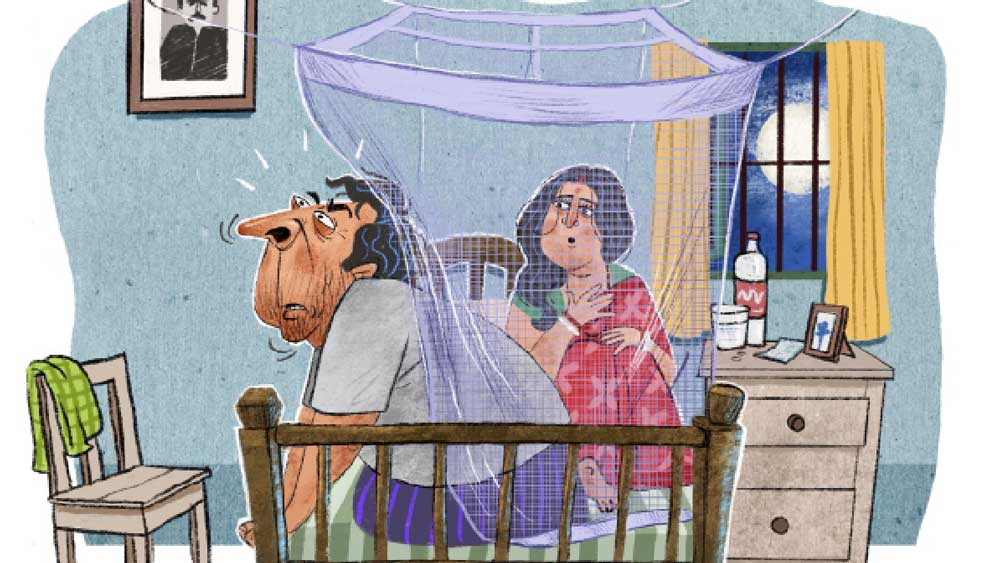

 

<h1 align=center>মোহনবিলাস</h1>
<h2 align=center>দেবপ্রিয়া সরকার</h2>
প   াঁচুবাবুর বাজারে ঢোকার মুখেই রাস্তা আলো করে বড়সড় মিষ্টির দোকান। মাথার ওপর উজ্জ্বল লাল রং দিয়ে লেখা নাম, ‘মোহনবিলাস’।   দোকানের শো-কেস জুড়ে থরে থরে সাজানো মিষ্টি। রসগোল্লা, চমচম, পান্তুয়া, সন্দেশ, প্যাঁড়া, মালাইচপ, লাড্ডু আরও কত কী! সব মিষ্টিই টাটকা। লোকজন হুমড়ি খেয়ে ভিড় করে মিষ্টির টানে। কিন্তু মোহনবিলাসের খ্যাতির মূল কারণ হল মোহনভোগ। ভোজনরসিকরা বলেন, এ মিষ্টি নাকি ম্যাজিকের মতো। মুখে দিলেই মিলিয়ে যায়। উৎসব-অনুষ্ঠানে হুড়োহুড়ি পড়ে যায় মোহনভোগ কেনার জন্যে।   দোকানের প্রতিষ্ঠাতা দধিমোহন ঘোষ ত্রিপুরার রাজবাড়ির বিখ্যাত  হালুইকরের কাছ থেকে শিখেছিলেন মোহনভোগের রেসিপি। প্রত্যেক দিন সকালে স্নান সেরে, কাচা কাপড় পরে, বাড়িতে পোষা কালো গাইয়ের দুধ দুইয়ে, নিজে হাতে তৈরি করতেন মোহনভোগ। যত দিন পেরেছেন নিজে করেছেন, তার পর এই অমৃত তৈরির গোপন প্রণালী শিখিয়েছেন ছেলে ক্ষীরমোহনকে। তিনিও তাঁর জীবদ্দশায় পিতৃদেবের পথ অনুসরণ করেছেন এবং যথাসময়ে মোহনভোগের গুপ্ত রেসিপি বলে গিয়েছেন পুত্র লালমোহনকে।   দধিমোহন ঘোষের আমলে মোহনবিলাস ছিল সামান্য বাঁশের বেড়ায় ঘেরা একখানা ছোট্ট দোকান। মাথার ওপর টালির ছাদ। ক্ষীরমোহনের আমলে মাথার টালির পরিবর্তে এল টিনের ছাউনি। বাঁশের বেড়া ভেঙে তৈরি হল ইট-চুন-সুরকির দেওয়াল। ক্রেতাদের চাহিদা মেনে বাইরের কারিগর এনে মোহনভোগের পাশাপাশি প্রস্তুত হতে লাগল নতুন নতুন মিষ্টি। লালমোহন এই যাত্রাকে এগিয়ে নিয়ে গেল আরও খানিকটা। বানাল ঝাঁ-চকচকে শো-রুম। এল শীতাতপ নিয়ন্ত্রণের যন্ত্র।   লালমোহনের দু’টি সন্তান। মেয়ে বড়, ছেলে ছোট। মেয়ের নাম মিঠাই, ছেলের সন্দেশ। ক্ষীরমোহন আদর করে নাতির নাম দিয়েছিলেন রসমোহন। কিন্তু অর্চনার আপত্তিতে সে নাম আর ওঠেনি জন্মের সার্টিফিকেটে। অতএব তিন পুরুষের নিয়মে দাঁড়ি টেনে পাকাপাকি ভাবে নাম থেকে বিদায় নিয়েছিল ‘মোহন’।   ব্যবসাপত্র মন্দ চলছিল না। ফুলেফেঁপে উঠেছিল লালমোহনের মিষ্টির কারবার। কিন্তু  কয়েকদিন ধরে কিছুটা চিন্তিত দেখাচ্ছে লালমোহনকে। ঘটনার সূত্রপাত এক মাস আগে। দিনকয়েক সর্দি-জ্বরে বেশ কাহিল হয়েছিল লালমোহন। নিজে নিজে ডাক্তারি করে সারিয়েও ফেলেছিল জ্বরটা। কিন্তু গোল বাঁধল এর পর।   সে দিন ধবধবে রাজভোগের মতো গোল চাঁদ উঠেছিল আকাশে। বৈশাখী পূর্ণিমার সদ্য কাটা ছানার জলের রঙের জ্যোৎস্নায় ভেসে যাচ্ছিল চার পাশ। খোলা জানলা দিয়ে মৃদুমন্দ হাওয়া ঢুকছিল। এমন সব দিনে লালমোহনের মন উতলা হয়ে ওঠে। তার আঠারো বছরের 
পুরনো গিন্নির মুখের দিকে তাকালেও কেমন যেন প্রেম-প্রেম ভাব আসে মনে। সাতাত্তর কেজি ওজনের স্ফীত শরীর নিয়ে মশারির ভেতর অর্চনা ঢুকতেই লালমোহন জড়িয়ে ধরল তাকে। ঘটনার আকস্মিকতায় হকচকিয়ে গেল অর্চনা।   “আরে কী হল? শরীরটরির খারাপ লাগছে নাকি?”   “আরে দূর! কী যে বলো! খামোখা শরীর খারাপ হতে যাবে কেন?”   “হঠাৎ এমন অস্থিরপানা করছ যে বড়! তবে কি নিশিতে 
ডাকল তোমায়?”   এক ঝটকায় অর্চনার কাছ থেকে সরে এসে লালমোহন বিষণ্ণ গলায় বলল, “ধুস! তোমার মধ্যে না, একেবারে ইয়ে নেই!”   “ইয়েটা আবার কিয়ে?”   “আরে ওই কী বলে রোম্যান্স, রোম্যান্স! এমন সুন্দর পূর্ণিমা রাতে কোথায় একটু প্রেম-পিরিতি হবে তা নয়, শরীর খারাপ হল কি না, নিশি ডেকেছে কি না এ সব বলছ। বোগাস!”   “আহা, চটছ কেন? আমি কি ছাই জানি, বাইরে জ্যোৎস্না দেখে তোমার মনে হঠাৎ প্রেম জাগবে? 
নাও আর মুখ ঘুরিয়ে থেকো না, এ পাশ ফেরো।”   গিন্নির ডাকে গদগদ হয়ে পাশ ফিরল লালমোহন। অনেক দিন পর শরীর-মনে টের পাচ্ছিল উত্তেজনা। কিন্তু চুমু খাওয়ার জন্য মুখ বাড়াতেই কেটে গেল তালটা। আচমকাই একটা পোড়া গন্ধ এল নাকে। অনেকটা সিগারেট পোড়া গন্ধের মতো। লাফিয়ে উঠে বসল লালমোহন। বুজে আসা চোখ মেলে তাকাল অর্চনা।   “আবার কী হল?”   “একটা কেমন পোড়া-পোড়া গন্ধ আসছে নাকে? সিগারেট মনে হচ্ছে। কেউ কি সিগারেট খাচ্ছে?”   “সিগারেট! এই বাড়িতে? তুমি তো জম্মেও ও সব ছুঁয়ে দেখোনি। সন্দেশও ছোট। সিগারেট, বিড়ি খাওয়ার বয়স হয়নি তার এখনও।”   অর্চনাকে চমকে দিয়ে লালমোহন তার মুখের কাছে নাকটা এগিয়ে শুঁকতে লাগল। এক ধাক্কায় তাকে দূরে সরিয়ে ঝাঁঝিয়ে উঠল অর্চনা, “তুমি কি আমাকে সন্দেহ করছ 
না কি?”   “না, ঠিক তা নয়। ভাবছি, কোথা থেকে আসছে তা হলে গন্ধটা?”   বলতে বলতে খাট থেকে নেমে পড়ল লালমোহন। অর্চনাও নাক উঁচিয়ে শোঁকার চেষ্টা করল। কিন্তু কোনও গন্ধটন্ধ সে পেল না। সে দিনের মতো কেঁচিয়ে গেল তাদের রোম্যান্স, আর লালমোহন পেঁচিয়ে গেল গন্ধের জালে।   শুতে, বসতে, হাঁটতে, চলতে সব জায়গাতেই আজকাল গন্ধের ভূত তাড়া করে বেড়ায় লালমোহনকে। কিন্তু আশ্চর্য, সে গন্ধ কেবল তার নাকেই আসে। মোহনভোগ করতে বসে নাজেহাল হয় লালমোহন। দুধ ফোটা, ছানা কাটার অতি পরিচিত সুবাস বেমালুম মুখ ফিরিয়ে নিয়েছে তার নাসারন্ধ্র থেকে। বিরক্তি ফুটে উঠছে চোখে মুখে। অভ্যেসের বশে বানিয়ে ফেলছে ঠিকই, কিন্তু পুরনো ভালবাসার স্পর্শ থেকে বঞ্চিত থেকে যাচ্ছে তার সাধের মোহনভোগ।   যত দিন গড়াতে লাগল, তত গন্ধের জ্বালায় অস্থির হতে লাগল লালমোহন। সে যাকেই তার এই ঘ্রাণ-বিভ্রাটের কথা শোনাতে যায়, সেই মাছি তাড়ানোর মতো করে উড়িয়ে দেয় সমস্যাটা। আর সকলে হেলাফেলা করলেও লালমোহনের বিক্ষিপ্ত মন পড়তে পারে অর্চনা।   “কী হয়েছে তোমার বলো দিকিনি? এমন মুখ ভার করে আগে তো কোনও দিন থাকতে না!”   দীর্ঘশ্বাস ফেলে লালমোহন বলে, “গন্ধ, গিন্নি, গন্ধ! একটা অদ্ভুত গন্ধের জালে জড়িয়ে আছি আমি। সব সময় মনে হয়, আশপাশে কী যেন পুড়ছে। অথচ কোথাও কিছু নেই। সব চেয়ে অবাক লাগে, শালা গন্ধটা শুধু আমার নাকেই আসে। আর কেউ কিছু বুঝতে পারে না। অদ্ভুত ব্যাপার!”   “বলো কী! এ তো একেবারে ভুতুড়ে কাণ্ড! বলি ভূতটুত ধরেনি তো? কত বার বারণ করেছি জগাদার রোয়াকে বসে তাস খেলো না। ওদের বাড়িতে দু’-দুটো অপমিত্যু হয়েছে। কী জানি ঠিক মতো শ্রাদ্ধশান্তি করেছে কি না! কিন্তু কে শোনে কার কথা? আমি বলতে গেলেই তো অশিক্ষিত, গেঁয়ো ভূত বলে গাল দাও। এখন বোঝো! এ নিশ্চয়ই নিশীথকাকার ভূত। বুড়োটা দিনরাত ওই রোয়াকে বসে বিড়ি টানত। ঘরের ভেতর গলায় দড়ি দিয়ে মরেছিল। রাম রাম রাম!”   অর্চনার কথাটা একেবারে উড়িয়েও দিতে পারল না লালমোহন। সত্যিই তো নিশীথকাকা ওই রোয়াকে বসেই বিড়ি খেত! যেতে আসতে লালমোহনকে ডেকে কত কথা বলত! শেষ জীবনে মাথাটাও একটু বিগড়েছিল। এক দিন দুম করে আত্মহত্যা করে বসল। ভূতপ্রেতের অস্তিত্বে বিশ্বাস না করলেও কেমন একটা চোরা সন্দেহ উঁকি দিতে লাগল লালমোহনের মনে। অর্চনা আশ্বস্ত করে বলল, “তুমি চিন্তা কোরো না। আমি কালই সন্দেশকে পাঠাব নিত্যানন্দ ওঝার ডেরায়। সে নিশ্চয়ই কিছু না কিছু বিধান দেবে। এখন শুয়ে পড়ো। মনে মনে রামনাম জপ করো। দেখো উপকার পাবে।”   পরদিন সকাল সকাল পলিথিনের ব্যাগে বেশ কিছুটা চাল, কাঁচা আনাজ আর একশো টাকার নতুন চকচকে নোট নিয়ে সন্দেশ পৌঁছল নিত্যানন্দ ওঝার বাড়ি। ওঝা সব শুনেটুনে বলল, “হুম, সমস্যা গুরুতর। আমি জানতাম এমন কিছু একটা হবে। তখন জগাকে পইপই করে বললাম, তোর বাপের অপমৃত্যুর ছায়া পাড়ার অন্যদের ওপরেও পড়বে। যত তাড়াতাড়ি পারিস একটা দোষ কাটানোর হোম কর। কথাটা কানেই তুলল না! ভাবল, নিত্য ওঝা পয়সা কামানোর ফিকির খুঁজছে। এখন দেখ কেমন লাগে!”   সন্দেশ একটু গম্ভীর হয়ে বলল, “সে না-হয় ঠিক আছে, কিন্তু আমার বাবার নাক থেকে গন্ধের ভূত কী ভাবে নামবে সে উপায় বলুন।”   নিত্যানন্দ গাঁজার কল্কেয় একটা লম্বা টান দিয়ে বলল, “আপাতত দুটো মাদুলি দিচ্ছি। শনিবার ভরসন্ধ্যায় স্নান করে ধারণ করতে বলবি। যদি এতে কাজ না হয়, তখন অন্য উপায় দেখতে হবে।”   “অন্য উপায়! সেটা আবার কী?”   “পরের কথা পরে। ও বেলায় এসে মাদুলি দুটো নিয়ে যাস।”   নিত্য ওঝার দেওয়া মাদুলি দেখেই মুখটা খানিক বাঁকাল লালমোহন। ওকে এত কাল বুজরুক ছাড়া আর কিছু ভাবতে পারেনি। কিন্তু এখন কোনও উপায় নেই, অর্চনা তাকে মাদুলি পরিয়েই ছাড়বে। অগত্যা কর্ত্রীর ইচ্ছেয় কর্ম! শনিবার সন্ধেয় কালো সুতোয় বাঁধা মাদুলি বাহুতে ঝুলিয়ে দোকানে গেল লালমোহন। গন্ধের ভূত আর তেমন বিরক্ত করছিল না। পুরোপুরি বিশ্বাস না করলেও এখন লালমোহনের একটু একটু আস্থা জন্মাচ্ছিল নিত্য ওঝার বিদ্যের ওপর। কিন্তু পরদিন আবার যে কে সেই। মাদুলি-ফাদুলি খুলে ফেলে রাগে জ্বলে 
উঠল লালমোহন।   সন্দেশ আবার ছুটল নিত্য ওঝার ডেরায়। এ বার বিধান এল ভূতবিতাড়ন যজ্ঞ করার। সে কথা শুনে লালমোহনের রাগ বেড়ে গেল কয়েকগুণ। অর্চনার সঙ্গে হয়ে গেল ছোটখাটো একটা যুদ্ধ। রাগে গজগজ করতে করতে লালমোহন এসে বসল দোকানের কাউন্টারে। সেই সময় পাশেই একটা টেবিলে বসে কচুরি আর মিষ্টি খাচ্ছিলেন হাসপাতালের ফার্মাসিস্ট রামতনু সামন্ত। তিনি মন দিয়ে জরিপ করছিলেন লালমোহনকে। জিজ্ঞেস করলেন, “কী খবর লালমোহনবাবু, সকাল সকাল মেজাজ বিগড়ে আছে মনে হচ্ছে?”   “আর বলবেন না! কী যে এক উদ্ভট সমস্যায় পড়েছি!”   “কেন, কী হল আবার?”   লালমোহন শুরু থেকে শুরু করল। সবটা বর্ণনা করে শেষে হতাশ ভাবে বলল, “এই ভূতুড়ে গন্ধের জ্বালায় কিছুই করতে পারি না শান্তিতে। এমনকি মোহনভোগ তৈরিতেও মনোযোগ দিতে পারি না। খরিদ্দাররা এসে অভিযোগ করে। বলে, আজকাল মোহনভোগের সেই পুরনো স্বাদ আর নেই। শেষমেশ ব্যবসাটাই না লাটে ওঠে!”   লালমোহনের সব কথা শুনে রামতনু মাথা ঝাঁকিয়ে বললেন, “হুম, বুঝতে পারছি। আপনি একটা কাজ করুন। কাল সকালে এক বার হাসপাতালের আউটডোরে আসুন, দেখি কিছু করতে পারি কি না।”   “বলছেন? ঠিক আছে, সে না-হয় এক বার যাব’খন।”   যথাসময়ে হাসপাতালের আউটডোরে গিয়ে উপস্থিত হল লালমোহন। তাকে সঙ্গে নিয়ে রামতনু ঢুকল একটা পর্দাটানা ঘরে। সামনে একটা কাঠের ফলকে লেখা, ‘ডক্টর সুমিত বক্সী, নাক-কান-গলা বিশেষজ্ঞ’। ডাক্তার বক্সি ধৈর্য ধরে শুনলেন লালমোহনের কথা। পরীক্ষা করলেন মন দিয়ে। তার পর স্মিত মুখে বললেন, “আপনি ঠিকই বলছেন লালমোহনবাবু, এটা ভূতুড়ে গন্ধ। আমরা বলি ফ্যান্টম স্মেল।”   লালমোহন ঢোঁক গিলে বলল, “আপনিও তা হলে বলছেন, আমাকে ভূতে ধরেছে?”   “না, ঠিক সে অর্থে ভূতে ধরেনি। আপনার যে সমস্যাটা হয়েছে, সেটাকে আমরা ডাক্তারি ভাষায় বলি ফ্যান্টোসমিয়া। এটা একটা স্মেল ডিসঅর্ডার বা ঘ্রাণবৈকল্য। অলফ্যাক্টরি স্নায়ু ঠিকমতো কাজ না করলে উল্টোপাল্টা সঙ্কেত দেয়। তার ফলে এমন কিছু গন্ধ রোগী অনুভব করে যার আদপে কোনও বাস্তব অস্তিত্ব নেই। এই কারণেই একে বলে ভূতুড়ে গন্ধ।”   “কী ভাবে এই ঝামেলা থেকে নিস্তার পাব ডাক্তারবাবু?”   “আমার মনে হচ্ছে নাক বা রেসপিরেটরি সিস্টেমে কোনও ইনফেকশন হয়েছে আপনার। তাই সমস্যা হচ্ছে। কয়েকটা টেস্ট দিচ্ছি করে নিন, আর দুটো নাকের ড্রপ আর ওষুধ দিলাম। দেখুন কাজ হয় কি না। তিন দিন পর টেস্টের রিপোর্ট নিয়ে দেখা করবেন।”   ডাক্তারের পরামর্শ মেনে ওষুধ খেতে ও নাকে ড্রপ নিতে লাগল লালমোহন। টেস্টেও ধরা পড়ল ক্রনিক একটা ইনফেকশন। ঠিক পথেই এগোল চিকিৎসা। ধীরে ধীরে বিদায় নিল গন্ধের ভূত। লালমোহন আবার আগের মতো দুধ দুইয়ে লেগে পড়ল মিষ্টি তৈরিতে। তার হাতের জাদুতে ফের গড়ে উঠল একের পর এক সুস্বাদু মোহনভোগ। খাদ্যরসিকদের ভিড়ে আবার গমগম করে উঠল মোহনবিলাস।   এর পর বেশ কিছু দিন কেটে গেছে। গন্ধ নিয়ে আর কোনও সমস্যা হয়নি। প্রসন্নমনে দোকান থেকে ফিরে পঞ্চব্যঞ্জন দিয়ে খোশমেজাজে ভাত খায় লালমোহন। নতুন রাঁধুনি সুরমা শুক্তো, ঘণ্ট, মাছের ঝাল-কালিয়া বেশ তরিবত করে রাঁধতে জানে। সে দিন বাগদা চিংড়ির খোসা ছাড়াতে ছাড়াতে লালমোহন গদগদ স্বরে বলেই ফেলল, “আহা! আজ পটল-চিংড়িটা যা হয়েছে না। বহু দিন এমন রান্না খাইনি!”   কথাটা কানে যেতেই চট করে নিভে গিয়েছিল অর্চনার মুখের সব ক’টা বাতি। যত দিন যেতে লাগল তত সুরমার রান্নার তারিফ ঝরে পড়তে লাগল লালমোহনের মুখ থেকে। এক রবিবার বাজার থেকে কচি পাঁঠার মাংস এনে বলল, “সুরমা, আজ আদাবাটা-গোলমরিচ দিয়ে পাঁঠার মাংসের ফাটাফাটি একখানা ঝোল রাঁধো তো দেখি।”   সঙ্গে সঙ্গে ফোঁস করে উঠল অর্চনা, ঝাঁঝালো গলায় বলল, “শুক্তো, অম্বল রাঁধা আর কচি পাঁঠার ঝোল রাঁধা এক জিনিস নয়। ও থাক, আজ মাংস আমিই রাঁধব।”   অর্চনার মেজাজ দেখে কেমন মিইয়ে গেল লালমোহন। কিছু বলার সাহস পেল না। গুটিগুটি পায়ে বেরিয়ে এল ঘর ছেড়ে। চাঁদিফাটা রোদ মাথায় করে এসে দাঁড়াল দোকানের সামনে। তার কপালে বিজবিজে ঘাম। চোখের সম্মুখে ভিড়ে ঠাসা মোহনবিলাস। আর নাকে? অনেক দিন পর আবার কেমন একটা পোড়া-পোড়া গন্ধ পাচ্ছে লালমোহন!