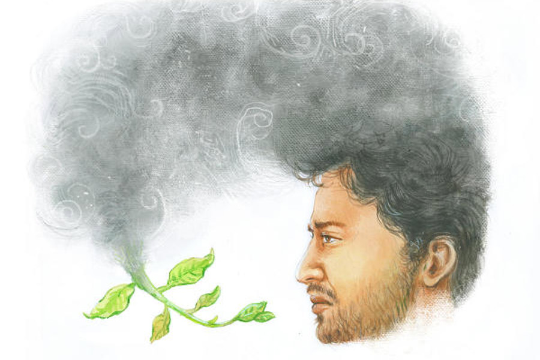

 
 <h1 align=center>যাওয়া তো নয় যাওয়া</h1>
<h2 align=center>জয়দীপ চক্রবর্তী</h2> নার্সিংহোম থেকে প্রথম ফোনটা এসেছিল রাত দুটো নাগাদ। বাবার শারীরিক অবস্থার অবনতি হতে শুরু করেছে তখন। দ্বিতীয় ফোন এল ভোর পাঁচটায়। রাতের ডিউটিতে থাকা রেসিডেনশিয়াল মেডিক্যাল অফিসার আবেগহীন ভরাট গলায় বললেন, “পেশেন্টের বি পি দ্রুত ফল করছে। ভেন্টিলেশনে থাকা সত্ত্বেও অক্সিজেন স্যাচুরেশন এই মুহূর্তে সত্তরের নীচে। যে হেতু নার্সিংহোমের কাছেই থাকেন, তাই বলছি, বাবাকে দেখতে চাইলে যত দ্রুত সম্ভব চলে আসুন...”

বুঝতে পারলাম, বাবা চলে যাচ্ছেন। হয়তো চলেই গেছেন এত ক্ষণে। কাল বিকেলে গিয়েছিলাম যখন, তখনও চোখ মেলে চাইলেন। দুর্বল হাত দিয়ে আমার ডান হাতটা আঁকড়ে ধরার চেষ্টা করলেন। কিছু একটা বলতে চাইছিলেন বোধহয়। কিন্তু মুখে নল, নাকে রাইলস টিউব, কথা বলার উপায় ছিল না তাঁর। আমার উদ্দেশে বাবার শেষ বার্তাটুকু অব্যক্তই থেকে গেল। মানুষ যখন একেবারে চলে যায়, সঙ্গে কত না-বলা কথাও নিয়ে যায়।

বাবা এখনও আছেন হয়তো, তবু দু’চোখ ঝাপসা হয়ে গেল আমার।

আমার দিকে তাকিয়ে স্বাতী বোধহয় কী ঘটেছে বুঝতে পেরেছিল। আমাকে তাড়া দিয়ে সে বলল, “অমন জবুথবু হয়ে দাঁড়িয়ে রইলে কেন? কার ফোন? নার্সিংহোম থেকে?”

“হ্যাঁ,” কোনও ক্রমে বললাম।

“শেষ?”

“বোধহয়,” বলতে আমার গলা কেঁপে গেল।

“বোধহয় আবার কী?” স্বাতী বিরক্ত হয়ে বলে, “তোমার সঙ্গেই তো কথা হল এক্ষুনি। কী বলল?”

“কন্ডিশন খুবই ক্রিটিক্যাল। যেতে বলছে...”

“চলো, আমিও যাব,” বলেই দ্রুত তৈরি হতে শুরু করল স্বাতী।

আমি মৃদু গলায় বললাম, “তোমার যাওয়ার কী দরকার? আমি তো যাচ্ছিই...”

“এখনই যা নার্ভাস দেখছি তোমাকে, ঈশ্বর না করুন, গিয়ে তেমন কিছু দেখলে তুমি তো ওখানে ভিরমি খেয়ে পড়েই যাবে।”

আমি আর আপত্তি করিনি। জানি, আপত্তি করলেও স্বাতী শুনবে না।

আমরা যখন পৌঁছলাম তখন ভোর সাড়ে পাঁচটা। সূর্য ওঠেনি, কিন্তু আকাশে আলগা আলো। আমাদের এই মফস্‌সলে এখনও বেশ কিছু গাছপালা রয়ে গেছে। সেই সব গাছের ডালে বসে ঘুম থেকে জেগে ওঠা পাখিরা কিচিরমিচির করে ডাকছে। আমার বুকের মধ্যে চাপ-চাপ শূন্যতা। একটা নতুন ভোরের জন্ম হচ্ছে। কত নতুন দৃশ্য, নতুন শব্দের জন্ম হবে আবারও। অথচ ঠিক এই সময়েই এক জন মানুষ, যে মানুষটাকে আমি বাবা বলে ডেকে এসেছি জ্ঞান হওয়া ইস্তক, নিঃশব্দে পৃথিবী ছেড়ে চলে যাচ্ছেন। এ পৃথিবীর কোনও শব্দ, কোনও গন্ধ-বর্ণে আর অধিকার থাকবে না তাঁর।

স্বাতী আমার হাতে চাপ দিল, “দাঁড়িয়ে পড়লে কেন, চলো...”

মূল দরজা দিয়ে ঢুকে লম্বা করিডর। তার শেষ প্রান্তে সিঁড়ি। আমাদের দোতলায় যেতে হবে। নার্সিংহোমের এক জন কর্মী নীচে দাঁড়িয়ে ছিলেন। আমরা মূল দরজা ঠেলে ভিতরে ঢুকতেই চাপা গলায় বললেন, “ওপরে চলে যান। ডাক্তারবাবু আছেন ওখানে।”

আমরা বাইরে জুতো খুলে রেখে আইসিসিইউ-এর কাচের দরজা ঠেলে ভিতরে ঢুকলাম। কাল যেমন দেখেছিলাম, বাবা তেমনই চিত হয়ে শুয়ে আছেন। চোখ বোজা। সাঁই-সাঁই শব্দে অক্সিজেন ঢুকছে মুখের মোটা নল দিয়ে। নির্দিষ্ট ছন্দে। বাবার বুক ওঠানামা করছে কি? বুঝতে পারলাম না। স্বাতী বাবার মাথার উপরের দেওয়ালে লাগানো মনিটরের দিকে তাকিয়ে আছে চুপ করে।

ডাক্তার বললেন, “আপনাদের সামনে আমরা পেশেন্টের একটা ইসিজি করব। কার্ডিয়োগ্রাফ ফ্ল্যাট এলে ওই সময়টাই অফিশিয়াল টাইম অব ডেথ হিসেবে অ্যানাউন্স করব...”

স্বাতী আমার হাতটাকে শক্ত করে চেপে ধরল।

স্বাতী ভেবেছিল, আমি বাবার মৃত্যুর মুখোমুখি দাঁড়াতে পারব না। অথচ সেই আমি দিব্যি অবিচল আছি। সকাল থেকে এখনও পর্যন্ত যাবতীয় কর্তব্য পালন করছি ঠান্ডা মাথায়। কোন কোন আত্মীয়কে ফোন করব, প্রতিবেশীদের মধ্যে কাদের খবর দিতে হবে, ‘স্বর্গরথ’ কার থেকে নেব, কখন আসতে বলব, সব ব্যবস্থা করেছি নিখুঁত ভাবে। এই সময় নানা মানুষ নানা রকম কথা বলে বিভ্রান্ত করে দেয়। আজও আমার গ্রামের বাড়ি থেকে আসা কয়েকজন জ্ঞাতি হরিনাম গাওয়ার দল বায়না করার জন্য ঘ্যানঘ্যান করছিল। স্বাতী আমার দিকে অসহায় চোখে তাকিয়ে ছিল। কিছু বলতে পারছিল না।

আমি বাবাকে নার্সিংহোম থেকে বাড়িতে এনে তাঁর ঘরের বিছানায় শুইয়ে দিয়ে গম্ভীর গলায় স্বাতীকে নির্দেশ দিলাম, “হরিনাম চলবে না। বাবা ও সব পছন্দ করতেন না কস্মিনকালে। তাঁর প্রিয় রবীন্দ্রসঙ্গীত বাজাও ব্লু টুথ স্পিকারে।’

স্বাতী মৃদু ভলিউমে চালিয়ে দিল, ‘সমুখে শান্তি পারাবার...’

বাবা বিছানায় চিত হয়ে শুয়ে। চোখ বোজা। আমি জানি, তিনি নিবিষ্টচিত্তে সে গান শুনছিলেন। অনেকে এসে বাবার শরীরে গোলাপ ছাড়া শুধুই সাদা ধপধপে রজনীগন্ধার মালা পরাচ্ছিল। ঘরে ধূপ জ্বলছে। ফুল আর ধূপ মিলেমিশে অদ্ভুত গন্ধ ঘরময়। সেই গন্ধে আমি বাবার শরীরের চেনা গন্ধটা পাচ্ছিলাম না। আমার অস্বস্তি হচ্ছিল। স্বাতী আমার পাশে ছিল। বাবার শরীরে মালার স্তূপ বাড়ছে দেখে আমার একটা কবিতার কথা মনে পড়ল। আরও অনেক কবিতার মতো বাবা এই কবিতাটাও প্রায়ই আবৃত্তি করতেন। সুভাষ মুখোপাধ্যায়ের কবিতা। কবিতার নাম ‘পাথরের ফুল’। মানিক বন্দ্যোপাধ্যায়ের মৃত্যুর পর লিখেছিলেন। চমকে উঠে চাপা গলায় বললাম, “ফুলগুলো সরিয়ে দাও স্বাতী। বাবার লাগছে...”

আমার বন্ধু কৌশিক এসে কাঁধে হাত রাখল। নরম গলায় বলল, “স্বর্গরথ এসে গেছে। এ বার বডি বের করতে হবে।”

আমি সঙ্গে সঙ্গে প্রতিবাদ করে উঠলাম, “বডি নয়, বাবা।”

বাবা এখনও শুয়ে আছেন। একই রকম চিত হয়ে। একটাই স্বস্তি, তাঁর শরীরে এখন আর ফুলের ভার নেই। ঠাকুরমশাই বলেছেন শরীর থেকে সব মালা, সব ফুল সরিয়ে নিতে। আমার এক বয়স্ক প্রতিবেশী কাছে সরে এসে নিচু গলায় বললেন, “একটু কাঁদো। বাবার অন্তিমযাত্রায় একটু চোখের জল ফেলা ভাল। তাতে তাঁর পক্ষে যাওয়ার পথটি সুগম হয়।”

আমি উল্টো কথা জানতাম। সে কথা খানিক আগেই এক জন বলছিলেনও আমাকে। প্রিয়জন চলে যাওয়ার সময় কান্নাকাটি করতে নেই। তাতে তাঁদের এই মরলোক পেরিয়ে যেতে কষ্ট হয়।

আমি তর্কে না গিয়ে শুধু বললাম, “আমার কান্না পাচ্ছে না কাকু।”

তিনি একটু অবাক হয়ে জিজ্ঞেস করলেন, “বাবার জন্যে তোমার শোক নেই মনে?”

কী যে বলি এ কথার উত্তরে! সব শোক, সব শূন্যতার কি বহিঃপ্রকাশ থাকে!

তিনি আমার পিঠে হাত রেখে বললেন, “জানি হে বাপু। অতিরিক্ত শোক মানুষকে পাথর করে দেয়। তবে কি জানো, তোমার বাবা তো বয়সে গেলেন। সাতাশি বছর তো কম নয়। ক’জন আর এই আয়ু পায়! তোমরা মনে মনে হয়তো তৈরিই ছিলে। আমি বাবাকে হারিয়েছিলাম, তখন আমি হার্ডলি বাইশকি তেইশ। ভাল করে নিজের পায়ে দাঁড়াতেইপারিনি তখন...”

আমি উত্তর দিলাম না। বুঝতে পারছিলাম না তিনি আমাকে সান্ত্বনা দিচ্ছেন না কি আমার শোককে লঘু করে দেখানোর চেষ্টা করছেন। তা না হলে শেষের কথাটি কেন উল্লেখ করলেন তিনি এই সময়ে?

দীর্ঘ ঘণ্টাধ্বনি জানান দিল, আগের শবটির দাহ সম্পূর্ণ হয়েছে। পুরোহিতমশাই ডাক দিলেন আমাকে, “আসুন। এ বার ওঁকে শেষযাত্রার জন্যে তৈরি করে দিতে হবে। আপনার কাজগুলো করে ফেলুন ঝটপট।”

পিণ্ডপূজা ও পিণ্ডদান সমাপ্ত হল। আগুন হাতে বাবাকে প্রদক্ষিণ করছি। শ্মশানযাত্রীরা ঘিরে আছে আমাকে। কেউ কেউ এই সময়েও নানা নির্দেশ দিয়ে চলেছে আমাকে। সব কথা কানে ঢুকছে না আমার। শ্মশানের পুরোহিতমশাই অভ্যস্ত পেশাদারিত্বে মন্ত্রোচ্চারণ করছেন, “ওঁ কৃত্বা তু দুষ্কৃতং কর্ম জানতা বাপ্যজানতা। মৃত্যুকালবশং প্রাপ্য নরং পঞ্চত্বমাগতম্‌॥ ধর্মাধর্মসমাযুক্তং লোভমোহসমাবৃতম্‌। দহেয়ং সর্বগাত্রাণি দিব্যান্‌ লোকান্‌স গচ্ছতু॥”

বাবাকে ট্রলিতে চাপিয়ে দিলাম এ বার। বৈদ্যুতিক চুল্লির মুখ খুলে গেছে। ক্ষুধার্ত আগুন অপেক্ষায় রয়েছে বাবার শরীরকে গ্রাস করে নেওয়ার জন্যে। চুল্লির পাশের হাতলে চাপ দিল শেষ কাজের কর্মীটি। বাবা ঢুকে পড়লেন অগ্নিগহ্বরের মধ্যে। গনগনে লাল আগুন লাফিয়ে উঠে তাঁকে গিলে ফেলতে না ফেলতেই চুল্লির দরজা বন্ধ হয়ে গেল। বুকের মধ্যে অদ্ভুত মোচড় দিয়ে উঠল। ‘বাবা’ ডাকটাই চিরকালের মতো হারিয়ে গেল আমার জীবন থেকে। বাবা একটা বিশেষ নামে ডাকতেন আমাকে। সে নামটাও ভস্মীভূত হয়ে গেল এই শ্মশানভূমিতে। প্রয়োজন ছিল না, তবু কে এক জন যেন পিছন থেকে জড়িয়ে নিল আমাকে। হাত ধরে নিয়ে গিয়ে বসাল দূরে গাছের নীচে, বাঁধানো বেদিতে।

আমাদের পাড়ার নবগোপালদা এসে কাঁধে হালকা চাপড় মারল, “এখনও পাক্কা চল্লিশ-পঁয়তাল্লিশ মিনিটের মামলা। ফালতু বসে থেকে কী করবে? চলো চা খেয়ে আসি।”

“তোমরা যাও। আমার ভাল লাগছে না,” মাথা ঝাঁকিয়ে বললাম। আমার জীবনের সবচেয়ে প্রিয় মানুষদের এক জন তুমুল উত্তাপে পুড়ে ছাই হয়ে যাচ্ছেন। এত দিন সম্ভ্রমে, যত্নে, ভালবাসায় আগলে রেখেছিলাম তাঁকে। তারও আগে আরও যত্নে তিনি আগলে রেখেছিলেন আমায়। মাত্র চল্লিশ মিনিট। তার মধ্যেই কয়েক টুকরো অস্থি আর এক খণ্ড মাংসপিণ্ডে পরিণত হয়ে যাবেন তিনি। এর মধ্যেও খিদে পায় আমাদের? এটুকু সময়ও তাঁকে দিতে পারি না আমরা? এতটাই অতিরিক্ত হয়ে গেলেন তিনি কয়েক ঘণ্টার মধ্যে? 

নবগোপালদা আবার বলল, “একটু কিছু মুখে দাও। শরীর খারাপ করবে খালি পেটে থাকলে...”

“নাহ্,” বলে মূলত নবদাকে এড়াতেই গাছতলা থেকে উঠে পড়ি আমি। হেঁটে হেঁটে গঙ্গার দিকে চলে আসি। এই আদিগঙ্গায় আগে জাহাজ চলত। বাণিজ্যে যেত সওদাগরেরা। এখন সেই গঙ্গা গতায়ুপ্রায়। জোয়ার-ভাটা খেলে না। কালচে স্থির জল। সেই জলেই মানুষের না-পোড়া নাভি আর অস্থি ভাসিয়ে যায় শবযাত্রীর দল। আমিও ভাসাব আর একটু পরে।

পিছন থেকে চাপা গলায় আমাকে নাম ধরে এক জন ডাকতে সংবিৎ ফিরল। আমাদের গ্রাম থেকে আসা কানুদা। আমি শান্ত চোখে তাকিয়ে বললাম, “বলো।”

“ভাই, গাঁ থেকে দু’-চার জন এসেছে। ওরা ঘ্যানঘ্যান করছে অনেক ক্ষণ থেকে। ওদের হাতে কিছু শোকভুলানি দাও...”

“মানে?” আমি অবাক হয়ে বলি।

“প্রিয়জন চলে গেল তো। শোক ভুলতে একটু নেশাভাঙ করবে। কিছু টাকা দিয়ে দাও...”

“একদম নয়, খবরদার!” বিরক্তিতে প্রায় চেঁচিয়েই উঠলাম আমি, “ও সব বেলেল্লাপনা আমার বাবার শেষ কাজে কিছুতেই হতে দেব না। তাঁর জন্যে শোক? কোনও শোক নেই ওদের। চোলাই গিলে শোক ভোলাও যায় না কখনও।”

“তা হয়তো যায় না। তবু গ্রামে মড়া পোড়াতে গেলে এ সব একটু হয়েই থাকে গো। মানে পুরনো প্রথা আর কী...”

“আমি এ প্রথায় বিশ্বাস করি না,” কানুদার মুখে মড়া শব্দটা শুনে গা জ্বলছিল। কেমন যেন অভক্তি মেশানো ছিল শব্দটায়। আমি কড়া গলায় বললাম, “তুমি এখন যাও কানুদা। আমাকে একা থাকতে দাও কিছু ক্ষণ।”

চল্লিশ মিনিটেই শেষ হল সব কাজ। তার পর অস্থি ভাসানো। বুকটা ভারী হয়ে আছে। মনের মধ্যে খাঁ-খাঁ শূন্যতা। আমার বাবা চলে গেলেন চিরকালের জন্যে। কৌশিক পাশে ছিল প্রায় সারা ক্ষণ। এ বার নরম গলায় বলল, “চল, ফিরি।”

“চল, ফিরি,” কথাটা শুনে যেন শিউরে উঠলাম। আনমনে বললাম, “হ্যাঁ, ফিরি চল।”

ফিরে যাওয়াই আমাদের নিয়তি। চাই বা না চাই, আমাদের সকলকে ফিরে যেতে হয়, ভাবতে ভাবতেই শ্মশানের বাইরে এসে দাঁড়ালাম। এ দিকটা এখনও তেমন ঘিঞ্জি হয়ে ওঠেনি। ফাঁকা মাঠ, গাছপালা। বসন্তের মাঝামাঝি এখন। দক্ষিণ দিক থেকে ফুরফুর করে হাওয়া দিচ্ছিল। সামনে একটা বুনো ঝোপ। সে ঝোপের মাথায় মাথায় থোকা থোকা নাম না-জানা ফুল ফুটে আছে। মিষ্টি একটা গন্ধ ভেসে আসছে নাকে। প্রজাপতি উড়ছে সেই ফুলের গুছিগুলোর উপরে। বড় গাছগুলোর শাখায় শাখায় নতুন পাতাদের সমারোহ। আমি থমকে দাঁড়িয়ে পড়লাম। বাবা কি সত্যিই নেই? এ পৃথিবীতে সত্যিই কি একেবারে হারিয়ে যায় কোনও কিছু?

কৌশিক বলল, “কী হল, দাঁড়িয়ে পড়লি কেন?”

আমি তত ক্ষণে গাছেদের থেকে চোখ ফিরিয়েছি আমার বাঁ দিকে। খানিক তফাতে একটা প্রাইমারি স্কুল। এখন বোধহয় টিফিন ব্রেকের সময়। ফুলেরই মতো স্নিগ্ধ-সুন্দর এক ঝাঁক ছেলেমেয়ে ঘর থেকে বাইরের মাঠে বেরিয়ে এসে হুটোপাটি করছে, খিলখিল করে হাসছে...

কৌশিক আবার জিজ্ঞেস করল, “কী হল?”

আমার মনের মধ্যে জমাট বেঁধে থাকা মেঘ কেটে যাচ্ছে। খিদে পাচ্ছে। এ দিক-ও দিক তাকিয়ে কানুদাকে খুঁজে পেলাম না। নবগোপালদাও এগিয়ে গেছে। পাশের দোকানের দিকে এগোতে এগোতে কৌশিককে বললাম, “আয়, ফিরে যাওয়ার আগে ওই ঝুপড়ি দোকানের নড়বড়ে বেঞ্চে বসে এক কাপ করে চা খেয়ে যাই।”

“এখন চা খাবি?” কৌশিক অবাক হয়ে তাকিয়ে রইল আমার দিকে।

আমি মৃদু হাসলাম, “আয় না, ইচ্ছে করছে খেতে।”

ওকে বললাম না, ফুলের কুঁড়ির মতো ওই ছেলেমেয়েদের দৌড় আরও কিছু ক্ষণ দেখতে চাইছি আমি, আর ওই রংবেরঙের প্রজাপতিদের উড়ান। বললাম না, মৃত্যু সবচেয়ে বড় সত্যি আমি জানি। কিন্তু তার চেয়েও বেশি সত্যি, সেই মৃত্যুকে অতিক্রম করে গাছেদের মাথায় মাথায় সবজেটে লাল রঙের নরম নরম নতুন পাতাগুলোর জেগে ওঠা।