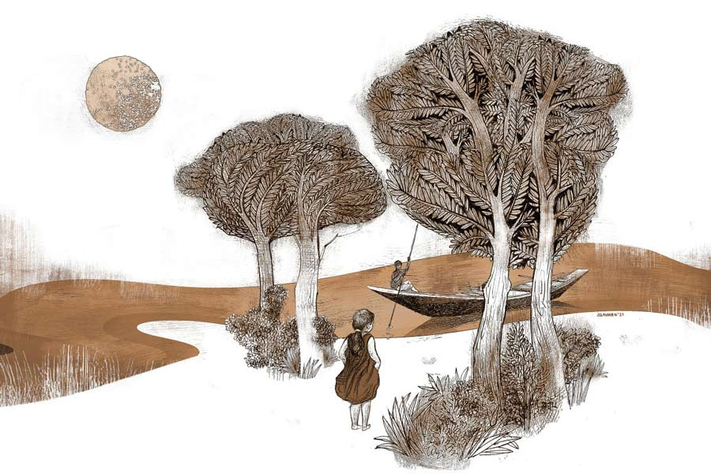

 
 <h1 align=center>যাদবগড়ের লক্ষ্মীলাভ</h1>
<h2 align=center>শেখর মুখোপাধ্যায়</h2> 

পুরাকাল থেকেই যাদবগড়ের বারো আনা ঘিরে বয়ে চলেছে বিহালা, গঙ্গার একশাখানদী। সারা বছরই জল থাকে। সে কালে কর্তারা নদীর দু’দিক থেকে বাকি চার আনায় খাল কেটে গড়ের চার পাশে পরিখা সম্পূর্ণ করেছিলেন। সেই থেকে যাদবগড়ের মানুষজনের জন্য নৌকার ব্যবহার অপরিহার্য হয়ে উঠল।মোগল আমলে গড়ের মালিকরা নবাবের দরবার থেকে উপাধি পেলেন ‘রায়’। কোম্পানির শাসনকালে তাঁদের অবস্থা পড়ে যায়। অপরিণামদর্শী জমিদারদের অমিতব্যয়ী আচরণে কোষাগার ফাঁকা হতে থাকে। খাজনা অনাদায়ে ভূসম্পত্তি খণ্ডশ নিলামে উঠতে শুরু করে। এ সবের বেশিটাই কিনে নিয়ে তাঁদের নায়েবরা বনে যান নতুন জমিদার, কোম্পানির সুপারিশে বাদশাহের কাছ থেকে উপাধি পান ‘চৌধুরী’, বিহালার অপর পাড়ে নতুন বসতবাটি নির্মাণ করে জায়গাটার নাম রাখেন লক্ষ্মীপুর। স্থানীয়রা যাদবগড়ে রায়দের নদী-ঘেরা প্রাসাদকে বলত বড় রাজবাড়ি, লক্ষ্মীপুরে চৌধুরীদের অট্টালিকাকে ছোট রাজবাড়ি।

তার পর দেশ এক সময় স্বাধীন হল, জমিদারি প্রথাও লুপ্ত। অধুনা জঙ্গলে ভরা যাদবগড়ের ভাঙা রাজবাড়িতে বহু জীবজন্তুর সঙ্গেই বাস করে তিনটি মানুষ— মাধব রায়, তার স্ত্রী মালতী আর তাদের একমাত্র সন্তান সন্দীপ। অনেকেই বলে ওদের মধ্যে বুনো বুনো ভাব প্রকট। সন্দীপের বয়স সাতাশ, সে বিশ্ববিদ্যালয়ে প্রাণিবিদ্যার গবেষক-ছাত্র।

পর্যটকেরা এলাকা ঘুরতে এসে রাজবাড়ি বলতে লক্ষ্মীপুরে চৌধুরীদের বাড়িটাই দেখে। বড় রাজবাড়ি দেখা হয়ে ওঠে না। এক তো নদী পেরোতে হবে, সব সময় নৌকা পাওয়া যায় না। তার উপর লোকে ভয় দেখায়, যাদবগড়ের জঙ্গলে দেড়শো প্রজাতির সাপের বাস। সন্দীপ সব শুনে হাসে, দেড়শো প্রজাতি বাড়াবাড়ি রটনা, বড়জোর পনেরো-ষোলো রকমের সাপ দেখা যায় এখানে।

চৌধুরীবাড়ির মেয়ে সুমনা বিশ্ববিদ্যালয়ে স্নাতকোত্তর ছাত্রী। চোদ্দো বছর আগে, তার তখন বয়স ন’বছর, নদীর পাড় থেকে ডাক দিয়েছিল, “মাঝি, ও মাঝি, আমাকে নৌকায় নেবে?”

রায়দের দু’চাকা সাইকেল, মোটর সাইকেল নেই, চারচাকার প্রশ্নই ওঠে না। পারিবারিক সম্পত্তি গুটিদুই ডিঙিনৌকা অবশ্য আছে। তারই একটি নিয়ে নদীতে ভাসতে ভাসতে সুমনার ডাক শুনেছিল তেরো বছরের সন্দীপ। নাও ভিড়িয়েছিল বিহালার লক্ষ্মীপুর তটবর্তী পাড়ে। বালিকা নৌকাবিহার করেছিল মনের সুখে। আজ সবাই জানে ওরা প্রেম করে। ব্যাপার-স্যাপার প্রবীরের পছন্দ নয়। স্ত্রী মনোরমাকে প্রায়ই বলে, “আমার হাতে এত সব ভাল ভাল পাত্র ছিল! কেন যে মেয়েটা তবু …”

মনোরমা বোঝায়, “সন্দীপও খারাপ নয়! ইস্কুল, কলেজে মাস্টারি তো পাবেই।”

“মাস্টার! দূর! ইঞ্জিনিয়ার, ডাক্তার, কোটিপতি ব্যবসাদার, আইএএস, আইপিএস ছেড়ে মাস্টার!”

“আহা, ছেলেটা লেখাপড়ায় ভাল,” মনোরমা যুক্তি দেয়, “মেয়ে বলে, ওর গবেষণার সঙ্গে বিদেশের কোন এক রিসার্চ সেন্টারের ঘনিষ্ঠ যোগ আছে।”

“সব বাজে কথা! ওরা হল কুয়োর ব্যাঙ। নইলে, আজকের দিনে ত্রিশ-পঁয়ত্রিশ বিঘে জমি কেউ অকারণে পতিত ফেলে রাখে!”

“পতিত কেন হবে!” মনোরমা বোঝায়, “মেয়ে তো বলে, ওই জমিটা পুরোটাই নাকি সন্দীপের ওপেন এয়ার ল্যাবরেটরি। গবেষণার কাজে লাগে।”

“সব বনমানুষের কারবার!” প্রবীর ভেংচায়, “ওপেন এয়ার ল্যাবরেটরি!”

মাস ছয় পরে খবর আসে, সন্দীপকে গবেষণার কাজে ইটালি যেতে হবে। বিয়েটা তার আগে সেরে নিতে চায়। সন্ধেয় মাধব আসে প্রস্তাব নিয়ে। তার পিছনে উড়ে আসে দু’টি সাদা পেঁচা। মাধব নির্দিষ্ট চেয়ারে বসে, পেঁচাদুটি বসে চৌধুরীবাড়ির সদর দরজার মাথায়। প্রবীর জিজ্ঞেস করে, “ও’দুটো কি লক্ষ্মীপেঁচা?”

মাধব মাথা দোলায়, “হ্যাঁ।”

“কোথায় পেলে?”

“আমাদের বাড়িতেই থাকে।”

“রায়বাড়িতে? যাদবগড়ে?”

“হ্যাঁ।”

“কত দিন হল এমন থাকছে?”

“তা, দু’-তিন বছর হল।”

“হঠাৎ করে তোমাদের বাড়ি থাকতে এল কেন? মানে...” প্রবীর বুঝিয়ে বলে, “রায়বাড়িতে লক্ষ্মীশ্রী বলে কিছুই তো নেই। আসা উচিত ছিল আমাদের এই চৌধুরীবাড়িতে।”

“ছেলে বলে আমরা যেমন, এই পেঁচা-টেঁচাগুলোও তেমনই ওপেন এয়ার ল্যাবরেটরির বাসিন্দা, সবাই মিলেমিশে থাকি। তবে...” মাধব গলা নামিয়ে বলে, “ও সব কথা নয়। তুমি ঠিকই বলেছ, লক্ষ্মীর ঠাঁই চৌধুরীবাড়িতে, তাই আমি এখানে আসছি জেনেই মনে হয় ওরা আমার পিছন-পিছন এখানে চলে এল।”

প্রবীরকে এ বার বেশ খুশি খুশি দেখায়। সে মেয়েকে সন্দীপের হাতে সম্প্রদান করতে রাজি হয়ে যায়। মনোরমাকে একান্তে জানায়, “বুঝলে, এ দৈব লক্ষণ ছাড়া কিছু নয়। মেয়ে-জামাইয়ের লক্ষ্মীলাভ সুনিশ্চিত। নইলে কখনও লক্ষ্মীর বাহন নিজে ঘটক হয়ে আসে!”

“নিশ্চয়ই!” মনোরমা স্বামীর বক্তব্যে জোরালো সমর্থন জানায়, “লক্ষ্মীর বাহন বলে কথা!”

সব ঠিক হওয়ার পর, যথানির্দিষ্ট দিনে বিয়ে করে বৌ নিয়ে নদী পেরিয়ে যাদবগড় চলে যায় সন্দীপ।

রাতে কিছুতেই ঘুম আসে না প্রবীরের। মনোরমা বোঝায়, “এমন উচাটন কেন! মেয়ে তো নদীর ও পারেই আছে।”

“ভুল হল না তো!” প্রবীর বিছানা ছাড়ে। সিঁড়ি ভেঙে আসে ছাতে। লক্ষ্মীপুরে চৌধুরীবাড়ির আকাশে গোল চাঁদ। চারপাশ ভাসছে মায়াবী জ্যোৎস্নায়। কার্নিশে বসে আছে দু’টি সাদা পেঁচা।

বুকে বল পায় প্রবীর। “দোহাই!” দু’হাত জোড় করে তাদের দিকে এগোয়। পেঁচাদুটি ডানা মেলে কার্নিশ ছাড়ে। নিঃশব্দে উড়ে যায় আকাশে।

যাদবগড়ে নতুন বর-বৌ রাতের গভীরে ঘর থেকে বেরোয়। গুটিকয় পাখি কিচিরমিচির করে ওঠে। মালতী ঘুমের মধ্যে বলে, “কে! কী!”

মাধব হাত বাড়িয়ে ভাঙা জানলা একটু ফাঁক করেই বন্ধ করে। পাশ ফিরে জানায়, “লক্ষ্মী-নারায়ণ, বৈকুণ্ঠবিহারে বেরোলেন।”

নবদম্পতি বিহালার পাড়ে এসে নৌকায় ওঠে। পাড়ে বাঁধা খুঁটি থেকে দড়ি খুলে নেয়। নৌকা ভাসে ঢেউয়ের তালে। চাঁদনি রাতে খোলা আকাশের নীচে নদীর বুকে নামে ফুলশয্যার রাতের ঘোর।

