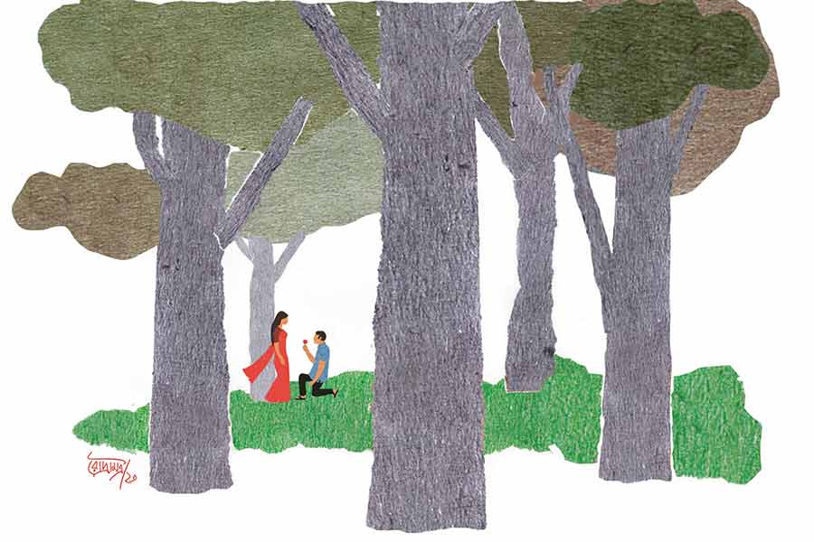

 
 <h1 align=center>যুক্তি তর্ক প্রেম</h1>
<h2 align=center>চিন্ময় বসু</h2> মেয়েটা হেঁটে যাচ্ছিল পার্কের পাশ দিয়ে, হঠাৎ ছেলেটার ডাকে থেমে দাঁড়াল। এ দিকটা একটু নির্জন।

“এক মিনিট একটু শুনবেন?”

মেয়েটি ঘুরে জিজ্ঞেস করল, “আমাকে বলছেন?”

“হ্যাঁ। যদি রাগ না করেন, একটা কথা বলব?”

মেয়েটা অবাক হয়ে তাকিয়ে থাকে, বলে, “আপনাকে চিনতে পারলাম না তো! কী বলতে চান?”

“আমার বন্ধুদের সঙ্গে কথা হয়েছে, আমি যদি আপনাকে প্রোপোজ় করি, তা হলে বন্ধুরা চাঁদা তুলে আমাকে ফাইভ-স্টার হোটেলে খাওয়াবে। আমি তাই আপনাকে প্রোপোজ় করতে চাই।”

অবাক হয়ে চুপ করে থাকে মেয়েটা। কী যেন ভাবে, আবার ছেলেটাকে ভাল করে দেখে, তার পর বলে, “কী ভাবে করবেন? গোলাপ হাতে নিয়ে হাঁটু গেড়ে বসে?”

“না না, সে রকম কিছু নয়। সামনে দাঁড়িয়ে বলার সময় একটা অডিয়ো তুলে নিলেই হবে।”

ছেলেটিকে খারাপ লাগে না মেয়েটির। আশ্চর্য এক সারল্য আছে। ভণিতাহীন, অকপট। সে খুব সিরিয়াস ভঙ্গিতে বলে, “কিন্তু, আমি যদি আপনার প্রস্তাবটা গ্রহণ করে নিই? তা হলে কী করবেন?”

ছেলেটা একটু ঘাবড়ে যায়, “গ্রহণ করবেন মানে কী?”

“আপনি আমাকে বিয়ের প্রস্তাব দেবেন তো? তাকেই তো প্রোপোজ় করা বলে। সেটা তো আমি অ্যাকসেপ্ট করতেই পারি।”

ছেলেটি প্রথমে অবাক হয়, তার পর বোঝাতে চেষ্টা করে, “তা ঠিক। তবে আপনি সেটা করবেন কেন? এ রকম করলে মেয়েরা রেগে যায়, খারাপ কথা বলে। খুব স্পোর্টিং বা স্মার্ট হলে, ও সব না করে, ‘না, আপনার প্রস্তাব মানা সম্ভব নয়’ এমন একটা কিছু বলে চলে যায়।”

“দেখুন, আমি স্পোর্টিং নই, স্মার্টও নই। আমার রাগ হচ্ছে না। আপনি যথেষ্ট ভদ্র ভাবে একটা প্রস্তাব আমায় দিয়েছেন, গ্রহণ করা-না করাটা আমার ওপর। তাই না?”

“তার মানেটা কী? আপনি গ্রহণ করবেন মানে, আপনি আমাকে বিয়ে করতে চাইবেন।”

“না, উল্টো বললেন। আপনি আমায় বিয়ে করবেন বলে প্রস্তাব করার অনুমতি চেয়েছেন, আমি রাজি হয়েছি। এর পর আপনি আমায় প্রোপোজ় করবেন। আমি আগে থেকেই জানিয়ে রাখলাম, আমি সেটা গ্রহণ করব। যদি ভয় করে, পালান। এখনও সময় আছে। তবে ফাইভ-স্টারে ফ্রি লাঞ্চটা আর হবে না।”

ছেলেটি হাঁ করে তাকিয়ে থাকে। কী বলবে বুঝতে পারে না।

মেয়েটি আবার বলে, “যদি এখনই প্রোপোজ় করতে চান, আমি রাজি। আর যদি সময় চান সাহস সঞ্চয় করতে, কাল দুপুর বারোটা পর্যন্ত সময়। কাল বলতে পারেন, এই জায়গায়, এই সময়। তার পর আপনি প্রোপোজ় করতে গেলে আমি চেঁচামেচি করব, পুলিশেও অভিযোগ করতে পারি, আমাকে বার বার বিয়ের প্রোপোজ়াল দিয়ে বিরক্ত করার জন্য। বিপদে পড়ে যাবেন।”

“আপনি তো ডেঞ্জারাস মহিলা!”

“আর একটা কথা, আমি হাই কোর্টে প্র্যাকটিস করি।”

“এমন ঝামেলায় পড়ে যাব ভাবিনি। প্রথমে ভেবেছিলাম, আপনি ইগনোর করবেন। আমারও নির্ঝঞ্ঝাটে ফাইভ-স্টারে খাওয়া হয়ে যাবে। এখন তো দেখছি মুশকিল। থাক তা হলে।”

“কাল পর্যন্ত সময় আছে কিন্তু। আপনাকে আমার ভাল লেগেছে। বিয়েতে অরাজি হতাম না।”

“আচ্ছা, কালই দেখা হবে।”

ছেলেটা বন্ধুদের কাছে ফেরে না। বাড়ি চলে যায়।

নব্বইয়ের দশকে পার্ক স্ট্রিটের কাফেতে জিনস-টিশার্ট ও আরও সব অত্যাধুনিক পোশাক পরা মেয়েদের ভিড়ে শাড়ি-পরা মেয়েটাকে সব বন্ধুদেরই চোখে পড়ে। অনিমেষকে একটু বেশিই উতলা হতে দেখে, বন্ধুরা সবাই মিলে বাজিটা ধরেছিল, “এত পছন্দ যখন, প্রোপোজ় করলে বড় হোটেলে খানা।”

বাড়ি ফিরে মা’র কাছে গিয়ে অনিমেষ বলে, “মা পাত্রী পছন্দ হয়ে গেছে। দিনক্ষণ দেখো।”

মা হাতজোড় করে ঠাকুরকে নমস্কার করেন। তিন বছর ধরে পিছনে লেগে আছেন, ছেলে রাজি নয়। ভাল চাকরি করে, অফিসের বন্ধুরাও বাড়িতে এসে বলে। কিন্তু ‘সামনের বছরই করে ফেলব’ বলে কথা ঘোরায়।

বাবা খবর পেয়ে বই নামিয়ে রেখে এসে জানতে চাইলেন, “বাঙালি মেয়ে? তোর চেনা তো?”

“হ্যাঁ বাঙালি। আগে চিনতাম না, আজ চিনলাম।”

“ব্যস! এইটুকুই? আর কিছু জানার দরকার নেই?”

“বেশি জেনে কী লাভ বাবা? মনে হল, মেয়েটার উপর ভরসা করা যায়। ওই যথেষ্ট।”

“দেখতে কেমন রে?” মা শুধান।

“আমার তো ভালই লেগেছে।”

পরের দিন অনিমেষ সত্যিই গোলাপ হাতে নিয়ে অপেক্ষা করছিল। পার্কের পাশে ওই জায়গাতেই। সে দিনও লোক নেই, নিরালা। বারোটার সময় জায়গাটা ও রকমই থাকে। মেয়েটাকে হেঁটে হেঁটে আসতে দেখল। দেখল, আজ মেয়েটা খুব সুন্দর করে সেজেছে। এত বেশি সুন্দর লাগছিল, সম্মোহিতের মতো অনিমেষ দেখছিল মেয়েটাকে। সামনে এসে দাঁড়িয়ে মেয়েটা বলল, “অমন হাঁ করে তাকিয়ে দেখছেন কী? প্রোপোজ় করবেন না?”

এ দিক-ও দিক তাকিয়ে দেখে নেয় অনিমেষ, তার পর হাঁটু গেড়ে বসে পড়ে। গোলাপটা তুলে ধরে মেয়েটার দিকে, তার পর মৃদুস্বরে বলে, “আমায় বিয়ে করবেন?”

“করব,” বলে মেয়েটি গোলাপটা নিয়ে বুকে চেপে ধরে।

“আপনার নাম কী? আমি অনিমেষ সান্যাল।”

“আমি শকুন্তলা মিত্র।”

কিছু দিন মেলামেশার পর কারও বাড়িতেই কোনও আপত্তি উঠল না। বিয়েটা হয়ে গেল, খুব আনন্দেই। দুই বাড়িতেই আনন্দের জোয়ার। ফুলশয্যার রাতে আবেগঘন কথোপকথনের সময় শকুন্তলা বলেছিলেন, “আমরা সাত জন্মের স্বামী-স্ত্রী। এটা প্রথম।”

কিন্তু যে যুক্তি তর্ক দিয়ে প্রেম শুরু হয়েছিল, সেই তর্কাতর্কি কিন্তু পিছু ছাড়েনি। যুক্তির লড়াই চলছেই।

বিয়ের কুড়ি বছর পর অনিমেষের মুখে শোনা গেছে, “তুমি ছেলেকে উকিল হতে প্রেশার দিচ্ছ।”

“না, আমি মোটেই জোর করিনি, আমি শুধু বলেছি যদি ল’ পড়ে, তা হলে ওর কী কী সুবিধে হবে। আমি নিজে হাই কোর্টে সিনিয়র অ্যাডভোকেট, তাই। লাভ-লোকসান বলা মানে জোর করা নয়।”

“ওটাকেই তোমাদের আইনের ভাষায় বলে ‘লিডিং কোয়েশ্চেন’।”

“ভুল ব্যাখ্যা। কত রকমের সম্ভাবনা থাকতে পারে সে সব বোঝানো মানে লিড করা নয়। তুমি যে কোনও জজকে জিজ্ঞেস করে দেখে নিতে পারো।”

“সারাটা জীবন বাইরেও ওকালতি করে গেলে, আবার ঘরেও সেই ওকালতি, ভাল লাগে না আর।”

“ভাল আমারও লাগে না।”

“জোর করে আমাকে বিয়ে করলে। গিয়েছিলাম ঠাট্টা করতে, সেখানে উনি অমনি রাজি হয়ে গেলেন। ছিঃ! নির্লজ্জ মহিলা।”

“ফক্কড় ছোঁড়া, হাঁটু গেড়ে গোলাপ নিয়ে হাতে প্রোপোজ় করতে লজ্জা করেনি!”

চলতে থাকে। নানা ধরনের, ছোটখাটো, মাঝারি ও বেশ বড়সড় লড়াই। বাড়াবাড়ি পর্যায়ে তর্ক পৌঁছে গেলে দিন তিনেক কথা বন্ধ!

চল্লিশ বছর বিয়ের পরও সেই একই কাহিনি। অবশ্য তর্কের বিষয়বস্তুও বদলেছে।

ইদানীং ডাক্তার একটা ওষুধ পরিবর্তন করেছেন, নতুন ওষুধের নামটা মনে পড়ছে না। ওষুধটা খুঁজছিলেন ওষুধের প্লাস্টিকের বাক্সয়। কিছুতেই নাম মনে পড়ছে না অনিমেষের, জিজ্ঞেস করলেন, “ওই নতুন ওষুধটার নামটা কী? কী নাম?”

“তোমার ওষুধের হিসেব আমায় কেন রাখতে হয়? তোমার অফিসের হিসেব আমি রাখতাম? রাখো একটা স্কার্ট পরা সেক্রেটারি।”

“বাজে বোকো না।”

ছেলেমেয়ে হাল ছেড়ে দিয়েছে, বলে, “তোমরা আর শোধরালে না।”

ছেলে ফোনেই বলে, “আচ্ছা, এটা কি তোমাদের টাইমপাস? সব সময় লড়াই।”

মেয়ে রেগে মাকে বেঁধে, “আগে এতটা দেখিনি। তখন কাজ ছিল তো, তাই সময় পেতে না। বাবার অফিস আর তোমার কোর্ট ছাড়ার পর থেকে, যখনই  বাড়ি আসি সেই এক ড্রিল দু’জনের। এখন আমাদের ছেলেমেয়েদেরও কিছু বলা মুশকিল হয়েছে। বলে দাদু-দিদাও তো করে। লজ্জায় মাথা কাটা যায়।”

দিন দুই-তিন ধরে অনিমেষের জ্বর, গলা ব্যথা। টেস্ট করে করোনা পজ়িটিভ ধরা পড়ল। শকুন্তলারও টেস্ট হল। নেগেটিভ। বাড়ির মধ্যেই আলাদা ঘরে অনিমেষ রইলেন, কথাবার্তা মোবাইলে। দু’দিনের মধ্যে শ্বাসকষ্ট শুরু হল। আর দেরি না করে ডাক্তারের পরামর্শ অনুসারে অনিমেষ ভর্তি হলেন হাসপাতালে। যাওয়ার আগে ফোন করে শকুন্তলাকে বলে গিয়েছিলেন, “ভেবো না, আমি ফিরে আসব।”

শকুন্তলা বলেছিলেন, “দেরি কোরো না, তাড়াতাড়ি চলে এস।”

ছেলে খবর পেয়েই দিল্লি থেকে সস্ত্রীক চলে আসে। দু’বেলা ডাক্তারকে ফোন করে অনিমেষের খবর নেয়। সাত দিনের মাথায় মনে হল, অনিমেষ আর ফিরবে না। কিন্তু সব আশঙ্কা মিথ্যে করে আরও দিনদশেক পরে, বাড়ি এসে ভিক্টরি সাইন দেখিয়েছিলেন।

তার পরের সপ্তাহ ভালই কেটেছিল, আগের মতো।

সে দিন সকালে শকুন্তলার শরীরটা ভাল ছিল না। রাতে ঘুম হয়নি ঠিকমতো। সকাল এগারোটায় বললেন, “আমার ঘুম পাচ্ছে, শরীর ভাল লাগছে না।”

অনিমেষ বলেছিলেন, “একটু শুয়ে রেস্ট নিয়ে নাও।”

আধঘণ্টা পরে যখন পুত্রবধূ এসে জিজ্ঞেস করেছিল, “মা, চা খাবেন?” কোনও উত্তর না পেয়ে, হাতটা ধরে নেড়ে, চিৎকার করে উঠেছিল।

বাড়ির ডাক্তার পরীক্ষা করে বলল, “ঘুমের মধ্যেই চলে গেছেন।”

কপালে সিঁদুর, সাদা-কালো চুল মাথায়, শকুন্তলা ফুলের মালায় আবৃত হয়ে যেন হাসিমুখে শুয়ে ছিলেন। মাথার কাছে ধূপ জ্বালানো। ছেলেমেয়ে অন্যরা সবাই কাঁদছিল। অনিমেষ চুপ করে যেন কিছু ভাবছিলেন, অস্থির ভাবে শুকনো চোখে বিড়বিড় করে বলতে শোনা যায় তাঁকে, “এমন তো কথা ছিল না। আমি তো তোমায় কথা দিয়ে হাসপাতাল থেকে ফিরে এসেছিলাম। তুমি বলেছিলে আরও ছ’জন্ম বিয়ে হবে আমাদের। আমি আগে গিয়ে জন্ম না নিলে কী করে হবে? কথা রাখলে না কেন?”

কোনও উত্তর না পেয়ে আবার বললেন কথাটা।

কে এক জন বলে উঠল, “এই বয়সে শোক সামলাতে একটু ভারসাম্য হারিয়েছে। আস্তে আস্তে ঠিক হয়ে যাবে।”