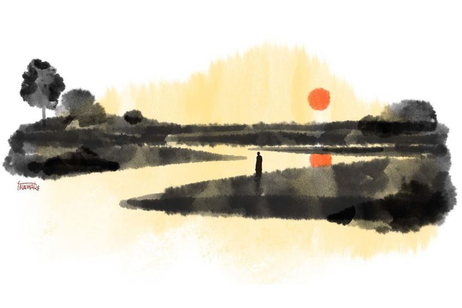

 
 <h1 align=center>রজতরেখা</h1>
<h2 align=center>ইমদাদুল হক মিলন</h2> 

আমার চোখের ভিতর দিয়ে রুপোলি এক নদী বয়ে যায়। আমার বুকের ভিতর দিয়ে রুপোলি এক নদী বয়ে যায়। নদীর নাম রজতরেখা। কী অপূর্ব একটা ছেলেবেলা ছিল আমার! গ্রামের নাম কামারখাড়া। বাড়ির মুখে বকুল গাছ। পুব থেকে আসা রাস্তাটি চলে গেছে স্বর্ণগ্রামে। আমি স্বর্ণগ্রাম হাই-ইশকুলের ছাত্র। পুব দিকে মুন্সিগঞ্জ থেকে আসা হালট উত্তর-দক্ষিণে। দক্ষিণে গঞ্জের বাজার, দিঘির পাড়। রাস্তার কয়েক কানি জমির পর রজতরেখা। নদীর দিকে ঝুঁকে আছে খেজুর গাছ। পা ছুঁয়ে ঢুকেছে খাল। বড় রাস্তার উপর কাঠের পুল। বর্ষায় নদী যেমন টইটম্বুর, খালটিও তাই। বন্ধুদের নিয়ে সেই পুলের উপর থেকে খালের জলে লাফিয়ে পড়ি। বর্ষায় ভরা নদী। দু’পার একাকার। কী স্রোত নদীতে! কী স্রোত! শীতলক্ষ্যার শাখা নদী রজতরেখা। উত্তর থেকে দক্ষিণে যায় স্রোত। ছোট-বড় কত পাল-তোলা নৌকা। নদীর জলে বিশাল ঘূর্ণি ওঠে।

গ্রীষ্মে নদীটি শান্ত। ও পারে চর। ধানের মাঠ। তরমুজ, বাঙ্গি, ক্ষীরাই, করলা আর গোল আলুর চাষ। দরিদ্র মানুষ কুঁড়েঘর তুলে থাকে। নৌকা বেয়ে এ পার থেকে ও পারে যেতে সময় লাগে পনেরো-কুড়ি মিনিট। কত বড় নদী!

গ্রীষ্মের ছুটিতে আমাদের দিন কাটত রজতরেখায়। সাঁতার কেটে নদীর অনেকটা দূর পর্যন্ত চলে যাওয়া, হুড়োহুড়ি, লাফ-ঝাঁপ। বাড়ি ফেরার পর চোখ হয় কোড়াপাখির চোখের মতো। কামারখাড়া গ্রাম মনে পড়ে না। মনে পড়ে শুধু নদীটি। রজতরেখা। কী অপূর্ব নাম। কবে কোন মহাজন এই নাম রেখে গেছেন, কে জানে...”

এখন হাঁটাচলা ধীর হয়েছে মতি মাস্টারের। আটাত্তর বছর বয়সে এমনই হওয়ার কথা। একদা ভালই ছিল স্বাস্থ্য। টুকটাক অসুখ-বিসুখ হত। সে সব গায়ে লাগত না। শেষ বয়সে ডায়াবিটিসের সঙ্গে কাঁধ মিলিয়ে এল প্রেশার। তার পরেও অনেকখানি নিয়ন্ত্রণে ছিল শরীর। তিন-চার বছর ধরে ভাঙতে শুরু করেছে। সামান্যতেই ক্লান্ত বোধ করেন।

আজ সকালে কয়েক মিনিট হেঁটে নাশতা করেছেন। তার পর শরীর ভেঙে এসেছে। বিছানায় শুয়ে আছেন। ঘুম কমে গেছে অনেক বছর। ঘুমের ওষুধ খেতে হয় নিয়মিত। সকালবেলায় বিছানায় শোওয়ার পর অদ্ভুত এক ক্লান্তি আর অবসাদ টের পান। সেই অবস্থায় আজ শুধুই মনে পড়ছিল নদীটির কথা। যেন সেই ছেলেবেলার সঙ্গেই অনেক ক্ষণ কথা বলছেন। নদীটির সঙ্গে কথা বলছেন। এ রকম মনোভাব ছিল তন্দ্রার মধ্যে।

মতি মাস্টারের যখন তেরো বছর বয়স, তখন হঠাৎ করেই বাবা নিঃস্ব হয়ে গেলেন। ধান-চালের আড়ত ছিল দিঘিরপাড় বাজারে। দূরদূরান্ত থেকে গাস্তিনাও ভরে ধান আসে, চাউল আসে। ভরা বর্ষায় এক বার মাস দেড়েকের ব্যবধানে ও রকম দু’খানা মাল-বোঝাই নৌকা ডুবে গেল। একটা ডুবল শীতলক্ষ্যায়, আর একটা পদ্মায়। বাবা নিঃস্ব হয়ে গেলেন। পাঁচ ছেলেমেয়ে নিয়ে বেঁচে থাকাই মুশকিল। বাজারের আড়তঘর, গ্রামের বাড়ি জায়গা সম্পত্তি সব বিক্রি করে চলে এলেন ঢাকায়। গেণ্ডারিয়ায় ছোট পুরনো একটা দোতলা বাড়ি কিনলেন। সূত্রাপুর বাজারে পাইকারি মালের দোকান দিলেন। তিন মেয়েকে লেখাপড়া শেখালেন যতটা পারেন। বিয়ে দিলেন মধ্যবিত্ত পরিবারে। বড়ভাই লেখাপড়া তেমন করল না। বাবার পাইকারি দোকান সামলাতে লাগল।

মতি মাস্টার সবার ছোট। লেখাপড়ায় ভাল। ঢাকা ইউনিভার্সিটি থেকে বাংলা সাহিত্যে অনার্স পাস করলেন। এম এ পরীক্ষা দেওয়া হল না। গেণ্ডারিয়া হাই ইশকুলে চাকরি পেলেন। মতিউর রহমান ধীরে ধীরে হয়ে গেলেন ছাত্রদের প্রিয় ‘মতি মাস্টার’। সংসার হল। দুই মেয়ে এক ছেলে এল সংসারে। মেয়েদের বিয়ে হল ভাল ঘরে। দীননাথ সেন রোডে নিজে ছোট্ট একটা বাড়িও করলেন। ছেলেটি ছোট। সে-ও বিয়েশাদি করে সংসারী হল। তাদের সংসারে দুই ছেলে-মেয়ে। ছেলে-বৌ দু’জনেই ব্যাঙ্কে চাকরি করে। সচ্ছল অবস্থা। স্ত্রীর মৃত্যুর পর মতি মাস্টার নিঃসঙ্গ হয়ে গেলেন। এখন শুধু মৃত্যুর প্রহর গোনা।

পরের সপ্তাহে ছুটির দিনে পুরনো এক ছাত্র এসে হাজির। বুলবুল। তিয়াত্তর সালে মতি মাস্টারের স্কুল থেকে এসএসসি করে বেরিয়েছে। ভাল ছাত্র ছিল। এক-দুইয়ের মধ্যেই রোল থাকত। তবে হতদরিদ্র পরিবারের ছেলে। স্কুলে ফুল ফ্রি। মতি মাস্টার খুবই ভালবাসতেন ছেলেটিকে। এই এক জন ছাড়া কেউ আর স্যরের কথা মনে রাখেনি। ছুটিছাটার দিনে স্যরকে দেখতে চলে আসে বুলবুল। বড় চাকরি করে। ফ্ল্যাট, গাড়ি সব হয়েছে। স্যরের জন্য গাদা গাদা ফল নিয়ে আসে। অনেক ক্ষণ বসে গল্প করে।

সে দিনও তাই করেছে বুলবুল। দু’হাতে কয়েকটা শপিং ব্যাগ নিয়ে স্যরের ঘরে ঢুকল। মতি মাস্টার যথারীতি শুয়ে আছেন। বুলবুল তাঁর পায়ে হাত দিয়ে সালাম করে বলল, “কেমন আছেন স্যর?”

মাস্টার উঠে বসলেন, “এই আছি এক রকম রে বাবা। তুই ভাল আছিস?”

“আছি স্যর।”

বুলবুল চেয়ার টেনে স্যরের মুখোমুখি বসল।

মাস্টার বললেন, “এ বার অনেক দিন পরে এলি। কত ছাত্রছাত্রী পড়িয়েছি সারা জীবন। কারও কথা তেমন মনে পড়ে না। তোর কথা খুব মনে পড়ে। আমি জানি আমাকে তুই খুব ভালবাসিস। সেই স্কুল-জীবন থেকেই তোর জন্য আমারও একটা টান রে বাবা। তোকে দেখে মনে হচ্ছে, আপন সন্তানটিকে আজ অনেক দিন পর দেখলাম।”

বুলবুলের চোখ ছলছল করে উঠল।

ছেলের বৌ আফরিন এল শ্বশুরের রুমে। বুলবুলকে দেখে খুশি হল কি না বোঝা গেল না। ভদ্রতার হাসি হেসে বলল, “আপনি কখন এলেন, বুলবুলভাই? বসুন বসুন, চা পাঠাচ্ছি।”

মাস্টার বললেন, “মুনির ওঠেনি?”

“না বাবা। বাচ্চারাও ওঠেনি। ছুটির দিনে আমরা বেলা পর্যন্ত ঘুমাই।”

আফরিন আর দাঁড়াল না।

বুলবুল বলল, “আপনার কথা এই জীবনে ভোলা সম্ভব না স্যর। এসএসসি পরীক্ষা দেব, ফর্ম ফিল-আপ করতে একশো ষোলো টাকা লাগবে। সবাই ফিল-আপ করে ফেলেছে। আমি সায়েন্স গ্রুপের ফার্স্ট বয়। আমি করতে পারছি না। মা-বাবা দু’জনেই এ দিক-ও দিক চেষ্টা করেছেন। টাকা জোগাড় হয়নি। পরের দিন লাস্ট ডেট। দোতলার রেলিংয়ে মনখারাপ করে দাঁড়িয়ে আছি। অফিস রুম থেকে ফর্ম ফিল-আপ করে বেরিয়ে আসছে বন্ধুরা। আপনি ক্লাস শেষ করে টিচার্স রুমের দিকে যাচ্ছেন। পিছন থেকে এসে আমার কাঁধে হাত দিলেন। ‘কী রে, ফর্ম ফিল-আপ করিসনি?’ আমি কেঁদে ফেলেছিলাম। বলেছিলাম, টাকা জোগাড় হয়নি স্যর। আপনি ডেকেছিলেন, ‘আয় আমার সঙ্গে।’

“আপনি খুব পপুলার টিচার। সকাল-বিকাল ব্যাচ করে ছেলে-মেয়েরা আপনার কাছে পড়ে। আপনার পকেটে সব সময়ই গাদা গাদা টাকা। অফিস রুমে ঢুকে একশো ষোলো টাকা দিয়ে আমার ফর্ম ফিল-আপ করিয়ে দিলেন। এই ঘটনা জীবনে ভোলা সম্ভব, স্যর? জীবন দিয়েও তো আপনার এই ঋণ আমি শোধ করতে পারব না।”

“কী যে বলিস!”

“স্যর, আমি আজ একটা প্রস্তাব নিয়ে এসেছি।”

“কী প্রস্তাব রে বাবা?”

“আমি আপনার কোনও একটা স্বপ্ন পূরণ করে দিতে চাই। সেটা যেমন স্বপ্নই হোক।”

“বোকা ছেলে!”

“আপনি স্যর নিঃসঙ্কোচে আমাকে বলুন।”

মাস্টার একটু ভেবে বললেন, “তোকে অবশ্য বলা যায়। তুই তো আমার ছেলেই। যদিও মুনির কাজটা কখনও করেনি। হাঁটাচলা বন্ধ হয়ে যাওয়ার পর অনেক বার বলেছি। সেই যে কামারখাড়া ছেড়ে এসেছিলাম, বাবা অভিমান করে সেই গ্রামে আর কোনও দিন যাননি। আমাদেরও যেতে দেননি। গ্রামের জন্য মনটা কখনও কাঁদেনি। কেঁদেছে নদীটির জন্য। রজতরেখা। এই তো মুন্সিগঞ্জ ছাড়িয়ে দিঘিরপাড়ের ও দিকে। শুনেছি এখন রাস্তাঘাট খুব ভাল। ঢাকা থেকে ঘণ্টা দেড়-ঘণ্টা লাগে যেতে। ছেলেটা কোনও দিন নিয়ে গেল না। শরীর যখন ভাল ছিল, তখন কখনও এই ইচ্ছাটা হয়নি। কিছু দিন ধরে খুব হয়। আহা, যদি এক বার রজতরেখার তীরে গিয়ে দাঁড়াতে পারতাম!”

বুলবুল স্নিগ্ধ কণ্ঠে বলল, “আগামী শুক্রবার আপনাকে আমি নিয়ে যাব, স্যর।”

সুন্দর একটা মাইক্রোবাস নিয়ে এসেছে বুলবুল। ড্রাইভারের পাশে তার সহকারী। লোকটির নাম ফরিদ। ফরিদের সঙ্গে মাঝারি সাইজ়ের খাবারের ব্যাগ, জলের বোতল, চায়ের ফ্লাস্ক। সে মুন্সিগঞ্জের লোক। কামারখাড়া, দিঘিরপাড় এই সব গ্রাম চেনা।

বুলবুলের সঙ্গে ফরিদও ধরে ধরে গাড়িতে তুলেছে মতি মাস্টারকে। তাঁর পরনে সাদা পাজামা-পাঞ্জাবি। পায়ে নরম ধরনের পাম্প শু। মাথার চুল পাতলা হয়েছে। চুলের মতোই, গোঁফ-দাড়ি প্রায় সবই পাকা। আজ সকালে তাঁর মুখটা আনন্দে উজ্জ্বল হয়ে আছে। গাড়িতে বসে চশমাটা উপর দিকে ঠেলে দিলেন। বুলবুলের দিকে তাকালেন, “আমার খুব আনন্দ হচ্ছে রে বাবা। শেষ বয়সে নিকট দিনের কথা মনে পড়ে না। মনে পড়ে অতীত দিনের কথা। এক বর্ষায় একটা কোষানাও নিয়ে একা একা দিঘিরপাড় বাজারে চলে গিয়েছিলাম। রজতরেখায় সে কী স্রোত! আমার বয়স তেরো বছর। বাবার আড়ত উঠে গেছে। ঢাকায় নিজেকে গোছগাছ করবার চেষ্টা করছেন। গ্রামের বাড়িঘর জমিজমা বিক্রির চেষ্টা চলছে। আড়ত বিক্রি হয়ে গেছে। বাড়িতে কাজের লোকজনও নেই। কঠিন স্রোতের নদী। ভরা বর্ষায় তো দূরের কথা, গ্রীষ্মেও কোনও দিন নৌকা বেয়ে একা একা অত দূরের বাজারে যাইনি আমি। সে দিন গেলাম। তখনকার দিনের বারো-তেরো বছরের ছেলেরা লুঙ্গি পরে। আমার পরনে লুঙ্গি আর স্যান্ডো গেঞ্জি। শ্রাবণ মাস। উত্তর থেকে দক্ষিণে যাব। স্রোতের অনুকূলে। তেমন কোনও কষ্টই হল না যেতে। বৈঠায় চাড়ও দিতে হয় না। হাল ধরে রাখলেই নৌকা তরতর করে এগিয়ে যায়। জান বেরিয়ে গিয়েছিল ফেরার সময়। যেতে লেগেছিল পনেরো-বিশ মিনিট। ফিরতে দেড় ঘণ্টা।”

মতি মাস্টার নির্মল মুখ করে হাসলেন।

বুলবুল বলল, “ছেলেবেলার কোনও নদীর জন্য এক জন মানুষের যে এ রকম টান থাকতে পারে, আপনাকে না দেখলে স্যর আমি এটা বুঝতামই না।”

“জীবনের এত বছর কেটে গেছে, বুঝলি বাবা? যখন চলাফেরার ক্ষমতা ছিল, তখন নদীটির জন্য কোনও দিন এমন লাগেনি। তা হলে তো কত বারই যেতে আসতে পারতাম। রজতরেখা আমাকে পাগল করে দিল শেষ বয়সে। যখন প্রায় অথর্ব হয়ে গেছি। ঘুমিয়ে ঘুমিয়ে নদীটির স্বপ্ন দেখি, জেগে জেগে দেখি। তুই আজ আমার জীবনের শেষ ইচ্ছাটা পূরণ করে দিচ্ছিস বাবা। আমি তোর কাছে খুব কৃতজ্ঞ।”

বুলবুল দু’হাতে স্যরের একটা হাত জড়িয়ে ধরল, “ছেলের কাছে বাবার কখনও কৃতজ্ঞতা প্রকাশ করতে হয় না। আমি তো আপনার ছেলে।”

“তা তো বটেই। কত দূর এলাম রে?”

ফরিদ বলল, “মুক্তারপুর পার হচ্ছি, স্যর।”

“আর কত ক্ষণ লাগবে?”

“আধ ঘণ্টার মতো লাগতে পারে।”

গ্রামের রাস্তায় ঢুকল গাড়ি। রাস্তার দু’পাশে দালান-কোঠা, বাজার। মানুষের কোলাহল। কিছুটা ফসলের মাঠ। আবার বাড়িঘর ইস্কুল মসজিদ মাদ্রাসা। পুরা বাজার ছাড়িয়ে গাড়ি চলে এল কামারখাড়ার দিকে।

ফরিদ বলল, “এসে পড়েছি, স্যর।”

বুলবুল বলল, “গাড়ি রাখ। আমরা নামব।”

মতি মাস্টার শিশুর মতো উচ্ছ্বসিত, বললেন, “খুব ভাল লাগছে রে বাবা। খুব ভাল লাগছে।”

ধরে ধরে তাঁকে গাড়ি থেকে নামাল বুলবুল আর ফরিদ। তিনি চার দিকে তাকাতে লাগলেন, “এটাই কি কামারখাড়া গ্রাম? গ্রাম তো আর গ্রাম নেই রে! এ তো শহর হয়ে গেছে! সেই খালটা কোথায়? কাঠের পুলটা কোথায়?”

ফরিদ বলল, “আগের সেই গ্রাম আপনে কোথায় পাবেন স্যর! গ্রাম এখন শহর।”

“নদীটা? রজতরেখা? রজতরেখা কোথায় গেল?” মতি মাস্টারের গলায় উদ্বেগ।

পুব দিকে পায়ে-চলা একটা পথ। ফরিদ বলল, “এই পথে গেলে দেখা যাবে। একটু হাঁটতে হবে স্যর। পারবেন?”

বুলবুল বলল, “আমরা দু’জন দু’দিক থেকে ধরে রাখব। অসুবিধা হবে না।”

মিনিট-সাতেক হাঁটার পর শীর্ণ একটি খালের পাশে এসে দাঁড়াল তিন জন মানুষ। খালের এ পারে যেমন ঘনবসতি, ও পারেও তা-ই। বাঁশের একটা সাঁকোও আছে।

মতি মাস্টার হতবাক চোখে এ দিক-ও দিক তাকাতে লাগলেন, বললেন, “নদী কই?”

ফরিদ হাসল, “এটাই স্যর রজতরেখা নদী।”

মাস্টার বাকরুদ্ধ হয়ে গেলেন। দাঁড়িয়ে থাকতে পারছেন না। ঘাসের উপর অসহায় ভঙ্গিতে বসে পড়লেন। মাতৃহারা শিশুর মতো বুক চাপড়ে হাহাকার করতে লাগলেন, “আমার নদীটার এই দশা কে করল? বুলবুল, বুলবুল রে, এ তুই আমাকে কী দেখাতে নিয়ে এলি, বাবা? আমার রজতরেখা কে মেরে ফেলল? কারা মেরে ফেলল?”

মতি মাস্টার কাঁদতে লাগলেন। তাঁর কান্নায় বুলবুল আর ফরিদের মতো রজতরেখা আর তার দু’পারের গাছপালা, ঘাস আর বুনোফুলের ঝোপঝাড় সব নিশুতি রাতের মতো স্তব্ধ হয়ে গেল।

