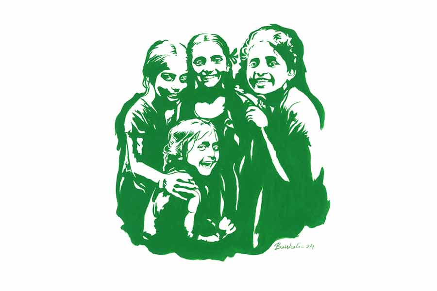

 
 <h1 align=center>রস কষ শিঙাড়া বুলবুলি</h1>
<h2 align=center>রাজশ্রী বসু অধিকারী</h2> 

আজ সরকারি ছুটি। সকালে উঠেই বাইরে যাওয়ার তাড়া নেই। গত ছ’দিন পুরো এলাকা ঘুরেছি চরকির মতো। আজ শরীর এলিয়ে আছে ক্লান্তি আর আলসেমিতে। কিন্তু মাথা এই নিষ্কর্মা দশাকে প্রশ্রয় দিতে রাজি নয়। এই ক’দিনে যা কিছু ইনস্পেকশন হল,
তার রিপোর্ট তৈরি করে পাঠাতে হবে কর্তৃপক্ষের কাছে। এই একটা বড় দায়িত্ব ঘাড়ে চেপে আছে।

আমি ওয়েলফেয়ার দফতরের মাঝারি অফিসার। পদমর্যাদার সঙ্গে সমানুপাতিক দায়িত্ব। নতুন একটি প্রজেক্ট এসেছে পরিবার পরিকল্পনা সংক্রান্ত। এলাকা অনুযায়ী আমাকে দেখে নিতে হবে কাজের অগ্রগতি। এক সপ্তাহ আগে এসেছি ঝাড়খণ্ড ঘেঁষা পুরুলিয়ার গ্রাম উদয়নপুরে। উদ্দেশ্য, এই অঞ্চলের স্থানীয় মানুষজনের মধ্যে পরিবার পরিকল্পনার সুফল এবং নানা সরকারি পন্থা সম্বন্ধে সচেতনতা বৃদ্ধি করা।

আমি শুধু ভাবি, যে ভাবে আমাদের বিভাগীয় প্রচার চলছে, আমরা প্রতি তিন মাসে যে পরিমাণ টিএ বিল পাচ্ছি এই বাবদ, সেই অনুপাতে প্রজনন সংখ্যা কমছে না কেন? কোথাও কি গলদ থেকে যাচ্ছে সচেতনতা প্রসারে?

সকাল থেকে শুয়ে-বসে শুধুই ভাবছি। এ বার ওঠা দরকার। রিপোর্টটা না করে ফেললে শান্তি নেই। ব্লক অফিসের গেস্ট হাউসে আছি। রান্না ও আনুষঙ্গিক কাজের জন্য আছে পিওন বাদল। কাল থেকে সে আসেনি। তার বদলে এল মধু নামের এক জন মহিলা। সে নাকি বাদলের বদলি। আমার খাওয়ার কোনও অসুবিধে হয়নি। এখন চায়ের কথা ভাবছিলাম। বলার আগেই একটি বছর বারোর বাচ্চা মেয়ে চা নিয়ে ঢুকল।

“মা বলল, ব্রেকফাস্ট রেডি।”

তাকাই মেয়েটির দিকে। ছেঁড়া জামা, শুকনো মুখে জ্বলজ্বলে দুটো চোখ। মধুরই মেয়ে হবে। এটাই এদের নিয়ে মুশকিল। এত প্রচার সত্ত্বেও স্কুলে না পাঠিয়ে কাজ করতে পাঠিয়ে দেবে। চায়ে চুমুক দিয়ে ভাবি, বিডিওকে জিজ্ঞেস করব অঙ্গনওয়াড়ির দিদিরা গ্রামের মহিলাদের ঠিকমতো ট্রেনিং দিচ্ছে কি না।

উঠে হাত-মুখ ধুয়ে ফাইল খুলে বসি। কয়েকটা গ্রামের প্রজনন সংখ্যা উল্লেখযোগ্য রকমের বেশি। স্বাস্থ্যকেন্দ্র আর হাসপাতালের স্টেটমেন্ট দেখাচ্ছে, এই ব্লকের ছ’খানা গ্রামে গত তিন মাসে ডেলিভারি হয়েছে দুশো তেইশটা! তার মধ্যে ফর্টি পার্সেন্ট থার্ড, এমনকি ফোর্থ ডেলিভারি, যা আমাদের যাবতীয় পরিবার পরিকল্পনার ব্যর্থতা। তৃতীয় বা চতুর্থ সন্তানের কি প্রয়োজন আছে কোনও? প্রজনন সংখ্যা কমলে মানুষের কত রকম উপকার, সেটা বোধহয় আমরাই ঠিক করে বুঝিয়ে উঠতে পারছি না। কম সংখ্যক বাচ্চা মানে উন্নত প্রতিপালনের সুযোগ, উন্নততর শিক্ষা, স্বাস্থ্য, পরিকাঠামো, সমাজগঠন। নিঃশ্বাস ফেলে ভাবি, আমরা দায়িত্বে থেকেও কি মানুষের কাছে পৌঁছতে পারছি না ঠিকমতো? সন্তান যে শুধুই ঈশ্বরের দান নয়, তাকে যে বেখেয়ালে অথবা মনের খেয়ালখুশিতে এনে ফেললেই দায়িত্ব শেষ হয়ে যায় না, তাকে একটা যোগ্য জীবন দিতে হবে, সুন্দর পৃথিবী দিতে হবে, সেই কথাগুলো সরল সাধারণ মানুষদের আমরাই কি বোঝাতে পারছি না?

মনটা দমেই ছিল। শব্দ শুনে তাকাই। একটি বাচ্চা মেয়ে থালায় ধোঁয়া ওঠা আলুর তরকারি আর রুটি নিয়ে কুণ্ঠিত চোখে তাকিয়ে, “মা বলল আগে খেয়ে নিতে।”

আগের মেয়েটা নয়। এ আর একটু ছোট। ঢলঢলে ফ্রক, চাউনিতে ভয় আর কৌতূহলের কোলাজ। বুঝলাম, এটাও মধুরই মেয়ে। সে দুই মেয়ে নিয়ে কাজে এসেছে। ছোট ছোট মেয়েদের পড়াশোনা না শিখিয়ে কাজ করিয়ে নিচ্ছে। বিরক্ত লাগে আমার। মধুকেই ডেকে কিছু বলব কি? সেটা কি উচিত হবে? ও তো সরকারি লোক নয়। বাদল তার বদলি দিয়ে গেছে। নাহ, যা বলার বাদল এলেই বলব। গম্ভীর মুখে রুটির থালা টেনে নিই। মেয়েটা সেই ফাঁকে বেরিয়ে যায়।

রিপোর্ট তৈরিতে মন দিলাম। কিছুতেই মনের মতো হচ্ছে না নোটগুলো। যা আমি লিখতে চাই, তা-ই যদি লিখি, তবে তা হবে অনেকটা মিথ্যে। আমার মন চায় না সেটা করতে। ডায়েরি-পেন রেখে দিয়ে আড়মোড়া ভাঙি। জানলার বাইরে নীল আকাশে সাদা মেঘের আলপনা। ঘরের তিন দিকের দেওয়ালেই জানলা। একটা দিয়েই যদি এমন আকাশ দেখা যায়, তবে সব জানলা খুলে দিলে না জানি কত বড় আকাশ ঝাঁপিয়ে ঢুকবে ঘরে! ছেলেমানুষি ভাবনায় একে একে সব জানলা খুলে দিই।

আরে! ও দিকটায় মাটিতে বসে খেলা করছে দুটো বছর চার-পাঁচের বাচ্চা! ফুল-ছাপ ফ্রক, চোখে মোটা কাজল। আমি তীক্ষ্ণ চোখে দেখি। ধুলো মাটি ঘেঁটে ওদের মুখ-চোখের হাল হয়েছে দেখার মতো।

কিন্তু এরা কারা? কোথা থেকে এল? এরাও কি ওই মধু নামের মহিলাটিরই বাচ্চা? আমার মাথা এ বার সত্যি গরম হয়ে যায়। চার-চারটে মেয়ে যার, সেই মহিলা কাজ করে যাচ্ছে কি না পরিবার পরিকল্পনা বিভাগের অফিসারের জন্য! অর্থাৎ নিজের কাজের মহিলাটিকেই আমি কোনও রকম শিক্ষা দিয়ে উঠতে পারিনি! এই মহিলা যে আমাদের কোনও স্টাফ নয়, বাদলের বদলিতে এসেছে, তা আর মনে পড়ে না। ফোন করে বসি বিডিওকে। নতুন ছেলে, কাজেও উৎসাহ আছে।

“অভিষেক, আমি একটা ব্যাপার একটু ভাবছি...” এ কথা সে কথার পর বলি আমি।

“বলুন না দাদা, কেন হেজ়িটেট করছেন!” সে বলে।

“বলছিলাম... আমি নিজে একটু গ্রামবাসীদের সঙ্গে বসতে চাই... তোমরা তো সময়ে সময়ে মিটিং করোই। তবু আমিও একটু... যদি তুমি ব্যবস্থা করতে পারো...”

“দাদা, আপনি নিজে মিটিং করতে চাইছেন, এ তো খুব ভাল কথা। আমাকে ডেট অ্যান্ড টাইম জানান, আমি আজই সব পঞ্চায়েতে নোটিস পাঠিয়ে দিচ্ছি।”

“আমার মনে হয়, পরিবার পরিকল্পনার ব্যাপারটা অনেক মানুষ এখনও ঠিক করে বুঝে উঠতে পারেননি। এতগুলো থার্ড-ফোর্থ ডেলিভারি...”

“এটা দাদা হসপিটালগুলো থেকেও চেষ্টা হচ্ছে। এই সম্পর্কিত জিনিসপত্র ওরা সরকারি খরচে সাপ্লাইও করেন।”

“কিন্তু মানুষকে আমরা সচেতন করে উঠতে পারছি না লক্ষ্য অনুযায়ী,” একটু মনমরা হয়েই বলি আমি। সকাল থেকে এক জন মহিলার এতগুলো মেয়ে দেখে আমার কেবলই মনে হচ্ছে, প্রজনন সংখ্যা কম রাখার উদ্দেশ্যটাই এখনও আমরা মানুষকে বোঝাতে পারিনি। অথচ চাকরি রক্ষার স্বার্থে আমাকে পজ়িটিভ রিপোর্ট দিয়ে যেতে হবে। এই দ্বিচারিতা আমি মন থেকে মানতে পারি না। ছেলে হোক বা মেয়ে, তা যে এক বা দুইয়ের বেশি দরকার নেই, সেটাই তো বোঝা দরকার ভবিষ্যতের বাবা-মায়েদের। অভিষেকের উপর্যুপরি প্রশ্নে খুলে বলি কথাগুলো। অবাক হয়েছে অভিষেক, “তাই নাকি? বাদল বদলি দিয়ে গেছে? কই, অফিসে তো জানায়নি!”

এই রে! আমি বোধহয় ঠিক করলাম না। তাড়াতাড়ি বলি, “ও বিকেলেই ফিরে আসবে। আমার কোনও অসুবিধেও হয়নি।”

“আচ্ছা, খোঁজ নেব এই মহিলার ব্যাপারে। দু’জন দিদিকেও পাঠাব ওঁর কাছে, যাতে একটু বুঝিয়ে বলে আসে।”

কথা শেষে জানলা দিয়ে তাকাই। নাহ, বাচ্চা মেয়েদুটোকে আর দেখা যাচ্ছে না। মনটা আমার আবার আনমনা হয়ে যায়। না পারছি রিপোর্ট শেষ করতে, না পারছি চুপ করে বসে থাকতে।

এমন সুন্দর দিনটা, একটু ঘুরে এলে ভাল লাগবে বোধহয়। তৈরি হয়ে উঠোনে নামতেই দেখি বাদল বিকেলে নয়, সকালেই ফিরে এসেছে। মধুও হাজির উঠোনে।

“কী ব্যাপার বাদল, তুমি ফিরে এলে যে এত তাড়াতাড়ি?”

হাতের ঢাউস চটের ব্যাগখানা মধুর হাতে তুলে দিয়ে হাসে বাদল, “কাজ হয়ে গেল বাবু।”

দেখি, উঠোনের শেষে লাইন দিয়ে দাঁড়িয়ে আছে চার মূর্তি। আবার মাথাটা একটু গরম হয় আমার। আজকের যুগেও কারও চারটে বাচ্চা হবে কেন? তা হলে আমরা কী কাজ করে চলেছি এত এত মাইনে নিয়ে?

“এরা কারা বাদল?” গোমড়া মুখে জিজ্ঞেস করি।

“আপনার সঙ্গে আলাপ করিয়ে দেয়নি আমার ইস্তিরি? এই তোরা এ দিকে আয়। বাবু খুব ভালমানুষ। পেন্নাম কর সব...”

“ইস্তিরি? কে তোমার স্ত্রী?”

“কেন? এই যে আপনার সামনে বাবু, এই তো মধু...” বাদল একগাল হেসে বলে। মধু নামের মহিলাটিও ঘোমটা টেনে ঢিপ করে একটা প্রণাম করে ফেলে আমাকে। অথচ কাল থেকে সে আমার সামনেই আসেনি প্রায়। শুধু খাবারগুলো দিয়েছে সময়ে সময়ে। আমি জানিই না যে, ও বাদলের স্ত্রী! অবাক হই। সেই সঙ্গে বিরক্তও। এই বাদল আর মধুরই এতগুলো বাচ্চা! অথচ বাদল ফ্যামিলি প্ল্যানিং অফিসারের দেখাশোনা করছে। নিজের কাজের জায়গাতেই সচেতনতার এই হাল! এটা তো চরম ব্যর্থতা।

আমার বিরক্তির দিকে কোনও খেয়াল নেই বাদলের। মেয়েগুলো সামনে এসে আমায় একের পর এক প্রণাম করছে।

“তোদের নামগুলো বল বাবুকে।”

চারটে মেয়ে রিন রিন ঠিন ঠিন করে বলে ওঠে, “রস, কষ, শিঙাড়া, বুলবুলি।”

আমি চমকাই, “এ আবার কেমন নাম?”

“হ্যাঁ বাবু... ওদের মা রেখেছে।”

“এই তোরা যা ও দিকে, খেলগে যা। কী এনেছি পরে দেখবি...”

মধু তত ক্ষণে বারান্দার উপর ব্যাগ উপুড় করে ঢেলে দিয়েছে। ভিতর থেকে গোছা গোছা খাতা, কিছু বই, সস্তার ডটপেনের বান্ডিল, রংপেনসিল, কতগুলো ড্রয়িং খাতা, একটা জ্যামিতি বক্স, কিছু বিস্কুটের প্যাকেট, কিছু সস্তার লজেন্সের প্যাকেট, আরও সব কী কী ছড়িয়ে পড়েছে মেঝেময়। বাচ্চাদের জন্যই বাজার করতে শহরে গিয়েছিল বাদল। সে দিকে তাকিয়ে গোমড়ামুখে বলি, “এতগুলো মেয়ে তোমার, এদের ভালমতো মানুষ করতেও তো পারবে না। এক-দু’জন হলে না হয়... তোমার তো বোঝা উচিত...”

“কী করব বাবু! এই বাচ্চাগুলোকে তো ফেলে দিতে পারি না। একটাও তো মধু পেটে ধরেনি। যাদের কেউ নেই, তাদের একটা পরিবার দিতে চেয়েছি। রাস্তা থেকে কুড়িয়ে এনে মেয়ে বানালাম। আমার ঘর স্বর্গ হয়ে গেছে বাবু...”

প্রচণ্ড জোরে ধাক্কা লাগে আমার। এ রকম একটা কথা শুনব, তা স্বপ্নেও ভাবিনি। সকাল থেকে কত কী-ই না ভেবে গেলাম! বাদল হাসিমুখে বলেই চলেছে নানা কথা, “আমার মেয়েরা বাবু লেখাপড়ায় খুব ভাল। ওদের খাবার দিতে পারি না পারি, বইপত্তর পেন-পেনসিল দিতেই হয়। সব মায়ের মতোই হয়েছে। আমি মুখ্যু, কিন্তু মধু বিএ পাশ। নিজে পড়ায় মেয়েদের...”

আমার বোবায় ধরা মুখ দিয়ে নিতান্ত সাধারণ একটা জিজ্ঞাসা বেরোয়, “তোমাদের নিজেদের বাচ্চা এলে এদের কী গতি হবে?”

বাদল হাসে, “সে উপায় আর রাখিনি বাবু। দু’জনে যুক্তি করে আমার অপারেশন করে এসেছি। মধু বলে, কত বাচ্চা অনাথ ঘুরছে, খেতে পায় না, ঘর পায় না... এদেরই মানুষ করি চলো, আর নিজেদের আলাদা বাচ্চার দরকার নেই...”

চোখে পড়ে, ঘোমটা-টানা মহিলাটির মুখে ফুটে উঠেছে তৃপ্তির আলো। সেই আলো ছড়িয়ে পড়েছে তার খেটে-খাওয়া স্বামীটির গর্বিত মুখেও।

আমি রস কষ শিঙাড়া বুলবুলির দিকে তাকিয়ে দেখি, ভবিষ্যতের সার্থক নাগরিকদের ধুলোমাখা মুখে সূর্যের আলোর মতো হাসি।

এ বার আমার রিপোর্টটা সম্পূর্ণ হবে।

