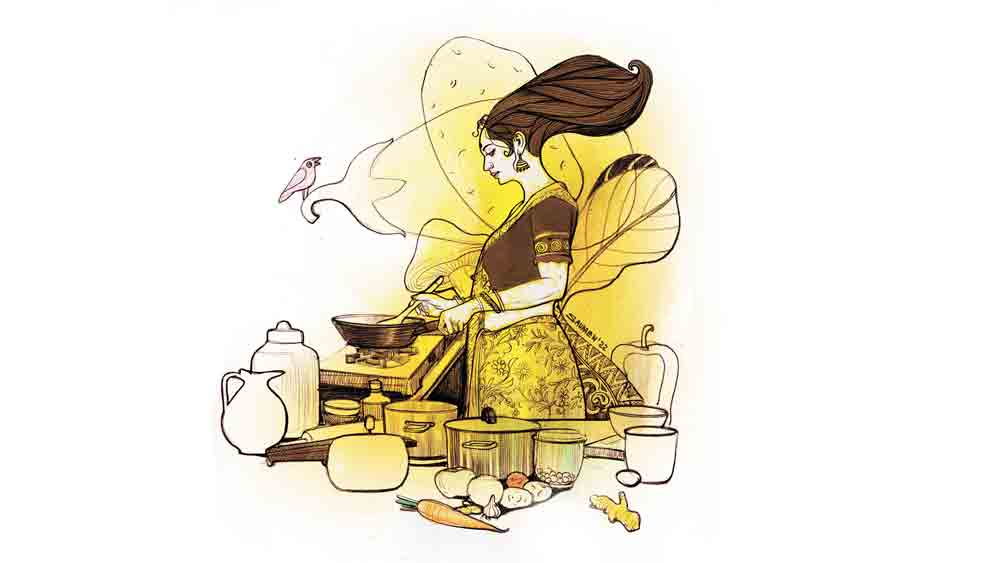

 

<h1 align=center>রান্নাঘরে রঞ্জাবতী</h1>
<h2 align=center>সম্পূর্ণা বন্দ্যোপাধ্যায়</h2>
শেষ বিকেলের আলো পর্দার ফাঁক দিয়ে ঘরে আসছে। দশ তলার এই ফ্ল্যাটেও দুর্গাপুজোর আমেজ। নীচের কমপ্লেক্সের মাঠ থেকে ঢাকের বোল আর সানাইয়ের মায়াময় সুর মৃদু শোনা যাচ্ছে। রনি ধীরে ধীরে কোল থেকে বাবাইকে বিছানায় শুইয়ে দিল। সারা দিন ছুটছে ছেলেটা। এত ক্ষণে বেলুন, বন্দুক, মুখোশ, চকলেটের রাংতা সব বিছানায় ছড়িয়ে রেখে ঘুমিয়ে পড়ল। এখন ঘণ্টাখানেক রনির ছুটি। পাশের ঘরে শুভ্র টিভি দেখছে। মায়ের ঘরে মা একটু ঘুমিয়েছে বোধহয়। রনি চা করতে রান্নাঘরে ঢুকেই জানলা দিয়ে দেখতে পেল, পাশের ফ্ল্যাটের রান্নাঘরে তুলি ব্যস্ত ভাবে রান্না করছে। আশ্চর্য হয়ে রনি বলেই ফেলল, “নবমীর বিকেলে রান্না করছিস! কেন রে?”   “ও মা! অ্যানাউন্সমেন্ট শুনলে না? কুকিং কম্পিটিশন। এক ঘণ্টা পঁয়তাল্লিশ মিনিট সময় দিয়েছে।” ব্যস্ত চোখে মোবাইলে সময় দেখছে তুলি, “আর পঁয়তাল্লিশ মিনিট বাকি, একটা কিছু ইউনিক বানিয়ে ফেলো শিগগির। এক সঙ্গে যাব, কেমন? আজকের সেরা রাঁধুনি যে হবে, টিভিতে ‘সুচরিতার রান্নাঘর’-এ রান্না করার চান্স পাবে। ওখান থেকেই তো দু’জন জাজ এসেছে গো।”   রনি বলল, “দূর! আমি রাধঁতেই পারি না, তার আবার ইউনিক।”   তুলি দুই ভুরু নাচিয়ে বলে ওঠে, “দেখলে হয়তো আজকের সেরা রাঁধুনি হবে রঞ্জাবতী সেন!”   তুলি দ্রুত হাতে ট্রে-তে স্যালাড সাজাতে  থাকে।   তুলির তাড়াহুড়ো রঞ্জাবতী, মানে রনিকেও ছুঁয়ে যায়। সে জিজ্ঞেস করে ফেলে, “তুই কী রাঁধলি রে?”   “ডিমের গ্লসি।”   “সে আবার কী?”   “হুঁ হুঁ বাওয়া, খাওয়াব... খাওয়াব...” প্রায় নাচতে নাচতে ভিতরে চলে যায় তুলি।   এ বার রনি খেয়াল করে, সানাইয়ের ফাঁকে ফাঁকে, পুজো কমিটির ঘোষণা চলছে, “আমন্ত্রণ হাউজ়িংয়ের সমস্ত মহিলা এখন তুমুল ব্যস্ত। আর মাত্র চল্লিশ মিনিট সময়, তার পরেই আমাদের মাননীয় বিচারক মণ্ডলী বেছে নেবেন আজকের সেরা রাঁধুনি…” ফের সানাইয়ে বেহাগ বেজে ওঠে।   রঞ্জাবতী প্রায় হাঁপাতে হাঁপাতে মা-র ঘরে ঢোকে, “ও মা! রান্নার প্রতিযোগিতা হচ্ছে, একটা কিছু বলো না মা প্লিজ়!”   মা চোখ দুটো আধখোলা করে বলে, “ওই তো... দেখ না... ফ্রিজে কী আছে... একটা কিছু করে ফেল না। মজার খেলা বই তো নয়।”   রনি ফ্রিজ়ের দরজা খুলে পুতুলের মতো দাঁড়িয়ে থাকে। ফ্রিজ়ের তাকে দুটো বাটিতে মা-র নবরাত্রি পালনের পর খাওয়ার জন্য ছোলার ডাল আর সাবু ভেজানো। ট্রে-তে স্যালাডের জন্য কিছু আনাজপাতি আর কাচের বাটিতে বেশ কিছুটা পনির। এ দিয়ে কী ইউনিক রান্না করবে ও? নাঃ, আর সময় নেই। ভাল রান্না জানে না তো কী হল! কেমিস্ট্রি প্র্যাকটিক্যাল তো করেছে। ব্যস্ত হাতে পনির, ভিজে ছোলার ডাল আর সাবু বার করে আনে রনি। পরের আধঘণ্টায় মগজে যেন বিদ্যুৎ ঝলসে ওঠে। পনিরের গায়ে ছোলার ডালের পেস্ট মাখিয়ে, তার উপর সাবুদানার কোটিং দিয়ে, বিস্কুটের গুঁড়ো মাখিয়ে, গরম তেলে ভাজা হল যে বস্তুটি, সেগুলো ঝটপট ট্রেতে সাজিয়ে, তার ওপর সসের আলপনা আর রিং করে কাটা শসা, পিঁয়াজ, টমেটো, কাঁচালঙ্কা দিয়ে সাজিয়ে ছবি তোলে রঞ্জাবতী।   শুভ্র পিছন থেকে বলে ওঠে, “দারুণ! ছোলার ডাল… সাবু… ইউনিক! গ্র্যান্ড, ফাটাফাটি!”   চেঁচিয়ে ওঠে রনি, “তুমি আবার শুরু করেছ! এটা পাহারা দাও। আমি ঝট করে সেজে নিই। দেখো, হাত দিয়ো না কিছুতে।”      রনি আর তুলি লিফ্টে ওঠার সময় দেখতে পায়, ওদের ব্লকেরই আরও তিন জন হাতে নানা রকম ট্রে নিয়ে দাঁড়িয়ে। সবার সঙ্গে নেমে আসে রনি। এ বার তার একটু ভয় ভয় করছে। নাঃ, ঝোঁকের মাথায় করে ফেললে কী হবে, ব্যাপারটা একদম সুবিধেজনক হবে না। সবার হাতে হাতে ট্রে-তে সাজানো উত্তর দক্ষিণ পূর্ব পশ্চিমের নানা রান্নার রকমারি সমাহার। দামি ক্রিমের বাহারি প্রলেপ, গ্রেট করা চিজ়ের সঙ্গে বেল পেপার আর লেটুসের রঙিন সুষমা— সব কিছু দেখতে দেখতে রঞ্জাবতী খানিকটা লজ্জায় পড়েই সবার পিছনে এসে দাঁড়ায়। কী উপকরণ, না ছোলার ডাল আর সাবু— কোনও মানে হয়! কিন্তু এখন তো আর ফেরার পথ নেই। যা-ই হোক, লাইনে দাঁড়ানো রন্ধনপটীয়সীদের সঙ্গে একে একে কথা বলতে থাকেন ছোটপর্দাখ্যাত সুচরিতা ও তার সঙ্গিনী। ক্রমশ এগিয়ে আসেন দুই বিচারকর্ত্রী।   রনির ঘাম হতে শুরু করে। অবশেষে মাইকে ঘোষণা হয়, “এ বার আমাদের বিচারকরা দেখে নেবেন সর্বশেষ প্রতিযোগিনী, মিসেস রঞ্জাবতী সেনের রান্না।”   হাতের ট্রে-টি সেজেগুজে দেখতে মন্দ হয়নি। সুচরিতার হাতের মোবাইলে ছবি ওঠে দ্রুত।   “সুন্দর! কী রেঁধেছেন আপনি?”   হতভম্ব রঞ্জাবতী ভাবতে বসে। সত্যিই তো, কী রেঁধেছে সে? নাম তো কিছু ভাবা হয়নি!   সুচরিতার সঙ্গিনী বললেন, “মিসেস সেন, আপনার এই ডিশের নাম কী?”   রঞ্জাবতীর দু’চোখ ট্রে-তে রাখা, বড় সাইজ়ের গোলাকার দু’টি বস্তুকে দেখে নেয়। তার ঠোঁট উত্তর দেয়, “ড্রাগন্‌স ফায়ার বল, ইয়ে... এই ডিশটার নাম ড্রাগন্‌স ফায়ার বল।”   নামের মহিমায় হাততালির ঝড় ওঠে। এর পর ড্রাগন্‌স ফায়ার বলের ট্রে সুচরিতার হাতে চলে যায়, আর দুই বিচারক তাঁদের আসনে গিয়ে খাবারটা চেখে দেখেন।   রঞ্জাবতী প্রমাদ গোনে।   মঞ্চে বিচারকরা নিজেদের মধ্যে নিচুস্বরে কী সব আলাপ আলোচনা করে নেন। তার পর মাইকে ঘোষণা হয়, “আজকের রান্না প্রতিযোগিতায় প্রথম ড্রাগন্‌স ফায়ার বল… রেঁধেছেন মিসেস রঞ্জাবতী সেন... ”   এও কী সম্ভব! রনি নিজের কানকে বিশ্বাস করতে পারছিল না। এত ক্যাজ়ুয়ালি, কোনও প্রস্তুতি ছাড়াই এ রকম হয় না কি! কিছু একটা ভুল হচ্ছে নিশ্চয়ই!   কিন্তু না, ওই যে আবার ঘোষণা হচ্ছে, “মিসেস রঞ্জাবতী সেন, আপনি এগিয়ে  আসুন। আপনার জন্য রয়েছে অনেক উপহার, এ ছাড়াও সুচরিতার রান্নাঘরে রান্না করার সুযোগ...”   তুলির হাততালি আর থামছিল না, উচ্ছ্বাসে আপ্লুত হয়ে সে বলে চলেছে, “কী! বলেছিলাম না, আজ রঞ্জাবতী সেন সেরা রাঁধুনি হবে!”   মেমেন্টো, মানপত্র, ইনডাকশন ওভেন, টি-সেট, নানা নামী ব্র্যান্ডের তেল মশলা, ঘি ইত্যাদি যখন রনির হাতে তুলে দিচ্ছিলেন পুজোর কর্মকর্তারা, তখন দূরে ভিড়ের মধ্যে বাবাইকে কোলে নিয়ে দাঁড়িয়ে শুভ্র তার পেটেন্ট দুষ্টু হাসিটা হাসছিল।   পরদিন সকালে যখন টেবিলে উপহার আর পুরস্কারের স্তূপ, রোজকার রান্নার মাসি ঘরে পা দিয়ে, চোখ কপালে তুলে বলল, “হ্যাঁ গো বৌদি, তুমি রান্নায় পেরাইজ পেলে? সবাই বলতেছে!”   এই প্রথম রন্ধনপটীয়সী রঞ্জাবতী বড্ড লজ্জা পেল। আর কেউ না জানুক মাসি তো...      এর পর কেটে গেছে তিন মাস। জানুয়ারির মাঝামাঝি, এখনও বেশ ঠান্ডা। রবিবারের সকাল। শুভ্রর অফিস নেই, বাবাইয়ের স্কুল ছুটি। ফোনের আওয়াজে গভীর অনিচ্ছের সঙ্গে কম্বল ছেড়ে ওঠে রনি।   “বাব্বা, সাড়ে আটটা বেজে গেল!” বলতে বলতে দেখে, ফোনে অচেনা নম্বর ভেসে উঠেছে। রনি ফোন ধরে আলসে গলায় বলে, “হ্যালো, কে বলছেন?”   ও প্রান্ত বলে, “নমস্কার, আমি সুচরিতার রান্নাঘর থেকে বলছি।”   রনির ঘুমের রেশ তখনও কাটেনি। সে বলে, “সরি, আমার এখন হোম সার্ভিস লাগবে না।”   “ম্যাডাম, আমরা কি মিসেস রঞ্জাবতী সেনের সঙ্গে কথা বলছি?”   মুহূর্তে ঘুম ছুটে যায় রনির, সে বলে, “হ্যাঁ, বলছি। বলুন!”   “আমরা আপনাকে আগামী আঠাশে জানুয়ারি, বিকেল সাড়ে চারটের স্লটে আমন্ত্রণ জানাচ্ছি, ‘সুচরিতার রান্নাঘর’-এ এসে রান্না করার জন্য।”   রনি বলে, “আমাকে কী করতে হবে ম্যাডাম?”   “আপনি এক ঘণ্টার মধ্যে পনেরোটা রান্নার রেসিপি লিখে পাঠান। আমরা ওর থেকে একটি বেছে নেব। তার পর রান্নার ডিটেল পাঠাবেন আমাদের। কোনও রকম সোশ্যাল মিডিয়া বা পত্রপত্রিকার সাহায্য নিলে চলবে না। এ ছাড়া, ছ’টা প্রেজ়েন্টেবল শাড়ির ছবি পাঠান। আমরা বেছে নেব। ওই দিন শাড়ি নিয়ে চলে আসবেন। আমরা সাজিয়ে নেব আপনাকে। আর হ্যাঁ, যদি আপনার বাচ্চা থাকে ওকে সঙ্গে আনবেন। ওই দিন বাচ্চাদের ব্রেকফাস্ট নিয়েই অনুষ্ঠান। আচ্ছা আপনি তা হলে পনেরোটা রান্নার রেসিপি পাঠিয়ে দিন।”   ফোনটা টেবিলে রেখে মাথায় হাত দিয়ে বসে রনি। একটা হয় না, আবার পনেরোটা! অবশেষে মা আর রনি কাগজ-কলম নিয়ে জীবনের সব রান্নার অভিজ্ঞতা জড় করে পনেরোটি পদের রেসিপি লিখল। ওর মধ্যে খানকতক চেনাজানা রেসিপি সামান্য রদবদল করে নতুন করার চেষ্টা হল। পরবর্তী ঘণ্টাদুয়েক ‘সুচরিতার রান্নাঘর’-এর সঙ্গে ঘন ঘন ফোন আর হোয়াটসঅ্যাপে যোগাযোগ চলল, আর ‘ফ্রুট বোল’-এর আদল থেকে নেওয়া ‘পনির বোল’ রেসিপিটি সুচরিতা অনুমোদন করলেন।   খাটের ওপর গোটা আলমারি উজাড় হয়ে গেছে, ছ’টা ভাল শাড়ি বাছতে গিয়ে। এক আলমারি শাড়ির সবগুলোই তো রনির ভীষণ প্রিয়। এই শাড়ির স্তূপের মাঝেই বাবাই খেলে বেড়াচ্ছে। লাফাচ্ছে, ঝাঁপাচ্ছে, ইচ্ছেমতো চটকাচ্ছে শাড়িগুলো। কী ঝকমারি রে বাবা!   পরের দিন অর্থাৎ বাইশে জানুয়ারি আবার ফোন, “আগামী টোয়েন্টি ফিফ্থ সকাল সাতটায় আমাদের গাড়ি আপনাকে নিতে যাবে। আপনি আপনার ছেলেকে নিয়ে তৈরি হয়ে আমাদের স্টুডিয়োয় চলে আসবেন প্লিজ়। হাতে সময় নিয়ে আসবেন, শুটিংয়ে সময় লাগবে।”   রনি বলে ওঠে, “আপনারা ছেলের ব্যাপারটা যদি বাদ রাখেন, ওকে শান্ত করে বসানোই যায় না।”   “না না, প্লিজ় ওকে আনবেন। বাচ্চাদের জলখাবারের কথা মাথায় রেখেই ওই দিনের অনুষ্ঠান।”   মা হাঁ করে ব্যাপারস্যাপার দেখছিল। নিশ্বাস ফেলে হঠাৎ ফস করে বলল, “হ্যাঁ রে খুকু, তুই ওখানে রাঁধতে পারবি? এক বার অন্তত বাড়িতে চেষ্টা কর!”   রাত সাড়ে দশটায় বাবাইকে ঘুম পাড়িয়ে রান্নায় মন দিল রনি। ডাইনিং টেবিলে একটা রাইস প্লেটে, বেল পেপার, গাজর, টমেটোকুচিতে শোভিত পনিরের গায়ে চিজ় গ্রেট করে দিতে দিতে রঞ্জাবতীর বেশ আত্মতৃপ্তি হচ্ছিল। শুধু সামনের সোফায় বসে থাকা মা-র চোখে-মুখে এক রাশ দুশ্চিন্তা।   “হ্যাঁ রে খুকু, এইটা তো হল, কিন্তু ওই বাটি কী করে তৈরি করবি?”   “বুঝলে না, ময়দার বদলে সিমুই দিয়ে। ও ঠিক হয়ে যাবে।”   “কী জানি বাবা! কী যে করছিস!”   “মা, এত ঘাবড়িয়ো না তো।”   এর পর রাত সাড়ে এগারোটা পর্যন্ত সিমুই নিয়ে ধস্তাধস্তি করেও বাটি আর হল না। বিধ্বস্ত রনি রণে ভঙ্গ দেয়, “নাঃ! ইম্পসিবল!”   মা বলে, “কাল ওরা  গাড়ি পাঠাবে। এখন বললে হবে!”   মা কিছু ক্ষণ তাকিয়ে থাকে টেবিলের দিকে। তার পর বলে ওঠে, “খুকু, আলু!”   রনি ভুরু কুঁচকে মা-র দিকে তাকিয়ে বলে, “মানে?”   “একটা আলু নিয়ে আয়।”   মা ময়দানে নামে। আলু গ্রেট করে নুন আর ভিনিগার মাখিয়ে জল বের করে নেয়। তার পর কর্নফ্লাওয়ার মাখিয়ে একটু তুলে রনিকে বলে, “দুটো ছাঁকনি নিয়ে আয় তো...”   “কী করতে চাইছ?”   “গ্যাসে কড়ায় তেল দে...”   ক্লান্ত রনি পুতুলের মতো উঠে গিয়ে গ্যাসে কড়া বসিয়ে তাতে তেল দেয় আর দুটো স্টিলের ছাঁকনি নিয়ে আসে। মা আলুর মন্ড একটা ছাঁকনির ওপর দিয়ে, আর একটা ছাকনি একই ভাবে চেপে ধরে আলুর ওপর। তার পর রান্নাঘরে গিয়ে গরম তেলের মধ্যে ধরে ব্যাপারটা। ছাঁকনির মধ্যে আলুর মন্ড ভাজা হতে থাকে। মা-র চোখে-মুখে উজ্জ্বল হাসি। অবশেষে ছাঁকনির মধ্যে থেকে উঠে আসে ভাজা আলুর তৈরি বাটি।   “ডান! মা ইউ আর গ্রেট!” আনন্দে আত্মহারা রনি নাচতে থাকে মাকে জড়িয়ে ধরে।   “খুব হয়েছে। শুতে যাও। কাল ভোরে উঠতে হবে।”   “না না, মা। এ বার বোল এর মধ্যে পনিরের প্রিপারেশনটা ভরতে হবে তো?”   রাত বারোটায় টেবিলে মুখোমুখি বসে, রঞ্জাবতী আর মা পনির বোলে কামড় দেয় যখন, চোখেমুখে আমেরিকা আবিষ্কারের আনন্দ।   সকাল সাতটায় গাড়ি এসে গেল। বাবাইকে রেডি করে টানতে টানতে নিজের শাড়ি আর প্রসাধনীর ব্যাগ হাতে নিয়ে, শুভ্র আর মাকে টাটা করে, রঞ্জাবতী চলল সুচরিতার রান্নাঘরে। সারা দিন স্টূডিয়োয় বসে থেকে, দুপুরের পর ডাক পেল সাজঘরে যাওয়ার। মাঝে বাবাই ঘুমিয়েছে, খেয়েছে, মোবাইলে গেম খেলেছে। আর এখন গম্ভীর হয়ে মায়ের চুল-বাঁধা দেখছে। বিকেল সাড়ে চারটেয় শুটিং। রঞ্জাবতী মনে মনে ঠাকুরের নাম জপতে লাগল। চোখের সামনে মার তৈরি পটেটো বোল ভেসে উঠল।      আঠাশে জানুয়ারি, বিকেল চারটে। মা তো গত দু’দিন ফোন নিয়েই বসে ছিল। মোটামুটি ভারতের কমবেশি সবাই জেনেছে রঞ্জাবতীর রান্নার খবর। শুভ্র খাটের ওপর বাবাইকে কোলে নিয়ে টিভির দিকে ফিরেই ফিসফিসিয়ে গেয়ে ওঠে ‘তুমি নব নব রূপে এস প্রাণে’... রঞ্জাবতী কপট রাগে ভুরু কুঁচকে তাকায় ওর দিকে। মার এখনও কানে ফোন, “হ্যাঁ হ্যাঁ, ‘সুচরিতার রান্নাঘর’। চ্যানেলটা খুলেছিস তোরা?”   অনুষ্ঠান শেষ। রনি টিভির রিমোট হাতে বারান্দার দিকে তাকিয়ে ভাবতে থাকে। সবটা যেন স্বপ্নের মতো! পনির বোল? সুচরিতার রান্নাঘর? কখনও ভেবেছিল ও?   পিছন থেকে কাঁধে আলতো হাত রেখে শুভ্র বলে, “তা হলে? রঞ্জাবতী দ্য শেফ! রাতে কী? ডিমভাজা আর আলু ফুলকপি?”   হঠাৎ পিছন ফিরে দু’হাতে শুভ্রকে জড়িয়ে ধরে রনি বলে ওঠে, “নো স্যর, রঞ্জাবতী ইজ় প্যাশনেট নাও। এ বার সত্যি সত্যি রঞ্জাবতী সেন রোজ রান্নাঘরে যাবে।”
