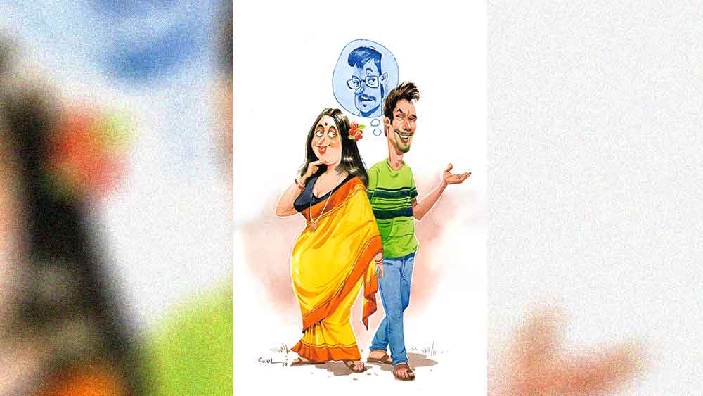

 
 <h1 align=center>রাসমেলা</h1>
<h2 align=center>সমীরণ বন্দ্যোপাধ্যায়</h2> রিজিওন্যাল ম্যানেজারের টেবিলে অ্যাপ্লিকেশনটা রাখতেই তিনি খেঁকিয়ে উঠে বললেন, “হোয়াট দ্য হেল ইজ় দিস?”

এ-ফোর সাইজ়ের টাইপ করা কাগজ। গোটা পৃষ্ঠায় রয়েছে সাকুল্যে তিনটে লাইন। এক বার চোখ বুলিয়েই ভদ্রলোক অনায়াসে জেনে নিতে পারতেন আবেদনের বিষয়বস্তু। কিন্তু সোমনাথের মতো গো-বেচারা এমপ্লয়িদের কথায়-কথায় দাবড়ে দিতে না পারলে কিসের সুপার বস!

কাচের চৌকো এই ঘরটায় ঢুকলে প্রতি বার সোমনাথের হার্টবিট প্রায় দ্বিগুণ হয়ে যায়। আর এমের হিটলার-সুলভ ব্যক্তিত্ব, চৌখস ইংরেজির সামনে নিজেকে মনে হয় কেঁচো বা ওই জাতীয় কোনও মনুষ্যেতর জীব!

ঘরটা পারতপক্ষে এড়িয়ে চলতে চেষ্টা করে সোমনাথ, কিন্তু রিপোর্টিং বস শুভেন্দুদা অফিসের কাজে দিল্লিতে। সকাল থেকে দু’বার ফোন করেছিল সোমনাথ। ধরেনি। মেসেজের উত্তরও দেয়নি। নিশ্চয়ই মিটিংয়ে। এক জন ব্যস্ত মানুষকে বারবার বিরক্ত করা উচিত নয়! ও দিকে আগামী কাল ছুটি ম্যানেজ করতে না পারলে অনিন্দিতাকে দেওয়া কথার খেলাপ হবে। কোটার সি এল আগেই শেষ। এখন উইদাউট নোটিশে ডুব দেওয়া মানেই, এক দিনের স্যালারি ঘচাং ফুঃ! অগত্যা।

“স্পিক আউট ডিয়ার! চুপচাপ দাঁড়িয়ে থেকো না, আমার সময়ের দাম আছে! জানতে চেয়েছি এটা কী!”

আর এম-এর হুঙ্কারে দম দেওয়া পুতুলের মতো সোমনাথ গড়গড় করে বলে গেল, “ওটা একটা ছুটির দরখাস্ত স্যর, মানে অ্যাপ্লিকেশন ফর লিভ। শুভেন্দুদার সঙ্গে যোগাযোগ করতে না পেরে সকালবেলা আপনাকে মেল করেছিলাম। কিন্তু রিপ্লাই না পেয়ে হার্ড কপি দিতে এলাম। গত দু’দিন ধরে মায়ের দাঁতে ভয়ঙ্কর যন্ত্রণা। কাল ডেন্টিস্টের কাছে না গেলেই নয়...”

“অ্যাজ় ফার অ্যাজ় আই ক্যান রিমেম্বার বয়,” হাত তুলে সোমনাথকে থামিয়ে আর এম বলে উঠলেন, “ফর ইয়োর ওয়েডিং, এই মাসের গোড়াতেই তুমি চার দিন ছুটি নিয়েছিলে। ঝড়বৃষ্টি, রাস্তা অবরোধ এবং মামা বা ওই জাতীয় কেউ মারা যাওয়ায় তার আগে আরও তিন দিন কামাই। সো, অ্যাকর্ডিং টু দ্য রুল্‌স অব দ্য কোম্পানি, এখন তোমাকে আর ছুটি দেওয়া যাবে না। যেদিন তোমার উইকলি অফ, ডেন্টিস্টের সঙ্গে অ্যাপয়েন্টমেন্টটা সে দিনই ফিক্স করো। এই ক’দিন তোমার মা পেনকিলার দিয়ে চালিয়ে নিন। আর হ্যাঁ, নেক্সট টাইম আমার ঘরে যখন ঢুকবে, মাস্ক যেন তোমার মুখে থাকে, চিবুকে নয়। ইউ ক্যান গো নাও।”

ঠান্ডা গলায় কেটে-কেটে বলা কথাগুলোর উত্তরে সোমনাথ লক্ষ্মীছেলের মতো ঘাড় ঠুকে কাচের ঘর থেকে বেরিয়ে হাঁপ ছেড়ে বাঁচল।

মায়ের দু’পাটি দাঁত অনেক দিন ধরেই বাঁধানো। তাই পেনকিলার খেয়ে যন্ত্রণা কমানোর রিজিওন্যাল ম্যানেজার সুলভ পরামর্শ কাজে লাগানো সম্ভব নয়। সোমনাথ চেয়েছিল, ‘মেরে পাস মা হ্যায়’ জাতীয় সেন্টু দিয়ে কোনও মতে কালকের দিনটা ম্যানেজ করতে। শুভেন্দুদা থাকলে হয়ে যেত। রোদ-জল-ঝড় মাথায় করে সপ্তাহে ছ’দিন সকাল থেকে রাত পর্যন্ত কলকাতার এটিএম থেকে এটিএমে টো-টো করে ঘোরা ছেলেগুলোর কষ্ট বোঝে শুভেন্দুদা। কিন্তু আর এম শক্ত ঠাঁই।

আসল কথা তাদের কোম্পানির কাজের যা ধরন, তাতে ছুটি পাওয়া মুশকিল। লক্ষ্মীপুজো, কালীপুজো, ইদ, মহরম, স্বাধীনতা দিবস কোনও কিছুতেই বাড়িতে বসে আয়েস করার উপায় নেই। বাঙালির অত সাধের দুর্গাপুজোতেও অষ্টমী পর্যন্ত অফিস করতে হয়। এই তো এত দিনের লকডাউনে দেশ-সুদ্ধু লোক মনের খুশিতে ছুটি খেয়ে নিল। কিন্তু সোমনাথদের অফিস খোলা। নিজেদের গরজেই কর্মীদের অফিস থেকে বাড়ি পর্যন্ত যাতায়াতের গাড়ির ব্যবস্থা করেছিল কোম্পানি।

হাতে থাকার মধ্যে সাপ্তাহিক ছুটির দিনগুলো। সে দিন এমনিই একটু বেলা করে বিছানা ছাড়তে ইচ্ছে করে। তার পর সংসারের হাজার কাজের চাপে কেমন ভাবে যে ঘণ্টা-মিনিট-সেকেন্ডগুলো ক্ষয় হয়ে যায়, টের পাওয়া যায় না।

তবে ভরসার কথা অনিন্দিতা খুব বুঝদার। কোনও অনুযোগ নেই, বরং ছোটখাটো অথচ ভীষণ জরুরি যে কাজগুলো সোমনাথ প্রায়ই করতে ভুলে যায়, অনিন্দিতা কখন যেন করে রাখে সেগুলো। ছাদের টবে শখের ফুলগাছগুলো বিয়ের পর থেকে এক দিনও জলের অভাবে নুইয়ে পড়ে না। এখন অফিসে বেরোনোর আগে প্রতিদিন তার পালিশ করা জুতো রাখা থাকে দরজায় পাশে। আগে সপ্তাহে মাত্র এক দিন জুতোয় বুরুশ-কালি ছোঁয়ানোর সুযোগ পেত সোমনাথ। দৈনন্দিন তুচ্ছতার মধ্যে ছড়িয়ে-ছিটিয়ে থাকে আরও অনেক কিছু, যার রেশ তার মনকে ভরিয়ে রাখে কানায়-কানায়।

বিয়ের পর এ হেন বৌয়ের প্রথম আবদার। কোন বর সেই আবদার পূরণ করার জন্য অফিসে একটু-আধটু মিথ্যে বলবে না!

বেরোনোর আগে অনিন্দিতা বলল, “তুমি ঘড়ি পরলে না? মোবাইলও তো নাওনি দেখছি।”

দু’আঙুলে আলতো করে বৌয়ের চিবুক ছুঁয়ে যাত্রার ঢঙে সোমনাথ বলে উঠল, “না প্রিয়তমা না, আজ ঘড়ি, মোবাইল কিচ্ছু নয়! আজকের এই মনোরম সন্ধ্যায় শুধু তুমি, আমি আর রাসমেলা। দু’জনে ইচ্ছেমতো ঘুরব, করোনাকে কাঁচকলা দেখিয়ে এগরোল-চাউমিন সাঁটাব, আরও অখাদ্য-কুখাদ্য... মেলায় যা-যা বিক্রি হয়, সব খাব। ঠান্ডা হাওয়ায় দাঁত ঠকঠকি লাগলেও পিছপা হব না আইসক্রিমের আস্বাদ গ্রহণে! ঘণ্টা, মিনিটের কাঁটায় বাধা পড়বে না যুগলের পদ-যুগল। মোবাইল দানবের রিংটোন হুঙ্কার বিঘ্ন ঘটাবে না আমাদের প্রেমালাপে!”

মিষ্টি হেসে অনিন্দিতা বলল, “অনেক হয়েছে। তোমার প্রেম-সংলাপের দৌড় রবীন্দ্রনাথ-নজরুলের কয়েকটা আধখ্যাঁচড়া কবিতা আর বৈষ্ণব পদাবলির ক’টা বাঁধাধরা ত্রিপদী। হায়ার সেকেন্ডারির বাচ্চারা ওসব পড়ে। যেদিন ‘ভ্রু-পল্লবে ডাক দিলে, দেখা হবে চন্দনের বনে’-শুনে বললে সেটা বিভূতিভূষণের লেখা, সে দিনই বুঝে গিয়েছি তোমার এলেম! বন-বাদাড় মানেই যেন বিভূতিভূষণ! তুমি এগোও, আমি মা আর পিসিকে বলে আসছি।”

ভাগ্যিস আবদার করেছিল অনিন্দিতা! মেলায় দাঁড়িয়ে সোমনাথের মনে হল, বাড়ি-অফিস-কলকব্জার যান্ত্রিক আবর্তের বাইরে, কত দিন বেহিসেবি সময় কাটানো হয় না। জীবনের সবটুকু সময়, যাবতীয় উদ্যম যদি প্রয়োজনের কোটা পূরণ করতে গিয়েই শেষ হয়, তবে আর কী পড়ে থাকে মনটা সতেজ রাখার জন্য!

মেলা মানেই মানুষের ভিড়। সঙ্গে কচিকাঁচার হইচই, ভেঁপুর আওয়াজ, চোঙা ফোঁকা কবিরাজি ওষুধ, টিয়াপাখি-জ্যোতিষী। সারি-সারি খেলনার দোকানের পাশাপাশি ফাস্ট ফুডের স্টল। লক্ষ্মী-শনির পাঁচালী, হেমন্ত মুখোপাধ্যায়ের গানের স্বরলিপি ধরনের বইয়ের দোকানও চোখে পড়ে এক-আধটা। আগে মেলায় মানুষ তেলেভাজা, জিলিপির খোঁজ করত, এখন লাইন দেয় এগরোল, চাউমিনের স্টলে। মেলার মাঠের এ প্রান্ত থেকে ও প্রান্ত পর্যন্ত ঠাসা ভিড়। অনেকের মুখেই মাস্ক নেই। দেখলে কে বলবে কিছু দিন আগেই করোনা-দানবের উৎপাতে নাভিশ্বাস উঠছিল পৃথিবীর, এবং সেই ত্রাস এখনও পুরোপুরি বিদায় নেয়নি দেশ থেকে!

সোমনাথের হাত ধরে অনিন্দিতা বলল, “অ্যাই কী ভাবছ বলো তো হাঁ করে দাঁড়িয়ে। চলো না ও দিকে, নাগরদোলায় চড়ি।”

অনিন্দিতার লম্বা সরু-সরু তিনটে আঙুল মুঠোয় চেপে সোমনাথ বলল, “উঁহু! নাগরদোলা পরে হবে। আপাতত কাচের বাক্সে বন্দি ওই সোনালি গোলকগুলো চোখ ঠেরে হাতছানি দিচ্ছে। চলো, ওদের ফুচকা-জন্ম সার্থক করি দু’জনে মিলে!”

 

মেলার সামান্য দূরেই বাস রাস্তা। আগে শুধুই বাস চলত। কয়েক বছর হল টোটো, অটো, ম্যাজিক ভ্যানের রুটও হয়েছে। চাঁদের আলোয় উত্তুরে হাওয়া মাখামাখি বাসস্ট্যান্ডে সোমনাথের গা ঘেঁষে দাঁড়িয়ে গাঢ় গলায় অনিন্দিতা বলল, “থ্যাঙ্ক ইউ!”

“কোনটার জন্য ম্যাডাম? ঝালে পোড়া ফুচকা, কেরোসিনের গন্ধওলা এগরোল নাকি আধগলা ঠান্ডাহীন আইসক্রিম!”

“উঁহু ও সব নয়। যখন ছোট ছিলাম, প্রতি বছর দাদুর হাত ধরে আসতাম এখানে। একটু বড় হয়ে বাবা-মায়ের সঙ্গে। তার পর বন্ধুরা মিলে। ভেবেছিলাম বিয়ের পরে আমার সেই ছোটবেলাটা হারিয়ে যাবে চিরদিনের জন্য, গ্রাম্ভারী খোলসের আড়ালে ঢেকে ফেলতে হবে নিজেকে। মেলায় এসে হুড়োহুড়ি করা ঘরের বৌকে মানায় নাকি! কিন্তু আজ বুঝেছি, করোনার মাস্ক ছাড়া অন্য কোনও মুখোশ পরার দরকার নেই আমার। তাই!”

মানানসই কিছু একটা বলতে যাচ্ছিল সোমনাথ। বেরসিক অথচ ভীষণ কাঙ্ক্ষিত লাস্ট বাসটা হাজির হল তক্ষুনি!

 

রেজ়িগনেশন লেটারটা টাইপ করে এক বার চোখ বুলিয়ে নিল সোমনাথ। অনিন্দিতাকে মিথ্যে বলেছিল সে। আসলে ঠিক মিথ্যে নয়, সত্যিটা গোপন করেছিল। পরশু আরএম ছুটি দিতে রাজি না-হওয়ার পর ভেবেছিল বাড়ি গিয়ে সব খুলে বলবে। অনিন্দিতা বুদ্ধিমতী, নিশ্চয়ই পরিস্থিতি আন্দাজ করতে পারবে।

কিন্তু রাতে খাওয়া-দাওয়ার পর, দু’চোখে আশা নিয়ে যখন সামনে এল অনিন্দিতা, সত্যিটা আর বলা হল না সোমনাথের। মোবাইলের সুইচ অফ রাখার আইডিয়াটা তখনই চিড়িক মেরেছিল মাথায়। 

চাপ হয়ে গেল মেলা থেকে ফিরে। সুইচ অন করার পর শিহরিত সোমনাথ দেখল, আর এম-এর নম্বর থেকে সতেরোটা মিসড কল অ্যালার্ট! অর্থাৎ যখন অনিন্দিতার হাত ধরে সে মেলার এ মাথা ও মাথা উড়ে বেড়াচ্ছে, তখনই মেঘ ঘনিয়ে উঠছে তার চাকরি-আকাশে!

অন্যান্য নম্বর থেকেও কয়েকটা ফোন এসেছে, কিন্তু সে সব খুঁটিয়ে দেখার মতো মনের অবস্থা ছিল না সোমনাথের। স্বয়ং রিজিওন্যাল ম্যানেজার সতেরো বার চেষ্টা করেও তাকে ফোনে পাননি, এর থেকে ভয়াবহ খবর আর কী হতে পারে!

সকালে অফিসে ঢোকার সময় যখন রিসেপশনিস্ট বলল আর এম তাকে দেখা করতে বলেছে, তখনই সোমনাথ বুঝে গিয়েছিল, কী ঘটতে চলেছে। গত মাসে একই অপরাধে চাকরি গিয়েছে এক জন হতভাগ্যের!

রেজ়িগনেশন লেটারটা হাতে নিয়ে কাচের ঘরের দিকে এগোল সোমনাথ। এই বাজারে চাকরি গেলে সমস্যা অনেক। মাসকাবারি ধার শুধতে না পারলে কথা শোনাবে পাড়ার মুদি দোকানদার। সময় মতো বিল জমা না-করলে কাঁচি হাতে লাইন কাটতে ছুটবে ইলেকট্রিক অফিসের লোকজন। মাসের দশ তারিখের মধ্যে কেবলের টাকা পরিশোধ না-হলে বিঘ্ন ঘটবে মা আর অনিন্দিতার সান্ধ্যকালীন সিরিয়াল সুখে।

কিন্তু কী করা যাবে। মায়েরা চিরকালই সর্বংসহা। অনিন্দিতাও আদর্শ জীবনসঙ্গিনী। সোমনাথ নতুন চাকরি না পাওয়া পর্যন্ত পরিস্থিতি মানিয়ে নেবে নিশ্চয়ই!

মোট কথা, আর কমপ্রোমাইজ় নয়। অফিসের বসরা চিরকাল সোমনাথের মতো কর্মচারীদের সঙ্গে ক্রীতদাসসুলভ ব্যবহার চালিয়ে যেতে পারেন না! এটা দু’হাজার বাইশের গণতান্ত্রিক ভারত, প্রাচীন যুগের রোম নয়। ভারতের স্বাধীনতার অমৃত মহোৎসবের বছরে সে কেন বসের চাপিয়ে দেওয়া পরাধীনতা মেনে নেবে! আজ আর এম-এর মুখের উপর রেজ়িগনেশন লেটার ছুড়ে বেরিয়ে আসবে সোমনাথ, যাতে তাকে বরখাস্ত করার সুযোগ না-পায় খিটকেলটা!

কিন্তু কাচের ঘরে ঢুকতেই সব তেজ মিইয়ে গেল সোমনাথের। মনের মধ্যে সাজিয়ে রাখা গনগনে কথাগুলো কে জানে কোথায় উধাও হল! কোনও কথা না বলে, রেজ়িগনেশন লেটারটা টেবিলে রেখে পাথরের মূর্তির মতো দাঁড়িয়ে থাকল সে।

আর এম কয়েক সেকেন্ড কাগজটায় চোখ বুলিয়ে তার দিকে তাকিয়ে বললেন, “এক জন এক্সপিরিয়েন্সড এমপ্লয়ি হিসেবে কোম্পানি তোমার কাছ থেকে আরও একটু সেন্স অব রেসপনসিবিলিটি আশা করে।”

কণ্ঠস্বর একই রকম শীতল। কথাতেও শেফিল্ডের ছুরির ধার কিন্তু এফোঁড়-ওফোঁড় করা চাহনিটা একটু যেন ব্যাকফুটে খেলছে আজ!

“রেনবো ব্যাঙ্কের বেকবাগান এটিএমে প্রবলেম হ

য়েছে। কাল যে ছেলেটাকে পাঠানো হয়েছিল সে নতুন, সমস্যাটা ধরতে পারেনি। মোবাইল অন রাখলে ওকে তুমি গাইড করতে পারতে। হোয়াটএভার... ইন ফিউচার এমন যেন না হয়। তুমি এখনই বেকবাগান রওনা হও। ব্যাঙ্ক ম্যানেজার বারবার ফোন করছেন।”

কথা বলতে-বলতে রেজ়িগনেশন লেটারটা দলা পাকিয়ে বাজে কাগজের ঝুড়িতে ছুড়ে ফেললেন আর এম!

 

অফিস থেকে বেরিয়ে বুক ভরে শ্বাস নিল সোমনাথ। দুষ্টু কালো ছেলেটা কাল সন্ধেবেলা নির্ঘাত তাদের দু’জনকে মেলায় হাত ধরাধরি করে ঘুরতে দেখেছে। আর এক বার যখন শ্রীমানের চোখে পড়েছে, বিশ্বের সবচেয়ে সুখী যুগলের সুখ, তা কেউ কি সহজে কেড়ে নিতে পারে! বরাবরই শুনে এসেছে, সে রাখলে নাকি আর কারও মারার উপায় নেই!

হাসি-হাসি মুখে আকাশের দিকে তাকিয়ে কৃতজ্ঞ সোমনাথ বিড়বিড় করে বলল, “থ্যাঙ্ক ইউ বস, থ্যাঙ্কস
আ লট!”