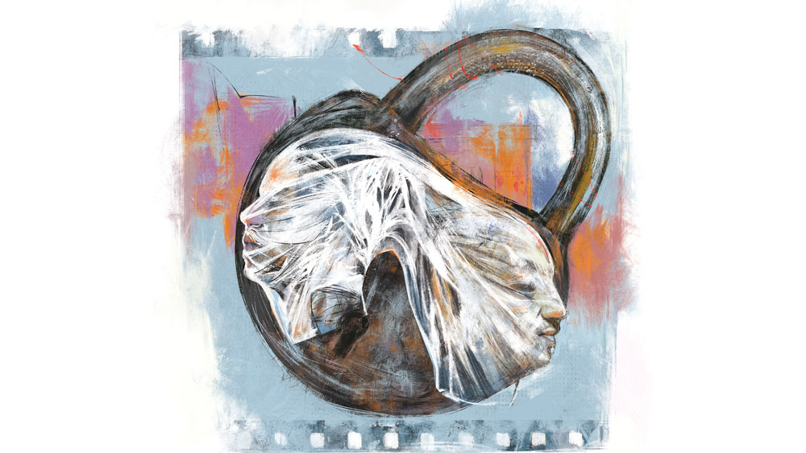

 

<h1 align=center>রূপলেখা</h1>
<h2 align=center>সুমন মহান্তি</h2>
ঋতু বিরক্ত হয়ে বলল, “অসম্ভব। এই ঘেমেনেয়ে ফিরলাম। আর বেরোনোর এনার্জি নেই। এই গরমে অন্ধকারে বসে আবার ঘামব? মাথা খারাপ?”   আমি পীড়াপীড়ি করলাম না। মনে মনে চেয়েছিলাম, একাই যাব। গৃহশান্তি বজায় রাখতে প্রস্তাবটা দিয়েছিলাম। আমার অধিকাংশ প্রস্তাবেই ঋতু সাড়া দেয় না, তা নিয়ে খুচরো অশান্তিও চলে। একুশ বছর ঘর করে ঋতুর ধাত চিনে গিয়েছি। ঋতু যাবে না জেনে খুশিই হলাম।   জামাপ্যান্ট পরে তাড়াতাড়ি রেডি হয়ে নিলাম। অর্ণা জিজ্ঞেস করল, “কোথায় যাচ্ছ বাবা?”   “রূপলেখা।”   অর্ণা হাসল, “একা?”   “হ্যাঁ। তুই যাবি?”   অর্ণা উত্তর দেওয়ার আগেই ঋতু উঁচু গলায় বলল, “একা নাচতে যাচ্ছ, যাও। মেয়েটাকে নিয়ে যাওয়ার মতলব কোরো না। সাতটায় ওর ফিজ়িক্সের স্যর পড়াতে আসবেন।”   “ভুলেই গিয়েছিলাম।”   অর্ণা নাক কুঁচকে বলল, “ছ্যা! ওই পচা হলে যেতে আমার বয়ে গেছে। এসি নেই। মাল্টিপ্লেক্স ছাড়া কেউ সিনেমা দেখে না কি? একটা ফ্লপ সিনেমা চলছে রূপলেখায়।”   “এখানে মাল্টিপ্লেক্স হবে না।”   “বয়ে গেল তাতে। ল্যাপটপ আর ওয়েবে দেখে নিলেই হল!”   ঋতু ফোড়ন কাটে, “তোর বাবার মাথায় মাঝে-মাঝে পোকা নড়ে, জানিস না?  অফিস থেকে এসেই কেউ এ ভাবে ছোটে?”   কথা না বাড়িয়ে বাইক স্টার্ট করলাম। ল্যাপটপ, স্মার্টফোনে সিনেমা দেখতে ইচ্ছে করে না। ম্যাক্রোর বদলে মাইক্রো হয়ে যাচ্ছে সব কিছু। বড় পর্দার সুখ অন্য কিছুতেই যে পাই না! প্রযুক্তিকে অস্বীকার করতে তো পারি না। তবু মনে হয় প্রযুক্তি কিছু ক্ষেত্রে বিচ্ছিন্ন আর একা হওয়ার অসুখ বাড়িয়েছে। ঘরে বসে সিনেমা দেখার অত সহজ সুযোগ না হলেই বোধহয় ভাল ছিল।   ঘড়িতে পৌনে ছ’টা, শো-টাইম সাড়ে পাঁচ। সিনেমার নামটাও মনে নেই, বাসস্ট্যান্ডে পোস্টার দেখেছিলাম রোববার বিকেলে, ইভনিং শোয়ের টাইমটা মনে আছে।   আমার তাড়া নেই। কম বয়স হলে হাঁপাতে-হাঁপাতে টিকিট-কাউন্টারে হাত গলিয়ে দিতাম। এই আটচল্লিশ বছর বয়সে আর সেই ছটফটানি আসবে না। আমি তো আসলে সিনেমা দেখতে আসিনি, এসেছি ‘রূপলেখা’-কে দেখতে। সিনেমা শুরু হয়েছে জানলে হাতে টিকিট নিয়ে ঊর্ধ্বশ্বাসে ছুটতাম এক সময়। আজ ধীরেসুস্থে সিঁড়ি বেয়ে দোতলায় গেলাম। ব্যালকনির টিকিট। নির্জন দোতলার বারান্দায় শুধু নিজের পায়ের শব্দ অনুরণিত হচ্ছিল কানে। লাইটম্যান টর্চ জ্বেলে টিকিট দেখে বললেন, “লাস্ট রো। বাঁ দিকের কোণে।”   “আজই শেষ ডিউটি?”   লাইটম্যান মানুষটির মুখে বিষণ্ণ হাসি ফুটল, “হ্যাঁ। আজ ডিউটি শেষ।”   অন্ধকারে তাঁর দীর্ঘশ্বাসের শব্দ স্পষ্ট টের পেলাম।   নির্দিষ্ট সিটে বসে চার দিকে চোখ বুলিয়ে নিলাম এক বার। এই রো-এ আর দু’জন দর্শক। এতগুলি রো-এ কত জন আছে, অনায়াসে গুনে ফেলা যায়। মাথা গুনে দেখলাম, সতেরো। হলের আলো-আঁধারিতেও অসুবিধে হল না। অধিকাংশই কমবয়সি, জোড়ায়-জোড়ায় বসে আছে, কলেজ-ইউনিভার্সিটির স্টুডেন্ট মনে হচ্ছে। ব্যালকনির বিস্তৃত পরিধিতে আমিই সম্ভবত ব্যতিক্রমী, একমাত্র বয়স্ক পুরুষ। পর্দায় কী ঘটে চলেছে তা দেখছি না এখনও, পর্দার ওপরে আলোর ফুলকি দেখছি। ঘড়ঘড় শব্দে ঘুরে চলা শ্রান্ত পাখাগুলির দিকে তাকালাম। কাল থেকে ওরা অনন্ত বিশ্রামে যাবে। ব্যালকনির অন্ধকার দেয়ালে মাথার ডান দিক রেখে আলস্যে চোখ বন্ধ করে রাখলাম কিছু ক্ষণ। পা দুটোকে অনর্থক কষ্ট কেন দেব, দিব্যি পা তুলে দিলাম সামনের চেয়ারে। সামনের রো একেবারে ফাঁকা, আপত্তি জানানোর কেউ নেই। এ বার বরং সিনেমাটা দেখা যাক। সফেন স্বপ্নের জগতে শেষ বারের মতো ঘুরে আসা যাক। রূপলেখা এত কাল স্বপ্ন ফেরি করেই তো এসেছে, তার রুপোলি পর্দায় চোখ রেখে কত হাজার-হাজার চোখ কয়েক ঘণ্টার জন্য সব ভুলে রঙিন স্বপ্নময় হয়েছে। আমিও হয়েছি এক সময়। অনেক ক্ষণ হয়ে গেছে, তাই সিনেমাটা বুঝতে অসুবিধে হচ্ছে। তাতে দুঃখ হল না, শ্রান্ত দু’চোখ জুড়ে ঘুম আসছে, বিশ্রাম চাইছে শরীর।   বেলের শব্দে ধড়মড়িয়ে জেগে উঠলাম। ইন্টারভ্যাল। ঘুমিয়েই পড়েছিলাম! বেজায় গরম পড়েছে আজ, শার্ট ভিজে গেছে ঘামে। বাথরুম থেকে দোতলার বারান্দায় এসে সিগারেট ধরালাম। এখান থেকে শহরের ভিউ পাওয়া যায়। হ্যালোজেন আর নিয়ন আলো জ্বলে উঠেছে চার দিকে, রাস্তায় অটো-টোটো-বাইকের ভিড়, ব্যস্ত শহর এখনও ছুটছে। সামনের রাধাচূড়া গাছটি আলোর ছটায় উজ্জ্বল, হলুদ আলো তার গায়ে, শেষ বারের মতো রূপলেখার ফ্লুরোসেন্ট আলো শরীরে মেখে নিচ্ছে সে। নীচে নেমে দোকান থেকে ভাঁড়ে চা নিলাম। হলের সামনে সিনেমার বিশাল পোস্টারটা নিষ্প্রভ আর ম্রিয়মাণ দেখাচ্ছে। শেষ বারের মতো রূপলেখা বাহারি অলঙ্কারে সেজে উঠলে ভাল হত।   ইন্টারভ্যালের পরে আবার সিনেমা শুরু হয়ে গেছে। সিঁড়ি বেয়ে দোতলায় উঠে এলেও বারান্দায় দাঁড়িয়েই থাকলাম। আরও হয়তো অনেক সিনেমা দেখার সুযোগ পাব জীবনে, কিন্তু এ ভাবে এই স্বপ্নের বারান্দায় দাঁড়ানোর সুযোগ যে হবে না আর। রূপলেখার মালিক কে, কী তাঁর নাম, কোথায় থাকেন, কিছুই জানি না। এই মুহূর্তে সেই মালিক ভদ্রলোকটির ওপর ক্ষোভ এবং রাগ হল। পাশের শহরেও তাঁর একটি হল ছিল, সেটা বেচে দিয়েছেন তিন বছর আগেই। রূপলেখা কার নাম? তাঁর মেয়ের না বৌয়ের? হয়তো এই শৌখিন আধুনিক নামটি তাঁর পছন্দ হয়েছিল, মনে ধরেছিল। শহরের সেরা সিনেমাহল ‘রূপলেখা’, ছিমছাম দৃষ্টিনন্দন। ‘রূপলেখা’-তে প্রথম পা রেখেছিলাম ষোলো বছর বয়সে। অন্য হলগুলোয় বাংলা সিনেমা চলত, ‘রূপলেখা’ হিন্দি সিনেমাই নিয়ে আসত। তখন হিন্দি সিনেমা নিয়ে রক্ষণশীলতা ছিল, কমবয়সে হলে গিয়ে হিন্দি সিনেমা দেখার অনুমতি পেতে সমস্যা হত। সরস্বতী পুজোর পরের বিকেল, ঠাকুর দেখতে যাওয়ার নাম করে সাইকেল চালিয়ে সোজা রূপলেখা। টিকিট কাউন্টারে দুরুদুরু বুকে হাত বাড়িয়ে দিলাম। সিনেমার নাম ‘সংযোগ’, জিতেন্দ্র এবং জয়াপ্রদা ছিলেন মনে আছে, ওটাই প্রথম দেখা হিন্দি ছবি। প্রথম যৌন ইঙ্গিতপূর্ণ গানের দৃশ্যও এখানেই দেখা— “দিল কেয়া চাহে ম্যায় কেয়া চাহুঁ/ সব জানকে ভি আনজান হো কিঁউ।”   বয়সের তুলনায় ওই ব্যাপারে অজ্ঞ ছিলাম, গানটা নিয়ে স্কুলের বন্ধুদের মধ্যে ঠাট্টা-মশকরা হত খুব। প্রথম বার রূপলেখার অন্দরমহলে ঢুকেই তার প্রেমে পড়ে গিয়েছিলাম। তার পর একা এসেছি ক’বার মনে পড়ে না। বন্ধুবান্ধবের সঙ্গে এসেছি বহু বার, বিয়ের পরে ঋতুকে নিয়েও এসেছি বেশ ক’বার। শেষ এসেছিলাম বছর দেড়েক আগে। ঋতু আসতে চায় না। বলে, বয়স হয়েছে, হলে গিয়ে সিনেমা দেখার ধৈর্য নেই। অর্ণা দু’-তিন বার বন্ধুদের নিয়ে এসেছে। হলটা তার পোষায় না। কেউ আসতে চায় না, একা আসতে বোকা-বোকা লাগে। বিদায়লগ্নে মন অস্থির হচ্ছিল খুব।   না, সিটে গিয়েই বসা যাক এ বার। সিনেমায় মন বসছে না, রূপসী রূপলেখার অন্দরমহল শেষ বারের মতো দেখে নিতে হবে। রাস্তা থেকে বাইরের রূপ হয়তো আর কিছু দিন দেখতে পাব। বুলডোজার এবং বড় বড় ক্রেন মাটিতে মিশিয়ে দেবে তাকে। অফিশিয়ালি আজই রূপলেখার শেষ দিন। একটু পরে শো শেষের বেল বেজে উঠবে। ওটা আসলে রূপলেখার মৃত্যুঘণ্টা, নাইট শো আজ হবে না। মৃত্যুঘণ্টা তো শুনতে আসিনি, কৈশোর-যৌবনের স্মৃতিময় বহুবর্ণ আধার ‘রূপলেখা’-কে বিদায় জানাতে এসেছি।   দেখতে-দেখতে শেষ হল সিনেমা। ব্যালকনির প্রান্তে গিয়ে নীচের দিকে তাকালাম। জনাপঞ্চাশ দর্শক ছিল রিয়ার স্টলে। একে একে বেরিয়ে যাচ্ছে। রুপোলি পর্দার ওপর আলোর মালা, হলের আলোয় ফাঁকা সিটগুলো নিঃসঙ্গতার গান গাইছে।   বাইরে এসে দেখলাম, এক ভদ্রলোক হাতে রজনীগন্ধার মালা নিয়ে দাঁড়িয়ে আছেন।   ভদ্রলোককে কোথায় যেন দেখেছি। মনে পড়েছে, শহরের নামকরা দোকান ‘সাহা টেক্সটাইল’-এর মালিক। হলের সামনের খোলা জায়গাটাও ফাঁকা হয়ে গিয়েছে, পান-সিগারেট-কোল্ড ড্রিংকসের দোকান ঝাঁপ বন্ধ করছে। এই সময় হাতে মালা নিয়ে দাঁড়িয়ে কেন এই ভদ্রলোক?   কাছে গিয়ে জানতে চাইলাম, “সাহা টেক্সটাইল আপনার না?”   “হ্যাঁ। আমার নাম প্রিয়তোষ সাহা। আপনি?”   “আমার নাম রমেন দত্ত। সুভাষপল্লিতে থাকি।”   “সিনেমা দেখতে এসেছিলেন?”   “হ্যাঁ।”   “আমি কিন্তু সিনেমা দেখতে আসিনি,” প্রিয়তোষ বললেন।   “ও!”   “রূপলেখাকে বিদায় জানাতে এসেছি। এখানকার সমস্ত স্টাফ আমার চেনা। ওদের এক জন আসবে বলেছে। মালাটা স্ক্রিনের নীচে রাখব। আপনি বোধহয় অবাক হচ্ছেন খুব?”   “না। মনে হচ্ছে সমব্যথী এক জনকে পেয়েছি।”   প্রিয়তোষ বিমর্ষ গলায় বললেন, “সকাল থেকে মনটা খুব খারাপ। কাপড়ের দোকান, ব্যবসা মন্দ হয় না, তবে প্রচুর টাকা বলতে যা বোঝায় তা নেই। হাতে তেমন টাকা থাকলে এই হল আমি কিনেই নিতাম। চার কোটি টাকায় বিক্রি হয়েছে শুনেছি।”   “সিনেমাহল তেমন চলে না আজকাল। তেমন লাভ থাকলে মালিক নিশ্চয়ই বিক্রি করত না।”   প্রিয়তোষ মাথা নেড়ে বললেন, “শুধু লাভ-ক্ষতি দিয়ে কী আর সব মেলানো যায়?”   “তা হলে?”   “বিয়ের পর থেকে টানা একুশ বছর এখানে এসেছি। বৃহস্পতিবার দোকান বন্ধ। আমি আর মিসেস প্রতি বৃহস্পতিবার ম্যাটিনি শো-এ আসতাম। সারা সপ্তাহে ওটাই ছিল  একমাত্র বিনোদন। ঝড়-জল-বৃষ্টি কিছুতেই বাদ যেত না, বুঝলেন? তার পর মিসেস অসময়ে পরপারে চলে গেল, আমিও আসা বন্ধ করে দিলাম,” প্রিয়তোষ ম্লান হাসেন।   “আচ্ছা।”   “এই হলের প্রতিটি ইঞ্চিতে আমাদের একান্ত আলাপের স্মৃতি আছে। জয়েন্ট ফ্যামিলি, ব্যবসাটা শুরু করেছিলেন বাবা। রাতের সময়টা ছাড়া ঘরে সে ভাবে নিভৃতে কাছাকাছি হওয়ার সুযোগ ছিল না। কোথাও ঘুরতে যাওয়া হত না সে ভাবে। যৌবনে এই রূপলেখাই ছিল আমাদের পুরী-সিমলা-গ্যাংটক, সপ্তাহে এক দিন ভালবাসার সফর,” চশমা খুলে কাচ মুছলেন প্রিয়তোষ। তাঁর চোখ ঝাপসা দেখাল।   এক জন বাইরে এসে ডাকল, “সাহাদা, আসুন।”   প্রিয়তোষ বললেন, “একটু যাবেন না কি ভেতরে?”   “চলুন।”   বিশাল রুপোলি পর্দার সামনে প্রিয়তোষ এসে দাঁড়ালেন। পাশে চুপচাপ সমস্ত স্টাফ এসে দাঁড়াল। মঞ্চের ওপর রজনীগন্ধার মালা 
রেখে ভেজা গলায় বললেন, “রূপলেখার জন্য এর বেশি কিছু করতে পারলাম না।’’   বিশাল হলে পর্দার সামনে স্টাফেরা মৌন পাংশুটে মুখে দাঁড়িয়ে আছে, বিষণ্ণ চোখে চার দিক দেখছে। প্রিয়তোষ প্রতিটি স্টাফকে জড়িয়ে ধরলেন। এক জন ধরা গলায় বলল, “সাহাদা, আমাদের মালিক যদি আপনার মতো হতেন, তা হলে এই দিন দেখতে হত না। হল কিন্তু খারাপ চলছিল না। শহরের বাকি দুটো হল বন্ধ হয়ে যাওয়ার পর লোকজন এখানেই সিনেমা দেখতে আসত। উনি ক্ষতির অজুহাত দেখিয়ে প্রোমোটারকে বেচে দিলেন। হলটার ওপর খুব মায়া পড়ে গেছিল দাদা। কান্না পাচ্ছে।”   “সবাই এ বার নতুন করে কাজ খুঁজছে নিশ্চয়ই?”   “পেট চালানোর জন্য কাজ তো খুঁজতেই হবে। অনেক বিক্ষোভ আর আন্দোলনের পরে মালিক প্রত্যেককে পাঁচ লাখ করে ধরিয়ে দিয়েছে। ওতে ক’দিন চলবে? এই বয়সে তেমন কাজ কে আর দেবে?”   প্রিয়তোষ বললেন, “খোঁজ পেলে বলব। দোকানে সেল্‌সের কাজ করতে পারবেন?”   “দরকারে মোট বইতেও পারব।”      ঘরে ফিরতেই ঋতু কৌতুকের চোখে আমার দিকে তাকাল, “মুখ কালো কেন? খুব দুঃখের সিনেমা বুঝি?”   “হ্যাঁ। দেখলাম যে, আমাদের জীবনের স্বপ্নগুলো, উজ্জ্বল স্মৃতিগুলো সব একে একে বিক্রি হয়ে যাচ্ছে। কেনারাম আর বেচারাম দাপিয়ে বেড়াচ্ছে।”   “এটাই গল্প?”   “হ্যাঁ। দুটো পাগল সে সব দেখছে, আর দীর্ঘশ্বাস ফেলছে। ওটা অবশ্য সাব-প্লট।”   ঋতু হালকা গলায় বলল, “না গিয়ে তা হলে তো ভালই করেছি। অত জটিল বিষয় পোষাত না, মাথা ধরে যেত। টাকা খরচ করে শোকের ছবি দেখার কোনও মানে হয়?”
