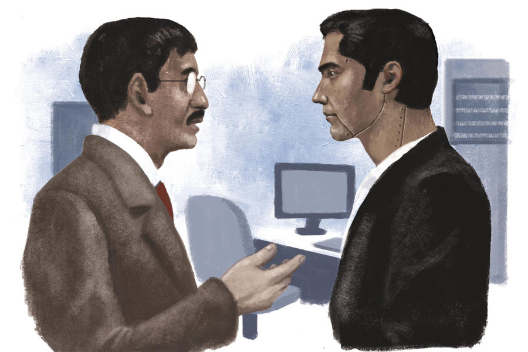

 
 <h1 align=center>রোবটের গল্প</h1>
<h2 align=center>অম্লানকুসুম চক্রবর্তী</h2> আমার মুখের দিকে অদ্ভুত ভাবে তাকিয়ে ছিলেন বিজন বিশ্বাস। স্যুট-টাই পরা লোক। হাতে খুব দামি একটা মোবাইল। মডেলের নাম, আইএমইআই নম্বর সব বলে দিতে পারি। বলছি না। গায়ের দুর্দান্ত পারফিউমটার নাম, টপ নোট, বটম নোট, তার উৎপত্তি নিয়ে যাবতীয় তথ্য আমি এখনই বলে দিতে পারি। বলছি না। বিজন বিশ্বাসের সুন্দর গন্ধকে অবশ্য একটু পরে এক ধরনের ঘেমো গন্ধ ছাপিয়ে যায়। ঘামের গন্ধ কেন এমন হয়, নাক সিঁটকানোর নেপথ্যে কী কী মলিকিউল খেলা করে, সেটাও আমি এই মুহূর্তে বলে দিতে পারি। বলছি না। একটা মিটিং রুমে বিজন বিশ্বাস আমাকে হ্যান্ডওভার দিতে এসেছিলেন। এক জন কাজ ছেড়ে চলে যাওয়ার সময় পরের জনকে, মানে ওই জায়গায় যিনি এসেছেন, তাঁকে যখন কাজকর্মগুলো বুঝিয়ে যান, ওই প্রসেসটাকেই হ্যান্ডওভার বলা হয় কর্পোরেট জগতে। মিটিং রুমে সিইও সাহেবও ছিলেন। হাসছিলেন মিচকি মিচকি।

বিজন বিশ্বাস আমাকে বোঝানোর চেষ্টা করছিলেন কোনও জটিল সেল্‌স রিপোর্টের কী ভাবে অ্যানালাইসিস করতে হয়। আমি হালকা ঘাড় নেড়ে বলেছিলাম, “জানি তো মিস্টার বিশ্বাস।”

উনি বলছিলেন, “না না, এত সহজে জানি বললে হবে না, এটা বেশ জটিল ব্যাপার। গত পাঁচ বছরের সেলস ট্রেন্ডটা গ্রাফের মতো করে দেওয়া রয়েছে এই রিপোর্টে, দেখুন। কোন লাইনটার ক্রমাগত ওঠার সময় হঠাৎ একটা ডিক্লাইন হয়েছে সেটা ভাল ভাবে বোঝা প্রয়োজন। কোম্পানির পঁয়ত্রিশখানা প্রোডাক্ট লাইন। সব ক’টা লাইনের জন্য একটা করে গ্রাফ। প্রথম প্রথম দেখে তো আমার চাউমিনের মতো লাগত। আস্তে আস্তে অভ্যেস হয়ে যায়।”

আমি আবার বললাম, “আই নো। আই আন্ডারস্ট্যান্ড।”

বিজন বিশ্বাস আবার বললেন, “না না, এই মূল রিপোর্টটা ভাল ভাবে বোঝার জন্য আরও কিছু সাপোর্টিং রিপোর্ট রয়েছে। বারো জনের একটা টিম কাজ করে এই রিপোর্টগুলো বানানোর জন্য। সিইও সাহেব কিন্তু খুব ডিটেলড অ্যানালাইসিস চান। অ্যাকশন প্ল্যানও। এগুলোর উপরেই নির্ভর করে রয়েছে কোম্পানির আগামী দিনের বিজ়নেস স্ট্র্যাটেজি।”

দেখি, সিইও সাহেব কাঁধটা একটু শ্রাগ করে বললেন, “ইয়েস বিজন, ইউ আর অ্যাবসিলিউটলি রাইট। এনিওয়েজ়। আর কিছু বলবে?”

এই ‘এনিওয়েজ়’ কথার মধ্যেই হয়তো অনেক কিছু বুঝিয়ে দেওয়ার চেষ্টা করেছিলেন সিইও সাহেব। বিজন বিশ্বাস তবু বিড়বিড় করে যান। করতেই থাকেন। উনি বলছিলেন, “স্যর, হ্যান্ডওভারটা দিতে পেরে আমি অতটা খুশি হলাম না। আরও অনেক কিছু বলার ছিল। মার্কেট সিনারিয়োর সঙ্গে তাল মিলিয়ে কী ভাবে বিজ়নেস ডিসিশনগুলো পাল্টানো প্রয়োজন, জরুরি ভিত্তিতে যে কলগুলো নেওয়ার প্রয়োজন— তা নিয়ে তো কিছুই বলা হল না। দিস ইজ় অল অ্যাবাউট দি অ্যানালাইসিস অব দ্য ডেটা স্যর।”

আমি আবার ঘাড় নামিয়ে, মৃদু হেসে বললাম, “আমি জানি মিস্টার বিশ্বাস। এনিথিং এলস?”

সিইও সাহেব আমাকে সমর্থন করলেন, শরীরী ভাষায়। আমিও আসলে চাইছিলাম যত তাড়াতাড়ি সম্ভব এই হ্যান্ডওভার পর্বটা শেষ করে দিতে। আমি তো জানি সবই। বিজন বিশ্বাস বিড়বিড় করে বলতে চাইছিলেন কিছু। এ বারে সিইও-র গলার আওয়াজে আগের ধ্বনির থেকে ২৪.৮২ ডেসিবেল যুক্ত হয়। মানে গলার জোরটা আরও বাড়ে আর কী! অ্যাকিউরেট ডিটেলস দেওয়ার লোভ থেকে নিজেকে সামলাতে পারি না। সিইও বললেন, “বাইশ তলার ছাদে গিয়ে হাওয়া খাওয়ার সময় এত কিছু মনে ছিল না বিজন? তাও বিজ়নেস আওয়ার্সে? ঠিক আছে, চলো, অল দ্য বেস্ট।”

সিইও হাতটা বাড়িয়ে দেন। বিজন বিশ্বাসও। আমি দেখতে পেলাম, বিজন বিশ্বাসের হাতের তালু চটচট করছে ঘামে। আর হাতটা বাড়াতেই ওঁর গা থেকে উড়ে এল সেই ঘেমো গন্ধটা, যেটার কথা বলেছিলাম আগে। আবার বিড়বিড়। বললেন, “সারা দিন এত প্রেশারের মধ্যে একটু রিল্যাক্স করতে গিয়েছিলাম স্যর। চোদ্দো ঘণ্টা কাজ করেছি দিনের পর দিন। মাসের পর মাস। ছাদে যাওয়াটা কত ক্ষণের ব্যাপার ছিল স্যর? দশ মিনিট? এর চেয়ে বেশি তো নয়। আমি কি যন্ত্র?”

সিইও-র ঝটিতি উত্তর ছিল, “কোম্পানি ক্যানট অ্যাফর্ড দ্যাট বিজন। ঠিক আছে, ইউ মে গো নাউ।”

আমি বিজন বিশ্বাসকে বললাম, “আমার ফোন নম্বর তো রইলই। আপনি আমায় ফোন করতে পারেন, টোয়েন্টি ফোর ইনটু সেভেন, তিনশো পঁয়ষট্টি দিন, যখন খুশি। আপনি তো জানেন আমি রাতে ঘুমোই না। আমার ঘুমের প্রয়োজন নেই।”

বিজন বিশ্বাস আমার দিকে কেমন যেন বিবর্ণ দৃষ্টিতে তাকিয়েছিলেন।

সোজা কথা সোজা ভাবে বলা পছন্দ করি, কাব্য করতে পারি না। আমি রোবট তো, তাই। আর্টিফিশিয়াল ইনটেলিজেন্স কিংবা কৃত্রিম বুদ্ধিমত্তা বলে আপনারা যেমন নাম-টাম দিয়েছেন আর কী, আমার মধ্যে ওই সব আছে। আমাদের কোম্পানির ভাইস প্রেসিডেন্ট বিজন বিশ্বাসের চাকরি গিয়েছে। চোদ্দো বছর উনি ছিলেন এখানে। রিপোর্ট করতেন সিইও সাহেব, অরুণ কুপ্পুস্বামীকে। মাসখানেক আগে সিইও-র ডাকা একটি মিটিংয়ে আসতে দেরি করেছিলেন। সারা রাত ধরে ডেটা ঘেঁটে, ৯২টা স্লাইডের একটা প্রেজ়েন্টেশন বানানোর পরে বিজন বিশ্বাসের মাথা ধরেছিল। মিটিং শুরু হওয়ার কথা ছিল দুপুর তিনটেয়। উনি দুপুর দুটো পঞ্চান্ন মিনিট থেকে তিনটে পাঁচ অবধি ছাদে গিয়ে রিল্যাক্স করছিলেন। মানে, হাওয়া খাচ্ছিলেন আর কী। কোম্পানি ভাল ভাবে এটা নেয়নি। তাই তাড়িয়ে দিয়েছে।

মনে হতে পারে, চোদ্দো বছর কাজ করার পরে এমন কারণে আবার কাউকে তাড়ানো যায় নাকি? উত্তরটা সোজাসুজি দিই। কাব্য করতে পারি না। উত্তর হল, এমন কারণেও তাড়ানো যায়। ভাইস প্রেসিডেন্ট বিজন বিশ্বাস সাড়ে পাঁচ কোটি টাকা পেতেন বছরে। এই হাওয়া খাওয়াটা আমাদের মাল্টিন্যাশনাল কোম্পানি মেনে নিতে পারেনি। অনেক দিন ধরেই বিজন বিশ্বাসকে সরানোর তালে ছিল। বারো কোটি টাকা দিয়ে আমায় কিনে এনেছে। কোম্পানির কাছে এটা ওয়ান টাইম ইনভেস্টমেন্ট। আমাকে ইনসেন্টিভ দিতে হবে না। বছর বছর ইনক্রিমেন্টও দিতে হবে না। বিজন বিশ্বাসের বছরদুয়েকের মাইনে দিয়ে একটা নতুন বিজন বিশ্বাস চলে এল এই অফিসে! হি হি!

আমার একটা নাম দেওয়া হয়েছে। ম্যাজিকভিপি। ভিপি মানে ভাইস প্রেসিডেন্ট। নিকনেম ম্যাজি। খুব মিষ্টি না? বিজন বিশ্বাস পাঁচ বছরের ডেটা নিয়ে কাটাছেঁড়া করতেন। আমার মগজে ঢুকিয়ে দেওয়া রয়েছে একাশি বছরের ডেটা। ১৯৪২ সালে আমাদের কোম্পানির প্রতিষ্ঠা হয়। প্রথম দিনের ব্যবসার খতিয়ান থেকে মাত্র তিরিশ সেকেন্ড আগের সেলস আপডেট— সব আমার নখদর্পণে। না না, ভুল বললাম, চিপদর্পণে। মানুষের মতো দেখতে হলে কী হবে, আমার শরীরে যে বসানো আছে কয়েক হাজার চিপ।

যে কেবিনে বিজন বিশ্বাস বসতেন, সেখানেই আমি বসি। চব্বিশ ঘণ্টাই বসি। আমার কোনও ছুটি নেই। চা-কফি খাই না। সিগারেট-অ্যালকোহল খাই না। খাবার খাই না। আমার চকচকে ত্বকটা পুরোটাই সোলার সেল। সেক্টর ফাইভে বাইশ তলা বিল্ডিং আমাদের কোম্পানির। আমি বসি সতেরো তলার একটা ঘরে। পিছনেই বিরাট একটা ঝিল। ওই ঝিলটার ল্যাটিটিউড লঙ্গিটিউড বলার জন্য আমার মুখ ব্যাকুল। বলছি না। সকালে অনেকটা সময় জানলার পর্দা তোলা থাকে। সূর্যের আলো এসে পড়ে আমার সারা পিঠে। আমি তাজা হয়ে যাই। আপনাদের ভাষায়, চার্জড।

আমার কাজের বাইরে কিছু করার প্রয়োজন নেই। আড্ডার ইতিহাস জিজ্ঞেস করলে পাঁচ হাজার শব্দের প্রবন্ধ নামিয়ে দিতে পারি ৪.২১ সেকেন্ডে। কিন্তু আড্ডা মারা আমার অ্যালগরিদমে নেই। যে কোম্পানি আমায় বানিয়েছে, তারা অবশ্য প্রোডাক্ট গাইডে লিখে দিয়েছে, আমি নিজেই নিজেকে ইভল্‌ভ করতে সক্ষম। আমি সারা দিন ডেটা খাই। সারা রাতও। বিজন বিশ্বাসের ৯২ স্লাইডের যে প্রেজ়েন্টেশন বানাতে দিন রাত মিলিয়ে ২৬ ঘণ্টা লাগত, আমার তা করতে লাগে আড়াই মিনিটের মতো। সিইও সাহেব, অর্থাৎ অরুণ কুপ্পুস্বামীকে কোনও রিভিউ মিটিংয়ের আগে জিজ্ঞেস করি, “আমার জন্য কত ক্ষণ বরাদ্দ, স্যর?” উনি যদি বলেন ‘বত্রিশ মিনিট’, আমি ঠিক ৩১ মিনিট ৫৯ সেকেন্ডে ‘থ্যাঙ্ক ইউ’ বলে উঠি। ১৩৫টা স্লাইডের প্রেজ়েন্টেশনে প্রতিটি স্লাইডের জন্য বরাদ্দ রাখি ১৪.২২ সেকেন্ড। বুঝলেন না তো? ৩২ মিনিট মানে কত সেকেন্ড হয়? ১৯২০ সেকেন্ড। ওই সংখ্যাকে ১৩৫ দিয়ে ভাগ করুন।

কুপ্পুস্বামী আমার প্রেজ়েন্টেশন স্কিলস-এ ভীষণ খুশি। পিঠ চাপড়ে বলেন, “ভেরি গুড জব ডান ম্যাজি।”

প্রেজ়েন্ট করার সময় আমি তোতলাই না। জল খাই না, কারণ আমার গলা শুকোয় না। ঢেকুর ওঠে না, হাঁচি-কাশি তো সিলেবাসেই নেই। দুনিয়ার মার্কেট সিনারিয়োর অ্যানালিসিসকে ‘জটিল, জটিল’ বলে মেলা বকেছিলেন বিজন বিশ্বাস, হ্যান্ডওভার পর্বে। সেটা পড়ে, বুঝে, গ্রাফ বানাতে আমার লাগে ১৭ সেকেন্ড। আমার টিমে, আমার নীচে রয়েছে যারা, তারা আমায় দেখে সেলাম ঠোকে। ভয়েও কাঁপে।

ভয় পাবে না-ই বা কেন? অফিসের টিমটাকে আমি পুরো ছেঁটে দিয়েছি। বিজন বিশ্বাসের কথায়, ১২ জনের যে টিমটা সাপোর্টিং রিপোর্ট বানাত, ওদেরকে আমি আসার এক মাসের মধ্যে বিদায় করা হয়েছে। আমিই আমার সাপোর্টিং। আমিই একটা প্রেজ়েন্টেশনের শেষে অ্যাকশন প্ল্যানের নীচে এই ছেঁটে দেওয়ার কথা সাজেস্ট করেছিলাম।

অরুণ স্যর বললেন, “ওয়ান্ডারফুল, ম্যাজি।”

স্যরকে বললাম, “আমাকে একটা হাজার গিগাবাইটের ক্রিয়েটিভ ইনপুট দিয়ে দিন। তা হলে মার্কেটিং টিমটাকেও উপড়ে দেওয়া যাবে।”

কুপ্পুস্বামী বললেন, “ফ্যাবিউলাস ম্যাজি। আমি আমাদের কোম্পানির মালিক আর তোমার ম্যানুফ্যাকচারারের সঙ্গে কথা বলব।”

আমি জানি, সরকারি আর্ট কলেজ থেকে পাশ করা সাত-আট জনের টিম আছে মার্কেটিংয়ে। পঁচিশ থেকে সাতাশ হাজারের মধ্যে পায় প্রতি মাসে। কিন্তু ওদের খুব ইনক্রিমেন্টের লোভ। পঁচিশ হাজারকে সাত দিয়ে গুণ করলে মাসে ১ লক্ষ ৭৫ হাজার টাকা হয়। কোম্পানির কাছে এটা কম টাকা নয়। এই হিসাবটা ধরিয়ে দিতেই কুপ্পুস্বামীর চোখ থেকে হাজার ওয়াটের আলো ঠিকরে পড়ছিল। বলেছিলেন, “ইউ আর আ কিং, ম্যাজি। তুমি রাজার মতো বাঁচবে। তোমায় মাথায় রাজমুকুট।”

আবার একটু ঠোক্কর খাবেন জানি, কিন্তু আমি সোজা কথা সোজা করে বলি। বেশি কাব্য করতে পারি না। আমাকে রাজা বলার মাসতিনেকের মধ্যে কুপ্পুস্বামীরও চাকরি যায়। কেবিনে লাগানো সিসিটিভির ফুটেজ থেকে জানতে পারা যায়, উনি বিজ়নেস আওয়ার্সে একটা ওটিটি সিরিজ় দেখছিলেন। সিরিজ় নয় অবশ্য। কোনও আসন্ন সিরিজ়ের ট্রেলার। ৩ মিনিট ৫২ সেকেন্ড ধরে উনি ট্রেলারটা দেখেন। আমাদের কোম্পানির মালিক বসেন নিউ ইয়র্কে। তার কাছে খবরটা যায়।

পরের দিন সকালে মিটিং রুমে ভিডিয়ো কনফারেন্স শুরু হয়। স্ক্রিনের ও প্রান্তে মালিক। কুপ্পুস্বামী বললেন, “নেক্সট ফিনানশিয়াল ইয়ারে এশিয়া-প্যাসিফিকের সেলস প্রোজেকশন নিয়ে একটু ডিস্টার্বড ছিলাম। ম্যাজির করা রিপোর্টে দেখেছিলাম, গ্লোবাল ট্রেন্ডটা সুবিধের নয়। টেনশনে ছিলাম। একটু রিল্যাক্সড হচ্ছিলাম ট্রেলারটা দেখে।” গ্লোবাল হেড, মানে মালিক বললেন, “স্যরি, উই ক্যানট অ্যাফর্ড দিস। আপনি প্লিজ় আসুন।”

অরুণ কুপ্পুস্বামীর জায়গাতেও আমারই মতো এক জনকে বসিয়ে দিয়েছেন মালিক। আমার দাম বারো কোটি। ওর তেইশ। ওর নাম দেওয়া হয়েছে, সুপারসিইও। নিকনেম, সুসি। ওর বলাটা ঠিক হল না, ওঁর হবে। সুসিসাহেবের অ্যালগরিদম আরও জটিল। শুনেছি, আড়াইশো বছরের সেলস ট্রেন্ড নিয়ে ওঁর কোনও রিপোর্ট জমা দিতে সময় লাগে ২.৩ সেকেন্ড। আমার দ্বিগুণেরও বেশি স্পিড। কোম্পানির ৪৫ শতাংশ লোককে আমি তাড়িয়েছি এখানে জয়েন করার পরে। সুসিসাহেব বললেন, “আরও কমাতে হবে অনেক, আরও।”

মানুষ এমপ্লয়িগুলো পর্দার আড়ালে বলে, “দেখেছ কাণ্ড! একটা রোবট রিপোর্ট করে আর এক রোবটকে। কী দিনকাল পড়ল!”

ওদের অজ্ঞানতা দেখে মায়া হয়। সুসিকে দেখে নিজের জন্য দুঃখ হয়। আমার অ্যালগরিদমে এ সব মায়া, দুঃখ ছিল না। নিজেই নিজেকে আরও ইভল্‌ভ করার চেষ্টা করছি বলে এমনটা হল নাকি?

সুসিসাহেবকে বললাম, “ভারতীয় কনটেক্সট আরও ভাল ভাবে বোঝার জন্য আমার গত একশো বছরের সেরা সিনেমার ইনপুট চাই। কালচারটা বুঝতে হবে আরও।” সুসিসাহেব লিখলেন, “অ্যাপ্রুভড।” আড়াই হাজার জিবির সিনেমা আমার মধ্যে পুরে দেওয়া হল। একটা সিনেমাতে দেখলাম, একটা সাদা-কালো ক্যারেকটার অন্য এক জনকে বলছে, “দুঃখ কিসে যায়... রাজা মাঠে নেমে যদি হাওয়া খায়।”

কুপ্পুস্বামী আমাকে রাজা বলেছিলেন। কনসেপ্টটা ভাল লাগল। এক দিন গভীর রাতে সতেরো তলা থেকে একতলায় নামলাম। এই প্রথম। ঝিলটার পিছনেই বিরাট একটা মাঠ। খালি মাঠ। এই প্রথম। হাওয়া দিচ্ছিল খুব। গায়ে মাখলাম। এই প্রথম। কোথা থেকে কী কোড ম্যাচ হয়ে গিয়েছিল জানি না। একটা নাম মাথায় এল। বিজন বিশ্বাস। ফোন করলাম। উনি বিশ্বাসই করতে পারলেন না যে, আমি নীচে হাওয়া খেতে নেমেছি। আর কোথাও জয়েন করেননি শুনলাম। বললেন, “মানুষ তো মোটামুটি উড়িয়েই দিলেন অফিস থেকে।” আরও বললেন, “শরীরটা ভাল যাচ্ছে না। এক্স-রে করিয়েছি। আরও নানা টেস্ট। হাড়গুলো সব তারের মতো হয়ে যাচ্ছে। আর ব্রেনটা কম্পিউটারের মাদারবোর্ডের মতো।”

আসা-যাওয়া ধরে সব মিলিয়ে নীচে ২২ মিনিট ২৩ সেকেন্ড ছিলাম। আর এর ঠিক ২৮ সেকেন্ডের মাথায় সুসিসাহেব নিউইয়র্কবাসী মালিককে একটা ইমেল লিখলেন, আমার মধ্যে পুরে দেওয়া আড়াই হাজার জিবির সিনেমা মুছে দেওয়ার জন্য।

সেই দীর্ঘ ইমেলের কপিতে আমাকেও রাখা ছিল। মাঠে নামা, হাওয়া খাওয়া নিয়ে প্রবল বিরোধিতা ছিল তাতে। গভীর রাতে ওই বাইশ মিনিট কাজ না করার জন্য কোম্পানির কত টাকা ক্ষতি হল, তার হিসাব ছিল ইমেলে। সঙ্গে ছিল দুটো চার্টও। স্পষ্ট লিখেছিলেন, “কোম্পানি ক্যানট অ্যাফর্ড দিস।”

তেইশ কোটির বস। নির্ভুল হিসাবই হবে।