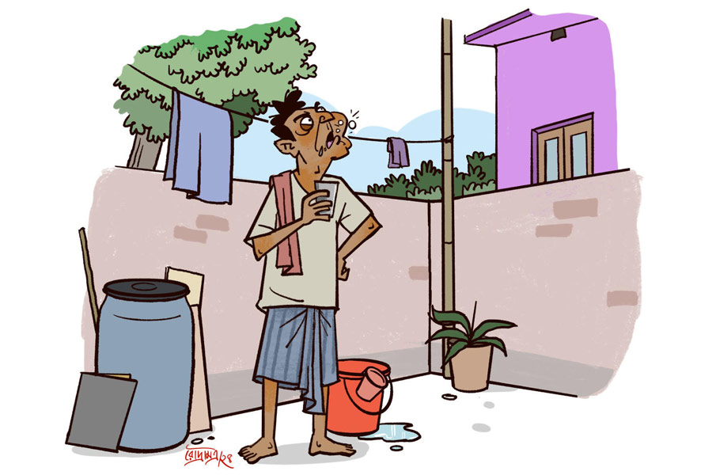

 
 <h1 align=center>রোস্টিং চলছে</h1>
<h2 align=center>কৃষ্ণেন্দু মুখোপাধ্যায়</h2> 

সকালবেলা ঈষদুষ্ণ জলে গার্গল দিয়ে দিন শুরু করেন নবীনবাবু। গার্গলটা অবশ্য বাড়ির ভিতর ওয়াশ বেসিনের সামনে করেন না। বাড়ির বাইরের উঠোনে দাঁড়িয়ে নিজের আর প্রতিবেশী বিশ্বনাথবাবুর বাড়ির পাঁচিলের ধারে করেন। গলায় অদ্ভুত বিকট উলু-উলু শব্দ করে গার্গল করতে করতে যথারীতি আজও মাথা গেল গরম হয়ে। বিশ্বনাথবাবু বাড়ি রং করাচ্ছেন। কী বিচ্ছিরি, কুচ্ছিত ফ্যাকাসে একটা বেগুনি রং। যে বাড়ির ভিতরে আছে, তাকে তো আর এই রংটা দেখতে হচ্ছে না। পাশের বাড়ির লোকজনকে অহরহ এই রংটা দেখতে হবে। এটা একটা ষড়যন্ত্র!

গার্গলের শেষ পর্বে হড় হড়-ছক ছক করে দু’বার কুলকুচি করে মুখের জলটা পাঁচিলের গায়ে ফেলে চিৎকার করে উঠলেন নবীনবাবু, “বিশু…অ্যাই বিশু…”

সবে শীত পড়ছে। দু’-এক দিনের মধ্যেই লেপ বেরোবে। বিশ্বনাথবাবুর এই হালকা শীতে সকালে খাটে বসে ঝিমোতে ভাল লাগে। এখন উত্তর দেওয়া মানেই ঝিমুনির দফারফা। গতকালই যেমন হয়েছে। বিশ্বনাথবাবু নতুন ডোরবেল লাগিয়েছেন। সকালবেলা দুধওয়ালা সেই বেল বাজিয়েছিল। পাশের বাড়ির নবীনবাবু তখন তাঁর রোজকার স্বরসাধনা, মানে গার্গল করছিলেন। সব মিলিয়ে ভীষণ কানে লেগেছিল আওয়াজটা। সেই নিয়ে ঝিমুনির দফারফা করে পাক্কা চল্লিশ মিনিট ঝগড়া হয়েছিল। বিশ্বনাথবাবু ঠিক করলেন, আজ আর কোনও উত্তর দেবেন না। দেখা যাক, বেটা কত ক্ষণ ষাঁড়ের মতো চেঁচায়।

তবে নবীনবাবু আরও খান আষ্টেক বার, “বিশু…বিশু…” বলে ডেকে চুপ করে গেলেন।

বিশ্বনাথবাবুর এও এক অস্বস্তি। নবীনটা চুপ করে গেল কেন? বিশ্বনাথবাবু কোলবালিশ ছেড়ে জানলার কাছে উঠে এসে চোখ রগড়ে দেখলেন, নবীনবাবুর ভাইঝি তায়া হাত ধরে টেনে জেঠাকে বাড়ির মধ্যে নিয়ে যাচ্ছে। এও এক অভিনব ব্যাপার! নবীনবাবু যখন ঝগড়া করেন, বাড়ির কেউ বেরিয়ে এসে ওঁকে বিরত করে না।

তায়া জেঠুর হাতটা ধরে টানতে টানতে বাড়ির মধ্যে এসে সোফায় বসাল। তায়ার চোখ লাল, চুল উস্কোখুস্কো। নবীনবাবু সে সব খেয়াল না করেই বিরক্ত গলায় জিজ্ঞেস করলেন, “কী হল? থামিয়ে দিলি কেন? বাড়ির রংটা কী করাচ্ছে, দেখতে পাচ্ছিস? সেদ্ধ বেগুনের মতো। এর একটা হেস্তনেস্ত হবে না?”

“আহ জেঠু! ওটা বেগুনি নয়, ল্যাভেন্ডার। সে যা-ই হোক, বিনা পয়সায় ঝগড়া করছ কেন?”

“সে তুই রঙের যে ইংরেজি নামই বলিস, ওটা অসহ্য। কোনও রাজনৈতিক দল পর্যন্ত এই রং নেয়নি। আর বিনা পয়সায় ঝগড়ার মানে কী? অন্যায় অবিচারের প্রতিবাদ করা একটা সাংবিধানিক নৈতিক অধিকার, সামাজিক দায়িত্ব। এর সঙ্গে পয়সার কী সম্পর্ক?”

“সম্পর্ক আছে জেঠু। যত ঝগড়া, তত পয়সা।”

নবীনবাবু একটু থতমত খেলেন, “সাত সকালে কী যে বলিস। জেঠিকে বল চা দিতে। মেজাজটা আর গরম করাস না।”

“জেঠি ঠিক সময়ে চা দিয়ে দেবে, তার আগে আমার কথা শোনো। টিভিতে খবরের চ্যানেলে দেখেছ, সবাই কেমন ঝগড়া করে?”

“সব আকাট। দু’-একটা পয়েন্টের পর কেউ আর পয়েন্ট খুঁজে পায় না। নিজেদের মধ্যে চিৎকার করে কে যে কী বলে, বোঝা যায় না। টিভিতে যখন ও রকম চলে, দেখেছিস তো আমিও ওদের গলা ছাপিয়ে আসল যুক্তিগুলো কী রকম টানা বলে যাই!”

“সেটা দেখেই তো আমার মাথায় ক্লিক করেছে। ওঁরা কেউ তোমার কথা শুনতে পাচ্ছেন না, কিন্তু তুমিও পাল্লা দিয়ে চেঁচিয়ে যাচ্ছ।”

“কী বলতে চাইছিস তুই? আমি নিরপেক্ষ যুক্তিবাদী। আমাকে তো বলে যেতেই হবে।”

তায়া নিজেকে সামলে নিয়ে বলল, “বলতে চাইছি, টিভিতে লোকগুলো ঝগড়া করে পয়সা পাচ্ছে, আর তুমি যে সারা পাড়ায় শিল্পের পর্যায়ে ঝগড়া করে যাও, কোনও পয়সা পাও কি?”

নবীনবাবু ভাইঝির যুক্তি খণ্ডাতে না পেরে উত্তেজিত হয়ে, “ও সব লবিবাজি। আমাকে কি আর কোনও চ্যানেল ডাকবে? ডাকলে সব পক্ষ গুলিয়ে ছত্রাকার করে দিতাম।”

তায়া বুঝল, জেঠুর অ্যাড্রিনালিন প্রবাহ বাড়ছে। এটাই মোক্ষম সময়। নিজের তালুতে একটা ঘুসি মেরে বলে উঠল, “এই তো চাই জেঠু! তোমার কোনও লবির কাছে যাওয়ার দরকার নেই। বাড়িতে বসেই তোমার যুক্তিবাদী প্রতিবাদী বক্তব্যগুলো বলবে, আমি রেকর্ড করব আর আমাদের পয়সা আসবে।”

“মানে?” সন্দিগ্ধ বিশ্বনাথ।

“তুমি তো জানো, আমার একটা ইউটিউব চ্যানেল আছে। ফুড থেকে ট্রাভেল, কত ভিডিয়ো করলাম। লোকে সাবস্ক্রাইব তো দূর, লাইক পর্যন্ত করে না! শেষে একলব্যর মতো তোমার বাঙালিদের বৈশিষ্ট্য নিয়ে বলা গুরুত্বপূর্ণ কথাগুলো নিয়ে নতুন একটা চ্যানেল খুলেছি, ‘প্যাঁচালের পাঁচালি’। তরতর করে ভিউ বাড়ছে।”

নবীনবাবু উৎসুক মুখে একটু ঝুঁকে বললেন, “কোন গুরুত্বপূর্ণ কথাগুলো বল তো?”

তায়া এক-এক করে বলতে শুরু করল, “ওই যে শীত পড়ার দু’মাস আগেই মাফলার-টুপি রোদে বিছিয়ে দেওয়া, কাউকে দেখলেই সে রোগা হয়েছে না মোটা হয়েছে তা নিয়ে মন্তব্য করা, জং-ধরা আলপিনও না ফেলা, সব কিছু প্লাস্টিকে মোড়া…”

নবীনবাবু নড়েচড়ে উঠে বললেন, “তুই শুধু এই ছেঁদো পয়েন্টগুলো শিখলি? আরও কত মোক্ষম আছে। পৃথিবীতে আর একটাও জাতি দেখা তো, যারা চায়ে বিস্কুট ডুবিয়ে গলিয়ে ফেলে! রাস্তায় মিটিং হচ্ছে দেখলেই দাঁড়িয়ে পড়ে! শরীরের ক্ষতি হবে জেনেও পরের পয়সায় পেলে লুচি, কচুরি, প্লেটভর্তি খাসির মাংস ওড়ায়... যাক গে যাক, আসল রহস্যটা তোকে বলি শোন। বাঙালি হয়ে বাঙালির ধুদ্ধুড়ি যত নাড়বি, তত দেখবি শরীর চাঙ্গা হবে।”

“তাই তো ভেবেছিলাম জেঠু! কিন্তু ও বাড়ির বিশ্বনাথ জেঠুর ভাইপো ইন্দ্ররও তো চ্যানেল আছে, ‘ঝালে-ঝোলে বাঙালি’, তাতে ও আমাকে একেবারে রোস্ট করে ছেড়েছে। কাল রাতে আমার ঘুম হয়নি। আমার মুখচোখের অবস্থা দেখছ না?”

“রোস্ট করেছে মানে?”

“ওই, ধুদ্ধুড়ি নেড়ে দিয়েছে। জেঠু প্লিজ়, তুমিও একটু পাল্টা রোস্টিং করে দাও। আমার চ্যানেল একেবারে হিট হয়ে যাবে। যা টাকাপয়সা পাব, তুমি আমি ফিফটি-ফিফটি। জানো কী বলে ইন্দ্র বেটা শুরু করেছে, ‘ওরে কলহেশ্বরের ভাইঝি…’”

নবীনবাবু হাত তুললেন, “আর বলতে হবে না। বল কোথায় তোর স্টুডিয়ো, কোথায় তোর ক্যামেরা?”

“দাঁড়াও আগে তোমার জন্য চা নিয়ে আসি।”

“চা নয়। গার্গলের গরম জল। বেসিনের কাছে দে।”

বেলা বাড়ল। বিশ্বনাথবাবুর প্রাতঃকৃত্য হল না। বার আষ্টেক “বিশু…বিশু…” বলার পর এ রকম শ্মশানের নীরবতা কেন? আর থাকতে না পেরে গুটিগুটি নবীনবাবুর বাড়িতে এসে ডোরবেল টিপলেন। দরজা খুলল তায়া।

অপ্রস্তুত হেসে বিশ্বনাথবাবু জিজ্ঞেস করলেন, “নবীন আছে? সকালে বোধহয় খুঁজছিল।”

ঠোঁটের উপর আঙুল রেখে তায়া বলল, “চুপ। রোস্টিং চলছে!”

