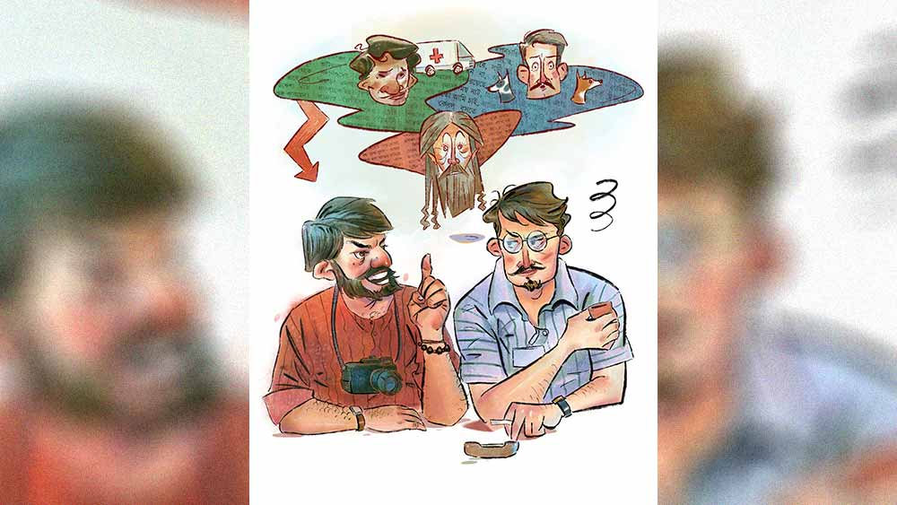

 
 <h1 align=center>লকডাউন এক্সক্লুসিভ</h1>
<h2 align=center>অর্ঘ্য ঘোষ</h2> সকাল হলেই রোজকার এই এক যন্ত্রণা শুরু সপ্তর্ষির। না, তার কোষ্ঠকাঠিন্যের ধাত নেই। নেই পাওনাদারের তাগাদার দুশ্চিন্তাও। তবুও তার প্রায় রোজই মনে হয় রাতটা আরও দীর্ঘ হলে ভাল হত। কেন যে এত তাড়াতাড়ি সকাল হয়! মানসপুর গ্রামের মধ্যবিত্ত পরিবারের সন্তান সপ্তর্ষি। বাবা প্রত্যুষবাবু প্রাইমারির শিক্ষক। দুই ভাইয়ের বড় সপ্তর্ষির ছেলেবেলা থেকেই লেখালিখির শখ। কবিতা-গল্প। ওই সব করতে গিয়েই প্রথম বারে উচ্চ মাধ্যমিক টপকানো হয়নি তার। ফিজ়িক্স-কেমিস্ট্রির মতো খটমট বিষয়গুলি কিছুতেই মাথায় আসত না। বরং ঘুরেফিরে আসতেন বিভূতিভূষণ, তারাশঙ্কর, জীবনানন্দ। ফিজ়িক্স পরীক্ষার দিনে সবাই যখন উত্তর লিখতে ব্যস্ত, তার চোখ চলে যায় জানালার বাইরে। পরীক্ষা ভুলে দেখতে থাকে ইলেকট্রিক পোস্টে লটকানো ঘুড়ির দোল খাওয়া, ছাদের তারে কিশোরীর সন্তর্পণে ভিজে জামা দিয়ে রঙিন অর্ন্তবাস ঢাকা দেওয়ার দৃশ্য। উত্তর লেখার বদলে সেই সব নিয়ে উত্তরপত্রেই লিখে ফেলেছিল আস্ত একটা কবিতা। তার পর আর পরীক্ষা হলে বসে থাকতে মন চায়নি। খাতা জমা দিয়ে দেয়। সময় শেষের অনেক আগে খাতাটা পেয়ে হলের ইন-চার্জ চণ্ডীচরণ সাধু বিস্মিত হয়েছিলেন। কিন্তু তাঁকে আর কিছু বলার সুযোগ দেয়নি সে। খাতাটা ধরিয়ে দিয়ে হল থেকে বেরিয়ে এসেছিল। তার আচরণ চণ্ডীবাবুকে কৌতূহলী করেছিল। তিনি খুঁটিয়ে খুঁটিয়ে খাতাটা পড়েছিলেন। পরীক্ষা শেষে তার স্কুলের আরও যারা পরীক্ষা দিচ্ছিল তাদের কাছে খোঁজখবর নিয়ে বলেন, “কবিতাটি বড় চমৎকার। এ ছেলে আর্টস নিয়ে পড়লে নির্ঘাত ভাল ফল করতে পারত।”

সেখানেই ক্ষান্ত হননি চণ্ডীবাবু। হল-ভর্তি পরীক্ষার্থীর সামনে কবিতাটি পড়ে শুনিয়েছিলেন। পরে বন্ধুদের মুখে শুনেছিল সে। অন্যান্য পরীক্ষার্থী গ্রামে ফিরে সেই কথা সব জায়গায় বলে বেড়িয়েছিল। যারা শুনেছিল তারাই হাসাহাসি করেছিল। হাসেনি কেবল সুপ্তি।

সুপ্তি পাড়ারই মেয়ে। তখন তার সবে ক্লাস টেন। লাল পাড় সাদা শাড়ি, দু’দিকে বিনুনি ঝুলিয়ে যখন স্কুলে যেত, মনে হত বনলতা সেন। চুল তার  বিদিশার নিশা, চোখে তার শ্রাবস্তীর কারুকাজ। সুপ্তিই তাকে বুঝিয়েছিল, “ঋষিদা, যে যা বলছে বলুক, হাসাহাসি করুক। তুমি কান দিয়ো না। তুমি যেমন লিখছ, লিখে যাও। দেখবে আজ যারা হাসাহাসি করছে, এক দিন তাদের হাসি মুছে যাবে।”

সুপ্তির কথাই শেয পর্যন্ত সত্যি হয়। আর্টস নিয়ে উচ্চ মাধ্যমিক পেরিয়ে, দূরশিক্ষায় গ্র্যাজুয়েশনেও খারাপ ফল হয় না তার। লেখালিখির জগতের সিঁড়ি ভাঙতে ভাঙতে ক্রমেই উপরে উঠতে থাকে সে। সাহিত্যের পাশাপাশি ধীরে ধীরে সংবাদ জগতেও বিচরণ শুরু হয়। সাপ্তাহিক পত্রিকায় সাংবাদিকতা থেকে শুরু করে নিজে বছর কয়েক সাপ্তাহিক সংবাদপত্র সম্পাদনার পর যোগ দেয় সর্বভারতীয় সংবাদপত্রে। তার পর দু’বাড়ির কথাবার্তা হয়ে শুভ দিন স্থির করে সুপ্তিও পাকাপাকি ভাবে আসে সপ্তর্ষির জীবনে।

ফোনটির জন্যই সকাল থেকেই বুক ধুকপুক শুরু হয়ে যায় সপ্তর্ষির। ফোনটি তার বার্তা সম্পাদক হিরণ চট্টোপাধ্যায়ের। প্রতি দিন সাতসকালে ফোন করে জানতে চান, “আজ কী এক্সক্লুসিভ দিচ্ছ সপ্তর্ষি?”

আজও তার অন্যথা হয় না। সপ্তর্ষি আমতা আমতা করে বলে, “এখনও তেমন কিছু এক্সক্লুসিভ পাইনি দাদা। দেখছি কী দেওয়া যায়।”

ফোন কাটার আগে হিরণদা বিরস গলায় বলেন, “এখনও দেখছি বললে হবে? দেখো দেখো।”

মোবাইলটা পকেটে রাখতে রাখতে মনে মনে তেড়ে খিস্তি ঝাড়ে সপ্তর্ষি। তার কাজের ক্ষেত্রটির বেশির ভাগ প্রত্যন্ত গ্রামাঞ্চল। কয়েকটি পঞ্চায়েত, একটি থানা আর ব্লক অফিস। এখানে তেমন খবর কোথায়? অভাব-অভিযোগ, চাওয়া-পাওয়া যা ছিল তা নিয়ে ঘুরিয়ে ফিরিয়ে খবর হয়ে গিয়েছে। তার উপরে লকডাউন। স্কুল-কলেজ, অফিস আদালত অধিকাংশই বন্ধ। কাঁহাতক আর চাল-ডাল, মাস্ক-স্যানিটাইজ়ার বিলি, ভিক্ষাজীবী-ভবঘুরেদের রান্না করে খাওয়ানো কিংবা পাবলিককে লাঠি নিয়ে পুলিশের তাড়া করার খবর করা যায়? তাও আবার শুধু খবর হলেই হবে না, অন্য কেউ পায়নি এমন এক্সক্লুসিভ খবর চাই। সাতপাঁচ ভাবতে ভাবতেই এসে পৌঁছয় ফোটোগ্রাফার চন্দ্রদেব রায়। সমস্যার কথাটা তাকে বলে সে। চন্দ্রদেব সব কথা শোনার পর ভারিক্কি চালে বলে, “দাদা, আমাদের ফাটাকেষ্ট হওয়া ছাড়া উপায় নেই।”

“মানে!” চন্দ্রদেবের কথা বোধগম্য হয় না সপ্তর্ষির। চন্দ্রদেব হাসতে হাসতে ব্যাখ্যা করে, “দাদা, ফাটাকেষ্ট সিনেমায় মিঠুনের ডায়লগটা মনে নেই! ‘ফাটাকেষ্ট খবর দেখে না, খবর শোনে না, খবর তৈরি করে!” আমাদেরও খবর তৈরি করতে হবে। তা হলে সেই খবর আর কেউ পাবে না। এক্সক্লুসিভ!”

“দূর! ও সব সিনেমাতেই সম্ভব!” বেজার হয় সপ্তর্ষি।

“দাদা, খবর তৈরি বাস্তবেও সম্ভব। আমাদের তৈরি করা খবরে যদি সমাজের কোনও ক্ষতি না হয়, বরং  উপকার হয়, তা হলে তা নিয়ে খুঁতখুঁতানির কোনও মানে হয় না। তা ছাড়া এই পরিস্থিতিতে খবর তৈরি করাতে না পারলে এক্সক্লুসিভ খবর পাবে কী করে?”

তবুও মন থেকে মেনে নিতে পারে না সপ্তর্ষি। চন্দ্রদেব তাকে বোঝায়, “তোমাকে কিছু করতে হবে না। তুমি আমার উপরে ছেড়ে দাও তো। দেখো না আমি কী করি।”

দোনামনা করেও অমত করতে পারে না সপ্তর্ষি। চন্দ্রর যুক্তি শেষ পর্যন্ত মেনে নিতে হয়। কিছু ক্ষণের মধ্যেই চন্দ্রদেব তাকে নিয়ে পৌঁছয় বাসুদেবপুর গ্রামীণ হাসপাতালে। সপ্তর্ষি অবাক হয়ে জিজ্ঞেস করে, “এখানে নিয়ে এলে কেন?”

চন্দ্রদেব গলা নামিয়ে বলে, “খবর তৈরি করতে।” 

“খবর তৈরি করতে এখানে?” সপ্তর্ষির বিস্ময়ের সীমা থাকে না।

চন্দ্রদেব তাকে আশ্বস্ত করে, “আরে দেখোই না, যে প্ল্যান ভেঁজেছি, সেটা ফুলফিল হলে কেল্লা ফতে।”

বাসুদেবপুর হাসপাতাল  খারাপ নয়। তার একটাই রোগ। ঝুঁকি বাঁচিয়ে চলা। রোগীর সামান্য কিছু বাড়াবাড়ি হলেই অন্যত্র রেফার করে দেয়। তখন রেফার করা রোগীদের নিয়ে পরিবারের লোকেরা পড়েন মহা সমস্যায়। এখন লকডাউনের জেরে যানবাহন সব বন্ধ। থাকার মধ্যে একটাই অ্যাম্বুল্যান্স। লকডাউনের আবহে অধিকাংশ গরিব মানুষের পক্ষে অ্যাম্বুল্যান্স ভাড়া করে রোগী শহরে নিয়ে যাওয়া সম্ভব নয়। চন্দ্রদেব সেই রকম একটি দুঃস্থ পরিবারের অপেক্ষায় থাকে।

বেশি ক্ষণ অপেক্ষা করতে হয় না। কিছু ক্ষণের মধ্যেই বাচ্চা কোলে এক দুঃস্থ দম্পতিকে অ্যাম্বুল্যান্সের ড্রাইভার আসরাফের কাছে গিয়ে কাকুতিমিনতি করতে দেখা যায়। দেখেই বোঝা যায় ভাড়া কমানোর জন্য ওই অনুনয়-বিনয়। এত ক্ষণ এই রকম একটি সুযোগ চাইছিল চন্দ্রদেব। সুযোগের সদ্ব্যবহার করতে সপ্তর্ষিকে নিয়ে দ্রুত সেখানে পৌঁছে যায়। ড্রাইভার আসরাফকে পাশে ডেকে নিয়ে গিয়ে জিজ্ঞেস করে, “কী ব্যাপার আসরাফ, ওরা কী বলছে?”

“দেখো না দাদা, ওদের মেয়েটাকে বোলপুরে রেফার করে দিয়েছে। বাস-টাস তো কিছু নেই, টোটো-অটোও চলতে দিচ্ছে না পুলিশ। তাই বোলপুরে পৌঁছে দেওয়ার জন্য আমাকে ধরেছে। আমি পাঁচশো টাকা বলেছি, ওরা সাড়ে তিনশোর বেশি দিতে পারবে না বলছে। স্বামীটা নাকি কলকাতার কোন কারখানায় কাজ করত। লকডাউনে কাজ খুইয়ে বাড়িতে বসে আছে। সে না হয় হল, কিন্তু আমিই বা অত কমে কী করে পারি বলো? আমারও তো ঘর-সংসার আছে। অ্যাম্বুল্যান্সের উপর নির্ভর করেই চলে। তবুও দেখি, চারশো টাকা পর্যন্ত দিলে চলে যাব।”

একটানা কথাগুলো বলে আসরাফ অ্যাম্বুল্যান্সের দিকে পা বাড়াতেই চন্দ্রদেব তাকে থামায়। মানিব্যাগ থেকে একটা পাঁচশো টাকার নোট বার করে তার হাতে দিয়ে বলে, “শোন, এই টাকাটা রাখ। ওদের থেকে কিছু নিতে হবে না। সবাই জানবে তুই-ই বিনা পয়সায় ওদের পৌঁছে দিয়েছিস। আমরা কাগজে সেই ভাবে একটা খবর করব।”

খবর করার বিষয়টি আসরাফের অজ্ঞাত নয়। পুরো ভাড়া পাওয়ার পরেও উপরি হিসেবে নিজে খবর হওয়ার সুযোগ সেও হাতছাড়া করতে চায় না। সঙ্গে সঙ্গে সম্মতি জানিয়ে দেয়, “ঠিক আছে দাদা, তোমরা যা বলবে তা-ই হবে।”

এত ক্ষণ অবাক হয়ে চন্দ্রর কাণ্ড দেখছিল সপ্তর্ষি। তাকে ওই ভাবে চেয়ে থাকতে দেখে হেসে চন্দ্রদেব বলে, “নাও দাদা, এ বার এক্সক্লুসিভ খবর তুলে নাও। লকডাউনে কর্মচ্যুত শ্রমিকের মেয়েকে বিনা ভাড়ায় হাসপাতালে পৌঁছে দিল অ্যাম্বুল্যান্স চালক!” বলতে বলতেই ছবি তুলতে ব্যস্ত হয়ে পড়ে সে। সপ্তর্ষিকেও মজুর-দম্পতির সঙ্গে কথা বলে ডিটেলে সব জেনে নিতে হয়। কাজ শেষ করে বাড়ি ফেরার পথে চন্দ্রদেব জিজ্ঞেস করে, “কী দাদা, খবরটা পাবলিক কেমন খাবে বলো দেখি?”

“খাবে তো ভালই। কিন্তু কাজটা কি ভাল হল?”

“খুঁতখুঁতানি ছাড়ো তো! পরিস্থিতির মোকাবিলায় মানুষকে কত কিছু করতে হয়, আমরা না হয় একটা খবরই করলাম। এতে তো কারও কিছু ক্ষতি হচ্ছে না। তোমার অত কিছু চিন্তা করার দরকার নেই। তুমি দরদ দিয়ে খবরটা লিখে পাঠিয়ে দেখো না কী হয়।”

অগত্যা তাই করে সপ্তর্ষি। পর দিন সাতসকালেই হিরণদার ফোন, “ওয়েল ডান, ফাটিয়ে দিয়েছ। খবরটা অন্য কোনও মিডিয়া পায়নি। তবে যে খবর নেই খবর নেই বলে ঘ্যানঘ্যান করো! বুঝলে সপ্তর্ষি, আমাদের চার পাশে এই রকম কত খবর অহরহ ঘটে যাচ্ছে, চোখ-কান খোলা রাখলেই খবরের অভাব হবে না। সাংবাদিকের সঙ্গে সাধারণ মানুষের এটাই তো তফাত, সাংবাদিকের বাড়তি চোখ-কান থাকে, সাধারণ মানুষের থাকে না... কিপ ইট আপ।”

সপ্তর্ষি আপনমনে হাসতে থাকে। উলটপুরাণ দেখে অবাক হয় সুপ্তি, জিজ্ঞেস করে, “কী গো! আজ সূর্য কোন দিকে উঠেছে? অন্য দিন তো বসের ফোন পেয়ে মুখটা বাংলার পাঁচের মতো হয়ে থাকে, আজ খুব হাসি দেখছি যে বড়?”

মুহূর্তে সপ্তর্ষির মনে অপরাধবোধ জেগে ওঠে। তবুও আসল কথাটা স্ত্রীকে বলতে পারে না সে। কাগজের পাতাটা খুলে স্ত্রীর দিকে এগিয়ে দেয়। দ্রুত খবরটিতে চোখ বুলিয়ে নিয়ে সুপ্তি উচ্ছ্বসিত হয়, “বাহ, সুন্দর খবর হয়েছে। আমার বর ছাড়া এই রকম পজ়িটিভ খবর এ জেলায় করার সাধ্য আর কোনও রিপোর্টারের আছে?”

স্ত্রীর প্রশংসায় অপরাধবোধ আরও বেড়ে যায় সপ্তর্ষির। খবর তোলার অছিলায় সে বাড়ি থেকে পালিয়ে বাঁচে। রাস্তাতেই চন্দ্রর সঙ্গে দেখা হয়ে যায়। সে বলে, “কী দাদা! ফাটাকেষ্টর দাওয়াই কেমন দিলাম? বস কী বললেন আজ?”

সপ্তর্ষি সঙ্কুচিত হয়ে বলে, “বললেন, কিপ ইট আপ।”

“কোই বাত নেহি, ম্যায় হুঁ না!”

কথা বলতে বলতে তারা পায়ে পায়ে হাসপাতালের সামনে পৌঁছয়, তাদের দেখে ছুটে আসে আসরাফ। চন্দ্রদেব তার পিঠ চাপড়ে দিয়েবলে, “আসরাফ, তুই তো হিরো বনে গেলি রে ভাই। ছবি-সহ তোর নাম বেরিয়েছে কাগজে।”

“সেটাই কাল হয়ে গিয়েছে দাদা।”

“কাল হয়ে গিয়েছে মানে?”

“আজ সকাল থেকে গরিব মানুষেরা তো বটেই, স্কুলমাস্টার, বড় ব্যবসাদারেরাও বিনা ভাড়ায় রোগী নিয়ে যাওয়ার জন্য ঝুলোঝুলি শুরু করে দিয়েছে। আসল ব্যাপারটা তো কাউকে বলতেও পারছি না। কত জনকে আর জবাব দেব? তাই অ্যাম্বুল্যান্স খারাপ হয়ে আছে বলে নোটিস ঝুলিয়ে দিয়ে বাইরেবসে আছি।”

সপ্তর্ষি কিছু বলতে পারে না। মরমে মরে যায়। চন্দ্রদেব সহমর্মিতা জানায়, “এ হে! এমনটা যে হতে পারে ভাবতেও পারিনি। আর তো কিছু করারও নেই। সব চেপে যা। আজকের দিনটা ওই ভাবে কাটিয়ে দে। দেখবি সব ভুলে যাবে।”

আসরাফকে ছাড়িয়ে আসতেই তাদের দু’জনকে ঘিরে ধরে অবলম্বন পল্লী উন্নয়ন সমিতির ছেলেরা। সম্পাদক প্লাবন মণ্ডল অনুযোগ করে, “দাদা, আমরা এক মাস ধরে ভবঘুরে আর ভিক্ষুকদের দু’বেলা রান্না করে খাওয়াচ্ছি, সেটা খবর হল না। অথচ আসরাফ মাত্র পাঁচশো টাকা ভাড়া নেয়নি বলে ছবি-সহ অত বড় খবর হয়ে গেল?”

চন্দ্রদেব তাদের বোঝায়, “শোনো, এখন বহু এনজিও ওই রকম করে মানুষদের খাওয়াচ্ছে, চাল ডাল দিচ্ছে। ওই সব কাজের আর কোন নিউজ় ভ্যালু নেই।”

“তা হলে কোন কাজের নিউজ় ভ্যালু আছে বলো, আমরা শুধু সেগুলোই করব দাদা।”

“দেখো, ভিক্ষুক-ভবঘুরেদের কথা অনেকেই ভাবতে পারে। কিন্তু পথের কুকুরদের কথাটা এক বার ভাবো দেখি। বাজারের কুকুরেরা শুধুমাত্র খাবারের দোকান আর হোটেলের ফেলে দেওয়া খাবারখেয়ে বেঁচে থাকে। কিন্তু লকডাউনে সব তো বন্ধ। ওদের অবস্থাটা এক বার ভাবো দেখি?”

“আচ্ছা, আমরা যদি ওদের দু’বেলা রান্না করে খাওয়াই?”

“তা হলে বড় করে খবর হবে।”

“বেশ দাদা, তা হলে আজ থেকেই আমরা পাড়ার কুকুরভোজন আরম্ভ করে দিচ্ছি।”

যেমন কথা তেমনি কাজ। সে দিন থেকেই ভিক্ষুক-ভবঘুরে ভোজনের জায়গা নেয় কুকুরভোজন। সে এক দেখার মতো দৃশ্য। রাস্তায় লাইন করে পাতা পেড়ে মাংস ভাত যখন দেওয়া হল, তখন কুকুরগুলো মুখ দিতে সাহস পাচ্ছিল না। তাদের জন্য যে এমন আয়োজন হতে পারে তা বোধহয় তারা ভাবতে পারেনি। তাই ভয় ভাঙিয়ে অনেক সাধ্যসাধনা করে তাদের খাওয়াতে হল। সেই ছবি ক্যামেরাবন্দি করে ফেলে চন্দ্রদেব। সপ্তর্ষিও আয়োজকদের নামধাম সব লিখে নেয়। পরদিন এক্সক্লুসিভ হয়ে যায় কুকুরভোজনের খবর।

সেই থেকে এক্সক্লুসিভ খবর তৈরির নেশা পেয়ে বসে তাদের। কোনও দিন কোনও এনজিও-কে দিয়ে গৃহবন্দি মানুষদের সময় কাটানোর জন্য বাড়ি বাড়ি লুডো বিলি, কোনও দিন কোনও বাউলকে ধরে পাড়ায় পাড়ায় করোনার প্রচার অভিযান করিয়ে এক্সক্লুসিভ খবর করে তাক লাগিয়ে দেয় তারা। লেটেস্ট খবরটা হয় এক সন্ন্যাসীকে ধরে। সন্ন্যাসীর নাম মন্দার। ভিক্ষাজীবী মানুষ। বাজার বন্ধ থাকায় তার জীবিকা বিপন্ন। গৃহস্থের বাড়ি আর দৈনিক আনাজের হাটই ভরসা।

সে দিন হাটে ভিক্ষা সেরে বেরোনোর সময় সপ্তর্ষিদের সামনে পড়ে যায় সে। সে দিন আর এক্সক্লুসিভ খবর করার মতো বিষয় খুঁজে পাচ্ছিল না চন্দ্রদেব। সন্ন্যাসীকে দেখে তার মাথায় একটা প্ল্যান খেলে যায়। তাকে আড়ালে ডেকে নিয়ে গিয়ে জিজ্ঞেস করে, “এখন ভিক্ষা করে কেমন হচ্ছে তোমাদের?”

“কেমন আর হবে বাবু? সব তো বন্ধ। এই তো সারা হাট ঘুরে কুড়িয়ে বাড়িয়ে পঞ্চাশ টাকাও হয়নি।”

“তুমি যদি একটা কাজ করো, তা হলে আমরা তোমাকে আজ দুশো টাকা দিতে পারি।”

“কী কাজ করতে হবে বলুন?”

“তুমি আমাদের সঙ্গে গিয়ে তোমার ভিক্ষার টাকাটা বিডিও-র হাতে তুলে দিলেই হাতে হাতে নগদ দু’শো টাকা পেয়ে যাবে।”

এমন আজগুবি কথা এর আগে শোনেনি সন্ন্যাসী। পঞ্চাশ টাকা দিয়ে যদি দুশো টাকা পাওয়া যায় তা হলে তো রোজ তা-ই দেবে। তাড়াতাড়ি বলে ওঠে, “এ আর বেশি কথা কী বাবু, চলুন এখনই দিয়ে আসছি।”

চন্দ্রদেবও আর কালক্ষেপ করে না। সন্ন্যাসীকে নিয়ে সোজা বিডিও অফিসে পৌঁছয়। বিডিও কুশল সেনগুপ্ত তখন বিভিন্ন ক্লাব, স্বেচ্ছাসেবী সংস্থা, ব্যবসায়িক প্রতিষ্ঠানের কাছ থেকে মুখ্যমন্ত্রীর ত্রাণ তহবিলে দান জমা করছিলেন। সেই সময় চন্দ্রদেবের কথা মতো সন্ন্যাসী বিডিওর টেবিলে ভিক্ষার ঝুলিটি উপুড় করে দেয়।

ঝোলা থেকে বেরোয় কয়েকটি নোট আর কয়েন। বিডিও হকচকিয়ে সন্ন্যাসী আর চন্দ্রদেবদের মুখ চাওয়াচাওয়ি করতে থাকেন। চন্দ্রদেব বলে, “স্যর, ওর নাম সন্ন্যাসী মন্দার। ভিক্ষা করে সংসার চলে।আমরা এখানে আসছি শুনে বলল , সবাই তো মুখ্যমন্ত্রীর ত্রাণ তহবিলে দান করছে। আমিও আমারএক দিনের ভিক্ষার টাকা তুলে দিতে চাই। আপনারা ব্যবস্থা করে দিতে পারবেন? সেই কথা শুনেই আপনার কাছে নিয়ে এলাম।”

বিডিও আপ্লুত হয়ে পড়েন, “আমি অভিভূত! এমন কথা ভাবাই যায় না। করোনার ত্রাণ তহবিলে এই দান রাজ্য কেন, দেশের সেরা। আমি আলাদা করে ওই দান মুখ্যমন্ত্রীর কাছে পাঠানোর ব্যবস্থা করব। আর ব্লক প্রশাসনের পক্ষ থেকে করোনা-যোদ্ধা হিসাবে ভিক্ষাজীবীকে সংবর্ধনাও দেওয়া হবে।”

পরদিন সেরা এক্সক্লুসিভ। প্রথম পাতায় অ্যাঙ্কর করে ছবি-সহ ‘মুখ্যমন্ত্রীর ত্রাণ তহবিলে ভিক্ষাজীবীর দিনান্তের সঞ্চয় দান’ শীর্ষকসংবাদ ছাপা হয়। হিরণদা সাতসকালে ফোনে বাহবা দেন, “এ ভাবেই চালিয়ে যাও, বস।”

সুপ্তিও গদগদ, ভাববাচ্যে সপ্তর্ষিকে শুনিয়ে সে বলে, “বরটার জন্য খুব গর্ব হচ্ছে।”

সে দিন কাজে বেরোনোর আগে অযাচিত ভাবে বরকে টপাটপ বেশ কয়েকটা চুমু খেয়ে নেয় সুপ্তি।

তত দিনে খবর তৈরির অপরাধবোধ অনেকখানি কমে এসেছে সপ্তর্ষির। তাই ফুরফুরে মেজাজে নতুন এক্সক্লুসিভের সন্ধানে চন্দ্রর সঙ্গে বাজারে পৌঁছয় সে। চৌরাস্তার মোড়ে বাইক দাঁড় করাতেই তাদের আত্মারাম খাঁচা ছাড়া হওয়ার জোগাড়। তাদের দেখে পনেরো-কুড়ি জন ভিখারি যেন ধেয়ে আসে,“বাবু, আমরাও ত্রাণ তহবিলে দান করতে চাই।”

কেউ বলে, “আমি ভিক্ষে করে সন্ন্যাসীর চেয়ে কুড়ি টাকা বেশি পেয়েছি। কেউ বা বলে, আমি বাড়ি থেকেই আশি টাকা নিয়ে এসেছি।”

সন্ন্যাসী মন্দারের ত্রাণ তহবিলে দানের গূঢ় কথাটা যে ভিক্ষাজীবীদের জানতে বাকি নেই, তা চন্দ্রদেবেরও আর বুঝতে বাকি থাকে না। মনে মনে প্রমাদ গোনে চন্দ্রদেব আর সপ্তর্ষি। এক সঙ্গে এত জন ভিক্ষাজীবীকে তো আর ত্রাণ তহবিলে দানে উদ্বুদ্ধ করা সম্ভব নয়। নতুন করেও সেই দানের কোনও নিউজ় ভ্যালুও নেই। সেই কথা ভেবে ভিক্ষাজীবীদের হাত তুলে কোনও রকমে “হবে হবে...” বলে সামনের দিকে প্রাণপণে মোটরবাইক হাঁকায়। ভিক্ষাজীবীরা পিছু ধাওয়া করে, “বাবু, ও বাবু... বড় আশা করে বহু দূর থেকে এসেছি। আজকের মতো আমাদেরটা নিয়ে নিন।”

চন্দ্রদেবের তখন তাদের কথা শোনার মতো অবস্থা নয়। দূরত্ব বাড়ানোর জন্য সে মোটরবাইকের গতি বাড়ায়। বাইকের শব্দে চাপা পড়ে যায় ভিক্ষাজীবীদের আর্জি। নিরাপদ জায়গায় বাইক থামিয়ে যেন হাঁপ ছেড়ে বাঁচে তারা।

এর আগে বহু বার রাজনৈতিক দলের কর্মী, বালি কিংবা কয়লা মাফিয়াদের তাড়া খেয়ে প্রাণ বাঁচাতে মোটরবাইক হাঁকিয়ে পালিয়ে আসতে হয়েছে। কিন্তু খবরের তাড়া খেয়ে এমন এক্সক্লুসিভ চম্পট এই প্রথম।