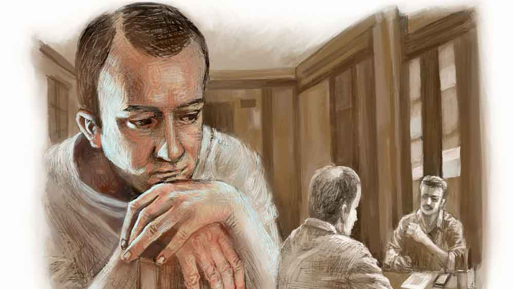

 
 <h1 align=center>লকডাউনে অভিনয়</h1>
<h2 align=center>শুভাশিস চট্টোপাধ্যায়</h2> চাকরিটা অবশেষে আর টিকল না। দিন কয়েক ধরেই কানাঘুষো শুনছিল দেবাশিস, ম্যানেজমেন্ট লোক কমাতে চায়। প্রায় তিন মাস লকডাউন চলার পর অর্থনীতির বড় করুণ দশা। এই অবস্থায় তার মতো বুড়ো মালকে কে আর বসিয়ে বসিয়ে মাইনে দিতে চায়? দেবাশিস একটি বহুজাতিক সংস্থার সেলস এগজ়িকিউটিভ। গালভরা নাম, আদতে ফেরিওয়ালা। কাজটা মন্দ চলছিল না। কিন্তু কোভিডের ধাক্কায় সব এলোমেলো হয়ে গেল। এইচ আর-এর ঘর থেকে যখন ডাক এল তখনই মন শক্ত করে নিয়েছিল সে। এইচ আর হাসি-হাসি মুখে চা-সহ আপ্যায়নের পর জানালেন, “আপনি তো সবই জানেন দেবাশিসবাবু। কোম্পানি এত বার্ডেন সামলাতে পারছে না। তাই ম্যানেজমেন্ট আর আপনাকে রাখতে চায় না। আপনার কেরিয়ারের কথা ভেবে ম্যানেজমেন্ট টার্মিনেশন করছে না, আপনাকে রিজ়াইন করতে বলছে। কোম্পানি তো আপনার সমস্ত বকেয়া মিটিয়ে দিচ্ছেই, উপরন্তু দু’মাসের অগ্রিম টাকাও দিচ্ছে। মানে তিন মাসের মাইনে সঙ্গে পাওনা ছুটিছাটা যোগ করলে প্রায় চার মাসের বেতন। আর দু’মাস পর প্রভিডেন্ট ফান্ডের টাকার জন্য আপনি তো অ্যাপ্লাই করতেই পারবেন। আর চিঠিটাও আপনার বয়ানে রেডি। আপনি শুধু চট করে সাইন করে ডেটটা বসিয়ে দিন, ব্যস!”

সুশান্তর এলেম আছে। তাই তো অল্প বয়সে সিনিয়রদের ডিঙিয়ে একেবারে কোম্পানির এইচ আর-এর হেড। ক্যালকুলেটর খুলে পাঁচ মিনিটের মধ্যেই দেবাশিসকে পাওনাগন্ডার হিসেব বুঝিয়ে দিল সে। এইচ আরের চেম্বারে ঢোকার বিশ মিনিটের মধ্যেই দেবাশিসের হাতে চলে এল রেজ়িগনেশন অ্যাকসেপ্ট করার লেটার। ম্যানেজমেন্ট তার আর্জি গ্রহণ করে তাকে চাকরি থেকে অব্যাহতি দিয়েছে। সঙ্গে ফিন্যান্স ডিপার্টমেন্টের সঙ্গে যোগাযোগ করে পাওনা বুঝে নিতেও পরামর্শ দিয়েছে। তার ভবিষ্যৎ জীবন যাতে আরও সুখের হয় তার জন্য শুভ কামনাও জানিয়েছে ম্যানেজমেন্ট। ফিন্যান্স ডিপার্টমেন্টের সামনে অসীম সেনের সঙ্গে দেখা। তার থেকে বছর পাঁচেকের জুনিয়রই হবে।

অসীম তাকে দেখে বলল, “তোমারটাও গেল!”

দেবাশিস বলল, “হুম। আর কে কে লিস্টে আছে কিছু শুনলি?”

অসীম বলল, “সে লম্বা লিস্ট। সব ডিপার্টমেন্ট থেকেই এক জন, দু’জন করে উইকেট নিয়েছে। এ যাত্রায় যারা বেঁচে গেল, তারা আসলে জিয়নো মাছ, বুঝলে। আজ না হয় কাল, না হয় পরশু, তারাও মরবে।” ম্লান হাসল অসীম।

আজ দেবাশিসের বাড়ি ফেরার তাড়া নেই। কাল থেকে তো অখণ্ড অবসর। বাস থেকে নেমে রিকশায় না উঠে হাঁটা লাগাল সে। একটাই চিন্তা— বাড়িতে মা, বৌ, মেয়েকে কেমন করে কথাটা বলবে সে।

*****

দিন সাতেক একটু রেস্ট নেবে ভেবেছিল দেবাশিস। কিন্তু তিন দিনও পেরোল না। বৌয়ের গুঁতো খেয়ে ফের চাকরির সন্ধানে বেরোতে হল তাকে। বৌয়ের কোন বান্ধবীর জামাইবাবু নাকি টলিউডের নামী প্রযোজনা সংস্থার মেজকর্তা। বান্ধবী দেবাশিসের নাম বলে রেখেছে। বলেছে, আজই সন্ধে সাতটায় ইন্দ্রপুরী স্টুডিয়োয় ওঁর সঙ্গে গিয়ে দেখা করবে।

শুনে দেবাশিস আকাশ থেকে পড়ল, “তোমার কি মাথা খারাপ হয়েছে? আমি সেলসে পনেরো বছর ধরে চাকরি করছি, ফিল্ম ইন্ডাস্ট্রিতে আমি কী কাজ করব? এই বয়সে কেউ হিরোর পার্ট দেবে?”

সুস্মিতা ভেংচে উঠল, “বাবুর শখ দেখো বলিহারি! একেবারে হিরোর রোল চায়! ইন্ডাস্ট্রিতে অনেক কাজ। স্পট বয় থেকে স্ক্রিপ্ট রাইটিং। না হলে মরা মানুষের রোলে কাজ করবে। শিফ্ট-পিছু পেমেন্ট। মোদ্দা কথা পুরুষ মানুষ ঘরে বসে খেতে পারবে না।”

অগত্যা বউয়ের ধাতানি খেয়ে বেরোতেই হল দেবাশিসকে। নামটা বার বার বলে দিয়েছে বৌ। মিস্টার এ সেন। পুরো নামটা জানতে চেয়েছিল দেবাশিস, কিন্তু তার বদলে ফের মুখঝামটা খেয়েছে। তাই আর বেশি কথা বাড়ায়নি। জানেই চাকরিটা হবে না। তাও বৌয়ের মুখ বন্ধ করতে যাওয়া। নির্দিষ্ট সময়েই এ সেনের অফিসে পৌঁছে গেল সে। রিসেপশনিস্টের কাছে নামটা বলতেই সুন্দরী রিসেপশনিস্ট হেসে জিজ্ঞেস করল, “অ্যাপয়েন্টমেন্ট করা আছে স্যর?”

দেবাশিস স্মার্ট থাকার আপ্রাণ চেষ্টায় বলল, “ইয়েস। প্লিজ় স্যরকে বলুন, সুমনা ম্যাম পাঠিয়েছেন। আমার নাম দেবাশিস চৌধুরী।”

ফোনে বোধ হয় রিসেপশনিস্টের সঙ্গে এ সেনেরই কথা হল। ফোন রেখে রিসেপশনিস্ট মেয়েটি তেমনই হেসে বলল, “একটু বসুন স্যর। উনি মিটিংয়ে ব্যস্ত আছেন। মিটিং শেষ হলেই আপনাকে ডাকবেন।”

দেবাশিস ভাবছিল, অফিসে এমন সুন্দরী রিসেপশনিস্ট থাকলে মন এমনিতেই ভাল হয়ে যায়। মিনিট পনেরো পরে ডাক এল। এক কর্মী তাকে পথ দেখিয়ে মিস্টার সেনের চেম্বারের দিকে নিয়ে গেল। কাচের পাল্লার ও ধারেই বসে আছেন, ফোনে কারও সঙ্গে কথা বলছেন। মুখটা পুরো দেখা যাচ্ছে না। কিছু ক্ষণ পর সামনে ঘুরলেন। দেবাশিসের বুকের মধ্যে যেন একশো হাতুড়ির ঘা পড়ল। এ কী! এ তো স্কুলের বন্ধু অনুপম। অনুপম সেন। সারা স্কুল জীবনে লড়ালড়ির সম্পর্ক। মারামারি কম হয়েছে শালার সঙ্গে! ছোট থেকেই হামবড়া স্বভাব। অন্যকে চিমটি কেটে কথা বলা। মুহূর্তের মধ্যেই দেবাশিস ঠিক করে ফেলল, এর কাছে চাকরির জন্য হাত পাতা যাবে না। যা থাকে কপালে। স্কুল ছাড়ার পর দু’জনের মধ্যে কোনও সম্পর্কই নেই। দেবাশিস ঠিক করল ফিরে যাবে। ঠিক সেই মুহূর্তে দরজা খুলে আর্দালি বলল, “স্যর আপনাকে ডাকছেন।”

দরজা খুলে গুটিগুটি ভিতরে ঢুকল দেবাশিস। অনুপম তাকে দেখে হাঁ হয়ে গেল। কয়েক মুহূর্ত পরে বলল, “আরে তুই? দেবাশিস না?”

দেবাশিস একটু হেসে বলল, “চিনতে পেরেছিস তা হলে।”

“আরে শালা, তোকে চিনব না? স্কুল লাইফে আমার পয়লা নম্বরের দুশমন!” বলেই হো হো করে হেসে উঠল অনুপম।

দেবাশিসও হেসে ফেলল।

“আরে, দাঁড়িয়ে কেন? বোস বোস। তার পর আছিস কেমন? তা কী মনে করে?” বলেই টেবিলের পাশের বেলটা দু’বার বাজাল অনুপম। বেয়ারা এসে জিজ্ঞেস করল, “ডাকছিলেন স্যর?”

অনুপম দেবাশিসের দিকে তাকিয়ে বলল, “বল, চা না কফি?”

দেবাশিস বলল, “সূর্যাস্তের পর চা-কফি আমি খাই না।”

অনুপম হেসে বলল, “তা হলে এক দিন আমার বাড়ি আয়, দুই বন্ধু মিলে বসি। তবে যা গরম পড়েছে, এখন তা হলে ঠান্ডাই খা...” বলে অনুপম বেয়ারাকে দুটো কোলড্রিঙ্ক আনতে বলে দিল।

ঘরে মুখোমুখি ও আর অনুপম। অনুপম হঠাৎ গলা নামিয়ে বলল, “তোকে কি সুমনা পাঠিয়েছে?”

মরেছে! সুমনার কথাটা মনে রেখেছে। মনে মনে প্রমাদ গুনল দেবাশিস। কিন্তু এখন তো ধরা দিলে চলবে না। দেবাশিস অবাক হওয়ার ভান করে বলল, “কে সুমনা?”

অনুপম একটু অবাক হল, কিছুটা বা কনফিউজ়ড। বলল, “ও তাই তো। তুই সুমনাকে চিনবি কি করে? আমার শালি হয়। আসলে আজ সকালে ফোন করে বলল দেবাশিস চৌধুরী বলে এক জন দেখা করতে আসবে।”

দেবাশিস হেসে বলল, “পৃথিবীতে কি আমিই একমাত্র দেবাশিস চৌধুরী আছি রে ভাই! আরও কত আছে।”

অনুপম হেসে বলল, “তাই তো। কিন্তু কোইন্সিডেন্সটা দেখ। আজই সেই দেবাশিস চৌধুরী বলে লোকটার আমার কাছে চাকরির জন্য আসার কথা ছিল। বুঝিসই তো শালির আবদার। না রাখলেই বাড়িতে অশান্তি। তাই আসতে বলেছিলাম। আসলে দেখছি-দেখব বলে ফুটিয়ে দিতাম। চাকরি কি এখন ছেলের হাতের মোয়া! চিনি না, জানি না, কেউ এসে চাকরি চাইলেই হল?”

দেবাশিস শুকনো হেসে বলল, “বটেই তো! কত জনকেই বা তুই চাকরি দিবি। দেশে চাকরির যা হাল।”

অনুপম হেসে বলল, “সেটা তো তুই-আমি বুঝি। কিন্তু বৌ শালি কি আর সে কথা বোঝে। তা তুই হঠাৎ কী মনে করে আমার কাছে?”

“এমনিই। এ দিকে একটু কাজে এসেছিলাম। রাজীব আর ভাস্করের কাছে তোর অনেক কথা শুনি। ভাবলাম এক বার দেখা করে যাই। দেখি চিনতে পারিস কি না।”

অনুপম হাসল, “তোদের কি ভুলতে পারি রে! প্রতি বারেই ভাবি স্কুলের রি-ইউনিয়নে যাব। পুরনো বন্ধুদের সঙ্গে আড্ডা মারব, কিন্তু সময় আর হয়ে ওঠে না। রাজীব, ভাস্করের ফোন নম্বর আছে তোর কাছে?”

“রাজীবেরটা আছে, ভাস্করেরটা নেই। আগে ছিল, পুরনো ফোনটা চুরি যাওয়ায় এখন আর নেই।”

“আচ্ছা তোর আর রাজীবের নম্বরটাই দে। রাজীবকে ফোন করে তথা, ধৃতি, টেনি, সত্রা, অরিজিতের ফোন নম্বর পেয়ে যাব নিশ্চয়ই। তা ভাল কথা, তুই এখন কী করছিস?”

কালই চাকরি গেছে, কিন্তু সে কথা গোপন করে পুরনো কোম্পানির নামই বলল দেবাশিস।

অনুপম বলল, “তোর কোনও কার্ড আছে?”

পার্স হাতড়ে সদ্য প্রাক্তন কার্ডটাই তুলে দিল দেবাশিস। নিজের অভিনয়গুণে নিজেই চমকিত হয়ে উঠছে সে।

অনুপম জিজ্ঞেস করল, “আর স্কুল লাইফের বান্ধবীদের খবর কী? রাখী, কেকা, মিতালি, শ্রেয়সী, রুবি, মনীষা... এদের সঙ্গে কোনও যোগাযোগ আছে?”

মাথা নাড়ল দেবাশিস, “বছর দুয়েক আগে রুবির সঙ্গে যোধপুর পার্কে দুর্গাঠাকুর দেখতে গিয়ে দেখা হয়েছিল। এখনও নিজেকে কচি রেখেছে। জিম-টিম করে। আমাকে ওর পাশে কাকু মনে হচ্ছিল!” মাথার অর্ধবৃত্তাকার টাক দেখিয়ে হাসে দেবাশিস।

অনুপম বলে, “দূর! তোর তো শুধু টাক পড়েছে, তাও অর্ধেকটা। আমাকে দেখ, কেমন ভুঁড়ি হয়ে মুটিয়ে গেলাম রে। কে বলবে সবেমাত্র পঁয়তাল্লিশে পা দিয়েছি আমরা।” দুই বন্ধুই হেসে ওঠে। কথায় কথায় দেড় ঘণ্টা কেটে যায়। ঘড়িতে পৌনে ন’টা বাজতে চলল। সে দিকে নজর পড়তেই লাফিয়ে ওঠে দেবাশিস, “আরে, রাত হয়ে গেল যে। আমাকে এ বার উঠতে হবে।”

অনুপম বলল, “যাবি কোথায়?”

দেবাশিস ম্লান হেসে বলল, “আর কোথায়! সেই পৈতৃক বাড়ি যাদবপুরেই। ভাগ্যিস বাবা বাড়িটা করে দিয়ে গিয়েছিল, তাই মাথার উপর আশ্রয়টা আছে এখনও।”

“আরে আর একটু বোস। আমার গাড়িতে তোকে নামিয়ে রুবি চলে যাব। ওখানে একটা থ্রি-বিএইচকে ফ্ল্যাট কিনেছি।”

দেবাশিস ব্যস্ত হয়ে বলল, “আরে না না, তার আর দরকার নেই। অন্য এক দিন আড্ডা মারতে তোর বাড়ি যাব। মেয়েটা ক্লাস টেনে উঠেছে। রানিকুঠিতে প্রাইভেট টিউশন নিতে আসে। ভাবছি রোজ তো একা একা ফেরে। আজ ওকে নিয়েই বাড়ি যাব।”

 

বাড়ি ফিরতেই বৌ জিজ্ঞেস করল, “কী হল?”

দেবাশিস আবেগহীন গলায় বলল, “উনি পরের সিরিয়ালে আমার জন্য ট্রাই করবেন বলেছেন।”

সাতসকালেই বৌয়ের ধাক্কায় ঘুম ভাঙল দেবাশিসের, “ওঠো ওঠো, এ সেন ফোন করেছিলেন। তোমাকে এক্ষুনি ফোন করতে বলেছেন।”

অনুপম এত সকালে কেন আবার ফোন করল? রিং ব্যাক করতে করতে কথাটা ভাবছিল দেবাশিস। দু’বার ফোনটা বাজতেই ধরল অনুপম, “কী রে বুদ্ধু! নিজেকে বড় অভিনেতা ভাবছিস না কি আজকাল?”

দেবাশিস থতমত খেয়ে বলল, “কেন বল তো?”

“ফোনে এত কথা হবে না। আমি পরিচালক শিবতোষ সামন্তকে তোর কথা বলে দিয়েছি। সিরিয়ালের সাইড রোলের জন্য নতুন মুখ খুঁজছে।কালই তোর স্ক্রিন টেস্ট। এক নম্বর স্টুডিয়োয় সকাল সাড়ে ১১টায় পৌঁছে যাস কিন্তু।”

দেবাশিস আমতা আমতা করে বলে, “কিন্তু স্কুলে একবার অ্যানুয়াল ফাংশনে আর পাড়ার ক্লাবে দু’-এক বার ছাড়া তো আমি কখনও অভিনয় করিনি রে অনু। আমি কি অভিনয় পারব?” “আলবাত পারবি। শালা কাল অভিনয় করে আমাকে ঘোল খাওয়ালি, আর আজ ন্যাকামি করে বলছিস, আমি কি অভিনয় পারব?”

ফোন হাতেই দু’চোখে অশ্রুর প্লাবন নামে দেবাশিসের।

সুস্মিতা বলল, “কী হল আবার তোমার? সাতসকালে বাচ্চা ছেলের মতো ভেউভেউ করে কাঁদছ কেন?”

হাতের চেটো দিয়ে চোখের জল মুছতে মুছতে দেবাশিস উত্তর দিল, “অভিনয়টা প্র্যাকটিস করছি বুঝলে গিন্নি। কাল যে স্ক্রিন টেস্টের জন্য ডাক এসেছে আমার।”