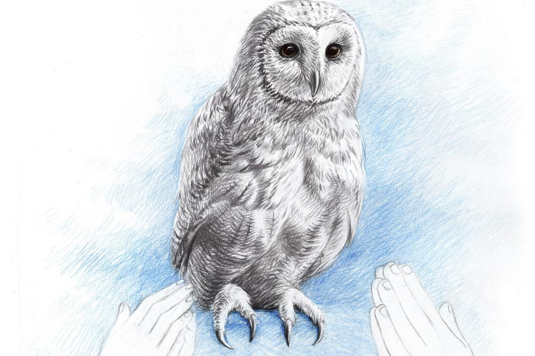

 
 <h1 align=center>লক্ষ্মীপেঁচা</h1>
<h2 align=center>গৌতম বন্দ্যোপাধ্যায়</h2> মা... এক বার এ দিকে আসবে?”

টেঁপির গলা পেয়ে, তারাসুন্দরী রান্নাঘর থেকে বলে উঠল, “সাতসকালে হলটা কী তোর? ডাকছিস কেন? কাজ করতে দিবি না না কি!”

“এসো না এক বার, উড়ে যাবে!” টেঁপির গলায় চাপা উত্তেজনা।

“উড়ে যাবে... কী উড়বে?” তারাসুন্দরীর গলায় বিস্ময়।

“তুমি এসো না এক বার...” টেঁপির কণ্ঠস্বরে এ  বার কাতরতা।

“যাই... যাই,” বলে, কড়াটাকে ঢিমে আঁচে বসিয়ে হাত ধুয়ে, নিজের কাপড়ে সেই জল-হাত মুছতে মুছতে তারাসুন্দরী পা বাড়াল।

“কই, কী হয়েছে কী... চেঁচাচ্ছিস কেন?” টেঁপির পাশে এসে বলল তারাসুন্দরী।

টেঁপি মুখে আঙুল দিয়ে চুপ করতে ইঙ্গিত করল মাকে। তার পর খুব আস্তে আস্তে বলল, “গিজ়ারের ওপর দেখো।”

টেঁপির নির্দেশের সঙ্গে সঙ্গেই তারাসুন্দরীর চোখ চলে গেল গিজ়ারের মাথায়। হতবাক হয়ে খানিক ক্ষণ সে দিকে তাকিয়ে থেকে বলে উঠল, “ও মা, এ তো লক্ষ্মীপেঁচা মনে হচ্ছে! কী সৌভাগ্য আমাদের! বাবাকে এক বার ডেকে আনবি?”

টেঁপি দৌড়ল বাবাকে ডাকতে।

বাবা তখন মন দিয়ে দাড়ি কামাচ্ছিল। এক দিকের গাল সবে কামিয়েছে, এমন সময়ে টেঁপি এসে বলল, “বাবা, পেঁচা!”

টেঁপির দিকে অবাক চোখে তাকিয়ে টেঁপির বাবা অভয়তারণ বলে উঠল, “পেঁচা!... কোথায়? দিনের বেলায়? তোর কি মাথা খারাপ হয়েছে?”

টেঁপি বলল, “বাথরুমে গিজ়ারের মাথায় বসে আছে। তুমি এক বার দেখবে চলো।”

অভয়তারণ একগাল সাবানমাখা অবস্থায় দৌড়ল বাথরুমের দিকে। তারাসুন্দরীর ঘাড়ের উপর দিয়ে মুখ বাড়িয়ে গিজ়ারের মাথায় বসে থাকা নির্বিকার পাখিটির দিকে দৃষ্টি নিবদ্ধ রেখে বলে উঠল, “এ তো লক্ষ্মীপেঁচা। ঢুকল কী করে?”

“কেন, ঢুকল বলে কি তোমার কষ্ট হচ্ছে?” তারাসুন্দরী মুখটাকে বিকৃত করে বলল।

“যাব্বাবা! কষ্ট হতে যাবে কেন? বাথরুমের মাথায় তো ওই একটা মাত্র খোলা জায়গা, তাও সেখানে এগজ়স্ট ফ্যান। এল কী করে?”

“সেটা জেনে তোমার কী হবে? ভগবান যখন সদয় হন, তখন এমন ভাবেই হন। মা লক্ষ্মী স্বয়ং তার বাহনকে পাঠিয়েছেন। আমাদের আর কোনও চিন্তা নেই, দেখো।”

“মা, আমি এখন চান করব কী করে? চান করতে গেলে যে পাখিটা উড়ে যাবে। আমার তো স্কুলের দেরি হয়ে যাবে!” টেঁপি তার অসহায় অবস্থার কথা জানাল।

“চান আর আজকে তোকে করতে হবে না,” তারাসুন্দরী সবল কণ্ঠে ঘোষণা করল।

‘‘সে কী! এই গরমকালে চান না করে স্কুলে যাবে? আমাকেও তো চান করতে হবে। না কি চান না করে, অফিস যাওয়া বন্ধ করে পেঁচার দিকে তাকিয়ে বসে থাকব?” অভয়তারণ বলে উঠল।

তারাসুন্দরী ঘুরে দাঁড়াল। একেবারে অভয়তারণের মুখোমুখি। বলল, “দরকার হলে তা-ই করবে। পাখিটা যাতে উড়ে গিয়ে পাশের বাড়িতে না বসে, সেটা লক্ষ রাখা তোমার অফিস যাওয়ার থেকে বেশি দরকারি, বুঝলে! করো তো কেরানির চাকরি। এমন ভাব দেখাও, যেন বিরাট অফিসার।”

“আচ্ছা! এই কেরানির জন্যই তো এক দিন...”

অভয়তারণকে বাক্য শেষ করতে না দিয়ে, তারাসুন্দরী তারস্বরে চেঁচিয়ে উঠল, “মেয়েটা যে দাঁড়িয়ে আছে, সে দিকে খেয়াল আছে? বুড়ো বয়সে ভীমরতি ধরেছে। সে দিন যদি বোঝার বয়স থাকত!”

“মা, আমি কি আজ বারান্দায় চান করে নেব?” টেঁপি বলল।

“সেই ভাল, তুই আজ বারান্দায় চান করে নে।”

চান-সমস্যার সমাধান যে এত সুন্দর করে টেঁপি করে দেবে, তা তারাসুন্দরীও ভাবতে পারেনি। অভয়তারণকে শুনিয়ে শুনিয়ে বলল, “দেখেছ, একে বলে শিক্ষা। কেমন অ্যাডজাস্টমেন্ট শিখিয়েছি দেখো। এক দিন বাথরুমে চান না-ই বা করলে। বারান্দায় কল আছে। তার নীচে বালতি বসিয়ে চান সেরে নেওয়া তো অসম্ভব নয়। ওইটুকু মেয়ের যা বুদ্ধি আছে, তোমার তা নেই।”

বারান্দায় কলের আগমন ওয়াশিং মেশিনের জন্য।

পাশের বাড়িতে ওয়াশিং মেশিনে কাপড় কাচা হয়, এ নিয়ে তারাসুন্দরীর দুঃখের অন্ত ছিল না। ইনিয়ে বিনিয়ে অনেক বার অভয়তারণের কানে তোলার চেষ্টায় কোনও কাজ হয়নি। শেষে এক দিন সরাসরি বলেছে, “তোমার কি কোনও লজ্জা নেই?”

অভয়তারণ বলেছে, “কেন, লজ্জা থাকবে না কেন? অবশ্যই আছে। না থাকলে কি আর তোমার থেকে এত দূরে বসে থাকতাম?”

তারাসুন্দরী ফোঁস করে উঠেছে, “ওই লজ্জার কথা বলছি না। আমি বলছিলাম যে, পাশের বাড়িতে যে ওয়াশিং মেশিন এসেছে, সে খবরটা কি জানা আছে?”

“হ্যাঁ, জানি তো, পরশু ভাইয়ের সঙ্গে দেখা হয়েছিল বাজারে। সেখানেই বলল।”

“তা হলেই বোঝো, কতটা নির্লজ্জ বেহায়া তুমি! মান-অপমান বোধটুকুও নেই তোমার।”

“যাব্বাবা, এতে মান-অপমানের কী আছে? ওয়াশিং মেশিন কিনেছে, আমার সঙ্গে দেখা হতে সেটা বলেছে। বাড়ি বয়ে এসে কি বলে গেছে?”

“সেটাও বলে যেত, কারণ তোমার ভাই জানে যে, তোমার কেনার ক্ষমতা নেই।”

তারাসুন্দরীর ভাষায় পাশের বাড়ি বলতে, অভয়তারণের সহোদর বিপদতারণের বাড়ি। শ্বশুর-শাশুড়ি বেঁচে থাকতে, একটাই বাড়ি ছিল। ওদের মৃত্যুর পর, দুই ভাইয়ের মধ্যে লেগে গেল বিবাদ, অশান্তি। তার পর এক প্রতিবেশীর মধ্যস্থতায় দুই ভাইয়ের মধ্যে ভাগাভাগি হল। মাঝখানে, যাতে কেউ কারও মুখ দেখতে না পায়, তার জন্য একটা বড় পাঁচিল উঠল। দুই জায়ের মধ্যে মুখ দেখাদেখি বন্ধ হল। কথা আগেই বন্ধ হয়েছিল। দুই ভাইয়ের মধ্যে অবশ্য কদাচিৎ একটু-আধটু নিয়মরক্ষার কথাবার্তা চলত। তবে সেই থেকে তারাসুন্দরীর কাছে ওটা পাশের বাড়ি হয়ে গেল।

অভয়তারণের লজ্জা এবং অপমানবোধ ছিল বলেই, সে দিনই একটা ইলেকট্রনিক গুডসের দোকানে ঢুঁ মেরে জেনে এসেছিল ওয়াশিং মেশিন সম্বন্ধে। দরদস্তুরও করে এসেছিল। হরি বলে যে ছোকরাটি কলের কাজ করে, তাকেও ডেকে পাঠিয়েছিল। তারাসুন্দরীর নির্দেশমতো বারান্দায় একটি কলের লাইনও টেনে দিয়েছিল হরি। তবু ওয়াশিং মেশিন আসেনি। তারাসুন্দরীই আনতে দেয়নি।

রাত্রিবেলায় খাবার টেবিলে অভয়তারণ যখন ওয়াশিং মেশিন কেনার লেটেস্ট আপডেট ঘোষণা করে এবং কবে, কোন দোকান থেকে, কোন কোম্পানির ওয়াশিং মেশিন কিনতে চলেছে, সেটা জানায়, টেঁপি আনন্দে হাততালি দিয়ে ওঠে, কিন্তু তারাসুন্দরী কোনও কথা বলে না। স্ত্রীকে নির্বাক থাকতে দেখে সন্দেহ হয় অভয়তারণের। বলে, “কী ব্যাপার, মুখে কোনও কথা নেই কেন? বিশ্বাস হচ্ছে না? কাল যদি তোমার ওয়াশিং মেশিন না এনে দিই, তো আমাকে...”

অভয়তারণকে কথা শেষ করতে না দিয়ে তারাসুন্দরী বলে উঠেছিল, “থাক, কেনার দরকার নেই।”

“মানে?” অভয়তারণ আকাশ থেকে পড়েছিল।

অভয়তারণের  বাটিতে এক টুকরো মুরগির মাংস দিয়ে তারাসুন্দরী বলেছিল, “ওয়াশিং মেশিনে ভাল পরিষ্কার হয় না। জল আর সাবানও লাগে খুব বেশি। দাম দিয়ে কেনা হবে, শেষে দেখা যাবে পড়ে রইল। সেই হাতে কাচতে হচ্ছে।”

“তোমাকে এ সব বলল কে?”

“টুকুসের মা, মলিনাদি।”

“মলিনাদিরও কি ওয়াশিং মেশিন আছে না কি?”

“না। মলিনাদি পাশের বাড়ি থেকেই শুনেছে।”

ওয়াশিং মেশিন কেনা তার পর মুলতুবি থাকলেও, জলের কলটি থেকে গেল বারান্দায়।

“তুমিও বারান্দায় চান করে অফিস বিদেয় হও,” তারাসুন্দরীর স্পষ্ট নির্দেশে অভয়তারণ ফিরে এল অতীত থেকে।

একটু আমতা আমতা করে বলল, “বারান্দায় চান করব কী করে?”

“যেমন ভাবে টেঁপি করবে। যেমন ভাবে আমি করব!” তারাসুন্দরী একটা অদ্ভুত মুখভঙ্গি করে বলে।

অকাট্য যুক্তি। তবু অভয়তারণ শেষ চেষ্টা করে, “আমার তো সকালবেলা ওইটা হয়নি। বারান্দায় না হয় চান হল, কিন্তু ওইটা?”

অভয়তারণের এই কথাকে পাত্তা না দিয়ে আরও নিবিষ্ট মনে পেঁচাটার হাবভাব দেখতে লাগল তারাসুন্দরী, “দেখো, কেমন সুন্দর! চোখগুলো ঢুলুঢুলু। তুমি নিশ্চিত যে, এটা লক্ষ্মীপেঁচা?”

“অন্য পেঁচারা এত সাদা হয় না,” অভয়তারণ বেজার মুখে এ কথা বললেও, মনে মনে বলল, ‘লক্ষ্মীপেঁচা না হলেই ভাল হত।’

কিছু ক্ষণের মধ্যেই ওদের বাড়িতে লক্ষ্মীপেঁচা আসার খবরটা কী করে যেন চাউর হয়ে গেল।

পাশের বাড়ি থেকে বিপদতারণের বৌ দু’-চার বার উঁকিঝুকি মারার ব্যর্থ চেষ্টা করে শুনিয়ে শুনিয়ে বলল, “লক্ষ্মীপেঁচা না ছাই! তার আর খেয়ে-দেয়ে কাজ নেই যে, ও বাড়িতে বসবে। কোনও পুজোআচ্চার বালাই নেই, ও বাড়িতে আসবে লক্ষ্মীর বাহন!”

উল্টো দিকের বারান্দায় আর একটি মুখ। অসুস্থতার কারণে, ভদ্রমহিলা খুব একটা চলাফেরা করেন না। লক্ষ্মীপেঁচার খবরে তিনিও আজ বারান্দায়। পারলে এ বাড়ি চলে আসেন। বিপদতারণের স্ত্রীকে বলেন, “এ ঘোর কলিকাল ভাই। ও সব ভেবে লাভ নেই। যারা যত খারাপ, তাদের তত ভাল হয়।”

বারান্দায় চান করতে করতে, সবই কানে আসছে অভয়তারণের। সবই ঈর্ষা। ওদের বাড়িতে লক্ষ্মীপেঁচা এলে, তারাসুন্দরী ওদের ভূমিকাই নিত। ভাগ্যিস এই সব কথোপকথন তারাসুন্দরীর কানে পৌঁছচ্ছে না! তা হলে আর রক্ষে থাকত না।

চানের পর অফিসের জামাকাপড় পরতে পরতে অভয়তারণ শুনতে পেল, তারাসুন্দরী চিৎকার করছে, “এ দিকে এক বার আসবে। পেঁচাটা কেমন ছটফট করছে।”

অভয়তারণ বলতে যাচ্ছিল, বোধহয় লক্ষ্মীদেবী এসে ওর পিঠে বসেছেন। বলল না। যেটা বলে ফেলল, সেটা হল, “বোধহয় ওর খিদে পেয়েছে।”

ব্যস, বলেই অভয়তারণ বুঝল, কী ভুল সে করে বসল। কারণ, তারাসুন্দরী তারস্বরে টেঁপির উদ্দেশে চেঁচিয়ে বলল, “পেঁচা কী খায় রে?”

টেঁপি বেচারি স্কুলের ব্যাগ গোছাচ্ছিল। মায়ের চিৎকারে সাড়া দিল। বলল, “জানি না তো, মা।”

“জানো না তো আর  লেখাপড়া করছ কেন?” তারাসুন্দরী খেঁকিয়ে উঠল।

“ইঁদুর,” চুল আঁচড়াতে আঁচড়াতে বলল অভয়তারণ।

“মা গো! ইঁদুর? লক্ষ্মীর বাহনের এ কী রুচি! তুমি ঠিক জানো?”

“একটা ইঁদুর ছেড়ে দেখোই না সামনে।”

“না না! ও সব আমি পারব না। একটু গুগল সার্চ করে দেখো না আর কী খায়?”

“আচ্ছা, আমি কি আজ অফিস যাব না? তুমি কি ওই বাথরুমের দরজাতেই সারাক্ষণ দাঁড়িয়ে থাকবে?”

“দরকার হলে তা-ই থাকব। মা লক্ষ্মী তাঁর বাহনকে পাঠিয়েছেন। তার দেখভাল করব না তো কি তোমাদের করব? খাবার চাপা দিয়ে রাখা আছে, নিজেরা বেড়ে খেয়ে নাও। আমি দেখি ওকে কী খাওয়ানো যায়।”

“মা, আমি কি তোমার মোবাইলটা দিয়ে যাব?” টেঁপি বাবার দিকে চেয়ে হাসি চেপে বলে।

“দিয়ে যা তো মা, দেখি গুগলে...” তারাসুন্দরী বলে।

খাওয়াদাওয়া করে বাপ-মেয়ে এক সঙ্গেই বেরিয়ে যায়। তারাসুন্দরী তখনও গুগল ঘেঁটে পেঁচার খাবার খুঁজে চলেছে।

 

সন্ধেবেলায় অফিস থেকে ফিরে অভয়তারণ দেখল, তারাসুন্দরী পেঁচার মতো মুখ করে বসে আছে। কারণ জিজ্ঞেস করতে, তারাসুন্দরী বলল, “উড়ে গেছে।”

“কী করে? তোমার চোখ এড়িয়ে পালিয়ে গেল! কী সাহস!”

“খাওয়াতে গিয়ে।”

“তুমি কি সত্যি ইঁদুর ধরে পেঁচাটাকে খাওয়াতে গেছিলে?”

“গুগলে দেখলাম, পেঁচা শুধু ইঁদুর নয়, অনেক কিছুই খায়। ফ্রিজে একটু চিকেন রাখা ছিল, সেটা ধুয়ে ভাবলাম, পাখিটাকে দিয়ে দিই। ফ্রিজ থেকে চিকেনটা বার করে ধুতে গেছি, পাঁচ মিনিটও হবে না। ফিরে এসে দেখি, সে নেই। উড়ে গেছে। আমি নিশ্চিত যে, পাশের বাড়িতে গিয়ে বসেছে!” তারাসুন্দরীর চোখে জল চিকচিক করে।

অভয়তারণ অপলক দৃষ্টিতে তাকিয়ে থাকে স্ত্রীর দিকে। বহু দিন আগের সেই যৌবনের এক রাতের কথা তার মনে পড়ে যায়। বাবা-মার আপত্তি থাকায় তারাসুন্দরী পালিয়ে বিয়ে করেছিল অভয়তারণকে। ফুলশয্যার খাট সাজিয়ে দিয়েছিল অভয়তারণের বন্ধুরা। সে দিন তারাসুন্দরীর সঙ্গে অন্তরঙ্গ হওয়ার আগে হঠাৎ অভয়তারণ লক্ষ করেছিল, তারাসুন্দরীর চোখে জল। অভয়তারণ অবাক হয়ে গেছিল। জিজ্ঞেস করেছিল, “চোখে জল কেন তোমার, তারা?”

তারাসুন্দরী প্রথমে বলতে চায়নি। তার পর বলেছিল, “বাবা-মার জন্য মন কেমন করছে।”

কাছে টেনে নিয়েছিল অভয়তারণ তারাসুন্দরীকে। বলেছিল, “সব ঠিক হয়ে যাবে, তুমি দেখো।”

সত্যিই সব ঠিক হয়ে গিয়েছিল। তারাসুন্দরীর বাবা নিজে এসে সব মিটিয়ে নিয়েছিলেন। সে দিন থেকে অভয়তারণই ছিল তাঁদেরএকমাত্র ভরসা। অভয়তারণকে আমৃত্যু নিজের ছেলের মতোই মনে করতেন তাঁরা।

সেই ফুলশয্যার রাতের মতো আজও অভয়তারণ বলে উঠল, “কাঁদছ কেন তারা? কখনও না কখনও তো পাখিটা উড়ে যেতই। ও কি সারাক্ষণ থাকবে বলে এসেছে? মা লক্ষ্মী হয়তো কোনও বার্তা দিয়ে ওকে পাঠিয়েছেন আমাদের বাড়ি। সেটা যখন দেওয়া হয়ে গেছে, ওর আর থাকার প্রয়োজন কোথায়?”

তারাসুন্দরী কান্না-ভেজা অবাক চোখে তাকিয়ে থাকে অভয়তারণের দিকে। অভয়তারণ হাসতে হাসতে মাথা নাড়ে। কিছুই বুঝতে পারে না তারাসুন্দরী। তার চোখে প্রশ্ন।

অভয়তারণ হাসতে হাসতেই বলে, “প্রোমোশন পেলাম। কেরানি থেকে সুপারভাইজ়ার।”

“বলো কী! সত্যি?”

“মিথ্যে বলব কেন!”

“কত বাড়ল?”

অভয়তারণ হাতের পাঁচটা আঙুল দেখিয়ে বলে, “পাঁচ হাজার।”

তার পর শিকারি বেড়ালের মতো তারাসুন্দরীর দিকে এগিয়ে আসে।

“আ মরণ!” তারাসুন্দরী বলে, “লাজলজ্জা নেই... এই ভর সন্ধেবেলা... মেয়েটা কোচিং ক্লাস থেকে ফিরল বলে।”

অভয়তারণ এখন নির্ভীক, নির্লজ্জ পুরুষ।

“মা লক্ষ্মীর বাহন কিন্তু এমন কোনও বার্তা আমাকে দেয়নি,” তারাসুন্দরী হাসতে হাসতে বলে।

“এটাও উপরওয়ালার নির্দেশ। বেচারা পাখিটা জানত না...”

অভয়তারণ স্ত্রীকে আরও কাছে টেনে নেয়...